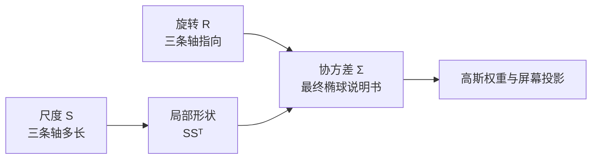
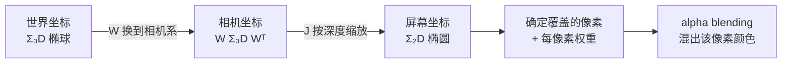

# 前置知识：3DGS 为什么使用协方差矩阵

> **一句话**：3D Gaussian Splatting（3DGS）里每个小斑点要说明"我沿各个方向有多宽、朝哪个方向歪"。在一维，一个数就够了；到了二维、三维，"宽度 + 朝向"这些数刚好排成一张方阵，这张方阵就是协方差矩阵。它不是统计学摆设，而是"多方向宽度"最省的写法。
>
> **想看更深入的完整推导**：如果想把 3DGS 的每一个细节（相机模型、雅可比、球谐函数、反向传播、密度控制、CUDA 实现）都学透，并配合可交互组件亲手验证，可以阅读系列文章 [3D 高斯溅射从零精通：3DGS 完整原理与工程实现](/系列/3dgs_from_scratch/index)，本文的协方差推导对应该系列的第 2、3、6 章。

已有的 [3D Gaussian Splatting 总览](/前置知识/007a_前置知识_3D_Gaussian_Splatting三维场景重建) 介绍了训练和 alpha blending。本文只回答一个更具体的问题：**为什么每个高斯要有协方差矩阵，而不是一个半径、三个独立半径，或者直接用网格？**

为了不一上来就砸出一个 `3×3` 矩阵，下面从最简单的一维开始，逐步升到二维、三维——每升一维，只多问一个问题，答案自然长成协方差矩阵。这一段读完，再看后面的杯子表面和相机投影就不抽象了。

## 一、从一维开始：一个高斯只需要一个数

先把维度砍到最低。在一根数轴上放一个高斯"软斑点"，中心在 `μ`，它只需要回答一个问题：**我有多宽？**

宽度用一个数 `σ²`（方差）表示。`σ²` 小，斑点又高又窄；`σ²` 大，斑点又矮又胖。就这么简单——一维世界里，"形状"这件事只有"宽度"一个自由度，一个数就说完了。

一维高斯的权重是：

$$
G(x) = \exp\!\left[-\frac{1}{2}\cdot\frac{(x-\mu)^2}{\sigma^2}\right]
$$

**这个公式在做什么**：给数轴上的每个点打分——离中心 `μ` 越近分越高（中心处正好是 1），离得越远分越低；`σ²` 控制"下降得多快"。

::: details 📐 公式详解（点击展开）

| 子表达式 | 它是谁 | 它在干嘛 |
|---|---|---|
| `x - μ` | **到中心的位移** | 把绝对坐标改成"离中心多远" |
| `(x-μ)²/σ²` | **按宽度折算的距离平方** | 同样走 1 米，`σ²` 越大这个数越小，说明"这个方向宽，走这点距离不算远" |
| `exp(-½·)` | **平滑衰减器** | 把距离平滑地压成 0~1 的权重，中心为 1，没有硬边界 |

**用人话读**："先量离中心多远（用 `σ²` 当尺子折算），再把这个距离平滑地变成一个越靠近越大的权重。"

**为什么除以 `σ²`**：`σ²` 就是"这个方向的尺子刻度"。除以它，等于先用斑点自己的宽度去量距离——宽的斑点容忍更远的点也算"近"。
:::

关键就一句话：**一维只有一个方向，所以"宽度"只需要一个数 `σ²`。** 记住这个"宽度 = 一个数"的直觉，下面升维时只是在重复这句话。

## 二、升到二维：一个数不够，先用两个数

现在把斑点放到一张纸上（二维平面）。它不再只有"左右"一个方向，而是有"左右"和"上下"两个方向。于是"我有多宽"这个问题要分开问两次：

- 沿 x 方向有多宽？→ 用 `σ_x²`
- 沿 y 方向有多宽？→ 用 `σ_y²`

两个方向、两个数。如果这两个数不相等，斑点就从"圆"变成"椭圆"——比如 x 方向宽、y 方向窄，就是一个横躺的椭圆。此时可以把这两个数摆成一个对角矩阵：

$$
\boldsymbol{\Sigma}_{\text{对角}}=\begin{bmatrix}\sigma_x^2 & 0\\ 0 & \sigma_y^2\end{bmatrix}
$$

**这个公式在做什么**：把"x 方向多宽、y 方向多宽"两个数装进一个方阵的对角线上，非对角先留空（写 0）。

::: details 📐 公式详解（点击展开）

| 子表达式 | 它是谁 | 它在干嘛 |
|---|---|---|
| 左上角 `σ_x²` | **x 方向的宽度** | 单独控制椭圆横向拉多长 |
| 右下角 `σ_y²` | **y 方向的宽度** | 单独控制椭圆纵向拉多长 |
| 两个 `0` | **暂时不耦合** | 说明"沿 x 走跟沿 y 的宽度互不影响"，椭圆的两条轴正好压在 x、y 坐标轴上 |

**用人话读**："对角线上放两个方向各自的宽度，非对角填 0，就得到一个横平竖直、不歪的椭圆。"

**为什么先摆成矩阵**：只是为了让"两个方向的宽度"有个固定的存放格式；真正让它比"两个散着的数"更有用的，是下面要加的非对角项。
:::

## 三、二维的痛点：对角矩阵画不出"歪着的椭圆"

对角矩阵只能画出横平竖直的椭圆——它的两条轴永远压在 x 轴和 y 轴上。可现实里的椭圆经常是**斜的**：一团点云沿着"右上方向"散开，既不是纯 x 也不是纯 y。这种"x 变大时 y 也跟着变大"的联动，两个孤立的宽度数字表达不了。

要让椭圆能歪，就得再补一个数：**协方差** `σ_xy`，专门记录"x 和 y 是不是一起变"。把它填进对角矩阵空着的两个角，就得到完整的二维协方差矩阵：

$$
\boldsymbol{\Sigma}=\begin{bmatrix}\sigma_x^2 & \sigma_{xy}\\ \sigma_{xy} & \sigma_y^2\end{bmatrix}=\begin{bmatrix}4 & 1.5\\ 1.5 & 1\end{bmatrix}
$$

**这个公式在做什么**：在两个方向宽度的基础上，用一个非对角数 `σ_xy` 记录"两个方向的联动强度"，从而让椭圆可以倾斜。

::: details 📐 公式详解（点击展开）

| 子表达式 | 它是谁 | 它在干嘛 |
|---|---|---|
| `4`、`1` | **两个方向的宽度** | 和对角矩阵一样，x 方向比 y 方向宽 |
| `1.5`（非对角） | **方向耦合强度** | "x 变大时 y 也一起变大"的程度；它一非零，椭圆的主轴就离开坐标轴、歪过去 |
| 对称的两个 `1.5` | **同一关系记两遍** | x 对 y 和 y 对 x 是同一件事，所以矩阵必须对称 |

**用人话读**："对角线管各方向多宽，非对角线管两个方向绑得多紧——绑得越紧，椭圆歪得越厉害。"

**为什么必须对称**：`σ_xy` 描述的是 x、y 这一对方向的共同变化，反过来问也是同一个数；对称性还保证这个矩阵能分解出互相垂直的主轴（马上第 3.1 节就用到）。
:::

### 3.1 关键问题：一堆横平竖直的数，凭什么能表示"歪着的椭圆"？

到这里必须停下来正面回答一个容易被糊弄过去的问题：矩阵里放的都是"沿 x 多宽、沿 y 多宽、xy 一起变多少"这种**贴着坐标轴**的数，它凭什么能表示一个**斜着的**椭圆？答案是：**一个歪椭圆，就是把一个正椭圆整体转一个角度得到的**；而"把正椭圆转一下"这件事，用矩阵写出来，结果会自动长出非对角项。这两件事是同一回事。

具体分三步（下图从左到右就是这三步）：

1. **先画一个不歪的正椭圆**：它的两条轴就压在 x、y 上，宽度是 `σ₁²`（长轴方向）和 `σ₂²`（短轴方向）。写成对角矩阵 `S²=diag(σ₁², σ₂²)`——没有非对角项，因为它不歪。
2. **把整个椭圆转 θ 角**：用一个旋转矩阵 `R(θ)` 把这个正椭圆连同它的两条轴一起转过去。转完之后，两条主轴不再对齐 x、y，椭圆就歪了。
3. **回到 x、y 坐标去"读"这个歪椭圆**：现在沿 x 走一点，椭圆的边沿 y 方向也跟着抬起来——x 和 y 被这次旋转"绑"在了一起。这个"绑在一起"的强度，正是读出来的非对角数 `σ_xy`。


> 三步连起来就是一句话：**歪椭圆 = 正椭圆 + 旋转**。左图是对角矩阵画的正椭圆（非对角 = 0）；中图把它转了 30°，主轴跟着歪；右图回到 x、y 坐标一读，矩阵变成 `[[3.35, 1.47],[1.47, 1.65]]`——那个 `1.47` 就是旋转"逼"出来的非对角项。你没有手动填旋转角，是旋转本身在矩阵里留下了非对角的痕迹。

把这三步用矩阵乘法写出来，就是 3DGS 存参数的核心公式（后面第 12.2 节还会再用到它保证矩阵合法）：

$$
\boldsymbol{\Sigma}=\mathbf{R}(\theta)\,\begin{bmatrix}\sigma_1^2 & 0\\ 0 & \sigma_2^2\end{bmatrix}\,\mathbf{R}(\theta)^T
$$

**这个公式在做什么**：把"一个不歪的正椭圆（中间的对角矩阵）"用旋转 `R` 转到任意角度，得到一个歪椭圆的协方差 `Σ`——旋转夹在两边，正是"先转过去、再从新角度读回来"。

::: details 📐 公式详解（点击展开）

| 子表达式 | 它是谁 | 它在干嘛 |
|---|---|---|
| `diag(σ₁², σ₂²)` | **不歪的正椭圆** | 两条主轴的宽度，压在坐标轴上，天生没有非对角项 |
| `R(θ)` | **转盘** | 把正椭圆整体转 θ 角，让两条主轴离开坐标轴 |
| `R(θ) · diag · R(θ)ᵀ` | **换个角度读同一个椭圆** | 左乘 `R` 把形状转过去，右乘 `Rᵀ` 是把坐标系一并对齐——夹心结构保证结果仍是合法的对称椭圆矩阵 |
| 乘出来的非对角项 | **旋转的"指纹"** | 等于 `(σ₁²−σ₂²)·sinθ·cosθ`；只要两个宽度不等且 θ≠0，它就非零 |

**用人话读**："把一个正椭圆转个角度，再用 x、y 坐标去描述它——描述出来的矩阵自动带上了一个非对角数，这个数就是旋转量的体现。"

**为什么非对角项 = `(σ₁²−σ₂²)·sinθ·cosθ`**：把上面三个矩阵实际乘开就能得到这一项。它揭示两件事——(1) 如果两条轴一样长（`σ₁²=σ₂²`，即圆），转多少都没用，非对角恒为 0，因为圆转了看不出来；(2) θ=0 或 90°（没转、或转到正好又对齐坐标轴）时非对角也为 0。**非对角项的大小，直接编码了"椭圆歪了多少"**。反过来，给你一个带非对角项的对称矩阵，做特征分解就能唯一地把 θ 和两条轴长度取回来——这就是"矩阵 ↔ 歪椭圆"能双向翻译的原因。
:::

所以回到最初的疑问：**协方差矩阵不是"用坐标轴方向的数硬凑一个斜椭圆"，而是"把一个正椭圆旋转后，在 x、y 坐标下的自然记录"。** 非对角项不是额外加的旋转角，它就是旋转在这套坐标里留下的量。

把两个 `1.5` 改回 `0`（等价于上面公式里让 θ=0），椭圆立刻"扶正"回到坐标轴对齐。所以从"对角矩阵"到"完整协方差矩阵"，多出来的仅仅是**一个由旋转产生的非对角数**。

下面这张图把一维、二维（对角）、二维（完整）三种情况并排放在一起，正好对应第一到第三节的爬升：


> 从左到右看三步：**左**（一维）——宽度就是一个数 `σ²`，胖瘦由它决定；**中**（二维对角）——两个数各管一个方向，箭头（主轴）死死压在 x、y 轴上，椭圆不能歪；**右**（二维完整）——补一个非对角数，两条主轴一起转起来，椭圆歪成任意方向。协方差矩阵的全部"新增能力"，就是右图相对中图多出来的那点倾斜。

## 四、升到三维：同样的套路再加一维

三维（3DGS 真正用的维度）没有任何新花样，只是把二维的问答再重复一遍：

- 三个方向各有多宽？→ 三个对角数 `σ_x², σ_y², σ_z²`
- 三对方向各自绑多紧？→ 三个非对角数 `σ_xy, σ_xz, σ_yz`

一共 6 个独立数字（因为对称，`3×3` 矩阵里只有 6 个是独立的），排成：

$$
\boldsymbol{\Sigma}_{3D}=\begin{bmatrix}\sigma_x^2 & \sigma_{xy} & \sigma_{xz}\\ \sigma_{xy} & \sigma_y^2 & \sigma_{yz}\\ \sigma_{xz} & \sigma_{yz} & \sigma_z^2\end{bmatrix}
$$

**这个公式在做什么**：把三维斑点"三个方向多宽 + 三对方向多耦合"共 6 个数装进一个对称方阵，用来描述一个可以任意拉伸、任意歪的三维椭球。

::: details 📐 公式详解（点击展开）

| 子表达式 | 它是谁 | 它在干嘛 |
|---|---|---|
| 对角三项 `σ_x², σ_y², σ_z²` | **三个方向的宽度** | 决定椭球在三条基准方向上各拉多长 |
| 非对角三项 `σ_xy, σ_xz, σ_yz` | **三对方向的联动** | 让椭球的主轴可以离开世界坐标轴、朝任意方向倾斜 |
| 整个矩阵对称 | **无重复记录** | 上三角和下三角互为镜像，独立数字只有 6 个 |

**用人话读**："三维椭球 = 三个方向的宽度 + 三对方向的歪斜，一共 6 个数，摆成一个对称方阵。"

**为什么恰好是 `3×3`**：维度是 3，"每对方向的关系"就构成一个 `3×3` 表；对角是自己和自己（方差），非对角是不同方向之间（协方差）。
:::

到这里就完成了 1D→2D→3D 的爬升：**协方差矩阵不是凭空发明的复杂对象，它就是"把各方向宽度和各对方向的联动，按维度摆成方阵"的自然结果。** 一维退化成一个数，二维是 `2×2`，三维是 `3×3`——3DGS 用的正是这个 `3×3`。

有了这个地基，就可以回到 3DGS 的真实场景，看它拿这个 `3×3` 干什么。

## 五、贯穿例子：用高斯贴片表示杯子表面

假设手机围着桌上的杯子拍照。SfM 给出杯子表面附近的一个三维点，3DGS 要把这个点变成一个有颜色和透明度的"小贴片"。贴片应满足：

1. 沿杯子表面切向方向可以铺开，覆盖纹理；
2. 沿表面法线方向很薄，避免把颜色涂到杯子后面的空气中；
3. 杯口、杯底、斜着拍摄的边缘，都可能需要不同的朝向；
4. 贴片边界要平滑可导，训练时位置和形状才能一起更新。

对照前面四节：需求 1、2 是"三个方向不同宽度"（三个对角数），需求 3 是"椭球要能歪"（三个非对角数），需求 4 是高斯本身的平滑性。如果只给一个半径，贴片只能是球（相当于三个对角数相等、非对角全 0）；如果给三个半径但不许旋转，就是只有对角、没有非对角，椭球的三条轴被锁死在世界坐标上。杯子的曲面通常同时违反这两个限制，所以需要完整的 `3×3` 协方差。

把一个三维高斯的外形看成一颗"被拉长、压扁、再转过方向的软球"。图中的三条彩色线就是上一节说的三个主轴：最长轴负责沿表面铺开，最短轴负责贴住表面法线方向。


> 读图时只看三件事：黑点是中心位置 `μ`，三条轴的长度对应三个方向的宽度，整颗椭球的倾斜方向来自非对角项。协方差矩阵把这三件事压缩成一个形状说明书。

## 六、区分"位置"和"形状"

一个高斯贴片至少有两类信息：均值 `μ` 是中心放在哪里，协方差 `Σ` 是以这个中心为基准，向不同方向扩散多少。均值移动并不会改变贴片形状；协方差变化也不会把中心搬走。前面几节讲的全是 `Σ`（形状），`μ`（位置）始终没参与——这正说明两者是解耦的。

下面的小程序可以直接拖动三个尺度和三个旋转角。点"球形"再点"表面贴片"，观察最短轴变薄；拖动"绕 Z"滑杆，观察椭球主轴转向。右侧矩阵会同步更新，这就是"尺度 + 旋转 → 协方差"的实际对应关系。

<ClientOnly>
  <GaussianCovariancePlayground />
</ClientOnly>

## 七、协方差是“结果”，旋转和缩放是“旋钮”

有一种常见说法：“协方差矩阵就是旋转矩阵加缩放。”这句话很接近 3DGS 的**实现方式**，但不是它的**定义**。更准确地说：

- **协方差矩阵 `Σ` 是最终要表达的对象**：它回答“这团高斯在任意方向有多宽，两个方向的变化是否一起发生”。
- **旋转矩阵 `R` 和尺度矩阵 `S` 是控制这件对象的旋钮**：`S` 决定三条主轴多长，`R` 决定三条主轴指向哪里。
- 3DGS 用旋钮合成对象：先得到局部形状，再转到世界坐标。`R` 和 `S` 不是“加起来”，而是通过矩阵乘法组合。

可以把它类比成一把椅子：椅子是最终物体（对应 `Σ`），长度参数和朝向参数是设计图上的旋钮（对应 `S` 和 `R`）。旋钮不是椅子本身，但调旋钮会改变椅子的形状。



> 图中要区分“旋钮”和“结果”：3DGS 优化的是 `S、R`，渲染和投影真正读取的是合成后的 `Σ`。

## 八、“协方差”这个名字从哪里来

前面一直把协方差当成"多方向宽度表"，但它的名字来自概率论。把高斯看成"随机点云"：每次从中心附近取一个点，`μ` 是这些点的平均位置。协方差记录的是**偏离平均位置的程度，以及两个坐标是否一起偏离**——这正好对应前面第二、三节说的"各方向宽度"和"方向间联动"，只是换了个统计学的说法。方差大 = 该方向散得开，协方差为正 = 两个方向一起变大，点云因此倾斜。所以统计学里的协方差矩阵，和几何上的椭球说明书，本来就是同一个东西。

## 九、为什么不用“直接存一个旋转角 + 三个半径”就结束

其实“旋转角 + 三个半径”已经足够描述一个三维椭球，3DGS 也正是这样存参数的。之所以还要把它合成为协方差，是因为后续计算都更方便：

1. 高斯权重用一个统一的二次型计算，直接判断任意点离椭球中心有多远；
2. 相机投影遵循统一的矩阵变换规则，三维协方差可以直接变成二维协方差；
3. 优化器不必分别处理“长轴方向、短轴方向、像素覆盖”等多套几何代码。

所以这里有两个层次：**参数层**用 `R + S`，方便训练和保证合法；**计算层**用 `Σ`，方便高斯、投影和 EWA 统一计算。把二者混成一句“协方差就是旋转加缩放”，就会漏掉“协方差是被计算和变换的最终对象”这一层含义。

对于空间点 `x`，3DGS 使用下面的未归一化高斯权重：

$$
G(\mathbf{x}) = \exp\!\left[-\frac{1}{2}(\mathbf{x}-\boldsymbol{\mu})^T\boldsymbol{\Sigma}^{-1}(\mathbf{x}-\boldsymbol{\mu})\right]
$$

**这个公式在做什么**：给空间中的一个点打分；点越靠近高斯中心，或越沿着高斯的“宽方向”，分数越高，渲染时它对该像素的颜色贡献越大。

::: details 📐 公式详解（点击展开）

| 子表达式 | 它是谁 | 它在干嘛 |
|---|---|---|
| `x - μ` | **从贴片中心指向查询点的位移** | 把绝对坐标改成“相对于中心”的坐标 |
| `Σ⁻¹` | **按方向调整刻度的尺子** | 宽的方向惩罚小，窄的方向惩罚大；因此同样的欧氏距离在不同方向会得到不同分数 |
| `(x-μ)ᵀΣ⁻¹(x-μ)` | **椭球距离平方** | 把三维位移压缩成一个标量，等值面会形成椭球 |
| `exp(-½·)` | **平滑衰减器** | 中心值为 1，离开中心后连续下降，没有硬边界 |

**用人话读**：先用贴片自己的三条轴衡量“离中心有多远”，再把这个距离平滑地变成一个 0 到 1 的权重。

**为什么是这个形式**：二次型能表达任意旋转后的椭球，指数函数让影响范围平滑衰减。若改成硬阈值球，边界处导数不连续，移动贴片时会出现不稳定的梯度。
:::

### 1.1 协方差的等值面就是椭球

令上式中的椭球距离平方取常数 `k`，得到一圈（二维）或一层（三维）等值面。这个等值面不是额外的几何网格，而是矩阵 `Σ` 直接定义的形状。

$$
(\mathbf{x}-\boldsymbol{\mu})^T\boldsymbol{\Sigma}^{-1}(\mathbf{x}-\boldsymbol{\mu}) = k
$$

**这个公式在做什么**：挑出所有“高斯权重相同”的点；这些点连起来就是一个椭球面，`k` 越大，椭球越外层。

::: details 📐 公式详解（点击展开）

| 子表达式 | 它是谁 | 它在干嘛 |
|---|---|---|
| 左侧二次型 | **椭球距离测量器** | 对每个点计算一个方向感知的距离平方 |
| `= k` | **等值条件** | 只保留距离相同的点，形成一层轮廓 |
| `Σ` 的特征向量 | **椭球主轴方向** | 给出最长、次长、最短三个方向 |
| `Σ` 的特征值 | **主轴方差** | 特征值开平方后就是对应方向的标准差尺度 |

**用人话读**：协方差的三个特征向量告诉我们椭球朝哪里，三个特征值告诉我们每根轴有多长。

**为什么是二次型**：线性距离只能得到平面或菱形等简单轮廓；二次型的平方项和交叉项可以连续描述任意旋转的椭球。
:::

下图把“没有旋转能力的轴对齐椭圆”和“含非对角项、主轴可旋转的椭圆”放在一起。右图的倾斜来自协方差中的交叉项，而不是另加一组顶点。


> 左图只能沿 x、y 轴伸缩；右图的非对角项让椭圆倾斜，这正是杯子曲面贴片需要的自由度。

## 十、为什么不能只用一个半径或三个独立半径

第五节用杯子例子提过这两个失败案例，这里把它们的数学形态讲透——它们其实就是"协方差矩阵被砍掉一部分自由度"的两种退化。下面这张图把"一个半径的球""三个对角半径的轴对齐椭圆""完整协方差的可倾斜椭圆"三种贴片，同时去贴一段倾斜且略带弯曲的表面，一眼就能看出差别：


> 从左到右：**球**（各向同性）——为了盖住表面被迫做大，红色大量溢出到表面外的空气里；**轴对齐椭圆**（只有对角项）——能压扁但方向锁死在水平，遇到斜坡只能用一串小椭圆阶梯式拼，既留缝又互相重叠；**完整协方差椭圆**（含非对角项）——每个椭圆按局部斜率转到和表面平行，寥寥几个就干净贴合。这张图就是"为什么必须要非对角项"的全部答案。

### 10.1 一个半径：各向同性球的反例

若 `Σ = σ²I`（三个对角相等、非对角全 0），所有方向宽度都相同，椭球退化为球。杯子表面上的贴片会同时向法线和切向扩散：为了覆盖表面纹理而增大 `σ`，空气和背景也会被涂上颜色；减小 `σ` 又会留下孔洞。这是“一个半径”无法同时满足覆盖和贴合的原因。

### 10.2 三个半径但没有非对角项：只能画坐标对齐的椭球

把协方差限制为 `diag(σx², σy², σz²)`（只有对角、非对角为 0），确实能得到三个不同半径，但主轴永远平行于世界 x、y、z——这正是第二节"对角矩阵画不出歪椭圆"的三维版本。相机绕杯子移动时，同一个贴片的最佳方向通常是杯面切线和法线，它们几乎不会恰好对齐世界坐标。于是系统只能用多个小椭球“阶梯式”逼近斜面，参数数量和重叠次数都会上升。

补上非对角元素 `Σxy、Σxz、Σyz`（第四节那三个联动数），主轴才能倾斜到任意方向，一个贴片就能贴合斜面，不必再用一堆小球去凑。

## 十一、协方差如何变成屏幕上的椭圆

这里最容易卡住。先把术语放到一条具体流水线上：

1. **世界坐标**：高斯在场景地图里的位置，例如“桌面上方 2 米”。
2. **相机坐标**：把相机当作原点，重新描述它在镜头前的左右、上下和远近。
3. **透视投影**：执行“远处看起来更小”的拍照规则，把三维位置变成屏幕位置。
4. **屏幕椭圆**：高斯不是一个点，而是一小团有大小的“软墨水”；投影后它变成屏幕上的椭圆，渲染器只计算这个椭圆覆盖的像素。

这四步串起来就是下面这条流水线，`Σ` 一路被两个矩阵夹着变换，最后落成屏幕上的一个椭圆：



> 顺着箭头看：三维椭球先被 `W` 转到"相机眼中的朝向"，再被 `J` 按离相机的远近压扁成屏幕椭圆；只有落到屏幕后，渲染器才知道该椭圆盖住哪些像素、每个像素分多少权重。`Σ` 全程是被夹在中间变换的那个对象。

如果你不熟悉“雅可比”这个词，可以先读[雅可比与透视投影：局部放大镜](/前置知识/009d_前置知识_雅可比与透视投影局部放大镜)。最短的直觉是：`W` 是换坐标系，`J` 是在高斯中心处测量“横向和纵向各放大多少”的表格。

传统 3DGS 使用 EWA splatting。EWA 是 Elliptical Weighted Average 的缩写，可以先理解为“在一个椭圆范围内，离中心越近的像素分到越大权重”。它不把椭球切成很多三角形，而是直接把三维高斯近似成屏幕上的二维高斯。设 `W` 是世界坐标到相机坐标的旋转部分，`J` 是透视投影在高斯中心附近的“局部放大倍数表”，则屏幕协方差写成：

$$
\boldsymbol{\Sigma}_{2D}=\mathbf{J}\mathbf{W}\boldsymbol{\Sigma}_{3D}\mathbf{W}^T\mathbf{J}^T
$$

**这个公式在做什么**：先把三维椭球转成“相机眼中的样子”，再按它离相机的远近压到屏幕上，得到一个二维椭圆；这个椭圆告诉渲染器“哪些像素可能被该高斯影响”。

::: details 📐 公式详解（点击展开）

| 子表达式 | 它是谁 | 它在干嘛 |
|---|---|---|
| `Σ3D` | **三维软墨水的形状说明书** | 记录椭球沿三个方向有多宽、朝哪里 |
| `W Σ3D Wᵀ` | **从相机角度看软墨水** | 相机转动后，原来的长轴和短轴在镜头里指向不同方向 |
| `J` 与 `Jᵀ` | **局部放大镜** | 根据高斯中心的深度，把米换算成像素；越远，放大倍数越小 |
| `Σ2D` | **屏幕椭圆的说明书** | 既给出可能覆盖的像素范围，也参与计算范围内每个像素的具体权重 |

**用人话读**：先转身适应相机，再按远近把三维软墨水压成屏幕上的二维椭圆。

**为什么是“矩阵夹在两边”**：任意线性变换都会同时改变向量的两个坐标因子，因此协方差要左乘变换、右乘其转置；这样得到的结果仍然是对称半正定矩阵，能继续当作合法椭圆使用。
:::

**把数字代进去看**：焦距为 1000 像素时，深度 2 米处的横向放大倍数约为 `1000/2=500` 像素/米。一个横向宽度 1 厘米的高斯，屏幕宽度约为 `500×0.01=5` 像素；如果它靠近到 1 米，同一个高斯就约 10 像素宽。这里的 `J` 就是在中心处记录这个“500 或 1000 像素/米”的局部放大倍数。


> 曲线是 `屏幕宽度 = 焦距 × 物理宽度 / 深度`，即"越远越小"的透视规律。两个粉点正是上面代入的数值：同一个 1 厘米的高斯，在 1 米处约 10 像素、在 2 米处约 5 像素。`J` 就是在高斯中心处读出的这条曲线的局部斜率。

这带来一个很实际的收益：同一个高斯只存一份三维协方差，换相机时通过矩阵乘法就能得到新的屏幕椭圆。若改用手写网格，需要重新变换所有顶点并计算覆盖范围，数据量和栅格化开销都会更大。

## 十二、为什么协方差让训练稳定且可微

### 12.1 平滑边界提供有效梯度

高斯权重随距离连续变化。贴片稍微移动，受影响的像素权重也会稍微变化，像素误差就能反向传播到位置、尺度和旋转。球、盒子等硬边界表示在边缘处要么没有导数，要么梯度集中在极少数像素，训练容易抖动。


> 紫线（高斯）在整条曲线上都有非零斜率，所以每个被它影响的像素都能回传一个有用的梯度；红色虚线（硬球/盒子）内部和外部都是平的（梯度为 0），只有边缘处是一根竖直的"梯度尖刺"，落在极少数像素上——贴片一动，误差信号要么消失要么爆炸，训练自然抖。这就是"为什么要用平滑高斯而不是硬边界"的直接原因。

### 12.2 用旋转和缩放参数化，自动保证合法

协方差不能任意取值：它至少要对称半正定，才能表示真实的椭球。3DGS 不直接优化九个矩阵元素，而是优化三个尺度和一个旋转，再合成——这正是第 3.1 节 `Σ = R S² Rᵀ` 那个"正椭圆转一下"的三维版本，只是 `S` 从两个尺度变成三个：

$$
\boldsymbol{\Sigma}=\mathbf{R}\mathbf{S}\mathbf{S}^T\mathbf{R}^T
$$

**这个公式在做什么**：先在局部坐标系按三个尺度拉伸，再旋转到世界坐标；无论训练如何更新参数，合成结果都不会产生负方差。

::: details 📐 公式详解（点击展开）

| 子表达式 | 它是谁 | 它在干嘛 |
|---|---|---|
| `S` | **局部三轴尺度** | 对角线上放三个正尺度；实现中常优化其对数，指数后保证为正 |
| `S Sᵀ` | **未旋转的合法形状** | 对角元素是尺度平方，天然半正定 |
| `R` | **姿态转盘** | 由归一化四元数或旋转矩阵得到，负责把局部轴转到世界方向 |
| `R(SSᵀ)Rᵀ` | **世界坐标协方差** | 保留对称半正定性质，同时表达任意朝向 |

**用人话读**：训练器只调“每根轴多长”和“整体转多少”，不用担心把矩阵调成非法形状。

**为什么优于直接调九个数**：直接调矩阵需要每一步额外做对称化和正定投影，投影会截断梯度且增加开销；分解参数化把约束写进了结构本身。
:::

## 十三、协方差给 3DGS 带来的五个具体好处

| 好处 | 协方差提供的能力 | 去掉后的具体问题 |
|---|---|---|
| 各向异性 | 法线方向薄、切向方向宽 | 只能用球覆盖表面，背景泄漏或出现孔洞 |
| 任意朝向 | 非对角项和特征向量表达旋转 | 斜面被坐标对齐椭球阶梯式逼近 |
| 直接投影 | `Σ3D → Σ2D` 一次矩阵变换 | 需要显式网格或逐点重建屏幕轮廓 |
| 平滑可微 | 指数衰减在整个空间有梯度 | 硬边界导致梯度稀疏、不稳定 |
| 紧凑可编辑 | 3 个尺度 + 3D 姿态即可描述形状 | 网格要存大量顶点和拓扑，优化维度更高 |

这些收益不是互相独立的。正因为协方差同时描述形状和方向，投影才可以保持为二维高斯；正因为高斯是平滑函数，投影后的像素权重才适合反向传播；正因为能用 `R,S` 稳定参数化，几十万个贴片才能在同一训练循环里被更新。

## 十四、工程上到底存什么、怎么用

在实现中，一个高斯通常不保存完整的 `3×3` 矩阵，而是保存：中心 `μ`（3 个数）、对数尺度 `log s`（3 个数）、四元数 `q`（4 个数）、不透明度和颜色。下面这段伪代码展示从参数得到协方差和屏幕椭圆的核心路径；它不是完整渲染器，只用于对应前面的数学对象。

```python
# 这段代码把可学习参数翻译成渲染器需要的两个形状矩阵。
scale = torch.exp(log_scale)              # 三个正尺度，避免负方差
S = torch.diag(scale)
R = quaternion_to_matrix(q / q.norm())    # 归一化后才是合法旋转
Sigma3d = R @ S @ S.T @ R.T

# J、W 来自当前相机和高斯中心；输出是屏幕空间椭圆。
Sigma2d = J @ W @ Sigma3d @ W.T @ J.T
```

训练循环中，渲染器用 `Sigma2d` 计算每个像素的高斯权重，再与颜色和透明度做 alpha blending；像素损失的梯度沿着 `Sigma2d ← Sigma3d ← (R, S)` 这条链路回传。这样一次更新可以同时修正贴片的大小、方向和位置，而不需要离散地“移动顶点”或“重建拓扑”。

## 十五、什么时候协方差也不是万能的

协方差描述的是一个局部椭球。它不能自动表达薄片的真实拓扑、物体语义或碰撞属性；一个高斯也无法表示带尖角的长距离结构。因此 3DGS 仍需要大量高斯、密度控制，以及后续的网格/物理标注转换。协方差解决的是“如何用可微、可投影的局部核覆盖图像”，不是“完整三维建模”的全部问题。

## 总结：把“为什么”压缩成一句工程判断

回到最开始的爬升：一维的宽度是一个数，二维补一个非对角数让椭圆能歪，三维照搬套路得到 6 个数排成的 `3×3`。当一个场景表示需要同时满足“方向相关的局部形状”“任意相机下快速投影”“连续梯度优化”“较少参数”时，这个 `3×3` 协方差矩阵是自然的共同接口。3DGS 选择它，不是因为高斯分布本身神秘，而是因为协方差的二次型、线性变换规则和正定分解，刚好把几何、渲染和优化三件事接成了一条可计算的链路。

读完后可以用四个反问检查理解：

- 一维高斯为什么一个数就够？因为一维只有一个方向，"宽度"没有第二个自由度。
- 二维为什么要加非对角项？因为对角矩阵只能画横平竖直的椭圆，非对角项才能让它歪。
- 只有一个半径时，为什么杯面法线方向会泄漏？因为无法各向异性地变薄。
- 为什么训练能直接改形状？因为高斯权重和协方差投影都是连续可导的矩阵运算。

## 延伸阅读

- [3D Gaussian Splatting：用一堆椭球把真实场景搬进电脑](/前置知识/007a_前置知识_3D_Gaussian_Splatting三维场景重建) — 完整训练、密度控制和 alpha blending 流程
- [概率密度函数与高斯分布](/前置知识/002b_前置知识_概率密度函数与高斯分布) — 高斯函数、方差和采样的基础
- [三维旋转表示：旋转矩阵、四元数与角速度](/前置知识/006a_前置知识_三维旋转表示_旋转矩阵四元数与角速度) — `R` 和四元数的几何含义
- [雅可比与透视投影：局部放大镜](/前置知识/009d_前置知识_雅可比与透视投影局部放大镜) — 把 `J`、相机坐标和“远处变小”拆成直观步骤
