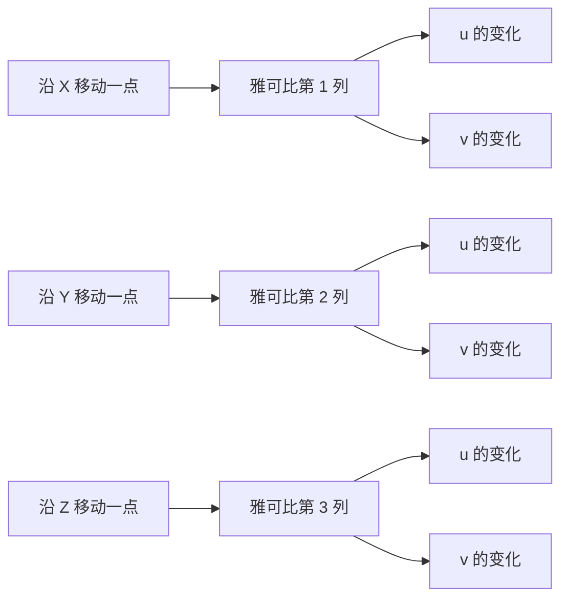
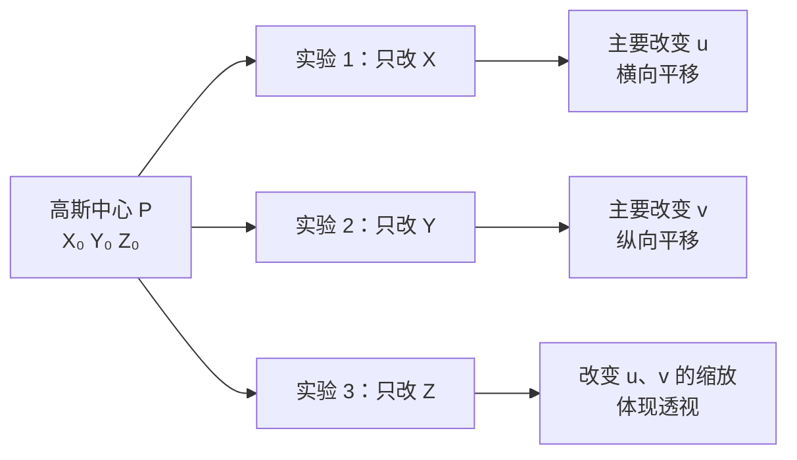
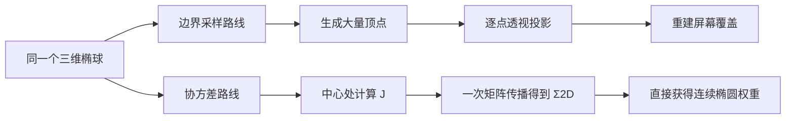

# 前置知识：雅可比与透视投影——把“局部放大镜”装进相机

> **一句话**：雅可比矩阵不是神秘的新矩阵，它只是“输入每个方向挪一点，输出会挪多少”的对照表。透视相机在一个很小的区域里可以看成放大镜，雅可比就是这把放大镜在横向和纵向各放大多少。
>
> **想看更深入的完整推导**：如果想把 3DGS 的每一个细节都学透，并配合可交互组件亲手验证雅可比矩阵和相机投影，可以阅读系列文章 [3D 高斯溅射从零精通：3DGS 完整原理与工程实现](/系列/3dgs_from_scratch/index)，本文对应该系列的第 5 章。

这篇文章服务于 [3DGS 为什么使用协方差矩阵](/前置知识/009c_前置知识_3DGS为什么使用协方差矩阵)。那里出现了 `J W Σ Wᵀ Jᵀ`，本篇把其中的 `J` 和 `W` 拆开讲。读者只需要会坐标、矩阵乘法和初等导数，不需要先学机器人学中的雅可比。

## 一、先从一张纸上的“放大镜”开始

想象一张方格纸。纸上有一个小圆点，横坐标增加 1 毫米，经过一台“变形机器”后，屏幕上的横坐标增加 2 个像素；纵坐标增加 1 毫米，屏幕上的纵坐标增加 3 个像素。如果横向和纵向互不影响，这台机器可以写成一个表：

| 输入的小动作 | 屏幕的变化 |
|---|---|
| 向右 1 单位 | 向右 2 单位 |
| 向上 1 单位 | 向上 3 单位 |

把这张表写成矩阵就是 `diag(2,3)`。它的作用不是描述整张图，而是描述**这个小圆点附近**的变化。换到另一个位置，放大倍数可能不同，就要重新填写这张表。

这就是“雅可比矩阵”的直觉：它记录一个函数在当前点附近，对每个输入方向的局部放大、缩小和串扰。

## 二、导数和雅可比只是在记录局部变化

### 2.1 一维：斜率就是局部放大倍数

函数 `y = 2x` 的意思是，x 增加 1，y 增加 2。斜率 2 就是“放大 2 倍”。对于弯曲的函数，整条曲线没有统一斜率，但在某一个点附近，仍然可以用该点的斜率近似。

下图把“局部”两个字画了出来：蓝线是完整的弯曲函数，橙色虚线只负责模仿红点附近的一小段。

> 绿色箭头是输入的小变化，紫色箭头是雅可比预测的输出变化。走得越远，蓝线和橙线之间的红色误差越大，所以雅可比是一把“局部放大镜”，不是整条曲线的永久替身。

### 2.2 二维：把多个方向的斜率排成表

相机投影把三维点 `(X,Y,Z)` 变成二维点 `(u,v)`。输入有三个方向，输出有两个方向，因此局部变化表是 `2×3`，每一列回答一个问题：**三维点沿 X、Y、Z 各挪一点，屏幕上的 u、v 分别变化多少？**

把“输入方向”和“输出方向”对应起来，可以先看下面这张小地图：

> 看图时只记住一件事：每一列是一个“三维推杆”，它同时告诉我们这个推杆会让屏幕横坐标和纵坐标怎么动；第三列就是透视造成的“前后移动也会改变屏幕位置”。

写成公式是：

$$
\Delta\mathbf{y} \approx \mathbf{J}(\mathbf{x}_0)\,\Delta\mathbf{x}
$$

**这个公式在做什么**：在参考点 `x₀` 附近，用一张“变化对照表” `J` 把三维的小位移 `Δx` 估算成屏幕的小位移 `Δy`。

::: details 📐 公式详解（点击展开）

| 子表达式 | 它是谁 | 它在干嘛 |
|---|---|---|
| `x₀` | **放大镜当前对准的位置** | 雅可比只在这个点附近有效 |
| `Δx` | **三维点的小挪动** | 例如点沿 X 方向移动 1 毫米 |
| `J(x₀)` | **局部变化对照表** | 每个元素都是一个偏导数，记录一个输入方向对一个输出方向的影响 |
| `Δy` | **屏幕上的小挪动** | 近似得到像素坐标或归一化屏幕坐标的变化 |

**用人话读**：在当前点附近，先查“每个三维方向会让屏幕怎么动”的表，再把这些小变化相加。

**为什么只能写近似号**：透视投影是弯的、非线性的；点挪得很远时，放大倍数会变。3DGS 的每个高斯很小，所以在它的局部范围内用近似足够准确。
:::

## 三、透视相机到底做了哪几步

为了避免把多个术语混成一团，把拍照过程拆成四步：

> 图中最重要的是“除以深度”：同样大小的物体，离相机越远，屏幕上的变化越小。

### 3.1 世界坐标变成相机坐标：只是在换尺子和方向

世界坐标是场景统一使用的坐标；相机坐标把相机自己当作原点，前方为深度方向。相机移动或旋转后，同一个点的数字会改变，但点和点之间的真实形状没有改变。

先把“换坐标系”与“真正投影”分开，整个路径就不会混淆：

> `W` 只负责“转身看世界”，`J` 才负责“按距离缩放并压到屏幕”；把两者拆开，后面的 `J W Σ Wᵀ Jᵀ` 就是在按这个顺序做事。

用 `W` 表示这一步的旋转部分（平移只改变中心位置，不改变一个小物体的“大小和方向”），有：

$$
\mathbf{x}_{cam}=\mathbf{W}\mathbf{x}_{world}
$$

**这个公式在做什么**：把世界里的点改写成“从相机看”的坐标，得到它在相机前方多远、左右多偏、上下多偏。

::: details 📐 公式详解（点击展开）

| 子表达式 | 它是谁 | 它在干嘛 |
|---|---|---|
| `x_world` | **场景地图上的位置** | 3DGS 高斯中心和形状通常先用世界坐标保存 |
| `W` | **相机的转向** | 把世界的 x、y、z 轴换成相机眼中的轴 |
| `x_cam` | **相机眼中的位置** | 后续透视投影只使用这个坐标 |

**用人话读**：先把场景坐标系转到相机坐标系，回答“这个点在镜头前面哪里”。

**为什么平移不出现在协方差变换里**：把整个椭球向左搬一米不会改变椭球的大小和朝向；协方差描述的是相对中心的散布，所以只需要旋转部分。
:::

### 3.2 透视除法：深度越大，画面越小

针孔相机的核心关系可以用最简单的形式表示：

公式里的除法来自一对相似三角形。先看几何图，再读公式中的 `X/Z`，会比直接背结论容易得多：

> 场景点、针孔和像点落在同一条光线上；物体离针孔的深度与焦距形成两个相似三角形，因此屏幕位置只能由“横向偏移 ÷ 深度”决定。

$$
u=f_x\frac{X}{Z},\qquad v=f_y\frac{Y}{Z}
$$

**这个公式在做什么**：把相机坐标里的左右位置 `X`、上下位置 `Y`，按深度 `Z` 缩放成屏幕坐标；同样的横向移动，远处的点在屏幕上移动更少。

::: details 📐 公式详解（点击展开）

| 子表达式 | 它是谁 | 它在干嘛 |
|---|---|---|
| `X/Z`、`Y/Z` | **相对视线的张角** | 只看“偏了多少 ÷ 离得多远” |
| `f_x`、`f_y` | **镜头放大倍数** | 焦距越大，同一张场景在屏幕上越大 |
| `u`、`v` | **屏幕坐标** | 点最终落在哪一列、哪一行 |
| `Z` 在分母 | **远近缩放开关** | Z 变大时，投影尺寸按比例变小 |

**用人话读**：先用距离做一次“远处缩小”，再用焦距把结果换算成像素。

**为什么是除法而不是减法**：透视相机遵循相似三角形；物体大小和距离的比例决定视角，所以必须用 `X/Z`、`Y/Z`。
:::

数值例子：设焦距 `f_x=f_y=1000` 像素。点 A 为 `(X,Y,Z)=(0.1,0,1)` 米，投影横坐标为 100 像素；点 B 为 `(0.1,0,2)` 米，横坐标只有 50 像素。两点的真实横向位置相同，但 B 远一倍，屏幕位移缩小一半。

### 3.3 雅可比：在一个高斯大小的范围内测量放大倍数

对上面的透视公式在中心点 `(X₀,Y₀,Z₀)` 附近求偏导，可得到：

这一步最容易被误读成“又来一个复杂矩阵”。其实它只是把三个局部实验并排写在一起：分别把点沿 X、Y、Z 推动一点，然后记录屏幕如何响应。

> 前两组实验像在屏幕上左右、上下拖动；第三组实验则像把物体推近或拉远，偏离光轴时会同时引起位置和大小的变化。

$$
\mathbf{J}=\begin{bmatrix}
\dfrac{f_x}{Z_0} & 0 & -\dfrac{f_xX_0}{Z_0^2}\\
0 & \dfrac{f_y}{Z_0} & -\dfrac{f_yY_0}{Z_0^2}
\end{bmatrix}
$$

**这个公式在做什么**：列出三维点沿 X、Y、Z 三个方向各移动一点时，屏幕 u、v 会移动多少；它就是透视相机在高斯中心处的“局部放大镜”。

::: details 📐 公式详解（点击展开）

| 子表达式 | 它是谁 | 它在干嘛 |
|---|---|---|
| `f_x/Z₀`、`f_y/Z₀` | **横向和纵向放大倍数** | 深度越大，放大倍数越小 |
| `-f_x X₀/Z₀²`、`-f_y Y₀/Z₀²` | **前后移动造成的缩放变化** | 点越偏离光轴，前后移动越会改变屏幕位置 |
| 第一列、第二列 | **沿 X、Y 挪动的影响** | 主要改变屏幕横向或纵向 |
| 第三列 | **沿深度 Z 挪动的影响** | 体现透视带来的“靠近变大、远离变小” |

**用人话读**：这张表告诉渲染器，高斯中心附近的每个三维小方向，应该在屏幕上画成多宽、多斜。

**为什么在中心处计算**：一个高斯只覆盖中心附近的一小块区域，在这块小区域里放大倍数变化不大，用一张表代替完整的弯曲投影，速度快且误差可控。
:::

下面的侧视图只表达“远近缩放”这一件事。蓝色物体和橙色物体在三维世界里同样高；蓝色更靠近相机，因此在成像平面上的投影更高。

> 光线从物体上下边缘连到相机中心，与成像平面的交点决定屏幕高度。距离翻倍时，投影高度约减半。

## 四、从一个三维椭球得到一个二维椭圆

现在把三维高斯看成一团“带方向的软橡皮泥”。它的协方差 `Σ3D` 记录这团橡皮泥在三个方向有多宽。相机先旋转它，再用雅可比的局部放大倍数压到屏幕上：

> 三条彩色轴不是额外的几何零件，而是协方差中最容易观察的三组信息：轴的方向给出椭球朝向，轴的长度给出沿该方向的扩散尺度。

$$
\boldsymbol{\Sigma}_{2D}=\mathbf{J}\mathbf{W}\boldsymbol{\Sigma}_{3D}\mathbf{W}^{T}\mathbf{J}^{T}
$$

**这个公式在做什么**：把一个三维椭球变成屏幕上的二维椭圆；二维椭圆告诉 EWA splatting 哪些像素可能受到这个高斯影响，以及范围内每个像素应该分到多大权重。

::: details 📐 公式详解（点击展开）

| 子表达式 | 它是谁 | 它在干嘛 |
|---|---|---|
| `Σ3D` | **原始三维软橡皮泥** | 记录椭球的三条轴和朝向 |
| `W Σ3D Wᵀ` | **转到相机眼中的橡皮泥** | 相机转动后，椭球相对镜头的方向改变 |
| `J(...)Jᵀ` | **相机局部放大镜** | 把相机坐标中的三维宽度换算成屏幕宽度 |
| `Σ2D` | **屏幕椭圆的说明书** | 渲染器据此计算覆盖范围和像素权重 |

**用人话读**：先转身适应相机，再按远近把椭球压扁成屏幕椭圆。

**为什么两边都乘转置**：协方差描述的是“两个方向一起变化”的关系。一个方向被变换后，另一个方向也要用同一个变换处理；左右夹着转置正好同时完成这两次变换，并保持结果对称。
:::

### 4.1 把公式换成渲染动作

EWA 是 Elliptical Weighted Average 的缩写。直译是“椭圆加权平均”，实际意思并不复杂：先圈出一个椭圆范围，再让离椭圆中心近的像素得到较大权重，离中心远的像素得到较小权重。

下面这张图把“圈范围”和“分权重”同时画出来：背景网格是 GPU 的像素工作块，橙色到红色的椭圆线是不同权重的等值线，中心越亮表示该像素越像高斯中心。

> 椭圆先回答“哪些像素需要处理”，颜色和等值线再回答“每个像素应该贡献多少”。所以 `Σ2D` 同时参与筛选范围和计算权重。

对每个高斯，EWA splatting 实际上做的是：

下面把“一个高斯的一生”画成渲染流水线。每个方框都是一次明确的数据形状变化：

> 这条流水线解释了为什么渲染器不需要把椭球拆成很多顶点：形状信息一直由协方差携带，最后才落成像素范围和权重。

1. 读取中心位置和 `Σ3D`；
2. 用相机姿态把它转到相机坐标；
3. 在中心点算一次 `J`，估计这附近的屏幕放大倍数；
4. 得到 `Σ2D`，画一个覆盖它的像素小椭圆；
5. 只对椭圆覆盖到的 tile 和像素计算颜色与透明度。

“tile”只是屏幕上的小方格块，例如 `16×16` 像素。它不是新的几何体，而是 GPU 为了并行处理而切出的工作区域。

### 4.2 一个完整的小算例

设高斯中心在相机坐标 `(X₀,Y₀,Z₀)=(0.1,0,2)` 米，焦距为 1000 像素。此时横向放大倍数是 `1000/2=500` 像素/米。若三维椭球沿相机 X 方向的标准差是 `0.01` 米，那么屏幕上的横向标准差约为 `500×0.01=5` 像素。

如果把中心移到深度 `Z₀=1` 米，放大倍数变成 1000 像素/米，同一个椭球就变成约 10 像素宽。**这就是为什么 3DGS 必须把深度放进投影计算：同一个高斯换个距离，屏幕覆盖范围会改变。**

## 五、为什么不直接投影椭球边界

当然可以把椭球采样成很多个顶点，再逐个投影。但这种做法有三个问题：

- 顶点数量随精度增加，GPU 要处理更多数据；
- 透视投影后的边界仍要再计算像素覆盖，步骤多；
- 顶点采样是离散的，训练时改一点尺度可能导致覆盖像素突然跳变。

协方差路线只保存“中心 + 形状说明书”，用矩阵乘法直接得到屏幕椭圆。椭圆内部的高斯权重还是连续函数，既快又能反向传播。

两条路线的差别可以直接画成处理链：

> 上支路的精度依赖顶点数量，参数稍变还可能让覆盖像素跳变；下支路始终操作连续的中心和协方差，更适合 GPU 渲染与梯度优化。

## 六、术语对照表

| 术语 | 直白含义 | 在 3DGS 中的位置 |
|---|---|---|
| 相机坐标 | 以相机为原点的坐标 | 透视投影前 |
| 透视投影 | 远处变小的拍照规则 | 三维点变成屏幕点 |
| 雅可比 `J` | 当前点附近的放大倍数表 | 把三维小范围变成二维小范围 |
| 协方差 `Σ` | 椭球的大小和朝向说明书 | 输入和输出形状 |
| EWA splatting | 在椭圆内按离中心远近分配权重 | 读取 `Σ2D`，筛选像素并计算像素权重 |
| tile | 屏幕上的小方格工作块 | GPU 并行调度单位 |

## 总结

读懂 `J W Σ Wᵀ Jᵀ` 只需要记住一句话：**`W` 负责把椭球转到相机眼里，`J` 负责根据远近把它按比例压到屏幕上，`Σ2D` 最后告诉渲染器要处理哪一小片像素，以及每个像素分到多大权重。**

这也是 3DGS 使用协方差的关键原因之一：协方差不仅描述三维形状，还能按照线性变换的规则自然地“跟着相机走”，无需把椭球拆成大量顶点。
