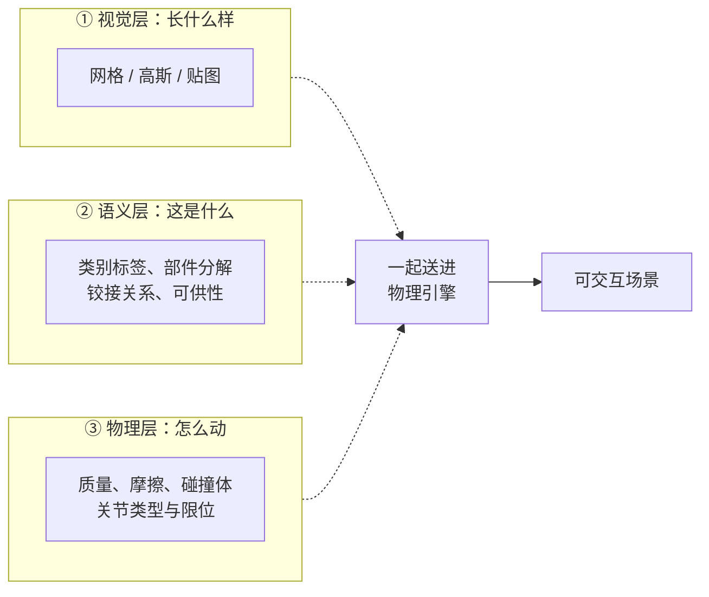
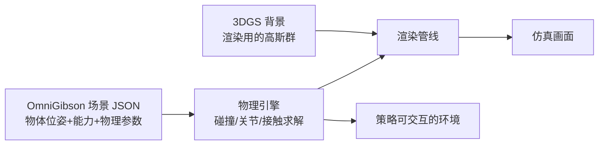

# 前置知识：OmniGibson 与 BEHAVIOR 基准——仿真场景的"通用文件格式"是怎么定义的

> **一句话**：机器人要在仿真里做家务，得先有一个"家里有多少种东西、每样东西有多重、能不能开合"的世界定义。BEHAVIOR-1K 就是这样一个基准（1000 种日常活动 + 50 个家庭场景），而 OmniGibson 是把这套定义跑在 NVIDIA Isaac Sim 物理引擎上的仿真器。理解它，就理解了 SimFoundry 为什么把输出目标定成它。

**知识链接**：
- [3D Gaussian Splatting：用一堆椭球把真实场景搬进电脑](/前置知识/007a_前置知识_3D_Gaussian_Splatting三维场景重建) — 视觉表示层，与本文的场景描述层是两回事，第 3 节会区分
- [SimFoundry 深度解析：一段视频自动铸造可交互仿真场景](/系列/simfoundry_deep_dive/index) — 本文是该系列的前置，用来理解 Pipeline A 的输出契约

---

## 一、先分清"仿真里的一间屋子"由哪几层组成

一个机器人仿真场景，看起来是"一个房子"，实际上是**三个互相独立的层次叠在一起**。混淆这三层是理解 Real2Sim 类工作的最大障碍。



| 层次 | 回答的问题 | 典型载体 | 缺了会怎样 |
|------|-----------|---------|-----------|
| 视觉层 | 渲染出来像不像 | 三角网格 + 纹理；或 3D 高斯椭球群 | 策略学的是错误的外观，视觉迁移失败 |
| 语义层 | 这个物体是什么类别、哪些部件能拆 | 物体树 + 类别标签 + 部件划分 | 无法定义任务（"把杯子放进碗里"需要知道谁是杯子谁是碗） |
| 物理层 | 碰撞时怎么响应、关节怎么转 | 质量/摩擦/碰撞体 + URDF 关节 | 物体穿透、悬空、关节乱转，策略学到不存在的物理 |

SimFoundry 的 Pipeline A 之所以有 13 个 stage，本质原因就是**它要同时把这三层都造出来**：分割和网格生成解决视觉层，物体解耦和 VLM 推理解决语义层，物理参数编译和合理性检查解决物理层。

---

## 二、BEHAVIOR-1K：一个"以活动为中心"的基准

BEHAVIOR-1K（BEHAVIOR-1K，2023 年由 Stanford 团队提出）与传统的机器人操作基准（如 RLBench、Meta-World）有一个根本区别：

| 对比维度 | 传统操作基准 | BEHAVIOR-1K |
|---------|-------------|-------------|
| 任务定义 | 单个短程技能（"把方块放进盒子"） | 1000 种**长程日常活动**（"整理餐桌"、"清洗餐具"） |
| 场景 | 抽象的工作台 | 50 个**完整家庭场景**（厨房、卧室、浴室、餐厅） |
| 物体 | 几十个几何体 | 1000+ 类**真实日用品**，带真实质量/摩擦/可铰接性标注 |
| 评价 | 单一成功率 | 多层谓词（物体状态、空间关系、场景状态）组合成的活动完成度 |

关键在第四行：BEHAVIOR 用**逻辑谓词**定义任务目标。比如"把苹果放进冰箱"不是"末端执行器到达某坐标"，而是"谓词 `Inside(apple, fridge)` 为真"。这带来一个直接好处——**同一个场景可以挂载无数个不同任务**，只要换一组目标谓词。这正是 SimFoundry 的 Task Cousin 能自动生成新任务的格式基础。

---

## 三、OmniGibson：把 BEHAVIOR 的定义跑起来的仿真器

BEHAVIOR-1K 是**数据与定义**（有哪些场景、哪些物体、哪些活动），OmniGibson 是**执行环境**（把这些定义加载进物理引擎、支持机器人交互和渲染）。两者是"规格"与"实现"的关系。

OmniGibson 的技术底座是 NVIDIA **Isaac Sim**（基于 Omniverse 的机器人仿真平台），并做了几件对 Real2Sim 特别重要的事：

1. **场景以 USD 或 JSON 描述**：一个场景可以写成一个 JSON 文件，里面列出所有物体的类别、位姿、物理参数。这是 SimFoundry 选择它作为输出目标的直接原因——**JSON 是程序最容易批量生成和修改的格式**，而批量生成正是 SimFoundry 的核心诉求。
2. **物体资产带完整物理标注**：BEHAVIOR 的物体库中，每个资产预先标注了质量、摩擦、是否可铰接、关节轴。这给 SimFoundry 提供了"物理参数默认值"的参照。
3. **支持铰接物体**：抽屉、柜门、冰箱门这类需要关节建模的物体是一等公民，不是补丁。

### 3.1 OmniGibson 场景描述里有什么

一个 OmniGibson 场景描述（Simplified 版）的结构大致如下：

```json
{
  "objects": [
    {
      "type": "scene_object",
      "name": "mug_1",
      "category": "mug",
      "position": [0.12, -0.03, 0.78],
      "orientation": [0.0, 0.0, 0.0, 1.0],
      "scale": [0.082, 0.082, 0.094],
      "abilities": {
        "rigid": {},
        "graspable": {},
        "mass": { "mass": 0.31 },
        "friction": { "static_friction": 0.6, "dynamic_friction": 0.5 }
      }
    }
  ],
  "task": {
    "activity_conditions": [
      { "condition": "inside", "subject": "apple_1", "target": "fridge_1" }
    ]
  }
}
```

注意 `abilities` 字段：物体不是靠一个"类型"字段决定行为，而是靠**能力列表**（rigid、graspable、mass、friction、openable……）。这种设计让"一个杯子"和"一个盘子"共享 `rigid + graspable`，而"一台冰箱"额外带 `openable + articulated`。

**为什么这种能力式设计对 SimFoundry 特别友好**：SimFoundry 从一段视频里重建出的物体，类别标签可能是模糊的（VLM 也只能猜"这可能是个陶瓷杯"）。但物理编译不需要精确类别——它只需要决定"这个物体该挂哪些能力"。挂 `rigid + graspable + mass + friction` 就够让它在仿真里被正常抓取了，类别识别的误差不会级联到物理层。

### 3.2 与"视觉表示"的区分

一个容易搞混的点：[3DGS](/前置知识/007a_前置知识_3D_Gaussian_Splatting三维场景重建) 是**渲染用的视觉表示**，OmniGibson 场景 JSON 是**逻辑与物理表示**。两者可以并存于同一场景：



**SimFoundry 正是这样组合的**：前景物体用网格 + OmniGibson 能力标注（可交互），背景用 3DGS（只负责好看）。第 04 章会详细讲这个组合为什么比"全网格"或"全高斯"都更好。

---

## 四、这套格式对 Real2Sim 工作意味着什么

SimFoundry 不是第一个把输出定成 OmniGibson 的工作，[ACDC](https://arxiv.org/abs/2410.07408) 已经这么做了（SimFoundry 的代码有一部分直接派生自 ACDC）。选择它的理由可以归纳为三条：

1. **JSON 可程序化生成**：Task Cousin 要生成成百上千个变体任务，手写 JSON 是不可能的，必须能被程序批量构造。
2. **物理参数有默认值和校验机制**：物体悬空、碰撞体穿插这类错误能被物理引擎直接检测出来，这给了 Pipeline A 一个自动的合理性检查关卡。
3. **物体库规模大**：Object Cousin 要替换物体时，可以从 BEHAVIOR 的 1000+ 类资产里检索替代品，而不必每次都生成新网格。

**这也解释了它的局限**：输出格式的能力上限就是 SimFoundry 的能力上限。BEHAVIOR 物体库擅长刚体和铰接物体，所以 SimFoundry 也擅长这两类；而柔性体、流体、可变形物体在 OmniGibson 里支持有限，SimFoundry 自然也就覆盖不到——这不是 SimFoundry 的设计缺陷，是它继承的底座边界。

---

## 五、总结

| 概念 | 是什么 | 和 SimFoundry 的关系 |
|------|--------|---------------------|
| BEHAVIOR-1K | 1000 种日常活动 + 50 个家庭场景 + 1000+ 类物理标注物体的**基准数据集与任务定义** | 提供任务谓词格式和物体资产来源 |
| OmniGibson | 把 BEHAVIOR 定义跑在 Isaac Sim 上的**仿真器** | SimFoundry Pipeline A 的输出目标格式、Pipeline C 的运行环境 |
| 场景 JSON | 列出物体、位姿、能力、物理参数和任务谓词的**结构化描述** | SimFoundry 批量生成与修改场景的操作对象 |

读到这里应该能回答：**为什么 SimFoundry 的 13 个 stage 最后一定要"编译"成 OmniGibson 场景，而不是随便导出几个网格？** ——因为只有编译进这套格式，物体才带上物理能力、任务才能用谓词表达、变体才能被程序批量生成，后面所有环节（Pipeline B 的增广、Pipeline C 的评测）才成立。

---

## 延伸阅读

- [SimFoundry 深度解析：一段视频自动铸造可交互仿真场景](/系列/simfoundry_deep_dive/index) — 本文的直接下游
- [数字表亲与 Real2Sim 数据增广](/前置知识/010b_前置知识_数字表亲与Real2Sim数据增广) — 姊妹前置知识
- [3D Gaussian Splatting：用一堆椭球把真实场景搬进电脑](/前置知识/007a_前置知识_3D_Gaussian_Splatting三维场景重建) — 视觉表示层
- [Sim-to-Real 迁移综述](/论文综述/S04_Sim_to_Real迁移综述) — 仿真到真实的整体方法论
- BEHAVIOR-1K 项目页：<https://behavior.stanford.edu/>
- OmniGibson 代码库：<https://github.com/StanfordVL/OmniGibson>
