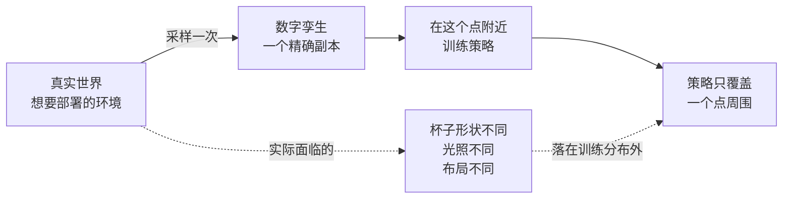
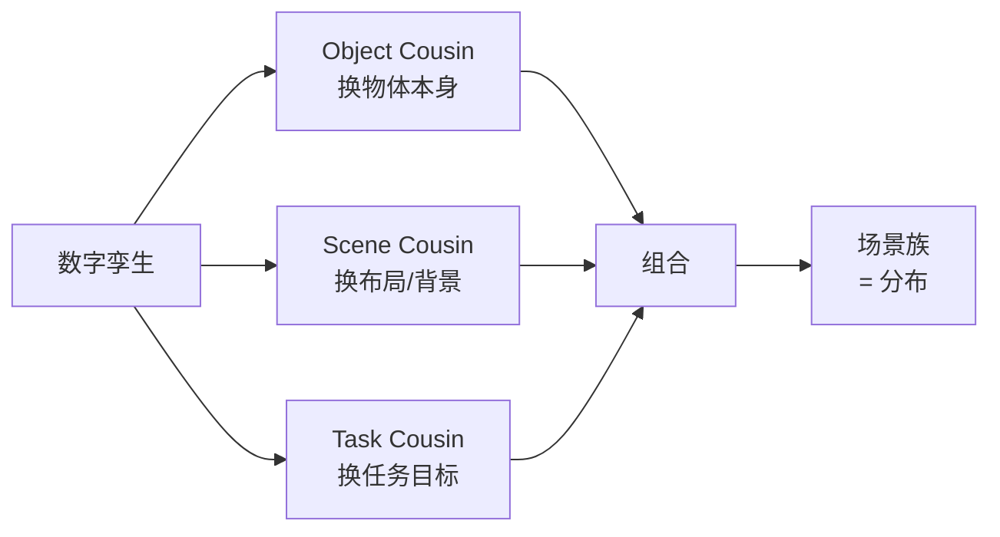

# 前置知识：数字表亲（Digital Cousins）——为什么一个"孪生"不如一族"表亲"

> **一句话**：把真实场景精确复刻进仿真，得到的是一份"数字孪生"（Digital Twin）；但策略只在这一个副本里训练，换个杯子就废了。所以要把这一份副本扩成一族"数字表亲"（Digital Cousins）——保留"这是什么、怎么操作"的功能属性，但外观、布局、任务各不相同。用一族场景训练，策略学到的是**分布**，不是**一个点**。

**知识链接**：
- [OmniGibson 与 BEHAVIOR 基准](/前置知识/010a_前置知识_OmniGibson与BEHAVIOR基准) — 数字表亲最终要落到的场景格式
- [SimFoundry 深度解析](/系列/simfoundry_deep_dive/index) — 本文是该系列的前置，用于理解 Pipeline B
- [Sim-to-Real 迁移综述](/论文综述/S04_Sim_to_Real迁移综述) — 域随机化是本文概念的"数值版前身"，第 4 节会对比

---

## 一、数字孪生这条路线的天花板在哪

假设你对着一张贴着桌布的桌面拍一段视频，精确重建出一个数字孪生：白色的马克杯、蓝色的记号笔、木色的盘子，位置分毫不差。

现在你在这个孪生里跑强化学习训练一个抓取策略。策略学得很好，在仿真里成功率 98%。上真机——换了一个形状略不同的杯子，成功率掉到 40%。

问题出在哪？**训练数据只有一个点，而真实世界是一个分布。**

这不是"仿真不够逼真"的问题——即使孪生逼真到像素级，只要它**只有一个**，分布偏移就存在。真实世界里的杯子不会永远是同一个杯子。

这里要和另一个常见做法区分开：有人会说"那就做域随机化（Domain Randomization）不就行了"。域随机化确实是造分布，但它造的是**参数空间的分布**（光照亮度 ±30%、摩擦系数 ±20%、物体位置 ±5cm），而没有改变**物体本身是什么**。随机化一百次光照，杯子的形状还是那个杯子。数字表亲要突破的正是这个边界——**换掉物体本身的身份**。

---

## 二、"表亲"这个比喻精确在哪

"表亲"（cousin）这个词很有讲究。它对应的不是"复制品"（clone/copy），不是"陌生人"（stranger），而是**有共同祖先、共享部分特征、但具体表现各不相同**的个体。

| 关系 | 比喻 | 技术含义 | 训练价值 |
|------|------|---------|---------|
| 孪生（Twin） | 同卵双胞胎 | 与原场景像素级一致 | 高保真但单点 |
| **表亲（Cousin）** | **表兄弟姐妹** | **保留功能可供性，改变具体表现** | **高保真 + 覆盖分布** |
| 陌生（Stranger） | 随机场景 | 无关联的任意场景 | 覆盖广但物理/语义可能不合理 |

"表亲"的约束条件就藏在比喻里：**必须保留家族共性**。技术上这个共性叫**可供性（affordance）**——一个杯子之所以是杯子，是因为它"有把手能拿、有内腔能装"。表亲可以换个颜色、换个高度、换个材质，但不能变成一个"拿不起来的东西"，否则任务定义就失效了（任务说"把杯子放进碗里"，你却把杯子换成了一个焊在桌上的铁块）。

**这是数字表亲与纯随机场景生成的本质区别**：随机生成追求多样性，表亲生成追求**受约束的多样性**。

---

## 三、三个正交的变化维度

一个场景由"有哪些物体""怎么摆放""要做什么"三部分构成，对应三个独立的变体维度。这是 SimFoundry 对 [ACDC](https://arxiv.org/abs/2410.07408) 原始概念的一个明确化：

| 维度 | 改变什么 | 保持不变什么 | 对应真实世界的哪种偏移 |
|------|---------|-------------|---------------------|
| **Object Cousin** | 某个物体的几何/拓扑/外观 | 它的可供性（还能被这样操作） | 换了一套餐具 |
| **Scene Cousin** | 物体间的空间布局、背景、光照 | 物体集合与它们的可供性 | 换了一间厨房 |
| **Task Cousin** | 要达成的目标状态 | 场景与物体集合 | 同一个厨房里要做另一件事 |

三者**可以自由组合**：Object × Scene × Task 的笛卡尔积给出一条从"1 段视频"到"成千上万个训练场景"的放大路径。

### 3.1 为什么 Task Cousin 的收益最大

SimFoundry 实测三类表亲对真机零样本成功率的平均提升分别是 +17%（Object）、+21%（Scene）、+40%（Task）。Task 明显领先，原因在于**它改变的是策略需要理解的抽象层次**：

- Object / Scene Cousin 改变的是**输入的外观**——逼着策略在视觉上更鲁棒，但它要执行的"动作逻辑"没变。
- Task Cousin 改变的是**从目标状态到动作序列的映射**——"放进（in）"和"叠上（on）"要求的末端执行器轨迹完全不同。策略在这里学到的是任务语义与动作之间的可泛化关系。

这提示了一个反直觉的结论：**提升策略泛化能力，造"任务的多样性"可能比造"物体/场景的多样性"更划算。**

---

## 四、与域随机化、与数据增广的关系

数字表亲不是凭空冒出来的，它是既有方法在"多样性从哪来"这个问题上的推进。把它放进方法谱系里看：

| 方法 | 多样性来源 | 是否改变物体身份 | 语义是否受约束 |
|------|-----------|----------------|--------------|
| 域随机化 | 参数采样（光照、摩擦、位置） | 否 | 不需要（不换物体） |
| 干扰物增强 | 撒随机物体 | 部分（增加，不替换） | 否（可以是任意物体） |
| 数字孪生 | 无 | — | — |
| **数字表亲** | **生成/检索有语义的替代资产与任务** | **是** | **是（保持可供性）** |

**和真机数据增广的对应关系**：真机侧要获得同等的分布覆盖，靠的是凑齐不同品牌的餐具、不同布局的房间、不同任务——这是要花钱买的。数字表亲做的事情本质是**在仿真侧免费地把这份"场景采购"做完**。

---

## 五、这个概念在项目里的位置

[ACDC](https://arxiv.org/abs/2410.07408)（Automated Creation of Digital Cousins，2024）是这个词的提出者，输入是**单张 RGB 图像**；SimFoundry 把它扩展成**视频输入 + 模块化生产管线 + 系统性仿真-真机相关性验证**。除此之外，项目里还有几篇工作和它有概念关联：

- [RialTo](/论文综述/114_RialTo_数字孪生RL策略学习) — 做的是数字孪生 + 仿真内扰动，没有表亲这一层，可作为"孪生路线"的对照
- [DreamGen](/论文综述/131_DreamGen_视频世界模型生成机器人训练数据) — 在像素空间造多样性，不走物理仿真，是"表亲"思路的另一种载体
- [Sim-to-Real 迁移综述](/论文综述/S04_Sim_to_Real迁移综述) — 域随机化等基础方法的全景

---

## 六、总结

读完应该能回答三个问题：

1. **为什么孪生不够？** —— 因为训练数据是一个点，部署面对的是一个分布，单点训练无法覆盖分布偏移，而这和仿真的逼真度无关。
2. **表亲和随机的区别？** —— 表亲受"可供性保持"约束，随机场景不受；前者保证任务定义仍然有效，后者不保证。
3. **三个维度怎么选？** —— Object/Scene 提升视觉鲁棒性，Task 提升动作逻辑的泛化；如果只能做一种，优先做 Task。

---

## 延伸阅读

- [SimFoundry 深度解析：一段视频自动铸造可交互仿真场景](/系列/simfoundry_deep_dive/index) — 把本文概念做成完整系统的范例，第 06 章讲生成机制
- [OmniGibson 与 BEHAVIOR 基准](/前置知识/010a_前置知识_OmniGibson与BEHAVIOR基准) — 表亲落地的场景格式
- [RialTo：手机扫描建数字孪生](/论文综述/114_RialTo_数字孪生RL策略学习) — 只做到孪生这一层的对照工作
- [DreamGen：视频世界模型生成机器人训练数据](/论文综述/131_DreamGen_视频世界模型生成机器人训练数据) — 另一条多样性来源
- Dai, Wong et al., *"Automated Creation of Digital Cousins for Robust Policy Learning"*, arXiv:2410.07408, 2024 — 概念原始出处
