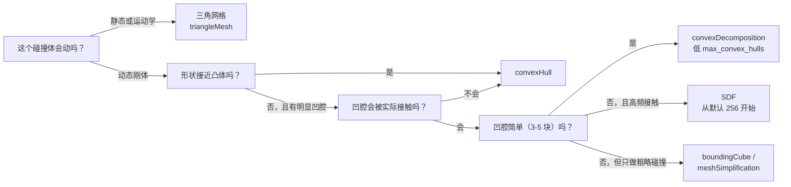
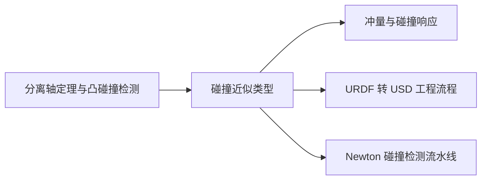

# 碰撞近似类型：Bounding / Convex / Mesh / SDF 的原理、精度与性能

> 你导入的网格是给眼睛看的，物理引擎真正参与的碰撞体是「近似」出来的另一套几何。本文按同一套判据拆开每一个可选类型：它把原几何替换成了什么、替换误差在哪里发生、这个误差会不会自己消失、以及它换来多少性能。

## 知识链接

**相关阅读**：

- [分离轴定理与凸多边形碰撞检测](/前置知识/007d_前置知识_分离轴定理与凸多边形碰撞检测) — 凸形体之间「怎么判断相交、怎么得到最近点」的几何基础，本文的 convexHull / convexDecomposition 路径全靠它
- [冲量与碰撞响应](/前置知识/007c_前置知识_冲量与碰撞响应) — 找到接触点之后速度怎么被改写
- [URDF 转 USD 完整工程流程详解](/工程实践/URDF转USD完整工程流程详解) — `collision_type`、`convex_decomp`、`basic_geom_dict` 这些工程开关出现在哪一步
- [碰撞检测流水线：从粗筛到 SDF 与 Hydroelastic 接触](/系列/newton_engine_deep_dive/04_碰撞检测流水线_从粗筛到SDF与Hydroelastic接触) — 同一套碰撞检测问题在 Newton 里的组织方式
- [USD 物理数据模型：一个刚体如何被两个后端读懂](/系列/isaacsim_physics_deep_dive/02_USD物理数据模型_刚体关节材质如何被后端读懂) — `physics:approximation` 这个 token 写在 USD 的哪个位置

---

## 贯穿全文的例子：一个 L 形凹零件

物理引擎面对的所有网格里，绝大多数是非凸的：机器人夹爪、带凹槽的工件、有内腔的外壳、L 形支架。本文只用一个零件——下图 (a) 的 L 形板——来对比所有近似类型。它是二维的（单位是米，长 2 m、宽 2 m、厚 1 m），因为二维足够暴露所有关键差异，又不至于让图看不清。

> 灰虚线是真实几何轮廓，彩色填充是引擎真正参与碰撞的区域。看图时只关注一件事：**彩色区域比灰虚线多出来的部分**，就是物理引擎会「凭空撞到」的地方。这个多出来的区域在本文里统一叫**幽灵接触**（phantom contact）。

幽灵接触是碰撞近似这条线上所有工程事故的总根源，而且它有一个残酷的性质：**它不能靠调参数消除**。加大接触偏移、增加求解器迭代、降低时间步都不会让一个已经被封死的凹角重新出现间隙。唯一的修法是换几何。

---

## 一、碰撞检测为什么必须做近似

### 1.1 一次 physics step 里，几何要经过哪些环节

> 关键点是 `cook` 这一步：它只在「第一次需要这个碰撞体」时执行一次，产出的是运行时几何；之后每个 physics step 反复使用的是 **cook 产物**，不再碰原始网格。

这条链路把碰撞开销劈成两半：**一次性编译成本**和**每帧查询成本**。这两个成本的量级差着好几个数量级，而选型决策几乎全部由「编译一次、查询几百万次」这个事实决定。

### 1.2 Broad phase 与几何类型无关

粗筛阶段只比较每个碰撞体的轴对齐包围盒（AABB，Axis-Aligned Bounding Box）的 6 个极值，与碰撞体内部是什么几何无关。所以「换成 boundingSphere」并不能让粗筛变快——它省的是 narrow phase 的钱。粗筛的开销只和**碰撞体个数**有关，这也是为什么减少碰撞体数量（合并固定关节、关掉自碰撞、用 `disable_collision_pairs` 砍掉相邻连杆对）永远比换几何类型更值。

### 1.3 为什么凸形体有特权

Narrow phase 拿到一对候选碰撞体后，会按几何类型分流到完全不同的算法：

| 几何类型 | 精算方法 | 单次查询代价 | 是否支持动态刚体 |
|---|---|---|---|
| Box / Sphere / Capsule | 解析公式 | 常数，极小 | 支持 |
| ConvexMesh（凸包或分解块） | 支持函数 + GJK/MPA 迭代求最近点 | 常数 × 顶点数，小 | 支持 |
| TriangleMesh | 三角形-凸体距离查询 | 与三角形数相关，一次查询可能遍历大量三角形 | **不支持**（仅静态/运动学） |
| SDF | 一次三线性插值 | 常数，与三角形数无关 | 支持 |

这张表的每一行都能从一个共同的数学事实推出来：**凸形体有一个「支持函数」**。给任意方向 $\mathbf{d}$，支持函数直接返回该形状在这个方向上最远的点。Box 的支持函数是符号函数；凸网格的支持函数是遍历顶点取最大点积。有了支持函数，GJK 这类算法就能迭代地收紧一对凸形体之间的最近距离，整个过程不需要知道三角形之间怎么连接。

支持函数的形式是这套「凸体特权」的起点：

$$
h_K(\mathbf{d}) = \max_{\mathbf{x} \in K} \ \mathbf{d}^{\mathsf{T}} \mathbf{x}
$$

**这个公式在做什么**：把「沿方向 $\mathbf{d}$ 找形状 $K$ 最远的点」压缩成一个求最大值——形状的整片表面被压成一维的函数，之后所有凸体距离算法都只跟这个函数打交道。

::: details 📐 公式详解（点击展开）

| 子表达式 | 它是谁 | 它在干嘛 |
|---------|--------|---------|
| $K$ | **参加碰撞的凸形体** | Box、凸包、凸分解块都属于这一类，它们的共同点是「表面上任意两点的连线仍在体内」 |
| $\mathbf{d}$ | **一个查询方向** | 不是物体上的方向，而是算法临时挑的一个试探方向，比如「从 A 的最小侧往 B 推」 |
| $\mathbf{x}$ | **$K$ 表面上任意一点** | 取值范围的候选点，包含顶点和面上的点 |
| $\mathbf{d}^{\mathsf{T}}\mathbf{x}$ | **这个点在方向上的投影长度** | 把所有候选点投影到 $\mathbf{d}$ 上，得到一个标量，取代了三维坐标 |
| $\max_{\mathbf{x}\in K}$ | **取最靠前的那一个** | 在所有投影值里挑最大的，对应的点就是朝 $\mathbf{d}$ 方向的极值点 |
| $h_K(\mathbf{d})$ | **支持值** | 这个最大投影长度，它同时给出了极值点的位置信息 |

**用人话读**："把形状上所有点都投影到一个方向上，取最靠前的那个投影长度——这个长度就是支持函数。"

**为什么是这个形式**：关键在于**求最大值这一步不需要三角形之间的连接信息**。一个写满几百万三角形的网格，只要它是凸的，它的全部行为就等价于函数 $h_K$；而一个凹网格根本不存在这样一个函数（凹角处「最远的点」不在同一个连通面上）。GJK 之所以只能对凸体工作、凸体之所以在 narrow phase 里有特权，根源就在这一行。

:::

非凸网格没有全局支持函数——凹角处「最远的点」根本不在同一个连通面上。所以非凸几何只有三条出路：**用凸的东西把它盖住**（bounding、convexHull）、**用多个凸的东西把它拼出来**（convexDecomposition）、或者**换一套不依赖凸性的距离查询结构**（triangleMesh 的 BVH、SDF 的体素网格）。所有近似类型都是这三条路里的某一条。

---

## 二、覆盖型近似：boundingSphere 与 boundingCube

这两个类型被归为「覆盖型」，因为它们满足一个强性质：**真实几何完全包含在近似体内部**。这个性质带来一个很好的保证——近似永远不会漏检真实接触（no false negative），代价是必然产生幽灵接触（false positive）。

### 2.1 boundingCube

**原理**：用五个数字描述——AABB 的两个对角点。真实几何被替换成这个长方体。

**精度**：对于本来接近长方体的网格，误差很小；对于任何斜置或细长的网格，误差可以到「物体间还有大半米空气就已经撞上」的程度。

**性能**：这是所有类型里最便宜的。解析的 box-box 接触生成不需要任何迭代，内存只有一对向量。

**工程含义**：boundingCube 只适合两种情况——形状本身就近似长方体，或者你**希望**物体之间保持保守的间距（某些抓取夹具的防穿透缓冲）。用它给机械臂连杆做碰撞体会让整条手臂「虚胖」，这也是为什么 `UrdfConverterCfg` 的 `collision_type` 默认为 `Convex Hull` 而不是 `Bounding Cube`。

### 2.2 boundingSphere

**原理**：用四个数字描述——球心和半径（通常取 AABB 对角线的一半，保证仍然覆盖）。

半径的取法不是「取几何中心到最远点」这样的直觉值，而是一个写死的保守估计：

$$
r_{\text{sphere}} = \frac{1}{2}\sqrt{L_x^2 + L_y^2 + L_z^2}
$$

**这个公式在做什么**：用 AABB 的三个边长直接算出一个必然覆盖整个网格的球半径——它不需要遍历网格顶点，只需要读出包围盒，因此可以在 cook 阶段瞬间得出。

::: details 📐 公式详解（点击展开）

| 子表达式 | 它是谁 | 它在干嘛 |
|---------|--------|---------|
| $L_x, L_y, L_z$ | **AABB 的三个边长** | 从网格顶点集上直接读出的包围盒尺寸，是三个已知输入 |
| $L_x^2 + L_y^2 + L_z^2$ | **包围盒体对角线长度的平方** | 勾股定理在三维的推广 |
| $\frac{1}{2}\sqrt{\ \cdot\ }$ | **取对角线的一半** | 球心放在 AABB 中心时，到任一角的距离恰好是对角线的一半；这是能覆盖整个 AABB 的最小球的半径 |
| $r_{\text{sphere}}$ | **外接球半径** | 引擎实际写进碰撞体的半径值 |

**用人话读**："把包围盒的体对角线量出来，取一半，就是球的半径。"

**为什么是这个形式**：它算的是**包围盒**的最小外接球，而不是**网格**的最小外接球。两者的差别正是精度的损失所在：要得到网格的最小外接球得跑 Welzl 一类的算法扫描全部顶点，而包围盒对角线只需要读出六个极值就能算。**这个「省掉顶点扫描」的选择本身就是 boundingSphere 精度差的根因**——不是球这种形状差，而是这个半径公式建立在包围盒而非真实几何上。

:::

对本文的 L 形零件，$L_x = L_y = 2\,\text{m}$、$L_z = 1\,\text{m}$，代入得 $r_{\text{sphere}} = 0.5\sqrt{4+4+1} = 1.5\,\text{m}$。而零件的实际体积是 3 m³，半径 1.5 m 的球体积是 $\frac{4}{3}\pi(1.5)^3 \approx 14.1$ m³——**近五倍的体积膨胀**。（图上画的是 $z = 0.5$ 处的剖面，球在该平面截出一个半径 1.5 m 的圆；如果只看二维包围盒对角线会得到 1.414 m，那个值漏掉了 1 m 厚度对体对角线的贡献。）

**精度**：比 boundingCube 更差。图上 (c) 那个半径 1.5 m 的球只在 45° 方向上贴着零件，其余方向全是大片空隙。一个 2 m × 2 m 的薄板会被近似成一个体积大得多的球，一旦堆叠必然互相弹开。

**性能**：解析球-球、球-凸体接触，是最便宜的常数开销。它的真实优势场景是**粒子、近似球形的可拾取物、以及只需要做重叠判断的传感器体积**（trigger shape 常写成球或盒）。

**一个必须知道的事实**：碰撞体不只是碰撞体，它同时是**质量与惯量的来源**。当 `link_density > 0` 或勾选「从碰撞体计算质量属性」时，引擎按碰撞近似体的体积和分布积分得到质量和惯性张量。因此把连杆碰撞体换成 boundingSphere，不只是碰撞形状变粗糙，**动力学也一起变了**——一个细长前臂会被赋予接近球形的惯量分布，转动惯量被严重高估，PD 控制的响应随之失真。这是选型时必须一起考虑的第二条影响链。

> 这张图是定性示意，纵轴不是实测毫秒。它要传达的结论是：**精度和开销不是单调关系**——triangleMesh 和 SDF 精度最高，但前者受动态刚体限制、后者需要额外 cook 与内存，真正的工程权衡发生在「是否允许非凸」这个分岔口上。

---

## 三、凸包：convexHull

### 3.1 原理

convexHull 把所有顶点包进**最小的凸多面体**。落在凸包内部的凹角被填平，凸包内部任何两点之间的连线都在凸包内。

**精度**：分两部分看。

- **凸包表面是精确的**。它不是拟合，而是取顶点集的最小凸集。原来就在凸包边界上的面（图里 L 形的两条外直角边）完全保真，接触法线和接触点都正确。
- **凹角被系统性填平**。图里 (d) 中，真实几何在 (1,1) 附近有一个 1 m × 1 m 的凹角空隙，凸包用一条斜边把它盖住了。一个半径 0.5 m 的球从 (1.1, 0.9) 方向靠近零件时，凸包会在球距真实表面还有约 0.41 m 时就报告接触。

这个 0.41 m 是幽灵接触的**最大厚度**，也就是被填平的凹腔的深度。对夹持类任务这个数字是致命的：夹爪张到能夹住零件的宽度，却因为凸包已经把凹角焊死而根本进不去。

### 3.2 精度可控参数：hull_vertex_limit

PhysX 的 `PhysxConvexHullCollisionAPI` 提供两个旋钮：

| 参数 | 默认值 | 作用 | 调大的后果 |
|---|---|---|---|
| `hull_vertex_limit` | 64 | 凸包最多保留多少个顶点 | 贴近曲面（圆柱、球面）的轮廓更精细，但 GJK 每次迭代要检查更多顶点 |
| `min_thickness` | 0.001 m | 凸包的最小厚度，防止退化成纸片 | 保持默认即可；调小会让极薄部件出现数值问题 |

`hull_vertex_limit` 的取舍要这样理解：一个圆柱被凸包近似后，轮廓变成正 $n$ 边形，半径误差来自「割线在中点处相对圆弧的垂距」：

$$
\Delta r(n) = r\left(1 - \cos\frac{\pi}{n}\right)
$$

**这个公式在做什么**：用一个只跟顶点数 $n$ 和半径 $r$ 有关的式子，给出「圆柱被近似成正 $n$ 棱柱后，外轮廓在棱中点处比真实圆柱缩进多少」。

::: details 📐 公式详解（点击展开）

| 子表达式 | 它是谁 | 它在干嘛 |
|---------|--------|---------|
| $r$ | **圆柱的真实半径** | 网格本身给出的输入量，不随 `hull_vertex_limit` 改变 |
| $n$ | **凸包保留的顶点数** | 由 `hull_vertex_limit` 决定，是用户唯一能调的旋钮 |
| $\pi/n$ | **相邻两个顶点之间的半圆心角** | 一圈 $2\pi$ 被 $n$ 个顶点切成 $n$ 段，每段的半角是 $\pi/n$ |
| $\cos(\pi/n)$ | **顶点到棱中点的径向收缩比** | 顶点在圆上，棱中点落在弦上；弦比半径短，收缩量由这个余弦给出 |
| $1-\cos(\pi/n)$ | **相对误差** | 无量纲的比例 |
| $\Delta r(n)$ | **绝对半径误差** | 乘上 $r$ 后得到的长度误差，直接对应幽灵接触的厚度 |

**用人话读**："顶点越多，棱柱越接近圆柱；误差随顶点数按平方反比下降。"

**为什么是这个形式**：要看的是**误差随 $n$ 衰减得多快**，而 $\cos(\pi/n) \approx 1 - \frac{1}{2}(\pi/n)^2$，所以 $\Delta r \approx \frac{r\pi^2}{2n^2}$——**二次衰减**，不是线性。这解释了为什么默认值 64 已经够用：n=64 时，半径 5 cm 的圆柱误差约 0.06 mm，比任何接触求解器的数值噪声都小。也解释了为什么调低到 8 会出问题：误差一下子涨到 3.8 mm 量级，而且继续减半 $n$ 只会让误差涨约四倍。这个公式同时定出了调节方向——只有在**大半径**部件（米级）上，分子里的 $r$ 才会把误差推回到可见量级，这时才值得提高上限。

:::

### 3.3 性能

**Cook 成本**：低。凸包构造是一次性的增量算法，几十毫秒量级。

**查询成本**：常数级，与顶点数为线性关系。这是凸包最大的优势——无论原网格有几千还是几百万个三角形，碰撞查询的开销只取决于凸包顶点数（≤64）。

**典型用法**：机械臂连杆、夹爪指、任何「近凸」的刚体。这是机器人资产导入的默认选择。

**一个常见误判**：把凸包用在有明显凹腔的工件上，然后抱怨「抓取时零件总是悬空」。这不是摩擦系数或接触刚度的问题，是凸包把凹腔填掉了，抓取点根本不存在。

---

## 四、凸分解：convexDecomposition

### 4.1 原理

凸分解先用体素化把网格离散成占据/空闲的体素，再在体素场上搜索一组凸块，使它们的并集尽可能贴住原表面。产出的是**多个** ConvexMesh，挂成同一个碰撞体。

L 形零件会分成图中 (e) 的两块：水平段和竖直段。凹角 (1,1) 的空隙被保留了——这正是凸分解相对凸包的全部价值。

### 4.2 代价：接触对数量与幽灵接触的转移

凸分解不是「用一个粗糙的近似换成一个精确的近似」，而是**把误差从位置维度搬到了数量维度**：

**第一，查询开销按凸块数量线性增长。** 凸包是 1 个凸体，分解成 60 块就是 60 个凸体。两个碰撞体接触时，理论上要做 60 × 60 的凸体对筛选（实际有 AABB 剪枝，但密集分解的块彼此包围盒严重重叠，剪枝效率低）。一个 60 块的分解件，narrow phase 成本可以比凸包高一个数量级。

**第二，凸块之间人为制造了缝隙和重叠。** 体素化有分辨率极限，相邻凸块的公共面不可能完全贴合：要么留一条缝（漏检，薄壁可能互相穿透），要么互相嵌入（在内部产生永久的自接触候选）。引擎会用「同一碰撞体内部的凸块不互相碰撞」来抑制显式自接触，但块间的凹陷仍然会让一个薄片物体卡在两块之间。

**第三，幽灵接触只是变小，没有消失。** 图里 L 形分解成两块后，凸块比原几何多出来的部分在斜边处——误差从原来的整个凹角缩小到体素尺度。

### 4.3 精度与性能旋钮

`PhysxConvexDecompositionCollisionAPI` 的六个参数共同决定「精度 vs 成本」的曲线：

| 参数 | 默认值 | 控制什么 | 调大 / 调小的后果 |
|---|---|---|---|
| `voxel_resolution` | 500,000 体素 | 体素化的总分辨率（把包围盒切成这么多格） | 调大：凹腔和薄壁还原更准，cook 时间与内存明显上升；调小：细节丢失，接近凸包 |
| `max_convex_hulls` | 32 | 分解块数上限 | 调大：复杂凹几何还原更准，每帧查询成本线性上升；调小：多个凹腔被合并，幽灵接触回归 |
| `error_percentage` | 10 % | 允许的体积误差百分比 | 调小：更贴原表面，块数被推向上限；调大：更快更省，精度下降 |
| `hull_vertex_limit` | 64 | 每块凸包的顶点上限 | 同 convexHull |
| `min_thickness` | 0.001 m | 每块凸包的最小厚度 | 同 convexHull |
| `shrink_wrap` | False | 把凸块顶点吸附回原始网格表面 | 开启后接触点更贴真实表面，能减少块间凹陷；代价是 cook 变慢且凸性可能被破坏 |

**推荐的调参顺序**：先固定 `error_percentage=10` 跑一次，看凸块数量是否触到 `max_convex_hulls`。触顶说明几何太复杂、默认块数不够，此时优先提高 `max_convex_hulls` 而不是提高 `voxel_resolution`——因为块数的收益直接体现在凹腔还原上，而体素分辨率提高的收益会被上限截断。反之，如果凸块只有 3-4 块却已经很慢，说明是别的地方的问题，加大 `error_percentage` 让它更糙。

**什么时候值得用**：被操作物体（工件、容器、带凹腔的工具）、接触面质量直接影响任务成败的场合。**什么时候不值得**：机器人连杆——连杆之间的接触通常被自碰撞过滤或设计上不接触，为一个不参与接触的连杆付分解成本是纯浪费。

---

## 五、表面近似：triangleMesh 与 SDF

凸包和凸分解都是「用凸的东西盖住」。另有一条完全不同的路：不做凸近似，直接用原曲面做距离查询。区别只在于**用什么东西加速查询**。

### 5.1 triangleMesh

**原理**：直接把三角面片作为碰撞几何，用包围体层级树（BVH，Bounding Volume Hierarchy）加速：查询时从根节点往下筛，只在可能与目标重叠的子树里做精确的三角形距离计算。

**精度**：所有类型里最高。L 形零件的凹角、任意曲面、薄壁都完整保留，幽灵接触为零，接触点理论上精确到三角形尺度。

**性能**：查询开销与三角形数量相关——BVH 是对数深度，但一次查询仍可能访问很多三角形，远高于凸体查询。

**最关键的限制**：PhysX 中 triangleMesh **不能作为动态刚体的碰撞几何**。官方文档明确写着，TriangleMesh、HeightField、Plane 几何不允许挂到动态 actor 的仿真形状上，除非该 actor 是运动学的。原因是三角形网格是**零厚度的壳**：一个有质量的动态物体如果和零厚度壳相交，求解器无法确定往哪个方向把它推出去，会直接穿过去或产生爆炸式响应。

由此得到 triangleMesh 的正确使用场景：

- **静态环境**：地面、桌面、货架、建筑物。这里 triangleMesh 是最优选——精度最高，内存只是一组三角形（比同精度的 SDF 省得多），而且静态碰撞体不需要质量属性。
- **运动学刚体**：被脚本或外部状态驱动的物体（传送带、按轨迹移动的托盘）。
- **视觉和碰撞可以分离**：Isaac Lab 的 `MeshConverterCfg` 允许给同一网格写 `collision_props` 和 `mesh_collision_props`，把高精度网格留给视觉，把粗近似留给物理。

**注意 cook 失败**：三角形网格的 cook 会做焊接（`weld_tolerance`，默认自动按网格尺寸推算），把距离小于阈值的顶点合并。有自交、有裂缝、有退化三角形的网格常常在这里报错。显式设成 0 会关闭焊接，但通常会让问题更严重——焊接的存在就是为了修这些缺陷。

### 5.2 SDF

**原理**：把网格预计算成一个**带符号距离场**（Signed Distance Field）：在一组规则采样的体素中心上存储「该点到最近表面的距离」，内部为负、外部为正。运行时查询任意点到表面的距离，只要在体素之间做一次三线性插值。

**这就是 SDF 解决的核心问题**：它把「距离查询」从几何问题变成了**查表问题**，代价与三角形数量无关。因此它同时拿到了 triangleMesh 的精度和凸包的查询速度——并且因为 SDF 是一个**在场中处处有定义的距离函数**，穿深方向有明确符号，它就可以挂在动态刚体上。

**精度**：由采样精度和插值精度共同决定。零等值面的重建误差有一个明确上界：

$$
\left|\,\hat{d}(0) - 0\,\right| \le \frac{h}{2}, \qquad h = \frac{L_{\max}}{N_{\text{sdf}}}
$$

**这个公式在做什么**：把「SDF 重建出来的表面最多偏离真实表面多远」这件事，归结为体素边长 $h$ 的一半——而 $h$ 又由包围盒最大边与 `sdf_resolution` 的比值决定。

::: details 📐 公式详解（点击展开）

| 子表达式 | 它是谁 | 它在干嘛 |
|---------|--------|---------|
| $L_{\max}$ | **包围盒最长边的长度** | 网格给出的输入量，SDF 把它当作采样立方体的边长 |
| $N_{\text{sdf}}$ | **`sdf_resolution` 的值** | 用户设定的采样档数，默认 256，是唯一同时影响精度、内存、cook 时间的旋钮 |
| $h$ | **体素边长（采样间隔）** | 由前两者相除**派生**出来，用户不能直接设定它，只能通过调 $N_{\text{sdf}}$ 间接改变 |
| $\hat{d}(0)$ | **重建出的零等值面位置** | 引擎实际拿来判定接触的表面位置，带帽号表示它是重建结果而非真值 |
| $h/2$ | **误差上界** | 最坏情况下表面被量化偏了半个体素 |

**用人话读**："表面位置最多偏半个体素；加密一倍采样，误差减半。"

**为什么是这个形式**：关键在于 **$h$ 是派生量而不是输入量**。用户调的是 $N_{\text{sdf}}$，而 $h = L_{\max}/N_{\text{sdf}}$ 意味着**绝对误差正比于物体尺寸**——同一个 $N_{\text{sdf}}$ 用在放大一倍的零件上，绝对误差也放大一倍。这正是域随机化陷阱的数学根源。另外注意界里没有出现三角形数量：SDF 的精度完全不取决于网格多细，只取决于采样多密，这就是它「精度与网格复杂度解耦」的性质。

:::

- **采样精度**：体素边长 $h$ = 包围盒最大边 / `sdf_resolution`。默认 256。对一个 1 m 的物体，$h \approx 3.9$ mm。零等值面（也就是物体表面）的重建误差最坏是 $h/2 \approx 2$ mm。这个量级对毫米精度的抓取任务通常是可接受的。
- **薄壁漏检**：如果某个特征比 $h$ 还薄，SDF 在它两侧采样到的都是「外部」，这个薄壁会**从碰撞中完全消失**。这是 SDF 最危险的失效模式，因为它静默发生。要保证一个厚度为 $t$ 的薄壁被采到，需要 $h < t$，换算成参数就是 $N_{\text{sdf}} > L_{\max}/t$——一个 1 m 的零件上要保住 5 mm 的壁，`sdf_resolution` 至少要超过 200。
- **凹角误差**：三线性插值在凹角附近会把距离场抹平，等效于把尖角稍微圆化，半径约 $h$ 量级。

> 三张子图是同一个真实距离场在 N = 8 / 16 / 64 下的采样重建。体素中心的采样值精确，但零等值面的位置只能在两个体素中心之间被量化出来，最坏情况偏差 h/2。分辨率提高一倍，误差减半——**这是线性关系，没有惊喜**。

**内存与稀疏化**：均匀的高分辨率 SDF 内存是 $O(N^3)$，256³ 就是 1600 万个采样点，直接存下来很贵。所以 PhysX 默认启用稀疏 SDF：只有表面附近的**窄带**（`sdf_narrow_band_thickness`，默认包围盒对角线的 1%）存高分辨率采样，远处用低分辨率子网格（`sdf_subgrid_resolution`，默认 6）。文档明确说明稀疏与稠密 SDF 的**碰撞检测性能几乎相同**——省的是内存，不是时间。

| 参数 | 默认值 | 作用 | 工程含义 |
|---|---|---|---|
| `sdf_resolution` | 256 | 最大 AABB 边 / 该值 = 体素边长 | 唯一同时影响精度、内存、cook 时间的参数；先用默认值，只在薄壁漏检时提高 |
| `sdf_narrow_band_thickness` | 0.01（对角线比例） | 高分辨率窄带宽度 | 调小省内存，但太薄会让远处查询精度骤降 |
| `sdf_subgrid_resolution` | 6 | 稀疏子网格分辨率；0 表示稠密 | 默认值即可；设为 0 会让内存爆炸 |
| `sdf_margin` | 0.01（对角线比例） | 把 SDF 边界向外扩一圈 | 保证包围盒外一小段距离内仍能做精确查询 |

**一个极易踩的坑**：`sdf_resolution` 是**相对**参数，它保证的是**包围盒比例精度**，不是绝对精度。同一个零件被缩放到两倍大，体素边长也变成两倍，绝对误差翻倍。在 Isaac Lab 里做域随机化（随机缩放物体）时必须意识到这一点：随机化区间的上界决定了最坏情况下的绝对精度。

**docs 里的一个明确警告**：SDF **不支持放在静态 actor 上**。静态环境请用 triangleMesh。

---

## 六、性能分析：把一次性成本和每帧成本算清楚

### 6.1 三个独立的成本

| 成本 | 何时发生 | 量级 | 受什么影响 |
|---|---|---|---|
| **Cook 编译** | 资产第一次实例化时，一次 | 凸包：几十 ms；凸分解：几百 ms 到数秒；SDF：百 ms 到秒级 | 几何复杂度、旋钮参数、网格缺陷 |
| **内存驻留** | 整个仿真期间 | 凸包：约顶点数 × 字节；凸分解：× 凸块数；SDF：与分辨率和稀疏度相关 | `sdf_resolution`、`voxel_resolution`、凸块数 |
| **每帧查询** | **每个 physics step，每对接触** | 解析体 < 凸包 < 凸分解（× 块数）< triangleMesh ≈ SDF | 碰撞体数量、块数、三角形数 |

这张表解释了本文最重要的一条工程判断：

> **SDF 的「查询便宜」和「cook 贵」并不矛盾，而正是它们的分工决定了选型。** 一个被操作物体在整个仿真里会被查询几百万次，所以它的一次性 cook 成本完全可以被摊薄——这是 SDF 用武之地。而一个只会被实例化一次的几何，如果几乎不参与接触，付 SDF 的 cook 成本就是纯亏。

### 6.2 为什么凸分解常常是最贵的选择

直觉上「凸分解精度比凸包高、比 SDF 差，开销应该在中间」。实际并非如此，原因在于**凸分解的开销是按凸块数乘上去的，而 SDF 的查询是常数**：

- 凸包：1 个凸体 → 1 次 GJK 迭代
- 60 块凸分解：最多 60 × N 次凸体对筛选（N 是对手的凸块数）
- SDF：1 次三线性插值，和三角形数、几何复杂度全部无关

所以在高接触频率的物体上，**SDF 往往比高精度凸分解更快**，同时还更准。凸分解真正的优势场景是「凸块数很少（3-5 块）但必须保留凹性」的简单凹件——这时它的 cook 成本远低于 SDF，内存也小。

### 6.3 并行环境放大了这一切

单环境场景里，碰撞查询占总帧时的比例可能只有百分之几，选什么都感觉不出差别。但 RL 训练动辄几千个并行环境，每个环境每步都要做碰撞查询，**碰撞开销基本是线性叠加的**，而 GPU 求解器的其他部分则被很好地摊薄。此时碰撞几何的选择会直接决定每秒能采多少个 step：

- 用 bounding 盒体或凸包给所有物体 → 查询开销最低，训练吞吐最高，但可能牺牲任务精度
- 用 SDF 给少数关键的被操作物体 → 中等开销，精度足够
- 给成千上万个物体都用凸分解或高分辨率 SDF → 内存和每帧开销同时爆掉，训练速度断崖式下降

工程上的正确做法**不是全局统一，而是分层**：静态环境用 triangleMesh（cook 一次、查询便宜、内存最省），机器人连杆用 convexHull，被精细操作的少数物体用 SDF 或低块数凸分解。

---

## 七、从 USD 到代码：这些类型怎么选

### 7.1 三层对应关系

同一个选择在三层里有三种写法，必须对得上：

| 层 | 位置 | 取值形式 |
|---|---|---|
| USD | `physics:approximation`（`UsdPhysics.MeshCollisionAPI` 的属性） | `boundingCube` / `boundingSphere` / `convexHull` / `convexDecomposition` / `meshSimplification` / `sdf` / `none` |
| Isaac Lab 转换器 | `UrdfConverterCfg.collision_type` | `"Convex Hull"` / `"Convex Decomposition"` / `"Bounding Sphere"` / `"Bounding Cube"` |
| PhysX 调参 schema | `Physx*CollisionAPI` | `physxConvexHullCollision:*`、`physxConvexDecompositionCollision:*`、`physxSDFMeshCollision:*` 等命名空间 |

两个容易被忽略的细节：

1. **`triangleMesh` 没有自己的 token**。它的 `mesh_approximation_name` 是 `"none"`——即不设任何近似，网格原样进入 cook，产出 TriangleMesh。所以「不设近似」在这里不是「不碰撞」，而是「用原始三角形」。
2. **`meshSimplification` 是一个独立类型**，用简化算法（默认 `simplification_metric=0.55`）减少三角形数量。它比 triangleMesh 便宜，但简化过程会**改变拓扑**——凹角可能被抹平或削掉。它只适合对精度要求不高、又要保留三角形结构（例如仍想用非凸几何做静态碰撞）的场景，是最少被用到的一个选项。

### 7.2 决策路径

> 这张图里最重要的分岔是第一个问题。**「会不会动」决定了可选集合**：一旦是动态刚体，triangleMesh 就出局了，剩下的选择只在「凸近似」和「SDF」之间。很多人在这上面绕弯路，是因为不知道这条硬限制，先用了 triangleMesh，然后抱怨物体穿模。

### 7.3 URDF 导入器里的对应关系

`UrdfConverterCfg` 的 `collision_type` 只暴露四档，映射如下：

| `collision_type` | 效果 |
|---|---|
| `"Convex Hull"`（默认） | 每个碰撞网格生成一个凸包 |
| `"Convex Decomposition"` | 生成多块凸分解 |
| `"Bounding Sphere"` | 包围球 |
| `"Bounding Cube"` | 包围盒 |

旧接口（Isaac Sim 4.x/5.x 的 `_urdf.ImportConfig`）用 `convex_decomp` 布尔量二选一，粒度更粗。两者共同的一点是：**它们只对「从视觉体生成碰撞体」或「替换碰撞几何」的路径生效**。如果 URDF 里已经定义了专门的 `<collision>` 简化几何，导入器会直接用它，`collision_type` 不起作用——这也是「同一个 URDF 在不同项目里行为不同」的常见原因。

另外，`replace_cylinders_with_capsules` 默认为 True：圆柱体的碰撞被替换成胶囊体。这是一个**有意引入的近似**，因为胶囊体-胶囊体的接触点是解析的、数值更稳定，代价是圆柱的平端面变成半球，端面接触会提前发生。对轮子和需要平面接触的圆柱要手动关掉。

---

## 八、常见失效现象与对因

| 现象 | 最可能的原因 | 修法 |
|---|---|---|
| 夹爪夹不住零件，物体悬空 | 凸包或包围盒把凹腔填平，抓取位被幽灵接触占据 | 换 convexDecomposition 或 SDF |
| 薄板/薄壁互相穿透 | 凸分解块间缝隙漏检，或 SDF 分辨率不足以表示薄壁 | 提高 `voxel_resolution` / `sdf_resolution`，或改用 triangleMesh（若为静态） |
| 机器人自碰撞导致抖动、关节卡死 | 相邻连杆的碰撞近似超出真实连杆表面，互相侵入 | 用在 [URDF 转 USD](/工程实践/URDF转USD完整工程流程详解) 里的 `disable_collision_pairs` 过滤，或改用更紧的近似 |
| 动态物体贴着地面时上下抖动、深度穿透 | 零厚度网格被用于动态物体 | 确认动态碰撞体不是 `none`（即 TriangleMesh），改成凸包或 SDF |
| 加载慢、内存涨、实例化几千个环境后卡死 | cook 成本或 SDF 内存被环境数放大 | 检查 SDF 分辨率与凸块数；给 asset 开 instanceable 让多个实例共享同一份 cook 产物 |
| 物体绕错误中心转动、PD 响应异常 | 碰撞近似体被用来计算质量与惯量 | 显式指定质量属性，或改用更贴合的碰撞近似 |
| 缩小/放大资产后碰撞表现变了 | `sdf_resolution` 是相对精度，绝对误差随尺度变化 | 在目标尺度下按绝对精度反推分辨率 |

最后一行值得强调：**SDF 的精度是尺度相关的**。这是域随机化里最隐蔽的一类 bug——训练时随机缩放物体，碰撞精度也跟着随机变化，而策略学到的行为会因此对尺度过度敏感。

---

## 九、总结

### 一句话

> 碰撞近似是在「引擎能高效求解的几何」这一约束下对真实形状做的替代，所有可选类型可以归成三条路——用凸体覆盖（bounding、convexHull）、用多个凸体拼出凹性（convexDecomposition）、或者换一套距离查询结构（triangleMesh 的 BVH、SDF 的体素场）；选型的硬约束是「动态刚体不能用零厚度三角网格」，而性能的真正分水岭在于一次性 cook 成本能否被反复查询摊薄。

### 核心要点

1. **覆盖型近似（boundingSphere / boundingCube）保证不漏检，代价是必然的幽灵接触，且后者无法靠调参消除**——只能换几何。
2. **凸包对凸表面的还原是精确的**，误差全部集中在被填平的凹角，`hull_vertex_limit` 默认 64 在常规尺度下已经够用。
3. **凸分解把误差从位置维度搬到了数量维度**：凹腔被保留，但查询开销按块数线性增长，块间缝隙还会引入漏检。
4. **triangleMesh 精度最高、内存最省，但不能用于动态刚体**——静态环境和运动学物体用它几乎是免费的精度提升。
5. **SDF 用一次性 cook 换来了与三角形数无关的常数查询**，因此特别适合高频接触的被操作物体；它的精度由 `sdf_resolution` 决定，薄壁漏检是最危险的失效模式，而且精度是相对于包围盒的、随尺度变化。
6. **碰撞体会同时决定质量与惯量**。换碰撞近似不只是换碰撞，还在改动力学。
7. **在并行 RL 环境里碰撞开销线性叠加**，所以正确策略是分层选型（静态 triangleMesh、连杆 convexHull、被操作物 SDF），而不是全局统一。

### 知识链

---

## 延伸阅读

- [PhysX Rigid Body Collision](https://nvidia-omniverse.github.io/PhysX/physx/5.2.1/docs/RigidBodyCollision.html) — 动态三角网格必须带 SDF 的原始出处，以及 SDF 调参清单
- [UsdPhysics.MeshCollisionAPI](https://docs.omniverse.nvidia.com/kit/docs/omni_usd_schema_physics/latest/class_usd_physics_mesh_collision_a_p_i.html) — `physics:approximation` 的合法 token 与语义
- [PhysxConvexDecompositionCollisionAPI](https://docs.omniverse.nvidia.com/kit/docs/omni_usd_schema_physics/latest/class_physx_schema_physx_convex_decomposition_collision_a_p_i.html) — 凸分解六个旋钮的官方默认值与取值范围
- [PhysxSDFMeshCollisionAPI](https://docs.omniverse.nvidia.com/kit/docs/omni_usd_schema_physics/latest/class_physx_schema_physx_s_d_f_mesh_collision_a_p_i.html) — SDF 分辨率、窄带与稀疏子网格的官方说明
- [URDF 转 USD 完整工程流程详解](/工程实践/URDF转USD完整工程流程详解) — 本文所有开关在真实转换脚本里的位置
- [Newton 引擎深度解析](/系列/newton_engine_deep_dive/index) — 同一套碰撞检测问题在 Newton 后端里的组织方式
