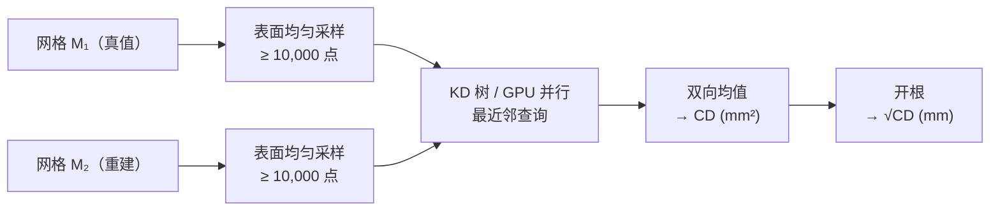

# Chamfer 距离：衡量两个点云的形状有多接近

> **一句话**：给两批点各找"最近的对应点"，把所有这些最近距离的平方取均值，再把两个方向都算一遍——这就是 Chamfer 距离，它用一个数字告诉你"两个三维形状差了多远"。

三维重建、Real2Sim、点云配准、CAD 匹配这些任务都需要一个数字来回答"重建出的形状和真实形状有多接近"。Chamfer 距离是这个问题的标准答案，几乎所有涉及三维几何精度的论文都用它评估结果。

## 知识链接

- [3D Gaussian Splatting：用一堆椭球把真实场景搬进电脑](/前置知识/007a_前置知识_3D_Gaussian_Splatting三维场景重建) — 3DGS 重建出的几何质量正是用 Chamfer 距离量化的
- [数字表亲与 Real2Sim 数据增广](/前置知识/010b_前置知识_数字表亲与Real2Sim数据增广) — Real2Sim 的几何还原精度用 Chamfer 距离报告

---

## 为什么要度量形状相似性

你有一个罐头的精确三维扫描（作为真值），还有你的算法重建出来的同一个罐头。怎么衡量"两个罐头形状有多像"？

最直觉的想法是"把对应顶点的距离加起来"。但问题来了：两个网格的顶点数量不同、顶点排列完全不同，根本无法一一对应。更根本的困难是，形状相似性本来就是**集合级别**的问题——不是"A 的第 37 个点和 B 的第 37 个点的距离"，而是"A 上每一个点，在 B 上能不能找到一个足够近的对应点"。

解决这个问题的标准方法是：在两个网格表面上各**采样**一批点，得到两个点集，再度量这两个点集有多接近。

## Chamfer 距离的公式

设 $S_1$ 和 $S_2$ 是从两个形状表面采样的两批三维点，Chamfer 距离定义为：

$$
\mathrm{CD}(S_1, S_2) = \frac{1}{|S_1|}\sum_{x \in S_1} \min_{y \in S_2} \|x - y\|^2 + \frac{1}{|S_2|}\sum_{y \in S_2} \min_{x \in S_1} \|y - x\|^2
$$

这个公式由两个方向的"平均最近邻距离"相加构成：

- **第一项**：从 $S_1$ 出发，对 $S_1$ 里的每个点 $x$，在 $S_2$ 里找距离 $x$ 最近的点，量这段距离的平方，对 $S_1$ 里所有点取均值。这一项衡量"$S_1$ 的每个点，$S_2$ 有没有对上"。
- **第二项**：反方向重复一遍，衡量"$S_2$ 的每个点，$S_1$ 有没有对上"。

> 左图（蓝色箭头）是从真值点云出发找重建点云里的最近邻；右图（红色箭头）是反方向。两张图的均值相加得到最终的 CD。留意两个方向的箭头并不总是指向同一对点——这是正常的，也是双向设计的必要性所在。

## 为什么必须算两个方向

单方向的"最近邻距离和"会漏掉一类重要的失败：**重建结果比真值多出额外的体积**。

具体来说，只算第一项（$S_1 \to S_2$）的问题是：如果重建出的 $S_2$ 是一个把真值 $S_1$ 完全包住的密集球，那 $S_1$ 里每个点都能在 $S_2$ 里找到很近的邻居——第一项很小，但形状差了十万八千里。加上第二项（$S_2 \to S_1$）就暴露了这个问题：$S_2$ 里大量多余的点在 $S_1$ 里找不到近邻，第二项很大，总 CD 就大。

一句话概括这两项的分工：**第一项检查"真值的每个部分有没有被重建覆盖"，第二项检查"重建的每个部分在真值上是否有来源"**。两者缺一不可。

## 数值单位：mm² 还是 mm

CD 的原始定义用的是距离的**平方**（$\|x-y\|^2$），单位是 mm²（如果空间坐标以 mm 为单位）。很多论文为了让数字更直观，对结果取平方根报告：

$$
\sqrt{\mathrm{CD}} \approx \text{平均最近邻距离（mm）}
$$

两种版本对同一批数据的**排序结果完全一致**——$A$ 比 $B$ 重建得好，在两种版本里都是 $A$ 的数更小。区别只是可读性：mm 比 mm² 更有物理感，知道"平均误差 3.3 mm"比"平均误差 10.9 mm²"更容易判断好不好。

读论文时务必确认用的是哪种版本，否则无法跨论文比较数字。

## 一个具体的数值算例

用四个点的简化例子说明计算过程。

真值点集 $S_1 = \{(0,0), (1,0), (1,1), (0,1)\}$（单位 mm，一个正方形的四个角）。

重建点集 $S_2 = \{(0.1, 0.1), (0.9, 0), (1.1, 1), (0, 0.9)\}$（轻微偏移）。

**第一项**：对 $S_1$ 每个点找 $S_2$ 中最近邻的距离²：

| $x \in S_1$ | 最近 $y \in S_2$ | 距离² |
|---|---|---|
| $(0, 0)$ | $(0.1, 0.1)$ | $0.01+0.01 = 0.02$ |
| $(1, 0)$ | $(0.9, 0)$ | $0.01+0 = 0.01$ |
| $(1, 1)$ | $(1.1, 1)$ | $0.01+0 = 0.01$ |
| $(0, 1)$ | $(0, 0.9)$ | $0+0.01 = 0.01$ |

均值 = $(0.02+0.01+0.01+0.01)/4 = 0.0125$ mm²。

**第二项**：对称地计算，结果相近，假设为 $0.0150$ mm²。

**总 CD** = $0.0125 + 0.0150 = 0.0275$ mm²，$\sqrt{\mathrm{CD}} \approx 0.166$ mm。

这个数字告诉我们：平均来说，重建和真值之间的最近邻距离约 0.17 mm，对于一个几厘米的罐头来说误差非常小。

## 和豪斯多夫距离（Hausdorff Distance）的比较

豪斯多夫距离取的是**最大**最近邻距离，而不是平均：

$$
\mathrm{HD}(S_1, S_2) = \max\!\left(\max_{x \in S_1}\min_{y \in S_2}\|x-y\|,\ \max_{y \in S_2}\min_{x \in S_1}\|y-x\|\right)
$$

| | Chamfer 距离 | 豪斯多夫距离 |
|---|---|---|
| 聚合方式 | 均值 | 最大值 |
| 对离群点的敏感度 | 低（单个离群点影响有限） | 极高（一个离群点决定整个结果） |
| 衡量的是 | 整体形状的平均接近程度 | 最坏情况下的形状差异 |
| 应用场景 | 3D 重建质量评估（主流） | 碰撞安全距离、保守误差界 |

三维重建任务里 Chamfer 更常用，原因是重建出来的网格免不了有少量噪点和离群面片，不应该让一两个噪点主导整个评分。

## 实践：怎么算

完整的计算流程是：

**采样数量**影响结果：点数越多，CD 越稳定，但算得越慢。实践中 10,000 ∼ 50,000 点通常已足够；低于 1,000 点时结果不稳定。

**最近邻加速**：朴素实现是 $O(|S_1| \cdot |S_2|)$ 的双重循环，$10^4$ 个点就是 $10^8$ 次运算，慢。实践中用 KD 树把单次查询降到 $O(\log n)$，或者用 CUDA 实现 GPU 并行化。Python 里 `trimesh.proximity.closest_point` 和 `pytorch3d.loss.chamfer_distance` 都是经过优化的实现。

## 局限性

Chamfer 距离**对拓扑不敏感**：一个球体和一个甜甜圈（拓扑不同）如果外表面采样点分布相似，CD 可以很小。需要区分孔洞、连通分量等拓扑特征时要用 Betti 数等拓扑度量补充。

CD 也**不反映局部曲率**：两个外表面完全一样但一个光滑、一个满是高频褶皱的网格，可以有相同的 CD。这也是为什么实际论文中 CD 通常和法线误差、渲染指标（PSNR/SSIM）一起报告，而不是单独使用。
