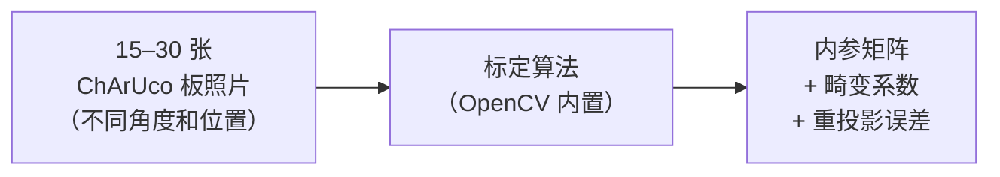
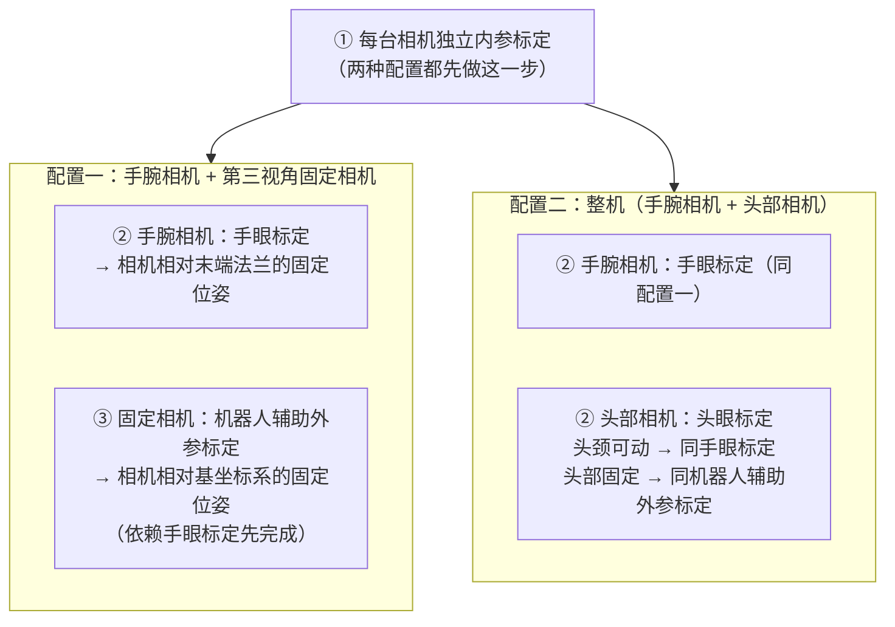
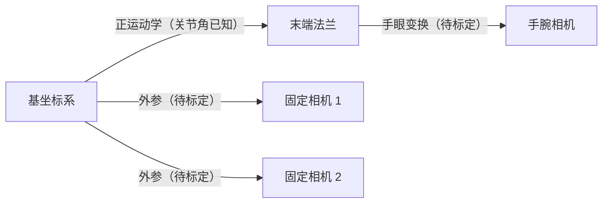
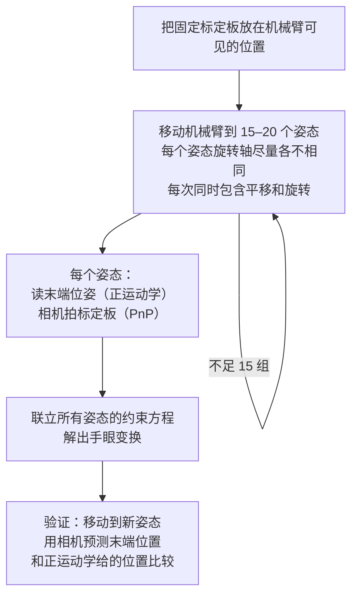
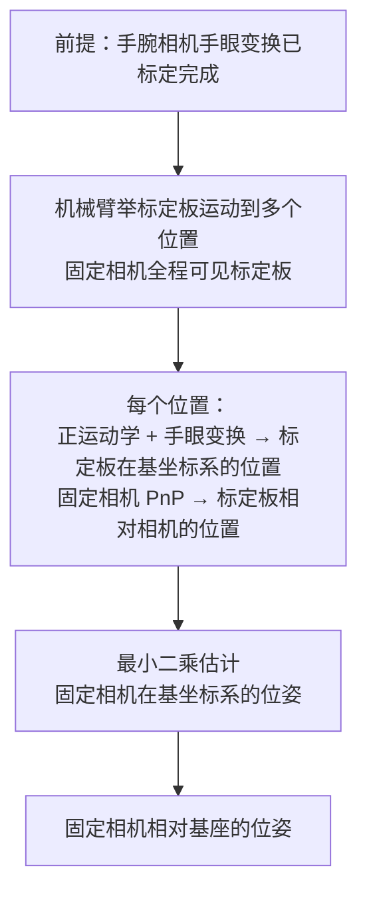
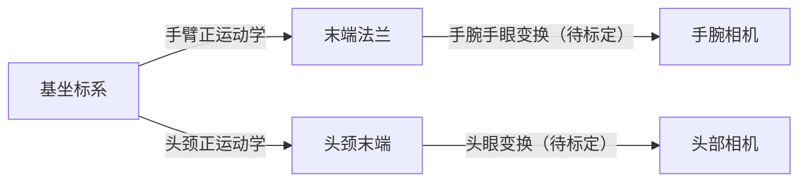
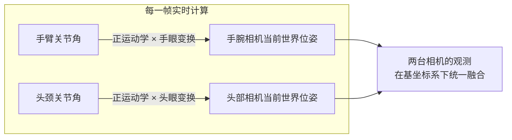
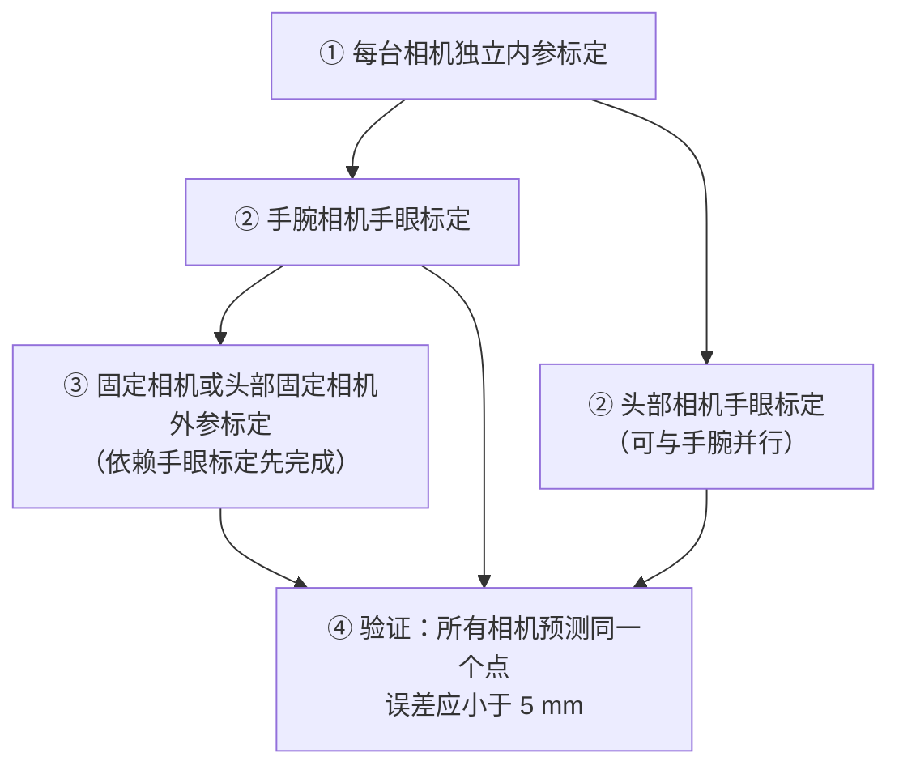

# 相机内外参标定：从棋盘格到可用参数的完整流程

> **前置阅读**：本文假设你已了解相机坐标系和投影变换基础。先读 [相机模型与坐标系全链路](/系列/3dgs_from_scratch/04_相机模型与坐标系全链路)——那篇文章讲清楚了世界→相机→像素的三段变换链路，本文直接在它基础上往前走。

---

## 一、标定在解决什么问题

拿到一台相机，你不知道它的焦距是多少像素、图像中心在哪里、镜头有多少畸变。厂商标注的参数是出厂测量值，经过运输、安装、温变之后会漂移。如果用错误的参数，机械臂根据视觉计算的抓取点可能差几毫米到几厘米。

标定要做的事情很简单：**给相机看一个"我知道它长什么样"的物体，把拍到的样子和已知的真实形状对比，反推出相机自己的参数。**

### 为什么用棋盘格

理想的标定物需要满足两个条件：每个特征点的三维坐标必须精确已知；这些特征点要能在图像里自动检测到，不需要手动标注。

棋盘格正好满足这两点：方格的尺寸由打印时决定，每个内角点的三维坐标可以精确推算；角点用算法能自动检测到亚像素级精度。

### 为什么用 ChArUco 而不是普通棋盘格

普通棋盘格有一个问题：如果图像边缘被遮挡，剩下的角点没有 ID，不知道哪个对应哪个，对应关系就乱了。

ChArUco 板在棋盘格的每个方格里嵌入一个 ArUco 二维码。每个角点有唯一 ID，即使遮挡一部分，剩下的角点照样能正确建立对应关系。所以实际标定都推荐 ChArUco。

**获取 ChArUco 板**：最直接的方式是用在线生成器导出 PDF，填好方格数和方格尺寸后直接打印：[calib.io ChArUco 生成器](https://calib.io/pages/camera-calibration-pattern-generator)。打印完用游标卡尺量实际方格尺寸，把实测值而不是名义值填进标定参数——打印机缩放误差通常有 0.5–2%。

---

## 二、内参标定：每台相机都要独立做一遍

### 内参是什么

相机内参描述"这台相机如何把光线投影到像素上"。它只和相机自身的物理属性有关，和相机装在哪里、和其他相机什么关系完全无关——只要镜头不动，同一台相机在任何地点拍任何东西，内参都一样。

内参包含两部分：

**内参矩阵**：四个数——水平焦距、垂直焦距、主点横坐标、主点纵坐标。焦距描述"图像里一个像素对应多大视角"，主点是光轴打到传感器的那个像素（理想情况是图像正中心，实际可能偏几十个像素）。

**畸变系数**：五个数，描述镜头让直线变弯的程度。三个数描述径向畸变（图像边缘的桶形或枕形弯曲），两个数描述切向畸变（镜片安装不完全平行于传感器带来的偏移）。鱼眼镜头需要完全不同的畸变模型，见 [鱼眼相机方案](/硬件基础/H09_鱼眼相机方案)。

### 标定流程

**输入**：同一块 ChArUco 板的 15–30 张照片，从不同角度和位置拍摄。

**输出**：内参矩阵（4 个数）、畸变系数（5 个数）、重投影误差（像素，用于评估质量）。

中间的算法（张正友法）自动完成所有计算：它从"我拍到的样子"和"已知的真实形状"的对比里反推参数，不需要手动做任何计算。

**拍摄要点**：

- 棋盘格要覆盖视场的四个角、边缘和中心，不能全堆在中间
- 对相机倾斜 ±30° 以上，不能全是正面正对
- 保证清晰，运动模糊是标定误差的主要来源

**质量评估**：重投影误差——用标定出来的参数把标定板的角点重新投影回图像，看预测位置和实际检测位置的距离。低于 0.5 像素优秀，0.5–1.0 像素可接受，超过 1.5 像素需要排查。

排查思路：去掉重投影误差最大的几张图（通常是模糊或遮挡导致的）、换用平整的铝板而非泡沫板、确保拍摄角度变化足够大。

---

## 三、两种典型配置总览

内参标定完之后，每台相机知道了自己"如何把光线变成像素"，但还不知道自己装在机器人的哪里。这是外参标定要解决的问题。

外参标定的目标只有一个：**让所有相机的位姿在机器人基坐标系下已知**，这样任意一台相机看到物体，都能把它转换到同一个坐标系里做规划和控制。

绝大多数情况落入两种配置：

---

## 四、配置一：手腕相机 + 第三视角固定相机

### 4.1 手腕相机：手眼标定

手腕相机装在机械臂末端，随末端一起运动。需要标定的是"相机相对末端法兰的固定位姿"——相机一旦装好就不变，这就是手眼变换。

**核心思路**：移动机械臂到不同姿态，每个姿态有两个信息来源。机械臂通过正运动学知道末端动了多少，相机通过观测固定标定板知道自己动了多少。这两个运动量里都含有未知的手眼变换，每个姿态给出一个约束方程，积累足够多的姿态后联立求解。这就是经典的 AX=XB 问题。

**输入**：15–20 个机械臂姿态，每个姿态记录末端位姿（正运动学）和相机拍到的标定板位姿（PnP 求解）。

**输出**：相机相对末端法兰的旋转和平移（固定不变）。

> 纯平移运动无法约束旋转部分，纯旋转无法约束平移部分——每组运动必须同时包含两者。旋转轴平行的两组姿态约束等价，所以每次移动的旋转方向要尽量不同。

### 4.2 固定相机：机器人辅助外参标定

固定相机装在桌面或支架上，没有正运动学可用。标定方法是**让机械臂举着标定板充当"活动的参照物"**：

机械臂通过正运动学加上已知的手眼变换，知道"标定板此刻在基坐标系里的精确位置"。固定相机同时拍这块板，通过 PnP 算出"标定板相对自己的位置"。两个信息联立，就能算出固定相机在基坐标系里的位置。

**输入**：机械臂举板运动到多个不同位置，每个位置读取末端位姿和固定相机拍的标定板图像。

**输出**：固定相机相对基坐标系的旋转和平移（固定不变）。

**关键顺序**：固定相机的标定依赖手眼变换已知，所以必须在手腕相机手眼标定完成之后才能做。

实际工程中更常见的做法：让手腕相机和固定相机同时看同一块板，手腕相机的结果直接给出标定板在基坐标系的位置，不需要依赖正运动学精度，误差更小。

### 4.3 有多台固定相机

每台固定相机独立走 4.2 节的流程，各自在基坐标系下标定。不需要两两之间额外标定——两台相机各自在基坐标系下的位姿已知，先走到基坐标系、再走到另一台相机，就能推算出它们的相对位姿。

---

## 五、配置二：整机（手腕相机 + 头部相机）

典型场景：人形机器人，手腕和头部各有相机，头部相机提供全局视野，手腕相机提供精细的近距离视觉。

和配置一的关键区别：**头部相机的世界位姿不是固定值**，随头颈关节角实时变化，每帧都要重新计算。

### 5.1 头部相机的标定方式

取决于头颈关节的设计：

| 情况 | 标定方法 |
|------|---------|
| 头颈有独立关节（最常见） | AX=XB 手眼标定，和手腕相机完全一样，只是用头颈关节的正运动学代替手臂关节 |
| 头部刚性连接基座 | 等价于配置一的固定相机，走机器人辅助外参标定 |

绝大多数人形机器人头颈可动，标定步骤和 4.1 节完全一致，只需把"手臂关节"换成"头颈关节"。

### 5.2 运行时：两台相机如何协作

标定完成后，运行时每一帧：手臂关节角通过正运动学算出末端位姿，乘以手眼变换，得到手腕相机当前在基坐标系的位置；同样地，头颈关节角通过正运动学算出头颈末端位姿，乘以头眼变换，得到头部相机当前在基坐标系的位置。两台相机的观测结果都在同一个坐标系下，可以直接融合。

---

## 六、完整标定顺序

两种配置都有严格的依赖顺序：

配置一的标定顺序：① → ② 手腕 → ③ 固定相机 → ④ 验证

配置二的标定顺序：① → ② 手腕和头部（可并行）→ ④ 验证

---

## 七、验证

**内参**：重投影误差低于 0.5 像素优秀，0.5–1.0 可接受，超过 1.5 需要排查（常见原因：模糊的图片、棋盘格不平整、拍摄角度变化太少）。

**手眼标定**：移动机械臂到没参与标定的新姿态，用相机预测末端位置，和正运动学给的位置比较。误差应在 3–8 mm 以内，取决于机械臂精度和相机分辨率。

**多相机一致性**：机械臂举一个标志点到所有相机共视的位置，各相机独立预测这个点在基坐标系的坐标，比较各预测之间的一致性。误差应在 5 mm 以内。

---

## 延伸阅读

- **坐标系和投影公式基础**：[相机模型与坐标系全链路](/系列/3dgs_from_scratch/04_相机模型与坐标系全链路)
- **鱼眼相机标定**：[鱼眼相机方案](/硬件基础/H09_鱼眼相机方案)——Kannala-Brandt 模型，流程类似但畸变模型不同
- **手眼标定工程细节**：[运动学参数辨识](/系列/system_identification_deep_dive/03_运动学参数辨识)——AX=XB 的多种求解方法和踩坑记录
- **仿真环境内参对齐**：[IsaacLab 仿真对齐与参数调优](/工程实践/IsaacLab仿真对齐与参数调优)
