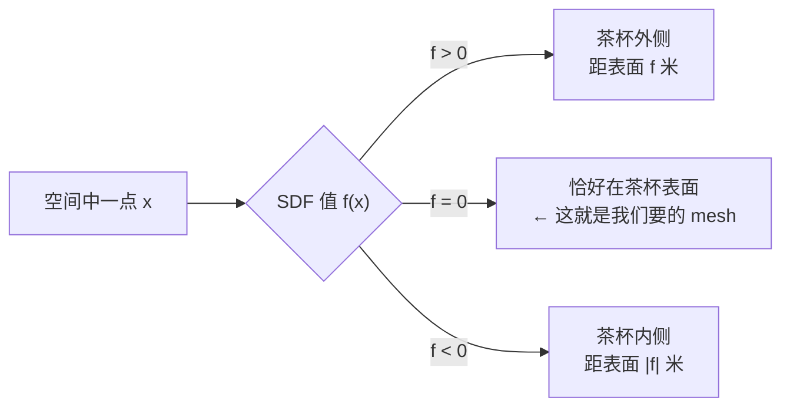
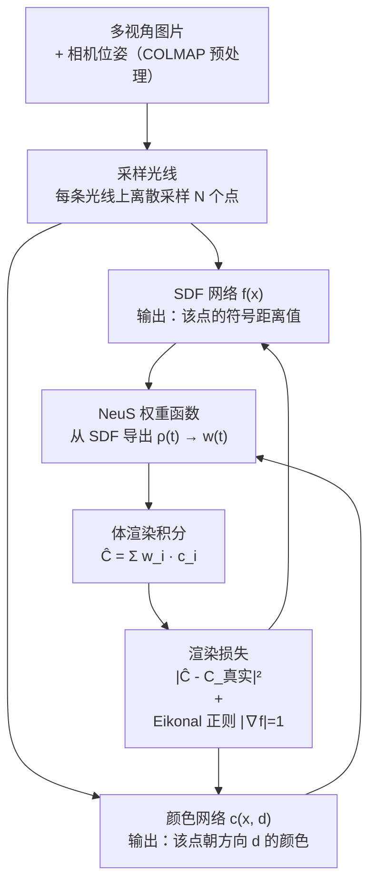

# 前置知识：NeuS——用符号距离场把"模糊密度"变成精确表面

> **一句话**：NeuS 训练一个神经网络，让它在三维空间里每个点输出一个带正负号的距离值（"离最近表面有多远、在表面的哪一侧"）。表面就是这个距离场的零点集合。训练只靠多视角图片，不需要任何 3D 监督，训练完之后能用 Marching Cubes 算法一键提取出干净的三角面网格（mesh）。
>
> **为什么要学**：[3D Gaussian Splatting](/前置知识/007a_前置知识_3D_Gaussian_Splatting三维场景重建) 重建效果惊艳，但它本质上是把场景记成一堆半透明椭球，提取出来的几何（表面 mesh）质量往往参差不齐——物体内部有浮点、背面有空洞、薄结构容易断裂。Real2Sim 工作流需要几何来做物理仿真和碰撞检测，这时候 3DGS 的几何就不够用了。NeuS 走的是另一条路：几何优先，渲染服务于几何。它重建出的 mesh 更干净、更适合后续仿真。理解 NeuS 是理解"几何重建 + 外观渲染两步分工"这一思路的基础。

## 相关阅读

- [3D Gaussian Splatting：用一堆椭球把真实场景搬进电脑](/前置知识/007a_前置知识_3D_Gaussian_Splatting三维场景重建) — NeuS 和 3DGS 解决同一个输入（多视角图片），但设计目标不同；读完本文后对比来看会更清楚各自的取舍
- [碰撞近似类型：Bounding / Convex / Mesh / SDF 的原理](/前置知识/011a_前置知识_碰撞近似类型_原理精度与性能) — SDF 在物理仿真里作为碰撞表示已经存在很久，本文的 SDF 是用神经网络来学习它，背后的概念是相通的

---

## 贯穿全文的例子

> **场景**：你拿手机围着桌上的一个陶瓷茶杯走一圈，拍了 100 张图（已用 COLMAP 算出每张图的相机位姿）。目标是重建出这个茶杯的完整三角面网格，精细到杯口的弧度、杯壁的厚度——不是用来渲染看着好看就行，而是要放进仿真器做机器手抓取训练。本文会反复用这个茶杯来解释每一个概念。

---

## 一、NeRF 的几何问题：密度云没有表面

在讲 NeuS 之前，先搞清楚为什么 [NeRF](/前置知识/007a_前置知识_3D_Gaussian_Splatting三维场景重建) 风格的方法（包括 3DGS）在几何上有天然缺陷。

NeRF 用一个神经网络学习空间中每个点的**密度** $\sigma$（"这个点有多不透明"）和颜色。密度是一个非负实数，没有任何约束说"密度高的点一定构成一个表面"。在茶杯的例子里，杯壁附近的密度会很高，但"高密度区域"是一个有厚度的云团，不是一个精确的二维曲面。

如果你想从这个密度场提取出茶杯的表面 mesh，常见的做法是找等密度面（比如 $\sigma = 0.5$）。这个阈值的选取非常敏感：

- 阈值太低 → 表面发胖，边缘模糊
- 阈值太高 → 薄的结构（杯口边缘）消失
- 不同场景最佳阈值不同，没有普适的选法

更深的问题是，NeRF 的密度场在优化时只受"渲染出来的像素颜色要和真实照片匹配"这一个约束。这个约束对渲染质量足够，但对几何精度不够：同一张渲染图可以由很多种不同的密度分布生成（这个现象叫**形状-辐射二义性**，shape-radiance ambiguity）——让颜色对但让几何错，优化器不会惩罚。

NeuS 的出发点就是：把"表面是什么"这件事从模糊的密度阈值，变成一个数学上精确定义的零点集。

---

## 二、SDF：让表面变成数学零点

**符号距离场**（Signed Distance Field，SDF）是一种描述"表面在哪里"的函数：空间中每个点 $\mathbf{x}$ 对应一个实数值 $f(\mathbf{x})$，这个值的绝对值是该点到最近表面的距离，符号表示该点在表面的哪一侧。

$$
f(\mathbf{x}) = \begin{cases} +d & \text{表面外侧，距表面 } d \\ 0 & \text{恰好在表面上} \\ -d & \text{表面内侧，距表面 } d \end{cases}
$$

**这个公式在做什么**：给三维空间的任意一点贴一个"离表面多远、在哪侧"的标签，表面本身就是 $f=0$ 的等值面（零值集）。

::: details 📐 公式详解（点击展开）

| 子表达式 | 它是谁 | 它在干嘛 |
|---------|--------|---------|
| $f(\mathbf{x})$ | **距离标签** | 空间中某点的 SDF 值，正外负内，绝对值是物理距离 |
| $f(\mathbf{x}) = 0$ | **表面本身** | 所有 SDF 值为零的点的集合，就是物体表面 |
| 正负号 | **内外判断** | 区分"在茶杯外面"还是"在茶杯里面" |

**用人话读**："空间每个点都贴一个带正负号的距离标签，贴着 0 的那层就是茶杯的外壳。"

**为什么用符号（正负）而不只用距离**：只有无符号距离时，你无法区分"在物体外面 5mm"和"在物体里面 5mm"——两者都返回 5。符号让表面两侧有了明确区分，这对 mesh 提取（知道哪侧是内、哪侧是外）至关重要。
:::

SDF 还有一个重要性质：在光滑区域，$|\nabla f(\mathbf{x})| = 1$（梯度范数为 1，称为**程函方程**，eikonal equation）。这条性质在后面训练时会作为约束显式加入损失函数。

> 上图说明 SDF 的三个区域。mesh 提取就是找出所有 $f=0$ 的点并连成三角面，这一步用 Marching Cubes 算法完成，不需要任何阈值调参。

---

## 三、体渲染回顾：从场到像素颜色

NeuS 借用了 NeRF 的体渲染框架来训练——只有多视角图片作为监督信号，没有任何 3D 真值。因此我们需要能从 SDF 场"渲染"出像素颜色来和真实图片对比。

体渲染的核心思路是：对于图片上的每个像素，从相机发出一条光线，沿光线方向对空间积分，把光线上各点的颜色按照各点的"被看见概率"加权求和，结果就是该像素的预测颜色。

$$
\hat{C}(\mathbf{r}) = \int_0^{+\infty} w(t) \cdot \mathbf{c}(\mathbf{r}(t)) \, dt
$$

**这个公式在做什么**：把光线上所有点的颜色 $\mathbf{c}$ 按权重 $w(t)$ 加权求和，得到这条光线对应的像素颜色预测值。

::: details 📐 公式详解（点击展开）

| 子表达式 | 它是谁 | 它在干嘛 |
|---------|--------|---------|
| $\mathbf{r}(t) = \mathbf{o} + t\mathbf{d}$ | **光线参数化** | 光线从相机原点 $\mathbf{o}$ 出发，沿方向 $\mathbf{d}$，$t$ 是距离参数 |
| $w(t)$ | **权重函数** | 光线上距离 $t$ 处的点对最终颜色的贡献比例；必须归一化：$\int w(t)dt = 1$ |
| $\mathbf{c}(\mathbf{r}(t))$ | **点颜色** | 光线上 $t$ 处的颜色，由网络预测 |
| $\hat{C}$ | **像素颜色预测** | 和真实像素颜色比较，计算渲染损失 |

**用人话读**："光线上每个位置都有颜色，把这些颜色按'在那个位置有多大概率挡住后面的光'加权求和，就是预测的像素颜色。"

**实际训练中怎么近似**：对光线上离散采样 $N$ 个点，用黎曼和代替积分：$\hat{C} \approx \sum_{i=1}^N w_i \mathbf{c}_i$。
:::

关键在于：**权重函数 $w(t)$ 应该怎么从 SDF 里来？** 这正是 NeuS 需要解决的核心问题。

---

## 四、NeuS 的核心设计：无偏权重函数

### 4.1 朴素做法为什么不行

最直接的想法是：把 SDF 经过一个 sigmoid 函数变成"不透明度"，再套进 NeRF 的体渲染公式里。sigmoid 在 $f=0$（表面处）值为 0.5，在外部趋近 0，在内部趋近 1，感觉很合理。

但这个做法有一个隐藏的系统误差：sigmoid 的导数峰值不在 $f=0$ 处，而是稍微偏向内部。这意味着权重峰值不在真实表面上——渲染出来的颜色是表面略靠里一点的颜色，和真实图片的误差会系统性地把 SDF 的零值面推偏，最终几何是错的。

NeuS 把这个问题叫做**有偏**（biased），它的目标是设计一个**无偏**（unbiased）权重函数：权重峰值精确落在 SDF 零点处，不偏不倚。

### 4.2 NeuS 的权重函数设计

NeuS 先定义一个"不透明度密度"函数，用 logistic 密度函数（sigmoid 的导数）从 SDF 得到：

$$
\rho(t) = \frac{\frac{d}{dt}\Phi_s(f(\mathbf{r}(t)))}{\Phi_s(f(\mathbf{r}(t)))}  = \max\!\left(\frac{-\frac{d}{dt}\Phi_s(f)  }{\Phi_s(f)}, 0\right)
$$

其中 $\Phi_s$ 是带温度参数 $s$ 的 sigmoid：$\Phi_s(x) = \frac{1}{1+e^{-sx}}$。

**这个公式在做什么**：把 SDF 的梯度信息转化成类似 NeRF 的"体密度"，但以精确保证权重峰值在 $f=0$ 的方式构造出来。

::: details 📐 公式详解（点击展开）

| 子表达式 | 它是谁 | 它在干嘛 |
|---------|--------|---------|
| $\Phi_s(f)$ | **sigmoid 温度门** | 把 SDF 值映射到 (0,1)；$s$ 越大曲线越陡，表面越锐利 |
| $-\frac{d}{dt}\Phi_s(f)$ | **密度信号** | 沿光线方向 sigmoid 值下降最快的地方——就是 SDF 从正变负穿越零点的那一刻 |
| $\max(\cdot, 0)$ | **单向门** | 只取密度为正的部分，防止从内部穿出时产生负密度 |
| $\rho(t)$ | **不透明度密度** | 可以直接代入标准体渲染的透射率公式 |

**用人话读**："在光线穿越表面（SDF 从正变负）的那一刻，密度函数会出现一个尖峰——这个尖峰就是渲染权重的来源，而且它精确落在 SDF=0 的位置。"

**为什么是这个形式而不是直接用 sigmoid**：直接用 $\sigma = \Phi_s(f)$ 作为体密度，它的值在内部（$f<0$）一直很高，光线进入物体后一直在"吸收"——这会让物体内部的颜色渗进来，导致偏差。用 sigmoid 的导数除以 sigmoid 本身，得到的是"在这个位置、刚穿入表面的概率"，而不是"在这个位置有多不透明"，两者只在表面附近一致，但后者不会在内部无限累积。

**$s$ 参数的物理意义**：$s$ 控制 sigmoid 的"陡峭程度"，等价于控制"表面的软硬"。$s$ 大 → 表面锐利（密度尖峰细且高）；$s$ 小 → 表面模糊（密度尖峰宽而矮）。训练时 $s$ 从小到大逐渐增大，让模型先找到大致位置再精细化。
:::

### 4.3 配图：NeuS 的权重峰值 vs 朴素 sigmoid

> 右图中蓝色曲线（NeuS）的峰值精确落在 $t=0$（SDF=0 的表面位置），橙色曲线（朴素 sigmoid 方案）的峰值向左偏移——这个偏差会在优化时系统性地把重建出的表面推离真实位置。

---

## 五、完整训练流程

NeuS 同时训练两个网络：

> 两个网络共享同一套体渲染框架，但分工明确：SDF 网络只管几何，颜色网络在几何确定之后管外观。Eikonal 正则约束让 SDF 的梯度范数保持为 1，保证 SDF 的物理意义不会在训练中退化。

训练结束后，SDF 网络就是一个定义在三维空间上的连续函数。提取 mesh 的步骤很直接：在场景空间里建一个均匀网格，用 SDF 网络对每个网格顶点做前向传播，然后对 $f=0$ 的等值面跑 Marching Cubes 算法，输出三角面网格。

---

## 六、损失函数

NeuS 的总损失分两部分：

$$
\mathcal{L} = \mathcal{L}_\text{color} + \lambda \mathcal{L}_\text{eikonal}
$$

**这个公式在做什么**：渲染损失让几何服务于外观——预测颜色必须和真实图片一致；Eikonal 正则让外观服务于几何——SDF 的数学性质必须保持成立。两项缺一不可。

::: details 📐 总损失结构详解（点击展开）

| 子表达式 | 它是谁 | 它在干嘛 |
|---------|--------|---------|
| $\mathcal{L}_\text{color}$ | **渲染监督** | 唯一的外部信号，用真实照片约束 SDF 的正确性 |
| $\mathcal{L}_\text{eikonal}$ | **几何自律** | 内部约束，让 SDF 在数学上真的是距离场 |
| $\lambda$ | **平衡系数** | 控制两个目标的权重，论文中取 0.1 |

**用人话读**："一只手拿着照片校正几何，另一只手拿着尺子保证几何是合法的距离场，两手同时用力，最终得到一个既渲染真实又几何干净的 SDF。"

**为什么不能只有渲染损失**：仅靠渲染损失，网络可以学出一个"对渲染正确但对几何没意义"的函数——梯度范数在各处不为 1，SDF 值不等于真实物理距离，提取出的 mesh 会扭曲变形。Eikonal 正则是几何质量的守门员。
:::

渲染损失的具体形式：

$$
\mathcal{L}_\text{color} = \frac{1}{|\mathcal{R}|} \sum_{\mathbf{r} \in \mathcal{R}} \|\hat{C}(\mathbf{r}) - C(\mathbf{r})\|_1
$$

**这个公式在做什么**：对 mini-batch 里每条采样光线，把预测颜色和真实像素颜色的差值取 L1 范数，求平均——差越大惩罚越重。这是 NeuS 唯一的外部监督信号，没有任何深度图或点云。

::: details 📐 渲染损失详解（点击展开）

| 子表达式 | 它是谁 | 它在干嘛 |
|---------|--------|---------|
| $\hat{C}(\mathbf{r})$ | **预测颜色** | 体渲染积分对光线 $\mathbf{r}$ 输出的像素颜色 |
| $C(\mathbf{r})$ | **真实颜色** | 训练图片上对应像素的 RGB 值 |
| $\|\cdot\|_1$ | **L1 范数** | 逐通道绝对值之和；比 L2 对高光、反射等离群点更鲁棒 |
| $\mathcal{R}$ | **采样光线集合** | 每个 mini-batch 从所有训练图片随机采样的一批像素对应的光线 |
| $\frac{1}{|\mathcal{R}|}$ | **批平均** | 对整个 batch 取平均，使损失量级与 batch size 无关 |

**用人话读**："随机抽一批像素，每个像素发一条光线，体渲染出预测颜色，和真实照片像素做差，差值越大说明 SDF 几何越偏，损失越高。"

**为什么用 L1 而不是 L2**：真实场景里有高光、镜面反射、运动模糊等噪声像素，这些像素的颜色无论怎么优化都不可能完全拟合。L2 会把这些"不可拟合"的像素放大惩罚（平方），拉着 SDF 往错误方向走；L1 对这类离群点的惩罚是线性的，更宽容，几何不会被少数坏像素带偏。
:::

Eikonal 正则的形式：

$$
\mathcal{L}_\text{eikonal} = \frac{1}{|\mathcal{P}|} \sum_{\mathbf{x} \in \mathcal{P}} \bigl(\|\nabla f(\mathbf{x})\|_2 - 1\bigr)^2
$$

**这个公式在做什么**：在空间中随机采样一批点，要求 SDF 网络在这些点上的梯度范数尽量等于 1——偏离 1 的程度就是惩罚。这把 SDF 的"符号距离"含义锁死，防止网络学出一个"数值正确但物理无意义"的函数。

::: details 📐 Eikonal 正则详解（点击展开）

| 子表达式 | 它是谁 | 它在干嘛 |
|---------|--------|---------|
| $\nabla f(\mathbf{x})$ | **SDF 梯度** | 网络输出对输入坐标的梯度，通过反向传播计算 |
| $\|\nabla f(\mathbf{x})\|_2$ | **梯度范数** | 梯度向量的长度；对真正的距离场，这个值处处应为 1 |
| $(\cdot - 1)^2$ | **偏离惩罚** | 梯度范数偏离 1 的平方；范数为 1 时惩罚为 0 |
| $\mathcal{P}$ | **采样点集合** | 光线上的离散采样点 + 场景空间随机均匀采样的额外点 |

**用人话读**："随机抽一批空间点，检查 SDF 网络在这些点上的梯度长度，不是 1 就惩罚——让整个空间里的 SDF 都严格等于真实物理距离，而不是一个被拉伸扭曲的近似版本。"

**为什么 Eikonal 约束对几何质量这么重要**：如果没有这个约束，网络可以学出"软化版 SDF"——表面附近梯度很大（坡度陡），远处梯度很小（坡度平）。这样的函数在渲染上可能也表现不差，但用它提取 mesh 时 Marching Cubes 找到的零值面会有形状扭曲：在梯度大的地方表面被压扁，在梯度小的地方表面被拉伸。Eikonal 正则保证全局几何尺度一致。
:::

---

## 七、NeuS vs 3DGS：取舍对比

| | NeuS | 3DGS |
|---|---|---|
| **表示方式** | 隐式 SDF 网络 | 显式高斯椭球集合 |
| **几何精度** | 高——零值面有物理意义，mesh 干净 | 中——需后处理才能提取可用 mesh |
| **渲染速度** | 慢（训练几小时，渲染毫秒级但需较多采样） | 快（训练 20-40 分钟，实时渲染 100+ fps） |
| **训练后获得什么** | 一个 mesh（适合仿真） | 一堆高斯点（适合渲染） |
| **物体背面/遮挡区域** | 好——SDF 对未见区域有连续性约束 | 差——没有观测到的区域没有高斯点 |
| **薄结构** | 好——SDF 零值面可以任意薄 | 差——高斯点在薄结构处容易断裂或穿帮 |
| **Real2Sim 适用性** | 适合需要精确几何的仿真 | 适合只需要视觉渲染的评估 |

在 Real2Sim 工作流里，两者经常组合使用：**NeuS（或类 NeuS 方法）做几何重建 → 提取 mesh → 放进物理仿真器；3DGS 做外观重建 → 实时渲染用于策略评估**。

---

## 八、主要变体与后续工作

NeuS 发表于 2021 年（NIPS 2021），此后出现了几个重要变体：

- **NeuS2**（2023）：引入哈希编码（Instant-NGP 风格），把训练时间从几小时压缩到几分钟，工程可用性大幅提升
- **VolSDF**（2021，同期工作）：用 Laplace 分布代替 logistic 密度，达到类似的无偏保证，数学推导角度略有不同
- **UniSurf**（2021）：统一了隐式表面和体渲染的优化目标，更容易在有遮挡的场景下收敛
- **2DGS / SuGaR**（2024）：把 3DGS 的显式表示和表面约束结合，用平面高斯贴近表面，试图在保持渲染速度的同时改善几何质量——可以理解为"用 3DGS 的方式逼近 NeuS 的几何效果"

---

## 知识链接

- [3D Gaussian Splatting：用一堆椭球把真实场景搬进电脑](/前置知识/007a_前置知识_3D_Gaussian_Splatting三维场景重建) — 理解 NeuS 和 3DGS 的取舍，两文对比来读
- [碰撞近似类型：Bounding / Convex / Mesh / SDF 的原理](/前置知识/011a_前置知识_碰撞近似类型_原理精度与性能) — SDF 作为仿真碰撞表示的工程背景
- [RialTo：手机扫描建数字孪生，Real-to-Sim-to-Real 强化学习鲁棒化操作策略](/论文综述/114_RialTo_数字孪生RL策略学习) — 实际在 Real2Sim 流程里用隐式重建做机器人训练的工作

