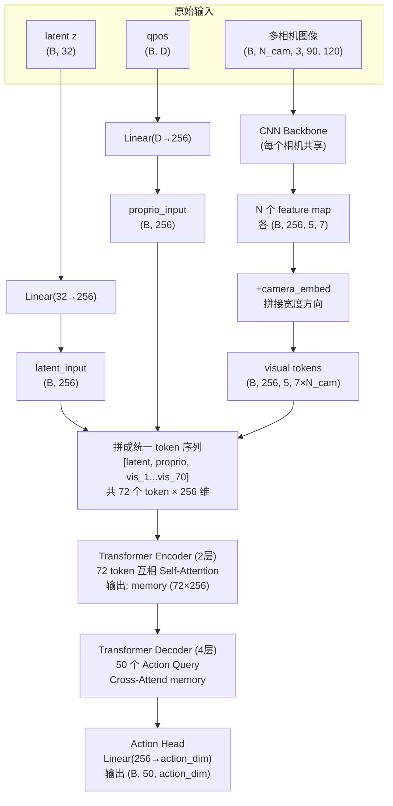
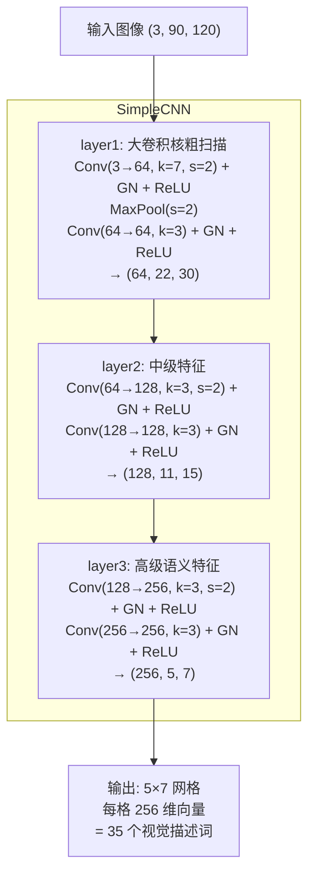
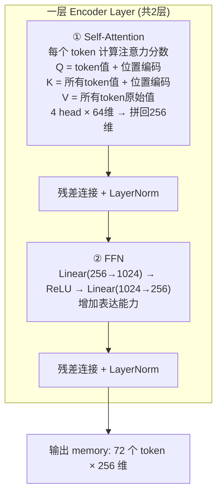
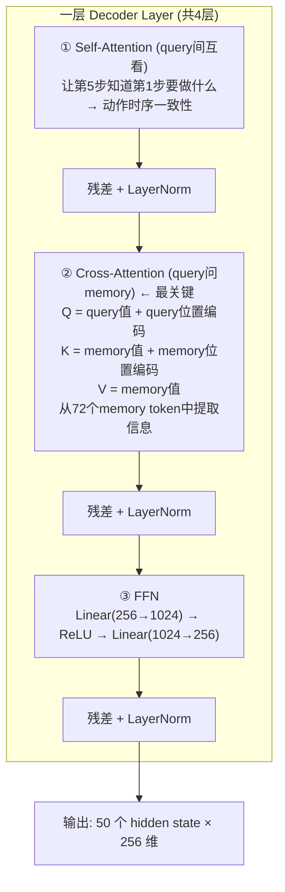
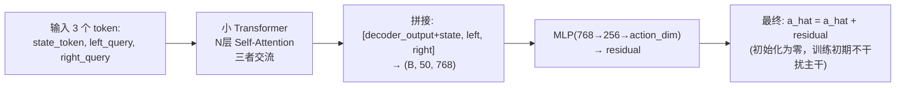

# ACT Decoder 架构详解

## 一、整体定位

ACT 模型分为 **Encoder（CVAE Encoder）** 和 **Decoder** 两大部分。

- **Encoder**：训练时把"未来动作序列"压缩成一个 32 维 latent code $z$；推理时直接用零向量代替。
- **Decoder**：拿到 $z$ 后，结合当前"眼睛看到的图像"和"身体感知的关节状态"，一口气预测未来 50 步动作。

本文只讲 **Decoder**。

---

## 二、Decoder 要回答的问题

> 给定：
> 1. 一个 latent code（描述"要做什么风格的动作"）
> 2. 当前关节状态 qpos（描述"身体现在什么姿势"）
> 3. 多个相机的图像（描述"眼前看到了什么"）
>
> 请输出：未来 50 个时间步的动作序列。

---

## 三、总体流程图

---

## 四、逐步拆解

### 4.1 视觉特征提取（"机器人的眼睛"）

每个相机就像机器人的一只眼睛，CNN 就是视网膜，把原始像素变成"看到了什么物体在什么位置"的特征表达。

输出的 5×7 网格可以理解为 35 个"视觉描述词"，描述图像不同区域的内容。

**Position Encoding（位置编码）**：CNN 输出只告诉你"看到了什么"，但不告诉 Transformer"这个东西在画面的哪个位置"。所以用 2D 正弦编码告诉每个格子它在图像中的坐标。

**多相机拼接**：假设 2 个相机，每相机输出 $(256, 5, 7) = 35$ 个 token。每个相机特征加上一个"相机身份标记"（camera\_embed），然后在宽度方向拼接，得到 $(256, 5, 14) = 70$ 个 visual token。

70 个 visual token 就是"机器人用两只眼睛看到的 70 个视觉线索"。

---

### 4.2 构建统一 Token 序列（"把所有线索摊在桌上"）

把三种不同来源的信息统一成 token 序列，让 Transformer 可以处理：

| 位置 | Token | 含义 |
|------|-------|------|
| 0 | latent\_token | "我想做什么风格/意图的动作" |
| 1 | proprio\_token | "我的身体现在是什么姿势" |
| 2~71 | visual tokens | "我看到了什么东西在哪里" |

每个 token 都是一个 256 维向量，共 72 个。

**位置编码策略**：
- Token 0 和 1（latent、proprio）：用 **learned** PE — 网络自己学出来怎么标记它们
- Token 2~71（visual）：用 **2D sine** PE — 固定公式编码空间位置

为什么？因为 visual token 有确定的空间位置（图像的第几行第几列），用公式就够了。而 latent 和 proprio 是抽象信息，没有空间概念，所以让网络自己学。

---

### 4.3 Transformer Encoder（"让所有线索互相交流"）

让这 72 个 token 之间互相通信，融合信息。

类比：你有 72 张卡片摊在桌上，每张卡片可以"看"其他所有卡片并更新自己的理解。
- visual token "看到" proprio token → 知道当前手在哪，判断眼前物体是否够得到
- proprio token "看到" visual token → 把关节状态和视觉场景关联起来
- latent token "看到" 一切 → 把意图传播到所有信息中

经过 2 轮交流后，每个 token 不再只包含自己的信息，而是融合了其他所有 token 的相关信息：
- visual token 现在"知道"机器人想做什么（从 latent token 学到的）
- proprio token 现在"知道"环境长什么样（从 visual token 学到的）

---

### 4.4 Transformer Decoder（"50 个提问者依次提问"）

有 50 个 "Action Query"，代表未来 50 个时间步。它们去"询问" encoder 的 memory："在你看到和知道的所有信息下，我这一步应该输出什么动作？"

初始状态：50 个 query 初始值全为 0（没有先验），但每个 query 有一个 learned position embedding，告诉网络"我是第几步"。

为什么要 4 层？每多一层，query 就多一次机会从 memory 中提取信息并互相协调。4 层之后，每个 query 已经充分理解了视觉场景、机器人状态、动作意图，query 之间已经协商好了时序连贯的动作方案。

---

### 4.5 Action Head（"翻译成具体动作"）

Transformer Decoder 输出的是抽象的 256 维向量，还需要映射成实际的关节角度/末端位姿。

**简单版**：$\text{Linear}(256 \to \text{action\_dim})$，每个 time step 独立映射。

**双臂灵巧手版** ($\text{action\_dim}=62$)：

| 分支 | 网络结构 | 输出维度 | 含义 |
|------|----------|----------|------|
| left\_pos | MLP(256→256→3) | 3 | 左手位置 xyz |
| left\_rot6d | MLP(256→256→6) | 6 | 左手旋转 6D |
| right\_pos | MLP(256→256→3) | 3 | 右手位置 xyz |
| right\_rot6d | MLP(256→256→6) | 6 | 右手旋转 6D |
| left\_grip | MLP(256→256→22) | 22 | 左手22个关节 |
| right\_grip | MLP(256→256→22) | 22 | 右手22个关节 |

最终拼接：$3+6+3+6+22+22 = 62$ 维。

---

### 4.6 可选：Interact Segment Encoder（"左右手额外协商"）

专门让左右手在 action head 之后再做一轮残差修正：

---

## 五、关键设计决策 Q&A

### Q: 为什么不直接用 CNN 输出做动作？还要套 Transformer？

CNN 提取的是局部特征（这个像素附近有什么），但做动作需要全局推理（物体在哪 + 手在哪 + 要移到哪 = 应该怎么动）。Transformer 的 attention 机制天然适合做这种"远距离信息整合"。

### Q: 为什么 Encoder 和 Decoder 要分开？直接一个 Transformer 不行吗？

分开有明确的分工：
- Encoder 负责"理解当前情况"（融合 latent + 视觉 + 本体感知）
- Decoder 负责"规划动作序列"（用 query 去查询情况来生成动作）

如果合在一起，50 个 action token 和 72 个条件 token 全部互相 attend，计算量大且梯度信号混乱。

### Q: query\_embed 是什么？为什么初始化全零的 tgt 能工作？

`query_embed` 是 50 个 learned 向量，相当于"我是第 k 步"的身份证。`tgt` 虽然初始为零，但 attention 中 Q 和 K 都加了 `query_embed`，所以第一层就能根据"我是第几步"去 memory 中找相关信息。经过 4 层迭代，tgt 逐渐被填充为有意义的动作表征。

### Q: position embedding 为什么加到 Q 和 K 上，而不加到 V 上？

PE 的作用是让注意力分数计算时考虑位置关系（"这两个 token 距离近吗"），而 V 是被聚合的内容本身。如果把 PE 加到 V 上，会污染输出的语义内容。这是 DETR 系列的标准做法。

### Q: 2 层 Encoder + 4 层 Decoder，为什么不对称？

Encoder 的任务相对简单（融合已有信息），2 层足够。Decoder 的任务更难（从零开始生成 50 步动作并保持时序一致性），需要更多层来逐步精化。

---

## 六、数值示例（默认配置）

假设 2 个相机，$\text{action\_dim}=62$（双臂灵巧手）。

| 阶段 | 维度 |
|------|------|
| 每相机图像 | $(3, 90, 120) \to \text{CNN} \to (256, 5, 7) = 35$ 个 token |
| 2 相机合并 | 70 个 visual token |
| Encoder 输入 | $[\text{latent}(1) + \text{proprio}(1) + \text{visual}(70)] = 72 \times 256$ |
| Encoder 输出 | memory $= 72 \times 256$ |
| Decoder query | $50 \times 256$，Cross-attend to memory |
| Action Head | $50 \times 256 \to 50 \times 62$ |
| 最终输出 | $(B, 50, 62)$ — 50步，每步62维动作 |

---

## 七、一句话总结

ACT Decoder = **把所有感知信息（视觉+本体+意图）统一成 token → Transformer Encoder 融合理解 → 50 个 Action Query 通过 Transformer Decoder 逐步从融合表征中"提问"出动作序列 → Linear 映射为具体关节指令**。
