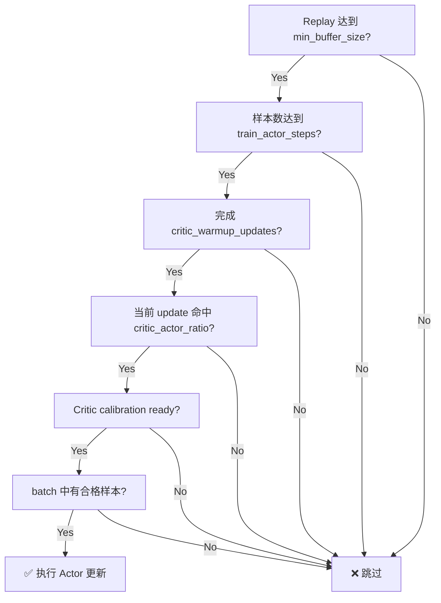
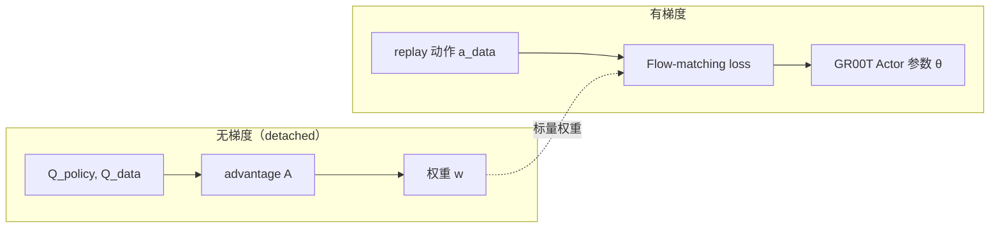
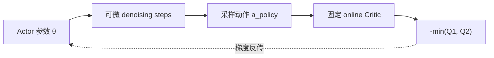
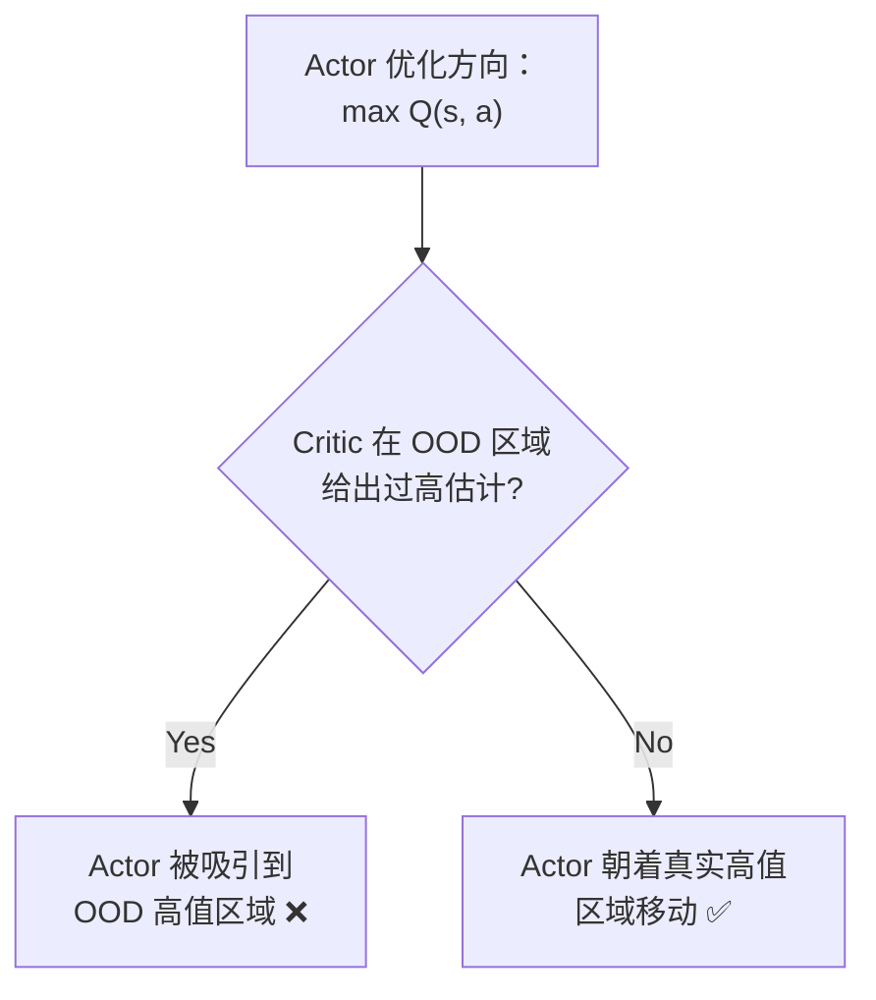
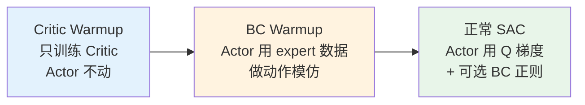
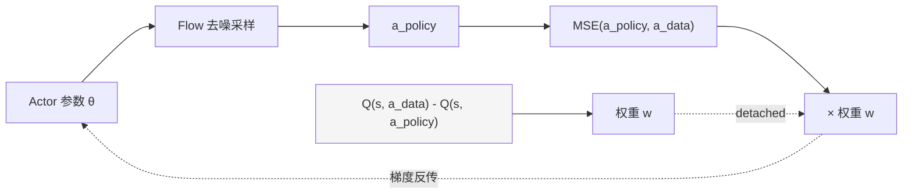
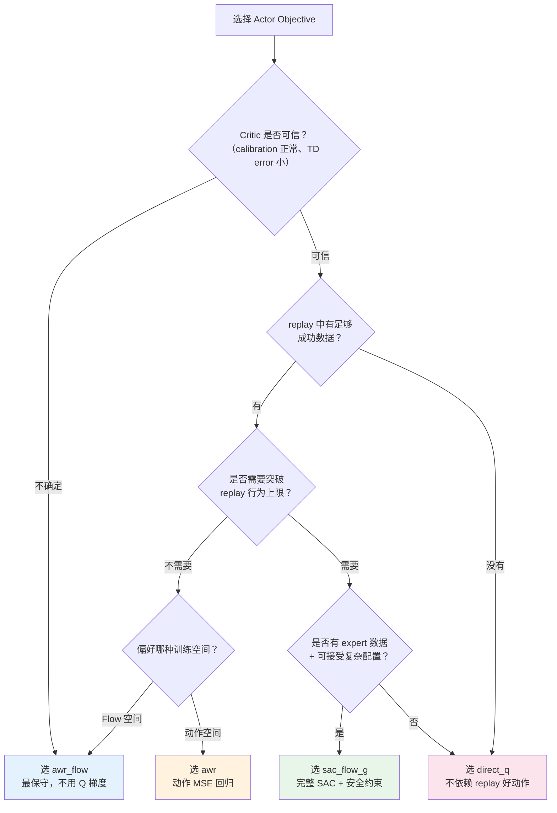

# GR00T N1.7 Chunk-SAC：四种 Actor 目标的工程实践

> **一句话**：GR00T N1.7 的 Chunk-SAC 系统提供了四种 Actor 更新策略——从保守的 Q 加权 Flow Matching，到激进的直接 Q 最大化，再到完整 SAC 框架——让你根据任务需求和 Critic 可信度选择最合适的策略改进方式。

## 相关阅读

**前置知识**（读本文前建议了解）：
- [SAC (Soft Actor-Critic)](/前置知识/000k_前置知识_SAC_Soft_Actor_Critic) — 最大熵 off-policy RL 的完整推导
- [AWR 优势加权回归](/前置知识/000u_前置知识_AWR_优势加权回归) — Q 加权模仿学习的数学基础
- [Flow Matching 与连续归一化流](/前置知识/000g_前置知识_Flow_Matching与连续归一化流) — GR00T 动作生成的底层机制
- [Q 加权 Flow 策略](/前置知识/001v_前置知识_Q加权Flow策略_不穿透去噪链的RL训练) — 不穿透去噪链的 RL 训练
- [Q 函数与 Value 函数](/前置知识/000o_前置知识_Q函数与Value函数) — Twin-Q 和 Bellman 方程
- [TD3](/前置知识/000q_前置知识_TD3) — Twin Critic 的来源
- [行为约束策略优化](/前置知识/001l_前置知识_行为约束策略优化) — 约束策略不偏离数据的机制

**关联文章**：
- [RLinf：BC 到 RL 的 ACT 后训练架构](./RLinf_BC到RL的ACT后训练架构) — PPO 路线的对比
- [GR00T N1.7 深度解析系列](/系列/groot_n1d7_deep_dive/index) — 模型架构详解
- [动作分块 RL 基础](/系列/groot_rl_deep_dive/06_动作分块RL基础_QChunking到AQC回顾) — Chunk-level Critic 的理论基础
- [RLinf 算法实现：SAC](/系列/rlinf_deep_dive/10_算法实现_SAC与其他算法) — RLinf 框架中 SAC 的通用实现

---

## 一、这篇文章要解决什么问题

你已经用 GR00T N1.7 的 Flow Matching 管线完成了 BC 预训练，模型能做出基本合理的动作。现在想用环境 reward 做 RL 后训练，让策略超越 BC 天花板。

**核心困难**：GR00T 的动作不是一步前向就出来的——它是一个多步去噪过程：


$$
\mathbf{x}_0 \sim \mathcal{N}(0, I) \;\xrightarrow{v_\theta(\cdot, t_1)}\; \mathbf{x}_1 \;\xrightarrow{v_\theta(\cdot, t_2)}\; \cdots \;\xrightarrow{v_\theta(\cdot, t_K)}\; \mathbf{a}_{0:H}
$$

**这个公式在做什么**：把一个标准高斯噪声，通过反复调用同一个 velocity 网络 $v_\theta$ 共 K 次，逐步"去噪"成一个完整动作块——这是 GR00T 生成动作的全过程，也是"Q 梯度怎么传回参数 $\theta$"这个难题的根源。

::: details 📐 公式详解（点击展开）

| 子表达式 | 它是谁 | 它在干嘛 |
|---------|--------|---------|
| $\mathbf{x}_0 \sim \mathcal{N}(0,I)$ | **起点：纯噪声** | 采样过程的初始点，此刻和最终动作没有任何关系 |
| $v_\theta(\cdot, t_k)$ | **第 $k$ 步的向导** | 网络根据当前中间结果和时间步 $t_k$，给出"下一步该往哪个方向挪" |
| $\mathbf{x}_1, \mathbf{x}_2, \ldots$ | **中间落脚点** | 每调用一次 $v_\theta$，当前结果就离真实动作更近一点 |
| $\mathbf{a}_{0:H}$ | **终点：完整动作块** | 经过 K 步后得到的最终输出，形状 $[B, H, D]$（batch × chunk length × action dim） |

**用人话读**："从一堆随机噪声出发，同一个网络被反复调用 K 次，每次把当前结果往真实动作的方向推一点，K 次之后就得到一整段可执行的动作。"

**为什么要多步而不是一步生成**：一步很难直接把噪声映射到高维、多峰的动作分布；拆成 K 步小步走，每步只需学局部方向，训练更稳定——但代价是 Q 梯度要想指导 Actor，就必须穿过这条 K 步链路。
:::

标准 SAC 的 `∇_θ Q(s, π(s))` 需要把 Q 的梯度穿过这 K 步去噪链——这就是 [为什么扩散策略难以 RL 微调](/前置知识/000f_前置知识_为什么扩散策略难以RL微调) 中详细讨论过的梯度爆炸问题。

**四种 Actor objective 就是对"Q 梯度怎么指导策略改进"这个问题的四种不同回答**，从完全不穿透去噪链（`awr_flow`），到部分穿透（`direct_q`、`awr`），再到通过独立 adapter 穿透（`sac_flow_g`）。

---

## 二、贯穿全文的例子

> **任务**：一个双臂人形机器人（GR00T 配置，62 维动作）在 MiArena 仿真中学习打开柜门。
> - 动作块长度 $H = 40$（模型一次输出 40 步动作）
> - 动作维度 $D = 62$（双臂关节角度 + 手指）
> - Critic 输入：状态特征 + 展平后的 $40 \times 62 = 2480$ 维动作向量
> - Reward：柜门角度变化 + 稀疏的成功奖励
> - Replay Buffer 中混合着：随机探索轨迹、部分成功轨迹、完全成功轨迹

---

## 三、共享基础：所有方案都站在同一个地基上

四种 Actor objective 不是四套独立系统。它们共享一个完整的 Chunk-SAC 训练框架，只替换 Actor loss 计算逻辑。

### 3.1 动作块与 Chunk-level Critic

GR00T 的 Actor 一次产生完整动作块：

$$
\pi_\theta(s) \to \mathbf{a}_{0:H} \in \mathbb{R}^{B \times H \times D}
$$

**这个公式在做什么**：说明 Actor 的输入输出形状——给定状态 $s$，一次前向直接产生一整段长度为 $H$ 的动作序列，而不是逐步吐出单步动作。

::: details 📐 公式详解（点击展开）

| 子表达式 | 它是谁 | 它在干嘛 |
|---------|--------|---------|
| $\pi_\theta(s)$ | **Actor 整体** | 输入当前状态 $s$，内部跑完整个 K 步去噪流程 |
| $\mathbf{a}_{0:H}$ | **输出的动作块** | 未来 $H$ 步的动作序列打包成一个张量 |
| $\mathbb{R}^{B\times H\times D}$ | **形状说明** | batch 大小 $B$ × chunk 长度 $H$ × 单步动作维度 $D$ |

**用人话读**："策略网络看一眼当前状态，直接吐出接下来 H 步要做的所有动作，打包成一个三维张量。"

**为什么一次吐出整段而不是逐步决策**：动作分块（action chunking）能让模型在训练和推理时利用局部时间一致性，减少逐步决策的误差累积，也是 GR00T 系列模型的既定设计。
:::

Critic 不对单步动作估值，而是对**整个动作块**打分：

$$
Q(s, \mathbf{a}_{0:H}) \to [Q_1, Q_2] \in \mathbb{R}^{B \times 2}
$$

**这个公式在做什么**：Critic 一次性给"状态 + 整段未来动作"打一个分，而且用两个独立打分头（Twin-Q）分别评估，为后面取较小值防止过估计做准备。

::: details 📐 公式详解（点击展开）

| 子表达式 | 它是谁 | 它在干嘛 |
|---------|--------|---------|
| $Q(s, \mathbf{a}_{0:H})$ | **打分函数** | 输入状态和整段动作块，输出"这样做下去能拿多少累计回报" |
| $Q_1, Q_2$ | **两个独立评委** | 结构相同但参数独立训练的两套打分头，分开打分避免共谋高估 |
| $\mathbb{R}^{B\times 2}$ | **输出形状** | 每个 batch 样本对应两个标量 Q 值 |

**用人话读**："Critic 看一眼状态和整段未来动作，同时用两套独立参数各打一个分，之后取较小的那个当作最终估值。"

**为什么要 Twin-Q**：单个 Q 网络在训练中容易系统性高估（尤其在 off-policy 数据上），取两个独立估计的较小值能显著压低这种过估计偏差，这和 [TD3](/前置知识/000q_前置知识_TD3) 的设计动机完全一致。
:::

使用 Twin-Q（取 $\min(Q_1, Q_2)$）降低过估计风险——这和 [TD3](/前置知识/000q_前置知识_TD3) 的设计动机完全一致。

**代入例子**：打开柜门任务中，Critic 评估的是"从当前状态出发，执行这 40 步动作序列后能获得多少累计奖励"。一个好的动作块可能是"先移向柜门把手 → 抓住 → 拉开"，Critic 给出高 Q 值；一个差的动作块可能"手伸过头"，Critic 给出低 Q 值。

### 3.2 Chunk Bellman Target

四种方案共用以下 TD target：

$$
y = \underbrace{\sum_{i=0}^{H-1} \gamma^i \cdot \text{valid}_i \cdot r_i}_{R_{\text{chunk}}} + \gamma^H \cdot m \cdot \Big(\min(Q_1^{\text{target}}(s', \mathbf{a}'), Q_2^{\text{target}}(s', \mathbf{a}')) - \alpha \log \pi(\mathbf{a}'|s')\Big)
$$

**这个公式在做什么**：把 chunk 内的折扣奖励加起来，再加上 chunk 结束后下一个状态的 bootstrapped value，得到 Critic 训练要拟合的目标值 $y$。

::: details 📐 公式详解（点击展开）

| 子表达式 | 它是谁 | 它在干嘛 |
|---------|--------|---------|
| $\sum_{i=0}^{H-1}\gamma^i\cdot\text{valid}_i\cdot r_i$（即 $R_{\text{chunk}}$） | **chunk 内的实际收获** | 把 40 步里真实拿到的奖励按折扣加起来，valid mask 处理 episode 提前结束的情况 |
| $\gamma^H$ | **未来打折系数** | 40 步之后的价值要打多少折才能折算到现在 |
| $m$ | **是否还有未来的开关** | episode 没结束=1，结束=0，结束了就不再累加未来价值 |
| $\min(Q_1^{\text{target}}, Q_2^{\text{target}})$ | **对未来的保守估计** | 用目标网络（而非在线网络）评估下一状态动作对，取两者较小值防止过估计 |
| $\alpha\log\pi(\mathbf{a}'|s')$ | **熵奖励（仅 `sac_flow_g`）** | 鼓励下一步动作保持随机性，其他三种方案里 $\alpha=0$ 这项直接消失 |

**用人话读**："这次 chunk 真实拿到的折扣奖励，加上（如果 episode 还没完）对未来打了折的估值，就是 Critic 要去拟合的目标。"

**为什么要引入 valid mask 和 bootstrap mask $m$**：动作块执行过程中 episode 可能中途结束，valid mask 保证只统计真实发生的步骤奖励，$m$ 保证 episode 结束后不再错误地叠加"未来"价值。

**逐项拆解**：

| 符号 | 含义 | 例子中的对应 |
|------|------|-------------|
| $\gamma^i \cdot \text{valid}_i \cdot r_i$ | 第 $i$ 步的折扣奖励，乘 valid mask 处理 episode 中途结束 | 柜门角度增加了 5° → $r_i = +0.5$，乘上 $\gamma^i$ |
| $R_{\text{chunk}}$ | 40 步内所有折扣奖励之和 | 如果 40 步内柜门打开了，包含稀疏成功奖励 |
| $\gamma^H$ | 40 步后的折扣因子 | $0.99^{40} \approx 0.67$ |
| $m$ | bootstrap mask（episode 未结束=1，结束=0） | 如果 40 步后 episode 还没结束，$m=1$ |
| $Q^{\text{target}}$ | 目标网络对下一状态-动作对的估值 | EMA 更新的 Critic 副本 |
| $\alpha \log \pi$ | 熵项，**只有 `sac_flow_g` 方案使用** | 其他三种方案 $\alpha = 0$ |
:::

**关键区分**：只有 `sac_flow_g` 在 Bellman target 中包含熵项。其他三种方案使用标准的无熵 TD target——这意味着它们的 Critic 学习的是"纯奖励价值"，不考虑策略的随机性。

#### 3.2.1 Bootstrap 怎么算：没有 V 网络，用 Q + 策略采样替代

你可能注意到公式里用的是 $Q^{\text{target}}(s', \mathbf{a}')$ 而不是 $V(s')$。这里没有独立的 Value 网络——bootstrap value 是通过**在下一状态重新采样动作，然后用 target Critic 打分**来实现的。

**$s'$ 是什么？**

$s'$ 是执行完当前 chunk（H=40 步）后，环境到达的下一个状态。代入例子：机器人在状态 $s$ 执行了 40 步动作块，环境做了 40 步物理模拟，到达 $s'$——此时关节角度变了、柜门可能开了一部分。这个 $s'$ 在 rollout 时就记录在 replay buffer 中了。

**$\mathbf{a}'$ 怎么来？**

$\mathbf{a}'$ 是**当前策略在 $s'$ 上重新采样的一整个动作块**：

$$
\mathbf{a}' = \pi_\theta(s') \in \mathbb{R}^{H \times D}
$$

**这个公式在做什么**：在下一状态 $s'$ 上重新用当前策略采样一整段新动作块，为 Bellman target 的 bootstrap value 提供输入。

::: details 📐 公式详解（点击展开）

| 子表达式 | 它是谁 | 它在干嘛 |
|---------|--------|---------|
| $s'$ | **执行完这个 chunk 后的新状态** | 记录在 replay buffer 里，已经是环境真实到达的状态 |
| $\pi_\theta(s')$ | **重新采样的动作块** | 跑一次完整的 K 步 flow 去噪过程，得到一个全新的 $H\times D$ 动作序列 |
| $\mathbb{R}^{H\times D}$ | **形状说明** | 和 $\mathbf{a}_{0:H}$ 结构一致，只是这次是"假想"要执行的下一个动作块 |

**用人话读**："拿到执行完当前 chunk 后的新状态，让当前策略在这个新状态上重新'想'一遍接下来要做的动作。"

**为什么要重新采样而不是复用旧动作**：Bellman target 需要的是"下一状态下，按当前策略走下去的价值"，而不是"上一次采样的动作值多少"——所以必须用当前策略在 $s'$ 上重新采样。
:::

即：拿到 $s'$ → 跑一次 Actor forward（完整的 flow 去噪过程）→ 得到一个新的 40 步动作块。然后把 $(s', \mathbf{a}')$ 送进 target Critic 得到 Q 值估计。

**为什么不直接维护一个 $V(s')$ 网络？**

在标准 SAC 理论中，$V$ 和 $Q$ 有如下等价关系：

$$
V(s') = \mathbb{E}_{\mathbf{a}' \sim \pi(\cdot|s')}\Big[Q(s', \mathbf{a}') - \alpha \log \pi(\mathbf{a}'|s')\Big]
$$

**这个公式在做什么**：给出 Value 函数和 Q 函数在最大熵框架下的精确关系——$V$ 就是"对所有可能动作的 $Q$ 减熵项，取期望"。

::: details 📐 公式详解（点击展开）

| 子表达式 | 它是谁 | 它在干嘛 |
|---------|--------|---------|
| $V(s')$ | **状态的整体价值** | 不管具体会执行哪个动作，这个状态"平均"能拿多少价值 |
| $Q(s', \mathbf{a}') - \alpha\log\pi(\mathbf{a}'|s')$ | **单个动作的熵调整后价值** | 该动作的 Q 值，再加上"这个动作有多随机"的熵奖励 |
| $\mathbb{E}_{\mathbf{a}'\sim\pi(\cdot|s')}$ | **对所有动作取平均** | 按策略的采样概率，把不同动作的熵调整价值加权平均起来 |

**用人话读**："一个状态的价值，等于按当前策略把所有可能动作的（Q 值 - 熵惩罚）加权平均一遍。"

**为什么价值要减去 $\alpha\log\pi$**：这是最大熵 RL 的定义方式，把"保持随机性"本身当作一种奖励纳入价值定义，鼓励策略不要过早收敛成确定性策略。
:::

也就是说，$V$ 本质上是"对 $Q - \alpha \log \pi$ 关于动作的期望"。Chunk-SAC 不显式维护 V 网络，而是用**单次策略采样**近似这个期望：

$$
V(s') \approx Q^{\text{target}}(s', \mathbf{a}') - \alpha \log \pi(\mathbf{a}'|s'), \quad \mathbf{a}' \sim \pi(\cdot|s')
$$

**这个公式在做什么**：用一次采样代替上面公式里"对所有动作取期望"这个理论上的积分，得到一个可以真正在代码里算出来的 bootstrap value 近似值。

::: details 📐 公式详解（点击展开）

| 子表达式 | 它是谁 | 它在干嘛 |
|---------|--------|---------|
| $Q^{\text{target}}(s', \mathbf{a}')$ | **目标网络给的分数** | 用 EMA 更新的稳定 Critic 副本对刚采样出的动作打分 |
| $\alpha\log\pi(\mathbf{a}'|s')$ | **这次采样对应的熵惩罚** | 具体这一个样本的对数概率乘温度系数 |
| $\mathbf{a}'\sim\pi(\cdot|s')$ | **采样来源** | 强调这里只抽一次样，不是对所有动作积分 |

**用人话读**："不去精确算‘所有动作的平均价值’，而是抽一个动作样本，用它的 Q 值减熵惩罚，当作整个状态价值的近似。"

**为什么用单样本近似而不维护独立 V 网络**：这是一个 single-sample Monte Carlo 估计，方差比独立 V 网络略高，但省掉了一整套 V 网络、一套参数和一个训练目标，SAC 原论文的 v2 版本也采用了这种做法。
:::

**完整计算流程（伪代码）**：

```text
# 从 replay buffer 取一条数据
(s, a_{0:H}, rewards_{0:H}, s', done) = replay.sample()

# Step 1: chunk 内折扣奖励和
R_chunk = Σ_{i=0}^{H-1} γ^i * valid_i * r_i

# Step 2: 当前策略在下一状态采样动作
a' = π_θ(s')                    # 完整的 flow 去噪采样

# Step 3: target Critic 对 (s', a') 打分
Q_next = min(Q1_target(s', a'), Q2_target(s', a'))

# Step 4: 计算 log_pi（仅 sac_flow_g 使用，其他方案此项为 0）
log_pi_next = log π(a'|s')

# Step 5: 组装 Bellman target
y = R_chunk + γ^H * (1 - done) * (Q_next - α * log_pi_next)
```

**代入数字**：假设 $H=40$，$\gamma=0.99$，chunk 内累计奖励 $R_{\text{chunk}}=3.2$，episode 未结束（$m=1$），target Critic 对下一状态的策略动作打分 $Q_{\text{next}}=12.5$，$\alpha \log \pi = 0.3$（仅 `sac_flow_g`）：

- `awr_flow` / `direct_q` / `awr`：$y = 3.2 + 0.99^{40} \times 1 \times 12.5 = 3.2 + 0.669 \times 12.5 = 3.2 + 8.36 = 11.56$
- `sac_flow_g`：$y = 3.2 + 0.669 \times (12.5 - 0.3) = 3.2 + 8.16 = 11.36$

差异只有 0.2——熵项的效果是让 target 略微降低，鼓励策略保持随机性（如果策略过于确定，$-\alpha \log \pi$ 会很大，target 降低，Critic 学到"过于确定的策略值不那么高"）。

#### 3.2.2 $\log \pi(\mathbf{a}'|s')$ 是什么：Flow 策略的对数概率

对高斯策略来说，$\log \pi(a|s)$ 就是高斯分布的对数概率密度——有解析公式，算起来很简单。但 GR00T 是 **Flow Matching 策略**，动作是通过多步 ODE 积分产生的，不像高斯策略有现成的概率密度公式。

**Flow 策略的 $\log \pi$ 怎么算？**

Flow 策略定义了一个从噪声 $\mathbf{x}_0 \sim \mathcal{N}(0, I)$ 到动作 $\mathbf{a}$ 的确定性映射（给定 $s$）。根据变量替换公式（change of variables），这个映射的对数概率密度可以通过**沿 ODE 路径累积散度**来计算：

$$
\log \pi(\mathbf{a}|s) = \log p_0(\mathbf{x}_0) - \int_0^1 \text{div}\, v_\theta(\mathbf{x}_t, t, s)\, dt
$$

**这个公式在做什么**：Flow 策略没有像高斯策略那样现成的概率密度公式，这个公式给出了怎么从"起点噪声的已知密度"倒推出"最终动作的对数概率"——办法是沿着整条去噪路径累积速度场的散度。

::: details 📐 公式详解（点击展开）

| 子表达式 | 它是谁 | 它在干嘛 |
|---------|--------|---------|
| $\log p_0(\mathbf{x}_0)$ | **起点的已知概率** | 标准高斯噪声的对数密度，公式已知（$=-\frac{d}{2}\log 2\pi - \frac{1}{2}\|\mathbf{x}_0\|^2$） |
| $\text{div}\,v_\theta(\mathbf{x}_t,t,s)$ | **这一点上空间被压缩/膨胀的程度** | 衡量 velocity 场在当前点附近是把轨迹"聚拢"还是"分散" |
| $\int_0^1(\cdot)\,dt$ | **沿路径累积** | 把每一时刻的压缩/膨胀效应沿整条 ODE 路径积分起来，实际用 K 步离散近似 |
| 减号 | **概率密度的变化方向** | 空间被压缩（散度为负）→概率密度增大，所以要用起点密度减去这个积分 |

**用人话读**："已知噪声起点的概率是多少，再看整条去噪路径上空间被压缩了多少，两者相减就得到最终动作的对数概率。"

**为什么要通过散度积分而不是直接算密度**：Flow 策略是通过确定性 ODE 从噪声映射到动作的，根据变量替换公式（change of variables），密度变化量正好等于沿路径对速度场散度的积分——这是唯一能从已知的噪声密度推出未知的动作密度的解析路径。

| 符号 | 含义 |
|------|------|
| $\log p_0(\mathbf{x}_0)$ | 初始高斯噪声的对数密度（$= -\frac{d}{2}\log 2\pi - \frac{1}{2}\|\mathbf{x}_0\|^2$） |
| $\text{div}\, v_\theta$ | velocity 网络输出的散度（divergence），衡量"流在这个点附近是压缩还是膨胀" |
| $\int_0^1 (\cdot)\, dt$ | 沿整条 ODE 路径积分，实际中用 K 步离散近似 |
:::

> **直觉**：从噪声空间出发时的概率密度是已知的（标准高斯）。沿着 flow 路径走，如果 velocity 场在某处"压缩"了空间（散度 < 0），概率密度就增大（更多轨迹挤到一起）；如果"膨胀"了空间（散度 > 0），概率密度就减小。把这些变化一路累积起来，就得到最终动作点的对数概率。

**实际计算中的近似**：精确计算散度需要 $O(D)$ 次额外前向传播（对每个维度分别求偏导），代价很高。实践中常用 **Hutchinson 估计器**（随机向量投影）来近似散度，将计算量降到常数次额外前向传播。

$$
\text{div}\, v_\theta \approx \mathbf{z}^\top \frac{\partial v_\theta}{\partial \mathbf{x}} \mathbf{z}, \quad \mathbf{z} \sim \mathcal{N}(0, I)
$$

**这个公式在做什么**：用一次随机投影代替精确计算散度所需的 $O(D)$ 次额外前向传播，把计算量降到常数次——这就是 Hutchinson 估计器。

::: details 📐 公式详解（点击展开）

| 子表达式 | 它是谁 | 它在干嘛 |
|---------|--------|---------|
| $\mathbf{z}\sim\mathcal{N}(0,I)$ | **随机探针** | 一个随机高斯向量，每次估计时重新采样 |
| $\frac{\partial v_\theta}{\partial\mathbf{x}}$ | **velocity 网络的雅可比矩阵** | 描述网络输出对输入的敏感程度，精确算出它的完整矩阵很贵 |
| $\mathbf{z}^\top(\cdot)\mathbf{z}$ | **投影读数** | 用随机向量从两侧夹住雅可比矩阵，只需一次矩阵向量乘法（用自动微分实现）即可得到散度的无偏估计 |

**用人话读**："不去精确算雅可比矩阵的每一项，而是随机丢一个探针进去测一下，测到的值期望上就等于真实散度。"

**为什么用随机投影而不是精确计算**：精确算散度需要对每个输出维度分别求偏导，代价是 $O(D)$ 次前向传播；Hutchinson 估计器利用"随机向量的二次型期望等于矩阵的迹"这一性质，把代价降到常数次，用一点方差换取巨大的计算节省。
:::

**对三种不使用熵项的方案**（`awr_flow`、`direct_q`、`awr`）：因为 $\alpha = 0$，Bellman target 中的 $\log \pi$ 项被完全消掉——**根本不需要计算 $\log \pi$**。这不仅简化了代码，还省去了 Hutchinson 估计器带来的额外方差。

**只有 `sac_flow_g` 需要计算 $\log \pi$**：因为它是完整 SAC，entropy bonus 是核心组件。额外的计算代价是这个方案复杂度更高的原因之一。

### 3.3 Actor 更新门控

无论选哪种 objective，Actor 更新都需要通过 Worker 层的多重门控：


```mermaid
flowchart TD
    A["Replay 达到 min_buffer_size?"] -->|Yes| B["样本数达到 train_actor_steps?"]
    B -->|Yes| C["完成 critic_warmup_updates?"]
    C -->|Yes| D["当前 update 命中 critic_actor_ratio?"]
    D -->|Yes| E["Critic calibration ready?"]
    E -->|Yes| F["batch 中有合格样本?"]
    F -->|Yes| G["✅ 执行 Actor 更新"]
    A -->|No| X["❌ 跳过"]
    B -->|No| X
    C -->|No| X
    D -->|No| X
    E -->|No| X
    F -->|No| X
```


其中"合格样本"由 `actor_data_filter` 控制：

| 筛选模式 | 保留的数据 | 适用场景 |
|----------|-----------|---------|
| `success_or_progress` | 成功 + 产生正进度的 chunk | 通用默认值 |
| `success` | 仅成功 chunk | Critic 很准时，只学最好的 |
| `all` | 所有非失败 chunk | 探索早期数据稀疏时 |

**注意**：这个筛选 mask 只有 `awr_flow` 真正用作逐样本 loss 权重。其他三种方案只用它判断"本轮是否允许更新"，不在 loss 中区别对待不同样本。

---

## 四、方案一：`awr_flow` — Q 加权的 Flow Matching

### 4.1 核心思想

> **一句话**：不让 Q 梯度穿过动作采样过程，而是用 Critic 给 replay 中的动作"打分"，分高的动作在 flow-matching loss 中获得更大权重。

这是最保守的方案。它的哲学是：**与其让 Q 梯度直接"推"动作（可能推到 Critic 不可靠的区域），不如让 Critic 当"评委"，从 replay 中挑出好动作让 Actor 模仿**。

### 4.2 计算过程详解

**第一步：采样并评估（不反传）**

```text
# 在 torch.no_grad() 下执行
a_policy = π(s)                          # 当前策略采样
Q_policy = min(Q1(s, a_policy), Q2(s, a_policy))  # 当前策略动作的 Q 值
Q_data   = min(Q1(s, a_data),   Q2(s, a_data))    # replay 动作的 Q 值
A        = Q_data - Q_policy              # advantage：replay 比当前策略好多少
```

**第二步：计算权重**

$$
w_{\text{raw}} = \text{selected} \cdot \exp\left(\text{clamp}\left(\frac{A}{\tau}, \; -\infty, \; \log(w_{\max})\right)\right)
$$

**这个公式在做什么**：把 advantage 转成一个正的原始权重——advantage 越大权重越高，但用 clamp 卡住上限，防止某一个特别好的样本权重爆炸到主导整个 batch。

::: details 📐 公式详解（点击展开）

| 子表达式 | 它是谁 | 它在干嘛 |
|---------|--------|---------|
| $\text{selected}$ | **质量筛选开关** | 0 或 1，不合格样本（如失败 chunk）直接被清零 |
| $A/\tau$ | **放大后的优势分** | advantage 除以温度 $\tau$，$\tau$ 越小差距被放得越大 |
| $\text{clamp}(\cdot, -\infty, \log w_{\max})$ | **权重的天花板** | 允许无限小（差动作权重趋近 0），但设上限防止指数爆炸 |
| $\exp(\cdot)$ | **指数放大器** | 把 advantage 的线性差异转成指数级的权重差异，好坏样本区分更明显 |

**用人话读**："把 advantage 除以温度再取指数，得到一个正数当权重，但权重最高不能超过 $w_{\max}$，不合格样本权重直接是 0。"

**为什么用指数而不是线性映射权重**：指数映射能让"稍微好一点"和"好很多"的样本权重差距被显著拉大，这正是 AWR（Advantage-Weighted Regression）系列方法的核心机制，让模仿学习优先聚焦在真正好的样本上。
:::

$$
w = \frac{w_{\text{raw}}}{\sum_{\text{all ranks}} w_{\text{raw}}}
$$

**这个公式在做什么**：把原始权重除以所有 GPU（rank）上权重的总和，得到最终归一化权重，保证分布式训练下权重之和恒为 1。

::: details 📐 公式详解（点击展开）

| 子表达式 | 它是谁 | 它在干嘛 |
|---------|--------|---------|
| $w_{\text{raw}}$ | **未归一化的原始权重** | 上一步算出的、还没有除以总和的权重 |
| $\sum_{\text{all ranks}} w_{\text{raw}}$ | **全局归一化因子** | 把分布式训练中所有 GPU 上的原始权重都加起来 |
| $w$ | **最终使用的权重** | 归一化后的权重，直接乘进 flow-matching loss |

**用人话读**："把每个样本的原始权重除以全局所有样本权重的总和，让权重变成一个总和为 1 的分布。"

**为什么要跨 rank 归一化而不是各卡自己归一化**：FSDP 分布式训练下不同 GPU 上的 batch 可能有不同的 advantage 分布，只在本地归一化会导致不同 GPU 上同一个 advantage 对应不同的最终权重，跨 rank 归一化保证了分布式训练结果的一致性。
:::

**逐项拆解**：

| 符号 | 含义 | 典型值 |
|------|------|--------|
| $\text{selected}$ | 质量筛选 mask（0 或 1） | `success_or_progress` 的输出 |
| $A$ | replay 动作相对当前策略的优势 | 好动作 $A > 0$，差动作 $A < 0$ |
| $\tau$ | AWR 温度，控制权重的"尖锐度" | 1.0（越小越集中在最好的样本） |
| $w_{\max}$ | 单个样本的最大权重上限 | 20.0 |
| 跨 rank 归一化 | FSDP 下所有 GPU 的权重共同归一化 | 保证分布式一致性 |

**代入数字**：假设 batch 中有 3 个样本：

| 样本 | $Q_{\text{data}}$ | $Q_{\text{policy}}$ | $A$ | $\exp(A/\tau)$ | 归一化后 |
|------|-------------------|---------------------|-----|----------------|----------|
| 样本 1（成功打开柜门） | 15.0 | 8.0 | +7.0 | $e^7 \approx 1097$ → clamp 到 20 | 20/22.37 ≈ 0.89 |
| 样本 2（部分打开） | 10.0 | 8.0 | +2.0 | $e^2 \approx 7.4$ | 7.4/22.37 ≈ 0.10 |
| 样本 3（失败） | — | — | — | selected=0 | 0.0 |

**效果**：成功样本获得了 89% 的训练权重，部分成功样本 10%，失败样本被直接排除。

**第三步：加权 Flow-Matching Loss**

$$
\mathcal{L}_{\text{awr\_flow}} = \text{weighted\_flow\_matching\_loss}(\mathbf{a}_{\text{data}}, \text{valid\_mask}, w)
$$

**这个公式在做什么**：把上一步算出的权重 $w$ 喂进 GR00T 原生的 flow-matching loss 接口，让"好的 replay 动作"在 BC 式模仿中获得更大的训练信号。

::: details 📐 公式详解（点击展开）

| 子表达式 | 它是谁 | 它在干嘛 |
|---------|--------|---------|
| $\mathbf{a}_{\text{data}}$ | **模仿目标** | replay 中真实记录的动作，就是 flow-matching loss 原本要拟合的目标 |
| $\text{valid\_mask}$ | **有效步筛选** | 排除 episode 提前结束后无效的时间步 |
| $w$ | **样本级权重** | 上一步算出的归一化权重，好样本权重大，差样本权重小 |
| $\text{weighted\_flow\_matching\_loss}(\cdot)$ | **加权后的标准训练目标** | 和 BC 预训练用的是同一套 loss 实现，只是每个样本乘了不同权重 |

**用人话读**："用跟 BC 预训练完全相同的 flow-matching loss 去模仿 replay 动作，只是好的样本在 loss 里的份量更大。"

**为什么直接复用 flow-matching loss 接口**：这样 Actor 的梯度完全走 GR00T 预训练时验证过的训练路径，不会引入新的数值不稳定性，也不需要让 Q 的梯度穿过去噪链。
:::

这里使用的是 GR00T **原生的** flow-matching 训练接口——和 BC 预训练时用的完全相同的 loss 形式，只是给每个样本乘了一个不同的权重。

### 4.3 梯度路径


```mermaid
flowchart LR
    subgraph "有梯度"
        A["replay 动作 a_data"] --> B["Flow-matching loss"]
        B --> C["GR00T Actor 参数 θ"]
    end
    subgraph "无梯度（detached）"
        D["Q_policy, Q_data"] --> E["advantage A"]
        E --> F["权重 w"]
    end
    F -.->|"标量权重"| B
```


**关键特征**：Q 值只用来算权重，不参与反传。Actor 的梯度完全来自 flow-matching loss 对 GR00T velocity 网络的标准训练梯度。这意味着：

1. 不存在"梯度穿过 K 步去噪链"的问题
2. 不会利用 Critic 的 $dQ/da$ 梯度（可能不准确）
3. Actor 更新始终停留在 flow-matching 训练空间中，不会偏离 GR00T 预训练的"流形"

### 4.4 适用场景

- Critic 还不够可信（训练早期、数据少），不敢直接用 Q 梯度推动作
- replay 中已有足够的成功或正进度轨迹（否则无好动作可模仿）
- 希望最大程度保持 GR00T 预训练的生成行为
- 任务允许较慢但稳定的策略改进

### 4.5 关键配置

```yaml
algorithm:
  actor_objective: awr_flow
  actor_data_filter: success_or_progress
  actor_use_awr_weights: true      # false 时所有合格样本等权
  awr_normalize_advantage: true
  awr_temperature: 1.0             # 越小 → 权重越集中在最好样本
  awr_max_weight: 20.0             # 防止单个样本主导整个 batch
```

### 4.6 局限性

**上限受 replay 限制**：如果 replay 中最好的动作只能把柜门打开 70%，`awr_flow` 永远不会产生"打开 100%"的动作——因为它只能模仿已有数据，无法创造新动作。要突破这个上限，需要 `direct_q` 或 `sac_flow_g`。

---

## 五、方案二：`direct_q` — 直接最大化 Twin-Q

### 5.1 核心思想

> **一句话**：让 Q 梯度直接穿过动作采样过程反传到 Actor 参数，把"让 Critic 满意"作为唯一目标。

这是最激进的方案。它的哲学是：**Critic 说哪个方向好，就往哪个方向走**。不需要 replay 中有好动作——策略可以自己"发明"从未出现在数据中的高 Q 值动作。

### 5.2 计算过程

$$
\mathcal{L}_{\text{direct\_q}} = \mathbb{E}_{s \sim \mathcal{D}}\left[\underbrace{c_{\text{ent}} \cdot \log \pi(\mathbf{a}|s)}_{\text{可选熵正则}} - \underbrace{\min(Q_1(s, \mathbf{a}), Q_2(s, \mathbf{a}))}_{\text{最大化 Q 值}}\right]
$$

**这个公式在做什么**：loss = 负的 Q 值（加可选的熵惩罚），梯度方向就是"把动作往 Q 值更高的方向推"——这是让 Critic 的判断直接驱动 Actor 更新的核心公式。

::: details 📐 公式详解（点击展开）

| 子表达式 | 它是谁 | 它在干嘛 |
|---------|--------|---------|
| $-\min(Q_1(s,\mathbf{a}), Q_2(s,\mathbf{a}))$ | **主目标：让 Critic 满意** | 取负号后最小化它，等价于最大化保守的 Q 估计 |
| $c_{\text{ent}}\cdot\log\pi(\mathbf{a}|s)$ | **可选的熵惩罚** | 系数 $c_{\text{ent}}$ 控制要不要惩罚策略过于确定，防止坍缩到单点动作 |
| $\mathbb{E}_{s\sim\mathcal{D}}$ | **batch 平均** | 对 replay buffer 里采样出的一批状态取平均，实际训练中就是 `.mean()` |
| $\mathbf{a}$ | **当前策略实时采样的动作** | 这个 $\mathbf{a}$ 是从 $\pi_\theta(s)$ 可微采样出来的，梯度能一路传回 $\theta$ |

**用人话读**："对一批状态，让策略当前采样出的动作尽量拿到 Critic 给出的高分，同时可选地惩罚一下太死板的策略。"

**为什么敢直接对 $-Q$ 做梯度下降**：这里的动作 $\mathbf{a}$ 是可微采样得到的，Q 网络本身也是可微的，所以 $-Q$ 对 Actor 参数 $\theta$ 的梯度可以直接用自动微分算出来——只要梯度能穿过整条去噪链就行，这正是"direct"这个名字的来源。
:::

**逐项拆解**：

| 项 | 作用 | 梯度方向 |
|----|------|----------|
| $-\min(Q_1, Q_2)$ | 最大化保守 Q 估计 | 把动作推向 Critic 认为好的区域 |
| $c_{\text{ent}} \cdot \log \pi$ | 惩罚策略过于确定 | 保持一定随机性（防止坍缩到单点） |

当 `path_entropy_coef = 0` 时，目标退化为纯粹的 $-Q$——完全由 Critic 驱动。

### 5.3 梯度路径


```mermaid
flowchart LR
    A["Actor 参数 θ"] --> B["可微 denoising steps"]
    B --> C["采样动作 a_policy"]
    C --> D["固定 online Critic"]
    D --> E["-min(Q1, Q2)"]
    E -.->|"梯度反传"| A
```

**关键理解**：Critic 在这个过程中不被更新——它只是作为一个"可微函数"提供 $dQ/da$ 梯度。Actor optimizer 只更新 Actor 参数；Critic 上产生的临时梯度会被丢弃。

### 5.4 `actor_backprop_steps` 的作用

GR00T 的 flow 采样有 K 步去噪。`actor_backprop_steps` 控制 Q 梯度穿过其中多少步：


| `actor_backprop_steps` | 梯度穿过的步数 | 显存 | 梯度质量 |
|------------------------|---------------|------|----------|
| 1 | 只穿过最后一步 | 低 | 粗糙但稳定 |
| K（全部） | 穿过所有去噪步 | 高 | 精确但可能爆炸 |

**代入例子**：如果 GR00T 用 10 步去噪（K=10），`actor_backprop_steps=1` 意味着只让最后一步的 velocity 网络接收到 Q 梯度。前 9 步作为"给定条件"不参与反传。这是在"梯度信息量"和"训练稳定性"之间的折中。

### 5.5 与标准 SAC 的关键区别

| 维度 | 标准 SAC | `direct_q` |
|------|----------|-----------|
| 熵正则 | 可学习 $\alpha$，有 alpha optimizer | 固定 `path_entropy_coef`，无额外 optimizer |
| Bellman target | 包含 $-\alpha \log \pi$ 熵项 | **无**熵项（$\alpha=0$ in target） |
| Actor loss | $\alpha \log \pi - Q$ | $c_{\text{ent}} \log \pi - Q$ |
| 温度自适应 | 是 | 否 |

这意味着 `direct_q` 不是一个完整的 SAC——它借用了"穿过 Critic 求梯度"的思路，但没有最大熵框架的完整理论保证。

### 5.6 风险：Critic 误差利用

`direct_q` 的最大风险：Actor 会主动寻找 Critic 的"弱点"。


```mermaid
flowchart TD
    A["Actor 优化方向：<br/>max Q(s, a)"] --> B{"Critic 在 OOD 区域<br/>给出过高估计?"}
    B -->|Yes| C["Actor 被吸引到<br/>OOD 高值区域 ❌"]
    B -->|No| D["Actor 朝着真实高值<br/>区域移动 ✅"]
```

**具体场景**：如果 Critic 对"从未见过的极端手臂姿态"错误地给出高 Q 值（因为没有训练数据校准这些区域），`direct_q` 的 Actor 会直接把动作推向这些姿态——导致策略产生不可执行的动作。

**缓解手段**：
1. 确保 Critic calibration 已经 ready（通过 Worker 门控保证）
2. 使用 `temporal_bc_relative` Critic 架构（相对 BC 的增量估值，OOD 区域自然回落到 0）
3. 监控 `actor/action_grad_norm` 和 `critic/td_abs_p90`，发现异常立即停止

### 5.7 关键配置

```yaml
algorithm:
  actor_objective: direct_q

actor:
  model:
    rl_head_config:
      chunk_sac:
        path_entropy_coef: 0.0     # 通常设为 0，纯 Q 最大化
        actor_backprop_steps: 1     # 从 1 开始，稳定后再增大
```

---

## 六、方案三：`sac_flow_g` — 带熵正则的 Flow-G SAC

### 6.1 核心思想

> **一句话**：在预训练 flow velocity 上叠加一个可训练的 adapter（Flow-G），用完整的 SAC 框架（可学习熵温度 + BC warmup + reference 约束）训练这个 adapter，同时冻结 GR00T 主干。

这是四种方案中最复杂、但理论保证最完整的方案。它的哲学是：**不直接改动 GR00T 的预训练权重，而是在它的输出上加一层"修正"，用完整 SAC 理论训练这层修正**。

### 6.2 Flow-G Adapter 是什么

Flow-G 不是另一个完整的 GR00T 模型。它是一个轻量 adapter，对预训练 velocity 施加可训练修正：

$$
v_{\text{total}}(x_t, t, s) = \text{FlowGAdapter}\Big(v_{\text{pretrained}}(x_t, t, s),\; x_t,\; t\Big)
$$

**这个公式在做什么**：把预训练模型的输出当作"基础提案"，用一个小网络对它做调整，得到真正用于去噪的最终速度场。

::: details 📐 公式详解（点击展开）

| 子表达式 | 它是谁 | 它在干嘛 |
|---------|--------|---------|
| $v_{\text{pretrained}}(x_t,t,s)$ | **GR00T 冻结主干给出的基础提案** | 预训练权重不动，照常算出它认为该走的方向 |
| $\text{FlowGAdapter}(\cdot)$ | **轻量修正网络** | 只有它的参数会被 SAC 更新，接收基础提案和当前状态做微调 |
| $v_{\text{total}}$ | **最终使用的速度场** | 真正喂给去噪 ODE 求解器的方向，是"预训练建议 + 学到的修正"的结果 |

**用人话读**："先让冻结的 GR00T 主干给出一个基础方向建议，再让一个小的可训练网络在这个建议上做微调，微调后的结果才是真正用来走一步的方向。"

**为什么不直接微调整个 GR00T**：直接微调整个模型显存开销大，且容易破坏预训练学到的通用能力；adapter 初始化为 identity，训练早期和原始 BC 策略完全一致，之后只做局部小修正，风险和显存开销都小得多。
:::

**关键设计**：
- `freeze_pretrained_velocity: true` 时，GR00T 主干被冻结，只有 adapter 被更新
- Adapter 初始化为 identity（输出 = 输入），训练开始时行为和原始 BC 策略完全相同
- Actor optimizer 主要更新 adapter 参数，显存需求远小于微调整个 GR00T

**代入例子理解**：GR00T 预训练的 velocity 网络说"向左伸手 5cm/step"，Flow-G adapter 在训练初期输出完全相同的"向左伸手 5cm/step"（因为初始化为 identity）。随着 SAC 训练进行，adapter 可能修正为"向左伸手 5.5cm/step"——只做微小调整，不会产生剧变。

### 6.3 正常 SAC 阶段

当没有额外 reference gate 时：

$$
\mathcal{L}_{\text{actor}} = \mathbb{E}_{s \sim \mathcal{D}}\left[\alpha \cdot \log \pi(\mathbf{a}|s) - \min(Q_1(s, \mathbf{a}), Q_2(s, \mathbf{a}))\right]
$$

**这个公式在做什么**：让策略在最大化 Q 值的同时保持足够的随机性（高熵），防止过早收敛——这是标准最大熵 SAC 的 Actor loss。

::: details 📐 公式详解（点击展开）

| 子表达式 | 它是谁 | 它在干嘛 |
|---------|--------|---------|
| $-\min(Q_1(s,\mathbf{a}), Q_2(s,\mathbf{a}))$ | **主目标：追求高分动作** | 和 `direct_q` 相同的 Q 最大化目标 |
| $\alpha\cdot\log\pi(\mathbf{a}|s)$ | **可学习的熵惩罚** | 系数 $\alpha$ 不是固定值，会被单独训练自动调节 |
| $\mathbb{E}_{s\sim\mathcal{D}}$ | **batch 平均** | 对采样出的一批状态取均值 |

**用人话读**："让策略动作尽量拿到 Critic 的高分，同时按一个会自动调节的强度惩罚太确定的行为。"

**为什么和 `direct_q` 长得很像但本质不同**：形式上都是"$\alpha\log\pi - Q$"，但这里的 $\alpha$ 是下面 $\mathcal{L}_\alpha$ 训练出来的可学习参数，而 `direct_q` 里对应的 $c_{\text{ent}}$ 是写死的常数——这决定了这里是完整最大熵 SAC，而 `direct_q` 只是借用了类似形式。
:::

**与 `direct_q` 的关键区别**：这里的 $\alpha$ 不是固定常数——它是通过以下 loss 自动调节的可学习参数：

$$
\mathcal{L}_{\alpha} = -\alpha \cdot \Big(\mathbb{E}[\log \pi(\mathbf{a}|s)] + \bar{H}\Big)
$$

**这个公式在做什么**：自动调节熵温度 $\alpha$ 本身——当前策略熵偏离目标熵时，通过这个 loss 的梯度让 $\alpha$ 自我修正方向和大小。

::: details 📐 公式详解（点击展开）

| 子表达式 | 它是谁 | 它在干嘛 |
|---------|--------|---------|
| $\alpha$ | **熵温度（这个 loss 唯一要更新的参数）** | 控制 Actor loss 中熵惩罚项的权重 |
| $\mathbb{E}[\log\pi(\mathbf{a}|s)]$ | **当前策略的平均负熵** | 数值越负说明策略越随机（熵越高） |
| $\bar{H}$ | **目标熵（超参）** | 事先设定的"希望策略保持多随机"的基准线 |
| $\mathbb{E}[\log\pi]+\bar H$ | **熵偏离量** | 当前熵和目标熵的差距，符号决定 $\alpha$ 该涨该跌 |

**用人话读**："比较当前策略的随机程度和目标随机程度谁大谁小，根据差距自动调整温度 $\alpha$，差距没消除就继续调。"

**为什么单独设一个 loss 训练 $\alpha$ 而不是手动设定**：手动设定的固定 $\alpha$ 很难在训练全程都合适——训练前期需要探索（高熵），后期需要收敛（低熵）；让 $\alpha$ 自身可学习，可以根据当前策略熵和目标熵的差距自动升降，这是 SAC 相比早期最大熵方法的关键改进。

| 符号 | 含义 |
|------|------|
| $\alpha$ | 熵温度（可学习） |
| $\mathbb{E}[\log \pi]$ | 当前策略的平均负熵 |
| $\bar{H}$ | 目标熵（超参） |
:::

**自动调节逻辑**：
- 如果当前策略的熵 **低于** 目标 → $\mathcal{L}_\alpha < 0$ → $\alpha$ 增大 → Actor loss 中熵项权重增大 → 策略被迫更随机
- 如果当前策略的熵 **高于** 目标 → $\alpha$ 减小 → 策略可以更确定

这是 `sac_flow_g` 独有的能力——只有它创建了 alpha optimizer。

### 6.4 训练的三个阶段

`sac_flow_g` 的训练不是一步到位的，而是分三个阶段逐步推进：


```mermaid
flowchart LR
    A["Critic Warmup<br/>只训练 Critic<br/>Actor 不动"] --> B["BC Warmup<br/>Actor 用 expert 数据<br/>做动作模仿"]
    B --> C["正常 SAC<br/>Actor 用 Q 梯度<br/>+ 可选 BC 正则"]

    style A fill:#e3f2fd
    style B fill:#fff3e0
    style C fill:#e8f5e9
```

**阶段一：Critic Warmup**（`critic_warmup_updates` 步）

所有四种方案都有这个阶段——在 Critic 还没学会估值之前不更新 Actor。

**阶段二：BC Warmup**（`sac_flow_bc_warmup_updates` 步，仅 `sac_flow_g`）

```text
update_step ∈ [critic_warmup_updates, critic_warmup_updates + sac_flow_bc_warmup_updates)
```

在这个窗口内，Actor 不使用 Q 梯度，而是纯粹做 expert 动作模仿：

$$
\mathcal{L}_{\text{warmup}} = c_{\text{bc\_warmup}} \cdot \|\mathbf{a}_{\text{policy}} - \mathbf{a}_{\text{expert}}\|^2
$$

**这个公式在做什么**：在 BC warmup 阶段，让 adapter 纯粹模仿专家动作，不使用任何 Q 梯度，先确保它能产生合理动作再进入 Q 优化。

::: details 📐 公式详解（点击展开）

| 子表达式 | 它是谁 | 它在干嘛 |
|---------|--------|---------|
| $\mathbf{a}_{\text{policy}}$ | **adapter 当前输出的动作** | Flow-G 加了修正之后采样出的动作块 |
| $\mathbf{a}_{\text{expert}}$ | **专家示教动作** | 来自 expert replay stratum 的真实动作 |
| $\|\mathbf{a}_{\text{policy}}-\mathbf{a}_{\text{expert}}\|^2$ | **模仿误差** | 两者的均方误差，越小说明模仿得越像 |
| $c_{\text{bc\_warmup}}$ | **模仿损失的权重系数** | 控制这一阶段模仿信号的强度 |

**用人话读**："在这个热身阶段，只看 adapter 采样出的动作和专家动作差多少，用均方误差去拉近它们，完全不管 Q 值。"

**为什么这一阶段完全不用 Q 梯度**：Flow-G adapter 刚初始化为 identity，还没验证过它能产生合理动作；如果这时就用 Q 梯度推，可能把还没"热身"好的 adapter 推向奇怪状态，所以先纯模仿，稳定后再引入 Q 优化。
:::

**代入例子**：打开柜门任务中，前 200 步（假设 `sac_flow_bc_warmup_updates: 200`），adapter 只在专家"打开柜门"的示教数据上做模仿。200 步后它已经能稳定产生"伸手→抓→拉"的动作序列，这时再引入 Q 梯度做精细优化。

**阶段三：正常 SAC + 可选 BC 正则**

$$
\mathcal{L} = \underbrace{\alpha \log \pi - \min(Q_1, Q_2)}_{\text{SAC Actor loss}} + \underbrace{c_{\text{bc}} \cdot \|\mathbf{a}_{\text{policy}} - \mathbf{a}_{\text{expert}}\|^2}_{\text{持续 BC 正则（可选）}}
$$

**这个公式在做什么**：把标准 SAC Actor loss 和一个持续的 BC 正则项加在一起——策略主要靠 Q 梯度改进，但同时被一根"绳子"拉着不完全偏离专家行为。

::: details 📐 公式详解（点击展开）

| 子表达式 | 它是谁 | 它在干嘛 |
|---------|--------|---------|
| $\alpha\log\pi - \min(Q_1,Q_2)$ | **SAC Actor loss** | 和 6.3 节的 $\mathcal{L}_{\text{actor}}$ 完全一致，追求高 Q 值 + 保持随机性 |
| $c_{\text{bc}}\cdot\|\mathbf{a}_{\text{policy}}-\mathbf{a}_{\text{expert}}\|^2$ | **持续 BC 正则（可选）** | 权重 $c_{\text{bc}}$ 控制这根"绳子"拉得多紧，$c_{\text{bc}}=0$ 时等价于纯 SAC |

**用人话读**："正常阶段主要按 SAC 的方式让 Q 变高、保持随机性，但如果开了 BC 系数，还会额外用专家动作把策略稍微往回拉一拉。"

**为什么正常阶段还要保留 BC 正则**：即使 Q 优化已经开始，Critic 仍可能在某些区域估值不准；持续的 BC 正则项能在 Q 优化过程中提供一个额外的锚点，防止策略完全偏离专家行为。
:::

当 `sac_bc_coef > 0` 时，即使在正常 SAC 阶段，也会额外采样 expert batch 做 BC 正则。这防止策略在 Q 优化过程中完全偏离 expert 行为。

### 6.5 冻结 BC Reference 约束

这是 `sac_flow_g` 最独特的安全机制。启用 `actor_reference.enabled` 后：

**Step 1：同一噪声，两条路径**

```text
初始噪声 x₀ → Flow-G Actor → a_actor（当前策略动作）
初始噪声 x₀ → 冻结 BC Policy（禁用 adapter） → a_bc（BC 参考动作）
```

**Step 2：四重 gate 决定是否允许 Q 更新**

只有**同时满足**以下所有条件的样本才执行 Q 最大化：

| 条件 | 含义 | 典型阈值 |
|------|------|----------|
| $Q_1(\text{actor}) - Q_1(\text{bc}) \geq \delta_Q$ | Actor 动作的 Q1 比 BC 动作高 | `min_q_advantage: 0.0` |
| $Q_2(\text{actor}) - Q_2(\text{bc}) \geq \delta_Q$ | 两个 Critic 都认为 Actor 更好 | 同上 |
| $|Q_1 - Q_2|$ 的 disagreement $\leq \epsilon_Q$ | 两个 Critic 意见一致 | `max_critic_disagreement: 0.1` |
| $\|\mathbf{a}_{\text{actor}} - \mathbf{a}_{\text{bc}}\|^2 \leq \epsilon_a$ | 动作没偏离 BC 太远 | `max_action_mse: 0.01` |


**最终 loss 还始终包含 proximity 项**：

$$
\mathcal{L} = \text{gated\_SAC\_loss} + c_{\text{mse}} \cdot \|\mathbf{a}_{\text{actor}} - \mathbf{a}_{\text{bc}}\|^2
$$

**这个公式在做什么**：只有当"Actor 确实比 BC 好"且"两个 Critic 都同意"且"动作没飘太远"时，才用 Q 梯度推；否则只用 proximity loss 把 Actor 拉回 BC 附近——四重 gate 决定 Q 梯度是否生效，proximity 项始终存在。

::: details 📐 公式详解（点击展开）

| 子表达式 | 它是谁 | 它在干嘛 |
|---------|--------|---------|
| $\text{gated\_SAC\_loss}$ | **带开关的 Q 优化项** | 只在样本通过四重 gate 时才真正产生 Q 梯度，否则这一项对该样本为 0 |
| $c_{\text{mse}}\cdot\|\mathbf{a}_{\text{actor}}-\mathbf{a}_{\text{bc}}\|^2$ | **始终存在的安全绳** | 不管 gate 通不通过，都用这一项把 Actor 动作拉向 BC 参考动作 |

**用人话读**："对每个样本先检查四个条件是否都满足，满足就用 Q 梯度优化，不满足就只靠和 BC 动作的接近度约束它；不管哪种情况，接近 BC 的约束始终在起作用。"

**为什么 proximity 项要"始终"存在而不是 gate 通过时才加**：即使某个样本通过了 gate，Actor 动作仍可能因为 Q 优化偏移较大；保留 proximity 项能持续限制偏移幅度，是双重保险而不是互斥的两条路径。
:::

**为什么这么复杂？** 这解决了 `direct_q` 的核心风险：如果 Critic 对某些 OOD 区域过估计，单个 Critic 可能错误引导 Actor。四重 gate 确保只有**两个 Critic 都有信心、且动作没偏离 BC 太远**时才信任 Q 梯度。

**监控指标**：`sac/reference_gate_fraction` 显示通过 gate 的样本比例。如果这个值接近 0，说明 gate 太严——几乎没有样本获得 Q 梯度，Actor 实际上退化为纯 BC 正则。

### 6.6 关键配置

```yaml
algorithm:
  actor_objective: sac_flow_g
  critic_warmup_updates: 800
  sac_flow_bc_warmup_updates: 200
  sac_flow_warmup_bc_coef: 1.0
  sac_bc_coef: 0.1                # 正常阶段的持续 BC 系数
  entropy_tuning:
    alpha_type: softplus           # alpha = softplus(log_alpha)，保证正
    initial_alpha: 0.01
    target_entropy: -1.0
    optim:
      lr: 3.0e-4
      lr_scheduler: torch_constant
  actor_reference:
    enabled: true
    min_q_advantage: 0.0
    max_critic_disagreement: 0.1
    max_action_mse: 0.01
    action_mse_coefficient: 1.0

actor:
  model:
    rl_head_config:
      chunk_sac:
        flow_g:
          enabled: true
          freeze_pretrained_velocity: true
```

### 6.7 数据依赖

`sac_flow_g` 是四种方案中数据要求最高的：

| 数据需求 | 原因 |
|----------|------|
| Expert replay stratum | BC warmup 和持续 BC 正则需要 |
| 冻结 BC reference model | Reference gate 比较需要 |
| 充足的 online rollout | SAC 的 replay 多样性 |

如果你的 replay 中没有 expert stratum（没有标注的成功轨迹），不应该启用 `sac_bc_coef > 0` 或 BC warmup。

---

## 七、方案四：`awr` — 动作空间的 Advantage-Weighted BC

### 7.1 核心思想

> **一句话**：用 Q advantage 给 replay 动作加权，但不在 flow 空间做模仿，而是直接在**最终动作空间**最小化加权 MSE。

这是介于 `awr_flow` 和 `direct_q` 之间的方案。它保留了 AWR 的保守性（Q 只产生权重，不直接提供梯度方向），但梯度通过动作采样过程反传——和 `awr_flow` 的"不反传"形成对比。

### 7.2 计算过程

$$
\mathbf{a}_{\text{policy}} = \pi_\theta(s) \qquad \text{（可微采样）}
$$

**这个公式在做什么**：策略在当前状态上采样一个动作，并且这次采样是可微的——梯度可以从这个动作一路传回 Actor 参数 $\theta$，这是 `awr` 和 `awr_flow`（不反传）的关键区别。

::: details 📐 公式详解（点击展开）

| 子表达式 | 它是谁 | 它在干嘛 |
|---------|--------|---------|
| $\pi_\theta(s)$ | **当前策略** | 用完整的 K 步 flow 去噪过程生成一个动作块 |
| $\mathbf{a}_{\text{policy}}$ | **梯度的入口** | 之后要直接进入 MSE 计算，梯度会顺着它传回去噪链再传回 $\theta$ |
| "可微采样" | **强调标注** | 提醒这里没有 `torch.no_grad()`，和 `awr_flow` 第一步的做法正相反 |

**用人话读**："让策略在这个状态上采样一个动作，并且保留计算图，好让梯度之后能一路传回网络参数。"

**为什么要保留梯度**：因为 `awr` 的 loss 是直接在这个采样动作和 replay 动作之间算 MSE，如果不保留梯度，MSE 就无法优化 Actor 参数。
:::

$$
A = \min(Q_1(s, \mathbf{a}_{\text{data}}), Q_2(s, \mathbf{a}_{\text{data}})) - \min(Q_1(s, \mathbf{a}_{\text{policy}}), Q_2(s, \mathbf{a}_{\text{policy}}))
$$

**这个公式在做什么**：比较 replay 动作和当前策略动作谁的 Q 值更高，得到一个 advantage，用来决定后面这个 replay 样本该分配多大的模仿权重。

::: details 📐 公式详解（点击展开）

| 子表达式 | 它是谁 | 它在干嘛 |
|---------|--------|---------|
| $\min(Q_1(s,\mathbf{a}_{\text{data}}),Q_2(s,\mathbf{a}_{\text{data}}))$ | **replay 动作的保守估值** | Twin-Q 取较小值，评估 replay 里这个动作值多少 |
| $\min(Q_1(s,\mathbf{a}_{\text{policy}}),Q_2(s,\mathbf{a}_{\text{policy}}))$ | **当前策略动作的保守估值** | 同样用 Twin-Q 评估策略刚采样出的动作值多少 |
| $A$ | **相对优势** | 两者之差：replay 动作比当前策略好多少 |

**用人话读**："看看 replay 里的动作比策略自己刚采样的动作，Critic 给的分数高多少。"

**为什么要用这两者的差而不是 replay 动作的绝对 Q 值**：绝对 Q 值的量级会随训练进程漂移，用"比当前策略好多少"这个相对量做权重依据更稳定，也是标准 AWR（Advantage-Weighted Regression）的做法。
:::

$$
w = \frac{\exp\left(\text{clamp}(A / \tau,\; -\infty,\; \log w_{\max})\right)}{\text{mean}(w_{\text{batch}})}
$$

**这个公式在做什么**：把 advantage 转换成一个正的、经过均值归一化的权重，advantage 越大权重越高，同时限制最大权重防止个别样本主导 batch。

::: details 📐 公式详解（点击展开）

| 子表达式 | 它是谁 | 它在干嘛 |
|---------|--------|---------|
| $\exp(\text{clamp}(A/\tau,-\infty,\log w_{\max}))$ | **原始权重** | 和 `awr_flow` 里的 $w_{\text{raw}}$ 是同样的机制：指数放大 + 上限截断 |
| $\text{mean}(w_{\text{batch}})$ | **当前 micro-batch 的均值** | 用来归一化权重，注意这里是本地均值，不是跨 rank 求和 |
| $w$ | **最终权重** | 归一化后的权重，均值约为 1，直接乘进 MSE loss |

**用人话读**："把 advantage 转成指数权重后，除以本次 batch 权重的平均值，让权重相对大小保持在一个合理范围内。"

**为什么这里用"batch 均值归一化"而不是"跨 rank 求和归一化"**：这正是 `awr` 和 `awr_flow` 权重计算的细节差异之一——`awr` 只在当前 micro-batch 内归一化，不做分布式跨卡同步，实现更简单。
:::

$$
\mathcal{L}_{\text{awr}} = \frac{1}{N} \sum_{i} w_i \cdot \|\mathbf{a}_{\text{policy}}^{(i)} - \mathbf{a}_{\text{data}}^{(i)}\|^2_{\text{masked}}
$$

**这个公式在做什么**：策略采样一个动作，计算它和 replay 动作的 MSE，但给 MSE 乘上一个权重——replay 动作越好（advantage 越大），这个 MSE 的权重越大。

::: details 📐 公式详解（点击展开）

| 子表达式 | 它是谁 | 它在干嘛 |
|---------|--------|---------|
| $\|\mathbf{a}_{\text{policy}}^{(i)}-\mathbf{a}_{\text{data}}^{(i)}\|^2_{\text{masked}}$ | **单样本模仿误差** | 策略采样动作和 replay 动作在（有效步上）的均方误差 |
| $w_i$ | **该样本的权重** | 上一步算出的、和 advantage 相关的权重 |
| $\frac{1}{N}\sum_i(\cdot)$ | **batch 平均** | 对整个 batch 里所有样本的加权 MSE 取平均 |

**用人话读**："对每个样本，让策略采样的动作去逼近 replay 里的动作，但 replay 动作越好，这个逼近目标就被赋予越大的权重。"

**为什么要在最终动作空间做 MSE 而不是走 flow-matching loss**：这样梯度信号更直接地作用在最终输出的动作上，且不需要 flow-matching 训练接口——任何能可微采样的 Actor 都能套用这个 loss，但代价是梯度必须穿过整条去噪链，显存成本比 `awr_flow` 更高。
:::

**梯度路径**：


```mermaid
flowchart LR
    A["Actor 参数 θ"] --> B["Flow 去噪采样"]
    B --> C["a_policy"]
    C --> D["MSE(a_policy, a_data)"]
    D --> E["× 权重 w"]
    E -.->|"梯度反传"| A

    F["Q(s, a_data) - Q(s, a_policy)"] --> G["权重 w"]
    style F fill:#f5f5f5
    G -.->|"detached"| E
```

### 7.3 与 `awr_flow` 的关键区别

这两者容易混淆。**它们的名字相似但本质完全不同**：

| 维度 | `awr_flow` | `awr` |
|------|-----------|-------|
| 训练空间 | Flow velocity / SFT target | 最终采样动作空间 |
| 梯度是否穿过 Actor forward | **否** | **是** |
| loss 定义 | GR00T 原生 flow-matching loss | 动作 MSE |
| Actor forward 参与 loss？ | 否（只参与 Q 计算来生成权重） | 是（`a_policy` 直接进 MSE） |
| `policy_actions.grad` 指标 | 固定为 0 | 有值 |
| 权重归一化 | 跨 rank 分布式归一化 | 当前 micro-batch 均值归一化 |


**一个比喻帮助区分**：

- `awr_flow` = "用 GR00T 的教学方式（flow-matching）重新教它，只是把教材按好坏排了优先级"
- `awr` = "直接在动作结果上比较，告诉 GR00T '你的输出应该更像这个 replay 动作'"

### 7.4 为什么在动作空间做 MSE 而不是 flow 空间

**优点**：

1. 梯度信号更直接——直接惩罚最终动作的偏差，而不是中间的 velocity 偏差
2. 与 Critic 评估的对象一致——Critic 评估的是最终动作，MSE 也在最终动作上计算
3. 不需要 flow-matching 训练接口——任何能可微采样的 Actor 都能用

**缺点**：

1. 对多模态动作分布，MSE 会把多个有效模式"平均化"——如果打开柜门有"推"和"拉"两种方式，MSE 可能产生介于两者之间的无效中间动作
2. 梯度需要穿过整个去噪链（显存成本高于 `awr_flow`）
3. 在高维动作空间（2480 维），MSE 的每维贡献可能差异很大

### 7.5 关键配置

```yaml
algorithm:
  actor_objective: awr
  awr_temperature: 0.1         # 比 awr_flow 的 1.0 小很多 → 更集中于最好样本
  awr_max_weight: 20.0
```

**注意**：`actor_use_awr_weights` 是给 `awr_flow` 用的 Worker 开关，**不影响** `awr` objective 内部的权重计算。`awr` 始终自己计算 advantage 权重。

---

## 八、Critic 架构：两种选择

四种 Actor objective 可以和两种 Critic 架构自由组合。

### 8.1 `flat_absolute`：简单直接

$$
Q(s, \mathbf{a}) = \text{MLP}\Big(\text{concat}\big[\phi(s),\; \text{flatten}(\mathbf{a}_{0:H})\big]\Big)
$$

**这个公式在做什么**：把状态特征和展平后的整段动作块直接拼在一起，喂进一个 MLP，输出一个绝对 Q 值——这是最简单直接的 Critic 结构。

::: details 📐 公式详解（点击展开）

| 子表达式 | 它是谁 | 它在干嘛 |
|---------|--------|---------|
| $\phi(s)$ | **状态特征** | 状态编码器输出的向量表示 |
| $\text{flatten}(\mathbf{a}_{0:H})$ | **展平后的动作块** | 把 $H\times D$ 的动作序列拉平成一个长向量 |
| $\text{concat}[\cdot,\cdot]$ | **拼接** | 把状态特征和展平动作首尾相连，组成一个输入向量 |
| $\text{MLP}(\cdot)$ | **打分网络** | 多层感知机，把拼接后的输入映射到一个标量 Q 值 |

**用人话读**："把状态和整段动作拼成一个长向量，丢进一个多层感知机，直接输出这个状态-动作对的价值分数。"

**为什么这种结构够简单**：不需要任何额外的参考动作或结构化先验，直接学习绝对 Q 值，实现和训练都最简单，适合数据充足、任务不复杂的场景。
:::

- 把状态特征和展平的动作块拼接起来，送入 MLP
- 直接学习绝对 Q 值
- 不需要任何额外参考动作

**代入例子**：状态特征 256 维 + 动作 40×62=2480 维 = 2736 维输入向量，经过 MLP → 标量 Q。

**适用场景**：简单任务、数据充足、不需要结构化先验。

### 8.2 `temporal_bc_relative`：相对 BC 的增量估值

$$
Q(s, \mathbf{a}) = V(s) + A(s, \mathbf{a} - \mathbf{a}_{\text{bc}}) - A(s, \mathbf{0})
$$

**这个公式在做什么**：不直接估计"这个动作值多少"，而是估计"这个动作比 BC 动作好/差多少"——用状态基线加上相对 BC 的增量来重建绝对 Q 值。

::: details 📐 公式详解（点击展开）

| 子表达式 | 它是谁 | 它在干嘛 |
|---------|--------|---------|
| $V(s)$ | **状态基线价值** | 只看状态、不看具体动作的基础打分，主要由 expert/BC 数据监督 |
| $\mathbf{a}-\mathbf{a}_{\text{bc}}$ | **动作相对 BC 的偏移量** | 不用绝对动作而是"离 BC 差多远"作为 Advantage 网络的输入 |
| $A(s,\mathbf{a}-\mathbf{a}_{\text{bc}})$ | **这个偏移带来的增量价值** | 主要由 exploration 数据监督，衡量偏离 BC 后是变好还是变差 |
| $-A(s,\mathbf{0})$ | **零偏移校正项** | 减去"偏移为 0"（即完全等于 BC 动作）时的 Advantage，保证 $\mathbf{a}=\mathbf{a}_{\text{bc}}$ 时 $Q(s,\mathbf{a}_{\text{bc}})=V(s)$ |

**用人话读**："先给状态打一个基础分，再看这个动作相对 BC 动作偏移了多少、这个偏移让价值涨了还是跌了，两者相加就是最终 Q 值。"

**为什么用相对 BC 的增量而不是直接学绝对 Q**：在预训练策略附近微调时，大多数动作的绝对 Q 值都很接近，Critic 很难在这些几乎相同的输入上区分微小差异；改成学习"相对 BC 的增量"后，输入变成差值 $\mathbf{a}-\mathbf{a}_{\text{bc}}$，微小改进对应的信号被放大，也让 Critic 在远离 BC 的 OOD 区域自然给出较低的增量估计，提供隐式行为约束。
:::

**设计动机**：在预训练策略附近做微调时，大多数动作的绝对 Q 值差异很小（都在 BC 行为附近）。直接学绝对 Q 需要 Critic 在大量接近的输入上区分微小差异——这很难学。改为学"相对于 BC 的增量"后，输入变成了差值 $\mathbf{a} - \mathbf{a}_{\text{bc}}$，微小改进对应的信号被放大了。

**结构细节**：
- 使用**时序卷积**编码动作差值序列（保留时间结构）
- $V(s)$ 部分主要由 expert/BC candidate 数据监督
- $A(s, \cdot)$ 部分主要由 exploration candidate 监督
- 需要 replay 中携带 `chunk_sac_bc_reference_action`

**对 Actor objective 的影响**：
- 当动作偏离 BC 很远时，$A(s, \mathbf{a} - \mathbf{a}_{\text{bc}})$ 自然回落（没有训练数据支撑远处的 advantage 估计）
- 这为 `direct_q` 提供了隐式的行为约束——Actor 不太可能被推到离 BC 很远的地方，因为 Critic 在那些区域的估值不高

### 8.3 组合建议

| Actor Objective | 推荐 Critic | 理由 |
|-----------------|------------|------|
| `awr_flow` | 两者皆可 | 不依赖 Q 梯度质量 |
| `direct_q` | `temporal_bc_relative` | 提供隐式行为约束，防 OOD 利用 |
| `sac_flow_g` | `temporal_bc_relative` | 与 reference gate 互补 |
| `awr` | 两者皆可 | Q 只用于权重，不传梯度 |

---

## 九、四种方案的完整对比

### 9.1 总览表

| 维度 | `awr_flow` | `direct_q` | `sac_flow_g` | `awr` |
|------|-----------|-----------|-------------|-------|
| **Actor 主要目标** | 加权 flow-matching | 最大化 Q | $\alpha\log\pi - Q$ | 加权动作 MSE |
| **Q 梯度穿过动作？** | ❌ 否 | ✅ 是 | ✅ 是（通过 adapter） | ❌ Q 不传，MSE 传 |
| **Q 的角色** | 产生样本权重 | 直接定义 loss | 直接定义 loss + gate | 产生 advantage 权重 |
| **可学习熵温度** | 无 | 无 | ✅ 有 alpha optimizer | 无 |
| **BC warmup** | 无 | 无 | ✅ 支持 | 无 |
| **Reference gate** | 无 | 无 | ✅ 支持 | 无 |
| **Expert 数据依赖** | 否 | 否 | BC warmup/正则时需要 | 否 |
| **训练复杂度** | ⭐ | ⭐⭐ | ⭐⭐⭐⭐ | ⭐⭐ |
| **突破 replay 上限** | ❌ 不能 | ✅ 能 | ✅ 能 | ❌ 不能 |
| **主要风险** | 受 replay 限制 | 利用 Critic 误差 | 配置复杂，训练阶段多 | MSE 对多模态不友好 |

### 9.2 决策流程图


```mermaid
flowchart TD
    START["选择 Actor Objective"] --> Q1{"Critic 是否可信？<br/>（calibration 正常、TD error 小）"}
    Q1 -->|"不确定"| AWR_FLOW["选 awr_flow<br/>最保守，不用 Q 梯度"]
    Q1 -->|"可信"| Q2{"replay 中有足够<br/>成功数据？"}
    Q2 -->|"有"| Q3{"是否需要突破<br/>replay 行为上限？"}
    Q2 -->|"没有"| DIRECT_Q["选 direct_q<br/>不依赖 replay 好动作"]
    Q3 -->|"不需要"| Q4{"偏好哪种训练空间？"}
    Q3 -->|"需要"| Q5{"是否有 expert 数据<br/>+ 可接受复杂配置？"}
    Q4 -->|"Flow 空间"| AWR_FLOW
    Q4 -->|"动作空间"| AWR["选 awr<br/>动作 MSE 回归"]
    Q5 -->|"是"| SAC_FLOW_G["选 sac_flow_g<br/>完整 SAC + 安全约束"]
    Q5 -->|"否"| DIRECT_Q

    style AWR_FLOW fill:#e3f2fd
    style DIRECT_Q fill:#fce4ec
    style SAC_FLOW_G fill:#e8f5e9
    style AWR fill:#fff3e0
```

---

## 十、实操指南：从零开始配置

### 10.1 推荐的入门路径


**第一次做 GR00T Chunk-SAC 后训练**，建议按以下顺序尝试：

| 步骤 | 方案 | 目的 |
|------|------|------|
| 1 | `awr_flow` | 验证 Critic 训练正常、replay 数据流通、基本指标合理 |
| 2 | `direct_q`（低 backprop_steps） | 验证 Q 梯度能稳定传播、策略在正确方向改进 |
| 3 | `sac_flow_g`（如果需要） | 获得最完整的理论保证和安全约束 |

**不建议**一上来就用 `sac_flow_g`——它的配置项太多，如果出了问题很难定位是哪个环节（BC warmup？alpha？reference gate？）。先用简单方案验证基础设施，再逐步加复杂度。

### 10.2 关键监控指标

训练时必须盯住的核心指标：

| 指标 | 正常范围 | 异常信号 |
|------|----------|----------|
| `sac/actor_updated` | 大部分 step 为 True | 长期为 False → 门控条件检查 |
| `sac/actor_q` | 逐渐上升 | 持续下降 → Critic 或 Actor 有问题 |
| `sac/advantage` | 在 0 附近波动，逐渐缩小 | 持续为大负数 → replay 比策略好太多 |
| `actor/action_grad_norm` | 有值（`awr_flow` 除外） | 突然暴增 → 梯度爆炸 |
| `critic/td_abs_p90` | 稳定或下降 | 持续增大 → Critic 不收敛 |
| `sac/awr_weight_mean` | 略大于 1 | 远大于 1 → temperature 太小或 max_weight 太大 |
| `sac/reference_gate_fraction` | 0.3~0.8（`sac_flow_g`） | 接近 0 → gate 太严；接近 1 → gate 太松 |
| `sac/alpha`（`sac_flow_g`） | 逐渐稳定到一个值 | 持续增大 → 策略坍缩；趋近 0 → 探索不足 |

### 10.3 常见故障排除

**问题 1：Actor 长期不更新**

检查门控条件：
1. replay size 够了吗？→ 查 `replay_buffer.min_buffer_size`
2. critic warmup 完了吗？→ 查当前 step vs `critic_warmup_updates`
3. 有合格样本吗？→ 查 `sac/actor_selected_fraction`，如果为 0 说明 filter 太严

**问题 2：`direct_q` 策略飘走**

症状：`actor/action_grad_norm` 暴增、env reward 暴跌。

解法：
- 减小 `actor_backprop_steps`（如从 3 降到 1）
- 换用 `temporal_bc_relative` Critic 架构
- 添加 `path_entropy_coef > 0`（如 0.01）
- 或切换到 `sac_flow_g` 并启用 reference gate

**问题 3：`sac_flow_g` reference gate 通过率为 0**

所有样本都被 gate 拒绝 → Actor 实际上没有 Q 梯度 → 退化为纯 BC 正则。

解法：
- 放松 `max_action_mse`（如从 0.01 到 0.05）
- 放松 `max_critic_disagreement`（如从 0.1 到 0.5）
- 确认 BC warmup 是否足够（adapter 是否已经能产生接近 BC 的动作）

**问题 4：`awr_flow` 的 AWR 权重饱和**

症状：`sac/awr_saturation_fraction` 接近 1.0 — 几乎所有权重都触顶。

解法：
- 增大 `awr_temperature`（如从 0.5 到 2.0）→ 权重更均匀
- 增大 `awr_max_weight`（如从 10 到 50）→ 允许更大差异
- 但要注意：增大后可能单个好样本主导整个 batch

---

## 十一、与 Critic 架构的交互效果

### 11.1 `flat_absolute` + 各方案

| 方案 | 效果 |
|------|------|
| + `awr_flow` | 基础组合，Critic 只需给出正确的相对排序 |
| + `direct_q` | ⚠️ 风险较高：Critic 对 OOD 动作无约束，容易被利用 |
| + `sac_flow_g` | reference gate 提供一定保护，但 Critic 本身无结构化约束 |
| + `awr` | 安全，Q 只做权重不传梯度 |

### 11.2 `temporal_bc_relative` + 各方案

| 方案 | 效果 |
|------|------|
| + `awr_flow` | Critic 学习更精准的增量排序，权重更可靠 |
| + `direct_q` | ✅ 推荐组合：Critic 在远离 BC 的区域 advantage 自然衰减，提供隐式约束 |
| + `sac_flow_g` | ✅ 最安全组合：Critic 约束 + reference gate + BC 正则三重保护 |
| + `awr` | Critic 的 advantage 估计更精确，权重更有意义 |

---

## 十二、常见误区澄清

### 误区 1："`awr_flow` 和 `awr` 是同一种 loss 的两个名字"

❌ 完全不同。前者在 flow/SFT 空间训练（和 BC 用的是同一个 loss 接口），后者在最终动作空间做 MSE。前者 Actor forward 不参与 loss 计算，后者 Actor forward 直接参与。

### 误区 2："`direct_q` 的 `path_entropy_coef` 等同于 SAC 的 alpha"

❌ `path_entropy_coef` 是一个**固定超参**，不会自动调节，也不会影响 Critic 的 Bellman target。SAC 的 alpha 是可学习的、有 optimizer 的、且会加入 target 计算。

### 误区 3："`actor_use_awr_weights: false` 能关闭 `awr` 方案的权重"

❌ `actor_use_awr_weights` 是 Worker 层为 `awr_flow` 准备权重的开关。`awr` objective 内部**始终自己计算** advantage 权重，不受这个开关控制。

### 误区 4："BC warmup = Critic warmup"

❌ Critic warmup 期间 Actor 完全不更新。BC warmup 是 Critic warmup **之后**的一个额外阶段，只有 `sac_flow_g` 支持——在这个阶段 Actor 更新，但只做 expert 模仿，不用 Q 梯度。

时间线：
```text
[0, critic_warmup) → Actor 不动，只训练 Critic
[critic_warmup, critic_warmup + bc_warmup) → Actor 做 expert BC（仅 sac_flow_g）
[critic_warmup + bc_warmup, ∞) → 正常 Actor 更新
```

### 误区 5："`actor_reference` 和 `temporal_bc_relative` 是同一个东西"

❌ 两者都使用 BC reference 动作，但目的完全不同：

| | `actor_reference` | `temporal_bc_relative` |
|---|---|---|
| 属于 | Actor 约束 | Critic 架构 |
| 作用 | 决定哪些样本可以做 Q 优化 | 决定 Critic 估值的数学形式 |
| 仅限 | `sac_flow_g` | 任何 Actor objective |

---

## 十三、总结

### 13.1 选型一句话

- **稳当优先** → `awr_flow`：保持 GR00T 原始行为，慢慢学
- **突破极限** → `direct_q`：直接追 Critic，但要小心
- **理论完备** → `sac_flow_g`：完整 SAC 框架，配置最多但最可控
- **折中之选** → `awr`：在动作空间做保守回归

### 13.2 它们不是孤立的四个开关

四种方案共享：

- 同一个 GR00T N1.7 模型和 checkpoint
- 同一个 Twin Critic 和 Target Critic
- 同一个 Replay Buffer 和数据流
- 同一个 FSDP Worker 和分布式训练基础设施
- 同一套 Actor 更新门控逻辑
- 同一个 Critic calibration 机制

切换方案只需改 `algorithm.actor_objective` 一项配置（以及该方案特有的额外配置），不需要重写训练系统。但注意：**从一个方案切到另一个方案后直接恢复旧 checkpoint 可能触发 config hash 校验失败**——正式切换应视为新的训练语义。

---

## 延伸阅读

- [SAC (Soft Actor-Critic) 完整推导](/前置知识/000k_前置知识_SAC_Soft_Actor_Critic) — 最大熵 RL 的数学基础
- [Q 加权 Flow 策略](/前置知识/001v_前置知识_Q加权Flow策略_不穿透去噪链的RL训练) — `awr_flow` 思路的理论来源
- [AWR 优势加权回归](/前置知识/000u_前置知识_AWR_优势加权回归) — 加权模仿的一般理论
- [Flow Matching 与连续归一化流](/前置知识/000g_前置知识_Flow_Matching与连续归一化流) — GR00T 动作生成的底层机制
- [RLinf BC 到 RL 的 ACT 后训练架构](./RLinf_BC到RL的ACT后训练架构) — PPO 路线的完整对比
- [GR00T N1.7 深度解析系列](/系列/groot_n1d7_deep_dive/index) — 理解 GR00T 模型架构
- [动作分块 RL 基础](/系列/groot_rl_deep_dive/06_动作分块RL基础_QChunking到AQC回顾) — Chunk-level 估值的理论动机
