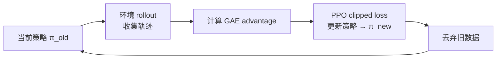
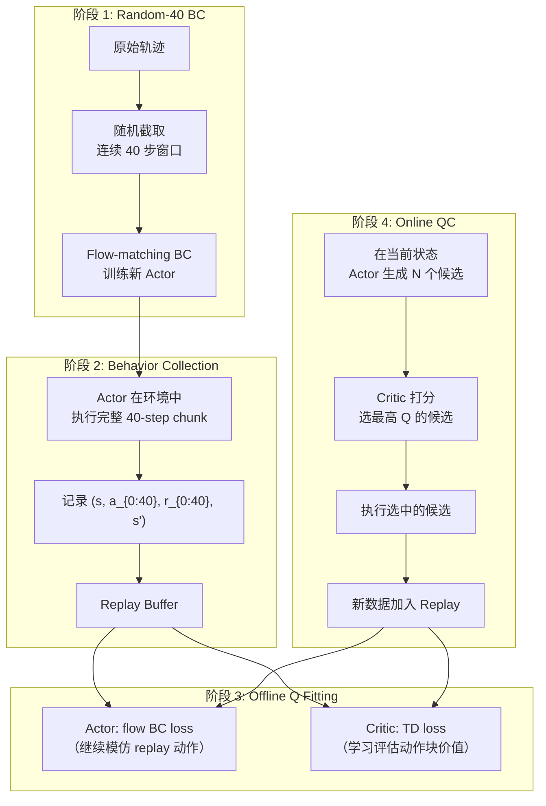
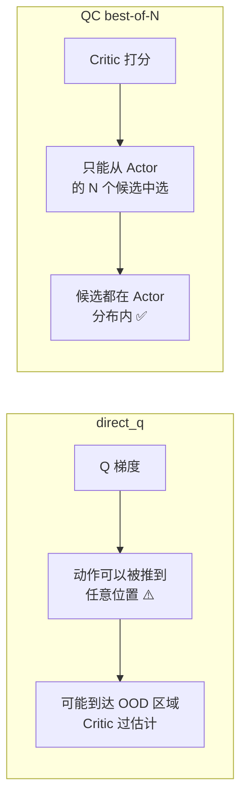
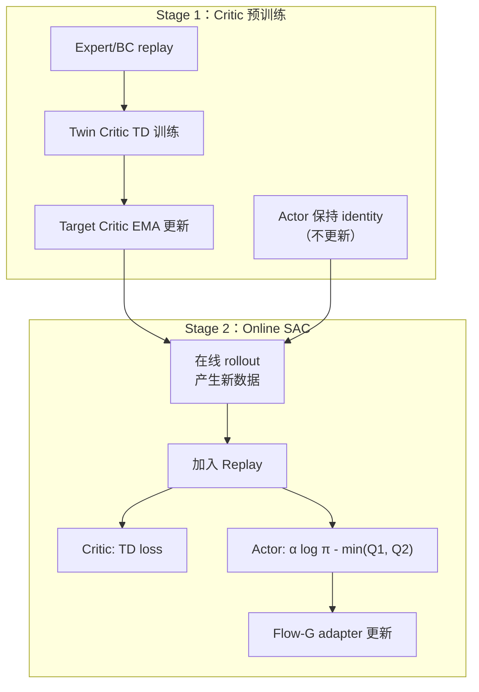
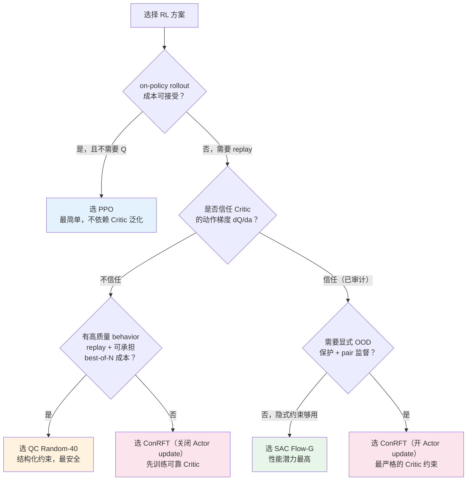
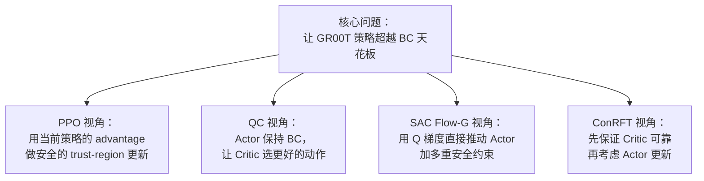

# GR00T N1.7 四种 RL 方案全景对比

> **一句话**：GR00T N1.7 的 RL 后训练不是"选 PPO 还是 SAC"这么简单——四种方案在数据协议、Critic 类型、Actor 更新机制、OOD 处理和动作 horizon 上完全不同，checkpoint 也互不兼容。本文帮你理清每种方案在做什么、适合什么场景、以及它们之间为什么不能混用。

## 相关阅读

**前置知识**：
- [策略梯度与 PPO](/前置知识/000a_前置知识_策略梯度与PPO) — PPO 方案的理论基础
- [SAC (Soft Actor-Critic)](/前置知识/000k_前置知识_SAC_Soft_Actor_Critic) — SAC Flow-G 的理论基础
- [Q 函数与 Value 函数](/前置知识/000o_前置知识_Q函数与Value函数) — 所有 Q-based 方案的基础
- [离线强化学习基础](/前置知识/000s_前置知识_离线强化学习基础) — CQL/CalQL 的背景
- [行为约束策略优化](/前置知识/001l_前置知识_行为约束策略优化) — 各方案的约束机制对比
- [AWR 优势加权回归](/前置知识/000u_前置知识_AWR_优势加权回归) — QC 隐式约束的理论来源
- [Flow Matching 与连续归一化流](/前置知识/000g_前置知识_Flow_Matching与连续归一化流) — GR00T 动作生成机制

**关联文章**：
- [GR00T N1.7 Chunk-SAC 四种 Actor 目标详解](./GR00T_N1d7_ChunkSAC四种Actor目标详解) — SAC Flow-G 内部的四种 Actor loss 选择
- [RLinf BC 到 RL 的 ACT 后训练架构](./RLinf_BC到RL的ACT后训练架构) — PPO 路线的 ACT 实现细节
- [动作分块 RL 基础](/系列/groot_rl_deep_dive/06_动作分块RL基础_QChunking到AQC回顾) — QC 方案的理论基础
- [RLinf 算法实现：SAC](/系列/rlinf_deep_dive/10_算法实现_SAC与其他算法) — RLinf 中 SAC 的通用架构
- [GR00T N1.7 深度解析系列](/系列/groot_n1d7_deep_dive/index) — 模型架构参考

---

## 一、这篇文章要解决什么问题

你有一个 BC 预训练好的 GR00T N1.7 模型，想用环境 reward 做强化学习后训练。打开 RLinf 框架一看——**有四种完全不同的 RL 方案**可选：

1. **PPO / Flow-SDE**：经典 on-policy 策略梯度
2. **QC Random-40**：Q-Chunking + best-of-N 选择
3. **SAC Flow-G**：Chunk-SAC + Flow-G adapter
4. **ConRFT**：Conservative RL with same-state pair supervision

这不是同一个算法的四种变体——它们的数据流、Critic 类型、Actor 更新方式、replay 需求和 checkpoint 格式全都不同。选错了不仅浪费时间，还可能产生微妙的数据协议错误。

本文的目标：**让你在读完后能根据自己的任务特征和资源约束，做出明确的方案选择**。

---

## 二、贯穿全文的例子

> **任务**：GR00T N1.7 控制一个双臂人形机器人（62 维动作）在 MiArena/Isaac Sim 中执行桌面操作任务。
> - 状态：头部 + 左腕 + 右腕三路图像，加双臂关节状态
> - 动作：62D camera-frame Rot6D，执行前转为 58D simulator action
> - 预训练：已有 BC checkpoint，成功率约 40-60%
> - 目标：通过 RL 后训练提升到 80%+

---

## 三、四种方案共享什么

在讲区别之前，先明确所有方案的共同基础——它们都建立在同一个协议上：


| 共享项 | 说明 |
|--------|------|
| 模型 | GR00T N1.7（Cosmos-Reason2 骨干 + AlternateVLDiT 动作头） |
| 输入 | 三路图像 + 双臂本体感觉状态 |
| 动作格式 | 62D camera-frame Rot6D → 58D sim action |
| 四元数约定 | 统一 `[x, y, z, w]` |
| Processor | GR00T processor + action statistics（训练语义的一部分） |
| 分布式训练 | FSDP 负责 Actor 参数分片 |
| Worker 体系 | RLinf Worker 架构（Actor / Rollout / Env 分离） |

**但共享模型不意味着训练产物兼容**。四种方案的 replay schema、Critic 结构、optimizer state、target network、action horizon 和 checkpoint sidecar 全不相同。**不能仅凭 `model_type: gr00t_n1d7` 互相恢复 checkpoint**。

---

## 四、核心差异一览

先给一张全局对比表，后面再逐一展开：

| 维度 | PPO / Flow-SDE | QC Random-40 | SAC Flow-G | ConRFT |
|------|---------------|-------------|-----------|--------|
| **RL 类型** | On-policy | Off-policy（BC + best-of-N） | Off-policy SAC | Off-policy conservative |
| **Actor 怎么变好** | Clipped ratio × advantage | Actor 做 BC，Q 选动作 | Q 梯度穿过 Flow-G | 可选 Q Actor + BC |
| **Critic 类型** | State value $V(s)$ | Twin/ensemble chunk-Q | Twin chunk-Q | 通用 Q head，可多头 |
| **Q 梯度是否传给 Actor** | 否 | 否 | 是 | 可选 |
| **Replay Buffer** | 无（用当前 rollout） | 必需 | 必需 | 必需 |
| **OOD Q 处理** | 隐式（on-policy 数据） | 候选限于 Actor 分布 | Twin min + reference gate | 显式 CQL/CalQL |
| **动作 horizon** | 正式配置 8-step | 精确连续 40-step | Native 16-step | 配置化 H-step |
| **主要风险** | ratio/log-prob 不稳定 | Q 排序错误 | Critic exploitation | CQL 标度、pair 数据成本 |

---

## 五、方案一：PPO / Flow-SDE

### 5.1 核心思想

> **一句话**：用当前策略收集数据 → 计算 advantage → 用 clipped ratio 更新策略 → 丢弃数据 → 重新收集。

PPO 是最经典的 on-policy 方法。它不训练 $Q(s,a)$，只训练 $V(s)$（state value）。策略改进的信号来自 advantage $\hat{A}_t$——"这个动作比平均好多少"。

### 5.2 数据流



**关键特征**：每一轮训练数据用完就丢，不存到 replay buffer。这保证了训练数据始终来自当前策略，但代价是样本效率低。

### 5.3 Actor 更新公式

$$
\mathcal{L}_{\text{PPO}} = -\mathbb{E}\left[\min\Big(r_t \hat{A}_t,\; \text{clip}(r_t, 1-\epsilon, 1+\epsilon)\hat{A}_t\Big)\right]
$$

其中 $r_t = \frac{\pi_\theta(a_t|s_t)}{\pi_{\theta_{\text{old}}}(a_t|s_t)}$ 是新旧策略的概率比值。

> **一句话直觉**：如果一个动作的 advantage > 0（比平均好），就增加它的概率；但增加的幅度被 clip 限制，防止一步跳太远。

详细的 PPO 推导见 [策略梯度与 PPO](/前置知识/000a_前置知识_策略梯度与PPO)。

### 5.4 GR00T 上的特殊困难

PPO 需要计算 $\log \pi(a|s)$——在高斯策略上这很简单（解析公式），但 **GR00T 是 Flow 策略**，动作经过多步去噪产生。计算 $\log \pi$ 需要沿 ODE 路径累积散度（详见 [GR00T N1.7 Chunk-SAC 四种 Actor 目标详解](./GR00T_N1d7_ChunkSAC四种Actor目标详解#322-log-pimathbfas-是什么flow-策略的对数概率)）。

此外，GR00T 的 denoising latent 是 132D，但实际执行的 action 只有 62D——log-prob 的计算域和执行域不一致。RLinf 的正式配置使用 `token_level` ratio（逐 token 计算比值）而非不稳定的 `chunk_level` ratio（整个 chunk 的 log-prob 求和后再算比值——这会导致 ratio 爆炸）。

### 5.5 同步 vs 异步

| 模式 | 流程 | 优点 | 风险 |
|------|------|------|------|
| 同步 | rollout → GAE → update → 权重同步 → 下一轮 | 数据新鲜，理论保证强 | 环境空闲等待训练 |
| 异步 | rollout 和 update 并行 | 吞吐高 | policy staleness，需额外修正 |

异步 PPO 允许环境持续采数据，但训练用的数据可能来自几步前的旧策略。需要 `staleness_threshold`、behavior/proximal ratio 修正等机制。GR00T 的 log-prob 估计本身已有方差，异步的 stale-policy correction 可能进一步放大偏差。

### 5.6 优缺点

**优点**：
- 不依赖 Q 对 OOD 动作的泛化——只用当前策略数据
- 不需要 replay buffer 和 target network
- PPO 的 trust region 保证策略不会单步崩溃
- 适合 action chunk 较短、可频繁 replan 的场景

**缺点**：
- 样本效率低——Isaac Sim rollout 很贵时成本高
- 对 log-prob、ratio、mask 和 advantage 标度极其敏感
- $V(s)$ 只评价状态，无法用于 best-of-N 动作选择
- 长动作块（如 40 步）的 ratio 方差极大

### 5.7 关键配置片段

```yaml
algorithm:
  loss_type: embodied_ppo
  clip_range: 0.1          # GR00T 上通常比标准 PPO 的 0.2 更保守
  ratio_type: token_level  # 逐 token 算 ratio，避免 chunk 级爆炸
  gae_lambda: 0.95
  gamma: 0.99
```

---

## 六、方案二：QC Random-40

### 6.1 核心思想

> **一句话**：Actor 只做 BC（模仿 replay 中的动作），Critic 负责从 Actor 生成的多个候选动作中选最好的那个执行。


QC 的关键洞察：不让 Q 梯度直接改变 Actor（容易利用 Critic 误差），而是让 Actor 保持"生成合理候选"的能力，由 Critic 在有限候选集中做选择。这形成了一种**隐式 KL 约束**——Critic 只能从 Actor 能生成的动作中选，不会选到 Actor 分布之外的 OOD 动作。

关于 Q-Chunking 的理论基础，详见 [动作分块 RL 基础](/系列/groot_rl_deep_dive/06_动作分块RL基础_QChunking到AQC回顾)。

### 6.2 "Random-40" 是什么意思

这不是把 native 16-step checkpoint 简单改成 40——而是一个**完整的数据协议重建**：

1. **Random-40 BC**：从原始轨迹中随机截取连续 40 步窗口，用这些真实物理步重新训练 BC
2. **Behavior collection**：用 Random-40 BC 策略在环境中执行，收集真实 40-step replay
3. **Offline Q fitting**：在 replay 上训练 Chunk-Q Critic
4. **Online QC**：Critic 从 Actor 候选中选动作执行，新数据加入 replay

**硬约束**——每个训练窗口必须满足：
- 40 步全部是真实物理动作（不是 padding、不是 repeat_last）
- 不跨 episode 边界
- 训练、采集、Critic 和评测使用同一个 processor/statistics

### 6.3 训练阶段详解



### 6.4 Critic Target

QC 的 Bellman target 和 Chunk-SAC 类似，但 bootstrap 使用 **best-of-N**：

$$
y = \underbrace{\sum_{i=0}^{39} \gamma^i r_i}_{R_{40}} + \gamma^{40} \cdot m \cdot Q^{\text{target}}(s', \mathbf{a}'_{\text{best}})
$$

其中 $\mathbf{a}'_{\text{best}}$ 的选择过程：

```text
# 在下一状态 s' 生成 N 个候选
C_1, C_2, ..., C_N = Actor(s')     # 每个是 [40, 62] 的完整动作块

# 用 Online Q 选最好的
best = argmax_i Q_online(s', C_i)

# 用 Target Q 评估（防止选择偏差）
future = Q_target(s', C_best)
```

> **为什么用 Online Q 选、Target Q 评？** 这和 Double DQN 的思路一样——用一个网络选动作，用另一个网络评价，避免"选择偏差"导致系统性过估计。

### 6.5 Actor 始终做 BC

QC 中 Actor 的 loss 始终是 flow-matching BC：

$$
\mathcal{L}_{\text{actor}} = \text{FlowBC}(\pi_\theta(s), \mathbf{a}_{\text{replay}})
$$

**Q 梯度不传给 Actor**。Actor 的作用是"生成覆盖合理动作空间的候选集"，而不是"追着 Q 梯度走"。改进来自 Critic 的选择能力——随着 Critic 训练得更好，它能从候选中挑出更好的动作。

### 6.6 隐式 KL 约束的直觉

为什么这比 `direct_q`（直接沿 Q 梯度推动作）更安全？



即使 Critic 对某些 OOD 动作严重过估计，QC 也不会选到那些动作——因为 Actor（做 BC）不会生成 OOD 动作。约束是**结构化的**，不需要额外的 penalty 项。

### 6.7 推理成本

QC 的代价是推理时间。每次决策需要：
1. Actor forward × N 次（生成 N 个候选，每个都是完整的 flow 去噪过程）
2. Critic forward × N 次（对每个候选打分）
3. 选择最高分的候选执行

**代入数字**：如果 N=32，每次 Actor forward 需要 10 步去噪 × 0.01s = 0.1s，那么生成 32 个候选需要 3.2s。加上 Critic 打分约 0.3s，总计约 3.5s 做一次决策。但因为决策后执行完整 40 步（约 0.8s），amortized 后每步决策时间 ≈ 0.088s，在仿真中可接受。

### 6.8 优缺点

**优点**：
- Actor 不利用 $dQ/da$，减少 Critic exploitation 风险
- Replay 可反复使用，样本效率高于 PPO
- best-of-N 可以在不修改 Actor 的情况下提升执行质量
- Actor 始终通过 BC 保持在合理动作分布内

**缺点**：
- 性能上限受 Actor 候选覆盖率限制（Actor 不会生成的好动作永远选不到）
- 每次决策需要生成 N 个完整 chunk，推理成本高
- Q 排序错误 → 直接选出更差的动作（没有梯度做平滑纠正）
- 固定 40-step open-loop 对精细接触阶段不一定合适
- 需要独立的 Random-40 BC 训练，不能复用 native-16 的 replay

---

## 七、方案三：SAC Flow-G

### 7.1 核心思想

> **一句话**：在冻结的 GR00T velocity 上加一个可训练 adapter，用完整 SAC 框架（Twin-Q + 可学习熵温度 + replay）训练这个 adapter，让 Q 梯度直接穿过动作采样链路改进策略。

SAC Flow-G 是四种方案中**性能潜力最高但配置最复杂**的。它不像 QC 那样限制在有限候选中选——策略可以通过连续的 Q 梯度产生从未在 replay 中出现过的好动作。

关于 SAC Flow-G 内部的四种 Actor objective（`awr_flow`/`direct_q`/`sac_flow_g`/`awr`），详见 [GR00T N1.7 Chunk-SAC 四种 Actor 目标详解](./GR00T_N1d7_ChunkSAC四种Actor目标详解)。

### 7.2 Flow-G Adapter

```text
v_actor(x_t, t, s) = FlowGAdapter(v_pretrained(x_t, t, s), x_t, t)
```

- `freeze_pretrained_velocity: true`：GR00T 主干冻结，只更新 adapter
- Adapter 初始化为 identity → 训练起点 = BC 策略
- 主要优化的参数量远小于整个 GR00T

### 7.3 训练结构



### 7.4 与 QC 的根本区别

| 维度 | QC | SAC Flow-G |
|------|-----|-----------|
| Actor 如何改进 | 不改进（始终 BC），靠 Critic 选 | Q 梯度直接改进 Actor |
| 能否超越 replay 动作 | ❌ 受限于 Actor 候选覆盖 | ✅ 可产生全新动作 |
| OOD 风险 | 低（结构化约束） | 高（需要 gate/BC/reference 约束） |
| 推理成本 | 高（N 次 forward + 打分） | 低（1 次 forward） |

### 7.5 稳定性机制

因为 Q 梯度直接推动 Actor，SAC Flow-G 需要多重安全网：

| 机制 | 作用 |
|------|------|
| Flow-G identity 初始化 | 起点 = BC，不会突然产生怪动作 |
| BC warmup 阶段 | adapter 先做 expert 模仿再接 Q 梯度 |
| 持续 expert BC loss | 防止完全偏离 expert 行为 |
| Frozen-BC reference gate | 只有 Actor 确实比 BC 好时才用 Q 梯度 |
| Twin-Q minimum | 降低过估计 |
| Critic calibration gate | Critic 没准备好时不更新 Actor |
| `critic_actor_ratio` | Critic 更新 N 次，Actor 才更新 1 次 |

### 7.6 动作协议

当前有效的 SAC Flow-G 使用 **native 16-step**：

```yaml
chunk_length: 16
replan_steps: 16
```

旧的 40-step Flow-G 使用 `repeat_last` 把 native 16 步延长到 40 步——实验已证明这无效，相关 checkpoint 禁止恢复。

### 7.7 优缺点

**优点**：
- Replay 样本效率高
- Actor 能通过连续 Q 梯度超越 replay 中已有动作
- Identity adapter + BC/reference gate 可保护预训练能力
- Twin-Q、target Q、entropy temperature 构成完整 SAC 闭环
- 推理只需 1 次 forward（不需要 best-of-N）

**缺点**：
- 对 Critic 动作梯度的正确性要求最高
- Critic 若主要靠状态预测 Q（忽略动作），Actor 获得错误梯度
- 训练阶段、replay 分层、checkpoint migration 复杂
- Actor 更新过频或 LR 过大容易 policy drift

---

## 八、方案四：ConRFT

### 8.1 核心思想

> **一句话**：先用 conservative objective（CQL/CalQL）训练一个"不会过估计 OOD 动作"的 Critic，再用 same-state pair 监督确保 Critic 真的能区分动作好坏，最后可选地用这个可靠 Critic 更新 Actor。

ConRFT 的哲学与前三种不同：**它首先关注的不是"Actor 怎么变好"，而是"Critic 怎么变可靠"**。在 Critic 没有经过充分验证之前，可以完全不更新 Actor——先把 Critic 的基础打好。

### 8.2 三大 Critic 训练目标

ConRFT 的 Critic loss 由三项加权求和组成：

$$
\mathcal{L}_{\text{critic}} = \underbrace{\mathcal{L}_{\text{TD}}}_{\text{第一项：标准 TD 学习}} + \underbrace{\lambda_{\text{pair}} \cdot \mathcal{L}_{\text{pair}}}_{\text{第二项：同状态 pair 差值监督}} + \underbrace{\lambda_{\text{CQL}} \cdot \mathcal{L}_{\text{CQL}}}_{\text{第三项：Conservative 正则}}
$$

> **为什么需要三项？** 单独的 TD 学习有一个固有缺陷：当 Critic 遇到 replay 中没见过的动作（OOD 动作）时，它的输出完全是"凭空外推"的——可能严重过估计。$\mathcal{L}_{\text{CQL}}$ 负责压低这些 OOD 区域的 Q 值；$\mathcal{L}_{\text{pair}}$ 则确保在"有事实依据"的区域内，Critic 能正确区分动作好坏。三项各司其职，缺一不可。

**逐项拆解**：

| 符号 | 对应的是什么 | 训练信号来源 | 解决什么问题 |
|------|-------------|-------------|-------------|
| $\mathcal{L}_{\text{TD}}$ | 标准 Bellman TD loss | replay 中的 $(s, a, r, s')$ | 让 Critic 学会基本的价值估计 |
| $\lambda_{\text{pair}} \cdot \mathcal{L}_{\text{pair}}$ | 同状态两分支的 Q 差值回归 | same-state pair batch | 让 Critic 在同一状态下能区分好动作和差动作 |
| $\lambda_{\text{CQL}} \cdot \mathcal{L}_{\text{CQL}}$ | Conservative Q-Learning 正则 | 随机采样的 OOD 动作 | 压低 Critic 对没见过的动作的估值 |

其中 $\lambda_{\text{pair}}$ 和 $\lambda_{\text{CQL}}$ 是权重超参数（典型值 $\lambda_{\text{pair}} \in [0.1, 1.0]$，$\lambda_{\text{CQL}} \in [0.01, 1.0]$）。

下面逐一详解每一项。

#### 8.2.1 第一项：$\mathcal{L}_{\text{TD}}$ — H-step TD Loss

**这一项在做什么**：让 Critic 学会"从当前状态执行这段动作后能拿到多少累积奖励"的基本估值能力。这是所有 Q-learning 方法共有的基础训练目标。

**Step 1：构造 Bellman target $y$**

$$
y = \underbrace{\sum_{i=0}^{H-1} \gamma^i r_i}_{R_H:\text{ H 步内的折扣奖励和}} + \underbrace{\gamma^H \cdot m \cdot Q^{\text{target}}(s', \mathbf{a}')}_{\text{H 步之后的 bootstrapped 未来价值}}
$$

> **一句话**：target = "H 步内真实拿到的奖励" + "H 步后 Critic（目标网络版本）对剩余未来的估计"。

**逐符号拆解**：

| 符号 | 含义 | 具体是什么 |
|------|------|-----------|
| $H$ | 动作块步数 | 配置的 `discount_horizon`，例如 16 或 40 |
| $\gamma$ | 折扣因子 | 典型值 0.99，让远期奖励的权重递减 |
| $r_i$ | 第 $i$ 步获得的即时奖励 | 环境每步返回的标量，例如柜门角度增加量 |
| $\sum_{i=0}^{H-1}\gamma^i r_i$ | H 步折扣奖励和 $R_H$ | 把 chunk 内所有奖励按折扣加起来 |
| $m$ | bootstrap mask | episode 结束 = 0（没有未来了），未结束 = 1 |
| $s'$ | H 步之后的状态 | 执行完动作块后环境到达的新状态 |
| $\mathbf{a}'$ | 在 $s'$ 上用当前策略采样的动作 | $\mathbf{a}' = \pi_\theta(s')$，一次 Actor forward |
| $Q^{\text{target}}$ | **目标网络**的 Q 输出 | EMA 版本的 Critic，更新慢、提供稳定的 target |

**代入数字**：假设 $H=16$，$\gamma=0.99$，chunk 内奖励和 $R_{16}=2.1$，episode 未结束（$m=1$），$Q^{\text{target}}(s',\mathbf{a}')=9.5$：

$$
y = 2.1 + 0.99^{16} \times 1 \times 9.5 = 2.1 + 0.851 \times 9.5 = 2.1 + 8.08 = 10.18
$$

**Step 2：计算 TD loss**

$$
\mathcal{L}_{\text{TD}} = \text{Loss}\Big(Q_\phi(s, \mathbf{a}) - y\Big)
$$

其中 $Q_\phi(s, \mathbf{a})$ 是**当前 Critic**（被训练的那个）对 replay 中"真实执行的 $(s, \mathbf{a})$"的估值，$y$ 是上面算出的 target。

Loss 函数有两种选择：

| Loss 类型 | 公式 | 特点 |
|-----------|------|------|
| MSE | $\frac{1}{2}(Q - y)^2$ | 对所有误差一视同仁 |
| Huber | 当 $|Q-y| \leq \beta$ 时用 MSE，否则用线性 | 对大 TD error 更鲁棒，不让离群点主导梯度 |

**代入数字续**：假设当前 Critic 输出 $Q_\phi(s, \mathbf{a}) = 8.5$，target $y = 10.18$：
- TD error = $8.5 - 10.18 = -1.68$
- MSE loss = $\frac{1}{2}(1.68)^2 = 1.41$
- 梯度方向：推动 Critic 把这个 $(s,\mathbf{a})$ 的估值往上调

**为什么用目标网络？** 如果 target 也用正在被训练的 Critic 计算，会出现"自己追自己尾巴"的问题——target 和 prediction 同时变化，容易发散。目标网络是 Critic 的 EMA 副本，变化很慢（每步只朝当前 Critic 方向挪动 0.5%），提供相对稳定的训练目标。

#### 8.2.2 第二项：$\mathcal{L}_{\text{pair}}$ — Same-State Pair Delta Loss

**这一项在做什么**：单纯的 TD 学习有一个隐患——Critic 可能学会"只看状态猜 Q，忽略动作的差异"。pair loss 专门治这个病：它要求 Critic 在**同一个状态**下，对两个不同动作输出的 Q 差值，必须匹配真实的回报差值。

**数据来源：Pair Batch**

Pair batch 是 ConRFT 独有的数据格式。在仿真中，对同一个起始状态 $s_0$ fork 两条执行路径：

```text
同一个起始观测 s₀（同一个物理快照）
├── main branch:  执行 a_main [H步] → 得到 rewards_main, s'_main, done_main
└── probe branch: 执行 a_probe [H步] → 得到 rewards_probe, s'_probe, done_probe
```

两条分支从**完全相同的物理状态**出发，执行不同的动作块，观察不同的结果。

**Step 1：分别计算两个分支的 Bellman target**

$$
y_{\text{main}} = \sum_{i=0}^{H-1}\gamma^i r_i^{\text{main}} + \gamma^H \cdot m_{\text{main}} \cdot Q^{\text{target}}(s'_{\text{main}}, \mathbf{a}'_{\text{main}})
$$

$$
y_{\text{probe}} = \sum_{i=0}^{H-1}\gamma^i r_i^{\text{probe}} + \gamma^H \cdot m_{\text{probe}} \cdot Q^{\text{target}}(s'_{\text{probe}}, \mathbf{a}'_{\text{probe}})
$$

这和 8.2.1 中的 target 计算方式完全相同，只是分别对两条分支各算一个。

**Step 2：计算 Q 差值和 target 差值**

$$
\Delta Q = Q_\phi(s_0, \mathbf{a}_{\text{probe}}) - Q_\phi(s_0, \mathbf{a}_{\text{main}})
$$

$$
\Delta y = y_{\text{probe}} - y_{\text{main}}
$$

| 符号 | 含义 |
|------|------|
| $\Delta Q$ | Critic 认为 probe 动作比 main 动作好多少 |
| $\Delta y$ | 真实数据告诉我们 probe 实际比 main 好多少 |

**Step 3：用 Huber loss 监督差值**

$$
\mathcal{L}_{\text{pair}} = \text{Huber}(\Delta Q,\; \Delta y,\; \beta)
$$

其中 Huber loss 的定义是：

$$
\text{Huber}(x, y, \beta) = \begin{cases} \frac{1}{2}(x-y)^2 & \text{if } |x-y| \leq \beta \\ \beta \cdot (|x-y| - \frac{\beta}{2}) & \text{otherwise} \end{cases}
$$

| 符号 | 含义 | 典型值 |
|------|------|--------|
| $\beta$ | Huber 阈值，小于它用 MSE，大于它用线性 | `pair_huber_beta`，例如 1.0 |

**代入数字**：假设 main 分支（策略动作）在 16 步内获得总折扣奖励 $R_{\text{main}}=2.1$，bootstrap value = 8.0；probe 分支（另一种动作）获得 $R_{\text{probe}}=3.5$，bootstrap value = 8.5。

- $y_{\text{main}} = 2.1 + 0.851 \times 8.0 = 8.91$
- $y_{\text{probe}} = 3.5 + 0.851 \times 8.5 = 10.73$
- $\Delta y = 10.73 - 8.91 = 1.82$（probe 实际比 main 好 1.82）

如果当前 Critic 输出 $Q(s_0, \mathbf{a}_{\text{main}}) = 9.0$，$Q(s_0, \mathbf{a}_{\text{probe}}) = 9.8$：
- $\Delta Q = 9.8 - 9.0 = 0.8$（Critic 认为 probe 只好 0.8）
- 误差 = $0.8 - 1.82 = -1.02$（Critic 低估了差距）
- 梯度方向：推动 Critic 拉大 probe 和 main 之间的 Q 差距

**为什么要做差值而不是直接训练绝对 Q？**

关键洞察：**同一个初始状态抵消了大量 $V(s)$ 噪声**。

假设真实 Q 分别是 $Q(s_0, a_{\text{main}}) = 12.3$ 和 $Q(s_0, a_{\text{probe}}) = 12.8$。要 Critic 精确输出 12.3 和 12.8 非常难——它需要从高维图像+状态中拟合出这个绝对值。但两者的**差值** $12.8 - 12.3 = 0.5$ 只取决于"两个动作在同一状态下的后果差异"——$V(s_0)$ 这个共享的大数完全被抵消了。这使得 pair loss 对 Critic 的约束更精确、噪声更小。

**与 ranking loss 的区别**：

| 方法 | 监督信号 | 信息量 |
|------|----------|--------|
| Ranking loss | 只知道 $Q(s,a_1) > Q(s,a_2)$（谁大） | 1 bit |
| Pair delta loss | 知道 $Q(s,a_1) - Q(s,a_2) \approx 1.82$（大多少） | 连续值 |

Pair delta 包含了"好多少"的精确数值信息，比纯排序 loss 提供了更强的训练信号。

**数据采集成本**：main 和 probe 必须严格共享起始物理状态。在 Isaac Sim 中通过"保存环境快照 → fork 两条路径"实现。这意味着每个 pair 需要两倍的仿真步数——这是 ConRFT 的主要数据成本。

#### 8.2.3 第三项：$\mathcal{L}_{\text{CQL}}$ — Conservative Q-Learning

**这一项在做什么**：TD loss 和 pair loss 都只训练 Critic 在"数据中见过的动作"上的估值。但问题是：当 Actor 后续用 Q 梯度更新策略时，它可能把动作推到"数据中没见过的区域"——而 Critic 在这些区域的输出是不可信的外推值，很可能严重过估计。CQL 的作用就是**在训练 Critic 时，显式地把它对 OOD 动作的估值压低**，让 Critic 在没见过的区域保持"保守悲观"。

**Step 1：采样 OOD 动作**

从动作空间中随机采样 $N$ 个与 replay 数据无关的动作：

$$
a_1^{\text{rand}}, a_2^{\text{rand}}, \ldots, a_N^{\text{rand}} \sim p_{\text{proposal}}(\mathbf{a})
$$

$p_{\text{proposal}}$ 可以是均匀分布 $\text{Uniform}(\text{action\_space})$ 或正态分布 $\mathcal{N}(0, \sigma)$。这些随机动作大概率不在 replay 数据的分布内——它们就是我们想压低的 OOD 区域的代表。

**Step 2：计算 OOD 动作的"软最大" Q 值**

$$
Q_{\text{ood}} = \tau \cdot \log \frac{1}{N+1} \sum_{i=1}^{N} e^{Q_\phi(s, a_i^{\text{rand}})/\tau}
$$

| 符号 | 含义 | 为什么是这个形式 |
|------|------|-----------------|
| $\tau$ | 温度参数 | 控制 logsumexp 的"软度"，$\tau \to 0$ 退化为 $\max$ |
| $\log\sum\exp(\cdot/\tau)$ | Soft maximum | 对所有随机动作的 Q 值取一个"软的最大值" |
| $N+1$ | 归一化常数 | 使 $Q_{\text{ood}}$ 的量纲与 $Q(s, a_{\text{data}})$ 可比 |

> **直觉**：$Q_{\text{ood}}$ 近似度量了"Critic 给 OOD 区域最高能打多少分"。如果 Critic 对任何随机动作都给出了高分，$Q_{\text{ood}}$ 就会很大。

**Step 3：计算 CQL loss**

$$
\mathcal{L}_{\text{CQL}} = \mathbb{E}_{s \sim \mathcal{D}}\Big[Q_{\text{ood}}(s) - Q_\phi(s, \mathbf{a}_{\text{data}})\Big]
$$

| 项 | 梯度方向 | 含义 |
|----|----------|------|
| $+Q_{\text{ood}}$ | 压低 Critic 对 OOD 动作的输出 | "对没见过的动作别给高分" |
| $-Q_\phi(s, \mathbf{a}_{\text{data}})$ | 抬高 Critic 对 replay 动作的输出 | "对见过的动作保持合理估值" |

> **一句话**：CQL loss = "Critic 对随机动作的估值" 减去 "Critic 对真实数据动作的估值"。最小化这个 loss，就是在**压低 OOD、抬高数据**——迫使 Q 函数的"高值区域"集中在数据分布内部。

**代入数字**：假设某状态 $s$ 下：
- Replay 中的真实动作：$Q_\phi(s, a_{\text{data}}) = 10.0$
- 5 个随机采样动作的 Q 值：$[12.5, 11.0, 9.8, 13.2, 10.5]$
- $\tau = 1.0$

计算 $Q_{\text{ood}}$：
$$
Q_{\text{ood}} = 1.0 \times \log\frac{1}{6}(e^{12.5} + e^{11.0} + e^{9.8} + e^{13.2} + e^{10.5})
$$

$e^{13.2}$ 主导求和 → $Q_{\text{ood}} \approx 13.2 - \log 6 \approx 13.2 - 1.79 = 11.41$

CQL loss = $11.41 - 10.0 = 1.41 > 0$

梯度方向：
- 把随机动作（特别是 13.2 和 12.5 那两个高分动作）的 Q 估值压下来
- 把真实数据动作的 Q 估值稍微抬一点

**为什么其他方案不用 CQL？**

| 方案 | 如何处理 OOD 过估计 | 为什么不需要 CQL |
|------|-------------------|-----------------|
| PPO | 训练数据始终来自当前策略 | on-policy 数据没有 OOD 问题 |
| QC | Critic 只需要给 Actor 候选排序 | 候选都在 Actor 分布内，不是 OOD |
| SAC Flow-G | Twin-Q min + reference gate + BC 正则 | 隐式约束，但可能不够严格 |
| ConRFT | **显式 CQL** | 直接对 OOD 区域施加惩罚 |

ConRFT 认为隐式机制不够可靠——特别是当 Critic 能力较弱、或动作空间很大时，必须**显式地**告诉 Critic "不要在没见过的地方给高分"。

#### 8.2.4 CalQL：校准版 CQL（防止过度悲观）

**CQL 的副作用**：CQL 可能过于激进——不只压低了 OOD 动作的 Q，连一些**在数据中出现过的好动作**的 Q 也被误压了。这是因为 random proposal 可能碰巧采到和数据接近的动作，也被当成 OOD 压低。

**CalQL 的修正**：当 replay 中有 Monte-Carlo return $R_{\text{MC}}$（某条轨迹的真实累积回报）时，在 CQL 计算中加一个**下界保护**：

$$
Q_{\text{candidate}} \leftarrow \max\Big(Q_{\text{candidate}},\; R_{\text{MC}}\Big)
$$

| 符号 | 含义 |
|------|------|
| $Q_{\text{candidate}}$ | CQL 中随机候选动作的 Q 值（正常会被压低） |
| $R_{\text{MC}}$ | 这个状态-动作对的真实累积回报（从真实轨迹计算） |

> **一句话直觉**：$R_{\text{MC}}$ 是事实——这个动作从这个状态开始，真实获得了这么多回报。CQL 可以把 Q 压到这个事实之下吗？不行！CalQL 说"Q 值至少不能低于你的真实回报"。

**代入数字**：假设某动作的真实累积回报 $R_{\text{MC}} = 8.0$，但 CQL 把它的 Q 压到了 5.0。CalQL 会把它拉回到 $\max(5.0, 8.0) = 8.0$——不允许低于事实。

**限制**：CalQL 需要 replay 中存在可靠的 MC return。对于在线数据（episode 还没结束），无法计算 MC return。因此配置 `require_mc_returns: true` 时，缺少 MC return 的数据会直接报错，不允许静默跳过。

### 8.3 Actor 更新（可选）

ConRFT 可以完全关闭 Actor 更新，只训练 Critic：

```yaml
algorithm:
  conrft:
    actor_update_enabled: false    # 只训练 Critic
    actor_warmup_steps: 1000       # 或者等 Critic 稳定后再开 Actor
    actor_bc_weight: 0.1           # Actor loss 中的 BC 正则
```

当 Actor 更新打开时：

$$
\mathcal{L}_{\text{actor}} = \alpha \log \pi - Q(s, \pi(s)) + c_{\text{bc}} \cdot \text{BC}(\pi(s), \mathbf{a}_{\text{data}})
$$

**与 SAC Flow-G 的区别**：
- SAC Flow-G 重点是 adapter 设计、entropy tuning 和 frozen-BC reference
- ConRFT 重点是确保 Critic 本身可靠（CQL + pair），Actor 更新是可选的后续步骤

### 8.4 优缺点

**优点**：
- CQL/CalQL 明确处理 OOD Q 高估——不像 SAC Flow-G 依赖隐式约束
- Pair delta 直接用事实监督 Critic 的动作区分能力
- 可以先关闭 Actor，单独验证 Critic 是否可靠
- H-step TD、Huber、CQL 权重均可独立调节

**缺点**：
- CQL 权重过大 → 所有 Q 都被压低 → Critic 失去区分能力
- Pair 数据需要 same-state fork，采集成本高
- Random proposal 若与机器人可执行动作分布差太远，CQL 可能"压低"了本来就不可能执行的动作区域（无意义）
- TD + pair + CQL + Actor BC 多项 loss 的相对标度需要仔细审计

---

## 九、动作 Horizon：不是普通超参数

四种方案使用不同的动作 horizon，这是最容易踩坑的地方：

| 方案 | 动作 Horizon | 含义 |
|------|-------------|------|
| PPO（正式配置） | 8-step | 执行 8 步后重新规划 |
| QC Random-40 | 40-step | 完整执行 40 步 open-loop |
| SAC Flow-G | 16-step（native） | 使用原始 checkpoint 的动作长度 |
| ConRFT | 配置化 H-step | 必须与 replay 和 action chunk 一致 |

**为什么不能混用？** 因为 H 同时改变了：

1. **Observation transition**：H=8 时 $s'$ 是 8 步后的状态，H=40 时是 40 步后的
2. **Reward return**：$R_H = \sum_{i=0}^{H-1}\gamma^i r_i$ 的求和范围不同
3. **Bootstrap discount**：$\gamma^8 \approx 0.92$ vs $\gamma^{40} \approx 0.67$
4. **Open-loop 时长**：8 步 ≈ 0.16s vs 40 步 ≈ 0.8s
5. **Critic 输入维度**：$8 \times 62 = 496$ 维 vs $40 \times 62 = 2480$ 维

**禁止操作**：
- 用 `repeat_last` 把 native-16 replay 伪装成 40-step ❌
- 用 Random-40 BC checkpoint 恢复 native-16 Flow-G optimizer ❌
- 用 PPO rollout tensor 直接作为 QC/ConRFT replay ❌
- 修改 H 后继续加载旧 TargetQ、replay 或 resume hash ❌

---

## 十、Checkpoint 与数据兼容性

| 来源 ↓ / 目标 → | PPO | QC | SAC Flow-G | ConRFT |
|-----------------|-----|-----|-----------|--------|
| 原始 BC 权重 | ✅ 可初始化 | ⚠️ 需先做 Random-40 BC 适配 | ✅ 可初始化 | ✅ 可初始化 |
| PPO checkpoint | ✅ 同配置可恢复 | ❌ | ❌ | ❌ |
| QC replay/ckpt | ❌ | ✅ 仅同协议 | ❌ | ⚠️ 需显式转换 |
| Flow-G ckpt | ❌ | ❌ | ✅ 仅同 hash | ❌ |
| ConRFT ckpt | ❌ | ❌ | ❌ | ✅ 仅同配置 |

**核心规则**：最多只能复用兼容的 GR00T model weights。Optimizer state、scheduler、TargetQ、alpha、replay buffer、calibration FIFO、pending episode 和 update counter 必须服从各自方案的 checkpoint contract。

---

## 十一、如何选择：决策流程图



### 选择建议总结

| 场景 | 推荐方案 | 理由 |
|------|----------|------|
| rollout 便宜、action chunk 短、只想快速验证 | PPO | 最简单，不需要 replay/Critic |
| 有大量高质量 replay、不信任 Q 梯度 | QC | 安全，Critic 只做排序不做梯度 |
| 追求最高性能上限、可投入调参时间 | SAC Flow-G | 连续 Q 梯度可超越 replay 上限 |
| 主要瓶颈是 Critic 不可靠/过估计 | ConRFT | 先用 CQL + pair 把 Critic 修好 |
| 能采集 same-state pair 数据 | ConRFT | pair delta 提供最强的 Critic 监督 |
| 想先验证 Critic 再决定是否更新 Actor | ConRFT | 可关闭 Actor update 单独审计 Critic |

---

## 十二、公平比较注意事项

四种方案**不能直接比较各自日志中的 loss 数值**。如果需要 A/B 实验，至少需要固定：

- 相同初始 BC 能力（或记录 BC 适配差异）
- 相同任务、prompt、layout manifest 和 episode horizon
- 相同输入（三相机、processor、statistics、action converter）
- 相同仿真配置（renderer、DLSS、资产、PhysX）
- **相同有效物理步预算**（不是 optimizer update 数）
- 独立的 fixed-layout checkpoint evaluation

此外，由于四种方案的 action horizon 不同，还需要决定实验口径：

1. **保留各方案最自然的动作协议**，比较端到端最佳系统效果
2. **统一动作协议**后比较纯算法差异，但需要为每种方案重新训练兼容的 BC/replay

不能混合这两种口径。

---

## 十三、关键监控指标

### PPO
| 指标 | 关注点 |
|------|--------|
| `approx_kl` / `clip_fraction` | 更新幅度是否受控 |
| ratio 分布 | 是否有爆炸（chunk-level ratio 问题） |
| GAE explained variance | Value head 拟合质量 |
| success rate / PSR | 最终评测标准 |

### QC Random-40
| 指标 | 关注点 |
|------|--------|
| best candidate vs random candidate 真实收益 | Critic 选择是否有效 |
| Twin disagreement | Critic 不确定性 |
| candidate Q spread | 候选之间是否有区分度 |
| BC loss | Actor 是否保持合理生成 |

### SAC Flow-G
| 指标 | 关注点 |
|------|--------|
| `critic/calibration_ready` | Critic 是否允许 Actor 更新 |
| `critic/td_abs_p90` / `p99` | Critic 误差尾部 |
| `sac/alpha` | 熵温度是否稳定 |
| `sac/reference_gate_fraction` | reference gate 通过率 |
| `actor/action_grad_norm` | Actor 梯度是否爆炸 |

### ConRFT
| 指标 | 关注点 |
|------|--------|
| pair delta loss / pair sign accuracy | Critic 能否区分同状态动作好坏 |
| CQL diff（Q_ood - Q_data） | conservative penalty 是否适度 |
| CalQL bound rate | 有多少样本触发了 MC return 下界 |
| Actor gate 状态 | Actor 是否在更新 |

---

## 十四、总结：四条路在解决同一个问题的不同方面



- **PPO** 说："我不需要 Q，我信任 on-policy advantage"
- **QC** 说："Q 梯度不可信，但 Q 排序可信——让它在候选中选就好"
- **SAC Flow-G** 说："Q 梯度可以信（有足够约束后），直接用它推动 Actor"
- **ConRFT** 说："Q 梯度能不能信取决于 Critic 质量——先把 Critic 修好"

四种方案不是"一个比一个好"的进化关系，而是**对 Critic 信任度的不同假设**下的最优选择。

---

## 延伸阅读

- [GR00T N1.7 Chunk-SAC 四种 Actor 目标详解](./GR00T_N1d7_ChunkSAC四种Actor目标详解) — SAC Flow-G 内部的四种 loss 变体
- [策略梯度与 PPO](/前置知识/000a_前置知识_策略梯度与PPO) — PPO 完整推导
- [SAC (Soft Actor-Critic)](/前置知识/000k_前置知识_SAC_Soft_Actor_Critic) — SAC 理论基础
- [离线强化学习基础](/前置知识/000s_前置知识_离线强化学习基础) — CQL/CalQL 的动机
- [动作分块 RL 基础](/系列/groot_rl_deep_dive/06_动作分块RL基础_QChunking到AQC回顾) — QC 理论
- [RLinf BC 到 RL 的 ACT 后训练架构](./RLinf_BC到RL的ACT后训练架构) — PPO 路线的 ACT 实现
- [GR00T N1.7 深度解析系列](/系列/groot_n1d7_deep_dive/index) — 模型架构参考
- [RLinf 深度解析系列](/系列/rlinf_deep_dive/index) — 训练框架参考
