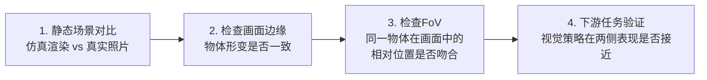
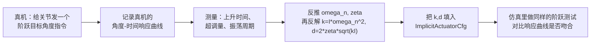

# Isaac Lab 仿真对齐与参数调优：从相机内参到关节 PD 增益

> 上一篇 [URDF 转 USD 完整工程流程详解](./URDF转USD完整工程流程详解) 讲的是"怎么把机器人搬进仿真器"。这篇讲下一步——机器人搬进去之后，仿真器里的相机拍出来的画面、关节动起来的手感，怎么才能和真实机器人对得上。这是 sim-to-real（仿真到真实迁移）能不能成功的地基工作：如果仿真里相机的镜头畸变和真机不一样，视觉策略在仿真里训得再好，部署到真机也会因为"看到的画面几何不一样"而失灵；如果仿真里关节的响应速度和真机不一样，动作策略学到的"发指令后多久能到位"的直觉就是错的。

## 知识链接

**前置知识**：
- [鱼眼相机方案：大视场角与畸变模型](/硬件基础/H09_鱼眼相机方案) — 本文相机对齐部分直接复用这篇讲的内参矩阵、畸变多项式概念
- [电机驱动与控制：位置/速度/力矩模式](/硬件基础/H02_电机驱动与控制) — 本文关节 PD 增益部分是这篇"阻抗控制公式"在 Isaac Lab 里的具体落地
- [Sim-to-Real 迁移综述](/论文综述/S04_Sim_to_Real迁移综述) — 系统辨识、域随机化的方法论全景，本文是"系统辨识"这一环在 Isaac Lab 里的具体工程操作手册

**关联文章**：
- [URDF 转 USD 完整工程流程详解](./URDF转USD完整工程流程详解) — 本文的前置步骤，先把机器人模型转换进仿真器
- [Sim2Real Gap 全景：四类差距与四种策略](/系列/nvidia_real2sim2real_deep_dive/05_Sim2Real_Gap全景_四类差距与四种策略) — 本文聚焦的相机/关节对齐分别对应那篇的 Sensing Gap 和 Actuation Gap
- [策略一二：域随机化与 Co-training](/系列/nvidia_real2sim2real_deep_dive/06_策略一二_域随机化与Co_training) — 本文第 5 节的 EventTerm 域随机化代码风格与那篇一致，可以对照阅读

---

## 0. 贯穿全文的例子

假设你有一台桌面机械臂（6 个关节），腕部装了一颗鱼眼相机，末端做抓取任务。你已经用 [URDF 转 USD 流程](./URDF转USD完整工程流程详解) 把它转换进了 Isaac Lab。现在的问题是：

1. **仿真渲染出来的图像和真实相机拍出来的图像，几何上不一样**——真实鱼眼相机拍出来的桌子边缘是弯的，仿真里如果用默认针孔相机配置，桌子边缘是直的。视觉策略如果只在仿真里训练，学到的"桌子边缘在哪个像素位置"这类几何直觉，部署到真机后会系统性地偏移。
2. **仿真里关节响应的手感和真机不一样**——给定一个目标角度，真机的关节可能 0.15 秒后到位并有轻微振荡，仿真里默认参数可能 0.05 秒瞬间到位、完全没有振荡。动作策略如果在"手感"不对的仿真里训练，学到的"发指令后多久该做下一步动作"的时序直觉是错的。

本文接下来分两条主线：**第一~三节讲相机对齐**（怎么让仿真渲染的画面几何和真实相机一致，其中第二节专门展开鱼眼相机 `FisheyeCameraCfg` 的全部参数），**第四~六节讲关节动力学与物理材质对齐**（怎么让仿真关节的响应手感、接触摩擦和真机一致），第七节讲怎么把对齐参数接入域随机化，第八节总结。

---

## 一、相机对齐：让仿真渲染的几何和真实镜头一致

### 1.1 Isaac Lab 的两种相机配置：针孔 vs 鱼眼

Isaac Lab 的相机传感器（`CameraCfg`）在生成图像时，底层的镜头几何由 `spawn` 字段决定，可以填两种配置类：

```python
from isaaclab.sensors import CameraCfg
from isaaclab.sim import PinholeCameraCfg, FisheyeCameraCfg

# 普通视场角相机：用针孔模型
camera_cfg = CameraCfg(
    prim_path="{ENV_REGEX_NS}/Robot/wrist_camera",
    spawn=PinholeCameraCfg(...),
    width=640, height=480,
    data_types=["rgb"],
)

# 大视场角鱼眼相机：用鱼眼模型
camera_cfg = CameraCfg(
    prim_path="{ENV_REGEX_NS}/Robot/wrist_camera",
    spawn=FisheyeCameraCfg(...),
    width=640, height=480,
    data_types=["rgb"],
)
```

`PinholeCameraCfg` 对应[鱼眼相机文章](/硬件基础/H09_鱼眼相机方案#1.1-针孔相机模型-标准相机的基础)里讲的针孔投影 $r=f\tan\theta$；`FisheyeCameraCfg` 对应那篇讲的等距投影加畸变多项式。如果你的机械臂腕部相机是普通镜头（视场角 < 100°），用 `PinholeCameraCfg` 就够；如果是鱼眼镜头（视场角 > 150°），必须换成 `FisheyeCameraCfg`，否则渲染出来的画面几何和真实鱼眼画面完全不匹配。`FisheyeCameraCfg` 在 Isaac Lab 源码里实际上是 `PinholeCameraCfg` 的子类（继承了一部分通用镜头参数，又新增了一整套鱼眼专属参数），完整的参数定义和填法，见下面第二节的专门讲解。

### 1.2 针孔相机：直接用标定得到的内参矩阵初始化

如果相机是普通针孔镜头,最省事的对齐方式是直接用[标定文章](/硬件基础/H09_鱼眼相机方案#3.-鱼眼相机标定-怎么把参数测出来)里 `cv2.calibrateCamera` 或 OpenCV 标准标定输出的内参矩阵 $K$，让 `PinholeCameraCfg` 直接从这个矩阵构造：

```python
import numpy as np
from isaaclab.sim import PinholeCameraCfg

# 假设这是真实相机标定得到的内参矩阵（cv2.calibrateCamera 的输出）
# K = [[fx,  0, cx],
#      [ 0, fy, cy],
#      [ 0,  0,  1]]
K_real = np.array([
    [615.2, 0.0,   320.5],
    [0.0,   614.8, 240.3],
    [0.0,   0.0,   1.0],
])

pinhole_cfg = PinholeCameraCfg.from_intrinsic_matrix(
    intrinsic_matrix=K_real.flatten().tolist(),  # 展平成长度9的list
    width=640,
    height=480,
    clipping_range=(0.05, 5.0),  # 近/远裁剪距离（米），按实际工作距离设置
)
```

`from_intrinsic_matrix` 内部做的事情是：把 $f_x, f_y$（像素单位的焦距）换算成 Isaac Sim 内部使用的"厘米制传感器孔径"参数（`horizontal_aperture`、`focal_length` 等），这一步换算是 Isaac Lab 帮你做的，不需要手动推导。**唯一要注意的是**：这里传入的 $f_x, f_y, c_x, c_y$ 必须和你设置的 `width`、`height` 对应同一个分辨率——如果标定时用的是 1280×960，但仿真渲染分辨率设成 640×480，要先把内参矩阵按比例缩放（$f_x, f_y, c_x, c_y$ 全部乘以 0.5），否则视场角会对不上。

### 1.3 相机安装位姿的对齐

除了镜头几何，相机在机器人上的**安装位置和朝向**也必须和真机测量一致，否则即便镜头参数完全对齐，拍到的场景视角也会不同。Isaac Lab 用 `CameraCfg.OffsetCfg` 描述相机相对于父坐标系（通常是安装它的那个 link）的偏移：

```python
from isaaclab.sensors import CameraCfg

camera_cfg = CameraCfg(
    prim_path="{ENV_REGEX_NS}/Robot/wrist_link/wrist_camera",
    offset=CameraCfg.OffsetCfg(
        pos=(0.02, 0.0, 0.05),           # 相对腕部link的平移（米），用卷尺/CAD图量出来
        rot=(0.7071, 0.0, 0.7071, 0.0),  # 四元数 (w,x,y,z)
        convention="ros",                # ROS约定：+Z朝前，-Y朝上
    ),
    spawn=fisheye_cfg,
    width=1280, height=960,
)
```

**测量安装位姿的实用方法**：如果没有精确的 CAD 图纸，可以用手眼标定（见[视觉硬件方案](/硬件基础/H08_视觉硬件方案#3.-手眼标定)里讲的 AX=XB 方法或 AprilTag 快速标定）反推出相机相对末端法兰的精确变换，再换算到相对于 URDF 中对应 link 的偏移。

---

## 二、鱼眼相机参数详解：`FisheyeCameraCfg` 的每一个字段

上一节只给了一个"填几个系数就能用"的示例，但如果只会抄示例、不知道每个字段实际在控制什么，遇到真实标定数据时就不知道该往哪填、填错了也看不出来。这一节把 `FisheyeCameraCfg`（Isaac Lab v2.x，[源码见此](https://github.com/isaac-sim/IsaacLab/blob/main/source/isaaclab/isaaclab/sim/spawners/sensors/sensors_cfg.py)）的**全部字段**从最基础的几何直觉开始，一个概念一个概念地讲透，最后再用表格总结方便查阅。

### 2.1 先建立最基础的图像：一条光线怎么变成一个像素

在看任何字段之前，先搞清楚鱼眼相机到底在算什么。一颗相机镜头面对的问题很简单：外面有无数条光线从各个角度射向镜头，镜头要把每一条光线"分配"到传感器上的某一个位置——这个分配规则，就是整套 `FisheyeCameraCfg` 参数最终要描述的东西。


> 图中三条彩色光线代表三个不同的入射角 $\theta$：红色沿光轴方向（$\theta=0$）直接射进镜头正中心；绿色和蓝色分别以更大的角度斜射进来。镜头把每条光线"折"向传感器，光线的入射角越大，最终落点距离传感器中心（图中标为像面中点）也越远——这个"角度越大、落点越远"的对应关系，就是后面所有参数要精确刻画的对象。**留意红色那条光线**：它沿光轴方向入射，落点正好在传感器的几何中心，这个点有一个专门的名字，也是下一节要讲的第一个核心概念。

从这张图能读出两件事：
1. **每条光线只由一个数字决定它的落点**：入射角 $\theta$。方向（从上方射入还是下方射入）不影响落点离中心的**距离**，只影响落点在哪个方位角上——因为镜头是绕光轴旋转对称的（这也是"鱼眼"这个词的几何本质：镀膜曲面是一个旋转体）。
2. **距离和角度之间有一条函数关系**：把落点到中心的距离记作 $r$，那么 $r$ 就是 $\theta$ 的某个函数 $r=r(\theta)$——这个函数的具体形状，就是一颗镜头的"畸变指纹"，也是 `FisheyeCameraCfg` 绝大多数字段真正要描述的东西。

### 2.2 有效成像圆：先有中心，再有半径

只用一条光线看不出规律，把上一节的示意图换成"扫过所有角度"的视角，就能看出更完整的结构。

沿着光轴方向入射（$\theta=0$）的那条光线，落点是所有光线里唯一"特殊"的一个——它不偏向任何方向，直接落在传感器几何中心的正上方（或者说，落在镜头光轴和像面的交点上）。这个点就叫**有效成像圆中心（Image Circle Center）**，在 `FisheyeCameraCfg` 里对应 `fisheye_optical_centre_x`、`fisheye_optical_centre_y` 两个字段——它就是标定学里说的"主点"，只是这里从几何角度换了个更直观的名字。

接下来把入射角从 0 一直增大，增大到镜头物理上还能接收的最大角度（这个最大角度就是 `fisheye_max_fov` 的一半，因为视场角是从中心向两侧对称展开的）。每一个角度对应的落点，都会绕着刚才那个中心画出一个圆——把所有角度扫一遍，这些圆一层层叠起来，刚好铺满一个完整的圆盘。这个圆盘就叫**有效成像圆（Effective Image Circle）**：圆盘内是镜头真正能接收光线成像的区域，圆盘外没有任何光线能到达，画面上表现为纯黑的暗角。


> 白色圆盘就是有效成像圆，圆心（红点）就是上一段说的有效成像圆中心。圆的半径叫**有效成像圆半径（Image Circle Radius）**，记作 $r_{\max}$——它就是把最大入射角 $\theta_{\max}=\text{fisheye\_max\_fov}/2$ 代入 $r(\theta)$ 算出来的那个值，也就是"扫到最大角度时，光线最远能落到多远"。深色区域是传感器矩形里落在圆外的部分，没有任何入射光线能到达，这正是很多鱼眼照片带黑色圆形边框的原因。图中有效成像圆完全被包在传感器矩形内部，这是最常见的情况（镜头成像圆比传感器小）；反过来如果传感器比成像圆还小，画面就会完全没有黑边，只是视场角被传感器边界"裁掉"了一部分。

**这两个概念在工程上有什么用**：想知道一张鱼眼画面里哪些像素是"真实光学信息"、哪些是纯暗角废像素，只要算一下当前像素到 `(fisheye_optical_centre_x, fisheye_optical_centre_y)` 的距离，跟 $r_{\max}$ 比一下——超出就是暗角。给策略网络喂图像之前，可以按这个规则裁掉四周的无效黑边，省下模型算力去处理没有任何信息的像素；反过来，如果标定/配置出来的 $r_{\max}$ 明显偏小，画面上会出现一圈异常大的黑边，这也是快速判断"参数是不是填错了"的直观依据。

### 2.3 $r(\theta)$ 具体是什么函数：从最简单的直线开始

上面两节都在说"存在一个函数 $r(\theta)$"，现在看这个函数具体长什么样。Isaac Lab 官方文档没有把公式写全，但从源码和 NVIDIA F-Theta 系列文档可以确认：`fisheye_polynomial_a` 到 `fisheye_polynomial_f` 这六个字段，就是这个函数按幂次展开后，从低阶到高阶依次排列的系数——

$$
r(\theta) = a + b\theta + c\theta^2 + d\theta^3 + e\theta^4 + f\theta^5
$$

**这个公式在做什么**：给定一条光线相对镜头光轴的夹角 $\theta$，算出它最终落在像面上、距离主点多远——这条曲线的形状就是整颗鱼眼镜头的畸变特征，6 个系数就是这条曲线的"配方"。

::: details 📐 公式详解（点击展开）

| 子表达式 | 它是谁 | 它在干嘛 |
|---------|--------|---------|
| $\theta$ | **入射角** | 一条光线相对镜头光轴的夹角，是输入 |
| $a$（`fisheye_polynomial_a`） | **常数偏移** | $\theta=0$ 时的基础偏移，绝大多数真实镜头这一项应该是 0（光轴中心不该有偏移） |
| $b\theta$（`fisheye_polynomial_b`） | **主导项** | 系数 $b$ 相当于等距投影里的焦距 $f$——**只有这一项非零时，公式退化成 $r=b\theta$，就是等距投影**，这也是为什么 Isaac Lab 默认只有 `poly_b` 非零 |
| $c\theta^2, d\theta^3, \ldots$（`fisheye_polynomial_c~f`） | **畸变修正项** | 高阶项负责描述真实镜头相对理想等距投影的"额外弯曲"——正值让画面边缘的角度间距变大（枕形趋势），负值让边缘角度间距变小（桶形趋势，鱼眼镜头最常见的形态） |
| $r$ | **像面距离** | 光线最终落在传感器上、距主点的距离，是输出 |

**用人话读**："给一个入射角，多项式吐出它该落在像面多远的地方——最主要的一项是线性关系（等距投影），其余几项负责修正真实镜头和理想等距投影之间的偏差。"

**为什么用多项式而不是像 Kannala-Brandt 那样只用偶数次幂**：NVIDIA 的 F-Theta 模型允许奇偶次幂都出现（Kannala-Brandt 标准形式则只保留 $\theta,\theta^3,\theta^5,\theta^7,\theta^9$ 奇次幂），多一些自由度理论上能拟合更不对称的畸变形态，但代价是**标定时更容易过拟合**——如果你的标定数据来自[标定文章](/硬件基础/H09_鱼眼相机方案#3.-鱼眼相机标定-怎么把参数测出来)里的 `cv2.fisheye.calibrate`（输出严格的奇次幂 Kannala-Brandt 系数 $k_1\sim k_4$），最稳妥的做法不是手动"对应换算"到 `poly_a~f`，而是直接选 `fisheyeKannalaBrandtK3` 投影类型（第 2.5 节），让 Isaac Sim 用原生支持 Kannala-Brandt 公式的渲染路径，避免手工换算引入误差。
:::

**先只看一个系数**：如果其余系数全部为零，只有 `fisheye_polynomial_b` 非零，公式直接退化成 $r=b\theta$——一条经过原点的直线。这就是最简单、最理想的情况，叫"等距投影"（equidistant，即角度和像面距离严格成正比），也正是 Isaac Lab 给出的默认参数组合。


> 三条直线都只有 `poly_b` 非零，区别只是斜率不同。$b$ 越大，同样的入射角对应的像面距离越远——这意味着镜头把"角度差异"放大得更明显，也就是同样的传感器尺寸能容纳的最大视场角更小（因为角度稍微增大一点，$r$ 就冲出传感器边界了）；反过来 $b$ 越小，同样的传感器尺寸能塞进更大的视场角。这解释了为什么系数 $b$ 常被类比成等距投影里的"焦距"——它控制的正是"角度换算成像面距离"的比例尺。

真实镜头几乎不会是一条完美直线，还需要更高阶的项去修正边缘的额外弯曲：


> 蓝色曲线只有 `poly_b` 非零（上图的默认直线）。绿色曲线在此基础上加了一个正的三次项 `poly_d`，边缘角度对应的像面距离比理想直线更大——这会让画面边缘的物体看起来比等距投影下更大（枕形趋势）。红色曲线加了一个负的三次项，边缘角度对应的像面距离比理想直线更小——画面边缘被"压缩"，这正是[鱼眼相机方案第 2.1 节](/硬件基础/H09_鱼眼相机方案#2.1-理想模型不够用-还需要畸变多项式)里讲的桶形畸变（Barrel Distortion）在 Isaac Lab 参数上的体现。三条曲线在 $\theta=0$ 附近几乎重合，说明高阶系数只在大角度（画面边缘）才会显著影响成像，这也解释了[标定文章](/硬件基础/H09_鱼眼相机方案#3.2-标定流程)反复强调"标定板必须覆盖画面边缘"的原因——边缘角度的数据点才能有效约束这些高阶系数。

### 2.4 继承自 `PinholeCameraCfg` 的通用字段：为什么大多数可以不管

除了 2.2~2.3 节的鱼眼专属字段，`FisheyeCameraCfg` 在 Isaac Lab 源码里直接继承了 `PinholeCameraCfg`，所以还带着一整套"胶片/传感器"参数——`projection_type`、`clipping_range`、`focal_length`、`focus_distance`、`f_stop`、`horizontal_aperture`、`vertical_aperture`、`horizontal_aperture_offset`/`vertical_aperture_offset`、`lock_camera`。

**这里最容易搞混的一点**：`focal_length`、`horizontal_aperture` 这些字段是**针孔相机的镀膜镜片参数**，理论上决定视场角（就是[针孔相机文章](/硬件基础/H09_鱼眼相机方案#1.1-针孔相机模型-标准相机的基础)里讲的 $r=f\tan\theta$ 那套关系）。但一旦 `projection_type` 换成鱼眼模式，渲染器实际计算像面位置时走的是 2.3 节的多项式公式，`focal_length`/`horizontal_aperture` 这两个字段基本可以保留默认值不用管——真正决定畸变形态的，是 2.2~2.3 节讲的那组鱼眼专属字段。`clipping_range`（近/远裁剪距离）和 `lock_camera`（是否锁定视口位置）这两个则和投影类型无关，鱼眼和针孔相机都要设置，用法参照第一节的针孔示例即可。

### 2.5 `projection_type`：同一组系数换个模型，曲线形状完全不同

2.3 节的公式只是五套可选模型里的一套（对应 `projection_type="fisheyePolynomial"`）。Isaac Lab 实际支持五种取值，各自对应 NVIDIA RTX 渲染器内部完全不同的数学模型：

```python
projection_type: Literal[
    "fisheyePolynomial",         # 默认：F-Theta 多项式模型（第 2.3 节的公式）
    "fisheyeSpherical",          # 360° 全画幅球面投影
    "fisheyeKannalaBrandtK3",    # Kannala-Brandt K3 畸变模型
    "fisheyeRadTanThinPrism",    # 径向+切向+薄棱镜畸变模型
    "omniDirectionalStereo",     # 360° 立体全景（VR/ODS）
] = "fisheyePolynomial"
```

为什么要区分这么多模型：不同标定工具输出的系数，本质上遵循不同的 $r(\theta)$ 函数结构——同一组数字，代入不同结构的公式，算出来的曲线完全不是一回事。


> 三条曲线用的是形式相近但结构不同的公式（示意，非某一具体标定结果）：蓝色是 `fisheyePolynomial` 的多项式结构，接近一条直线；绿色是 `fisheyeKannalaBrandtK3` 的纯奇次幂结构，边缘处上扬更明显；红色是 `fisheyeRadTanThinPrism` 混入了偶次项，曲线形态又不一样。**关键在于**：如果标定工具输出的是绿色这条曲线对应的系数，却被错误地填进了蓝色模型的字段里，渲染器会拿着这组数字去算出一条介于两者之间、哪个都不对的曲线——画面边缘的畸变形态就会和真实镜头系统性地不一致。这正是本文开头[鱼眼相机方案](/硬件基础/H09_鱼眼相机方案#1.2.2-视场角-fov-到底取决于什么)里讲的核心结论在这里的体现：**FOV 从来不是一个独立参数，它是"投影模型 + 像面尺寸"共同算出来的结果**——选对模型和填对系数缺一不可。

**选型的实用判断**：如果标定数据来自[标定文章](/硬件基础/H09_鱼眼相机方案#3.-鱼眼相机标定-怎么把参数测出来)里的 `cv2.fisheye.calibrate`（输出 Kannala-Brandt 系数 $k_1,k_2,k_3,k_4$），优先选 `fisheyeKannalaBrandtK3` 而不是默认的 `fisheyePolynomial`——两者公式结构不同，`fisheyeKannalaBrandtK3` 的系数命名和排列顺序与 OpenCV 输出直接对应，不需要"近似换算"，对齐精度更高。只有当标定数据来源不明确、或者厂商规格书里直接给的是"F-Theta 系数"时，才用默认的 `fisheyePolynomial`。`fisheyeRadTanThinPrism` 用于装配倾斜导致畸变不是纯旋转对称的情况；`fisheyeSpherical`/`omniDirectionalStereo` 分别对应超过普通鱼眼视场角的全景相机和 VR 双目全景相机，机器人视觉任务基本不会用到。

### 2.6 把 2.1~2.5 节串起来：完整字段一览表

前面五节从"一条光线"讲到"选哪个投影模型"，现在用表格把所有字段总结一遍，方便实际写配置时查阅：

| 字段分组 | 字段 | 类型 | 默认值 | 对应本文哪一节 |
|---------|------|------|--------|---------------|
| 继承自 `PinholeCameraCfg` | `projection_type` | `Literal[...]` | `"fisheyePolynomial"` | 2.5 |
| | `clipping_range` | `tuple[float, float]` | `(0.01, 1e6)` | 2.4 |
| | `focal_length` | `float` | `24.0` | 2.4（鱼眼模式下基本不用管） |
| | `focus_distance` | `float` | `400.0` | 2.4 |
| | `f_stop` | `float` | `0.0` | 2.4 |
| | `horizontal_aperture` | `float` | `20.955` | 2.4（鱼眼模式下基本不用管） |
| | `vertical_aperture` | `float \| None` | `None` | 2.4 |
| | `horizontal/vertical_aperture_offset` | `float` | `0.0` | 2.4（当前版本不支持，设非零会被忽略） |
| | `lock_camera` | `bool` | `True` | 2.4 |
| 有效成像圆 | `fisheye_optical_centre_x/y` | `float` | `970.94244` / `600.37482` | 2.2（有效成像圆中心） |
| | `fisheye_max_fov` | `float` | `200.0` | 2.2（决定有效成像圆半径） |
| 标定分辨率 | `fisheye_nominal_width/height` | `float` | `1936.0` / `1216.0` | 2.2 |
| 畸变多项式 | `fisheye_polynomial_a~f` | `float` | `0.0, 0.00245, 0, 0, 0, 0` | 2.3 |

**这些字段的默认值不是随便设的**：Isaac Lab 源码注释写明这组默认值取自 Omniverse Replicator 相机函数的默认参数——也就是说，如果什么都不改直接用 `FisheyeCameraCfg()`，得到的是 Replicator 内置的一颗"参考鱼眼镜头"（标定分辨率 1936×1216，仅 `poly_b` 非零、其余系数为零），并不对应任何真实存在的相机，必须把标定得到的真实系数填进去才能用于对齐。

### 2.7 一个完整示例：把 OpenCV 鱼眼标定结果填成 Isaac Lab 配置

把前面几节的字段串起来，一个从真实标定数据出发的完整配置大致是这样：

```python
from isaaclab.sim import FisheyeCameraCfg

# 假设 cv2.fisheye.calibrate 在 1280x960 分辨率下标定出：
# K = [[615.2, 0, 642.1], [0, 614.8, 478.6], [0, 0, 1]]
# D = [k1, k2, k3, k4] = [0.021, -0.004, 0.0006, -0.00002]
fisheye_cfg = FisheyeCameraCfg(
    projection_type="fisheyeKannalaBrandtK3",  # 标定数据来自OpenCV鱼眼标定，选原生支持该模型的投影类型
    clipping_range=(0.05, 5.0),
    fisheye_nominal_width=1280.0,       # 标定时使用的图像宽度（像素），不是仿真渲染分辨率
    fisheye_nominal_height=960.0,       # 标定时使用的图像高度（像素）
    fisheye_optical_centre_x=642.1,     # 标定得到的主点 cx（像素）
    fisheye_optical_centre_y=478.6,     # 标定得到的主点 cy（像素）
    fisheye_max_fov=185.0,              # 镜头标称最大视场角（度）
    fisheye_polynomial_a=0.021,         # 对应 k1
    fisheye_polynomial_b=-0.004,        # 对应 k2
    fisheye_polynomial_c=0.0006,        # 对应 k3
    fisheye_polynomial_d=-0.00002,      # 对应 k4
    fisheye_polynomial_e=0.0,
    fisheye_polynomial_f=0.0,
)
```

**这里的关键点**：`projection_type` 选了 `fisheyeKannalaBrandtK3`，`fisheye_polynomial_a~d` 直接填 OpenCV 标定输出的 $k_1\sim k_4$（不需要像默认的 `fisheyePolynomial` 那样做单位或阶数上的近似换算），`fisheye_polynomial_a` 也不再默认留 0——因为 Kannala-Brandt 模型的系数排列和 F-Theta 排列语义不同，`poly_a` 在这里对应 $k_1$ 而不是"常数偏移项"。**填参数前一定要先确认当前选的 `projection_type`，再确定 6 个多项式系数分别对应标定输出的哪个符号**，两者对不上是鱼眼相机对齐失败最常见的原因。

---

## 三、验证相机对齐：渐进式检查流程

参数填对了不代表真的对齐了——下面这个检查流程能帮你及时发现问题，而不是等到策略部署失败才回头排查。



1. **静态场景对比**：把仿真中的场景尽量布置成和真实拍摄场景一致的几何（同样的物体、同样的相对距离），截取仿真渲染图和真实照片并排比较——重点看物体的相对大小和形变模式是否相似。
2. **检查画面边缘**：鱼眼相机对齐是否正确，最容易在画面边缘暴露问题——如果真实照片里画面边缘的直线（比如桌子边缘）弯曲程度和仿真渲染的弯曲程度明显不同，说明畸变系数或 `fisheye_max_fov` 没对齐。
3. **检查视场角**：把一个已知尺寸的物体放在已知距离处，检查它在仿真图像和真实图像中占据的像素比例是否接近——如果仿真中物体明显偏大或偏小，通常是焦距（内参 $f_x,f_y$ 或 `fisheye_nominal_width/height`）填错了。
4. **下游任务验证**：最终的验证标准是"用仿真训练的视觉策略，直接跑在真实相机画面上，表现是否明显下降"——如果前三步都对齐了但表现依然差很多，说明还有本文没覆盖的其他 gap（光照、材质、噪声等，见 [Sim2Real Gap 全景](/系列/nvidia_real2sim2real_deep_dive/05_Sim2Real_Gap全景_四类差距与四种策略)）。

---

## 四、关节动力学对齐：让仿真关节的"手感"和真机一致

### 4.1 Isaac Lab 关节控制的本质：隐式 PD 控制器

Isaac Lab 中最常用的驱动器配置是 `ImplicitActuatorCfg`——它让 PhysX 物理引擎内部直接计算 PD（比例-微分）控制，不需要你在 Python 层每一步手动算力矩。它的核心参数只有五个：

```python
from isaaclab.actuators import ImplicitActuatorCfg

arm_actuator_cfg = ImplicitActuatorCfg(
    joint_names_expr=["joint_[1-6]"],   # 匹配6个手臂关节
    stiffness=400.0,                     # kp：位置刚度
    damping=40.0,                        # kd：速度阻尼
    armature=0.01,                       # 电机转子等效惯量
    friction=0.05,                       # 关节摩擦力矩
    effort_limit=87.0,                   # 最大力矩 (N·m)
    velocity_limit=2.5,                  # 最大角速度 (rad/s)
)
```

这五个参数和[电机驱动与控制](/硬件基础/H02_电机驱动与控制#3.3-力矩模式-torque-/-current-mode)里讲过的阻抗控制公式 $\tau = K_p(\theta^*-\theta) + K_d(\dot\theta^*-\dot\theta)$ 是同一套东西——`stiffness` 就是 $K_p$，`damping` 就是 $K_d$，只是在 Isaac Lab 里这个 PD 计算被下沉到了 PhysX 底层，每个仿真步（`dt`，见第六节）自动执行一次，不需要在策略代码里手写。

### 4.2 用二阶系统的阶跃响应理解 stiffness/damping 的物理含义

单个关节在给定目标角度后怎么运动过去，可以近似看作一个二阶弹簧-阻尼系统：

$$
I\ddot\theta + d\dot\theta + k(\theta - \theta^*) = 0
$$

**这个公式在做什么**：描述关节角度 $\theta$ 在 PD 控制下如何随时间趋近目标角度 $\theta^*$——这正是判断 stiffness/damping 该调多"硬"或多"软"的理论依据。

::: details 📐 公式详解（点击展开）

| 子表达式 | 它是谁 | 它在干嘛 |
|---------|--------|---------|
| $I\ddot\theta$ | **惯性阻力** | 关节角加速度乘以有效惯量（armature+连杆惯量），"转得越快改变方向越难" |
| $d\dot\theta$ | **阻尼力** | 正比于角速度，永远和运动方向相反，负责"刹车"防止振荡 |
| $k(\theta-\theta^*)$ | **回复力** | 正比于偏离目标的角度，负责把关节"拉回"目标位置 |
| $I, d, k$ | **系统三要素** | 惯量、阻尼(`damping`)、刚度(`stiffness`)——三者的相对大小决定了响应快慢和是否振荡 |

**用人话读**："关节的运动 = 被回复力拉向目标 - 被阻尼力刹车 - 被自身惯性拖慢，三者平衡的结果决定了它多快到位、会不会来回摆。"

**为什么是这个形式**：这是标准的二阶线性微分方程，机械系统（弹簧-质量-阻尼）、电路系统（RLC）都遵循同一个数学形式，是控制理论里最基础的模型。
:::

由这个方程可以定义两个关键的诊断量——**自然频率** $\omega_n=\sqrt{k/I}$（决定"没有阻尼时关节自己振荡多快"）和**阻尼比** $\zeta = d/(2\sqrt{kI})$（决定"响应是振荡的还是平滑的"）。$\zeta<1$ 时响应会振铃（欠阻尼）,$\zeta=1$ 时最快无振铃到位（临界阻尼），$\zeta>1$ 时响应平滑但迟钝（过阻尼）。


> 上图对比了四组 (stiffness, damping) 参数在给定阶跃目标角度后的响应曲线。红色曲线（$\zeta=0.05$）严重欠阻尼，会明显振铃——这是真实关节几乎不会出现的行为，如果仿真里关节振铃严重，通常是 damping 设得太小。蓝色曲线是临界阻尼（$\zeta\approx1$），响应最快且不振铃，是很多 RL 训练时刻意选择的"理想"配置，但可能比真实关节的手感更"硬"。橙色曲线（低 stiffness、较高阻尼比）更接近真实机械臂的柔顺手感——这正是做 sim-to-real 对齐时，通常需要把默认的高刚度配置调低、让仿真关节"变软"来匹配真机的原因。

### 4.3 系统辨识：用真机阶跃响应反推 stiffness/damping

对齐关节动力学的标准做法，是[Sim-to-Real 综述](/论文综述/S04_Sim_to_Real迁移综述#3.-系统辨识-system-identification)里讲的系统辨识思路的具体应用：



**具体测量步骤**：
1. 让真机关节从静止状态突然接收一个新的目标角度指令（阶跃输入），用编码器记录角度随时间变化的曲线
2. 从曲线上读出**上升时间**（从 10% 到 90% 目标角度所需时间）和**超调量**（响应曲线超过目标角度的最大百分比）
3. 用标准二阶系统公式，从超调量反推阻尼比 $\zeta$，从上升时间反推自然频率 $\omega_n$（这两个反推公式在控制理论教材里有标准表格，此处从略，重点是理解"测出来的曲线形状唯一决定了一组 $(\omega_n,\zeta)$"）
4. 已知关节的有效惯量 $I$（可以从 URDF 的 `<inertial>` 标签估算，或者直接查电机规格书），反解出 $k=I\omega_n^2$、$d=2\zeta\sqrt{kI}$
5. 把反解出的 $k,d$ 填入 `stiffness`、`damping`，在仿真里对同一个关节做同样的阶跃测试，对比两条曲线是否吻合

**这个流程和 [ASAP](/论文综述/116_ASAP_对齐仿真与真实物理的Delta动作模型) 等论文提到的"系统辨识"本质上是同一件事**——只是 ASAP 处理的是人形机器人这种高维强耦合系统,单个关节的阶跃响应辨识已经不够,需要额外学习动作层面的残差修正;而对于机械臂这种耦合较弱的系统,逐关节做阶跃响应辨识通常已经足够接近真机行为。

### 4.4 armature 和 friction：容易被忽视但影响很大的两个参数

- **`armature`**（电机转子等效惯量）：模拟电机转子本身的转动惯量。这个值不是"物理上完全正确"才重要，而是**数值稳定性**的关键——`armature` 太小时，高 `stiffness` 会导致仿真步之间的数值振荡（哪怕理论上系统是临界阻尼，离散时间步的数值误差也会引入额外的高频抖动）。经验法则：`armature` 大约取 `stiffness` 对应惯量的 1%~10%，太大会让关节响应变得迟钝。
- **`friction`**（关节摩擦力矩）：真机的关节几乎都有静摩擦——启动瞬间需要克服一个门槛力矩才会开始转动。仿真里默认 `friction=0` 会让关节"太丝滑"，尤其是在需要精细力控的任务里（如插拔、装配），这个差异会导致仿真训练出的策略在真机上因为摩擦力矩的存在而"差一点点力气"完不成动作。

---

## 五、物理材质对齐：摩擦系数和弹性系数

除了关节本身，机器人和环境物体之间的接触行为（抓取时手指和物体表面的摩擦、放置时物体和桌面的碰撞恢复）也需要对齐。Isaac Lab 用 `RigidBodyMaterialCfg` 描述这些参数：

```python
from isaaclab.sim import RigidBodyMaterialCfg

gripper_material_cfg = RigidBodyMaterialCfg(
    static_friction=0.9,           # 静摩擦系数：物体开始滑动前的阈值
    dynamic_friction=0.7,          # 动摩擦系数：物体已经在滑动时的阻力
    restitution=0.0,               # 弹性恢复系数：0=完全不反弹，1=完全弹性碰撞
    friction_combine_mode="average",     # 两个材质接触时怎么合并摩擦系数
    restitution_combine_mode="average",  # 怎么合并弹性系数
)
```

`friction_combine_mode` 有四个可选值——`"average"`（取平均，PhysX 默认）、`"min"`、`"max"`、`"multiply"`。**这个参数容易被忽略但影响不小**：如果夹爪材质设了摩擦系数 0.9，但桌面材质留着 PhysX 默认的 0.5，两者接触时最终生效的摩擦系数由 `combine_mode` 决定，不是简单地"取夹爪的 0.9"。做抓取任务的物理对齐时，需要同时检查两个接触面各自的材质设置和合并模式，否则容易出现"改了参数但仿真行为没变化"的困惑。

**测量真实摩擦系数的简易方法**：把待抓取物体放在和夹爪相同材质的斜面上，缓慢增大倾角直到物体开始滑动，记录临界角度 $\alpha$，静摩擦系数 $\mu_s \approx \tan\alpha$——这是最简单的斜面法，精度足够支撑仿真参数对齐（不需要专业摩擦系数测量仪）。

---

## 六、仿真步长与求解器精度：容易被忽视的对齐维度

前面讲的都是"某个物理量的取值"，但仿真本身的**离散化精度**同样影响手感是否真实。`SimulationCfg` 里两个最关键的参数：

```python
from isaaclab.sim import SimulationCfg, PhysxCfg

sim_cfg = SimulationCfg(
    dt=1.0 / 200.0,          # 物理仿真步长：200 Hz
    render_interval=4,        # 每4个物理步渲染1次画面（渲染频率=200/4=50Hz）
    physx=PhysxCfg(
        solver_type=1,                        # 1=TGS求解器（默认，精度更高）
        min_position_iteration_count=4,       # 提高位置迭代次数，减少关节抖动
        bounce_threshold_velocity=0.2,        # 低于此速度的碰撞不产生反弹
    ),
)
```

**`dt`（物理步长）为什么重要**：`dt` 太大（比如默认的 1/60 秒），高 `stiffness` 关节在仿真里会因为离散化误差产生数值振荡——这不是关节动力学参数本身的问题，而是"用大步长模拟一个响应很快的系统"导致的伪影。经验法则：如果对齐好的 `stiffness` 让 $\omega_n$ 很大（关节响应很快），就需要相应减小 `dt`（增大物理仿真频率），一般要求 $\omega_n \cdot dt < 0.3$ 左右才能保证数值稳定。

**`render_interval` 的作用**：物理仿真频率和图像渲染频率不需要相同——通常物理需要 100~200 Hz 才稳定，但视觉策略的推理频率可能只需要 10~30 Hz。`render_interval=4` 表示每 4 个物理步渲染一次画面，这样既保证了物理仿真的精度，又不会为不需要的高频渲染浪费计算资源。

---

## 七、把对齐参数接入域随机化：不是"猜准一个值"而是"猜准一个范围"

单点对齐（辨识出一组"最准确"的参数）永远有残余误差——真实机器人有个体差异、随时间老化、温度漂移等因素。工程实践中通常把辨识出来的参数当作**中心值**，再在中心值附近做小范围域随机化,这正是[Sim-to-Real 综述](/论文综述/S04_Sim_to_Real迁移综述#3.5-辨识-+-随机化的结合)提到的"先辨识、再窄范围随机化"的具体实现：

```python
from isaaclab.envs.mdp import events
from isaaclab.managers import EventTermCfg as EventTerm
from isaaclab.managers import SceneEntityCfg

# 在辨识出的中心值附近做 ±15% 的随机化，而不是从零开始盲猜大范围
randomize_arm_gains = EventTerm(
    func=events.randomize_actuator_gains,
    mode="reset",  # 每次环境reset时重新采样一次
    params={
        "asset_cfg": SceneEntityCfg("robot", joint_names=["joint_[1-6]"]),
        "stiffness_distribution_params": (340.0, 460.0),  # 中心值400，±15%
        "damping_distribution_params": (34.0, 46.0),       # 中心值40，±15%
        "operation": "abs",
        "distribution": "uniform",
    },
)

randomize_gripper_friction = EventTerm(
    func=events.randomize_rigid_body_material,
    mode="startup",  # 只在环境初始化时采样一次（PhysX材质数量有64000上限）
    params={
        "asset_cfg": SceneEntityCfg("gripper"),
        "static_friction_range": (0.75, 1.0),     # 中心值0.9附近
        "dynamic_friction_range": (0.6, 0.8),
        "restitution_range": (0.0, 0.05),
        "num_buckets": 64,
        "make_consistent": True,  # 保证动摩擦 <= 静摩擦，符合物理约束
    },
)
```

**两个 `mode` 的区别**：`randomize_actuator_gains` 用 `mode="reset"`，每个训练 episode 开始时都重新采样一次刚度阻尼，让策略见过一定范围内的关节手感差异；`randomize_rigid_body_material` 用 `mode="startup"`，只在整个训练开始时采样一次材质库（因为 PhysX 场景里物理材质总数有 64000 个的硬上限，如果每个 episode 都创建新材质会很快耗尽）。这个区别是 Isaac Lab 的工程约束，写随机化配置时要注意选对 `mode`，否则可能在长时间训练后触发材质数量溢出的报错。

---

## 八、总结

| 对齐维度 | 关键参数 | Isaac Lab 配置类 | 对齐方法 |
|---------|---------|------------------|---------|
| 相机镜头几何（针孔） | $f_x,f_y,c_x,c_y$ | `PinholeCameraCfg.from_intrinsic_matrix` | OpenCV `cv2.calibrateCamera` 标定 |
| 相机镜头几何（鱼眼） | 畸变多项式系数 | `FisheyeCameraCfg` | OpenCV `cv2.fisheye.calibrate` 标定 |
| 相机安装位姿 | `pos`, `rot` | `CameraCfg.OffsetCfg` | 手眼标定或CAD测量 |
| 关节动力学 | `stiffness`, `damping`, `armature`, `friction` | `ImplicitActuatorCfg` | 真机阶跃响应测试反推 |
| 接触材质 | `static_friction`, `dynamic_friction`, `restitution` | `RigidBodyMaterialCfg` | 斜面法测摩擦系数 |
| 仿真离散化 | `dt`, `render_interval`, 求解器迭代次数 | `SimulationCfg`, `PhysxCfg` | 根据关节响应频率反推所需步长 |
| 残余误差覆盖 | 各参数的随机化范围 | `EventTermCfg` + `mdp.events.*` | 中心值±10~20%的窄范围随机化 |

**核心原则贯穿全文**：先测量真机、反推出一组"最接近真实"的中心参数（系统辨识），再在中心值附近做窄范围随机化覆盖残余误差（域随机化），而不是从一个凭感觉设的默认值直接开始训练，也不是一开始就用没有先验依据的大范围随机化去"赌"策略能自己学出鲁棒性。

---

## 延伸阅读

- [鱼眼相机方案：大视场角与畸变模型](/硬件基础/H09_鱼眼相机方案) — 相机对齐部分的硬件原理基础
- [电机驱动与控制：位置/速度/力矩模式](/硬件基础/H02_电机驱动与控制) — 关节 PD 增益的硬件与控制原理基础
- [URDF 转 USD 完整工程流程详解](./URDF转USD完整工程流程详解) — 本文的前置步骤
- [Sim-to-Real 迁移综述](/论文综述/S04_Sim_to_Real迁移综述) — 系统辨识与域随机化的完整方法论
- [Sim2Real Gap 全景：四类差距与四种策略](/系列/nvidia_real2sim2real_deep_dive/05_Sim2Real_Gap全景_四类差距与四种策略) — 本文的相机/关节对齐分别对应 Sensing Gap 与 Actuation Gap
- [ASAP：对齐仿真与真实物理的 Delta 动作模型](/论文综述/116_ASAP_对齐仿真与真实物理的Delta动作模型) — 当逐关节系统辨识不够用时，更精细的动作层面残差补偿方案
