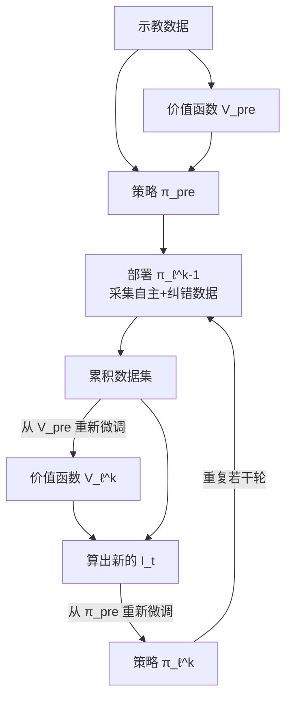

# RECAP 工程实践：训练流程、数据管道与 Loss 实现

## 相关阅读

本文是 [RECAP：从真实部署经验中 RL 学习](/论文综述/016_RECAP_从真实部署经验中RL学习) 的配套工程篇，只讲"具体怎么落地"，不重复原理篇已经讲过的公式推导。建议先读完原理篇，再看本文。

- [RECAP 精读（原理篇）](/论文综述/016_RECAP_从真实部署经验中RL学习) — 讲清楚"为什么这样设计"
- [Advantage Conditioning：优势条件化策略提取](/前置知识/002r_前置知识_Advantage_Conditioning优势条件化策略提取) — 本文反复用到的 $V\to A\to I_t$ 链路的数学基础
- [分布式值函数与类别化回报预测](/前置知识/002q_前置知识_分布式值函数与类别化回报预测) — 价值函数训练的通用原理
- [Flow Matching 与连续归一化流](/前置知识/000g_前置知识_Flow_Matching与连续归一化流) — π0.6 动作头训练所依赖的生成范式

---

## 〇、本文要用到的三个概念，独立讲一遍

下面的流程会反复出现三个符号：价值函数 $V(s)$、优势 $A(s,a)$、改进指示符 $I_t$。这三者的关系是一条单向的加工链路，不依赖任何公式推导，先记住这条链路，后面看伪代码就不会迷路：

| 名称 | 是什么类型的量 | 一句话 |
|------|--------------|--------|
| 价值函数 $V(s)$ | 一个训练出来的网络，输出一个连续数值 | 给定当前观测，预测"大概还要多少步才能完成任务"（归一化成负数，越接近 0 说明越快要成功） |
| 优势 $A(s,a)$ | 一个连续数值（不是网络，是算出来的） | "这一步动作之后，局面变好了多少"——用 $V$ 在往前展开若干步之后的值，减去当前的 $V$，算出来的差值 |
| 改进指示符 $I_t$ | 一个二值标签，只有 True/False 两种取值 | 把上面那个连续的 $A$ 值，拿去跟一个阈值比一比："够不够好"，够格就是 True，不够格就是 False |

$$
\text{价值函数 } V(s) \ \longrightarrow\ \text{算出连续的优势 } A(s,a) \ \longrightarrow\ \text{和阈值比较，二值化成 } I_t
$$

具体走一遍数字：假设价值函数告诉你，当前状态 $V=-10$，往前 3 步之后那个状态 $V=-5$，这 3 步真实拿到的奖励加起来是 $-3$，那么优势就是 $A=(-3+(-5))-(-10)=2$——这一步动作让局面比"平均水平"好了 2 分，是个正数。接着设定一个阈值，比如 $\epsilon=0.5$，因为 $2>0.5$，所以这一步的 $I_t=\text{True}$。如果换一个动作，算出来的优势是 $-1.5$，因为没有超过 $0.5$，$I_t=\text{False}$。

**$I_t$ 拿去干什么**：它不是训练目标，是训练时**额外塞给模型的一段输入**。做法是把 $I_t$ 翻译成一句文本——True 就写"Advantage: positive"，False 就写"Advantage: negative"——拼进模型原本就有的输入序列里（图像、语言指令、机器人状态），一起喂给模型去预测这一步该输出的动作。训练完之后，推理时**永远把这句话设成 positive**，模型就只会输出它在训练数据里学到的"positive 那一类"对应的动作，也就是相对更好的那类行为。

记住这条链路（$V\to A\to I_t$），下面所有伪代码里的变量名都对应上面表格里同名的概念。

---

## 一、完整训练流程：一次迭代里发生了什么

RECAP 不是"写一个 loss 一次训完"，而是一个多阶段、多轮次的流水线。一次完整的"预训练 + 目标任务迭代"大致是这样：

**阶段 0：预训练（只做一次，产出通用基座）**

1. 准备多任务示教数据集（涵盖多种机器人平台、多种任务）。
2. 用这批数据训练价值函数 $V_{\text{pre}}$（分类交叉熵 loss，见第三节）。
3. 用这批数据 + $V_{\text{pre}}$ 训练策略 $\pi_{\text{pre}}$（这里的优势用 $N=T$，即整条轨迹展开，因为预训练阶段直接用蒙特卡洛全轨迹回报计算优势更简单）。

**阶段 1：目标任务初始化（每个新任务做一次）**

4. 用少量目标任务的示教数据，从 $V_{\text{pre}}$ 微调出 $V_\ell^0$。
5. 从 $\pi_{\text{pre}}$ 微调出 $\pi_\ell^0$，这一步**把所有样本的 $I_t$ 强制设为 True**（相当于纯 SFT，不做优势区分）——原因是任务刚开始时数据全是示教、质量本身就比较均匀，没必要浪费一部分数据去学"negative"标签。

**阶段 2：迭代改进循环（重复 $k=1,\dots,K$ 轮，通常 1~2 轮就有明显效果）**

6. 部署当前策略 $\pi_\ell^{k-1}$ 到真实机器人上跑任务，收集新一批数据，加入数据集。采集时区分两种数据来源：
   - **自主执行**：机器人完全自己跑，人工只在结束后打一个成功/失败标签。
   - **专家介入纠错**：人工远程操作员实时盯着，发现策略要犯大错时手动接管，接管的那一段动作也记录进数据集。
7. 用累积后的全部数据（示教 + 历次自主执行 + 历次纠错），从**预训练检查点 $V_{\text{pre}}$**（不是上一轮的 $V_\ell^{k-1}$！）重新训练出 $V_\ell^k$。
8. 用 $V_\ell^k$ 算出新的改进指示符 $I_t$，从**预训练检查点 $\pi_{\text{pre}}$**（同样不是上一轮的 $\pi_\ell^{k-1}$）重新训练出 $\pi_\ell^k$。
9. 部署 $\pi_\ell^k$，回到第 6 步，直到吞吐率/成功率满足要求或数据收集成本过高。

**为什么每轮都从预训练检查点重新微调，而不是接着上一轮的策略继续训**：论文明确指出，如果每轮都在上一轮策略基础上继续训练，多轮迭代下来容易产生累积的分布漂移——策略会在自己收集的数据上过拟合出一些奇怪的偏好，一步步偏离最初预训练打下的通用基础。改成"每次都从同一个干净的起点出发，只是喂给它的数据在变多"，训练结果更稳定，代价是每轮迭代都要完整重跑一次微调（不能热启动上一轮的权重），计算成本更高。



---

## 二、价值函数训练：伪代码与数据格式

价值函数的训练目标是分类交叉熵（原理见 [分布式值函数与类别化回报预测](/前置知识/002q_前置知识_分布式值函数与类别化回报预测)），但实际写训练代码时，需要先把原始的 episode 数据转换成"每一步一个训练样本"的格式。核心思路是：**遍历数据集里的每条轨迹，对轨迹中的每一步都算出"从这一步到轨迹结束的真实回报"，作为这一步的训练标签**。

```python
# 价值函数训练数据预处理：把 episode 转换成 (观测, 语言, 回报标签) 的样本列表
def build_value_training_samples(episodes, max_episode_len, C_fail=200):
    samples = []
    for ep in episodes:
        T = len(ep.steps)
        # 每走一步扣 1 分，成功结束不扣分，失败结束扣一个大常数
        rewards = [-1.0] * T
        rewards[-1] = 0.0 if ep.success else -C_fail
        # 从后往前累加，得到每一步"到轨迹结束"的真实回报 R_t
        cumulative = 0.0
        returns = [0.0] * T
        for t in reversed(range(T)):
            cumulative += rewards[t]
            returns[t] = cumulative
        # 按任务的最大步数归一化到 (-1, 0) 区间，不同任务可以共用同一套 bin 划分
        normalized_returns = [r / max_episode_len for r in returns]
        for t in range(T):
            samples.append({
                "observation": ep.steps[t].observation,   # 多路相机图像 + 本体状态
                "language": ep.language,                   # 任务指令 + 元数据
                "target_return": normalized_returns[t],     # 训练标签，落在 (-1,0)
            })
    return samples
```

**这段代码在做什么**：把"整条轨迹是否成功"这一个粗粒度标签，展开成"轨迹里每一步都有一个具体的回报数值"——从后往前累加（`reversed` 遍历）是因为回报的定义就是"从当前步到结束的奖励总和"，从后往前扫一遍就能一次性算出所有步的值，不需要对每一步单独重新求和（避免 $O(T^2)$ 的重复计算）。

拿到这批样本之后，训练循环就是标准的分类交叉熵训练，唯一需要注意的是把连续的 `target_return` 离散化成 bin 编号（或者按 Two-Hot 编码摊到相邻两个 bin 上，见 [分布式值函数与类别化回报预测](/前置知识/002q_前置知识_分布式值函数与类别化回报预测) 第三节）：

```python
def value_function_train_step(model, batch, num_bins=201):
    logits = model(batch["observation"], batch["language"])  # 输出 (batch, num_bins)
    # 把连续标签转换成 bin 分布标签（这里用简化的最近邻 one-hot，实际用 Two-Hot 更精细）
    bin_labels = discretize_to_bins(batch["target_return"], num_bins)  # (batch,) 整数索引
    loss = cross_entropy(logits, bin_labels)
    return loss
```

价值函数用和 VLA 相同的架构设计，但骨干换成更小的 6.7 亿参数 VLM（同样从 Gemma 3 初始化），为了防止过拟合还混入了少量多模态网络数据一起训练。训练好之后，用分布的期望还原出连续的标量价值（$\sum_b p(b)\cdot v(b)$），供下一节计算优势使用。

---

## 三、策略训练：把 advantage conditioning 接到 flow matching loss 上

策略这边的训练循环比价值函数复杂一点，因为每个 batch 都要先用价值函数算出优势、再二值化成 $I_t$，然后把 $I_t$ 拼进输入序列，最后过 flow matching 的去噪损失。这三步正好对应第〇节说的那条链路：$V\to A\to I_t\to$ 塞进模型输入。完整流程分三步。

### 3.1 第一步：用价值函数给每个样本打优势标签

这一步在训练策略之前批量完成（不是每个 step 都重新算，价值函数在这一轮训练开始前就已经训好并冻结）。下面代码里的 `advantage` 变量就是第〇节表格里那个连续数值 $A$，`s.I_t` 就是二值化之后的结果：

```python
def label_advantages(samples, value_fn, N=50, epsilon=None):
    for i, s in enumerate(samples):
        # 第一步：算连续的优势 A（对应链路的第一环）
        # 往前看 N 步的真实奖励之和 + N 步后价值函数给出的估计，减去当前状态的价值
        future_reward_sum = sum(samples[i:i+N_clip(i, len(samples))].reward)
        v_lookahead = value_fn(samples[min(i+N, len(samples)-1)].observation)  # V 在 N 步之后那个观测上的输出
        v_current = value_fn(s.observation)  # V 在当前观测上的输出
        advantage = future_reward_sum + v_lookahead - v_current  # 这就是 A

        # 第二步：把连续的 A 二值化成 I_t（对应链路的第二环）
        # 人工纠错样本直接强制 positive，不看价值函数算出来的值
        s.I_t = True if s.is_human_correction else (advantage > epsilon)
```

论文里 $N$ 取 50（目标任务后训练阶段），阈值 $\epsilon$ 的具体取值策略见第五节。

### 3.2 第二步：把 $I_t$ 编码成文本，插入模型的输入序列

对应链路的最后一环——$I_t$ 变成一句人能读懂的话，塞进模型本来就有的输入里。这一步是纯粹的字符串拼接/tokenize 操作，不涉及任何梯度计算：

```python
def build_model_input(sample):
    advantage_text = "Advantage: positive" if sample.I_t else "Advantage: negative"
    # 拼接顺序：观测 -> 任务指令 -> 预测出的子任务 -> advantage 文本 -> 动作 token
    # advantage 文本插在子任务描述之后、动作 token 之前
    return concat(sample.observation, sample.language, sample.predicted_subtask, advantage_text)
```

### 3.3 第三步：训练时按一定概率随机丢弃 $I_t$，同时计算无条件和有条件两路 loss

这一步是整个训练循环的核心：

```python
def policy_train_step(model, batch, dropout_prob=0.3, alpha=1.0):
    # 无条件分支：不给 advantage 文本，学习"数据平均行为"
    input_unconditional = build_model_input_without_advantage(batch)
    loss_unconditional = flow_matching_loss(model, input_unconditional, batch["action"])

    # 条件分支：给真实的 I_t，学习"区分好坏"
    input_conditional = build_model_input(batch)  # 内含 I_t
    loss_conditional = flow_matching_loss(model, input_conditional, batch["action"])

    # 论文的实现是按 dropout_prob 概率把同一个样本随机路由到"无条件"分支去训练，
    # 而不是每个样本都严格算两次 loss 再加权——这样计算量和标准 SFT 基本一致，
    # 只是每个样本训练时"是否看到 I_t"是随机决定的
    if random() < dropout_prob:
        loss = loss_unconditional
    else:
        loss = loss_unconditional + alpha * loss_conditional
    return loss
```

**这里有个实现上的小细节需要说明**：上面代码注释里提到的"随机路由"和"每个样本都同时贡献两项 loss"这两种写法严格来说不完全等价——实际工程实现中常见的简化是"每个样本按概率随机决定这一次前向只算无条件还是同时算两个"，这样能省一半的前向计算量。两种做法在期望意义下训练信号是一致的（多轮训练下来，每个样本平均都会被两种方式各训练到若干次），论文附录把这个 dropout 概率明确列为 30%，且强调它的主要目的不是省算力，而是让模型同时具备"无条件生成"和"有条件生成"两种推理入口，为后面的 CFG 推理增强做准备。

flow matching loss 内部的具体形式（怎么加噪声、怎么算去噪回归目标）就是标准的 flow matching 训练目标，参见 [Flow Matching 与连续归一化流](/前置知识/000g_前置知识_Flow_Matching与连续归一化流)，RECAP 在这一层完全没有做任何改动——这也是"advantage conditioning 只改输入格式、不改训练目标形式"这句话在代码层面最直接的体现。

---

## 四、不同任务的具体数据配比

论文附录给出了每个任务在实验中具体收集的数据量，这些数字能帮助建立"真实机器人 RL 大概需要多少数据"的直觉：

| 任务 | 示教数据 | 每轮迭代自主数据 | 每轮迭代纠错数据 | 机器人数量 | 迭代轮数 |
|------|---------|-----------------|-----------------|-----------|---------|
| 叠衣服（T恤/短裤） | 少量示教起步 | 300 条/轮 | 无（不使用纠错） | 4 台 | 2 轮 |
| 叠衣服（多样化，评估集） | 少量示教起步 | 450 条评估 | 287 条纠错 | 3 台 | 1 轮 |
| 叠衣服（定向去失败模式） | 少量示教起步 | 约 1000 条自主 | 280+378 条纠错 | 3 台 | 2 轮 |
| 纸箱装配 | 少量示教起步 | 600 条/轮 | 360 条/轮 | 3 台 | 2 轮 |
| 双份浓缩咖啡 | 少量示教起步 | 414 条 | 429 条纠错 | 未注明 | 1 轮 |

几个值得注意的工程规律：

1. **越简单的任务越不需要纠错数据**：T恤/短裤折叠这种相对成熟、策略本身失败模式不多的任务，完全靠自主执行 + RL 就能提升，不需要专家介入；而箱子装配、咖啡这类长时程、多阶段、容易出现"卡死"式失败的任务，纠错数据的占比明显更高（浓缩咖啡的纠错数据甚至比自主数据还多）。
2. **数据规模量级在几百到一千条**：这是"真实机器人 RL"和"仿真 RL"在数据量上最大的区别——仿真里 PPO 类方法动辄需要几十万到上百万次环境交互，而 RECAP 在真实机器人上一轮迭代只需要几百条轨迹（一条轨迹通常是几分钟的真实机器人操作时间），这也是为什么 RECAP 特意选择"批量离线更新"而不是"逐步在线更新"的架构——几百条数据的规模决定了没必要（也没条件）做那种要求持续数据流的在线算法。
3. **多机器人并行采集是标配**：几乎每个任务都用了 3~4 台机器人同时采集数据，这是真实世界 RL 区别于仿真 RL 的另一个工程现实——单台机器人采集速度受限于真实时间流逝（不能像仿真一样加速），必须靠硬件并行来把数据采集吞吐率做上去。

---

## 五、阈值 $\epsilon$ 和 CFG 强度的实际取值策略

第三节讲过 $\epsilon$ 的作用是把连续优势二值化，这里补充论文实际怎么给这个超参数选数值：

| 阶段 | $\epsilon$ 设定方式 | 实际效果（大致比例） |
|------|------------------------|---------------------|
| 预训练 | 取价值函数在该任务上打分的第 30 百分位数 | 约 30% 的示教数据被标记为 positive |
| 目标任务微调（一般任务） | 手动调整，使约 40% 的自主 rollout 被标记为 positive | 约 40% |
| 目标任务微调（T恤/短裤这类"数据质量高但速度慢"的任务） | 手动调高阈值 | 只保留约 10% 最好的（最快的）数据 |
| 推理时 CFG 强度 | 默认不额外增强，仅在效果不够激进时尝试 | 温和范围 1.5~2.5，避免动作分布被推到训练支撑集边界导致过于激进 |

**为什么 T恤/短裤任务要单独调高阈值**：这个任务的示教数据本身成功率已经很高，如果还按标准的 30%~40% 分位数来定义"positive"，会有大量"能成功但比较慢"的轨迹被标记为 positive，模型学到的就是"能成功就行，不追求速度"。调高阈值后只保留真正又快又对的那一小部分数据作为 positive 样本，逼着模型学习"更快"这个维度上的改进，而不仅仅是"更可靠"这一个维度。这个细节也说明 $\epsilon$ 不是一个可以无脑套用默认值的参数，需要根据每个任务"当前的瓶颈到底是成功率还是速度"来针对性调整。

---

## 六、总结

| 环节 | 关键实现要点 |
|------|-------------|
| 数据组织 | 示教 + 自主执行 + 人工纠错，统一存储，纠错样本额外打上标记 |
| 价值函数训练 | episode 展开成逐步样本，分类交叉熵，201 个 bin |
| 优势计算 | N=50 步 lookahead，用冻结的价值函数批量算出 |
| 二值化 | 和任务相关的阈值比较，纠错样本强制 positive |
| 策略训练 | 双 loss（无条件 + 条件），30% 概率随机丢弃条件 |
| 迭代策略 | 每轮都从预训练检查点重新微调，不接着上一轮训 |
| 数据规模 | 每轮几百到一千条真实轨迹，3~4 台机器人并行采集 |

## 延伸阅读

- [RECAP 精读（原理篇）](/论文综述/016_RECAP_从真实部署经验中RL学习) — 为什么这样设计的完整背景
- [Advantage Conditioning：优势条件化策略提取](/前置知识/002r_前置知识_Advantage_Conditioning优势条件化策略提取) — $V\to A\to I_t$ 链路的数学基础
- [分布式值函数与类别化回报预测](/前置知识/002q_前置知识_分布式值函数与类别化回报预测) — 价值函数训练的通用原理
- [Flow Matching 与连续归一化流](/前置知识/000g_前置知识_Flow_Matching与连续归一化流) — flow matching loss 的完整原理
