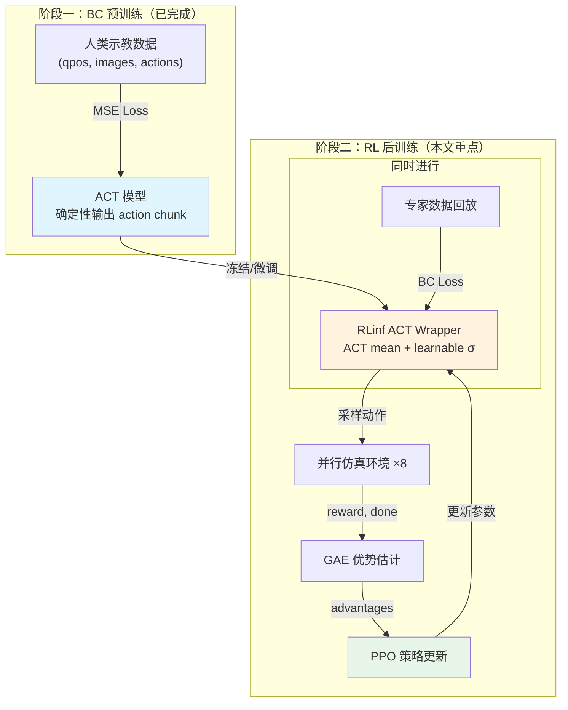
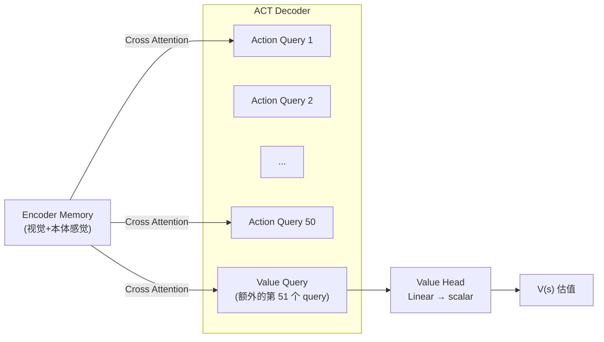
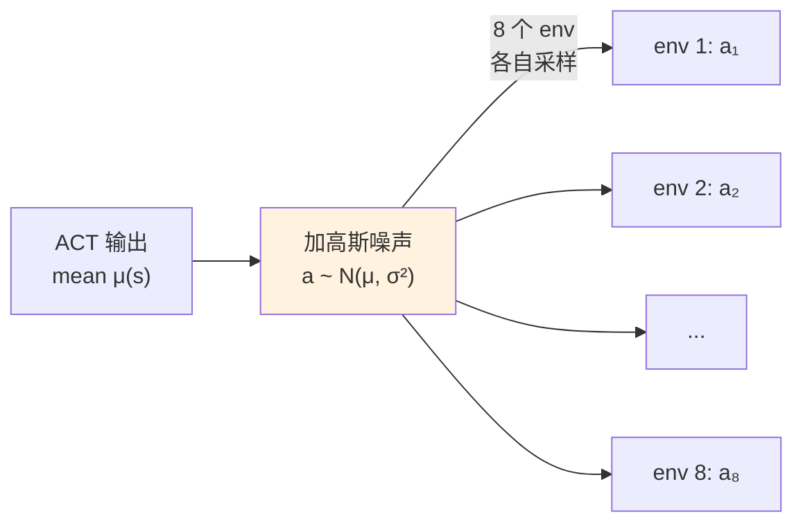
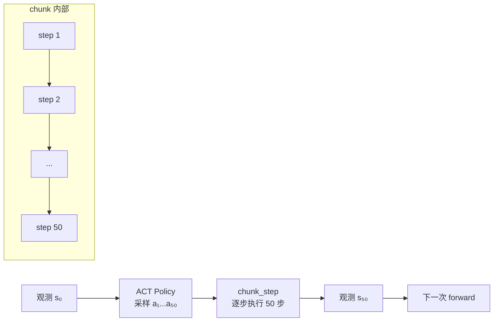
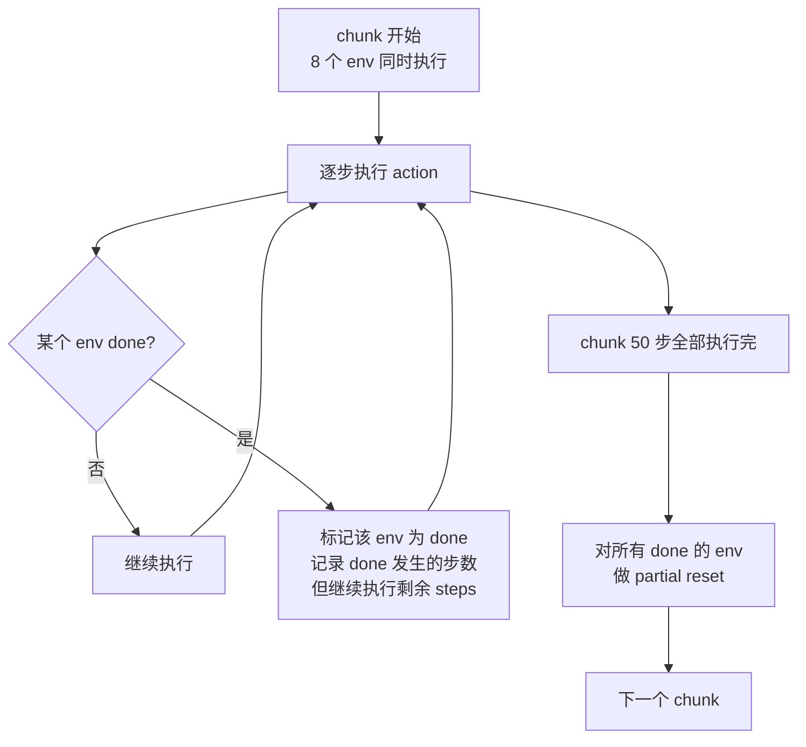
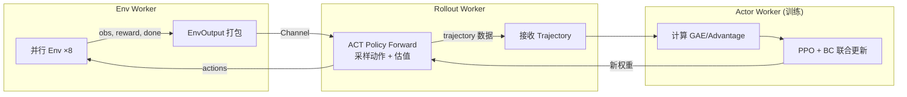
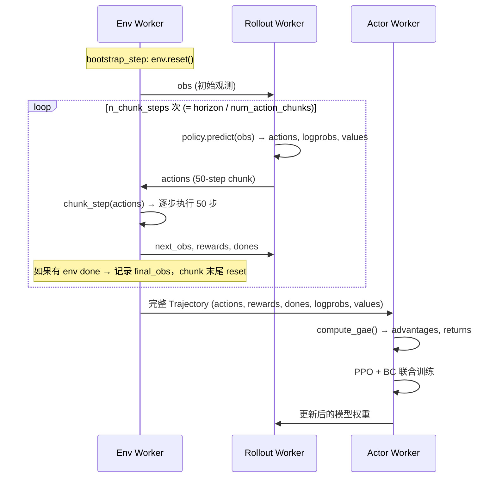

# RLinf：从 BC 到 RL 的 ACT 后训练架构全解析

## 相关阅读

- [ACT Decoder 架构详解](./ACT_Decoder架构详解) — 理解 ACT 模型的基本结构
- [条件约束的 ACT 模型](./条件约束的ACT模型) — ACT 模型的条件化机制

<!-- TODO: 需要前置知识文章：PPO (Proximal Policy Optimization) -->
<!-- TODO: 需要前置知识文章：GAE (Generalized Advantage Estimation) -->
<!-- TODO: 需要前置知识文章：高斯策略与策略梯度 -->

---

## 一、这篇文章要解决什么问题？

假设你已经用模仿学习（Behavior Cloning, BC）训练好了一个 ACT 模型，它能在仿真环境中成功完成 60% 的任务。**怎么把它提高到 80%、90%？**

直觉上有两条路：

1. **收更多数据继续 BC** — 成本高，且 BC 的天花板受限于数据质量
2. **用环境 reward 做强化学习微调** — 让模型在交互中自我改进

RLinf 选择了第二条路，但有一个关键约束：**不能让 RL 把预训练好的 ACT 策略搞崩**。

这就引出了本文的核心问题：

> 如何在一个确定性的 ACT 模型上引入随机性做探索？如何在保持探索的同时让策略逐步收敛？如何设计整个系统让 RL 微调安全、可控、有效？

---

## 二、贯穿全文的例子

我们用一个具体场景来贯穿全文：

> **任务**：一个双臂人形机器人打开笔记本电脑的屏幕。
>
> - 环境有 8 个并行实例（`num_envs=8`），同时做不同的探索
> - ACT 模型预测未来 50 步动作（`num_action_chunks=50`）
> - 每个 episode 最多 277 步（`max_episode_steps=277`）
> - reward：成功打开 +20，每步 -0.01（鼓励快速完成）

---

## 三、整体架构概览



**一句话概括**：把 ACT 的确定性输出当作高斯分布的 mean，加一个可学习的 std 做探索，用 PPO 根据环境 reward 微调，同时用专家数据回放防止策略飘走。

---

## 四、核心设计：如何在确定性模型上加随机性

### 4.1 问题：ACT 是确定性的

ACT 模型本质是一个确定性映射：

$$
\mathbf{a}_{1:T} = f_\theta(\text{qpos}, \text{images})
$$

给定相同的观测，永远输出相同的动作序列。这在纯 BC 时没问题——因为我们只需要模仿。但做 RL 时，**必须有随机性才能探索**。

### 4.2 解决方案：高斯包装

RLinf 的做法是在 ACT 输出上套一层高斯分布：

$$
\pi_\theta(\mathbf{a} | \mathbf{s}) = \mathcal{N}\Big(\underbrace{f_\theta(\text{qpos}, \text{images})}_{\text{ACT 模型输出（mean）}},\; \underbrace{\sigma^2 \mathbf{I}}_{\text{可学习方差}}\Big)
$$

其中 $\sigma = \exp(\log\sigma)$，$\log\sigma$ 是一个**可学习的全局参数**（所有维度共享同一套 $\log\sigma$ 向量）。

**代码实现**：

```python
class MiGenACTRLinfPolicy(nn.Module):
    def __init__(self, actor, init_log_std=-2.0, ...):
        self.actor = actor                    # 预训练好的 ACT 模型
        self.log_std = nn.Parameter(          # 可学习的对数标准差
            torch.full((action_dim,), init_log_std)
        )

    def _distribution(self, states, images):
        mean = self.actor(states, images)     # ACT 的确定性输出
        std = torch.exp(self.log_std)         # 转换为正数
        return Normal(mean, std)              # 高斯分布
```

### 4.3 为什么是这个设计？

| 备选方案 | 问题 | RLinf 的选择 |
|----------|------|-------------|
| ε-greedy（在动作上加均匀噪声）| 不可微分，无法用策略梯度 | ❌ |
| 输出 mean + std 两个网络头 | 需要改 ACT 架构，破坏预训练权重 | ❌ |
| 全局可学习 log_std + 冻结 mean | 不改 ACT 结构，即插即用 | ✅ |
| 每维度独立 log_std | 允许不同维度有不同探索幅度 | ✅（当前实现） |

**关键优势**：完全不需要修改 ACT 模型的内部结构。预训练好的 ACT checkpoint 直接加载，外面套一层高斯壳即可。

### 4.4 初始 std 的选择：保守探索

你的配置 `init_log_std: -4.0`，意味着初始标准差：

$$
\sigma_0 = e^{-4.0} \approx 0.018
$$

**代入具体数字理解**：假设 ACT 输出的某个关节角速度是 0.5 rad/step，那么 RL 实际执行的动作在 $[0.5 - 0.054, 0.5 + 0.054]$（3σ 范围）内浮动。这是非常保守的探索——几乎不偏离 ACT 原始输出。

**为什么要这么保守？** 因为 ACT 预训练已经学到了合理的行为模式。如果初始 std 太大（如 `init_log_std: 0` → σ=1），一开始就会产生很大的随机动作，可能让机器人撞坏东西或者进入不可恢复的状态。

---

## 五、Critic 设计：如何估计"当前状态有多好"

RL 需要一个 Value Function $V(s)$ 来估计"从当前状态开始，未来能拿到多少累计 reward"。RLinf 提供了两种 Critic 设计：

### 5.1 方案 A：独立 MLP Value Head（默认）

```python
class QposValueHead(nn.Module):
    def __init__(self, qpos_dim, hidden_dim=256):
        self.net = nn.Sequential(
            nn.Linear(qpos_dim, hidden_dim),
            nn.Tanh(),
            nn.Linear(hidden_dim, hidden_dim),
            nn.Tanh(),
            nn.Linear(hidden_dim, 1),
        )
```

只用当前关节状态 $\text{qpos}$ 作为输入，输出一个标量 value。

**优点**：简单，训练快。  
**缺点**：不看图像，估值不准确（打开笔记本电脑，关节角度相同但笔记本位置不同，value 应该不同）。

### 5.2 方案 B：ACT Value Query Critic（你的配置使用的）

这是一个更巧妙的设计——直接复用 ACT Decoder 的 Transformer 来估值：



**核心思想**：在 ACT Decoder 的 query 序列末尾追加一个 "value query"。它和 action query 一起做 cross-attention，看到完全相同的视觉和本体感觉信息，但输出的不是动作而是价值估计。

**为什么这样设计？**

1. **共享表征**：value query 和 action query 共享整个 encoder 的视觉特征，估值准确
2. **几乎零额外成本**：只多了一个 query embedding + 一个 Linear head
3. **端到端可训练**：反向传播同时更新 ACT encoder（如果不冻结的话）

**你的配置**：`require_value_query_critic: true`，强制使用这个方案。


---

## 六、完整的 Loss 函数拆解

训练时的总 loss 由多个部分加权组成：

$$
\mathcal{L}_{\text{total}} = \underbrace{\alpha_{\text{actor}} \cdot \mathcal{L}_{\text{PPO}}}_{\text{策略改进}} + \underbrace{c_{\text{vf}} \cdot \mathcal{L}_{\text{value}}}_{\text{价值估计}} + \underbrace{c_{\text{bc}} \cdot \mathcal{L}_{\text{expert BC}}}_{\text{防止遗忘}} + \underbrace{c_{\text{anchor}} \cdot \mathcal{L}_{\text{anchor}}}_{\text{限制偏移}}
$$

下面逐一拆解。

### 6.1 PPO Clip Loss（策略改进）

$$
\mathcal{L}_{\text{PPO}} = -\mathbb{E}\left[\min\Big(r_t \hat{A}_t,\; \text{clip}(r_t, 1-\epsilon, 1+\epsilon) \hat{A}_t\Big)\right]
$$

**逐项解释**：

- $r_t = \frac{\pi_\theta(\mathbf{a}_t | \mathbf{s}_t)}{\pi_{\theta_{\text{old}}}(\mathbf{a}_t | \mathbf{s}_t)}$ — 新旧策略的概率比值
- $\hat{A}_t$ — GAE 估计的优势值（这个动作比平均好多少）
- $\epsilon$ — clip 范围，你的配置 `clip_range: 0.03`（非常小！）

**代入数字**：假设某动作的 advantage $\hat{A}_t = +5$（成功抓住了笔记本边缘），新策略把这动作概率提高了 10%（$r_t = 1.10$）：

- 未裁剪：$1.10 \times 5 = 5.5$
- 裁剪：$\text{clip}(1.10, 0.97, 1.03) \times 5 = 1.03 \times 5 = 5.15$
- 取 $\min(5.5, 5.15) = 5.15$ → 限制了更新幅度

**为什么 clip_range 只有 0.03？** 因为 ACT 预训练已经很好了，我们只想做微调。0.03 意味着每次更新最多让概率比变化 3%，极其保守。对比标准 PPO 通常用 0.1~0.2。

### 6.2 Value Loss（价值估计）

$$
\mathcal{L}_{\text{value}} = \frac{1}{2} \max\Big((V_\theta - R_t)^2,\; (V_{\text{clip}} - R_t)^2\Big)
$$

其中：
- $V_\theta$ — 当前 value 估计
- $R_t$ — GAE 计算出的 return target
- $V_{\text{clip}}$ — clip 过的 value 预测，防止 value function 跳变

**为什么用 clipped value loss？** 和 PPO 的 actor 思路一致——防止 value function 单步更新太大，导致下一轮 GAE 估计不准。

你的配置：`vf_coef: 0.5`（标准设置），`value_clip: 0.2`。

### 6.3 Expert BC Loss（防止遗忘）

$$
\mathcal{L}_{\text{expert BC}} = \frac{1}{N_{\text{valid}}} \sum_{t \in \text{valid}} \| \mu_\theta(\mathbf{s}_t) - \mathbf{a}_t^{\text{expert}} \|^2
$$

**做什么**：每次 PPO 更新时，同时从专家示教数据中采一个 mini-batch，计算 ACT 输出和专家动作的 MSE loss。

**为什么需要？** 纯 PPO 可能让策略"忘记"预训练学到的好行为。比如 ACT 原来能稳定抓握，但 PPO 为了探索新策略可能把抓握动作的概率降低。加 expert BC loss 相当于持续提醒："别忘了这些动作是对的"。

你的配置：
```yaml
expert_replay:
  enabled: true
  bc_coef: 1.0        # 权重很大！和 PPO loss 等权
  batch_size: 8
  samples_per_episode: 8
```

`bc_coef: 1.0` 意味着 BC loss 和 PPO loss 等权——这是非常保守的设置，**强烈偏向保持 BC 行为**。

### 6.4 Anchor Loss（限制偏移）

$$
\mathcal{L}_{\text{anchor}} = \| \mu_\theta(\mathbf{s}) - \mu_{\theta_0}(\mathbf{s}) \|^2
$$

**做什么**：保存一份 ACT 模型的初始 checkpoint 副本（`anchor_actor`），惩罚当前模型的 mean 输出偏离初始输出。

**和 Expert BC Loss 的区别**：

| | Expert BC Loss | Anchor Loss |
|---|---|---|
| 目标 | 拟合专家数据中的动作 | 保持和初始 checkpoint 一致 |
| 输入 | 从专家数据集采样 (s, a) | 用当前 rollout 的 state |
| 含义 | "在专家见过的状态上保持好行为" | "在任何状态上都别偏太远" |

两者互补：Expert BC 确保在专家数据覆盖的状态分布上不退化；Anchor 确保在 RL 探索到的新状态上也不会产生疯狂的输出。

### 6.5 额外机制：`freeze_actor_steps`

你的配置：`freeze_actor_steps: 20`。

前 20 步（即前 20 个 PPO 更新周期），`actor_scale = 0.0`，PPO loss 不回传给 ACT actor：

```python
actor_scale = 0.0 if global_step < freeze_actor_steps else 1.0
loss = actor_scale * (policy_loss + bc_anchor_coef * anchor_loss + ...) + vf_coef * value_loss
```

**为什么？** 让 value function 先"热身"。如果 value 估计不准就开始更新 actor，会产生错误的梯度方向。先让 critic 学会估值，再用它指导 actor 更新。

---

## 七、探索与收敛的平衡机制

### 7.1 探索来自哪里？



- 每个 env 每步采到不同的噪声 → 不同的动作 → 不同的轨迹
- 8 个 env 并行 → 每个 rollout 周期拿到 8 条不同的轨迹
- 有的轨迹成功（reward 高），有的失败（reward 低）
- PPO 据此计算 advantage：成功轨迹的动作 advantage > 0，失败轨迹的 advantage < 0

### 7.2 收敛如何发生？

PPO 梯度对高斯策略 $\pi = \mathcal{N}(\mu, \sigma^2)$ 的更新方向：

**对 mean（ACT 参数）的梯度**：

$$
\nabla_\mu \log \pi(\mathbf{a}|\mathbf{s}) = \frac{\mathbf{a} - \mu}{\sigma^2}
$$

- advantage > 0 的动作：梯度把 mean **拉向** 那个动作
- advantage < 0 的动作：梯度把 mean **推离** 那个动作
- 综合效果：mean 逐渐朝着获得更高 reward 的方向移动

**对 log_std 的梯度**：

$$
\nabla_{\log\sigma} \log \pi(\mathbf{a}|\mathbf{s}) = \frac{(\mathbf{a} - \mu)^2}{\sigma^2} - 1
$$

- 如果当前的 mean 已经足够好（好动作都在 mean 附近），这个梯度 < 0 → **std 减小** → 探索收缩
- 如果 mean 不够好（好动作偏离 mean 很远），梯度 > 0 → **std 增大** → 探索扩大

**直觉总结**：std 就像"信心指标"——当 policy 对自己的 mean 有信心时，std 自动缩小；当 mean 还不够好时，std 保持甚至增大以继续探索。

### 7.3 多重安全网防止崩溃

| 机制 | 作用 | 你的配置 |
|------|------|----------|
| 极小 actor_lr | ACT mean 几乎不动 | `5e-8` |
| 极小 clip_range | 单次更新幅度极小 | `0.03` |
| 极低初始 std | 起始探索范围小 | `init_log_std: -4.0` (σ≈0.018) |
| Expert BC loss | 持续回拉到专家行为 | `bc_coef: 1.0` |
| Anchor loss | 限制偏离初始 checkpoint | 可选 |
| Freeze actor steps | 先让 critic 热身 | 20 步 |
| Value clip | 防止 value 跳变 | 0.2 |

这些机制叠加在一起，确保了：即使 RL 训练出了问题，策略也不会退化到比初始 BC checkpoint 差太多。


---

## 八、Chunk Step 与多环境 Done 处理

### 8.1 ACT 的 Action Chunk 执行模式

ACT 一次性预测 50 步动作（`num_action_chunks=50`）。在 RL rollout 中，**一次 policy forward 产生 50 个 action step**，然后逐步执行到环境中：



**问题来了**：如果 chunk 执行到第 30 步时，某个 env 就 done 了（成功或超时），怎么办？

### 8.2 Done 处理策略

RLinf 对这个问题提供了多种配置组合。你的配置使用的是：

```yaml
auto_reset: false              # 不自动 reset
ignore_terminations: false     # 不忽略 termination
reset_done_at_chunk_end: true  # chunk 结束时 reset
```

执行流程：



### 8.3 Loss Mask：屏蔽无效数据

当 `auto_reset=false` 时，一个 env done 之后继续执行的 steps 产生的数据是无意义的（环境已经结束了）。RLinf 用 **loss_mask** 屏蔽这些数据：

```python
def compute_loss_mask(dones):
    # dones: [n_chunk_steps, batch, num_action_chunks]
    # cumsum 找到每个 env 第一次 done 的位置
    # done 之后的所有 step → mask = False（不参与 loss 计算）
    flattened_loss_mask = (flattened_dones.cumsum(dim=0) == 0)[:-1]
    return loss_mask
```

**代入例子**：8 个 env，chunk 50 步。env_3 在第 30 步 done 了：

| env_id | step 1-29 | step 30 | step 31-50 |
|--------|-----------|---------|------------|
| env_0 | mask=True | mask=True | mask=True |
| env_3 | mask=True | mask=True (done 这步本身参与) | **mask=False** |
| env_7 | mask=True | mask=True | mask=True |

这样，PPO 计算 loss 时只用有效数据，不会被 done 后的随机数据干扰。

### 8.4 GAE 中的 Done 截断

GAE 计算时，done 信号用于截断 value bootstrap：

$$
\delta_t = r_t + \gamma \cdot (1 - d_t) \cdot V(s_{t+1}) - V(s_t)
$$

$$
\hat{A}_t = \delta_t + \gamma \lambda \cdot (1 - d_t) \cdot \hat{A}_{t+1}
$$

其中 $d_t \in \{0, 1\}$ 是 done flag。当 $d_t = 1$ 时：
- $V(s_{t+1})$ 不参与（episode 结束了，没有未来 value）
- advantage 链条断开，不从未来传播

**为什么这很重要？** 如果不用 done 截断，算法会错误地认为 done 后的 value 还能累积——这会产生错误的 advantage 估计，导致训练不稳定。

---

## 九、Residual RL 模式（可选替代方案）

除了直接微调 ACT 参数，RLinf 还提供了一种更保守的模式：**Residual RL**。

### 9.1 核心思想

完全冻结 ACT 模型，只训练一个小的残差网络：

$$
\mathbf{a} = \underbrace{f_{\theta_0}(\mathbf{s})}_{\text{冻结的 ACT 输出}} + \underbrace{\text{tanh}(g_\phi(\mathbf{s})) \cdot \alpha}_{\text{可学习的残差修正}}
$$

其中 $\alpha$ 是 `residual_scale`（如 0.1），限制残差的最大幅度。

### 9.2 Residual Head 实现

```python
class ResidualHead(nn.Module):
    def __init__(self, state_dim, action_dim, residual_scale=0.1, ...):
        # 小 MLP：state → residual delta
        self.mlp = nn.Sequential(
            Linear(input_dim, 128), GELU(),
            Linear(128, 128), GELU(),
            Linear(128, action_dim * num_chunks),  # 最后一层零初始化！
        )

    def forward(self, state, base_action):
        features = cat([state, base_action.flatten()])
        raw_delta = self.mlp(features)
        return tanh(raw_delta) * self.residual_scale  # 有界输出
```

**关键设计**：
- 最后一层权重初始化为零 → 训练开始时残差 ≈ 0 → 行为和冻结 ACT 完全相同
- `tanh` + `residual_scale` → 残差永远在 $[-\alpha, +\alpha]$ 范围内
- 只训练残差 head 的参数，ACT 梯度完全不传播

### 9.3 何时用 Residual vs 直接微调？

| 场景 | 推荐方案 |
|------|----------|
| BC 已经很好（>70% 成功率），只需微调 | Residual RL |
| BC 一般（40-60%），需要较大改变 | 直接微调（小 lr） |
| 有充足的 expert replay 数据 | 直接微调 + expert BC |
| 担心灾难性遗忘 | Residual RL |

---

## 十、完整的数据流与系统架构

### 10.1 RLinf 分布式架构

在 RLinf 的分布式系统中，ACT 后训练涉及三个 worker 角色：



### 10.2 单次 Rollout Epoch 的时序



### 10.3 你的配置下的具体数字

| 参数 | 值 | 含义 |
|------|---|------|
| `num_envs` | 8 | 8 个并行环境 |
| `num_action_chunks` | 50 | 每次 forward 产生 50 步动作 |
| `horizon` | 300 | 每个 rollout epoch 走 300 步 |
| `n_chunk_steps` | 300/50 = 6 | 每 epoch 做 6 次 policy forward |
| `rollout_epoch` | 1 | 收集 1 个 epoch 的数据再更新 |
| `update_epochs` | 1 | 用收集的数据只更新 1 次（保守） |
| `total_steps` | 120,000 | 总共交互 12 万步 |

每次 PPO 更新用到的数据量：8 envs × 300 steps = 2,400 个 transitions。


---

## 十一、设计决策对比：为什么这么做，不那么做？

### 11.1 为什么不用 SAC？

SAC（Soft Actor-Critic）是连续控制中最流行的 off-policy RL 算法。为什么不用它？

| 维度 | SAC | PPO（RLinf 选择） |
|------|-----|-------------------|
| 样本效率 | 高（off-policy，可重用旧数据） | 低（on-policy，数据只用一次） |
| 稳定性 | 需要调 replay buffer、target network | 更稳定，超参少 |
| 和预训练策略的兼容性 | 需要适配 entropy 项，可能破坏 BC 先验 | 天然支持 clip 限制，保护预训练 |
| 实现复杂度 | 高（双 Q-network、target 软更新） | 低（单 value head 即可） |
| Action chunk 兼容性 | 50 维高维动作空间的 Q 学习不稳定 | 策略梯度对高维动作更友好 |

**核心原因**：ACT 输出 50 步 × 30 维 = 1500 维的动作向量。在这么高维的空间中做 Q-learning（SAC 的核心）非常不稳定。PPO 的策略梯度直接在策略输出上算梯度，对高维动作更鲁棒。

### 11.2 为什么不用 GRPO/REINFORCE？

GRPO（Group Relative Policy Optimization）在 LLM RL 中很流行，它不需要 value function：

$$
\hat{A}_t^{\text{GRPO}} = \frac{R_i - \text{mean}(R_{\text{group}})}{\text{std}(R_{\text{group}})}
$$

**为什么不用？**

1. **需要大 group_size**：GRPO 需要同一个 prompt 生成多条轨迹做对比。在机器人任务中，"同一个 prompt" = "同一个初始状态"，但仿真 reset 后状态有随机性，很难保证完全相同
2. **Episode reward 太稀疏**：机器人任务通常只有成功/失败的二值 reward，用 GRPO 估计的 advantage 方差极大
3. **Step-level credit assignment 差**：GRPO 只看整条轨迹的总 reward，不知道"哪一步动作导致了成功"。GAE+Value function 能精确到每步做信用分配

RLinf 的实际实现中 **确实支持 GRPO**（`adv_type` 可选），但对于 step-level reward 的机器人任务，GAE + PPO 效果更好。

### 11.3 为什么用 chunk-level reward 而不是 step-level reward？

你的配置没有显式设置 `reward_type`，默认是 step-level。但 RLinf 也支持 chunk-level：

| 模式 | reward 粒度 | advantages 粒度 |
|------|------------|----------------|
| step-level | 每步一个 reward | 每步一个 advantage，精确信用分配 |
| chunk-level | 50 步求和为一个 reward | 整个 chunk 一个 advantage |

**step-level 更好**：因为你的任务有 `step_reward_penalty: -0.01`（每步扣分）和 `sparse_completion_reward: true`（成功时给大奖励），step-level 能让算法知道"在哪一步成功了"。

### 11.4 为什么 `auto_reset=false` + `reset_done_at_chunk_end=true`？

两种可选方案：

**方案 A：`auto_reset=true`**
- 某 env done → 立刻 reset → 下一步从新 episode 开始
- 返回给 actor 的 dones 被压缩到 chunk 最后一步（`chunk_dones[:, -1]`）
- actor 看到的是"这个 chunk 结束时这个 env done 了"
- **问题**：丢失了"到底在 chunk 的第几步 done"的精确信息

**方案 B：`auto_reset=false` + `reset_done_at_chunk_end=true`**（你的选择）
- 某 env done → 继续执行完 chunk → chunk 结束后才 reset
- 返回给 actor 的是**原始 per-step dones**
- actor 精确知道每步的 done 状态，用 loss_mask 屏蔽无效数据
- **优点**：信息无损，GAE 计算更精确

**代价**：done 后继续执行的 steps 浪费了算力（但被 mask 掉不影响训练质量）。在你的场景中（50 步 chunk，277 步 episode），如果一个 env 在 chunk 中间 done，最多浪费 49 步——相对于总 episode 长度是可接受的。

### 11.5 为什么需要 `rollout_use_eval_step=true`？

这个开关让 train rollout 走和 eval 相同的代码路径（`env_interact_step_like_eval`）。区别是：

| | 标准 train 路径 | eval-like 路径 |
|---|---|---|
| action 预处理 | 经过 `prepare_actions` 转换 | 直接传给 env |
| info 处理 | 区分 auto_reset / non-auto_reset | 统一处理 |
| 适用场景 | 标准 LLM RL 训练 | ACT embodied 训练 |

ACT 的 action chunk 格式和 LLM token 格式不同，走 eval-like 路径避免了不必要的数据格式转换。

---

## 十二、训练过程的典型现象

### 12.1 正常训练的指标变化

| 指标 | 早期 | 中期 | 后期 |
|------|------|------|------|
| `log_std` | -4.0（初始） | -4.5 ~ -3.5（波动） | 收敛到某个值 |
| `mean_reward` | 和 BC 相同 | 逐渐上升 | 稳定在更高水平 |
| `mean_value` | 接近 0 | 学会估值，逐渐增大 | 稳定 |
| `expert_bc_loss` | 和 BC 时相同 | 略微增大（策略有变化） | 稳定在较低水平 |
| `clip_fraction` | ~0 | 随 std 和 lr 增大 | 稳定在 0.1-0.3 |

### 12.2 常见问题与诊断

| 现象 | 可能原因 | 解决方案 |
|------|----------|----------|
| reward 不增长 | std 太小，探索不够 | 增大 `init_log_std` |
| reward 先升后暴跌 | clip_range 太大，策略跳变 | 减小 `clip_range`，增大 `bc_coef` |
| value loss 很大不收敛 | critic 容量不够或 lr 不对 | 用 value_query critic，调 `critic_lr` |
| expert_bc_loss 暴增 | 策略偏离 BC 先验太远 | 增大 `bc_coef` 或 `freeze_actor_steps` |
| log_std 一直减小到 -10+ | 过早收敛，陷入局部最优 | 增大 `ent_coef`，加 entropy bonus |

---

## 十三、总结

### 13.1 核心架构总结表

| 组件 | 实现 | 作用 |
|------|------|------|
| Actor（策略） | ACT model + learnable log_std | 提供 mean + 探索 |
| Critic（估值） | ACT Value Query / MLP | 估计状态价值 |
| 优化算法 | PPO (clip) | 安全的策略改进 |
| 正则化 | Expert BC + Anchor Loss | 防止灾难性遗忘 |
| 环境接口 | chunk_step + loss_mask | 兼容 action chunk |
| 可选增强 | Residual Head | 更保守的微调方式 |

### 13.2 一句话总结

> RLinf 的 BC→RL 后训练架构 = **"在预训练好的 ACT 策略的确定性输出上套高斯壳做探索，用极其保守的 PPO + 专家数据回放做微调，通过 chunk-level 环境交互和精确的 loss mask 处理高效利用仿真数据"**。

### 13.3 和其他 BC→RL 方法的对比

| 方法 | 策略表示 | RL 算法 | 防遗忘机制 |
|------|----------|---------|-----------|
| **RLinf ACT (本文)** | 高斯(ACT mean, learnable σ) | PPO | Expert BC + Anchor + 小 lr/clip |
| Fine-Tuning RL (一般做法) | 直接微调 policy 网络 | PPO/SAC | KL penalty |
| Residual RL | 冻结 base + 小残差网络 | SAC/PPO | 结构化保护（base 冻结） |
| RLPD (Ball et al.) | 随机初始化 | SAC + demo replay | 50% demo buffer 采样 |
| DPPO (扩散策略 RL) | 扩散模型 | PPO per denoising step | KL penalty per step |

RLinf 的设计在**保守性**和**效果**之间取得了平衡：它不像 Residual RL 那样完全冻结 base policy（允许 mean 慢慢调整），但又比直接 fine-tune 安全得多（极小 lr + clip + BC loss 三重保护）。

---

## 延伸阅读

- [ACT Decoder 架构详解](./ACT_Decoder架构详解) — 理解 ACT 模型内部的 Transformer 结构
- [条件约束的 ACT 模型](./条件约束的ACT模型) — language-conditioned ACT 的设计
- [GR00T 与 π 系列对比 ACT](./GR00T与π系列对比ACT) — 不同 policy 架构的对比

