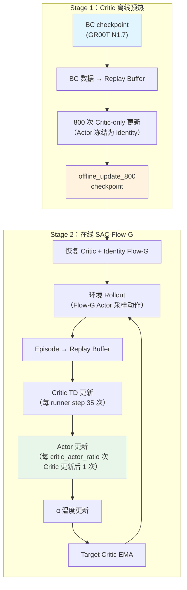

# SAC_FLOW_G 完全解剖：GR00T VLA 在线强化学习链路的工程实现

> **一句话**：本文逐层拆解 GR00T N1.7 上 SAC-Flow-G 在线 RL 后训练的核心链路——从 Critic 离线预热、到 Flow-G 门控 Actor 更新、到熵温度自适应——五个组件让训练跑起来，一条可复现的基线管线。

**知识链接**：
- [SAC (Soft Actor-Critic)](/前置知识/000k_前置知识_SAC_Soft_Actor_Critic) — SAC 框架的完整原理
- [Flow Matching 与连续归一化流](/前置知识/000g_前置知识_Flow_Matching与连续归一化流) — Flow Matching 基础
- [SAC-Flow：用 SAC 直接训练 Flow 策略](/论文综述/079_SAC_Flow_用SAC直接训练Flow策略) — 学术论文精读
- [GR00T N1.7 四种 RL 方案全景对比](./GR00T_N1d7_四种RL方案全景对比) — 四种方案的宏观定位
- [GR00T N1.7 Chunk-SAC 四种 Actor 目标详解](./GR00T_N1d7_ChunkSAC四种Actor目标详解) — Actor 目标变体
- [Q 函数与 Value 函数](/前置知识/000o_前置知识_Q函数与Value函数) — Critic 基础
- [Replay Buffer 经验回放](/前置知识/000r_前置知识_Replay_Buffer_经验回放) — 离线数据复用

---

## 一、这篇文章要解决什么问题

你手上有一个 BC 预训练好的 GR00T N1.7 模型，成功率约 60%。你决定用 SAC-Flow-G 路线做在线 RL 后训练。

**核心问题**：SAC-Flow-G 链路包含哪些组件？它们如何协作完成"从 BC 到 RL"的跨越？

训练链路被精简为五个核心组件：

1. Episode replay + Chunk-SAC TD Critic 更新
2. 调度型 SAC-Flow-G Actor 更新
3. 可选的连续 BC loss（`sac_bc_coef`）
4. 熵温度自动优化
5. Target-Critic 软更新（`tau`）

本文的目标：**把这五个组件逐一拆解到代码级别，让你能完全理解并复现这条核心链路。**

---

## 二、贯穿全文的例子

> **任务**：GR00T N1.7 双臂人形机器人在 MiArena/Isaac Sim 中执行 `open_drawer`（拉开抽屉）。
>
> - **动作空间**：62 维 camera-frame Rot6D（左臂位置 3D + 旋转 6D + 右臂位置 3D + 旋转 6D + 左手 22D + 右手 22D）
> - **动作块**：chunk_length = 16，replan_steps = 16（每 16 步重新规划）
> - **Critic 架构**：flat_absolute（双 Q 网络，输入状态 + 扁平动作块）
> - **环境并发**：训练 32 envs，评测 48 envs
> - **BC 基线**：约 56-63% 成功率（open_drawer）
> - **目标**：通过在线 RL 提升成功率，不退化

---

## 三、整体架构：两阶段训练

整条管线分为两个阶段，由两个 Hydra 配置驱动：



### 对应的启动配置

| 阶段 | 配置文件 | 关键参数 |
|------|----------|----------|
| Stage 1 | `miarena_r1_sac_flow_g_critic_warmup_gr00t_n1d7.yaml` | `mode: offline_pretrain`, `offline_updates: 800` |
| Stage 2 | `miarena_r1_sac_flow_g_adapter_gr00t_n1d7.yaml` | `mode: online`, `resume_dir: <Stage1 checkpoint>` |

两者统一由 `run_miarena_groot_chunk_sac.sh` 启动。Stage 2 **必须**从 Stage 1 的 `offline_update_800` checkpoint 恢复。

---

## 四、组件一：Episode Replay 与 Chunk-SAC TD Critic 更新

### 5.1 数据流：从环境到 Replay

每个 runner step，32 个并行环境各执行一个完整的动作块（16 步）。每个 episode 被分割为若干 chunk transition：

```
一条 chunk transition = (s, a_chunk, rewards[0:16], valid[0:16], s_next, done)
```

其中：
- `s`：chunk 开始时的状态（图像 + 本体感觉）
- `a_chunk`：16 步动作序列，形状 `[16, 62]`
- `rewards[0:16]`：16 步内的逐步奖励
- `valid[0:16]`：标记哪些步是有效的（episode 提前终止时后续步无效）
- `s_next`：chunk 结束后的下一状态
- `done`：episode 是否在此 chunk 内终止

### 5.2 Chunk-SAC TD Target 构造

Critic 的训练目标是最小化 TD error。目标值 $y$ 的构造如下：

**Step 1：先算 chunk 内的折扣回报 $R_H$**

$$
R_H = \sum_{i=0}^{H-1} \gamma^i \cdot r_i \cdot \mathbb{1}[\text{valid}_i]
$$

> **一句话**：把 chunk 内每步的奖励按时间折扣加起来，无效步不计入。

**逐符号拆解**：

| 符号 | 含义 | 具体值 |
|------|------|--------|
| $H$ | chunk 长度 | 16 |
| $\gamma$ | 折扣因子 | 0.99（`terminal_success` 模式下用 1.0） |
| $r_i$ | 第 $i$ 步奖励 | `terminal_success` 模式：成功终止步 = +1，其余 = 0 |
| $\mathbb{1}[\text{valid}_i]$ | 有效掩码 | episode 未终止 = 1，终止后 = 0 |

**代入数字**：假设 `terminal_success` 模式，$\gamma=1.0$，episode 在 chunk 第 12 步成功终止：
- $r_0 = r_1 = \ldots = r_{11} = 0$，$r_{12} = 1$
- $\text{valid}_0 = \ldots = \text{valid}_{12} = 1$，$\text{valid}_{13} = \ldots = \text{valid}_{15} = 0$
- $R_H = 1.0^{12} \times 1 = 1.0$

**Step 2：完整 Bellman target**

$$
y = R_H + \gamma^H \cdot m \cdot \big(Q^{\text{target}}(s', \mathbf{a}') - \alpha \cdot \log\pi(\mathbf{a}'|s')\big)
$$

> **一句话**：target = chunk 内真实奖励 + chunk 后目标网络对未来价值的估计（减去熵奖励）。

**逐符号拆解**：

| 符号 | 含义 | 具体值 |
|------|------|--------|
| $\gamma^H$ | H 步折扣 | $0.99^{16} = 0.851$ 或 $1.0^{16} = 1.0$ |
| $m$ | bootstrap mask | episode 在 chunk 内终止 = 0，未终止 = 1 |
| $Q^{\text{target}}$ | 目标网络 Q 值 | EMA 更新的 Critic 副本输出 |
| $s'$ | 下一状态 | chunk 结束后环境的观测 |
| $\mathbf{a}'$ | 下一动作块 | 当前 Actor 在 $s'$ 重新采样的 16 步动作 |
| $\alpha$ | 熵温度 | 自动调节的标量，初始约 $4 \times 10^{-6}$ |
| $\log\pi(\mathbf{a}'|s')$ | 路径对数概率 | SDE path density（见第六节） |

**代入数字**：假设成功 episode（$m=0$）：
- $y = 1.0 + 1.0 \times 0 \times (\ldots) = 1.0$
- 成功 episode 的 target 就是 1.0，Critic 学习"这个状态-动作组合会导致成功"

假设未终止 episode（$m=1$），$Q^{\text{target}}=0.6$，$\alpha \cdot \log\pi = 0.001$：
- $y = 0 + 0.851 \times 1 \times (0.6 - 0.001) = 0.851 \times 0.599 = 0.510$

### 5.3 Critic Loss

$$
L_{\text{critic}} = \frac{1}{2}\Big[\big(Q_1(s, \mathbf{a}) - y\big)^2 + \big(Q_2(s, \mathbf{a}) - y\big)^2\Big]
$$

> **一句话**：双 Q 网络各自最小化与 target 的均方误差，取平均。

标准 SAC twin-Q 实现。两个 Critic 网络独立训练，取 $\min(Q_1, Q_2)$ 作为 Actor 的 Q 估计以防止高估。

### 5.4 代码对应

核心计算在 `rlinf/algorithms/chunk_sac.py` 中：

```python
def chunk_sac_td_target(
    rewards, valid, bootstrap_mask, next_q, next_log_pi, alpha, gamma
):
    chunk_return = discounted_chunk_return(rewards, valid, gamma)
    continuation = gamma ** rewards.shape[-1]
    return chunk_return + continuation * bootstrap_mask * (next_q - alpha * next_log_pi)
```

`discounted_chunk_return` 对 chunk 内 reward 做折扣加权求和，`continuation` 是 $\gamma^H$，`bootstrap_mask` 就是 $m$。

---

## 五、组件二：SAC-Flow-G Actor 更新

这是整条链路最关键的组件——如何让 Q 梯度穿过 Flow 的多步采样更新 Actor 参数，同时保持梯度稳定。

### 6.1 问题回顾：为什么普通 Flow + SAC 会梯度爆炸

GR00T N1.7 的动作头使用 Flow Matching：从初始噪声 $A_0 \sim \mathcal{N}(0,I)$ 出发，经 $K$ 步 Euler 积分生成动作：

$$
A_{t_{i+1}} = A_{t_i} + \Delta t_i \cdot v_\theta(t_i, A_{t_i}, s)
$$

> **一句话**：每步把当前动作沿速度场方向推进一小步，经过 K 步到达最终动作。

SAC 的 Actor loss 需要把 $\nabla_\theta Q$ 从最终动作 $A_{t_K}$ **反传穿过所有 $K$ 步**到达参数 $\theta$。这等价于 K 层 RNN 的 BPTT——梯度指数级增长或衰减。

在 GR00T 的实际配置中 $K=4$（`denoising_steps: 4`），虽然步数不多，但在 62 维动作空间上仍然存在梯度不稳定风险。

### 6.2 Flow-G 门控解决方案

Flow-G 的核心思想是在原始 Flow 速度网络之上插入一个**可学习的门控适配器**，控制每步更新幅度。具体结构：

$$
A_{t_{i+1}} = A_{t_i} + \Delta t_i \cdot \Big[v_{\theta_{\text{frozen}}}(t_i, A_{t_i}, s) + g_i \odot \big(\hat{v}_\phi(t_i, A_{t_i}, s) - v_{\theta_{\text{frozen}}}(t_i, A_{t_i}, s)\big)\Big]
$$

$$
g_i = \sigma\big(z_\phi(t_i, A_{t_i}, s)\big) \in (0, 1)^{62}
$$

> **一句话**：原始预训练的速度网络被冻结，Flow-G adapter 学习一个门控信号来"微调"每步的速度——门为 0 时沿用 BC 的速度，门为 1 时完全使用 adapter 的新速度。

**逐符号拆解**：

| 符号 | 含义 | 具体值 |
|------|------|--------|
| $v_{\theta_{\text{frozen}}}$ | 冻结的预训练速度网络 | BC checkpoint 中的原始 Flow 权重，不参与梯度 |
| $\hat{v}_\phi$ | Adapter 的候选速度 | 一个独立的 MLP，hidden_dim=256 |
| $g_i$ | 逐维度门控 | sigmoid 输出，形状 `[B, 62]` |
| $z_\phi$ | 门控 logit 网络 | 与 $\hat{v}_\phi$ 共享部分特征，输出 62 维 |
| $\sigma$ | sigmoid 函数 | 把 logit 压缩到 (0,1) |
| $\odot$ | 逐元素乘法 | 每个动作维度独立门控 |

**初始状态**：训练开始时 `gate_bias=0.0`，sigmoid(0)=0.5；但配合 `gate_scale=2.0`，实际初始 gate 输出接近 0（因为 adapter 权重初始化很小），所以 Actor 初始行为约等于冻结的 BC。这就是文档中说的"identity start"。

**代入数字**（1 维简化）：
- 冻结速度 $v_{\text{frozen}} = 0.4$
- Adapter 候选速度 $\hat{v} = 0.7$
- 门控 $g = 0.1$（训练初期，adapter 还没学到什么）
- 实际速度 = $0.4 + 0.1 \times (0.7 - 0.4) = 0.4 + 0.03 = 0.43$
- 只比 BC 偏移了 0.03，非常保守

训练后期 $g = 0.8$：
- 实际速度 = $0.4 + 0.8 \times (0.7 - 0.4) = 0.4 + 0.24 = 0.64$
- 明显偏离 BC，走向 RL 发现的更优方向

### 6.3 为什么梯度不会爆炸

关键在于：即使 $K=4$ 步的链式求导，门控 $g_i \in (0,1)$ 限制了每步的有效 Jacobian 范数。当 gate 接近 0 时，该步对最终动作的贡献趋于零，梯度被"刹住"。网络自动学习在梯度容易爆炸的方向关闭 gate。

这与 GRU 解决 RNN 梯度爆炸的原理完全相同——update gate 控制了信息流。

### 6.4 Actor Loss

$$
L_{\text{actor}} = \alpha \cdot \log\pi(\mathbf{a}^\theta | s) - \min\big(Q_1(s, \mathbf{a}^\theta), Q_2(s, \mathbf{a}^\theta)\big)
$$

> **一句话**：最大化 Q 值（选择好动作）同时保持策略的熵（不要太确定）。

**逐符号拆解**：

| 符号 | 含义 | 梯度方向 |
|------|------|----------|
| $\alpha \cdot \log\pi$ | 熵惩罚项 | 策略越确定（log_prob 越大）→ loss 越大 → 鼓励探索 |
| $-\min(Q_1, Q_2)$ | 负 Q 值 | Q 越大 → loss 越小 → Actor 学习选择高 Q 的动作 |

这里的 $\mathbf{a}^\theta$ 是**当前 Actor 重新采样**的动作（不是 replay buffer 中存储的旧动作）。梯度从 $Q$ 穿过 $\mathbf{a}^\theta$ 再穿过整个 $K$ 步 Flow-G 到达 adapter 参数 $\phi$。

**代入数字**：$\alpha = 4 \times 10^{-6}$，$\log\pi = -50$（Flow 路径的 log-prob 通常是大负数），$Q = 0.6$：
- $L = 4\times10^{-6} \times (-50) - 0.6 = -0.0002 - 0.6 = -0.6002$
- 梯度主要由 Q 项驱动，熵项在初始阶段影响很小

### 6.5 调度：critic_actor_ratio

Actor 不是每次 Critic 更新后都更新。配置参数 `critic_actor_ratio` 控制比例：

- `critic_actor_ratio=8`：每 8 次 Critic 更新后做 1 次 Actor 更新
- `critic_actor_ratio=16`：每 16 次后 1 次
- `critic_actor_ratio=32`：每 32 次后 1 次

每个 runner step 做 35 次 Critic 更新，所以 ratio=8 时每步约 4 次 Actor 更新，ratio=32 时约 1 次。

**为什么需要这个比例**：Critic 需要比 Actor 更快地收敛。如果 Actor 更新太频繁，它会追逐一个还不稳定的 Q landscape，导致策略漂移。实验表明 ratio=8 在 step 25 退化，ratio=16 在 step 40 退化，ratio=32 在 step 40 退化但更平缓。

### 6.6 代码对应

Actor loss 计算在 `rlinf/algorithms/chunk_sac.py`：

```python
def chunk_sac_actor_loss(log_pi, q_value, alpha):
    entropy_coefficient = torch.as_tensor(alpha, device=q_value.device, dtype=q_value.dtype)
    return (entropy_coefficient * log_pi - q_value).mean()
```

Flow-G gate 的配置在 YAML 中：

```yaml
flow_g:
  enabled: true
  freeze_pretrained_velocity: true
  hidden_dim: 256
  gate_bias: 0.0
  gate_scale: 2.0
```

---

## 六、组件三：连续 BC Loss（`sac_bc_coef`）

### 7.1 为什么需要 BC 拉回

纯 SAC 的 Actor 只受 Q 梯度驱动。如果 Critic 有偏（实验证明几乎一定有偏），Actor 可能漂向一个 Critic 误认为好但实际失败的区域。一旦漂出去，由于 off-policy 数据有限，很难纠正。

解决方案：在 Actor loss 中加一个 BC 正则项，把策略拉回专家行为的邻域。

### 7.2 实现方式

完整 Actor loss 变为：

$$
L_{\text{actor}}^{\text{total}} = \underbrace{\alpha \cdot \log\pi - Q}_{\text{SAC 主目标}} + \underbrace{\lambda_{\text{BC}} \cdot \|\mathbf{a}^{\text{actor}} - \mathbf{a}^{\text{BC}}\|_2^2}_{\text{BC 拉回项}}
$$

> **一句话**：在追求高 Q 值的同时，不要偏离专家动作太远。

**逐符号拆解**：

| 符号 | 含义 | 典型值 |
|------|------|--------|
| $\lambda_{\text{BC}}$ | BC 系数 | `sac_bc_coef=0.1` |
| $\mathbf{a}^{\text{actor}}$ | 当前 Actor 的 Flow-G 输出 | 经过 K 步门控积分的动作 |
| $\mathbf{a}^{\text{BC}}$ | 冻结 BC 输出 | 跳过 Flow-G gate 的纯预训练动作 |
| $\|\cdot\|_2^2$ | L2 距离 | 62 维向量的逐元素平方和 |

**代入数字**：假设某维度 actor=0.5, BC=0.4，$\lambda=0.1$：
- BC loss 贡献 = $0.1 \times (0.5-0.4)^2 = 0.001$
- 相比 $-Q \approx -0.6$，这是一个温和的约束

### 7.3 什么时候可以关闭

Aggressive 实验将 `sac_bc_coef=0.0`，结果是"稳定但无提升"——100 步训练后成功率仍停在 60% 左右，没有崩溃也没有进步。说明 BC loss 在当前设置下主要起"安全网"作用，不是性能瓶颈。

**最小核心保留 `sac_bc_coef=0.1` 作为默认值**，但它是一个配置旋钮而非硬编码逻辑。

---

## 七、组件四：熵温度自动优化

### 8.1 为什么需要自动调温

SAC 的核心是"最大化回报同时最大化熵"。$\alpha$ 控制这两个目标的权衡：
- $\alpha$ 太大 → 策略追求探索，不收敛
- $\alpha$ 太小 → 策略快速坍缩到一个点，丧失探索能力

手动调 $\alpha$ 在 62 维连续动作空间上几乎不可能。自动调温让 $\alpha$ 自适应。

### 8.2 自动调温公式

$$
L_\alpha = -\alpha \cdot \big(\log\pi(\mathbf{a}|s) + \bar{H}\big)
$$

> **一句话**：当策略的熵低于目标 $\bar{H}$ 时增大 $\alpha$（鼓励更多探索），反之减小。

**逐符号拆解**：

| 符号 | 含义 | 配置值 |
|------|------|--------|
| $\alpha$ | 熵温度 | 用 softplus 参数化，初始约 $4 \times 10^{-6}$ |
| $\log\pi(\mathbf{a}\|s)$ | 当前策略的 log-prob | SDE path density 计算得到 |
| $\bar{H}$ | 目标熵 | `target_entropy: 0.0`（零目标熵 = 不强求探索） |

**代入数字**：假设 $\log\pi = -50$，$\bar{H} = 0$，当前 $\alpha = 4\times10^{-6}$：
- $L_\alpha = -4\times10^{-6} \times (-50 + 0) = 2\times10^{-4}$
- 梯度为正 → $\alpha$ 会增大（因为策略的熵 $-\log\pi = 50$ 远高于目标 0）
- 但由于 $\alpha$ 用 softplus 参数化且 learning rate 为 $3\times10^{-4}$，变化极其缓慢

### 8.3 为什么目标熵设为 0

在 `terminal_success` 奖励模式下（成功=1，其余=0），策略不需要大量探索——成功路径通常是窄的。$\bar{H}=0$ 意味着只要策略不完全坍缩成 delta 函数就行。实际中 Flow 的 SDE path density 天然有噪声（$\sigma_{\text{SDE}}$ 注入），所以 $\alpha$ 会稳定在极小值附近。

### 8.4 配置

```yaml
entropy_tuning:
  alpha_type: softplus
  initial_alpha: 4.0322580645e-6
  target_entropy: 0.0
  optim:
    lr: 3.0e-4
    lr_scheduler: torch_constant
    clip_grad: 10.0
```

---

## 八、组件五：Target-Critic 软更新

### 9.1 为什么需要 Target 网络

如果直接用正在训练的 Critic 计算 TD target，会形成"自我强化"循环——Critic 的错误会被放大并写入自己的训练目标。Target 网络通过延迟更新打破这个循环。

### 9.2 EMA 更新规则

$$
\theta^{\text{target}} \leftarrow (1 - \tau) \cdot \theta^{\text{target}} + \tau \cdot \theta^{\text{online}}
$$

> **一句话**：target 网络缓慢跟踪在线 Critic，每步只混入一小部分新参数。

**配置值**：`tau` 通常为 0.005。意味着每次更新，target 只采纳 0.5% 的新 Critic 参数。约 200 次更新后 target 才"追上"online Critic 的当前水平。

**代入数字**：假设某个参数 online=1.0, target_old=0.5, $\tau=0.005$：
- $\text{target\_new} = 0.995 \times 0.5 + 0.005 \times 1.0 = 0.4975 + 0.005 = 0.5025$
- 几乎没变——这就是稳定性的来源

### 9.3 执行时机

每次 Critic 更新后立即执行一次 EMA。在每个 runner step 的 35 次 Critic 更新中，EMA 也执行 35 次。

---

## 九、路径对数概率：SDE Path Density

### 10.1 问题：Flow 没有解析 log-prob

SAC 需要 $\log\pi(a|s)$ 计算熵项和温度更新。但确定性 Flow 的 $K$ 步 Euler 积分给出确定性映射——给定初始噪声 $A_0$，输出 $A_K$ 唯一确定。要计算 marginal $\pi(a|s)$ 需要对所有可能的 $A_0$ 积分，不可行。

### 10.2 解法：注入 SDE 噪声

在每步 Euler 更新中注入微小噪声，把确定性 ODE 变成随机过程：

$$
A_{t_{i+1}} = A_{t_i} + v_\theta(t_i, A_{t_i}, s) \cdot \Delta t_i + \sigma_{\text{SDE}} \cdot \sqrt{\Delta t_i} \cdot \varepsilon_i, \quad \varepsilon_i \sim \mathcal{N}(0, I)
$$

> **一句话**：给 Flow 每步加一点高斯噪声，使得每步转移变成解析高斯——整条路径的 log-prob 就是各步高斯 log-prob 之和。

每步的转移概率：

$$
p(A_{t_{i+1}} | A_{t_i}, s) = \mathcal{N}\big(A_{t_i} + v_\theta \cdot \Delta t_i, \; \sigma_{\text{SDE}}^2 \cdot \Delta t_i \cdot I\big)
$$

路径 log-prob：

$$
\log\pi(\mathbf{a}|s) = \log\mathcal{N}(A_0; 0, I) + \sum_{i=0}^{K-1} \log p(A_{t_{i+1}} | A_{t_i}, s)
$$

### 10.3 为什么不用 tanh squashing

原始 SAC-Flow 论文对最终动作做 tanh 压缩（$a = \tanh(A_K)$），需要加 Jacobian 修正项。但 GR00T 的动作空间已经归一化到 $[-1, 1]$（通过 action statistics），不需要额外的 tanh。配置中 `action_squash: none` 明确关闭了 tanh。

SDE path density 直接在未压缩的动作空间上计算——这简化了实现，也避免了 tanh 在边界处的数值问题。

### 10.4 配置

```yaml
compute_path_log_prob: true
path_density: sde_path
action_squash: none     # GR00T 动作已归一化，不需要 tanh
actor_backprop_steps: 4  # Q 梯度穿过 4 步 Flow
```

---

## 十、完整训练循环伪代码

把五个组件串在一起，一个 runner step 的完整流程：

```
输入：当前 Actor π_φ（Flow-G adapter），Critic Q_ψ，Target Q̄_ψ，Replay B，温度 α

=== Rollout 阶段 ===
for each of 32 envs:
    用 π_φ 采样 16 步动作块（4 步 Flow-G + SDE 噪声）
    在环境中执行 16 步，收集 (s, a_chunk, rewards, valid, s', done)
    存入 Replay Buffer B

=== 更新阶段（重复 35 次） ===
for update_idx in range(35):

    # --- Critic 更新（每次都做）---
    从 B 采 mini-batch
    用当前 π_φ 在 s' 采样下一动作 a'，计算 log π(a'|s')
    target = chunk_return + γ^H * m * (min(Q̄_1, Q̄_2)(s', a') - α * log π)
    L_critic = MSE(Q_1(s,a), target) + MSE(Q_2(s,a), target)
    更新 ψ
    EMA 更新：θ_target ← (1-τ)*θ_target + τ*θ

    # --- Actor 更新（每 critic_actor_ratio 次做 1 次）---
    if update_idx % critic_actor_ratio == 0:
        用 π_φ 在 s 重新采样动作 a_new，计算 log π
        L_actor = α * log π - min(Q_1, Q_2)(s, a_new)
        if sac_bc_coef > 0:
            a_bc = frozen_flow(s)  # 跳过 Flow-G gate
            L_actor += sac_bc_coef * ||a_new - a_bc||²
        更新 φ（只更新 Flow-G adapter 参数）

    # --- α 温度更新（每次 Actor 更新时）---
    if actor_updated_this_step:
        L_α = -α * (log π + target_entropy)
        更新 α
```

### 关键细节

1. **Actor 只更新 adapter 参数**：`freeze_pretrained_velocity: true` 冻结了原始 Flow 速度网络，梯度只流向 Flow-G adapter（约 1M 参数 vs 整个 GR00T 约 2.5B 参数）。
2. **Critic 看到的是扁平化的动作块**：`[B, 16*62]` = `[B, 992]` 维输入，加上状态 embedding。
3. **Expert replay 与 online replay 共存**：Stage 1 的 BC 数据作为 pinned expert 保留在 buffer 中，online 数据轮转最新的 128-512 条 trajectory。

---

## 十一、实验结论与工程教训

### 12.1 关键实验数据（open_drawer 任务）

| 配置 | 退化 step | 峰值成功率 | 备注 |
|------|-----------|-----------|------|
| ratio=8, lr=1e-4 | step 25 | ~30/48 (62.5%) | Actor 更新太频繁 |
| ratio=16, lr=1e-4 | step 40 | 35/48 (72.9%) | 有短暂提升后退化 |
| ratio=32, lr=1e-4 | step 40 | 35/48 (72.9%) | 退化更平缓 |
| ratio=32, lr=3e-5 | step 10+ | 30/48 (62.5%) | 稳定但无明显提升 |
| ratio=32, lr=3e-5, aggressive (no BC) | step 100 | 31/48 (64.6%) | 稳定无崩溃无提升 |
| BC baseline | — | 30/48 (62.5%) | 纯 BC 无 RL |

### 12.2 核心工程教训

**教训一：Critic 质量是瓶颈，不是 Actor 更新策略**

所有 ratio 变体都在 30-50 step 后退化。Critic replay audit 证明 Q 网络主要依赖"任务进度"（状态信息），不能可靠区分不同动作的好坏。原动作与随机 shuffle 动作的 Q 差只有 0.0166。

**教训二：BC loss 是安全网，不是驱动力**

`sac_bc_coef=0.1` 防止策略飘走，但不提供正向指导。关掉它（=0）不崩溃但也不提升——说明当前的提升瓶颈不在约束上，而在 Critic 信号质量上。

**教训三：Identity start 是必须的**

早期实验用 512 步 BC warmup 初始化 Flow-G adapter，结果 adapter 在 BC warmup 阶段就偏离了 identity，后续 RL 从一个不确定的起点开始。改为 identity start（`gate_bias=0`，初始 gate 接近 0）后，评测门禁通过。

**教训四：仿真非确定性是显著噪声源**

同一个 checkpoint，同 48 layout，三次独立评测的成功数分别为 25、29、34。PhysX 的非确定性使得 ±4 个 episode 的波动属于正常范围，不能用单次评测判断策略退化。

---

## 十二、核心配置清单

| 参数 | 典型值 | 作用 |
|------|--------|------|
| `chunk_length` | 16 | 动作块长度 |
| `replan_steps` | 16 | 每次重新规划的间隔 |
| `denoising_steps` | 4 | Flow 积分步数 |
| `critic_architecture` | flat_absolute | 双 Q 网络结构 |
| `flow_g.enabled` | true | 启用 Flow-G 门控适配器 |
| `flow_g.freeze_pretrained_velocity` | true | 冻结预训练 Flow |
| `flow_g.hidden_dim` | 256 | Adapter MLP 隐藏层 |
| `flow_g.gate_bias` | 0.0 | 初始门控偏置（identity start） |
| `critic_actor_ratio` | 8-32 | Critic/Actor 更新比 |
| `sac_bc_coef` | 0.1 | BC 正则系数 |
| `entropy_tuning.target_entropy` | 0.0 | 目标熵 |
| `entropy_tuning.initial_alpha` | ~4e-6 | 初始温度 |
| `tau` | 0.005 | Target EMA 系数 |
| `offline_updates` | 800 | Stage 1 Critic 预热步数 |
| `num_updates_per_step` | 35 | 每 runner step 的 Critic 更新次数 |
| `path_density` | sde_path | log-prob 计算方式 |
| `action_squash` | none | 无 tanh 压缩 |
| `online_reward_mode` | terminal_success | 成功=1 其余=0 |

---

## 十三、总结

SAC-Flow-G 的核心链路清晰而简洁：

1. **Critic 先学会评价**（Stage 1：800 次离线 TD 更新）
2. **Actor 再学会改进**（Stage 2：在线 Flow-G 门控更新）
3. **BC loss 防止飘走**（连续 L2 约束）
4. **温度自适应平衡探索与利用**（自动 $\alpha$）
5. **Target 网络稳定训练**（EMA 软更新）

`critic_actor_ratio` 控制 Actor 更新频率，是训练稳定性最关键的旋钮。当前瓶颈不在训练框架，而在 Critic 的动作区分能力——Critic 倾向于学习状态/进度信息而非动作质量差异。未来方向是改善 Critic 的动作敏感性。

---

## 延伸阅读

- [SAC (Soft Actor-Critic)](/前置知识/000k_前置知识_SAC_Soft_Actor_Critic) — SAC 的完整数学推导
- [SAC-Flow：用 SAC 直接训练 Flow 策略](/论文综述/079_SAC_Flow_用SAC直接训练Flow策略) — Flow-G 的学术论文原文精读
- [Flow Matching 与连续归一化流](/前置知识/000g_前置知识_Flow_Matching与连续归一化流) — Flow 生成模型基础
- [GR00T N1.7 四种 RL 方案全景对比](./GR00T_N1d7_四种RL方案全景对比) — SAC-Flow-G 在四种方案中的定位
- [GR00T N1.7 Chunk-SAC 四种 Actor 目标详解](./GR00T_N1d7_ChunkSAC四种Actor目标详解) — AWR、Direct-Q、Flow-G 等 Actor 目标对比
- [Replay Buffer 经验回放](/前置知识/000r_前置知识_Replay_Buffer_经验回放) — Replay 机制的通用原理
- [为什么扩散策略难以 RL 微调](/前置知识/000f_前置知识_为什么扩散策略难以RL微调) — 梯度穿过多步生成的根本困难
