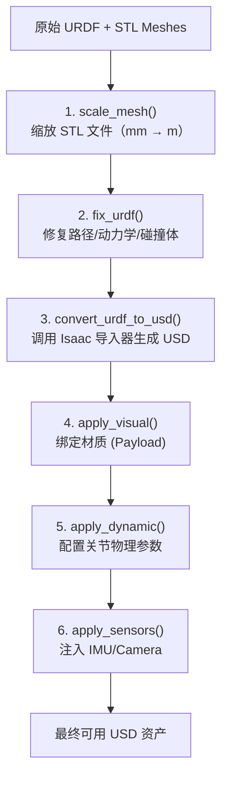

# URDF 转 USD 完整工程流程详解

> 从原始 URDF 文件到 Isaac Sim 可用的 USD 资产，完整走通 Mesh 缩放、URDF 修复、格式转换、材质绑定、物理参数配置、传感器注入的全流程。

## 知识链接

**前置知识**：
- URDF（Unified Robot Description Format）：ROS 生态中描述机器人运动学/动力学的 XML 格式
- USD（Universal Scene Description）：Pixar 开发的场景描述格式，NVIDIA Isaac Sim / Omniverse 的原生格式

**关联文章**：
- 本文代码来自 `embodied-arena` 项目中的 `scripts/tools/urdf_to_usd_converter.py`（通用转换库）、`convert_ultron_to_usd.py`（多变体批量转换）、以及 `robot_asset/MI/ARX_Lift2/convert_lift_to_usd.py`（单机器人转换示例）

---

## 一、为什么需要 URDF → USD 转换？

Isaac Sim / Isaac Lab 的物理仿真引擎（PhysX）原生使用 USD 格式描述场景中的所有物体。但绝大多数机器人厂商提供的模型文件是 URDF 格式（ROS 生态标准）。所以在做 sim-to-real 之前，第一步工程工作就是把 URDF 转成 USD。

**转换不是简单的格式翻译**——需要处理以下问题：
1. **Mesh 单位不一致**：很多 URDF 的 STL 文件用毫米建模，但 Isaac Sim 默认米制
2. **Mesh 路径引用方式不同**：URDF 用 `package://` 相对路径，USD 需要绝对路径或 payload 引用
3. **关节动力学参数需要重新配置**：URDF 中的 `<dynamics>` 标签映射到 USD 的 `DriveAPI` 时需要手动校准
4. **碰撞体/视觉体需要分层管理**：USD 支持 layer composition（分层合成），可以把基础模型、物理参数、传感器分成独立 layer
5. **传感器需要额外注入**：URDF 中的 IMU/Camera 定义不会被自动转换，需要手动创建 Isaac Sim sensor prim

---

## 二、整体 Pipeline 总览

整个转换流程分 **5 个阶段**，每个阶段对应一个核心函数：




下面逐阶段展开。

---

## 三、阶段 1：Mesh 缩放（scale_mesh）

### 3.1 问题背景

很多机器人 CAD 模型的 STL 文件是用**毫米**为单位建模的（SolidWorks 默认设置），但 Isaac Sim 的世界坐标系默认以**米**为单位。如果直接导入，机器人会变成 1000 倍大小。

### 3.2 解决方案

`scale_mesh()` 函数做的事情非常直接：把 meshes 目录整体复制一份，然后对每个 STL 文件应用 `1e-3` 的缩放因子。

```python
def scale_mesh(meshes_path: str) -> str:
    """复制 meshes 目录并将所有 STL 缩放 1e-3（mm → m）"""
    meshes_scaled_path = f"{meshes_path}_scaled"
    shutil.copytree(meshes_path, meshes_scaled_path, dirs_exist_ok=True)
    
    stl_files = glob.glob(f"{meshes_path}/**/*stl", recursive=True)
    for stl_file in tqdm.tqdm(stl_files, desc="Scaling meshes"):
        mesh = trimesh.load_mesh(stl_file)
        mesh.apply_scale(1e-3)  # 关键：毫米 → 米
        output_path = stl_file.replace(meshes_path, meshes_scaled_path)
        os.makedirs(os.path.dirname(output_path), exist_ok=True)
        mesh.export(output_path)
    
    return meshes_scaled_path
```

**为什么不在 URDF 中用 `<mesh scale="0.001 0.001 0.001">` 代替？** 可以，但有两个问题：
1. Isaac Sim 的 URDF importer 对 scale 属性的支持在不同版本间行为不一致
2. 物理碰撞体（convex hull）的计算基于实际顶点坐标，pre-scale 后碰撞更准确

### 3.3 注意事项

- `trimesh` 的 `apply_scale` 会修改所有顶点坐标，不仅是视觉几何
- 如果 STL 本身就是米制的（少数厂商如 Franka），**不需要缩放**，跳过此步
- 缩放后的目录命名为 `{原目录}_scaled`，不会覆盖原始文件

---

## 四、阶段 2：URDF 修复（fix_urdf）

这是整个流程中**最复杂也最容易出问题**的一步。`fix_urdf()` 要解决一系列 URDF 的兼容性问题。


### 4.1 修复 Mesh 路径引用

URDF 中的 mesh 引用通常写成 ROS 包路径：

```xml
<mesh filename="package://robot_description/meshes/arm_link1.stl"/>
```

Isaac Sim 不认识 `package://` 协议。`fix_urdf()` 把它替换为系统绝对路径：

```python
def _replace_mesh_paths(root, meshes_scaled_path):
    for mesh in root.findall(".//mesh"):
        filename = mesh.get("filename")
        # 将 package:// 路径替换为缩放后的绝对路径
        scaled = filename.replace(
            "package://robot_description/meshes", meshes_scaled_path
        )
        assert os.path.exists(scaled), f"Scaled mesh not found: {scaled}"
        mesh.set("filename", f"file://{scaled}")
        mesh.set("scale", "1 1 1")  # 已经 pre-scale 过了，这里设 1
```

**常见坑**：
- 有些 URDF 用相对路径（如 `../meshes/xxx.stl`）而不是 `package://`，需要额外用 `os.path.normpath` 拼接
- `file://` 前缀是 Isaac Sim URDF importer 要求的，不能省略

### 4.2 配置关节动力学参数

URDF 中的 `<dynamics>` 标签只有 `damping` 和 `friction` 两个属性，但 Isaac Sim 的关节驱动需要更精细的参数（stiffness、damping、effort limit、velocity limit、armature）。

`fix_urdf()` 接收一个 `joints_dynamic` 字典，格式为：

```python
joints_dynamic = {
    "joint_name": (kp, kd, effort, friction, max_vel, armature),
    # kp: 位置增益（stiffness）
    # kd: 速度增益（damping）
    # effort: 最大力矩
    # friction: 关节摩擦
    # max_vel: 最大角速度
    # armature: 电机惯量（减小仿真抖动）
}
```

代码将这些值写回 URDF 的 `<limit>` 和 `<dynamics>` 标签：

```python
def _apply_joint_dynamics(root, joints_dynamic, frictionloss):
    for joint_ele in root.findall(".//joint"):
        joint_name = joint_ele.get("name")
        if joint_name in joints_dynamic:
            kd = joints_dynamic[joint_name][1]
            effort = joints_dynamic[joint_name][2]
            friction = joints_dynamic[joint_name][3]
            max_vel = joints_dynamic[joint_name][4]
            
            limit_ele = joint_ele.find(".//limit")
            dynamics_ele = joint_ele.find(".//dynamics")
            
            if kd is not None:
                dynamics_ele.set("damping", f"{kd}")
            if effort is not None:
                limit_ele.set("effort", f"{effort}")
            if friction is not None:
                dynamics_ele.set("friction", f"{friction}")
            if max_vel is not None:
                limit_ele.set("velocity", f"{max_vel}")
```


### 4.3 处理 Mimic Joint 的限位扩展

URDF 中的 mimic joint（联动关节，如夹爪的主从指）会跟随源关节运动。问题是：mimic joint 自身的 `<limit>` 可能限制了它的运动范围，导致仿真中联动失败。

`fix_urdf()` 的策略是：根据源关节的限位和联动比例，自动扩展 mimic joint 的上限：

```python
# mimic joint 联动公式：θ_mimic = multiplier × θ_source + offset
# 所以 mimic 的上限应该是 src_upper × multiplier + offset
mimic_upper = src_upper * multiplier + offset
if joint_upper < mimic_upper:
    limit_ele.set("upper", f"{mimic_upper}")
    limit_ele.set("velocity", f"{src_vel * multiplier}")
```

**为什么需要这步？** 因为很多 URDF 导出工具不会自动同步 mimic joint 的限位和源关节的限位关系。如果不修复，仿真中夹爪会卡在一个不合理的角度。

### 4.4 固定关节、清除碰撞体、替换碰撞几何

`fix_urdf()` 还支持三个可选操作：

| 操作 | 参数 | 用途 |
|------|------|------|
| 固定关节 | `fixed_joints=["head_joint", "hand_joint"]` | 将指定关节类型改为 `fixed`，减少自由度（如固定头部） |
| 清除碰撞体 | `clear_collision_links=["l_finger1", "r_finger2"]` | 移除指定 link 的 `<collision>` 标签（手指碰撞体太密集会拖慢仿真） |
| 替换碰撞几何 | `basic_geom_dict={...}` | 用简单几何体（capsule/box/sphere）替换复杂 mesh 碰撞体，提升仿真性能 |

`basic_geom_dict` 的格式示例：

```python
BASIC_GEOM_DICT = {
    "upper_arm_link": [
        {"type": "capsule", "size": "0.04 0.15", "pos": "0 0 0.08", "euler": "0 0 0"},
    ],
    "forearm_link": [
        {"type": "box", "size": "0.03 0.03 0.12", "pos": "0 0 0.06", "euler": "0 0 0"},
    ],
}
```

**性能考量**：对于有 40+ 自由度的人形机器人（如 Ultron），如果每个 link 都用原始 mesh 做碰撞检测，PhysX 的碰撞检测开销会非常大。用基本几何体替代后，仿真帧率通常能提升 2-3 倍。

### 4.5 确保每个 Link 都有惯性属性

Isaac Sim 的 URDF importer 要求每个 link 都必须有 `<inertial>` 标签，否则导入会失败。但很多 URDF 的辅助 link（如传感器安装架）没有定义惯性。

`_ensure_inertials()` 函数给所有缺少 `<inertial>` 的 link 补一个极小的占位值：

```python
def _ensure_inertials(root):
    """给缺少 inertial 的 link 补一个极小的占位惯性"""
    inertia_xml = (
        "<inertial>"
        '  <origin xyz="0.0 0.0 0.0" rpy="0.0 0.0 0.0"/>'
        '  <mass value="0.0001"/>'
        '  <inertia ixx="1e-09" ixy="0.0" ixz="0.0" '
        '           iyy="1e-09" iyz="0.0" izz="1e-09"/>'
        "</inertial>"
    )
    for link_ele in root.findall(".//link"):
        if link_ele.find(".//inertial") is None:
            link_ele.insert(0, ET.fromstring(inertia_xml))
```

**注意**：`mass=0.0001` 和 `ixx=1e-09` 的值足够小，不会影响整体动力学，但又不是零（零质量会导致 PhysX 报错）。


### 4.6 输出修复后的 URDF

所有修改完成后，写入一个新文件（命名为 `*_fixed.urdf`），保留原始文件不动：

```python
print(f"Saving fixed urdf to {fixed_urdf_path}")
dump_urdf(root, fixed_urdf_path)
```

`dump_urdf()` 使用 `minidom` 做格式化输出，去掉空行，保证 XML 结构清晰可读。

---

## 五、阶段 3：URDF → USD 核心转换（convert_urdf_to_usd）

这是调用 Isaac Sim 内置 importer 的核心步骤。项目同时支持 **Isaac Sim 4.x/5.x**（旧接口）和 **Isaac Sim 6.x / Isaac Lab**（新接口）。

### 5.1 Isaac Sim 4.x/5.x 接口（`_urdf` 模块）

```python
from isaacsim.asset.importer.urdf import _urdf

def convert_urdf_to_usd(urdf_path, dest_path, fix_base, self_collision, joints_dynamic):
    urdf_interface = _urdf.acquire_urdf_interface()
    
    # 配置导入参数
    import_config = _urdf.ImportConfig()
    import_config.convex_decomp = False        # 不做凸分解（用原始碰撞体）
    import_config.collision_from_visuals = False  # 不从视觉体生成碰撞体
    import_config.fix_base = fix_base          # 是否固定机器人底座
    import_config.make_default_prim = True     # 设为 stage 默认 prim
    import_config.self_collision = self_collision
    import_config.distance_scale = 1           # mesh 已经是米制，不再缩放
    import_config.density = 0.0                # 不自动计算密度
    import_config.import_inertia_tensor = True # 使用 URDF 中的惯性张量
    import_config.merge_fixed_joints = False   # 不合并 fixed joint
    import_config.replace_cylinders_with_capsules = True  # 物理仿真中胶囊体更稳定
    
    # Step 1: 解析 URDF 到内存模型
    result, robot_model = omni.kit.commands.execute(
        "URDFParseFile",
        urdf_path=urdf_path,
        import_config=import_config,
    )
    
    # Step 2: 在内存中修改关节驱动参数
    if joints_dynamic is not None:
        for joint_name, urdf_joint in robot_model.joints.items():
            if urdf_joint.type == _urdf.UrdfJointType.JOINT_FIXED:
                continue
            if joint_name in joints_dynamic:
                urdf_joint.drive.strength = joints_dynamic[joint_name][0]  # kp
                urdf_joint.drive.damping = joints_dynamic[joint_name][1]   # kd
    
    # Step 3: 导入到 USD stage
    result, prim_path = omni.kit.commands.execute(
        "URDFImportRobot",
        urdf_robot=robot_model,
        import_config=import_config,
        dest_path=dest_path,
    )
    return result, prim_path, dest_path
```

### 5.2 Isaac Sim 6.x / Isaac Lab 接口（`UrdfConverter`）

Isaac Lab 提供了更高层的 `UrdfConverterCfg`，支持声明式配置：

```python
from isaaclab.sim.converters import UrdfConverter, UrdfConverterCfg

urdf_converter_cfg = UrdfConverterCfg(
    asset_path=urdf_path,
    usd_dir=f"{Path(dest_path).with_suffix('')}",
    force_usd_conversion=True,
    make_instanceable=True,           # 生成 instanceable USD（多实例共享几何）
    fix_base=False,
    link_density=0.0,
    merge_fixed_joints=False,
    joint_drive=UrdfConverterCfg.JointDriveCfg(
        gains=UrdfConverterCfg.JointDriveCfg.PDGainsCfg(
            stiffness=stiffness_map,   # dict: joint_name → kp
            damping=damping_map,       # dict: joint_name → kd
        ),
        target_type="position",
    ),
    collision_from_visuals=False,
    collision_type="Convex Hull",
    self_collision=False,
    replace_cylinders_with_capsules=True,
    merge_mesh=False,
)

urdf_converter = UrdfConverter(urdf_converter_cfg)
# 输出 USD 路径：urdf_converter.usd_path
```


### 5.3 两个版本的关键差异

| 特性 | Isaac Sim 4.x/5.x | Isaac Sim 6.x (Isaac Lab) |
|------|-------------------|--------------------------|
| API 入口 | `_urdf.acquire_urdf_interface()` | `UrdfConverter(cfg)` |
| 关节参数设置 | 解析后在 `robot_model` 上改 | 在 `cfg.joint_drive` 声明 |
| 输出结构 | 单个 `.usd` 文件 | 目录结构（含 payloads/） |
| Instanceable | 不支持 | 支持（`make_instanceable=True`） |
| fix_base 实现 | import_config 直接设置 | 转换后手动 deactivate root_joint |

### 5.4 ImportConfig 参数详解

| 参数 | 默认值 | 说明 |
|------|--------|------|
| `convex_decomp` | False | 是否对 mesh 做凸分解（V-HACD）。开启后碰撞更精确但转换慢 |
| `fix_base` | False | True = 添加 fixed joint 把底座钉在世界坐标系 |
| `merge_fixed_joints` | False | True = 把 fixed joint 连接的 link 合并为一个（减少 prim 数量） |
| `density` | 0.0 | 0 = 使用 URDF 中的质量；>0 = 用密度自动算质量 |
| `distance_scale` | 1.0 | 对所有坐标的额外缩放。mesh 已 pre-scale 时设 1 |
| `replace_cylinders_with_capsules` | True | PhysX 对胶囊体碰撞检测更快 |
| `self_collision` | False | 是否启用自碰撞检测（开启会显著降低仿真速度） |

---

## 六、阶段 4：材质绑定（apply_visual）

转换出的 USD 默认只有灰色几何体，没有材质。`apply_visual()` 负责把预制的材质 USD 文件绑定到机器人各个 link 上。

### 6.1 工作原理

Isaac Sim 的材质系统基于 USD 的 **Material Binding** 机制：
1. 在 robot prim 下创建一个 `/Looks` 或 `/VisualMaterials` scope
2. 用 `CreatePayload` 命令把外部材质 `.usd` 文件加载为 payload
3. 用 `BindMaterial` 命令把材质绑定到具体的 mesh prim

### 6.2 Visual Map 配置

`visual_map` 字典定义了"哪些 link 用什么材质"：

```python
VISUAL_MAP = {
    "arm_force": "metal_blue_01",     # 力传感器 link 用蓝色金属
    "leg1": "metal_black_01",         # 腿部 link 用黑色金属
    "head2": "rubber_black_01",       # 头部用黑色橡胶
    "thumb_ip": "rubber_black_01",    # 手指用黑色橡胶
    "default": "metal_white_01",      # 其他所有 link 用白色金属
}
```

匹配逻辑是**子字符串包含**——如果 link 名称包含 `"arm_force"`，就绑定 `metal_blue_01` 材质。`"default"` 是兜底。

### 6.3 代码核心逻辑

```python
def apply_visual(dest_path, prim_path, visual_map, visual_materials_dir):
    # 1. 打开 USD stage（base layer）
    open_stage(usd_file_path)
    stage = get_current_stage()
    
    # 2. 复制材质文件到输出目录
    shutil.copytree(visual_materials_dir, configuration_visual_dir, dirs_exist_ok=True)
    
    # 3. 为每种材质创建 Payload prim
    for mat_file in material_usd_names:
        mat_name = os.path.splitext(mat_file)[0]
        omni.kit.commands.execute(
            "CreatePayload",
            path_to=f"{prim_path}/Looks/{mat_name}",
            asset_path=mat_usd,
            usd_context=omni.usd.get_context(),
        )
    
    # 4. 遍历所有视觉 mesh，按 visual_map 规则绑定材质
    for child_name in visuals_prim.GetAllChildrenNames():
        for key, mat in visual_map.items():
            if key in child_name:
                omni.kit.commands.execute(
                    "BindMaterial",
                    material_path=f"{prim_path}/Looks/{mat}",
                    prim_path=[f"/meshes/{child_name}"],
                    strength=["strongerThanDescendants"],
                )
                break
    
    # 5. 保存并关闭
    stage.Save()
    close_stage()
```


### 6.4 Material Binding Strength

`BindMaterial` 的 `strength` 参数控制材质优先级：
- `strongerThanDescendants`：当前绑定覆盖子 prim 的绑定
- `weakerThanDescendants`：子 prim 的绑定优先

实际使用中，通常先用 `weakerThanDescendants` 给整个 link 设默认材质，再用 `strongerThanDescendants` 给特殊部件覆盖。

---

## 七、阶段 5：物理参数配置（apply_dynamic）

转换后的 USD 虽然有关节结构，但物理行为（摩擦、阻尼、碰撞过滤）需要精调。

### 7.1 碰撞过滤（Collision Filtering）

人形机器人有很多相邻 link 在物理上不应该碰撞（如大臂和小臂的连接处）。如果不过滤，PhysX 会在每帧检测大量不必要的碰撞对。

```python
# 用 UsdPhysics.FilteredPairsAPI 禁用指定碰撞对
for col_a, col_b in disable_collision_pairs:
    prim_a = prims.get_prim_at_path(f"{prim_path}/{col_a}")
    filt = UsdPhysics.FilteredPairsAPI.Apply(prim_a)
    filt.CreateFilteredPairsRel().AddTarget(f"{prim_path}/{col_b}")
```

`disable_collision_pairs` 是一个 tuple list，例如：
```python
DISABLE_COLLISION_PAIRS = [
    ("upper_arm_left", "forearm_left"),   # 大臂-小臂
    ("forearm_left", "hand_left"),         # 小臂-手
    ("hip_left", "thigh_left"),            # 髋-大腿
    # ... 通常有 30-50 对
]
```

### 7.2 物理材质（Physics Material）

不同部位需要不同的摩擦系数。比如脚底要高摩擦（防滑），手指关节面要低摩擦（灵活转动）：

```python
from isaacsim.core.api.materials import PhysicsMaterial
from isaacsim.core.prims import SingleGeometryPrim

# 高摩擦材质（脚底、橡胶件）
rubber_mat = PhysicsMaterial(
    prim_path=f"{prim_path}/Materials/rubber_physics_material",
    dynamic_friction=3.0,
    static_friction=3.0,
    restitution=0.0,  # 弹性系数 0 = 完全不弹
)

# 低摩擦材质（金属表面）
smooth_mat = PhysicsMaterial(
    prim_path=f"{prim_path}/Materials/smoothness_physics_material",
    dynamic_friction=0.0,
    static_friction=0.0,
    restitution=0.0,
)

# 按 link 名称绑定
for link_name in all_links:
    if link_name in rubber_links:
        SingleGeometryPrim(prim_path=f"{prim_path}/{link_name}").apply_physics_material(rubber_mat)
    elif link_name in smoothness_links:
        SingleGeometryPrim(prim_path=f"{prim_path}/{link_name}").apply_physics_material(smooth_mat)
```

### 7.3 关节 Armature 设置

Armature（电机惯量）是 PhysX 中一个重要的稳定性参数。它模拟真实电机的转子惯量，防止关节在高 stiffness 下数值振荡：

```python
# 对非轮子、非 mimic 的关节设置 armature
PhysxSchema.PhysxJointAPI(joint_prim).GetArmatureAttr().Set(0.01)
```

**经验值**：
- 小关节（手指）：`armature = 0.001 ~ 0.005`
- 中关节（手臂）：`armature = 0.01 ~ 0.05`
- 大关节（腿/腰）：`armature = 0.05 ~ 0.1`

值太大会让关节反应迟钝，太小会抖动。需要实验调参。

### 7.4 Mimic Joint 的自然频率清零

Isaac Sim 中 mimic joint 有 `naturalFrequency` 和 `dampingRatio` 参数，控制联动响应速度。在训练中通常希望联动是**瞬时的**（master 动，slave 立刻跟），所以把这两个值设为 0：

```python
if joint_prim.HasAPI(PhysxSchema.PhysxMimicJointAPI):
    schemas = joint_prim.GetAppliedSchemas()
    axis = [s for s in schemas if "MimicJointAPI" in s][-1].split(":")[-1]
    joint_prim.GetAttribute(f"physxMimicJoint:{axis}:naturalFrequency").Set(0)
    joint_prim.GetAttribute(f"physxMimicJoint:{axis}:dampingRatio").Set(0)
```


### 7.5 轮式底盘的特殊处理

对于移动底盘上带轮子的机器人（如 ARX Lift），轮子关节需要设置为**速度驱动**而不是位置驱动：

```python
# 轮子关节：stiffness=0（不做位置控制），高 damping（速度控制）
if joint_name in ["joint_wheel1", "joint_wheel2", "joint_wheel3"]:
    drive = UsdPhysics.DriveAPI.Get(joint_prim, "angular")
    drive.GetDampingAttr().Set(1500)      # 速度增益
    drive.GetStiffnessAttr().Set(0)       # 不做位置保持
```

**设计逻辑**：
- `stiffness=0` 表示不对角度做 PD 控制（轮子需要自由转动）
- 高 `damping` 表示通过目标速度来驱动（`set_joint_velocities`）

相比之下，手臂关节是位置驱动：
```python
# 手臂关节：高 stiffness + 适中 damping
drive.GetStiffnessAttr().Set(8000)
drive.GetDampingAttr().Set(800)
```

---

## 八、阶段 6：传感器注入（apply_sensors）

URDF 中可以定义 `<sensor>` 标签描述 IMU 和 Camera，但 Isaac Sim 的 URDF importer **不会自动创建对应的 sensor prim**。需要手动注入。

### 8.1 IMU 传感器

从 URDF 中解析 `<sensor type="imu">` 标签，在对应 link 下创建 `IMUSensor` prim：

```python
from isaacsim.sensors.physics import IMUSensor

tree = ET.parse(urdf_path)
root = tree.getroot()

for imu_sensor in root.findall('.//sensor[@type="imu"]'):
    imu_id = imu_sensor.get("id")
    imu_name = imu_sensor.get("name")
    update_rate = float(imu_sensor.get("update_rate", 100))
    parent_link = imu_sensor.find('.//parent').get("link")
    
    imu_frame_path = f"{prim_path}/{parent_link}"
    if not prims.is_prim_path_valid(imu_frame_path):
        stage.DefinePrim(imu_frame_path, "Xform")
    
    IMUSensor(
        prim_path=f"{imu_frame_path}/{imu_id}",
        name=imu_name,
        frequency=int(update_rate),
    )
```

### 8.2 Camera 方向修正

Isaac Sim 中 Camera prim 的默认朝向和 ROS 约定不同（Isaac 用 OpenGL 坐标系，ROS 用右手坐标系）。需要对所有 Camera prim 应用一个旋转修正：

```python
# 将 Camera 从 Isaac 默认坐标系旋转到 ROS 约定
gf_tf = Gf.Quatd(*rotations.euler_angles_to_quat(
    np.array([90, -90, 0]), degrees=True, extrinsic=False
))

for prim in stage.Traverse():
    if prim.GetTypeName() == "Camera" and pp.startswith(prim_path):
        xform = UsdGeom.Xformable(prim)
        orient_attr = prim.GetAttribute("xformOp:orient")
        if not orient_attr:
            xform.AddOrientOp().Set(gf_tf)
        else:
            current = orient_attr.Get()
            orient_attr.Set(current * gf_tf)  # 在原有旋转基础上叠加
```

同时锁定 Camera 防止在编辑器中被意外移动：

```python
omni.kit.commands.execute(
    "ChangePropertyCommand",
    prop_path=Sdf.Path(f"{pp}.omni:kit:cameraLock"),
    value=True,
    prev=None,
    type_to_create_if_not_exist=Sdf.ValueTypeNames.Bool,
)
```

---

## 九、进阶：多变体批量转换（convert_ultron_to_usd）

对于复杂的人形机器人，通常需要生成**多个 USD 变体**用于不同场景：

| 变体 | 用途 | 关键配置 |
|------|------|----------|
| `_fixed_head_hand_all_convex_hull.usd` | RL 训练（速度优先） | 固定头/手、convex hull 碰撞 |
| `_fixed_head_hand.usd` | RL 训练（basic geom） | 固定头/手、简化碰撞体 |
| `_fixed_head_hand_kp0_kd0.1.usd` | 力矩控制实验 | kp=0（纯阻尼驱动） |
| `_l_hand.usd` / `_r_hand.usd` | 灵巧手单独训练 | 只含单手 URDF |
| `_l_hand_fixed.usd` | 手部抓取训练 | 手腕固定 |
| 完整机器人 `.usd` | 全身控制 | 所有关节可动 |
| `_kp0_kd0.1.usd` | 全身力矩控制 | 全局 kp=0 |

`convert_all_variants()` 函数一次生成 8 个变体：

```python
def convert_all_variants(urdf_path, dest_path, ...):
    # 1. 缩放 mesh（只做一次）
    meshes_scaled_path = scale_mesh(meshes_relative_path)
    
    # 2-3. 固定头手变体（convex hull / basic geom）
    # 4-7. 左右手单独变体（fixed / unfixed）
    # 8. 完整机器人变体 + kp0 版本
    ...
```


### 9.1 kp=0 变体的设计动机

将所有关节的 stiffness（kp）设为 0，只保留一个小 damping（kd=0.1），是为了做**力矩控制**实验。在这种模式下：
- 机器人不做位置保持（没有弹簧力）
- 只有阻尼力（运动时的"粘滞"阻力）
- RL 策略直接输出力矩值，通过 `set_joint_efforts()` 驱动关节

这比位置驱动更接近真实硬件的低级控制接口。

### 9.2 单手变体的生成

为了训练灵巧手，需要把完整 URDF 中的手部子树拆出来作为独立机器人。`_build_hand_urdf()` 函数：

1. 创建一个新的 `<robot>` 根节点
2. 添加 6-DOF 浮动基座（x/y/z 平移 + roll/pitch/yaw 旋转）用于自由移动手部
3. 从原始 URDF 中复制所有手部 link 和 joint
4. 另外生成一个 `_fixed` 版本（手腕固定在世界坐标系）

---

## 十、使用方式

### 10.1 单机器人转换（如 ARX Lift）

```bash
# 需要在 Isaac Sim 的 Python 环境中运行
cd robot_asset/MI/ARX_Lift2/
python convert_lift_to_usd.py
```

脚本会自动执行完整 pipeline 并启动仿真预览。

### 10.2 多变体批量转换（如 Ultron 人形）

```bash
# 指定版本和路径
python scripts/tools/convert_ultron_to_usd.py \
    --version EVT_V2.0 \
    --urdf-root /path/to/Ultron \
    --output-dir /path/to/output \
    --headless \
    --no-sim
```

命令行参数：
- `--version`：硬件版本号（决定加载哪个 URDF 和配置）
- `--headless`：无头模式（不打开 GUI）
- `--no-sim`：跳过仿真预览（只生成 USD）
- `--fix-base`：固定底座（人形站立训练时使用）
- `--self-collision`：启用自碰撞

---

## 十一、常见问题与排坑

### 问题 1：导入后机器人大小不对

**症状**：机器人巨大（1000 倍）或极小。

**原因**：Mesh 单位和 `distance_scale` 不匹配。

**解决**：
- 确认 STL 是什么单位建模的（看 mesh 顶点坐标范围，如果 link 长度是 100-300，说明是毫米）
- 毫米建模 → 必须先 `scale_mesh()`，且 `import_config.distance_scale = 1`
- 米制建模 → 跳过 `scale_mesh()`

### 问题 2：关节不动 / 关节疯狂抖动

**症状**：`set_joint_positions()` 后机器人不动，或者剧烈震荡。

**原因**：
- 不动：kp 和 kd 都是 0，或者关节类型错误（被设成了 fixed）
- 抖动：kp 太大而 armature 太小，数值不稳定

**解决**：
- 检查 `joints_dynamic` 中的 kp/kd 值是否合理（通常 kp=1000~10000, kd=100~1000）
- 增加 armature（0.01~0.1）
- 降低仿真 timestep（在 PhysxScene 中设 `physxScene:timeStepsPerSecond` 为 240 或更高）

### 问题 3：碰撞体穿透

**症状**：机器人手指穿过物体、脚陷入地面。

**原因**：碰撞体太薄或网格质量差。

**解决**：
- 用 `replace_cylinders_with_capsules=True`（胶囊体碰撞检测更稳）
- 用 `basic_geom_dict` 替换复杂 mesh 碰撞体
- 增加 PhysX 的碰撞检测迭代次数：`position_iteration_count=16`

### 问题 4：Mesh 文件找不到

**症状**：`FileNotFoundError: Mesh file not found: /path/to/xxx.stl`

**原因**：路径映射失败。

**解决**：
- 确认 URDF 中的 `filename` 字段和实际文件系统路径对应
- 确认 `scale_mesh()` 的输入目录正确
- `fix_urdf()` 会输出修复后的路径，用 XML 编辑器检查 `_fixed.urdf` 中的路径是否正确

### 问题 5：Isaac Sim 版本不兼容

**症状**：`ImportError` 或 API 签名变了。

**原因**：Isaac Sim 4.x → 5.x → 6.x 的 URDF importer API 有 breaking change。

**解决**：代码中通过版本检测做分支处理：
```python
from importlib.metadata import version as pkg_version
_isaacsim_version = pkg_version("isaacsim")
is_isaacsim_6 = _isaacsim_version.startswith("6")
```

---

## 十二、USD Layer 架构设计（Isaac Sim 4.x/5.x）

Isaac Sim 4.x/5.x 的转换输出采用**分层 USD 架构**：

```
robot_name/
├── robot_name.usd              # 主入口（reference 下面的层）
└── configuration/
    ├── robot_name_base.usd     # 基础几何 + 关节结构
    ├── robot_name_physics.usd  # 物理参数（驱动、碰撞过滤）
    └── robot_name_sensor.usd   # 传感器定义
```

Isaac Sim 6.x 则输出：
```
robot_name/
├── robot_name.usd              # 主入口
├── payloads/
│   └── base.usda               # 几何 payload（instanceable）
└── ...
```

分层的好处是可以**独立修改某一层**而不影响其他层。比如调关节参数只需要编辑 `_physics.usd`，不用重新转换整个 URDF。

---

## 十三、总结

| 阶段 | 函数 | 输入 | 输出 | 核心作用 |
|------|------|------|------|----------|
| 1 | `scale_mesh()` | meshes 目录 | meshes_scaled 目录 | mm → m |
| 2 | `fix_urdf()` | 原始 URDF | _fixed.urdf | 修路径/动力学/碰撞/惯性 |
| 3 | `convert_urdf_to_usd()` | fixed URDF | .usd 文件 | 格式转换 + 关节驱动 |
| 4 | `apply_visual()` | .usd + 材质文件 | 更新 base layer | 外观材质 |
| 5 | `apply_dynamic()` | .usd + 物理配置 | 更新 physics layer | 碰撞/摩擦/armature |
| 6 | `apply_sensors()` | .usd + URDF(传感器定义) | 更新 sensor layer | IMU/Camera |

整个流程是**幂等的**——每次运行都会覆盖之前的输出。修改了 URDF 或配置后，重新跑一遍即可得到更新的 USD。

**关键设计决策**：
1. Mesh pre-scaling 而非运行时 scale → 碰撞更准确
2. 在 URDF 层面修改动力学参数再导入，而非导入后在 USD 层面改 → 保证一致性
3. 分层 USD 架构 → 允许独立迭代视觉/物理/传感器配置
4. 多变体生成 → 一套 URDF 满足 RL 训练、手部训练、力矩控制等不同需求
