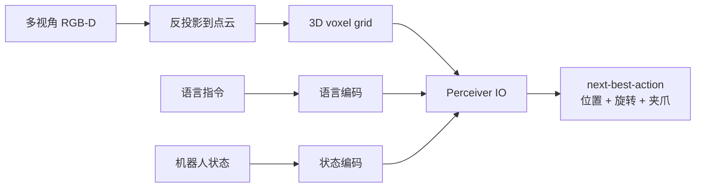
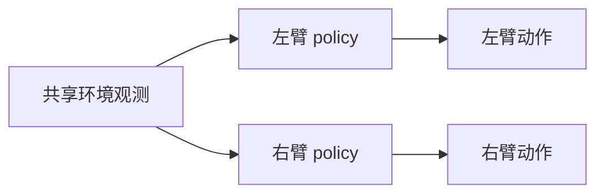
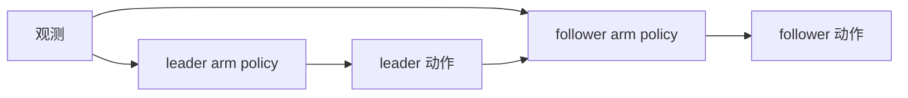
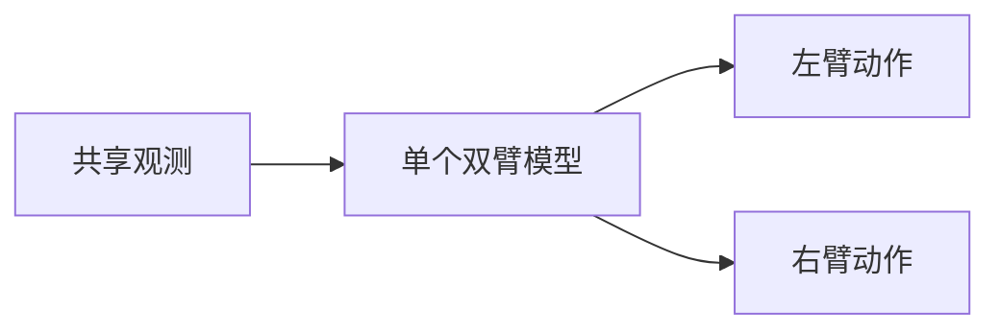
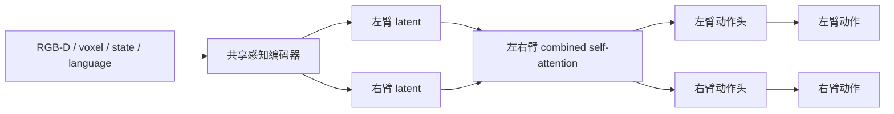
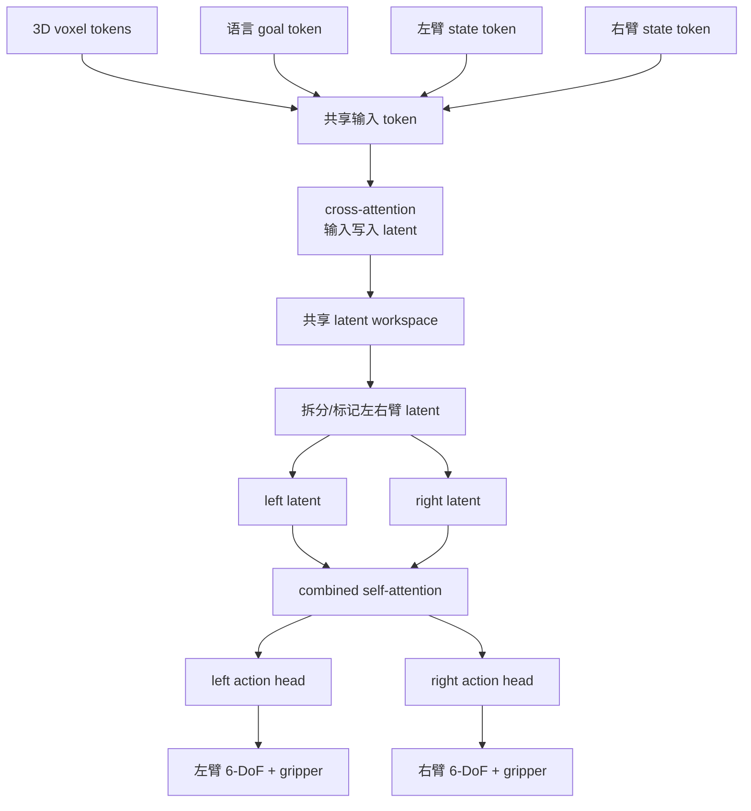
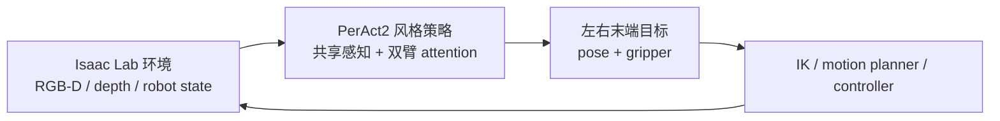

# 从 ACT 到 PerAct2：为什么双臂需要显式 Coordination

本文是一篇面向工程实现的中文教学笔记，目标是把双臂模仿学习里一条常见技术路线讲清楚：

1. ACT：用 Transformer 一次预测一段动作，解决高频控制和人类示教噪声问题。
2. PerAct：把 RGB-D 观测变成 3D voxel token，用 Perceiver-Actor 做语言条件的 next-best-action 预测。
3. PerAct2：面向双臂任务，把左右手的决策放进同一个共享感知和显式交互结构里。

参考论文：

- ACT / ALOHA: *Learning Fine-Grained Bimanual Manipulation with Low-Cost Hardware*  
  https://arxiv.org/abs/2304.13705
- PerAct: *Perceiver-Actor: A Multi-Task Transformer for Robotic Manipulation*  
  https://arxiv.org/abs/2209.05451
- PerAct2: *Benchmarking and Learning for Robotic Bimanual Manipulation Tasks*, arXiv:2407.00278  
  https://arxiv.org/abs/2407.00278
- PerAct2 project website: https://bimanual.github.io

## 1. 先看问题：为什么单臂方法直接复制两份不够

很多双臂任务看起来可以拆成“左臂一个 policy，右臂一个 policy”：

```text
左相机/全局图像 -> 左臂 policy -> 左臂动作
右相机/全局图像 -> 右臂 policy -> 右臂动作
```

但双臂操作的核心难点不是“多了一个机械臂”，而是两只手之间存在强耦合。

例如：

- 搬一个托盘：左手和右手的末端位姿必须保持相对稳定。
- 开瓶盖：一只手固定瓶身，另一只手旋转瓶盖。
- 折叠布料：一只手抓角，另一只手配合拉平。
- 插入或装配：一只手扶住零件，另一只手对准并推进。

这些任务里，动作正确性通常取决于“另一只手正在做什么”。如果两只手只通过环境状态间接通信，策略会面临几个问题：

- 左手不知道右手下一步要去哪里。
- 右手不知道左手是否已经稳定住物体。
- 两个 policy 的误差会相互放大。
- 遇到角色切换时，固定分工会失效。

所以，双臂学习需要显式 coordination：模型内部必须有一个地方，让左右臂的状态、意图、候选动作互相看见。

## 2. ACT：从“预测一个动作”到“预测一段动作”

ACT 的全称通常指 Action Chunking with Transformers。它来自 ALOHA 系列工作，核心想法很直接：

> 不要每个控制步只预测一个动作，而是一次预测未来一小段动作序列。

### 2.1 普通行为克隆的问题

最朴素的行为克隆是：

```text
观测 o_t -> policy -> 动作 a_t
```

训练目标：

```text
min || policy(o_t) - a_t^demo ||
```

这在机械臂任务里容易遇到三个问题：

1. 人类示教动作有抖动，同一个观测附近可能对应多个微小不同动作。
2. 高频闭环控制下，单步误差会快速累计。
3. 如果动作很精细，模型每一步都要重新决定下一小步，容易不稳定。

### 2.2 ACT 的动作块

ACT 改成：

$$
观测 o_t -> policy -> [a_t, a_{t+1}, ..., a_{t+k-1}]
$$

也就是一次预测长度为 `k` 的 action chunk。执行时可以只执行其中前几步，或者用时间加权的方式融合连续预测结果。


这件事的意义是：模型不是只学“下一帧怎么动”，而是学一个短时运动片段。对于擦拭、插入、夹取、移动这类连续操作，动作块比单步动作更接近人类示教里的运动单元。

### 2.3 ACT 为什么用 CVAE

同一个观测下，人类可能有多种合理动作。例如抓杯子可以从左侧靠近，也可以从右侧靠近。ACT 用 CVAE 引入 latent variable `z`，让模型能表达多模态示教：

```text
训练时:
观测 o_t + 未来动作块 A_t -> encoder -> z
观测 o_t + z -> decoder -> 预测动作块

推理时:
观测 o_t + z=0 或采样 z -> decoder -> 预测动作块
```

简化公式：

$$
L = L_action + beta * KL(q(z | o, A) || N(0, I))
$$

其中：

- `L_action` 让预测动作块接近示教动作块。
- `KL` 让 latent 空间可采样、可泛化。
- `beta` 控制动作重建和 latent 正则之间的平衡。

### 2.4 ACT 适合什么，不适合什么

ACT 很适合低成本双臂遥操作数据，因为它能把高频、带噪声的示教动作压成短时动作块。但 ACT 的默认输入通常是图像特征和 proprioception，输出是连续关节或末端动作序列。它没有天然解决两个问题：

1. 如何在 3D 空间里精确找操作位置。
2. 如何让左右臂在模型内部显式交换信息。

这就是从 ACT 走向 PerAct / PerAct2 的原因。

## 3. PerAct：把操作变成 3D 空间里的 next-best-action

PerAct 的出发点和 ACT 不一样。它更像是在问：

> 给定 RGB-D、语言指令和机器人状态，下一次关键动作应该发生在 3D 空间的哪个位置、哪个方向、夹爪开合状态是什么？

### 3.1 从 RGB-D 到 voxel

PerAct 会把多视角 RGB-D 观测投影到 3D voxel grid。每个 voxel 可以包含颜色、占用、位置等信息。语言指令也会被编码后注入模型。



它的优势是空间结构更明确。比如“把红色方块放到抽屉里”，模型可以在 voxel grid 上直接学习哪里是红色方块、哪里是抽屉、下一步应该抓哪里。

### 3.2 Perceiver IO 的作用

3D voxel token 很多，直接用标准 Transformer 做全局 attention 成本很高。Perceiver IO 的套路是引入一组 latent token：

```text
输入 token 很多: voxel tokens + language tokens + state tokens
latent token 较少: 模型内部的压缩工作空间
```

处理流程：

```text
输入 token -> cross-attention -> latent token
latent token -> self-attention -> latent token
latent token -> output query -> 动作预测
```

可以理解为：Perceiver IO 不是让所有 voxel 彼此直接全连接，而是让一个较小的 latent workspace 去吸收、整合和输出信息。

### 3.3 PerAct 的动作表示

PerAct 常见做法是离散化动作：

- 平移：预测 voxel grid 里的一个位置。
- 旋转：把 3D rotation 离散成若干 bins。
- 夹爪：open / close。
- 碰撞或可达性：可以作为额外预测项。

这和 ACT 输出连续 action chunk 很不一样：

```text
ACT:
o_t -> 连续动作序列 [a_t ... a_{t+k-1}]

PerAct:
RGB-D + language + state -> 一个离散 next-best-action
```

## 4. 双臂学习的四种典型结构

PerAct2 的价值之一，是把双臂学习里几种常见思路摆到一起比较。可以从信息流角度理解。

### 4.1 两个独立单臂 agent



优点：

- 结构简单。
- 可以复用单臂模型。
- 左右臂训练和调试相对独立。

问题：

- 左右臂没有内部通信。
- coordination 只能通过下一帧环境状态间接发生。
- 同步搬运、对向插入、递交物体时容易冲突。

这种方法隐含假设是：只要两只手都看见环境，就能自己学会配合。但很多任务需要知道对方的“意图”，仅看当前状态不够。

### 4.2 Leader-follower



优点：

- 比独立 agent 多了显式依赖。
- 适合角色固定的任务，比如左手固定、右手操作。

问题：

- 角色容易被写死。
- 如果任务中途需要换主从，结构会变别扭。
- follower 往往是在补偿 leader，而不是两只手共同规划。

### 4.3 单个双臂模型联合预测



优点：

- 模型天然能看到全局信息。
- 输出左右动作时可以联合建模。

问题：

- 如果动作头完全混在一起，左右臂的结构差异不清楚。
- 如果没有专门的交互模块，模型未必会学到稳定 coordination。
- 输出空间变大，学习难度可能上升。

### 4.4 共享感知 + 左右动作头 + 显式 attention 交互

这是 PerAct2 更有启发性的方向：



这个结构同时保留三件事：

1. 共享感知：两只手对同一个物体、场景和语言目标建立一致理解。
2. 分臂动作头：左手和右手仍然各自输出自己的动作。
3. 显式通信：中间的 attention 让左右臂 latent 互相读取信息。

这比“两个 agent 各看各的”更强，也比“固定 leader-follower”更灵活。

## 5. PerAct2 具体做了什么

PerAct2 可以理解为 PerAct 的双臂扩展，但重点不是简单复制两个 PerAct。

论文中的关键设计包括：

- 输入仍然使用 3D voxel 表征、语言目标和机器人本体状态。
- 使用共享的 Perceiver IO backbone 处理感知信息。
- 在模型内部区分左臂 latent 和右臂 latent。
- 通过 combined self-attention 建模两臂之间的信息交互。
- 输出左右臂各自的离散 6-DoF 动作。

### 5.1 输入是什么

一个典型输入可以写成：

```text
O = {
  voxel_grid,
  language_goal,
  left_arm_state,
  right_arm_state,
  timestep_or_task_context
}
```

其中 `voxel_grid` 来自多视角 RGB-D 或点云融合，`left_arm_state` 和 `right_arm_state` 包含末端位姿、夹爪状态、关节状态等。

### 5.2 模型信息流

下面是一个抽象版的 PerAct2 信息流：



这里最重要的是 `combined self-attention`。它让左臂 latent 和右臂 latent 不再是两个隔离分支，而是在预测动作前互相交换信息。

### 5.3 Attention 交换的到底是什么

可以把左臂 latent 和右臂 latent 想成两组 token：

$$
Z_left  = [l_1, l_2, ..., l_m]
Z_right = [r_1, r_2, ..., r_n]
Z_both  = [l_1, ..., l_m, r_1, ..., r_n]
$$

combined self-attention 做的是：

$$
Z_both' = SelfAttention(Z_both)
$$

因此更新后的左臂 token `l_i'` 可以 attend 到右臂 token `r_j`，右臂 token `r_j'` 也可以 attend 到左臂 token `l_i`。

这件事在语义上等价于：

- 左臂预测抓取点时，可以知道右臂是否也要抓同一个物体。
- 右臂预测移动方向时，可以知道左臂是否正在固定物体。
- 两臂共同搬运时，可以在 latent 层协调相对位姿。
- 任务角色切换时，不需要固定谁是 leader。

### 5.4 输出是什么

PerAct2 延续 PerAct 风格，通常不是直接输出低层连续控制，而是输出每只手的高层离散动作：

$$
left_action = {
  translation_bin,
  rotation_bin,
  gripper_open_close,
  optional_collision_or_ignore_flag
}

right_action = {
  translation_bin,
  rotation_bin,
  gripper_open_close,
  optional_collision_or_ignore_flag
}
$$

再由 motion planner、IK 或低层控制器把这些离散目标转成实际轨迹。

## 6. 从 ACT 过渡到 PerAct2：思想上的连续性

ACT 和 PerAct2 看起来差异很大，但它们都在解决同一个大问题：如何让模仿学习输出更稳定、更结构化的机器人动作。

| 维度 | ACT | PerAct | PerAct2 |
|---|---|---|---|
| 输入 | 图像、关节状态 | RGB-D voxel、语言、状态 | RGB-D voxel、语言、左右臂状态 |
| 输出 | 连续 action chunk | 单臂 next-best-action | 双臂 next-best-action |
| 时间建模 | 一次预测未来动作块 | 多步执行关键动作 | 多步执行双臂关键动作 |
| 空间建模 | 由图像 encoder 隐式学习 | 显式 3D voxel | 显式 3D voxel |
| 双臂关系 | 可输出双臂动作，但 coordination 结构弱 | 主要面向单臂 | 显式左右臂 attention |
| 适合场景 | 高频遥操作、精细动作 | 语言条件桌面操作 | 双臂协作、角色切换、同步操作 |

可以这样理解：

```text
ACT 解决“动作怎么连续稳定”
PerAct 解决“动作应该发生在 3D 空间哪里”
PerAct2 解决“两只手如何在同一个 3D 任务里协作”
```

如果从 ACT 出发改到 PerAct2，最关键的变化不是简单把输出维度从一只手变成两只手，而是：

1. 把 2D 图像特征升级为 3D voxel token。
2. 把连续动作块改为离散关键动作或高层末端目标。
3. 把单个动作 decoder 改为左右臂动作头。
4. 在左右臂动作头之前加入显式 attention 交互。

## 7. 工程实现草图

下面是一份简化伪代码，用来说明 PerAct2 类模型的核心结构。它不是论文代码，只表达模块关系。

```python
class BimanualPerAct2Policy(nn.Module):
    def __init__(self, voxel_encoder, language_encoder, perceiver, coord_blocks, action_heads):
        super().__init__()
        self.voxel_encoder = voxel_encoder
        self.language_encoder = language_encoder
        self.perceiver = perceiver
        self.coord_blocks = coord_blocks
        self.left_head = action_heads["left"]
        self.right_head = action_heads["right"]

    def forward(self, obs):
        voxel_tokens = self.voxel_encoder(obs["rgbd"])
        language_tokens = self.language_encoder(obs["language"])
        left_state = encode_state(obs["left_arm_state"], arm="left")
        right_state = encode_state(obs["right_arm_state"], arm="right")

        input_tokens = concat_tokens(
            voxel_tokens,
            language_tokens,
            left_state,
            right_state,
        )

        shared_latent = self.perceiver(input_tokens)
        left_latent, right_latent = split_arm_latents(shared_latent)

        both_latent = concat_tokens(left_latent, right_latent)
        both_latent = self.coord_blocks(both_latent)
        left_latent, right_latent = split_arm_latents(both_latent)

        left_action_logits = self.left_head(left_latent)
        right_action_logits = self.right_head(right_latent)

        return {
            "left": left_action_logits,
            "right": right_action_logits,
        }
```

训练时，左右臂动作都有监督信号：

```text
L = L_left_translation
  + L_left_rotation
  + L_left_gripper
  + L_right_translation
  + L_right_rotation
  + L_right_gripper
```

如果任务中某只手暂时不动，可以显式加入 `no-op` 或 `ignore` 类别，而不是强迫它每一步都预测一个有效操作。

## 8. 为什么 attention 比固定规则更合适

双臂任务经常出现动态角色：

```text
阶段 1: 左手扶住物体，右手打开
阶段 2: 右手扶住物体，左手换抓
阶段 3: 两只手一起搬运
阶段 4: 左手释放，右手放置
```

如果用固定 leader-follower，需要提前决定谁是主臂，这会把任务假设写死。Attention 的好处是让角色关系成为数据驱动的动态结果：

- 当左手更关键时，右手 latent 可以更多 attend 左手 latent。
- 当右手更关键时，左手 latent 可以更多 attend 右手 latent。
- 当两手共同搬运时，双方可以互相 attend。
- 当某只手空闲时，另一只手不必被强制依赖它。

这就是“显式 coordination”的含义：不是写规则说谁跟谁，而是在模型结构里提供通信通道，让数据决定什么时候通信、通信什么。

## 9. 和 embodied-arena / Isaac Lab 任务的关系

如果在 embodied-arena 这类仿真平台里落地 PerAct2 思路，可以把系统拆成三层：



数据接口可以设计为：

```python
obs = {
    "rgb": multi_view_rgb,
    "depth": multi_view_depth,
    "camera_extrinsics": camera_extrinsics,
    "language": task_instruction,
    "left_ee_pose": left_ee_pose_xyzw,
    "right_ee_pose": right_ee_pose_xyzw,
    "left_gripper": left_gripper_state,
    "right_gripper": right_gripper_state,
}
```

注意 Isaac Lab / Isaac Sim 新版四元数顺序应使用 `[x, y, z, w]`。如果策略输出末端旋转，训练标签、网络输出、控制器输入都要保持同一种顺序，避免左乘右乘或 `wxyz/xyzw` 混用造成旋转错误。

## 10. 实践建议

做一个 PerAct2 风格双臂 policy 时，不建议一开始就追求完整论文复现。更稳的工程路径是：

1. 先做双臂数据格式统一：左右末端 pose、gripper、相机参数、语言或任务 id。
2. 再做单臂 PerAct 风格 next-best-action，确认 voxel、动作离散化和 planner 链路可用。
3. 扩展为共享 backbone + 左右动作头，确认双臂输出可以训练。
4. 加入左右 latent combined self-attention，对比没有 coordination block 的版本。
5. 最后比较独立双 agent、leader-follower、联合模型、attention coordination 四类结构。

最重要的 ablation 是：

```text
共享感知是否有帮助？
左右动作头是否比单个混合动作头更稳定？
coordination attention 是否比没有交互更好？
固定 leader-follower 是否在角色切换任务中退化？
```

## 11. 一句话总结

ACT 告诉我们：机器人模仿学习不要只看单步动作，要学短时动作结构。

PerAct 告诉我们：操作动作最好落在显式 3D 空间里，而不是只靠 2D 图像隐式猜。

PerAct2 告诉我们：双臂不是两个单臂的并排相加，两只手需要在模型内部显式通信；共享感知、分臂动作头和 attention coordination 是一个很自然也很实用的结构。
