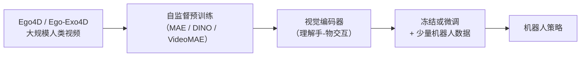
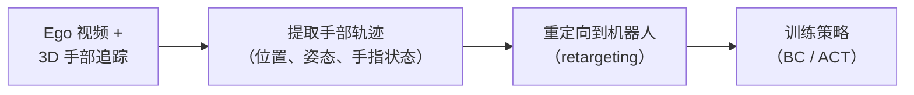
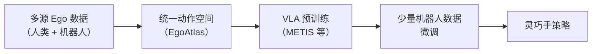
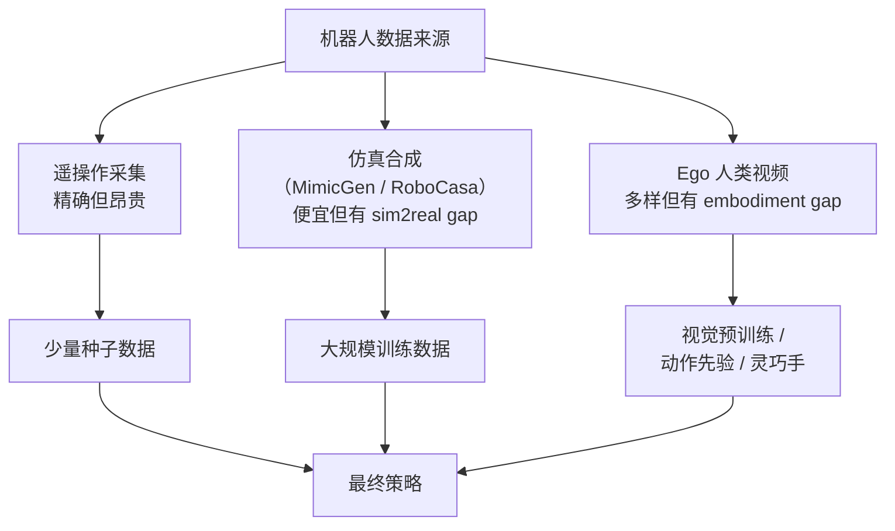

# Ego 数据在机器人操作中的应用：从 Ego4D 到 EgoDex

> **一句话概括**：利用大规模第一人称（Ego）人类操作视频来训练机器人策略，是解决机器人数据稀缺的另一条路线——不需要遥操作机器人，而是直接从人类日常活动视频中学习操作技能。

**核心项目**：
- **Ego4D**：Meta 主导的 3,670 小时第一人称视频数据集 — [ego4d-data.org](https://ego4d-data.org/)
- **Ego-Exo4D**：同时包含第一/第三人称视角的 1,286 小时数据 — [arXiv:2311.18259](https://arxiv.org/abs/2311.18259)（CVPR 2024）
- **EgoDex**：829 小时 Ego 视频 + 3D 手部关节追踪 — [arXiv:2505.11709](https://arxiv.org/abs/2505.11709)（2025）
- **METIS**：多源 Ego 数据预训练灵巧手 VLA — [arXiv:2511.17366](https://arxiv.org/abs/2511.17366)

**知识链接**：
- [视觉-语言-动作模型 VLA 综述](/论文综述/S03_视觉语言动作模型VLA综述) — VLA 模型如何使用视频预训练
- [机器人模仿学习综述](/论文综述/S02_机器人模仿学习综述) — 模仿学习的数据来源全景
- [MimicGen 少量示教合成大规模数据](./MimicGen_少量示教合成大规模数据) — 另一条数据路线的对比

---

## 一、为什么要用 Ego 数据

### 1.1 机器人数据 vs 人类视频数据

| 维度 | 机器人遥操作数据 | 互联网人类视频 | Ego 操作视频 |
|------|----------------|--------------|-------------|
| 规模 | 数百~数万小时 | 数百万小时 | 数千小时（标注精细） |
| 动作标注 | ✅ 关节/末端精确 | ❌ 无动作标注 | ⚠️ 需提取 |
| 视角 | 固定相机 | 任意 | 第一人称（手部中心） |
| 操作多样性 | 窄（实验室任务） | 极广 | 广（日常活动） |
| 采集成本 | 极高 | 零（已有） | 中（需穿戴设备） |

**核心矛盾**：互联网视频量大但没有动作标注；机器人数据有标注但量小。Ego 数据试图找到平衡点——穿戴设备采集，可以追踪手部 3D 姿态，同时保持人类日常操作的多样性。

### 1.2 Ego 视角的特殊优势

第一人称视角有几个对机器人特别有价值的特性：

1. **手部中心**：相机固定在头部，手和操作区域始终在视野中心，类似机器人腕部相机
2. **注视信息**：人看哪里就是注意力所在，隐含了任务规划信息
3. **物体交互丰富**：日常生活中人类持续在操作物体，数据效率极高
4. **多样性极大**：不同人、不同厨房、不同工具，天然做了"域随机化"

---

## 二、关键数据集

### 2.1 Ego4D（2022）

Meta 联合 13 所大学发布的基础数据集：

- **规模**：3,670 小时，来自 931 个参与者
- **场景**：9 个国家的日常生活
- **标注**：自然语言描述、时间对齐的活动标签
- **局限**：**没有 3D 手部姿态**，只有 2D 视频，不能直接作为机器人动作标签

**对机器人的价值**：主要用于**视觉预训练**——让模型理解"人怎么和物体交互"的视觉模式，然后迁移到机器人。

### 2.2 Ego-Exo4D（2024，CVPR）

在 Ego4D 基础上的重大升级：

- **规模**：1,286 小时，740 个参与者
- **关键改进**：每个场景同时有 **Ego（第一人称）+ Exo（第三人称）** 多视角
- **标注更丰富**：3D 身体姿态估计、手部关节位置、expert commentary
- **活动类型**：技能型活动（运动、音乐、烹饪、修理）

**对机器人的价值**：
- Ego-Exo 配对让模型学会**视角转换**——从第三人称观察理解、到第一人称执行
- 3D 手部姿态可以作为灵巧手操作的粗略动作标签
- 有研究直接用 Ego-Exo4D 的操作演示来增强 VLM 的空间推理能力

### 2.3 EgoDex（2025）

专门面向灵巧操作学习设计的 Ego 数据集：

- **规模**：829 小时
- **关键特性**：同步的 **3D 手部 + 每根手指关节追踪**
- **采集方式**：多个校准相机 + 设备 SLAM 精确追踪每个手指关节
- **任务**：194 种灵巧操作任务
- **动作精度**：亚厘米级手部追踪

**对机器人的价值**：这是第一个规模足够大、精度足够高、可以直接用于训练灵巧手策略的 Ego 数据集。

| 数据集 | 规模 | 3D 手部追踪 | 手指级精度 | 适合任务 |
|--------|------|------------|-----------|---------|
| Ego4D | 3,670h | ❌ | ❌ | 视觉预训练 |
| Ego-Exo4D | 1,286h | ⚠️ 粗略 | ❌ | 视角理解 + 粗操作 |
| EgoDex | 829h | ✅ | ✅ | 灵巧手策略 |

---

## 三、从 Ego 数据到机器人策略的技术路线

### 3.1 路线 A：视觉表示预训练

最保守但最成熟的用法：用 Ego 视频预训练视觉编码器，然后迁移到机器人任务。

**代表工作**：R3M、MVP、VIP 等都用 Ego4D 做预训练，报告在下游机器人任务上提升 20~40%。

**优点**：不需要从视频中提取精确动作；视觉表示通用性强
**缺点**：没有利用到动作/运动信息；需要额外的机器人数据做策略训练

### 3.2 路线 B：手部轨迹作为动作标签

从 Ego 视频中提取 3D 手部运动轨迹，直接作为机器人末端执行器的动作标签。

**核心挑战**：
1. **Embodiment gap**：人手有 27 DoF，机器人手可能只有 7~22 DoF，需要做 retargeting
2. **接触信息缺失**：视频只有视觉，没有力/接触信号
3. **物体位姿未知**：不知道物体确切在哪（EgoDex 部分解决了这个问题）

**EgoDex 的做法**：直接用高精度 3D 手部追踪数据训练手部轨迹预测模型，然后 retarget 到 22-DoF 灵巧手。实验显示平均成功率比无预训练 baseline 提升 54%。

### 3.3 路线 C：Ego VLA 预训练

最前沿的路线：把 Ego 数据整合进 VLA（Vision-Language-Action）模型的预训练。

**代表工作**：METIS（2024）构建了 EgoAtlas 数据集，将多来源 Ego 数据统一到一致动作空间，预训练灵巧手 VLA。关键创新是**跨 embodiment 的动作对齐**——人手和机器手虽然结构不同，但操作意图可以对齐。

### 3.4 路线 D：6DoF 物体操作轨迹生成

最新（2025）的方向：从 Ego 视频中不仅提取手部动作，还提取**物体的 6DoF 运动轨迹**。

- 论文：[arXiv:2506.03605](https://arxiv.org/abs/2506.03605)
- 利用 Ego-Exo4D 中的多视角信息重建物体运动
- 结合语言描述生成新的物体操作轨迹
- 可以为任意物体生成"如何被操作"的参考轨迹

---

## 四、实践建议

### 4.1 根据你的任务选择路线

| 你的情况 | 推荐路线 | 推荐数据集 |
|---------|---------|-----------|
| 有机器人数据，想提升视觉泛化 | 路线 A（视觉预训练） | Ego4D / Ego-Exo4D |
| 做灵巧手操作，缺乏示教 | 路线 B（手部轨迹） | EgoDex |
| 想做通用操作 VLA | 路线 C（Ego VLA） | EgoAtlas + 混合 |
| 想理解物体如何被操作 | 路线 D（物体轨迹） | Ego-Exo4D |
| 做双臂夹爪操作 | 不推荐 Ego 数据 | 用 MimicGen / 遥操作 |

### 4.2 Embodiment Gap 的处理

人手到机器手的迁移不是简单的映射。常用方法：

1. **关节角度 retargeting**：直接映射对应关节角度（需要手动定义对应关系）
2. **末端位姿 retargeting**：只用手掌/指尖的笛卡尔位姿，通过 IK 生成机器人关节角
3. **功能等价映射**：不追求姿态一致，追求"完成相同功能"（如"捏住"不要求拇指食指位置一样）
4. **学习的 retargeting**：训练一个网络把人手姿态映射到机器手姿态

### 4.3 当前局限

1. **接触力缺失**：Ego 视频没有力信息，对接触密集任务（如拧螺丝）效果有限
2. **遮挡严重**：第一人称视角下手经常遮挡物体
3. **域差距大**：人类家庭环境 → 实验室机器人环境的视觉差异
4. **物体不同**：人用的工具和机器人能操作的物体可能不同

---

## 五、总结：Ego 数据的价值定位

**Ego 数据不是要替代机器人数据，而是提供互补的信号**：
- 视觉多样性（数千小时不同场景）
- 操作先验（人类怎么抓、怎么转、怎么放）
- 灵巧手运动模式（手指级别的操作模板）

最终的实践路线通常是：**Ego 预训练 + 仿真合成大规模数据 + 少量真机微调**。

---

## 延伸阅读

- [MimicGen 少量示教合成大规模数据](./MimicGen_少量示教合成大规模数据) — 仿真数据合成路线
- [VLA 综述](/论文综述/S03_视觉语言动作模型VLA综述) — VLA 模型如何利用视频预训练
- [Sim-to-Real 迁移综述](/论文综述/S04_Sim_to_Real迁移综述) — 仿真到真机的系统方法
- [Robosuite 与 Robomimic 项目解析](./Robosuite与Robomimic项目解析) — 机器人学习实验的标准工具
