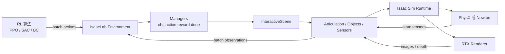
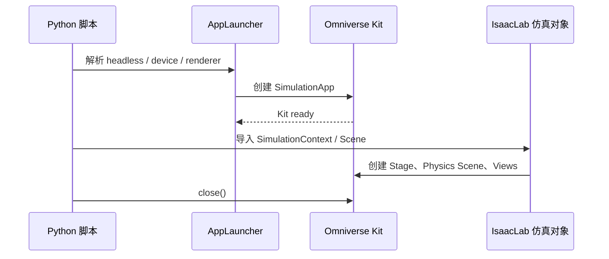
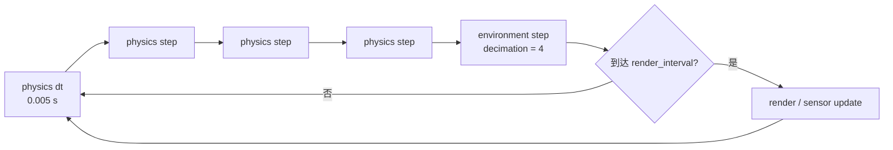
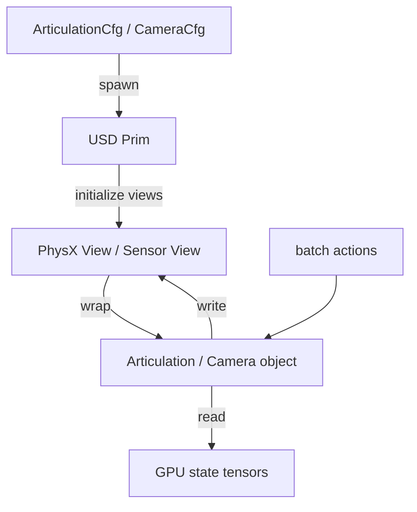
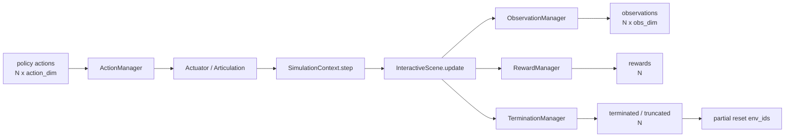
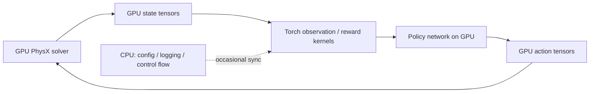
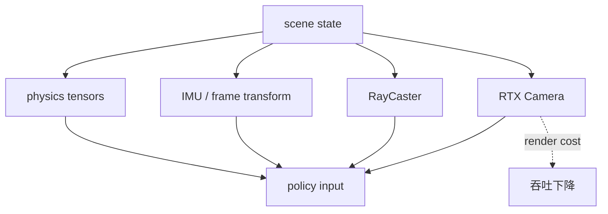
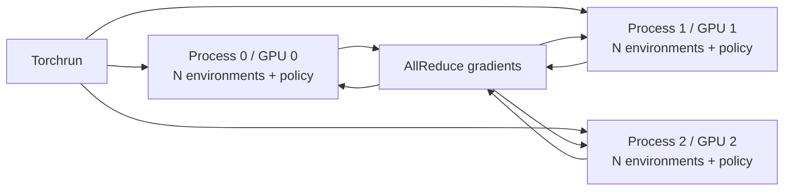
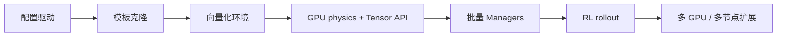

# IsaacLab 深度解析：Isaac Sim 封装、并行与加速

> 这篇文章回答一个具体问题：IsaacLab 到底替 Isaac Sim 做了什么，以及它为什么能把机器人强化学习变成高吞吐的批量仿真。重点放在 `/home/wahaha/robot/IsaacLab` 当前仓库中的 `AppLauncher`、`SimulationContext`、`InteractiveScene`、Cloner、Managers、Torch Tensor 和多 GPU 训练链路。

## 0. 先给结论

Isaac Sim 是仿真器，负责把 USD 场景推进起来：加载资产、运行物理、渲染图像，并通过 PhysX 或 Newton 暴露底层状态。IsaacLab 是建立在它之上的机器人学习框架，负责把这些底层能力整理成四种更适合训练的抽象：

1. **生命周期抽象**：用 `AppLauncher` 和 `SimulationContext` 统一启动、配置、step、reset 和关闭。
2. **对象抽象**：把 USD Prim 和 PhysX View 包装成 `Articulation`、`RigidObject`、`Camera` 等批量对象。
3. **环境抽象**：用 `InteractiveScene` 和 Cloner 从一个模板生成大量并行环境。
4. **任务抽象**：用 Manager 把动作、观测、奖励、终止和随机化拆成配置驱动的模块。

真正的加速来自这些抽象同时满足了两个条件：**所有环境共享同一套结构**，以及**状态、动作和奖励都以 GPU Tensor 批量处理**。IsaacLab 并没有重新实现 PhysX，也不会自动把任意 Python 循环变成 GPU kernel；它做的是把 Isaac Sim 的底层接口组织成适合向量化 RL 的数据通路。



> 图中最重要的边界是：Isaac Sim 仍然负责物理和渲染，IsaacLab 负责把它们变成可重复、可批量、可接入 RL 的环境接口。

## 1. 仓库结构如何映射到运行时

主仓库不是一个单体 Python 包，而是由多个可选扩展组成。核心包在 `source/isaaclab`；机器人资产在 `isaaclab_assets`；任务在 `isaaclab_tasks`；RL 适配器在 `isaaclab_rl`；PhysX 和 Newton 后端分别有自己的扩展包。

| 目录 | 运行时职责 |
| --- | --- |
| `source/isaaclab/isaaclab/app` | 启动 Isaac Sim，处理 Kit 生命周期 |
| `source/isaaclab/isaaclab/sim` | 仿真配置、Stage、Spawner、SimulationContext |
| `source/isaaclab/isaaclab/assets` | 机器人、刚体、软体的 Tensor 接口 |
| `source/isaaclab/isaaclab/scene` | 场景实体注册和并行环境复制 |
| `source/isaaclab/isaaclab/sensors` | 相机、IMU、RayCaster 等传感器 |
| `source/isaaclab/isaaclab/managers` | 动作、观测、奖励、终止、事件等 Manager |
| `source/isaaclab/isaaclab/envs` | Manager-based 和 Direct RL 环境 |
| `source/isaaclab_rl` | 对接 RL-Games、RSL-RL、SKRL |
| `source/isaaclab_tasks` | 具体任务配置和注册入口 |
| `source/isaaclab_physx` | PhysX 专用复制、视图和数据实现 |
| `source/isaaclab_newton` | Newton 后端的复制和模型实现 |

因此，用户在任务脚本里通常只看到 `AppLauncher`、某个 `EnvCfg` 和训练器；底层的 USD、物理视图、Tensor 缓冲区和克隆逻辑已经被分层隐藏。

## 2. AppLauncher：先把 Isaac Sim 变成一个可控的 Python 组件

直接使用 Isaac Sim 时，用户需要自己处理 Kit 应用启动、扩展加载、渲染模式、GPU 设备和退出顺序。IsaacLab 用 `AppLauncher` 把这些命令行选项集中起来，并保证在创建仿真对象之前完成 Isaac Sim 初始化。

典型脚本的顺序如下。这里的代码只是展示启动边界，真正的环境构建会在后面完成。

```python
import argparse

from isaaclab.app import AppLauncher

parser = argparse.ArgumentParser()
AppLauncher.add_app_launcher_args(parser)
args_cli = parser.parse_args()

app_launcher = AppLauncher(args_cli)
simulation_app = app_launcher.app

# 只有在 Isaac Sim 启动之后，才导入依赖 Kit 的仿真模块。
from isaaclab.sim import SimulationCfg, SimulationContext
```

`AppLauncher` 的价值不是减少几行代码，而是固定了初始化协议：先启动 Kit，再导入依赖 Kit 的模块，最后由脚本显式关闭应用。这个顺序也解释了为什么仓库的教程普遍把 `AppLauncher` 放在文件前半段。



## 3. SimulationContext：把 Isaac Sim 生命周期压成统一接口

`SimulationContext` 是 IsaacLab 与 Isaac Sim 的第一层运行时边界。它用 `SimulationCfg` 记录设备、物理时间步、渲染间隔、渲染器和物理后端设置，再把这些配置转换成 Isaac Sim 的 Stage 和 Timeline 操作。

最小仿真循环可以写成下面这样。这里先只推进物理，不涉及 RL 任务。

```python
from isaaclab.sim import SimulationCfg, SimulationContext

sim_cfg = SimulationCfg(dt=0.01, device="cuda:0")
sim = SimulationContext(sim_cfg)
sim.reset()

while simulation_app.is_running():
    sim.step(render=False)

simulation_app.close()
```

IsaacLab 还区分了三个时间尺度：物理步由 `sim.dt` 决定，环境步由 `decimation` 把多个物理步聚合起来，渲染步由 `render_interval` 决定。这样可以让物理保持稳定，同时减少不必要的渲染。



> 强化学习策略通常每个环境步输出一次动作，但物理引擎可以在这期间执行多个更小的物理步。训练吞吐的一个来源，就是让昂贵的渲染不必跟随每个物理步发生。

## 4. 从 USD Prim 到批量机器人对象

Isaac Sim 的原生对象是 USD Prim 和 PhysX View。它们适合描述场景，却不适合让 RL 代码反复拼接路径、查询属性和拷贝数据。IsaacLab 在中间增加了对象接口：

- `Articulation`：关节位置、速度、力矩、根部状态和关节目标。
- `RigidObject`：刚体位姿、速度、质量和外力。
- `Camera`、`RayCaster`、`IMU`：统一传感器配置和数据缓冲区。
- `Actuator`：把策略动作转换为位置、速度或力矩目标。

配置对象描述“要生成什么”，Spawner 负责“如何写入 USD”，运行时对象负责“如何读写 Tensor”。这三个阶段分开后，任务配置可以复用，运行时也能避免逐个 Prim 的 Python 操作。



## 5. InteractiveScene：一个模板，许多环境

`InteractiveScene` 负责场景级工作：创建环境命名空间、生成实体、注册实体、创建环境原点，并根据物理后端选择对应的复制函数。它不会计算奖励，也不会替机器人执行策略动作；这些职责属于 Managers。

一个场景配置可以只写一次机器人路径，`{ENV_REGEX_NS}` 会在复制时展开到每个环境：

```python
from isaaclab.scene import InteractiveSceneCfg
from isaaclab_assets.robots.anymal import ANYMAL_C_CFG

class SceneCfg(InteractiveSceneCfg):
    robot = ANYMAL_C_CFG.replace(
        prim_path="{ENV_REGEX_NS}/Robot"
    )

scene_cfg = SceneCfg(num_envs=4096, env_spacing=2.5)
```

初始化时，IsaacLab 先在模板环境中创建实体，再把模板复制到 `env_0`、`env_1` 直到 `env_4095`。同一实体名在不同环境中对应同一批量对象的不同第一维索引。

```mermaid
flowchart LR
    T[/World/template/Robot] --> C[Cloner]
    C --> E0[/World/envs/env_0/Robot]
    C --> E1[/World/envs/env_1/Robot]
    C --> EN[/World/envs/env_N/Robot]
    E0 --> X[Articulation view]
    E1 --> X
    EN --> X
    X --> B[Tensor shape: N x dof]
```

## 6. Cloner：并行化的第一个关键优化

如果逐个环境创建 USD、解析碰撞体、建立 PhysX 视图，启动时间和内存都会快速增长。IsaacLab 的 Cloner 把环境创建分成模板、克隆计划和复制三个阶段：

1. 在模板根节点下创建一个原型环境。
2. 为每个环境决定要使用的 prototype 组合。
3. 使用 USD spec replication 和后端专用 physics replication 生成副本。

当所有环境结构相同，`replicate_physics=True` 可以让 PhysX 复用复制后的结构，而不是重新逐个解析整个 Stage。若环境必须是完全独立的 USD 副本，才使用更昂贵的 `copy_from_source=True` 路径。

```python
from isaaclab.scene import InteractiveScene

# 同构环境优先使用 physics replication。
scene = InteractiveScene(
    SceneCfg(num_envs=1024, replicate_physics=True)
)
```

Cloner 的关键不是“复制了很多目录”，而是保证三个索引保持一致：USD 环境编号、物理实例编号和 Tensor 第一维编号。只要三者一致，奖励函数就可以直接对整个 batch 计算，而不需要知道每个 Prim 的长路径。

```mermaid
flowchart TB
    I[env_id = 7]
    I --> U[/World/envs/env_7/Robot]
    I --> P[PhysX instance 7]
    I --> T[state[7], action[7], reward[7]]
    U -. same identity .-> P
    P -. same identity .-> T
```

## 7. ManagerBasedEnv：把任务逻辑拆成批量模块

`ManagerBasedEnv` 把环境划分为 Scene 和多个 Manager。Scene 管“世界里有什么”，Manager 管“任务如何运行”。常见 Manager 包括 Observation、Action、Reward、Termination、Event、Command、Curriculum 和 Recorder。

一次环境步的顺序大致如下：策略先提交批量动作，Action Manager 把它转换为执行器目标；随后仿真推进若干 physics steps；Observation Manager 读取 Tensor 并拼接观测；Reward 和 Termination Manager 计算每个环境的结果；最后只重置已经结束的环境。



这种拆分带来两个工程收益。第一，修改奖励或随机化时不必重写整个环境类；第二，Manager Term 接收的是批量 Tensor，因此同一段逻辑可以同时作用于所有环境。

## 8. 向量化的本质：不是创建很多 Python 环境

IsaacLab 的并行环境不是 Python 中的 `list[Env]`。通常只有一个 `ManagerBasedEnv` 对象，但它内部的状态具有环境维度：

| 数据 | 典型形状 | 含义 |
| --- | --- | --- |
| 关节位置 | `[N, dof]` | N 个环境的关节位置 |
| 关节速度 | `[N, dof]` | N 个环境的关节速度 |
| 动作 | `[N, action_dim]` | N 个策略动作 |
| 奖励 | `[N]` | 每个环境一个奖励 |
| done 标志 | `[N]` | 每个环境独立结束 |

例如，下面的奖励函数可以一次处理全部环境。代码前的关键假设是：`robot.data.joint_pos` 的第一维已经对应环境编号，因此不需要循环访问每个机器人。

```python
def joint_limit_reward(robot, limit):
    # 对每个环境、每个关节计算超限量。
    violation = (robot.data.joint_pos.abs() - limit).clamp_min(0.0)
    # 先在关节维求和，留下每个环境一个标量。
    return -violation.sum(dim=-1)
```

下图展示了同一个 `env_id` 如何在不同数组中保持对齐。这个对齐是批量 RL 能成立的前提。

```mermaid
flowchart TB
    E[env_id = 3]
    E --> S[robot_pos[3, :]]
    E --> A[action[3, :]]
    E --> O[obs[3, :]]
    E --> R[reward[3]]
    E --> D[done[3]]
```

## 9. GPU 加速：减少数据搬运比单纯换设备更重要

IsaacLab 的 GPU 加速有三层：

1. PhysX 在 GPU 上进行碰撞、约束和动力学求解。
2. 物理状态通过 Tensor API 暴露，直接进入 Torch 缓冲区。
3. 观测、奖励、动作和随机化尽量继续留在同一块 GPU 上。

如果仿真状态每一步都先拷贝到 CPU，再由 Python 计算奖励，GPU 物理带来的收益会被同步和内存搬运抵消。因此高吞吐路径应该是：GPU physics → GPU tensors → Torch policy → GPU actions → GPU physics。



GPU 并不总是更快。只有少量刚体、少量环境或大量 CPU 逻辑时，CPU pipeline 可能更合适；复杂碰撞网格还可能触发 CPU fallback。性能调优必须同时检查环境数量、碰撞体复杂度、传感器数量和 GPU 利用率。

## 10. 传感器和渲染：并行仿真中的隐形瓶颈

物理状态通常可以高效批量化，但 RTX 相机需要渲染图像，成本远高于读取关节 Tensor。IsaacLab 因此把传感器配置独立出来，并允许训练时使用 headless、降低渲染频率或改用 RayCaster。

- **相机**：提供 RGB、深度、分割等图像，表达能力强，成本高。
- **RayCaster**：直接发射射线并计算交点，适合地形高度或激光式观测。
- **IMU / Frame Transformer**：主要是 Tensor 变换，通常比图像传感器便宜。



因此，排查性能时不能只看 PhysX 时间；相机更新、图像复制和神经网络编码也可能成为主导成本。

## 11. 多 GPU：复制环境，而不是共享一个环境

IsaacLab 的多 GPU 训练通常由 Torchrun 管理。每个 GPU 启动一个进程，每个进程创建自己的 IsaacLab 环境、策略副本和 rollout buffer；进程之间主要在梯度更新时通过 DDP 同步。



这种模式的优点是仿真进程之间没有每步同步，环境采样可以独立进行；代价是每张 GPU 都要保存一份环境和模型。多节点时还要承担 NCCL 网络延迟，因此增加 GPU 不一定线性增加吞吐。

## 12. 一个完整的最小执行链路

下面的代码把前面的抽象串起来。它展示的是结构，不是完整训练脚本：配置负责描述环境，`ManagerBasedRLEnv` 负责连接场景和 Managers，训练器负责消费批量数据。

```python
from isaaclab.app import AppLauncher

app_launcher = AppLauncher(headless=True)
simulation_app = app_launcher.app

from isaaclab.envs import ManagerBasedRLEnv
from isaaclab_tasks.manager_based.classic.cartpole.cartpole_env_cfg import CartpoleEnvCfg

env_cfg = CartpoleEnvCfg()
env_cfg.scene.num_envs = 4096
env_cfg.sim.device = "cuda:0"
env = ManagerBasedRLEnv(cfg=env_cfg)

obs, info = env.reset()
for _ in range(1000):
    actions = policy(obs)
    obs, reward, terminated, truncated, info = env.step(actions)

env.close()
simulation_app.close()
```

运行时真正发生的是：`AppLauncher` 启动 Kit，环境构造 `SimulationContext`，`InteractiveScene` 创建并复制实体，Managers 建立 Term，`step` 内部批量推进仿真并返回 Tensor。策略只需要看到统一的 observation/action 接口。

## 13. 性能优化的正确排查顺序

建议按下面顺序定位瓶颈，而不是一开始盲目增加 `num_envs`：

1. 先用 headless 模式确认渲染是否是瓶颈。
2. 对比 CPU 和 GPU physics，确认场景规模是否足以让 GPU 占优。
3. 检查碰撞几何体，避免复杂网格触发 CPU fallback。
4. 增大 `num_envs`，观察吞吐是否仍然增长。
5. 降低相机分辨率或 `render_interval`，单独测传感器成本。
6. 检查奖励、随机化和观测 Term 中是否存在逐环境 Python 循环。
7. 最后再评估多 GPU，因为多 GPU 会引入模型复制和梯度通信。

可以把总耗时粗略看成四部分：场景初始化、物理推进、传感器渲染、策略和数据处理。Cloner 主要优化初始化，GPU pipeline 主要优化物理和数据通路，headless 与 render interval 主要优化渲染，Manager/Tensor 化主要优化任务逻辑。

## 14. IsaacLab 的边界

IsaacLab 不会替代 Isaac Sim 的 USD、Omniverse Kit、PhysX 或 RTX；它也不会把任意用户代码自动编译成 GPU kernel。它最核心的贡献是提供一套面向机器人学习的组织方式：

- 用配置类描述仿真，而不是手动修改大量 Prim 属性。
- 用模板复制环境，而不是逐个环境重新构建场景。
- 用批量对象和 Tensor 访问状态，而不是逐个对象查询。
- 用 Managers 组织 MDP，而不是把所有逻辑塞进一个巨大环境类。
- 用 Torchrun 把独立环境进程扩展到多 GPU 和多节点。

## 15. 总结

IsaacLab 的加速不是某一个“神奇优化开关”，而是一条完整的数据路径：



如果只记住一句话，可以这样理解：**Isaac Sim 提供仿真能力，IsaacLab 把仿真能力重排成“许多结构相同的环境共享一条 GPU Tensor 数据通路”，从而让机器人强化学习可以高吞吐运行。**
