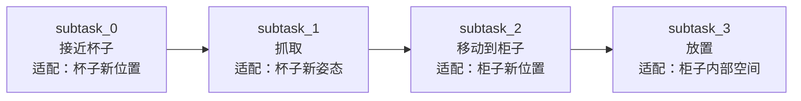
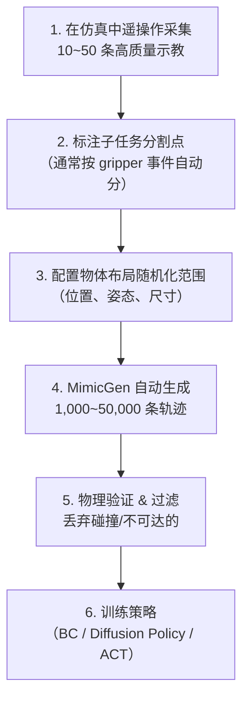

# MimicGen：从少量人类示教自动合成大规模机器人训练数据

> **一句话概括**：MimicGen 用不到 200 条人类遥操作示教，通过 SE(3) 变换自动生成 50,000+ 条物理可行的训练轨迹，大幅降低机器人数据采集成本。

**项目链接**：
- 论文：[arXiv:2310.17596](https://arxiv.org/abs/2310.17596)（CoRL 2023）
- 官网：[mimicgen.github.io](https://mimicgen.github.io/)
- 代码：基于 robosuite / robomimic 生态

**知识链接**：
- [Robosuite 与 Robomimic 项目解析](./Robosuite与Robomimic项目解析) — MimicGen 的底层仿真框架
- [RoboCasa 大规模家庭场景仿真](./RoboCasa_大规模家庭场景仿真) — MimicGen 的下游应用场景
- [双臂动作扰动与数据增强调研](/工程实践/双臂动作扰动与数据增强调研) — 相关的双臂数据增强思路
- [机器人模仿学习综述](/论文综述/S02_机器人模仿学习综述) — 模仿学习的系统背景

---

## 一、解决什么问题

### 1.1 机器人数据的瓶颈

训练机器人操作策略需要大量高质量示教数据。但人类遥操作采集极其昂贵：

| 采集方式 | 单条轨迹时间 | 一天产量 | 质量问题 |
|---------|------------|---------|---------|
| VR 遥操作 | 30~120 秒 | 200~500 条 | 操作失误多，次优动作 |
| 示教器拖动 | 60~180 秒 | 100~300 条 | 只适合简单任务 |
| 自主探索 | 不确定 | 高 | 质量极差，需大量筛选 |

而 MimicGen 的方案是：

> **给我 10 条好的示教，我还你 10,000 条变化丰富的训练数据。**

### 1.2 核心想法：示教 ≠ 固定轨迹

人类示教一次"把杯子放到柜子里"，本质是执行了一系列**相对于物体**的动作。如果杯子位置变了、柜子角度变了，只要把同样的相对动作"搬过去"，轨迹仍然合理。

MimicGen 的核心就是做这件事：把示教中的动作**分解为物体中心的相对变换**，然后在新的物体布局下重新组合。

---

## 二、技术原理

### 2.1 任务分解：Subtask Segments

MimicGen 首先把一条完整轨迹分解为多个**子任务段**（subtask segments）。每个子任务对应一个关键接触事件：

```
示教轨迹：[接近杯子] → [抓取杯子] → [移动到柜子] → [放下杯子]
子任务：   subtask_0     subtask_1     subtask_2       subtask_3
```

分割依据通常是 gripper 状态变化（开→闭、闭→开）或末端执行器到达关键位置。

### 2.2 SE(3) 变换适配

对每个子任务段，MimicGen 提取**相对于参考物体的末端执行器变换**：

$$
T_{\text{rel}}^{(k)} = T_{\text{object}}^{-1} \cdot T_{\text{ee}}^{(k)}
$$

**逐项拆解**：
- $T_{\text{ee}}^{(k)}$ — 示教中第 $k$ 步末端执行器的 SE(3) 位姿（位置 + 姿态）
- $T_{\text{object}}$ — 该子任务对应的参考物体位姿
- $T_{\text{rel}}^{(k)}$ — 末端执行器相对于物体的位姿，与物体绝对位置无关

当物体位置变化为 $T_{\text{object}}'$ 时，新的末端执行器轨迹为：

$$
T_{\text{ee}}'^{(k)} = T_{\text{object}}' \cdot T_{\text{rel}}^{(k)}
$$

**代入数字**：假设原始示教中杯子在 $(0.3, 0.1, 0.0)$，末端在 $(0.3, 0.1, 0.15)$（正上方 15cm）。相对变换是"正上方 15cm"。新场景中杯子移到 $(0.5, -0.2, 0.0)$，则末端自动适配到 $(0.5, -0.2, 0.15)$。

### 2.3 噪声注入与插值

仅仅做刚性变换会让所有合成数据"长得一样"。MimicGen 额外做：

1. **位置噪声**：在参考位姿附近加小扰动 $\epsilon \sim \mathcal{N}(0, \sigma^2)$
2. **姿态噪声**：在 SO(3) 上做小角度随机旋转
3. **时间插值**：在关键帧之间用不同速度插值，生成快慢不同的轨迹
4. **物理验证**：生成的轨迹在仿真器中执行，碰撞或不可达的丢弃

### 2.4 多阶段组合

不同子任务段可以**独立适配不同物体**，然后拼接：



这让数据多样性呈**指数增长**：如果有 $N$ 个物体布局，每个子任务有 $M$ 种变化，总组合是 $M^{\text{子任务数}}$。

---

## 三、数据规模与实验结果

### 3.1 生成效率

| 指标 | MimicGen | 传统采集 |
|------|----------|---------|
| 种子示教 | ~200 条 | — |
| 生成数据 | 50,000+ 条 | 需要 50,000 次遥操作 |
| 涵盖任务 | 18 个任务 | — |
| 跨仿真器 | robosuite + Isaac | 通常只用一个 |
| 真实世界验证 | ✅ | — |

### 3.2 关键发现

1. **数据量 scaling**：合成数据越多，策略成功率越高，且没有明显饱和
2. **多样性比数量更重要**：100 条高多样性数据 > 1000 条低多样性数据
3. **跨物体泛化**：在训练时没见过的物体位置上也能成功
4. **真机迁移**：仿真中 MimicGen 生成的数据训出的策略可以直接迁移到真机

---

## 四、后续发展

### 4.1 DexMimicGen（2024）

将 MimicGen 扩展到**灵巧手双臂操作**。核心改进：
- 支持高自由度手（如人形机器人的双手）
- 处理手指接触的复杂子任务分割
- 论文：[arXiv:2410.24185](https://arxiv.org/abs/2410.24185)

### 4.2 DynaMimicGen（2024）

扩展到**动态任务**（物体在运动中）：
- 支持接住抛出的物体、追踪移动目标
- 在时间维度上做适配，不仅仅是空间
- 论文：[arXiv:2511.16223](https://arxiv.org/abs/2511.16223)

### 4.3 与 RoboCasa 结合

MimicGen + RoboCasa 形成完整管线：
1. RoboCasa 提供多样化厨房场景（物体、家具、布局）
2. 少量人类示教在标准场景中完成
3. MimicGen 自动将示教适配到所有 RoboCasa 场景变体
4. 训出的策略可以在从未见过的厨房布局中执行

---

## 五、工程落地要点

### 5.1 适合的任务类型

MimicGen 最适合**结构化多阶段任务**：
- ✅ Pick-and-place（抓取放置）
- ✅ 开关门/抽屉
- ✅ 杯子倒水
- ✅ 组装（插入、对齐）
- ⚠️ 柔性物体（布料、绳子）— DexMimicGen 正在解决
- ❌ 纯反应式任务（如动态避障）— 没有明确子任务结构

### 5.2 使用流程



### 5.3 常见坑

1. **子任务分割不准**：如果分割点错误，SE(3) 变换会生成不合理轨迹。建议先可视化几条验证
2. **参考物体选择**：每个子任务必须选对"相对于哪个物体做变换"。抓取阶段相对于目标物体，放置阶段相对于容器
3. **旋转对称性**：圆柱形物体绕轴旋转不影响抓取，但 MimicGen 可能生成"绕了一圈"的轨迹。需要在生成时处理旋转等价类
4. **动作空间不匹配**：MimicGen 生成的是末端位姿轨迹，如果策略用关节空间动作，还需要 IK 转换

---

## 六、总结与定位

| 维度 | MimicGen |
|------|----------|
| 核心贡献 | 少量示教 → 大规模物理可行数据 |
| 技术本质 | 子任务分割 + 物体中心 SE(3) 变换 + 噪声 + 物理验证 |
| 适用范围 | 结构化多阶段操作任务 |
| 局限 | 需要明确子任务结构；对高度动态/柔性任务支持有限 |
| 生态位置 | robosuite/robomimic 家族的数据层 |

**一句话总结**：MimicGen 证明了"数据合成 > 数据采集"在机器人操作领域是可行的——只要你能把任务分解对，少量示教就能撬动大规模训练。

---

## 延伸阅读

- [RoboCasa 大规模家庭场景仿真](./RoboCasa_大规模家庭场景仿真) — MimicGen 数据的下游训练环境
- [Robosuite 与 Robomimic 项目解析](./Robosuite与Robomimic项目解析) — 基础仿真和学习框架
- [Ego 数据在机器人操作中的应用](./Ego数据在机器人操作中的应用) — 另一条数据路线：从人类视频学习
- [Sim-to-Real 迁移综述](/论文综述/S04_Sim_to_Real迁移综述) — 合成数据到真机的迁移方法
