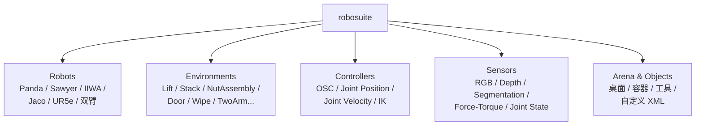
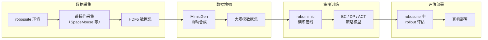

# Robosuite 与 Robomimic：模块化仿真 + 离线学习的完整生态

> **一句话概括**：robosuite 提供模块化机器人仿真环境，robomimic 提供离线模仿学习的算法和基准——两者组合是机器人操作研究中最成熟的实验平台之一。

**项目链接**：
- robosuite：[robosuite.ai](https://robosuite.ai/) | [GitHub](https://github.com/ARISE-Initiative/robosuite) | [arXiv:2009.12293](https://arxiv.org/abs/2009.12293)
- robomimic：[robomimic.github.io](https://robomimic.github.io/) | [arXiv:2108.03298](https://arxiv.org/abs/2108.03298)

**知识链接**：
- [MimicGen 少量示教合成大规模数据](./MimicGen_少量示教合成大规模数据) — 建立在 robosuite 上的数据生成
- [RoboCasa 大规模家庭场景仿真](./RoboCasa_大规模家庭场景仿真) — robosuite 的场景扩展
- [机器人模仿学习综述](/论文综述/S02_机器人模仿学习综述) — 模仿学习方法的系统背景
- [DPPO 扩散策略策略优化](/论文综述/001_DPPO_扩散策略策略优化) — 在 robomimic 任务上的实验

---

## 一、robosuite：模块化机器人仿真

### 1.1 定位

robosuite 是一个基于 MuJoCo 物理引擎的机器人操作仿真框架。它的设计哲学是**模块化**——机器人、任务、控制器、传感器都是可插拔的组件。

### 1.2 核心模块



### 1.3 内置任务

| 任务 | 难度 | 说明 |
|------|------|------|
| Lift | 简单 | 拿起一个方块 |
| Stack | 中等 | 把方块叠起来 |
| NutAssembly | 中等 | 把螺母放到对应柱上 |
| PickPlace | 中等 | 从一个容器移到另一个 |
| Door | 中等 | 开门（把手旋转 + 推） |
| Wipe | 中高 | 用工具擦桌面 |
| TwoArmLift | 高 | 双臂协作抬起大物体 |
| TwoArmPegInHole | 高 | 双臂精密插入 |

### 1.4 控制器选择

robosuite 提供多种控制器，适配不同研究需求：

| 控制器 | 动作空间 | 特点 | 适用场景 |
|--------|---------|------|---------|
| OSC_POSE | 6D 末端位姿增量 | 最常用，末端控制直觉 | 大多数操作任务 |
| OSC_POSITION | 3D 位置增量 | 只控制位置不控姿态 | 简单抓放 |
| JOINT_POSITION | 关节角度目标 | 最底层，精确控制 | 需要关节级控制时 |
| JOINT_VELOCITY | 关节速度 | RL 常用 | 连续控制策略 |
| IK | 末端目标位姿 | 一步到位 | waypoint 式控制 |

**实践建议**：做模仿学习通常选 OSC_POSE（动作维度 7：xyz + 旋转 3D + gripper），训练效率最高。

### 1.5 数据采集

robosuite 支持多种遥操作设备：
- 键盘/鼠标（调试用）
- SpaceMouse（最常用的研究级设备）
- VR 手柄（更自然但需要标定）
- iPhone/iPad（利用 ARKit 追踪）

---

## 二、robomimic：离线模仿学习框架

### 2.1 定位

robomimic 是一个**离线机器人学习**框架，核心功能：
1. 提供多种质量的示教数据集
2. 实现多种 BC/离线 RL 算法
3. 提供标准化的训练和评估管线

### 2.2 数据集设计

robomimic 的一个重要贡献是**系统研究数据质量对策略性能的影响**。它为每个任务提供三种质量的数据：

| 数据类型 | 来源 | 质量 | 说明 |
|---------|------|------|------|
| Machine-Generated (MG) | 规划器生成 | 最优 | 轨迹最短最直接 |
| Proficient-Human (PH) | 熟练操作员 | 高 | 接近最优但有自然变异 |
| Multi-Human (MH) | 混合水平操作员 | 混合 | 有好有差，更接近实际 |

**关键发现**：
- 数据质量 > 数据量：少量 PH 数据 > 大量 MH 数据
- 差数据有害：混入低质量数据会显著降低性能
- 算法选择 matters：不同算法对数据质量敏感度不同

### 2.3 内置算法

| 算法 | 类型 | 特点 |
|------|------|------|
| BC-RNN | 行为克隆 | RNN 序列模型，处理部分可观测 |
| BC-Transformer | 行为克隆 | Transformer 序列模型 |
| HBC | 层次化 BC | 高层规划 + 低层控制 |
| IRIS | 隐式 BC | 学习能量函数而非显式动作 |
| Diffusion Policy | 生成式 | 扩散模型生成动作序列 |
| ACT | 生成式 | CVAE + Transformer 预测 chunk |

### 2.4 标准化评估

robomimic 定义了标准的评估协议：
- 固定随机种子的 50 次 rollout
- 报告成功率 + 标准差
- 多个 checkpoint 评估取最优
- 支持视频录制用于定性分析

---

## 三、两者如何协作



### 3.1 数据格式

统一使用 HDF5 格式：

```
dataset.hdf5
├── data/
│   ├── demo_0/
│   │   ├── obs/           # 观测（图像、关节角等）
│   │   ├── actions/       # 动作序列
│   │   ├── rewards/       # 奖励（可选）
│   │   └── dones/         # 终止标志
│   ├── demo_1/
│   └── ...
└── mask/                  # 训练/验证分割
```

### 3.2 配置驱动

robomimic 使用 JSON 配置文件控制一切：

```json
{
  "algo_name": "act",
  "experiment": {
    "name": "lift_act_ph",
    "validate": true
  },
  "train": {
    "data": "path/to/lift_ph.hdf5",
    "batch_size": 16,
    "num_epochs": 600
  },
  "observation": {
    "modalities": {
      "obs": {
        "low_dim": ["robot0_eef_pos", "robot0_gripper_qpos"],
        "rgb": ["agentview_image", "robot0_eye_in_hand_image"]
      }
    }
  }
}
```

---

## 四、在研究中的地位

### 4.1 谁在用

几乎所有主流操作学习论文都用 robosuite/robomimic 作为基准之一：

- **DPPO**：在 robomimic 的 Lift、Can、Square、Transport 上评估
- **Diffusion Policy**：使用 robomimic 数据集和评估协议
- **ACT**：在 robosuite 双臂环境中做初步验证
- **MimicGen**：完全构建在 robosuite 之上

### 4.2 与 Isaac Lab 的互补

| 维度 | robosuite + robomimic | Isaac Lab |
|------|----------------------|-----------|
| 定位 | 操作任务 + 离线学习 | 运动控制 + 在线 RL |
| 物理引擎 | MuJoCo | PhysX |
| 并行 | 单环境 | 数千并行 |
| 数据格式 | HDF5（标准化） | 自定义 |
| 典型任务 | 桌面操作、装配 | 四足、灵巧手、人形 |
| RL 支持 | 有限（主要做离线） | 核心功能 |
| 适合谁 | 做 BC/离线学习的研究者 | 做在线 RL 的研究者 |

两者不冲突。很多工作会在 robomimic 上做 BC 预训练，然后在 Isaac 环境中做 RL 微调。

---

## 五、快速上手

### 5.1 安装

```bash
# robosuite
pip install robosuite

# robomimic
pip install robomimic

# 或从源码
git clone https://github.com/ARISE-Initiative/robosuite.git
git clone https://github.com/ARISE-Initiative/robomimic.git
```

### 5.2 30 秒跑一个 demo

```python
import robosuite as suite

# 创建环境
env = suite.make(
    env_name="Lift",
    robots="Panda",
    controller_configs=suite.load_controller_config(default_controller="OSC_POSE"),
    has_renderer=True,
    has_offscreen_renderer=False,
    use_camera_obs=False,
)

# 随机动作 rollout
obs = env.reset()
for _ in range(100):
    action = env.action_spec[0].sample()  # 随机动作
    obs, reward, done, info = env.step(action)
    env.render()
```

### 5.3 训练一个 BC 策略

```bash
# 下载示教数据
python robomimic/scripts/download_datasets.py --tasks lift

# 训练
python robomimic/scripts/train.py --config configs/lift_bc_rnn.json

# 评估
python robomimic/scripts/run_trained_agent.py \
    --agent path/to/model.pth \
    --n_rollouts 50
```

---

## 六、总结

| 项目 | 核心价值 | 适合场景 |
|------|---------|---------|
| robosuite | 模块化、可复现的操作仿真 | 任何桌面操作研究 |
| robomimic | 标准化离线学习管线 + 数据质量研究 | BC / 离线 RL 算法对比 |
| 两者结合 | 从采集到训练到评估的完整闭环 | 操作策略开发全流程 |

**生态全景**：

```
robosuite（仿真）
    ├── robomimic（离线学习）
    ├── MimicGen（数据合成）
    ├── RoboCasa（家庭场景）
    └── 你的项目（自定义任务 + 自定义算法）
```

---

## 延伸阅读

- [MimicGen 少量示教合成大规模数据](./MimicGen_少量示教合成大规模数据) — 数据生成
- [RoboCasa 大规模家庭场景仿真](./RoboCasa_大规模家庭场景仿真) — 场景扩展
- [机器人模仿学习综述](/论文综述/S02_机器人模仿学习综述) — 离线学习方法全景
- [DPPO 扩散策略策略优化](/论文综述/001_DPPO_扩散策略策略优化) — 在 robomimic 上的实验
