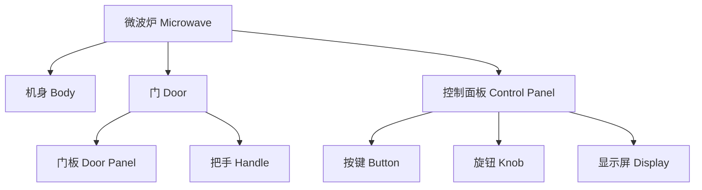

# PartNet：层次化零件级标注数据集

**论文**：Mo et al., "PartNet: A Large-scale Benchmark for Fine-grained and Hierarchical Part-level 3D Object Understanding", CVPR 2019  
**官网**：[https://partnet.cs.stanford.edu](https://partnet.cs.stanford.edu)  
**许可证**：MIT  
**规模**：573,585 个部件实例，26,671 个 3D 模型，24 个物体类别

## 核心特点

PartNet 在 ShapeNet 上构建了三层层次化部件标注体系，是目前覆盖面最广的零件级 3D 数据集。"层次化"是它与 ShapeNet Part 最大的区别：每个物体的部件从粗到细分三级，同一把椅子可以只用 Level 1 的"椅腿/椅背/椅座"，也可以精细到 Level 3 的单颗螺丝和铰链。



标注覆盖 24 个类别，其中与机器人操作直接相关的包括：微波炉、冰箱、洗碗机、洗衣机、椅子、桌子、灯具、储物柜等。

## 数据规模

| 类别 | 模型数 | 最细粒度部件数 |
|------|--------|--------------|
| Chair | 6,323 | 39 类 |
| Table | 8,436 | 51 类 |
| Lamp | 2,318 | 41 类 |
| StorageFurniture | 2,517 | 24 类 |
| Microwave | 176 | 6 类 |
| Refrigerator | 202 | 7 类 |
| Dishwasher | 209 | 5 类 |

## 标注格式

每个模型以 **零件 mesh** 的形式提供：每个部件是一个独立的 `.obj` 文件，配套一个 JSON 文件描述层次关系和语义标签。点云标注直接从部件 mesh 采样得到，可控制采样密度。

```
chair_0001/
├── result.json          # 层次结构 + 语义标签
├── parts_render_after_merging/
│   ├── 0.obj            # 椅座
│   ├── 1.obj            # 左前腿
│   ├── ...
└── point_sample/
    └── sample-10000.txt  # 10000 点点云 + 部件ID
```

## 用于 3DGS 的方法

PartNet 本身提供静态 mesh，不带多视角图像。接入 3DGS 需要先渲染多视角图，常用方案：

1. **BlenderProc**：将部件 mesh 按层次关系组装后，用 BlenderProc 在球面上均匀采样相机位置，渲染 RGB + 深度 + 部件掩码。同时输出每张图的部件分割 GT mask。
2. **SAPIEN**：对于需要物理仿真的场景，可在 SAPIEN 中导入 PartNet mesh，借助其渲染管线产出多视角序列。

渲染完成后，每个视角都有对应的部件 GT mask，可直接用于监督 Gaussian Grouping 等方法的实例 ID 特征训练，也可用作 SAGA / Feature 3DGS 的评测 ground truth。

## 局限

- 所有模型来自 ShapeNet，外观偏理想化，与真实扫描存在域间隙。
- 不含关节参数，部件之间没有运动关系，不能直接用于铰接物体仿真。
- 需要自行渲染多视角图，无法开箱即用地训练 3DGS。

**知识链接**

- [PartNet-Mobility：铰接物体版本，带运动参数](/数据集/002_PartNet_Mobility_铰接物体数据集)
- [GAPartNet：跨类别功能部件泛化](/数据集/004_GAPartNet_可泛化铰接部件)
