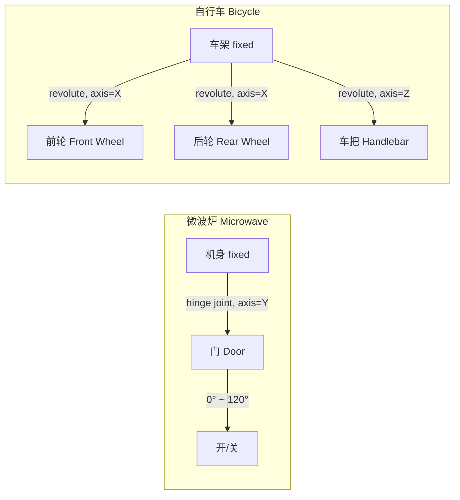
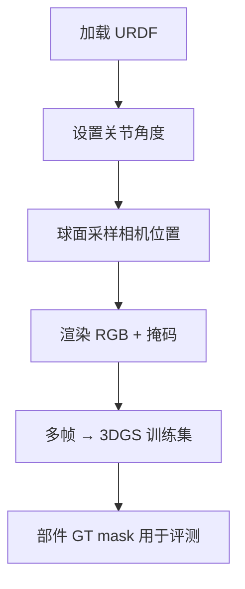

# PartNet-Mobility：铰接物体部件数据集

**论文**：Xiang et al., "SAPIEN: A SimulAted Part-based Interactive ENvironment", CVPR 2020  
**官网**：[https://sapien.ucsd.edu/browse](https://sapien.ucsd.edu/browse)  
**许可证**：CC BY-NC 4.0  
**规模**：2,346 个物体，46 个类别，14,068 个可动部件

## 核心特点

这是与"微波炉门""自行车轮子"这类例子最直接对应的数据集。PartNet-Mobility 在 PartNet 的部件 mesh 基础上，为每个可活动部件标注了**关节类型**（旋转/平移）、**关节轴**（位置 + 方向）和**运动范围**（最小/最大角度或位移）。



每个部件的关节都以 URDF 格式存储，可以直接加载进 SAPIEN 仿真器或 Isaac Gym，无需额外处理。

## 类别覆盖

46 个类别中与机器人操作最相关的包括：

| 类别 | 可动部件举例 | 模型数 |
|------|------------|--------|
| Microwave | 门（旋转） | 73 |
| Refrigerator | 门（旋转）、抽屉（平移） | 49 |
| WashingMachine | 门（旋转） | 49 |
| Oven | 门（旋转） | 64 |
| Laptop | 屏幕（旋转） | 91 |
| StorageFurniture | 抽屉（平移）、门（旋转） | 302 |
| Bicycle | 轮子（旋转）、车把（旋转） | 68 |
| Wheelchair | 轮子（旋转）、踏板（旋转） | 33 |
| Faucet | 手柄（旋转/平移） | 735 |
| Scissors | 两叶（旋转） | 142 |

## 数据格式

每个物体以目录形式组织：

```
microwave_7236/
├── mobility.urdf          # 完整 URDF，含关节树
├── meta.json              # 类别、语义标签
├── textured_objs/
│   ├── original-0.obj     # 机身 mesh
│   ├── original-1.obj     # 门 mesh
│   └── ...
└── mobility_v2.json       # 关节参数（轴、范围、类型）
```

`mobility_v2.json` 的关节条目示例：

```json
{
  "id": 1,
  "parent": 0,
  "jointData": {
    "axis": { "origin": [0.3, 0, 0.2], "direction": [0, 1, 0] },
    "limit": { "a": 0, "b": 1.8326 },
    "type": "revolute"
  },
  "name": "door"
}
```

## 用于 3DGS 的渲染流程

SAPIEN 提供了基于 Vulkan 的高质量渲染器，可以输出 RGB、深度、分割掩码和法线图。推荐流程：



对铰接物体，可以对同一物体在不同关节角度下各渲染一组视角，生成"开门"和"关门"两个状态的多视角序列，用于测试分割方法在动态场景下的鲁棒性。

## 与 PartNet 的关系

PartNet-Mobility 是 PartNet 的子集，约覆盖 PartNet 的 1/4 类别，但每个模型都经过人工核查以确保关节参数正确。外观上两者共享同一批 ShapeNet 风格 mesh，质地偏简洁，与真实扫描有明显的域间隙。

## 局限

- 贴图质量较低，部分物体无纹理，直接用于 3DGS 重建时外观细节不足。
- 非商业许可（CC BY-NC），不能用于商业产品。
- Bicycle 类别模型数量有限（68个），多样性不如储物类。

**知识链接**

- [PartNet：静态层次化标注版本，类别更全](/数据集/001_PartNet_层次化部件分割数据集)
- [GAPartNet：跨类别功能部件泛化标注](/数据集/004_GAPartNet_可泛化铰接部件)
- [AKB-48：真实扫描的铰接物体知识库](/数据集/006_AKB48_真实铰接物体知识库)
