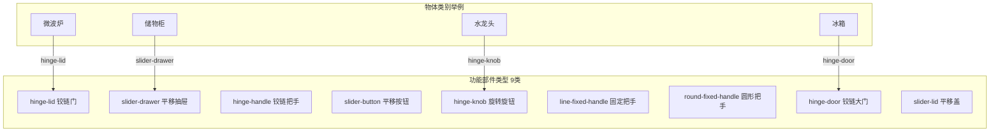

# GAPartNet：跨类别功能部件泛化数据集

**论文**：He et al., "GAPartNet: Cross-Category Domain-Generalizable Object Part Segmentation and Articulation Estimation", CVPR 2023  
**代码 & 数据**：[https://github.com/PKU-EPIC/GAPartNet](https://github.com/PKU-EPIC/GAPartNet)  
**许可证**：MIT  
**规模**：8,489 个物体实例，27 个物体类别，9 类功能性部件

## 核心设计思路

GAPartNet 的出发点不是"这是微波炉的门"，而是"这是一个**铰链门**（hinge-lid）"。它把部件按功能而不是物体类别来定义，使得在微波炉上学到的"旋转把手"可以迁移到烤箱、药柜、储物箱上，而不需要针对每个类别重新标注。

同一个功能部件类型在不同物体类别上共享标注语义，模型训练时可以跨类别聚合数据，显著缓解了单个类别样本不足的问题。

## 数据规模

| 功能部件类型 | 实例数 | 覆盖物体类别数 |
|------------|--------|--------------|
| hinge-lid | 2,134 | 8 |
| slider-drawer | 1,876 | 6 |
| hinge-handle | 1,203 | 11 |
| slider-button | 987 | 9 |
| hinge-knob | 743 | 7 |
| line-fixed-handle | 612 | 12 |
| round-fixed-handle | 534 | 8 |
| hinge-door | 267 | 4 |
| slider-lid | 133 | 3 |

## 标注内容

每个功能部件都提供：
- **3D 部件掩码**：哪些点/面属于该部件
- **关节参数**：轴向量、关节原点、关节类型（旋转 / 平移）
- **NPCS（归一化部件坐标系）**：把部件标准化到一个典型姿态的坐标表示，用于跨实例的形状对齐

NPCS 是 GAPartNet 的核心贡献之一。旋转把手在不同物体上形状各异，但映射到 NPCS 后都变成同一个"标准把手"，使得跨类别训练成为可能。

## 评测指标

GAPartNet 定义了两个专属指标：

**mIOU@k**：对每类功能部件，在 IoU 阈值 k（通常取 0.5）下的平均召回率，跨类别取平均。

**mAP**：每类功能部件的平均精度，和目标检测里的 AP 定义相同，但这里检测的是 3D 部件实例而不是 2D 框。

与 PartNet 的 mIoU 相比，这两个指标更关注**能否正确找到每一个功能部件实例**，而不是点级别的分类精度。

## 在 3DGS 中的使用方式

GAPartNet 提供的是 mesh + 点云标注，使用前同样需要渲染多视角图。它的优势在于跨类别泛化评测：如果想验证一个 3DGS 分割方法能不能从"见过的类别"迁移到"没见过的类别"，GAPartNet 是目前最合适的 benchmark。

渲染推荐同样使用 SAPIEN 或 BlenderProc，流程与 PartNet-Mobility 相同。

**知识链接**

- [PartNet-Mobility：关节参数更完整的铰接物体数据集](/数据集/002_PartNet_Mobility_铰接物体数据集)
