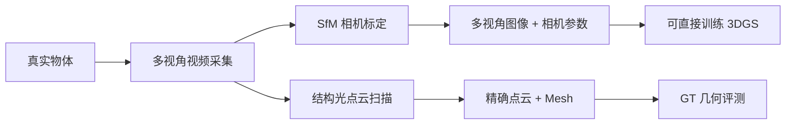

# OmniObject3D：6000 个真实扫描物体

**论文**：Wu et al., "OmniObject3D: Large-Vocabulary 3D Object Dataset for Realistic Perception, Reconstruction and Generation", NeurIPS 2023  
**官网**：[https://omniobject3d.github.io](https://omniobject3d.github.io)  
**许可证**：CC BY 4.0  
**规模**：6,000 个物体，190 个类别，约 4,000 万帧多视角图像

## 核心特点

OmniObject3D 是目前规模最大的真实扫描 3D 物体数据集，每个物体提供：

- **多视角视频**：每个物体约 200-300 帧，环绕拍摄，覆盖仰视和俯视角度
- **精确点云**：结构光扫描，精度约 0.5mm
- **网格模型**：从点云重建的 watertight mesh，有纹理贴图
- **相机参数**：每帧精确的内外参（已完成 SfM 标定）
- **2D 标注**：物体类别、分割掩码（物体级，非部件级）



190 个类别覆盖日常物品的绝大多数：食品容器、玩具、工具、电子产品、体育用品、乐器等。

## 与合成数据集的对比

| 维度 | OmniObject3D | PartNet-Mobility |
|------|-------------|-----------------|
| 数据来源 | 真实拍摄 | CAD 合成 |
| 外观真实性 | ✅ 高 | ❌ 偏理想 |
| 部件标注 | ❌ 物体级 | ✅ 部件+关节 |
| 可动部件 | ❌ | ✅ |
| 直接用于 3DGS | ✅ 开箱即用 | 需先渲染 |
| 域间隙问题 | 无 | 存在 |

## 直接用于 3DGS 的方式

每个物体的图像序列和相机参数可以直接喂给任何 3DGS 方法训练，无需额外预处理：

```bash
# 以 3DGS 原始实现为例
python train.py \
    -s /path/to/omniobject3d/obj_0001 \
    -m output/obj_0001 \
    --images images \
    --eval
```

数据集提供的 transforms.json 格式与 NeRF Synthetic 兼容，也与 nerfstudio 的数据格式对齐。

## 局限

- **没有部件级 GT**：物体级分割掩码无法直接用于部件分割的监督或定量评测，需要结合 SAM 或人工标注产出部件 GT。
- **可动部件缺失**：所有物体都是静态拍摄，门、抽屉等处于固定状态，不含运动轨迹。
- **存储体量大**：完整数据集约 2TB，建议按类别分批下载。

## 推荐使用场景

最适合用于测试 3DGS 重建质量（PSNR/SSIM/LPIPS）以及验证开放词汇分割方法在真实扫描数据上的效果。如果需要部件级 GT，可以先用 OmniObject3D 的多视角图像训练 3DGS，再用 Gaussian Grouping 或 SAM 产出伪 GT 掩码做定性对比。

**知识链接**

- [3D-OVS：带部件 GT 掩码的 3DGS 评测场景](/数据集/008_3DOVS_开放词汇3D分割评测)
- [CO3D：Meta 的多视角物体视频数据集](/数据集/007_CO3D_多视角物体视频数据集)
