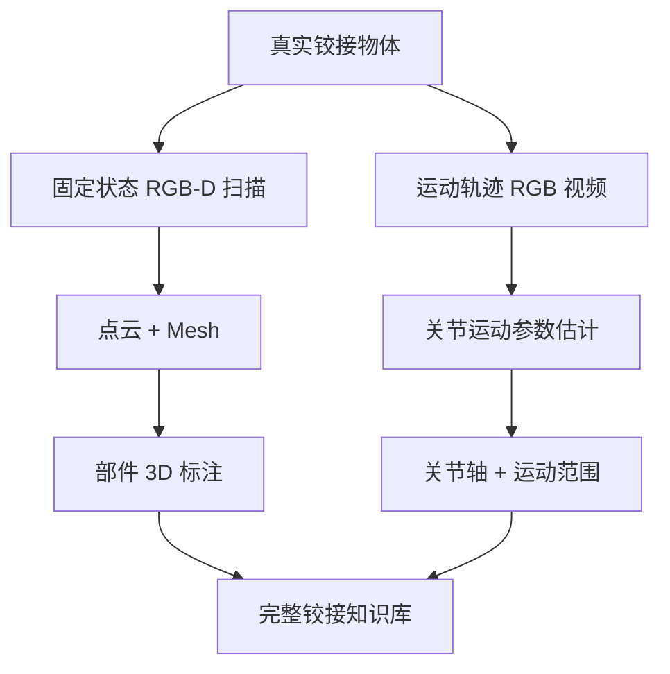

# AKB-48：真实铰接物体知识库

**论文**：Liu et al., "AKB-48: A Real-World Articulated Object Knowledge Base", CVPR 2022  
**项目页**：[https://liuliu66.github.io/articulationobjects](https://liuliu66.github.io/articulationobjects)  
**许可证**：学术非商业使用  
**规模**：2,037 个物体实例，48 个类别，RGB-D 视频序列

## 核心特点

AKB-48 是少数同时满足"真实扫描"和"铰接部件标注"两个条件的数据集。大多数数据集只能二选一：PartNet-Mobility 有铰接标注但是合成的，OmniObject3D 是真实扫描但没有铰接信息。AKB-48 通过精心设计的采集流程，在真实物体上同时获得了这两者。

## 数据内容

每个物体实例提供：

- **多状态 RGB-D 扫描**：在 3-5 个不同关节角度下各扫描一组点云，覆盖物体的运动空间
- **部件 mesh**：从点云重建，每个可动部件独立的 mesh 文件
- **关节参数**：轴方向、旋转中心、运动范围（手工标注和自动估计混合验证）
- **RGB 视频序列**：物体从关闭到打开的完整运动过程

48 个类别包括：冰箱、微波炉、洗碗机、烤箱、抽屉柜、保险柜、工具箱、行李箱、折叠椅、剪刀、订书机、夹子等，均为真实购买的商品，外观多样，不同品牌的同类物体在数据集中都有覆盖。

## 与 PartNet-Mobility 的对比

| 维度 | AKB-48 | PartNet-Mobility |
|------|--------|-----------------|
| 数据来源 | 真实扫描 | CAD 合成 |
| 外观多样性 | ✅ 高（真实商品） | ❌ 偏理想化 |
| 铰接标注 | ✅ | ✅ |
| 关节精度 | 中（手工+自动） | 高（设计时已知） |
| 类别数 | 48 | 46 |
| 实例数 | 2,037 | 2,346 |
| 域间隙 | 无 | 存在 |

## 在 3DGS 中的使用

AKB-48 提供的 RGB-D 视频可以直接转换为 3DGS 训练所需的多视角图像序列。每个状态的扫描可以单独训练一个静态 3DGS，再用关节参数把两个 3DGS 对齐，研究铰接物体的动态表示。

实用流程：

1. 从 RGB-D 序列中提取关键帧，用 COLMAP 或数据集自带相机参数完成标定
2. 对每个关节状态分别训练 3DGS
3. 利用部件 mesh 和关节轴标注，评测 3DGS 部件分割的准确性

## 局限

- RGB-D 扫描的点云噪声比结构光方案（如 OmniObject3D）略高，部件边界处尤为明显。
- 关节参数精度有限，部分样本的轴方向误差在 5-10° 级别。
- 数据集较大，下载和预处理流程相对繁琐，没有 PartNet-Mobility 的 SAPIEN 集成方便。

**知识链接**

- [PartNet-Mobility：合成版本，关节精度更高，SAPIEN 支持完善](/数据集/002_PartNet_Mobility_铰接物体数据集)
- [OmniObject3D：真实扫描但无铰接标注](/数据集/005_OmniObject3D_真实扫描物体数据集)
