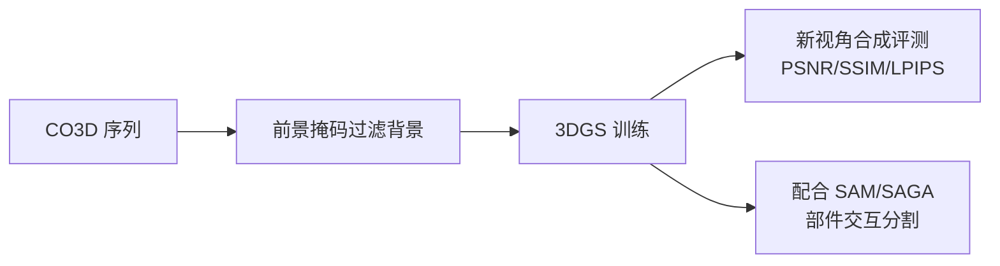

# CO3D：Meta 的多视角物体视频数据集

**论文**：Reizenstein et al., "Common Objects in 3D: Large-Scale Learning and Evaluation of Real-life 3D Category Reconstruction", ICCV 2021  
**官网**：[https://github.com/facebookresearch/co3d](https://github.com/facebookresearch/co3d)  
**许可证**：CC BY-NC 4.0  
**规模**：约 190 万帧，50 个 MS-COCO 类别，~37,000 个视频序列

## 核心特点

CO3D 是用手机围绕日常物体拍摄的多视角视频集合，每段视频约 100-200 帧，相机轨迹近似环绕运动。数据集专为"从少量视图重建 3D 物体"设计，50 个类别直接对应 MS-COCO 的常见物体类别，便于与 2D 检测和分割方法衔接。

50 个类别覆盖：椅子、沙发、汽车、摩托车、自行车、书、苹果、香蕉、瓶子、杯子、碗、笔记本电脑、手机、时钟、花瓶、植物盆栽等。

## 数据内容

每个序列提供：

```
sequence_0001/
├── images/               # 原始帧（720p 或 1080p）
├── masks/                # 前景分割掩码（点云质量好的用 Detectron2，其余用人工）
├── depth_maps/           # 单目深度估计（DPT）
├── pointcloud.ply        # 稀疏点云（COLMAP SfM）
└── frame_annotations.jgz # 每帧的相机内外参 + 质量分
```

相机参数和质量分可以筛选出相机运动足够均匀的序列，过滤掉"手抖"严重的录制。

## 为什么适合 3DGS

CO3D 是目前帧密度最高的真实物体多视角数据集之一，其相机轨迹均匀性经过质量筛选，是 3DGS 方法的理想输入：



多篇 3DGS 工作用 CO3D 子集测试新视角合成质量，SAGA、Feature 3DGS 等分割方法也用 CO3D 的序列展示了交互式部件分割效果。

## 局限

- **无部件级标注**：只有物体级前景掩码，没有零件级 GT，不能直接用于部件分割的定量评测。
- **背景干扰**：手机拍摄场景复杂，前景掩码质量参差不齐，部分序列背景泄漏严重。
- **非商业许可**：CC BY-NC 限制商业用途。
- **图像分辨率不统一**：早期序列为 720p，后期部分为 1080p，训练时需统一下采样。

## 推荐使用场景

CO3D 最适合作为 3DGS 重建质量和新视角合成的**定量基准**，以及交互式分割方法的**定性展示**载体。如果需要部件级评测，应在 CO3D 重建出的高质量 3DGS 上运行 SAM/SAGA，产出伪 GT 后再与 3D-OVS 等有 GT 的场景交叉验证。

**知识链接**

- [OmniObject3D：结构光扫描，几何精度更高](/数据集/005_OmniObject3D_真实扫描物体数据集)
- [3D-OVS：带部件 GT 掩码，可定量评测分割](/数据集/008_3DOVS_开放词汇3D分割评测)
