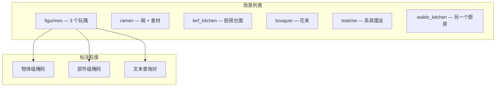

# 3D-OVS：开放词汇 3D 分割评测场景

**论文**：Liu et al., "Weakly Supervised 3D Open-vocabulary Segmentation", NeurIPS 2023  
**代码 & 数据**：[https://github.com/Kunhao-Liu/3D-OVS](https://github.com/Kunhao-Liu/3D-OVS)  
**许可证**：MIT  
**规模**：6 个场景，每场景包含 2-5 个物体，含部件级 GT 掩码

## 核心特点

3D-OVS 是专门为**开放词汇 3D 分割**设计的评测集，是目前在 3DGS 社区中使用最广泛的有 GT 的小型 benchmark。它的独特之处在于：不仅提供物体级掩码，还提供**部件级 GT**（如椅子的腿、背、坐面，玩具熊的头、身体、四肢），可以用文本描述精确查询任意部件并与 GT 对比。



## 场景详情

| 场景 | 物体数 | 部件查询数 | 代表性查询 |
|------|--------|----------|-----------|
| figurines | 3 | 12 | "the head of the bear", "the arm of the robot" |
| ramen | 4 | 8 | "the noodles", "the egg yolk" |
| lerf_kitchen | 5 | 10 | "the handle of the mug", "the cap of the bottle" |
| bouquet | 3 | 6 | "the red flower", "the green stem" |
| teatime | 4 | 9 | "the lid of the teapot", "the handle" |
| waldo_kitchen | 5 | 11 | "the cutting board", "the knife blade" |

## 评测指标

3D-OVS 使用两个指标：

**mIoU（3D 点云级）**：把预测的高斯分割结果投影到点云，与 GT 点云标签计算 IoU，在所有文本查询上取平均。

**Acc（体素级）**：把预测和 GT 都体素化后计算逐体素准确率，对细小部件（如把手）更敏感。

这两个指标结合 LangSplat、Feature 3DGS、LERF 等方法已有大量对比结果，便于直接比较新方法。

## 数据格式

```
scene_figurines/
├── images/               # 多视角图像（已完成 COLMAP 标定）
├── sparse/               # COLMAP 稀疏重建结果
├── gt_masks/
│   ├── bear_head.npy     # 点云级 GT 掩码（bool 数组）
│   ├── bear_body.npy
│   └── ...
└── queries.json          # 文本查询 → GT mask 文件名的映射
```

GT mask 是 numpy bool 数组，长度等于点云点数，直接与从 3DGS 采样的点云对齐。

## 局限

- **规模极小**：只有 6 个场景，不适合用于训练，只能评测。
- **桌面摆拍场景**：物体大多是小型玩具或厨房用品，不含大型机械或可动部件。
- **无铰接信息**：所有物体静态，不覆盖微波炉门、自行车轮子这类动态部件场景。

## 与 Gaussian Grouping 场景的配合

Gaussian Grouping 开源的测试序列与 3D-OVS 的场景来源部分重合（都源自 LERF 的演示序列），两者结合可以同时评测**实例级分割**（Gaussian Grouping 指标）和**开放词汇部件查询**（3D-OVS 指标），是目前最完整的 3DGS 分割评测组合。

**知识链接**

- [Gaussian Grouping 评测场景](/数据集/009_Gaussian_Grouping_评测场景)
- [LangSplat：三维语言高斯场景](/论文综述/143_LangSplat_三维语言高斯场景)
- [SAGA：提示驱动的三维高斯分割](/论文综述/142_SAGA_提示驱动的三维高斯分割)
