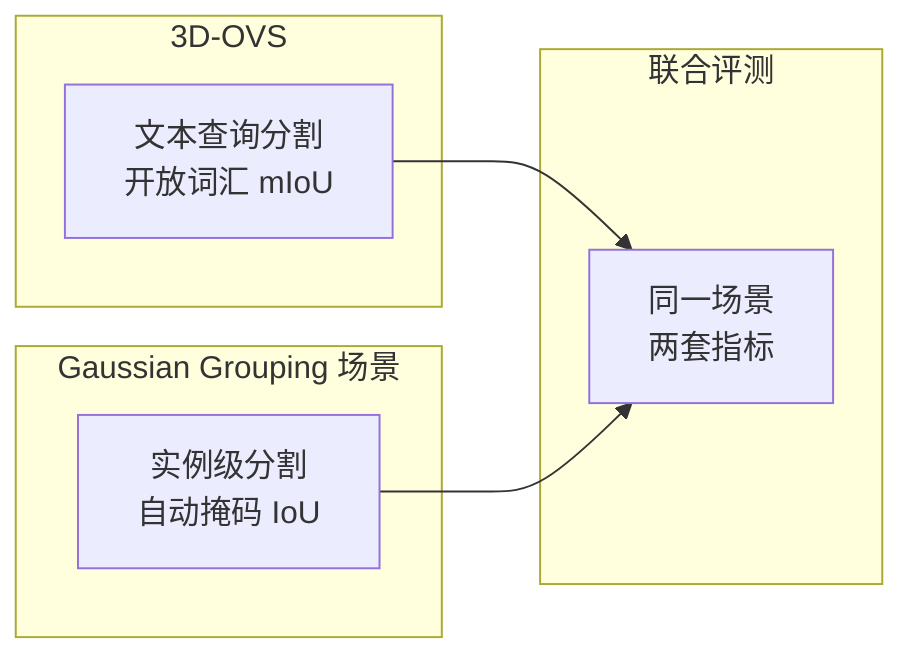

# Gaussian Grouping 评测场景

**来源论文**：Ye et al., "Gaussian Grouping: Segment and Edit Anything in 3D Scenes", ECCV 2024  
**代码 & 数据**：[https://github.com/lkeab/gaussian-grouping](https://github.com/lkeab/gaussian-grouping)  
**许可证**：MIT  
**规模**：约 10 个多视角视频序列，覆盖室内、桌面、室外多种场景

## 核心特点

Gaussian Grouping 随论文开源的评测场景是目前专门用于**3DGS 实例级分割**最完善的公开数据。每个序列都附带用 SAM 自动生成并经人工核查的多视角一致实例掩码，可以直接用于训练实例 ID 特征并做定量评测。

场景不局限于小物体：既有桌面多物体场景（类似 3D-OVS），也有室内家具场景和带人物的室外场景。

## 场景列表

| 场景名 | 类型 | 主要内容 | 实例数 |
|--------|------|---------|--------|
| figurines | 桌面 | 3 个玩偶 | ~8 |
| teatime | 桌面 | 茶具 + 食物 | ~10 |
| lerf_kitchen | 桌面 | 厨房小物件 | ~12 |
| garden | 室外 | 花园桌椅 | ~15 |
| counter | 室内 | 厨房台面 | ~20 |
| room | 室内 | 客厅家具 | ~25 |
| bear | 单物体 | 玩具熊（部件级） | ~5 |
| truck | 单物体 | 玩具卡车（部件级） | ~6 |

`bear` 和 `truck` 这两个单物体场景是部件级分割的核心测试场景，可以验证是否能把玩具的头、四肢、轮子等部件各自独立分割出来。

## 标注格式

```
scene_bear/
├── images/               # 多视角图像（已完成 COLMAP 标定）
├── sparse/               # COLMAP SfM 结果
├── sam_masks/
│   ├── 00000.png         # 第 0 帧的彩色实例掩码图
│   ├── 00001.png
│   └── ...
└── instance_mapping.json # 实例 ID → 语义名称
```

SAM 掩码以彩色 PNG 存储，每种颜色对应一个实例 ID。`instance_mapping.json` 把数字 ID 映射到语义标签（如 `3 → "bear_head"`），便于计算语义级别的 mIoU。

## 与 3D-OVS 的互补关系



两个评测集的 `figurines`、`teatime`、`lerf_kitchen` 三个场景完全相同，可以在同一组重建结果上分别跑两套指标，横向对比语义查询精度和实例召回率。

## 快速开始

```bash
git clone https://github.com/lkeab/gaussian-grouping
cd gaussian-grouping

# 下载场景数据
bash scripts/download_data.sh

# 训练（以 bear 场景为例）
python train.py \
    -s data/bear \
    -m output/bear \
    --config configs/gaussian_grouping.yaml
```

训练完成后用 `scripts/eval_seg.py` 计算实例分割 mIoU，结果可直接与论文数字对比。

**知识链接**

- [3D-OVS：开放词汇查询 GT，同一场景的互补评测](/数据集/008_3DOVS_开放词汇3D分割评测)
- [Gaussian Grouping 论文精读](/论文综述/141_GaussianGrouping_3DGS分割与编辑)
