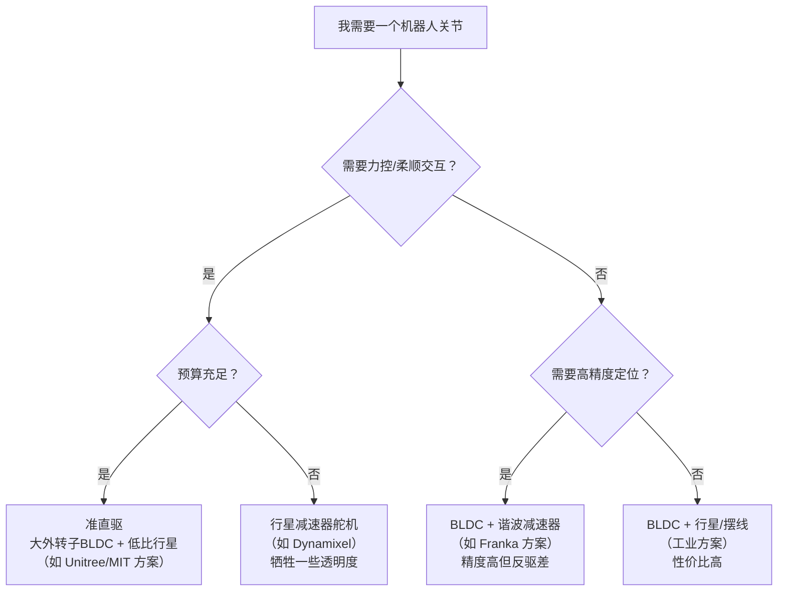

# 电机基础：从电流到扭矩

> **为什么要读这篇**：机器人的每一个关节、每一根手指的运动，最终都归结为一个电机在转。理解电机怎么把电流变成扭矩、不同电机类型有什么特点、减速器怎么选，是理解所有上层硬件方案的基础。这篇文章从最基本的电磁力讲起，覆盖机器人领域最常见的三类电机和三类减速器，最后给出选型思路。

**知识链接**：
- [电机驱动与控制](/硬件基础/H02_电机驱动与控制) — 本文讲电机本体，下一篇讲怎么控制它
- [传感器与反馈](/硬件基础/H03_传感器与反馈) — 电机需要编码器反馈位置/速度
- [机械臂方案综述](/硬件基础/H04_机械臂方案综述) — 电机+减速器构成关节，多个关节构成臂
- [灵巧手方案综述](/硬件基础/H05_灵巧手方案综述) — 灵巧手对电机的特殊需求

---

## 0. 贯穿全文的例子：一个 6DoF 桌面机械臂

为了让讨论不抽象，我们假设你正在搭建一台 **6 自由度桌面协作臂**（类似 Koch v1.1 或 SO-100），负载能力 500g，末端速度 0.5 m/s。这台臂的每个关节里都有一个电机+减速器。我们会不断回到这个例子，看看每种技术选型对这台臂意味着什么。

---

## 1. 电机的基本原理：为什么电流能产生扭矩

### 1.1 从洛伦兹力到旋转运动

电机的工作原理只有一句话：**载流导线在磁场中受力**。

具体地说：一根通了电流 $I$ 的导线，放在磁感应强度为 $B$ 的磁场中，会受到一个垂直于电流和磁场方向的力（洛伦兹力）：

$$
F = BIL
$$

**这个公式在做什么**：计算一段载流导线在磁场中受到的力的大小。

::: details 📐 逐符号拆解 + 数值代入（点击展开）
**逐符号拆解**：

| 符号 | 含义 | 具体是什么 | 典型值 |
|------|------|-----------|--------|
| $F$ | 导线受到的力 | 单位：牛顿 (N) | 0.01~10 N |
| $B$ | 磁感应强度 | 永磁体或电磁铁产生的磁场强度，单位：特斯拉 (T) | 钕磁铁约 0.5~1.4 T |
| $I$ | 导线中的电流 | 单位：安培 (A) | 0.1~30 A |
| $L$ | 导线在磁场中的有效长度 | 单位：米 (m) | 0.01~0.1 m |

**数值代入**：假设我们桌面臂关节电机中，$B = 1.0\text{ T}$（高性能钕磁铁），$I = 2\text{ A}$，$L = 0.03\text{ m}$（线圈有效边长 3cm）：

$$
F = 1.0 \times 2 \times 0.03 = 0.06\text{ N}
$$

单根导线产生 0.06 N 的力看似很小，但电机转子上绕了几百匝线圈（假设 200 匝），力就放大到 $0.06 \times 200 = 12\text{ N}$。再乘以转子半径（如 0.015 m），扭矩为 $12 \times 0.015 = 0.18\text{ N·m}$——这已经是小型舵机的量级了。

**为什么是这个形式**：这是安培力的简化形式（导线垂直于磁场时取最大值）。如果导线和磁场有夹角 $\theta$，力为 $F = BIL\sin\theta$。电机设计中会让线圈边始终保持接近垂直于磁场，以最大化出力。
:::

把这根导线绕成线圈、安装在可旋转的轴上，就得到了电机的转子。力产生在转子外缘，通过力臂（转子半径 $r$）转化为扭矩 $\tau = F \cdot r$。**这就是所有电机的底层物理**——剩下的都是工程上怎么让这个力持续、稳定、高效地产生。

### 1.2 电机的核心指标

在选电机时，你会遇到以下几个关键参数：

| 参数 | 符号 | 含义 | 对机器人的影响 |
|------|------|------|---------------|
| 额定扭矩 | $\tau_{\text{rated}}$ | 电机能持续输出的扭矩 | 决定关节能扛多重的负载 |
| 堵转扭矩 | $\tau_{\text{stall}}$ | 转子被卡住时的最大扭矩 | 碰撞/急停时的极限能力 |
| 空载转速 | $\omega_{\text{no-load}}$ | 无负载时的最大转速（rpm 或 rad/s） | 决定关节能动多快 |
| 扭矩常数 | $K_t$ | 每安培电流产生多少扭矩（N·m/A） | $\tau = K_t \cdot I$，核心设计参数 |
| 反电动势常数 | $K_e$ | 每 rad/s 转速产生多少反电压（V·s/rad） | 数值上 $K_e = K_t$（SI 单位下） |
| 转动惯量 | $J$ | 转子自身的惯性 | 惯量越小，加减速越灵敏 |
| 线圈电阻 | $R$ | 内阻 | 影响效率和发热 |

### 1.3 扭矩-转速曲线：电机的"能力边界"

每个电机都有一条特征曲线：**扭矩越大，转速越低；转速越高，扭矩越小**。这条曲线近似为一条直线（对于直流电机）：

$$
\omega = \omega_{\text{no-load}} - \frac{\omega_{\text{no-load}}}{\tau_{\text{stall}}} \cdot \tau
$$

**这个公式在做什么**：描述电机在不同负载下的转速——负载越重（$\tau$ 越大），转速越低。

::: details 📐 逐符号拆解 + 数值代入（点击展开）
**逐符号拆解**：

| 符号 | 含义 | 说明 |
|------|------|------|
| $\omega$ | 当前转速 (rad/s) | 输出轴的角速度 |
| $\omega_{\text{no-load}}$ | 空载转速 | 没有负载时电机能达到的最大转速 |
| $\tau_{\text{stall}}$ | 堵转扭矩 | 转速为零时电机能输出的最大扭矩 |
| $\tau$ | 当前负载扭矩 | 外部施加在电机上的负载 |

**数值代入**：假设一个小型无刷电机，$\omega_{\text{no-load}} = 500\text{ rad/s}$（约 4800 rpm），$\tau_{\text{stall}} = 0.5\text{ N·m}$。当负载 $\tau = 0.2\text{ N·m}$ 时：

$$
\omega = 500 - \frac{500}{0.5} \times 0.2 = 500 - 200 = 300\text{ rad/s}（约 2900 rpm）
$$

**为什么是这个形式**：这是一条线性近似。物理原因：负载增大 → 电机转速下降 → 反电动势减小 → 电流增大 → 扭矩增大，直到扭矩=负载时达到稳态。这个负反馈过程在稳态下呈现线性关系。
:::

**对机器人的含义**：机器人关节需要同时满足"扛得住重"（扭矩）和"动得够快"（转速）。但扭矩和转速不可兼得——这就是为什么需要减速器：用减速器把高转速/低扭矩转换为低转速/高扭矩。

---

## 2. 三类电机：有刷直流、无刷直流、步进

机器人领域最常见的三种电机，各有特点：

### 2.1 有刷直流电机（Brushed DC Motor）

**结构**：转子上绕线圈，定子是永磁体。通过**电刷和换向器**实现电流方向自动切换，使转子持续旋转。

**工作原理**：
1. 电流通过电刷进入转子线圈
2. 线圈在永磁体磁场中受力转动
3. 转到一定角度后，换向器切换电流方向，使力矩方向不变
4. 转子持续旋转

**优点**：
- 控制极其简单——正转反转就是改电压正负
- 成本低
- 低速大扭矩特性好

**缺点**：
- 电刷磨损→寿命有限（典型 1000~5000 小时）
- 电刷产生电火花→电磁干扰
- 高速时效率下降

**在机器人中的应用**：低成本教育机器人、简单夹爪、小型舵机（如 SG90 里面就是有刷直流电机+齿轮减速器）。

### 2.2 无刷直流电机（BLDC / PMSM）

**结构**：与有刷电机"反过来"——定子上绕线圈，转子是永磁体。没有电刷，靠电子换向（通过驱动电路控制哪组线圈通电）。

**工作原理**：
1. 驱动器检测转子位置（通过霍尔传感器或反电动势）
2. 按顺序给定子不同相的线圈通电
3. 定子产生旋转磁场，吸引转子永磁体跟随
4. 转子持续旋转

**优点**：
- 无电刷磨损→寿命长（10000+ 小时）
- 效率高（85~95%）
- 功率密度高（同体积输出更大功率）
- 低噪音、低发热
- 精确控制（配合 FOC 算法可实现力矩/速度/位置三环控制）

**缺点**：
- 需要电子驱动器（增加成本和复杂度）
- 控制算法较复杂（需要 FOC/矢量控制）

**在机器人中的应用**：**这是现代机器人关节的主流选择**。协作臂（Franka、UR）、灵巧手（Ability Hand）、腿足机器人（Unitree）几乎全部使用无刷电机。

### 2.3 步进电机（Stepper Motor）

**结构**：定子有多组线圈（相），转子有齿。通过按固定顺序给各相通电，转子每次精确转动一个固定角度（"步"）。

**工作原理**：
1. 给 A 相通电→转子对齐到 A 相位置
2. 切换到 B 相通电→转子转一个步距角对齐到 B 相
3. 按 A→B→C→D→A… 顺序切换，转子连续旋转
4. 每一步转动角度固定（典型值：1.8° = 200 步/圈）

**优点**：
- 开环定位精确——不需要编码器就能知道转了多少步
- 低速保持力矩大
- 控制简单（脉冲+方向信号）
- 成本适中

**缺点**：
- 高速时扭矩急剧下降
- 有"失步"风险（负载超过保持力矩时跳步，位置丢失）
- 振动和噪音较大
- 效率低（所有相始终在耗电发热）

**在机器人中的应用**：3D 打印机、CNC（开环位置控制足够）、低成本线性导轨。**机器人关节很少用步进电机**——因为负载变化大，失步风险高，且力控能力差。

### 2.4 三类电机对比总结

| 特性 | 有刷直流 | 无刷直流 (BLDC) | 步进 |
|------|----------|----------------|------|
| 寿命 | 短（电刷磨损） | 长 | 长 |
| 效率 | 中（70~85%） | 高（85~95%） | 低（50~70%） |
| 控制复杂度 | 低 | 高（需 FOC 驱动） | 中（脉冲+方向） |
| 力控能力 | 差 | **优秀**（电流∝扭矩） | 差 |
| 功率密度 | 中 | **高** | 低 |
| 成本 | 低 | 中~高 | 低~中 |
| 机器人关节适用性 | ❌ 低端 | ✅ **主流** | ❌ 极少 |

**结论**：如果你在做正经的机器人关节，**无刷直流电机（BLDC）是唯一的正确选择**。有刷电机只在教育场景凑合，步进电机是 CNC 领域的东西。

---

## 3. 减速器：为什么需要、怎么选

### 3.1 为什么需要减速器

回到我们的桌面臂例子：关节处需要大约 3~5 N·m 的扭矩来抬起臂体+500g 负载。但一个尺寸合理（直径 40mm 以内）的无刷电机，裸出轴扭矩通常只有 0.05~0.3 N·m，转速却有 3000~8000 rpm。

**问题**：扭矩太小、转速太高。

**解决**：加一个减速比 $N$ 的减速器：
- 输出扭矩变为原来的 $N$ 倍（忽略效率损失）
- 输出转速变为原来的 $1/N$

$$
\tau_{\text{out}} = N \cdot \eta \cdot \tau_{\text{motor}}
$$

**这个公式在做什么**：计算经过减速器后关节实际能输出的扭矩。

::: details 📐 逐符号拆解 + 数值代入（点击展开）
**逐符号拆解**：

| 符号 | 含义 | 典型值 |
|------|------|--------|
| $\tau_{\text{out}}$ | 减速器输出轴扭矩 | 关节需要的扭矩，如 3~5 N·m |
| $N$ | 减速比 | 机器人关节常用 50:1~160:1 |
| $\eta$ | 传动效率 | 谐波减速器约 0.65~0.85，行星减速器约 0.80~0.95 |
| $\tau_{\text{motor}}$ | 电机输出扭矩 | 小型 BLDC 约 0.05~0.3 N·m |

**数值代入**：电机输出 0.1 N·m，减速比 50:1，效率 0.8：

$$
\tau_{\text{out}} = 50 \times 0.8 \times 0.1 = 4.0\text{ N·m}
$$

这就够我们的桌面臂关节用了。输出转速 = 电机转速 / 50，如果电机 3000 rpm，输出 60 rpm = 1 圈/秒，对于关节运动绰绰有余。

**为什么是这个形式**：能量守恒。输入功率 = 输出功率 + 摩擦损失。功率 = 扭矩 × 转速，减速比 N 倍，扭矩放大 N 倍、转速缩小 N 倍，功率不变（乘以效率 η 扣除损失）。
:::

### 3.2 行星减速器（Planetary Gearbox）

**结构**：一个太阳轮（中心齿轮）+ 若干行星轮（围绕太阳轮转）+ 外圈齿圈。输入接太阳轮，输出接行星架（或反过来）。

**工作原理**：太阳轮转动 → 带动行星轮自转并公转 → 行星架以较低转速输出。多个行星轮同时啮合，载荷分布均匀。

**优点**：
- 效率高（单级 90~97%，两级 85~92%）
- 承载能力强（多齿同时啮合）
- 结构紧凑，同轴设计
- 可双向传动（反驱透明度好）

**缺点**：
- 有齿轮间隙（backlash）——回程时有"虚位"
- 典型间隙：低端 1~2°，精密级 3~8 arcmin
- 单级减速比有限（通常 3:1~10:1），大减速比需多级串联

**典型减速比**：单级 3~10，两级 10~100

**在机器人中的应用**：
- 低成本臂的关节（如 Koch v1.1 使用行星减速器舵机）
- 对精度要求不极端、但对效率和反驱透明度要求高的场景
- 腿足机器人（MIT Mini Cheetah 用的就是行星减速器——因为需要反驱透明以实现力控）

### 3.3 谐波减速器（Harmonic Drive）

**结构**：三个核心部件——
1. **波发生器（Wave Generator）**：椭圆形凸轮+薄壁轴承，输入轴
2. **柔轮（Flexspline）**：薄壁金属杯，外面有齿，可弹性变形，输出轴
3. **刚轮（Circular Spline）**：内圈有齿的刚性环，固定不动

**工作原理**：
1. 波发生器旋转，把柔轮撑成椭圆形
2. 椭圆长轴处柔轮齿与刚轮齿啮合
3. 柔轮齿数比刚轮少 2 个（如柔轮 198 齿、刚轮 200 齿）
4. 波发生器转一圈，柔轮相对刚轮退后 2 个齿→减速比 = 柔轮齿数 / 齿差 = 198/2 = 99:1

**优点**：
- **零回差**（zero backlash）——柔轮和刚轮齿面贴合，无间隙
- 单级即可实现高减速比（50:1~160:1）
- 精度极高（重复定位精度可达 ±5 arcsec）
- 体积极小，结构扁平

**缺点**：
- 效率较低（65~85%），柔轮弹性变形消耗能量
- **反驱透明度差**——从输出端很难反向驱动输入端（摩擦大）
- 柔轮寿命有限（疲劳失效）
- 价格昂贵（Harmonic Drive 品牌单价 2000~8000 元）

**典型减速比**：50:1~160:1，最常见 100:1

**在机器人中的应用**：
- 协作臂关节的标配（Franka Emika 全部 7 个关节都用谐波减速器）
- 需要高精度位置控制的场景
- **注意**：谐波减速器的低反驱透明度意味着"从外部推动关节"很困难——这对力控和安全碰撞检测是个问题

### 3.4 摆线针轮减速器（Cycloidal Drive）

**结构**：偏心轴驱动一个摆线盘在一圈针齿（固定的滚针）内做摆线运动。摆线盘上有若干输出孔，通过输出销将运动传递出去。

**工作原理**：
1. 偏心轴转动 → 摆线盘做偏心摆动
2. 摆线盘外缘与固定针齿啮合（摆线盘齿数比针齿少 1~2 个）
3. 每转一圈，摆线盘自转一个齿距 → 高减速比
4. 输出销把摆线盘的缓慢自转传出来

**优点**：
- 承载能力极强（几乎整圈齿同时啮合）
- 抗冲击性好
- 效率中等偏上（75~90%）
- 比谐波便宜，寿命更长（无柔轮疲劳问题）
- 单级减速比高（6:1~119:1）

**缺点**：
- 有一定回差（比谐波大，比行星小）
- 轴向尺寸比谐波略大
- 振动和噪音比谐波大

**在机器人中的应用**：
- 工业机器人大关节（FANUC、安川）
- 人形机器人的髋/膝关节（Unitree H1 部分关节使用摆线/行星方案）
- 追求性价比的高扭矩场景

### 3.5 三类减速器对比

| 特性 | 行星减速器 | 谐波减速器 | 摆线针轮 |
|------|-----------|-----------|----------|
| 减速比（单级） | 3~10 | 50~160 | 6~119 |
| 效率 | 90~97% | 65~85% | 75~90% |
| 回差 | 3~15 arcmin | **≈0** | 1~3 arcmin |
| 反驱透明度 | **高** | 低 | 中 |
| 精度 | 中 | **高** | 中~高 |
| 承载能力 | 中 | 低~中 | **高** |
| 体积 | 中 | **小（扁平）** | 中 |
| 成本 | 低~中 | 高 | 中 |
| 寿命 | 长 | 中（柔轮疲劳） | 长 |
| 典型应用 | 腿足机器人、低成本臂 | 协作臂、精密关节 | 工业机器人、重载关节 |

### 3.6 近年新趋势：准直驱（Quasi-Direct Drive）

传统方案是"小电机 + 高减速比（50~160:1）"。近年来出现了一种新思路：**大电机 + 低减速比（4~10:1）**，称为"准直驱"。

**核心理念**：
- 用体积更大、扭矩常数更高的电机，直接输出较大扭矩
- 只用很低的减速比（或完全不用减速器——纯直驱）
- 代表：MIT Mini Cheetah（减速比 6:1 行星）、HEBI Robotics、Unitree A1 腿

**优点**：
- **反驱透明度极高**：从外部可以轻松推动关节→天然适合力控和碰撞安全
- 低摩擦→力估计精度高（不需要力传感器，电流就能反映力）
- 响应快（低惯量传动链）
- 机械结构简单，可靠性高

**缺点**：
- 电机体积和重量大（需要大直径外转子电机）
- 电流需求大→驱动器功率要求高
- 同样输出扭矩下，系统总重量可能更大

**对算法的影响**：准直驱关节的力控带宽高、摩擦小，非常适合做 RL 训练——因为电机电流和输出力矩之间几乎是线性关系（$\tau \approx K_t \cdot I$），sim-to-real gap 更小。这也是为什么很多 RL 研究选择 Unitree 腿足机器人的原因之一。

---

## 4. 从电机到关节：一体化关节模组

现代机器人越来越多地使用**一体化关节模组**（Integrated Joint Module），把电机、减速器、编码器、驱动器全部封装在一个模块里。用户只需要提供电源和通信总线，发送扭矩/位置/速度指令即可。

### 4.1 典型一体化关节模组举例

| 产品 | 电机类型 | 减速器 | 减速比 | 输出扭矩 | 通信接口 | 应用场景 |
|------|----------|--------|--------|----------|----------|----------|
| Dynamixel XM540 | BLDC | 行星 | 272.5:1 | 4.1 N·m | RS-485/TTL | 教育/低成本臂 |
| Unitree A1 关节 | 外转子 BLDC | 行星 | 6.33:1 | 33.5 N·m | CAN | 腿足机器人 |
| HEBI X-Series | BLDC | 行星 | 不同型号 | 3~38 N·m | Ethernet | 研究级协作臂 |
| 大疆 RoboMaster M3508 | BLDC | 行星 | 19:1 | 3 N·m | CAN | 竞赛/教育 |
| Fourier GR-1 关节 | BLDC | 谐波 | 100:1 | 200+ N·m | EtherCAT | 人形机器人 |

### 4.2 选型思路

为我们的 6DoF 桌面臂选关节：

1. **确定关节扭矩需求**：根据臂长和负载计算每个关节需要的最大扭矩
   - 肩部关节（离负载最远、力臂最长）需要最大扭矩
   - 腕部关节需要最小扭矩
   
2. **确定速度需求**：关节最大转速要求（典型值：60~180°/s）

3. **确定控制模式**：
   - 纯位置控制 → 谐波减速器方案（精度高）
   - 力控/柔顺控制 → 准直驱或高效率行星方案（反驱透明度需求）
   - 混合 → 取决于具体任务

4. **预算约束**：
   - 学生预算 → Dynamixel 系列或 STS3215 舵机（Koch 臂方案）
   - 研究预算 → Franka（整臂）或 HEBI 模组
   - 产品级 → 定制关节模组

---

## 5. 关键概念：反驱透明度（Backdrivability）

这个概念值得单独强调，因为它**直接影响机器人能不能做力控、能不能安全地与人交互**。

**定义**：反驱透明度指"从输出端施加力时，能多容易地反向驱动输入端"。

**物理直觉**：想象你握住机器人的手臂末端去推它——
- 如果关节很容易被推动（像拨动弹簧一样），说明反驱透明度高
- 如果关节纹丝不动（像推墙一样），说明反驱透明度低

**影响因素**：
- 减速比越高 → 反驱越难（输出端的力被减速比"放大"后才能驱动电机）
- 减速器摩擦越大 → 反驱越难（谐波减速器柔轮摩擦大）
- 电机转子惯量 × 减速比² = 等效输出端惯量（减速比平方效应！）

$$
J_{\text{output}} = N^2 \cdot J_{\text{motor}} + J_{\text{gearbox}}
$$

**这个公式在做什么**：计算从输出端"感受到"的等效转动惯量——减速比的平方效应使得高减速比方案的输出端惯量巨大。

::: details 📐 逐符号拆解 + 数值代入（点击展开）
**逐符号拆解**：

| 符号 | 含义 | 说明 |
|------|------|------|
| $J_{\text{output}}$ | 输出端等效惯量 | 从关节输出端感受到的总惯量 |
| $N$ | 减速比 | 输入转速/输出转速 |
| $J_{\text{motor}}$ | 电机转子惯量 | 小型 BLDC 约 $10^{-5}$~$10^{-4}$ kg·m² |
| $J_{\text{gearbox}}$ | 减速器本身的惯量 | 通常远小于 $N^2 J_{\text{motor}}$ |

**数值代入**：

方案 A——高减速比：$N = 100$，$J_{\text{motor}} = 5 \times 10^{-5}$ kg·m²
$$
J_{\text{output}} = 100^2 \times 5 \times 10^{-5} = 0.5\text{ kg·m²}
$$

方案 B——准直驱：$N = 6$，$J_{\text{motor}} = 8 \times 10^{-4}$ kg·m²（大电机）
$$
J_{\text{output}} = 6^2 \times 8 \times 10^{-4} = 0.029\text{ kg·m²}
$$

方案 B 的输出端惯量只有方案 A 的 5.8%！这意味着：
- 人推动准直驱关节只需很小的力
- 碰撞时准直驱关节能快速"让开"
- 力控的带宽和精度远优于高减速比方案

**为什么是这个形式**：能量等效。输出端角速度 $\omega_{\text{out}}$ 对应电机角速度 $N \cdot \omega_{\text{out}}$。动能 $\frac{1}{2}J_{\text{motor}}(N\omega_{\text{out}})^2 = \frac{1}{2}(N^2 J_{\text{motor}})\omega_{\text{out}}^2$，所以等效惯量为 $N^2 J_{\text{motor}}$。
:::

**结论**：如果你的机器人需要做力控（RL 训练、安全交互、遥操作），优先考虑低减速比方案。如果只需要位置控制（工业装配、精密放置），高减速比+谐波是更好的选择。

---

## 6. 总结与选型决策树

### 最终回到我们的桌面臂

对于那台 6DoF、500g 负载的桌面臂：
- **学生预算方案**：STS3215 总线舵机（有刷电机+行星减速器），整臂成本 < 2000 元。这就是 Koch v1.1 和 SO-100 的方案。控制精度一般，但够用且便宜。
- **研究预算方案**：Dynamixel XM540（BLDC+行星），整臂成本约 8000~15000 元。精度和力矩都好很多。
- **高端方案**：HEBI X5 系列或自研关节模组（BLDC+谐波/低比行星），整臂成本 5 万+。

---

## 延伸阅读

- [电机驱动与控制：位置/速度/力矩模式](/硬件基础/H02_电机驱动与控制) — 有了电机，接下来要学怎么控制它
- [传感器与反馈](/硬件基础/H03_传感器与反馈) — 电机运动的位置/速度信息怎么测量
- [机械臂方案综述](/硬件基础/H04_机械臂方案综述) — 多个关节怎么组装成一条臂
- [灵巧手方案综述](/硬件基础/H05_灵巧手方案综述) — 灵巧手对电机的特殊要求
