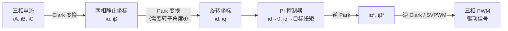
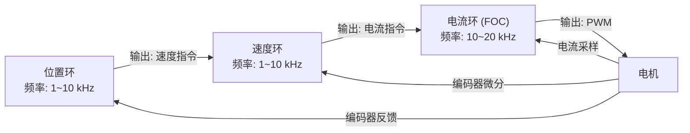
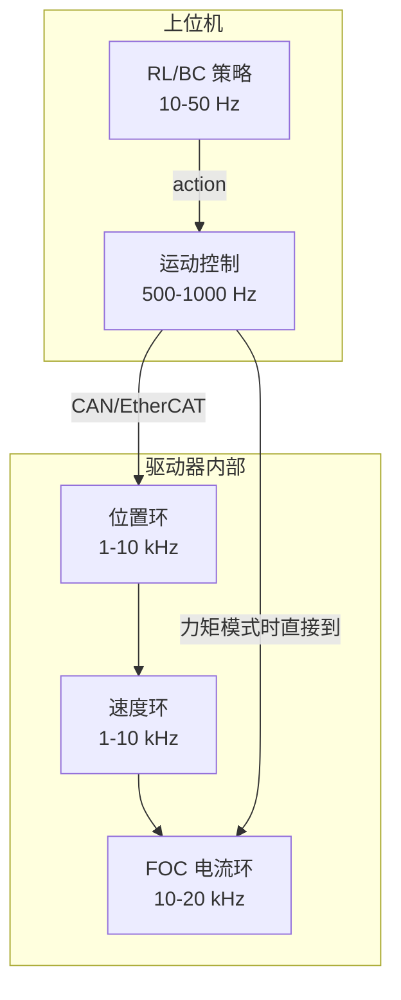

# 电机驱动与控制：位置/速度/力矩模式

> **为什么要读这篇**：上一篇讲了电机本体的物理原理，但"电机能转"和"电机按你的意思精确地转"之间隔着一个完整的控制系统。这篇文章讲清楚：驱动器怎么让无刷电机转起来（FOC 算法）、三环控制是什么、机器人常用的通信协议（CAN/EtherCAT），以及不同控制模式对机器人行为意味着什么。

**知识链接**：
- [电机基础：从电流到扭矩](/硬件基础/H01_电机基础_从电流到扭矩) — 本文的前置，理解电机本体
- [传感器与反馈](/硬件基础/H03_传感器与反馈) — 控制环依赖传感器反馈
- [机械臂方案综述](/硬件基础/H04_机械臂方案综述) — 控制模式选择影响臂的行为
- [灵巧手方案综述](/硬件基础/H05_灵巧手方案综述) — 灵巧手对力控的高要求

---

## 0. 贯穿全文的例子

延续上一篇的 6DoF 桌面臂。现在我们有了 BLDC 电机+行星减速器，下一步是：**怎么让这个电机精确地运动到指定位置、以指定速度运动、或输出指定力矩**。这三种需求对应三种控制模式，是整篇文章的主线。

---

## 1. 无刷电机为什么需要 FOC

### 1.1 问题：无刷电机不能"直接通电就转"

有刷电机很简单——接上电池正负极就能转。但无刷电机有三组线圈（三相），必须按正确的时序和幅值给三相供电，才能产生平滑旋转的磁场。

如果随便给三相通电，会发生什么？转子会抖一下然后卡住，或者剧烈振动。

### 1.2 六步换相：最简单的驱动方式

最原始的方案是**六步换相（Six-Step Commutation）**：

1. 用霍尔传感器检测转子位置（每 60° 电角度一个区间）
2. 根据当前区间，选择给哪两相通电（6 种组合循环）
3. 转子每转 60° 电角度切换一次

**问题**：电流是方波而非正弦波 → 扭矩输出有明显波动（ripple）→ 运动不平滑 → 关节抖动。

对机器人来说，扭矩波动意味着末端抖动、力控精度下降。所以我们需要更好的方案。

### 1.3 FOC（Field-Oriented Control / 矢量控制）

**FOC 是现代机器人电机驱动的标准算法**。核心思想：通过数学变换，把复杂的"三相交流控制"问题变成简单的"两个直流量控制"问题。

**核心步骤**：



**关键洞察**：在旋转坐标系下：
- $i_q$（q 轴电流）直接正比于扭矩：$\tau = K_t \cdot i_q$
- $i_d$（d 轴电流）不产生扭矩，通常控制为 0

所以 FOC 把"控制扭矩"简化为"控制 $i_q$"——一个简单的 PI 控制器就够了。

### 1.4 FOC 需要什么硬件支持

| 需求 | 硬件 | 说明 |
|------|------|------|
| 转子角度 θ | 磁编码器 / 霍尔传感器 | Park 变换需要实时角度 |
| 相电流测量 | 电流采样电阻 + ADC | 至少测两相（第三相由基尔霍夫定律算出） |
| PWM 生成 | MCU 定时器（如 STM32 高级定时器） | 产生三路互补 PWM |
| 计算能力 | ARM Cortex-M4/M7 或 DSP | Clark/Park 变换 + PI 控制，典型频率 10~40 kHz |

**FOC 执行频率**：通常 10~20 kHz（电流环），即每 50~100 μs 完成一次完整的 Clark→Park→PI→逆变换→PWM 更新。

---

## 2. 三环嵌套控制：从电流到位置

机器人关节控制的核心架构是**三环嵌套**——从内到外：



### 2.1 电流环（最内环）—— 力矩控制的基础

- **输入**：目标电流 $i_q^*$（即目标扭矩 $\tau^* / K_t$）
- **输出**：三相 PWM 占空比
- **控制器**：PI 控制器
- **频率**：10~20 kHz
- **作用**：确保实际电流快速跟踪目标电流。这是所有上层控制的基础。

$$
\tau = K_t \cdot i_q
$$

**这个公式在做什么**：电机输出扭矩与 q 轴电流成正比——这就是为什么"电流控制"等价于"力矩控制"。

::: details 📐 逐符号拆解 + 数值代入（点击展开）
**逐符号拆解**：

| 符号 | 含义 | 典型值 |
|------|------|--------|
| $\tau$ | 电机输出扭矩 (N·m) | 0.01~10 N·m |
| $K_t$ | 扭矩常数 (N·m/A) | 0.01~0.5 N·m/A |
| $i_q$ | q 轴电流 (A) | 0~30 A |

**数值代入**：假设 $K_t = 0.05$ N·m/A，目标扭矩 0.3 N·m：

$$
i_q^* = \frac{0.3}{0.05} = 6\text{ A}
$$

电流环的工作就是让实际 $i_q$ 快速稳定在 6A。

**为什么是这个形式**：这是 BLDC 电机在 FOC 框架下的本质关系。q 轴电流产生的磁场始终垂直于转子磁场（Park 变换保证了这一点），所以力矩和 $i_q$ 呈线性关系，系数就是电机的扭矩常数。
:::

### 2.2 速度环（中间环）

- **输入**：目标速度 $\omega^*$
- **输出**：目标电流 $i_q^*$
- **控制器**：PI 或 PID 控制器
- **频率**：1~10 kHz
- **反馈**：编码器读数的微分（或直接用编码器速度输出）

**逻辑**：如果当前速度 < 目标速度 → 增大电流（加速）；当前速度 > 目标速度 → 减小电流（减速）。

### 2.3 位置环（最外环）

- **输入**：目标位置 $\theta^*$
- **输出**：目标速度 $\omega^*$
- **控制器**：PID 控制器（有时只用 PD）
- **频率**：1~10 kHz
- **反馈**：编码器绝对位置

**逻辑**：如果当前位置偏左 → 输出正向速度指令；位置偏右 → 输出反向速度指令。越接近目标位置，速度指令越小→平滑停止。

---

## 3. 三种控制模式与机器人应用

从"三环"中可以提取出三种独立的控制模式，对应不同的使用场景：

### 3.1 位置模式（Position Mode）

**工作方式**：上位机发送目标角度 → 关节自己完成位置伺服（内部三环全部跑）。

**特点**：
- 最简单的使用方式——发一个角度，等它到位
- 关节行为"僵硬"——它会尽全力到达目标位置，不管外部有没有障碍
- 安全性差——如果撞到人，电机会持续加大电流试图到达目标位置

**适用场景**：
- 工业机器人走固定轨迹
- 低成本舵机的默认模式
- 不需要与环境交互的定点运动

**在我们桌面臂中的使用**：Koch v1.1 的 STS3215 舵机就是纯位置模式。上位机以 30~50 Hz 频率发送 6 个关节的目标角度，舵机自己伺服到位。

### 3.2 速度模式（Velocity Mode）

**工作方式**：上位机发送目标速度 → 关节维持恒定转速。

**特点**：
- 适合持续旋转的场景（轮式底盘、传送带）
- 不关心具体位置，只关心移动速度

**适用场景**：
- 移动机器人底盘驱动
- 丝杆/滑台的匀速运动
- 不常用于关节型机械臂

### 3.3 力矩模式（Torque / Current Mode）

**工作方式**：上位机直接发送目标扭矩（或等价地，目标电流）→ 电机输出恒定力矩，不管位置和速度。

**特点**：
- **最灵活、最底层**的控制模式——上位机完全接管运动规划
- 需要上位机自己做位置/速度控制（通常是更高级的算法如阻抗控制、RL 策略输出等）
- 关节行为"柔顺"——如果外力大于设定扭矩，关节会被推动

**适用场景**：
- **力控/阻抗控制**：让机器人像弹簧一样——被推就让，松手回来
- **RL 策略**：很多 RL 论文的 action space 就是目标扭矩
- **遥操作**：力反馈示教
- **安全交互**：限制最大力矩，碰到人自动让开

**在我们桌面臂中的使用**：如果升级到 Dynamixel 或更高端的关节，可以切换到电流模式，由上位机运行 PD 控制器+力限制。这就是"软件力控"的基础。

### 3.4 混合模式：阻抗控制

实际机器人很少只用单一模式。最常见的混合方式是**阻抗控制（Impedance Control）**：

$$
\tau = K_p(\theta^* - \theta) + K_d(\dot{\theta}^* - \dot{\theta}) + \tau_{\text{ff}}
$$

**这个公式在做什么**：让关节表现得像一个"弹簧-阻尼器"系统——偏离目标位置时被拉回（弹簧），运动时有阻尼（减震），同时可以加前馈扭矩补偿重力。

::: details 📐 逐符号拆解 + 数值代入（点击展开）
**逐符号拆解**：

| 符号 | 含义 | 说明 |
|------|------|------|
| $\tau$ | 发送给电机的目标扭矩 | 电流环跟踪这个值 |
| $K_p$ | 位置刚度 (N·m/rad) | 越大越"硬"——偏离目标位置时回复力越大 |
| $\theta^* - \theta$ | 位置误差 | 目标角度 - 当前角度 |
| $K_d$ | 速度阻尼 (N·m·s/rad) | 越大越"粘"——运动时阻力越大 |
| $\dot{\theta}^* - \dot{\theta}$ | 速度误差 | 目标速度 - 当前速度 |
| $\tau_{\text{ff}}$ | 前馈扭矩 | 补偿重力、摩擦等已知扰动 |

**数值代入**：$K_p = 5$ N·m/rad，$K_d = 0.1$ N·m·s/rad，目标位置 $\theta^* = 1.0$ rad，当前位置 $\theta = 0.8$ rad，当前速度 $\dot\theta = 2$ rad/s，目标速度 $\dot\theta^* = 0$，重力补偿 $\tau_{\text{ff}} = 1.5$ N·m：

$$
\tau = 5 \times (1.0 - 0.8) + 0.1 \times (0 - 2) + 1.5 = 1.0 - 0.2 + 1.5 = 2.3\text{ N·m}
$$

分解：弹簧项贡献 1.0 N·m（把关节拉向目标）、阻尼项贡献 -0.2 N·m（减缓运动）、重力补偿贡献 1.5 N·m（抵抗重力）。

**为什么是这个形式**：这本质上是弹簧-阻尼器的力学模型。$K_p$ 对应弹簧系数，$K_d$ 对应阻尼系数。通过调节 $K_p$ 和 $K_d$，可以让同一个关节表现出从"极硬"（高 $K_p$，接近位置控制）到"极软"（低 $K_p$，几乎可以被随意推动）的不同行为。RL 策略可以输出 ($\theta^*$, $K_p$, $K_d$) 三元组，实现可变刚度控制。
:::

**MIT Mini Cheetah 的控制接口**就是这个形式。它的电机驱动器接受 ($\theta^*$, $\dot\theta^*$, $K_p$, $K_d$, $\tau_{\text{ff}}$) 五个参数，在驱动器内部以 40 kHz 频率执行上述公式。上位机只需以 500~1000 Hz 发送这五个参数即可。

---

## 4. 通信协议：上位机怎么和关节"说话"

### 4.1 常见通信协议对比

| 协议 | 带宽 | 延迟 | 拓扑 | 典型应用 |
|------|------|------|------|----------|
| PWM | 极低（1 个标量） | < 1ms | 点对点 | 航模舵机 |
| UART/RS-485 | 中（1~3 Mbps） | 1~5 ms | 总线（菊花链） | Dynamixel |
| CAN | 中（1 Mbps） | < 1 ms | 总线（多主） | MIT Cheetah、RoboMaster |
| EtherCAT | 高（100 Mbps） | **< 100 μs** | 环形总线 | Franka、工业机器人 |
| Ethernet/UDP | 高（1 Gbps） | 1~5 ms | 星型 | HEBI、ROS 通信 |

### 4.2 CAN 总线：机器人最常用的协议

**为什么 CAN 这么流行**：
- 汽车行业验证了 30 年的可靠性
- 多个设备共用两根线（CAN_H、CAN_L），布线简单
- 内置仲裁机制——多个设备同时发送时自动处理冲突
- 延迟低且确定性好
- 每帧 8 字节数据——刚好够传一组关节指令

**典型 CAN 帧格式（MIT 风格）**：

```
发送到关节:
| 目标位置 (16bit) | 目标速度 (12bit) | Kp (12bit) | Kd (12bit) | τ_ff (12bit) |
共 8 字节

关节回复:
| 当前位置 (16bit) | 当前速度 (12bit) | 当前扭矩 (12bit) |
共 5 字节
```

控制频率：通常 500~1000 Hz。6 个关节的 CAN 总线通信在 1 Mbps 速率下，每个控制周期所有关节的收发在 1 ms 内即可完成。

### 4.3 EtherCAT：高性能方案

EtherCAT 是以太网的实时扩展，特点：
- 1000 Hz 控制频率+亚毫秒级确定性延迟
- 支持更多数据（不限于 8 字节）
- 带宽足以支持高精度编码器数据+多轴同步

**Franka Emika** 的 7 个关节通过 EtherCAT 以 1 kHz 同步通信。每个周期传递目标扭矩和接收关节状态（位置、速度、电流、温度等）。

---

## 5. 控制频率与实时性

### 5.1 为什么控制频率很重要

机器人关节控制的频率层次：

| 层级 | 频率 | 内容 |
|------|------|------|
| 电流环 (FOC) | 10~40 kHz | 驱动器内部，保证电流精确跟踪 |
| 速度/位置环 | 1~10 kHz | 驱动器内部，保证运动平滑 |
| 上位机指令 | 50~1000 Hz | 上位机发送目标位置/扭矩 |
| RL 策略推理 | 10~50 Hz | 神经网络计算新 action |

**关键约束**：上位机指令频率必须 >> 机械系统的谐振频率。如果指令频率太低，关节运动会出现阶梯感甚至振荡。

**经验法则**：
- 纯位置控制：50~100 Hz 够用
- 速度控制：100~500 Hz
- 力矩控制 / 阻抗控制：**≥ 500 Hz**（否则力控会有明显延迟和振荡）

### 5.2 实时操作系统

力矩模式下 500~1000 Hz 的确定性控制，普通 Linux 做不到——系统调度可能导致某些周期延迟几十毫秒。解决方案：

- **RT-PREEMPT Linux**：给 Linux 内核打实时补丁，可达 1 kHz 确定性
- **Xenomai**：在 Linux 之上跑实时核心
- **裸机 MCU**：直接在 STM32/ESP32 上跑控制循环（无 OS 抖动）
- **ROS2 + 实时执行器**：ROS2 的 `ros2_control` 框架支持实时循环

**Franka 的方案**：RT-PREEMPT Linux + EtherCAT + 1 kHz 确定性控制循环。用户在实时线程中可以以 1 kHz 直接发送力矩指令。

---

## 6. 对算法开发者的启示

| 你要做的事 | 需要的控制模式 | 需要的频率 | 硬件要求 |
|-----------|--------------|-----------|----------|
| 行为克隆（模仿学习） | 位置模式 | 30~50 Hz | 任何舵机 |
| RL 训练（sim-to-real） | 力矩模式 | 500~1000 Hz | 准直驱+实时系统 |
| 遥操作数据采集 | 力矩模式（低刚度） | 200~500 Hz | 可反驱的关节 |
| 精密装配任务 | 混合（位置+力） | 500~1000 Hz | 高精度+力传感器 |
| 安全人机交互 | 阻抗控制 | 500~1000 Hz | 力矩模式+碰撞检测 |

**核心信息**：如果你的 RL 策略输出的是力矩/阻抗参数，你的硬件必须支持力矩模式+至少 500 Hz 的通信频率。如果你的策略输出的是目标位置（如 ACT 类方法），50 Hz 的位置模式舵机就够了，但牺牲了柔顺性和安全性。

---

## 7. 总结



- **FOC** 是无刷电机驱动的标准算法，把"控制扭矩"简化为"控制一个直流量 $i_q$"
- **三环嵌套**（电流→速度→位置）是伺服系统的基本架构
- **位置模式**最简单但最僵硬，**力矩模式**最灵活但需要实时系统支持
- **阻抗控制**是力位混合的最佳实践，MIT Cheetah 风格的五参数接口是业界标准
- **CAN 总线**是机器人关节通信的主流选择，EtherCAT 用于高性能场景

---

## 延伸阅读

- [电机基础：从电流到扭矩](/硬件基础/H01_电机基础_从电流到扭矩) — 回顾电机本体的物理原理
- [传感器与反馈](/硬件基础/H03_传感器与反馈) — FOC 和位置环依赖的编码器/电流传感器
- [机械臂方案综述](/硬件基础/H04_机械臂方案综述) — 不同臂选择了哪种控制模式
- [系统集成与选型指南](/硬件基础/H07_系统集成与选型指南) — 从通信协议到实时系统的完整集成方案
