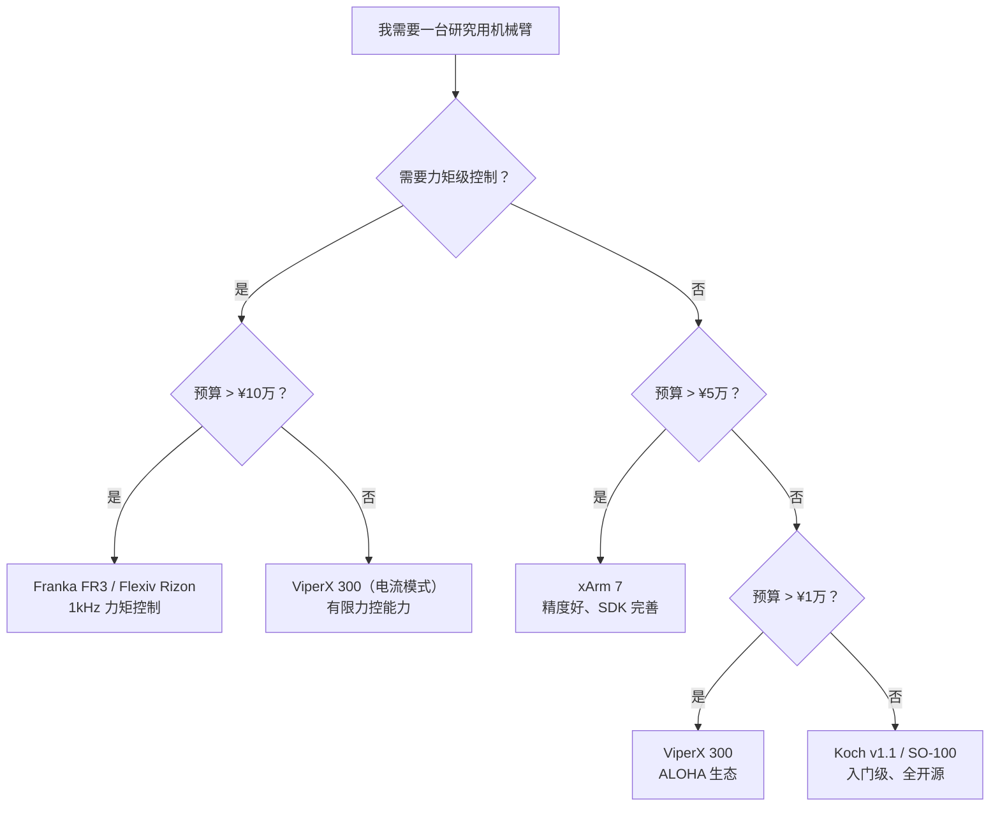

# 机械臂方案综述：从协作臂到低成本臂

> **为什么要读这篇**：做机器人学习研究，第一个要选的硬件就是机械臂。这篇文章系统梳理学术界和产业界的主流机械臂方案——从 10 万级的 Franka 到千元级的 Koch 臂——帮你根据研究需求和预算做出选型决策。

**知识链接**：
- [电机基础：从电流到扭矩](/硬件基础/H01_电机基础_从电流到扭矩) — 关节里的电机类型和减速器选择
- [电机驱动与控制](/硬件基础/H02_电机驱动与控制) — 控制模式（位置/力矩）对臂行为的影响
- [传感器与反馈](/硬件基础/H03_传感器与反馈) — 关节编码器和末端力传感器
- [灵巧手方案综述](/硬件基础/H05_灵巧手方案综述) — 臂末端可以装什么手/夹爪

---

## 0. 机械臂的基本分类维度

选机械臂时要考虑的核心维度：

| 维度 | 选项 | 说明 |
|------|------|------|
| 自由度 (DoF) | 4 / 5 / 6 / 7 | 6 DoF = 末端可达任意位姿；7 DoF = 冗余，避障更灵活 |
| 负载 | 0.5~300 kg | 桌面研究用 0.5~5 kg，工业搬运 10~300 kg |
| 臂展 | 300~2000 mm | 工作空间大小 |
| 控制接口 | 位置/速度/力矩 | 位置→最简单；力矩→最灵活 |
| 安全性 | 有/无碰撞检测 | 协作臂必须有 |
| 精度 | ±0.01~±2 mm | 重复定位精度 |

---

## 1. 研究级协作臂（¥10万+）

### 1.1 Franka Emika Panda / FR3

| 项目 | Panda | FR3 |
|------|-------|-----|
| DoF | 7 | 7 |
| 负载 | 3 kg | 3 kg |
| 臂展 | 855 mm | 855 mm |
| 重复精度 | ±0.1 mm | ±0.1 mm |
| 控制接口 | **力矩模式 @ 1 kHz** | 力矩模式 @ 1 kHz |
| 通信 | EtherCAT（内部） + FCI | EtherCAT + FCI |
| 关节结构 | BLDC + 谐波减速器 | BLDC + 谐波减速器 |
| 力传感 | **每个关节有力矩传感器** | 每个关节有力矩传感器 |
| 价格 | ~¥15~25 万（已停产） | ~¥20~30 万 |

**为什么 Franka 是学术界标配**：
1. **1 kHz 力矩级控制**：可以直接发送 7 个关节的目标力矩，延迟 < 1 ms
2. **每关节力矩传感器**：不需要额外装传感器就能做力控和碰撞检测
3. **libfranka / franka_ros2**：官方 C++ SDK + ROS2 集成，API 设计优秀
4. **安全碰撞检测**：硬件级别的碰撞停止，适合人机共处环境

**局限**：
- 贵
- 负载只有 3 kg（安装灵巧手后可操作负载更小）
- 谐波减速器的反驱透明度差→纯电流力控精度受限（但有力矩传感器弥补）
- 已停产（FR3 是替代品但生态还在建设）

**谁在用**：Stanford（Mobile ALOHA 的 ViperX 方案之前用的是 Franka）、UC Berkeley（Bridge）、TU Darmstadt、大量欧洲研究组。

### 1.2 Universal Robots UR5e / UR10e

| 项目 | UR5e | UR10e |
|------|------|-------|
| DoF | 6 | 6 |
| 负载 | 5 kg | 12.5 kg |
| 臂展 | 850 mm | 1300 mm |
| 重复精度 | ±0.03 mm | ±0.05 mm |
| 控制接口 | 位置/速度 @ 500 Hz | 位置/速度 @ 500 Hz |
| 力传感 | **内置六维力/力矩传感器（末端）** | 内置 F/T |
| 价格 | ~¥15~20 万 | ~¥20~25 万 |

**特点**：
- 工业应用最广泛的协作臂
- 6 DoF（非冗余）但精度极高
- 内置末端力传感器→可做力控任务
- 开放的 RTDE 接口（Real-Time Data Exchange），500 Hz 控制

**对 RL 研究的限制**：
- **没有暴露关节力矩接口**——只能发位置/速度指令
- 力控只能通过末端力传感器+外部控制器实现
- 不如 Franka 灵活（Franka 可以直接发力矩）

**谁在用**：Google DeepMind（部分项目）、很多工业级研究、需要大负载/长臂展的场景。

### 1.3 Kuka iiwa / LBR Med

| 项目 | 参数 |
|------|------|
| DoF | 7 |
| 负载 | 7~14 kg |
| 控制接口 | 关节力矩 @ 1 kHz |
| 特点 | 每关节力矩传感器，医疗认证版本 |
| 价格 | ~¥30~50 万 |

类似 Franka 的定位但负载更大，价格也更贵。DLR（德国航空航天中心）的研究经常用 Kuka。

---

## 2. 中端研究臂（¥3~10万）

### 2.1 Flexiv Rizon 4

| 项目 | 参数 |
|------|------|
| DoF | 7 |
| 负载 | 4 kg |
| 臂展 | 700 mm |
| 控制接口 | 力矩/阻抗 @ 1 kHz |
| 特点 | 自适应力控，国产方案 |
| 价格 | ~¥10~15 万 |

**特点**：国产协作臂中力控做得最好的方案之一。对标 Franka，有 1 kHz 力矩级接口。

### 2.2 UFACTORY xArm 6/7

| 项目 | xArm 6 | xArm 7 |
|------|---------|--------|
| DoF | 6 | 7 |
| 负载 | 5 kg | 3.5 kg |
| 臂展 | 700 mm | 700 mm |
| 控制接口 | 位置/速度 @ 250 Hz | 位置/速度 @ 250 Hz |
| 精度 | ±0.1 mm | ±0.1 mm |
| 价格 | ~¥4~6 万 | ~¥5~7 万 |

**特点**：
- 性价比极高的国产方案
- 开箱即用，SDK 完善（Python/C++/ROS）
- 无力矩模式→只能做位置控制

**适合**：行为克隆研究（不需要力控）、桌面操作实验、教学演示。

### 2.3 Trossen Robotics ViperX 300

| 项目 | 参数 |
|------|------|
| DoF | 6 |
| 负载 | 750 g |
| 臂展 | 700 mm |
| 关节 | Dynamixel XM540/XM430 舵机 |
| 控制接口 | 位置/速度/电流 @ 30~50 Hz |
| 价格 | ~¥10,000~15,000 |

**特点**：
- **ALOHA 项目**的标配臂（Stanford / TRI 的遥操作+行为克隆方案）
- Dynamixel 舵机→可以切换到电流模式做简单力控
- 社区生态极好（ALOHA、ACT、Diffusion Policy 等论文都用过）
- 开源硬件+软件

**局限**：负载小、精度一般、速度慢。但对于桌面操作任务完全够用。

---

## 3. 低成本研究臂（< ¥5,000）

### 3.1 Koch v1.1 / SO-100

| 项目 | Koch v1.1 | SO-100 |
|------|-----------|--------|
| DoF | 6 | 6 |
| 负载 | ~300~500 g | ~300 g |
| 关节 | STS3215 / Feetech 舵机 | STS3215 |
| 结构 | 3D 打印 + 铝管 | 3D 打印 |
| 控制接口 | 位置 @ 30~50 Hz（串口总线） | 位置 @ 30~50 Hz |
| 总成本 | **< ¥2,000** | **< ¥1,500** |
| 开源 | ✅ 完全开源 | ✅ 完全开源（LeRobot） |

**特点**：
- **最低成本的可研究级机械臂**
- LeRobot（Hugging Face）官方支持的硬件方案
- 适合行为克隆、扩散策略等位置控制类算法的快速验证
- 全 3D 打印，BOM 完全公开

**局限**：
- STS3215 是有刷电机+塑料齿轮箱→精度和寿命有限
- 纯位置模式，无力控能力
- 负载极小，只能操作轻物体
- 关节存在明显间隙（backlash）

**适合**：学生入门、快速算法验证、遥操作数据采集。**不适合**需要力控或高精度的研究。

### 3.2 Alexander Koch's Gello

低成本遥操作主手。用 Dynamixel 舵机搭建的遥操作输入设备，设计和 Koch 机械臂配合使用。成本约 ¥3,000~5,000。

---

## 4. 关键对比表

| 方案 | DoF | 负载 | 控制模式 | 频率 | 价格 | 适合研究 |
|------|-----|------|---------|------|------|----------|
| Franka FR3 | 7 | 3 kg | **力矩** | 1 kHz | ¥25万 | RL、力控、精密操作 |
| UR5e | 6 | 5 kg | 位置/速度 | 500 Hz | ¥18万 | 工业级、大负载 |
| Flexiv Rizon | 7 | 4 kg | **力矩** | 1 kHz | ¥12万 | RL、力控（国产） |
| xArm 7 | 7 | 3.5 kg | 位置 | 250 Hz | ¥6万 | BC/位置控制研究 |
| ViperX 300 | 6 | 750 g | 位置/电流 | 50 Hz | ¥1.2万 | ALOHA/桌面操作 |
| Koch v1.1 | 6 | 500 g | 位置 | 50 Hz | ¥2,000 | 入门/快速验证 |
| SO-100 | 6 | 300 g | 位置 | 50 Hz | ¥1,500 | LeRobot 生态 |

---

## 5. 运动学基础：DH 参数与自由度

### 5.1 为什么是 6 DoF 或 7 DoF

在三维空间中描述一个刚体的位姿需要 **6 个自由度**（3 个平移 + 3 个旋转）。因此：

- **6 DoF 臂**：理论上恰好能让末端到达任意位置和姿态（在工作空间内）
- **7 DoF 臂**：多一个冗余自由度。好处：同一个末端位姿可以有多种关节构型→可以绕开障碍物、优化关节力矩分配

**对 RL 的影响**：7 DoF 的动作空间多一维，但冗余性让逆运动学有更多解→策略有更多"合法"路径可选→训练可能更容易。

### 5.2 关节构型

绝大多数机械臂是**串联关节**（每个关节串接）。关节类型：
- **旋转关节（Revolute, R）**：绕一个轴旋转，运动范围 ±180°（或更小）
- **棱柱关节（Prismatic, P）**：沿一个轴平移（用于丝杆升降台，臂上不常见）

典型 7 DoF 臂的构型：`R-R-R-R-R-R-R`（全旋转关节）。前三个关节负责"把末端送到指定位置"，后三个（或四个）负责"把末端转到指定姿态"。

---

## 6. 双臂方案

很多操作任务需要双手协作（如折衣服、拧瓶盖）。常见双臂设置：

| 方案 | 代表 | 特点 |
|------|------|------|
| 两台独立臂 | ALOHA (2×ViperX) | 简单、灵活、两臂独立控制 |
| 双臂一体化 | Baxter / Sawyer (Rethink) | 共享底座，已停产 |
| 人形上半身 | ALOHA 2 (Google) | 双臂+躯干，Mobile 版本有移动底盘 |
| 国产方案 | 银河通用/宇树+双臂 | 新兴方案，生态建设中 |

**ALOHA 方案**之所以流行，是因为它用两对 ViperX（一对主手+一对从手）实现了低成本遥操作数据采集→行为克隆→双臂操作的完整闭环。

---

## 7. 选型决策树

---

## 8. 总结

- **如果做 RL + 力控**：Franka 或 Flexiv，必须有力矩接口
- **如果做行为克隆/扩散策略**：ViperX 或 xArm，位置控制够用
- **如果预算极有限**：Koch/SO-100 入门，验证算法后再升级硬件
- **如果需要双臂**：ALOHA 方案（2×ViperX）是目前最成熟的低成本选择
- **7 DoF 优于 6 DoF**：冗余自由度带来的灵活性值得多花的钱

---

## 延伸阅读

- [电机基础：从电流到扭矩](/硬件基础/H01_电机基础_从电流到扭矩) — 关节内部的电机和减速器选择
- [电机驱动与控制](/硬件基础/H02_电机驱动与控制) — 力矩模式 vs 位置模式的详细解释
- [灵巧手方案综述](/硬件基础/H05_灵巧手方案综述) — 臂末端装什么手
- [系统集成与选型指南](/硬件基础/H07_系统集成与选型指南) — 臂+手+感知的完整集成
