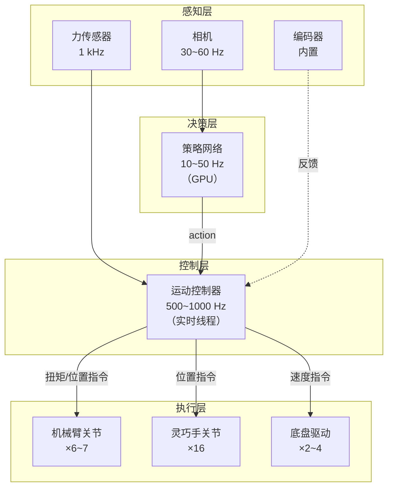

# 系统集成与选型指南：从选型到调试

> **为什么要读这篇**：前面几篇分别讲了电机、传感器、臂、手、底盘。但一个完整的机器人系统不是"把零件拼在一起"就行——还需要解决实时通信、时间同步、电源管理、软件框架等集成问题。这篇文章从系统视角给出完整的硬件-软件集成指南。

**知识链接**：
- [电机驱动与控制](/硬件基础/H02_电机驱动与控制) — 通信协议和实时性要求
- [传感器与反馈](/硬件基础/H03_传感器与反馈) — 多传感器数据同步
- [机械臂方案综述](/硬件基础/H04_机械臂方案综述) — 臂的控制接口
- [灵巧手方案综述](/硬件基础/H05_灵巧手方案综述) — 手的控制接口
- [视觉硬件方案](/硬件基础/H08_视觉硬件方案) — 相机数据流

---

## 1. 系统架构总览

一个典型的操作型机器人系统包含以下层次：



---

## 2. 实时性要求与解决方案

### 2.1 各环节的时间要求

| 环节 | 频率 | 延迟容忍 | 说明 |
|------|------|----------|------|
| 策略推理 | 10~50 Hz | 20~100 ms | GPU 上跑神经网络 |
| 运动控制 | 500~1000 Hz | < 1 ms | 必须确定性（实时） |
| 传感器读取 | 100~7000 Hz | < 1 ms | 力传感器最严格 |
| 视觉处理 | 10~30 Hz | 30~100 ms | 可异步 |

### 2.2 实时 Linux 方案

| 方案 | 延迟（典型） | 复杂度 | 说明 |
|------|-------------|--------|------|
| 普通 Linux + 优先级调度 | 1~10 ms | 低 | 位置模式够用 |
| RT-PREEMPT 内核 | 50~200 μs | 中 | 力控标配 |
| Xenomai | 10~50 μs | 高 | 极端实时需求 |
| 独立 MCU 控制器 | < 10 μs | 看实现 | 驱动器内置 |

**推荐**：力控场景用 RT-PREEMPT Linux + 1 kHz 控制循环。位置控制场景普通 Linux 就够。

---

## 3. 软件框架选择

### 3.1 ROS2 + ros2_control

**ros2_control** 是 ROS2 的标准硬件抽象层：
- 定义了 `HardwareInterface` 接口——不同硬件统一 API
- 提供 `ControllerManager`——实时循环内管理多个控制器
- 支持 `JointTrajectoryController`、`ForwardCommandController` 等标准控制器
- 支持实时线程（配合 RT-PREEMPT）

### 3.2 LeRobot（Hugging Face）

针对低成本方案的框架：
- 原生支持 Koch/SO-100/ViperX
- 数据采集 → 训练 → 部署 一站式
- Python 为主，不追求硬实时
- 适合位置控制+行为克隆研究

### 3.3 自定义控制栈

高端研究（Franka、Unitree）通常用自定义控制栈：
- C++ 实时控制循环
- 直接调用 libfranka / Unitree SDK
- 最大灵活性和最低延迟

---

## 4. 传感器同步

多传感器数据必须时间对齐，否则策略拿到的 observation 是"错位"的。

### 4.1 同步策略

| 方案 | 精度 | 复杂度 | 适合 |
|------|------|--------|------|
| 软件时间戳 | ±1~10 ms | 低 | 位置控制 |
| 硬件触发（GPIO） | ±10 μs | 中 | 相机-力传感器同步 |
| PTP/IEEE 1588 | ±1 μs | 高 | EtherCAT 系统 |

---

## 5. 电源设计

| 部件 | 功率 | 电压 | 说明 |
|------|------|------|------|
| 机械臂关节 | 50~200 W（总） | 24~48 V | 负载运动时峰值更高 |
| 灵巧手 | 10~30 W | 12~24 V | 多舵机同时动时电流大 |
| 计算单元（GPU） | 30~300 W | 12~19 V | Jetson 30W~72W |
| 传感器/通信 | 5~20 W | 5~12 V | 相机+力传感器 |

**移动平台的电池选择**：
- 桌面系统：直接用电源适配器，不需要电池
- 移动系统：6S~12S LiPo（22~48V），容量 10~30 Ah
- 续航：典型 1~3 小时（取决于关节负载）

---

## 6. 常见集成方案清单

### 6.1 学生入门方案（< ¥5,000）

```
Koch v1.1 × 2（主从臂）
+ USB 摄像头 × 2
+ 普通 PC（无 GPU 推理可用 CPU）
+ LeRobot 框架
= 遥操作数据采集 + 行为克隆
```

### 6.2 中端研究方案（¥5~20 万）

```
ViperX 300 × 2（ALOHA 配置）
+ RealSense D435i × 2~4
+ RTX 3090/4090 工作站
+ ROS2 + ros2_control
= 行为克隆 / 扩散策略 / ACT
```

### 6.3 高端力控方案（¥30 万+）

```
Franka FR3 × 1~2
+ Allegro Hand / LEAP Hand
+ DIGIT 触觉 × 4~5
+ ATI F/T 传感器
+ RT-PREEMPT Linux + libfranka
= RL sim-to-real / 力控操作 / 灵巧操作
```

---

## 7. 硬件-算法接口：Action Space 怎么映射到物理

| 算法输出 | 硬件需要 | 中间需要什么 |
|---------|---------|-------------|
| 关节位置 (7D) | 位置指令 | 直接发送即可 |
| 关节位置增量 (7D) | 位置指令 | 当前位置 + delta |
| 末端位姿 (6D/7D) | 关节位置 | **逆运动学**求解 |
| 关节力矩 (7D) | 电流指令 | $i_q = \tau / (K_t \cdot N)$ |
| 阻抗参数 ($\theta^*$, $K_p$, $K_d$) | 五参数指令 | MIT 风格接口直接支持 |

---

## 8. 调试建议

1. **先让每个关节独立动起来**——确认通信、编码器、电机方向都正确
2. **再做关节协调运动**——简单的正运动学验证
3. **然后加传感器**——确认同步和数据质量
4. **最后跑策略**——先用简单策略（如纯位置重放）验证全链路

---

## 延伸阅读

- [电机驱动与控制](/硬件基础/H02_电机驱动与控制) — 通信协议细节
- [传感器与反馈](/硬件基础/H03_传感器与反馈) — 传感器数据格式
- [机械臂方案综述](/硬件基础/H04_机械臂方案综述) — 各臂的具体控制接口
- [视觉硬件方案](/硬件基础/H08_视觉硬件方案) — 相机配置与同步
