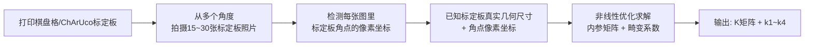
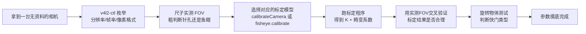
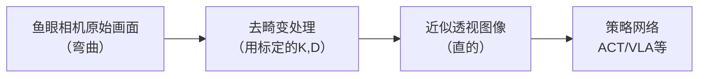

# 鱼眼相机方案：大视场角与畸变模型

> **为什么要读这篇**：越来越多机器人（尤其是人形机器人的头部相机、灵巧手的腕部相机、移动底盘的环视相机）在用鱼眼镜头——原因很简单，视场角（Field of View，FoV，相机能看到的角度范围）越大，一台相机能覆盖的场景越多，机器人就越不容易"看不到"关键物体。但鱼眼镜头拍出来的图像是弯曲的：桌子的边缘不是直线，而是弧线。这篇文章讲清楚鱼眼相机为什么会畸变、畸变怎么用数学模型描述、怎么标定，以及这些参数在机器人学习流程里具体怎么用。

**知识链接**：
- [视觉硬件方案：相机与点云](/硬件基础/H08_视觉硬件方案) — 本文的前置，RGB/RGB-D 相机选型与手眼标定的基础
- [传感器与反馈](/硬件基础/H03_传感器与反馈) — 视觉是机器人最重要的外感知传感器之一
- [系统集成与选型指南](/硬件基础/H07_系统集成与选型指南) — 相机数据流如何接入整体系统

**关联文章**：
- [Isaac Lab 仿真对齐与参数调优：从相机内参到关节 PD 增益](/工程实践/IsaacLab仿真对齐与参数调优) — 本文讲硬件原理，那篇讲怎么把这些参数配进仿真器里让仿真相机和真实鱼眼相机对齐
- [Sim-to-Real 迁移综述](/论文综述/S04_Sim_to_Real迁移综述) — 域随机化、系统辨识等 sim-to-real 方法论全景

---

## 0. 贯穿全文的例子

假设你在给一台人形机器人的头部装一颗相机。用普通镀膜镜头（水平视场角约 70°），机器人低头看操作台时，两侧的物体经常超出画面——机器人"看不到"旁边的工具。换成一颗水平视场角 180° 的鱼眼镜头，整张操作台连同两侧的工具架都能一次性收进画面。代价是：桌子的边缘、货架的立柱，在图像里全都弯了。这篇文章要解决的问题就是——这种"弯"是怎么产生的，怎么用参数描述它，以及机器人学习流程该怎么处理它。

---

## 1. 为什么视场角越大，画面就越"弯"

### 1.1 针孔相机模型：标准相机的基础

在讲鱼眼相机之前，先建立一个参照——绝大多数"看起来正常"的相机都遵循**针孔相机模型（Pinhole Camera Model）**：把相机简化成一个针孔和一块成像平面，三维空间中的一个点，沿直线穿过针孔投影到成像平面上的位置，由该点相对于光轴的角度 $\theta$ 决定。

这个几何关系直接画出来最容易理解：


> 场景中的点 $P$（绿色星形）相对光轴偏离了角度 $\theta$（橙色圆弧）。光线沿直线从 $P$ 穿过针孔 $O$（镜头中心），继续直线传播，打在像平面（深灰色竖线）上的点 $P'$（红点）就是 $P$ 的像。图中虚线围出了一个直角三角形 $O$-$O'$-$P'$：一条边是针孔到像平面的垂直距离 $f$（焦距），另一条边是像点偏离光轴的距离 $r$，夹角就是 $\theta$。**这三者的关系，就是直角三角形里最基础的正切定义**：邻边到对边的比值等于 $\tan\theta$。

针孔模型的投影关系就是把上图这个直角三角形写成公式：

$$
r = f \tan\theta
$$

**这个公式在做什么**：把"物体偏离相机正前方多少角度"换算成"它在图像上偏离画面中心多少像素距离"——这是所有标准相机（手机、单反、大多数工业相机）共享的基本几何关系。

::: details 📐 公式详解（点击展开）

| 子表达式 | 它是谁 | 它在干嘛 |
|---------|--------|---------|
| $\theta$ | **入射角** | 三维点相对于相机光轴（镜头正对的方向）的夹角，对应上图的橙色圆弧 |
| $f$ | **焦距** | 针孔到成像平面的距离，对应上图直角三角形里"邻边"那条虚线 |
| $r$ | **像面半径** | 该点在成像平面上偏离中心的距离，对应上图直角三角形里"对边"那条虚线，决定它落在图像里的哪个像素 |
| $\tan\theta$ | **正切换算** | 直角三角形里"对边/邻边"的比值，把角度转换成像面上的线性距离 |

**用人话读**："一个点偏离镜头正前方的角度越大，它在图像上离画面中心就越远，而且是按正切函数关系变远的。"

**为什么是这个形式**：直接看上面那张图——针孔、像平面上的落点、光轴垂足三者构成一个直角三角形，$\tan\theta$ 的定义就是"对边比邻边"，代入进去就是 $r/f$，整理一下就是 $r=f\tan\theta$。不是凑出来的公式，是三角形本身的几何性质。
:::

**问题出在哪**：正切函数在 $\theta \to 90°$ 时会发散到无穷大（$\tan(90°) = \infty$）。这意味着标准针孔相机**理论上无法拍到 90° 及以上视场角的画面**——越靠近画面边缘，需要的传感器尺寸就越大，实际工程上,水平视场角超过约 90°~100° 时,针孔模型就已经开始在画面边缘产生严重的拉伸畸变（常见于广角手机镜头拍人脸时,边缘的脸会被拉长变形）。


> 上图只画一件事：**同一个入射角 $\theta$，两种模型分别把它映射到像面上多远的位置（$r$）**。深灰色竖线是"传感器"，只有落在这条线的灰色阴影区间内的光线才能真正被相机拍到。左边针孔模型：$20°/40°$ 还能落在传感器范围内，但 $60°$ 已经明显超出，$75°$ 直接飞出画面——这就是"针孔相机拍不了大视场角"的直接后果：**角度稍微大一点，落点距离就爆炸式增长**。右边鱼眼模型：同样的 $20°/40°/60°/75°$ 四个角度，落点随角度**线性增长**，全部老老实实落在传感器范围内。两张图差的不是镜片材质，只是"角度换算成像面距离"这一个公式。

### 1.2 鱼眼镜头的解法：换一种角度到距离的映射关系

鱼眼镜头的核心设计思路就是：**放弃针孔模型的正切映射，换一种增长更慢的函数关系，让大角度也能映射到有限的像面距离上。**

常见的几种替代映射（统称为"鱼眼投影模型"）：

| 模型名称 | 数学关系 | 特点 |
|---------|---------|------|
| 透视投影（针孔，作对比） | $r = f\tan\theta$ | 标准镜头，$\theta \to 90°$ 时发散 |
| 体育场投影（Stereographic） | $r = 2f\tan(\theta/2)$ | 保角（局部形状不变），边缘畸变较小 |
| **等距投影（Equidistant / f-theta）** | $r = f\theta$ | 角度和像面距离成正比，最常见的鱼眼模型 |
| 等立体角投影（Equisolid Angle） | $r = 2f\sin(\theta/2)$ | 保持单位面积对应的立体角不变，常用于测光 |
| 正交投影（Orthographic） | $r = f\sin\theta$ | 边缘压缩最严重，$\theta=90°$ 时达到最大值 $f$ |


> 上图对比了五种投影模型在归一化焦距 $f=1$ 下的 $r(\theta)$ 曲线。可以看到针孔投影（红色）在接近 90° 时急剧发散，而等距投影（蓝色）是一条直线——这正是鱼眼镜头能拍到 180° 甚至更大视场角的数学原因：**角度和像面位置之间的映射关系本身就被设计成有界、平滑增长的**，不会像针孔模型那样在大角度时发散。

**这五个模型里最常用的是等距投影，也是本文后面标定、去畸变都基于的模型，值得单独把它的几何含义讲透。**

#### 1.2.1 $r=f\theta$ 到底是什么意思：用"展开圆弧"来理解

针孔模型的几何图像很好想：光线走直线，穿过针孔，打在一块平的像面上，像面距离由正切函数决定。但 $r=f\theta$ 里，$\theta$ 是一个**角度**（弧度），$r$ 是一个**长度**（比如毫米），这两者直接画等号，物理上到底在说什么？


> **左图**：以镜头中心 $O$ 为圆心，画一个半径为 $f$ 的参考圆弧——这个圆弧不是真实存在的玻璃部件，而是一个帮助理解的"虚拟参考球面"。每一条从 $O$ 发出的光线，都会先在这个参考圆弧上标记出一个对应的点，光线的入射角 $\theta$ 每增大一点，这个点在圆弧上走过的**弧长**就相应增大——根据初中学过的弧长公式，圆心角为 $\theta$（弧度）、半径为 $f$ 的圆弧，弧长正好是 $s=f\theta$。图中用四种颜色标出了 $20°,40°,60°,80°$ 分别对应的弧长，可以看到相邻两个 20° 的间隔，对应的弧长增量完全相等（因为半径固定，弧长只和角度成正比）。
>
> **右图**：鱼眼镜头的镜片组做的事情，就是把左图这个参考圆弧上的每一段弧，"原样展开、不拉伸不压缩"地铺到一块真正平的传感器上——弧多长，展开后落在传感器上的距离就有多长。右图里可以看到，展开之后，$20°,40°,60°,80°$ 对应的落点，间距和左图里对应的弧长完全一致。**这就是"等距投影"（equidistant）这个名字的来源**：角度每变化相同的量，像面上的距离也变化相同的量——两者是严格的线性关系，比例系数就是 $f$。

::: details 📐 从弧长公式推导 $r=f\theta$（点击展开）

| 子表达式 | 它是谁 | 它在干嘛 |
|---------|--------|---------|
| $f$ | **参考圆弧半径** | 等同于焦距，决定这个虚拟参考球面有多大 |
| $\theta$（弧度） | **圆心角** | 入射光线相对光轴的夹角，同时也是这段圆弧对应的圆心角 |
| $s=f\theta$ | **弧长** | 初中弧长公式：弧长 = 半径 × 圆心角（弧度制），这是纯几何定义，不涉及任何相机 |
| 展开操作 | **弧长 → 像面距离** | 镜片组把这段弧"拉直摆到传感器上"，长度保持不变，所以像面距离 $r$ 就等于弧长 $s$ |
| $r=f\theta$ | **最终关系** | 把"$r=$弧长"和"弧长$=f\theta$"两步合起来 |

**用人话读**："先在一个虚拟的圆弧上量出角度对应的弧长，再把这段弧长原封不动地摆到平的传感器上——量出多长，摆上去就是多长，这就是像面上的落点距离。"

**为什么要多此一举先画个圆弧**：因为角度本身不能直接和"平面上的距离"画等号（针孔模型里角度要先经过正切函数才能变成距离），必须找一个中间量把两者连起来。选圆弧作为中间量是最自然的——圆弧的弧长公式本身就是"角度 × 半径"的线性关系，这个线性关系正好是鱼眼镜头想要的（角度越大距离增长越慢，不会像正切那样爆炸）。镜片组的实际光学设计比这复杂得多（真实透镜没法真的把光线"掰"到一个虚拟球面上再展开），但这个圆弧模型给出了和真实镀膜镜片组等效的角度-距离映射关系，是理解和计算时最简洁的等效模型。
:::

**为什么最常用的是等距投影**：$r = f\theta$ 是最简单的线性关系——画面上每一个像素到中心的距离，直接正比于对应的入射角度。这意味着"整个画面里，每一度视场角占用的像素数是均匀的"，标定和后续的畸变校正计算都更简单。这也是为什么等距投影模型经常被直接称为"f-theta 模型"或"fisheye equidistant 模型"。

#### 1.2.2 视场角 FOV 到底取决于什么

理解了 $r=f\theta$ 这条映射曲线之后，一个自然的问题是：**同一颗镜头，为什么规格书上会写"视场角 120°"或"视场角 180°"这样一个具体数字？这个数字是怎么算出来的？**

答案是：**FOV 从来不是镜头单独决定的，而是"镜头的 $r(\theta)$ 映射曲线"和"传感器的物理尺寸"两者共同决定的。** 镜头只负责把每一个入射角 $\theta$ 映射到像面上的一个位置 $r$，但传感器只有有限大小（假设传感器半宽是 $r_{\max}$）——只有 $r \le r_{\max}$ 的那部分光线才能真正被感光元件接收到、变成图像上的像素；超过 $r_{\max}$ 的光线，虽然理论上也被镜头"投影"到了某个位置，但那个位置已经在传感器之外，直接被物理边界截断,拍不到。**视场角，就是"传感器刚好能截住的最大入射角"的两倍。**

$$
\mathrm{FOV} = 2\theta_{\max}, \quad \text{其中 } \theta_{\max} \text{ 满足 } r(\theta_{\max}) = r_{\max}
$$

**这个公式在做什么**：把"视场角"这个规格书上的单一数字，还原成它真正的计算过程——先找到镜头映射曲线和传感器边界的交点，交点对应的角度乘以 2，就是 FOV。

::: details 📐 公式详解（点击展开）

| 子表达式 | 它是谁 | 它在干嘛 |
|---------|--------|---------|
| $r(\theta)$ | **镜头的映射曲线** | 由镜头设计决定，等距投影下就是 $r=f\theta$，针孔下是 $r=f\tan\theta$ |
| $r_{\max}$ | **传感器物理边界** | 感光元件在某个方向上能覆盖的最大半宽（比如传感器宽度的一半），由传感器芯片尺寸决定，和镜头无关 |
| $\theta_{\max}$ | **能被截住的最大角度** | 解方程 $r(\theta_{\max})=r_{\max}$ 得到——曲线和边界线的交点对应的角度 |
| $2\theta_{\max}$ | **满幅视场角 FOV** | 因为光轴左右（或上下）对称，两侧各能截住 $\theta_{\max}$，加起来就是总的视场角 |

**用人话读**："镜头把各个角度的光线甩到像面上不同远的地方，但传感器只有这么大，甩得太远的光线接不住——传感器边界刚好接住的那个角度，乘以 2，就是这颗镜头配这块传感器能拍到的视场角。"

**为什么是这个形式**：FOV 描述的是"能拍到多大范围"，而"能不能拍到"取决于"落点是否还在传感器范围内"——这天然是曲线和边界的交点问题，不是镜头单方面能决定的。
:::


> **左图**：固定同一颗镜头（焦距 $f$ 不变，蓝色曲线 $r=f\theta$ 不变），换用三种不同物理尺寸的传感器（三条虚线代表三种 $r_{\max}$）。传感器越大（绿色），曲线能延伸到更大的 $\theta$ 才碰到边界，FOV 就越大；传感器越小（红色），曲线很快就碰到边界，FOV 更小。**同一颗镜头装在不同尺寸的传感器上，标称的 FOV 是不一样的**——这也是为什么同一款鱼眼镜头模组，配了不同尺寸的传感器板卡后，卖家标注的视场角经常不一致。
>
> **右图**：反过来，固定传感器尺寸不变（灰色虚线 $r_{\max}$ 不变），换用三种不同焦距的镜头（三条不同颜色的曲线）。焦距越短（绿色，曲线越平），同样的 $r_{\max}$ 能截住更大的角度，FOV 越大；焦距越长（红色，曲线越陡），FOV 越小。**这就是"广角镜头焦距短、长焦镜头视场角小"这个常识背后的数学原因**。

**归纳成一句话**：**FOV 由"镜头焦距 $f$"和"传感器物理尺寸"共同决定，二者缺一不可。** 具体来说：

- **焦距越短，FOV 越大**（因为镜头的映射曲线更平缓，同样的传感器尺寸能截住更大角度）
- **传感器越大，FOV 越大**（因为能截住镜头曲线上更远的一段）
- 想让 FOV 更大，可以选短焦距镜头，也可以选大尺寸传感器，两者是可以互相"补偿"的——这也是为什么手机镜头明明物理尺寸很小，也能靠极短的焦距做出广角效果。

**这个关系反过来用**，就是[前面第 4.3 节](#4.3-第二步-不知道视场角/焦距时-拿一把尺子实测)讲的实测方法的理论依据——用已知宽度的物体和已知距离反推出 $\theta_{\max}$，本质上就是在没有厂商资料的情况下，直接测出"这颗镜头 + 这块传感器"这个组合体最终呈现出来的 FOV，不需要单独拆解焦距和传感器尺寸各是多少（这两个量对使用者来说其实没那么重要，重要的是组合后的最终视场角）。

---

## 2. 鱼眼畸变的参数化：从理想模型到真实镜头

### 2.1 理想模型不够用：还需要畸变多项式

上一节的 $r=f\theta$ 是**理想等距投影**，但真实镜头的玻璃镜片组会引入额外的、不完全符合理想公式的偏差（镜片加工误差、边缘像差等）。所以实际标定时，会在理想公式基础上再叠加一个**畸变多项式**，把"理想角度"精细修正成"实际测量到的角度"：

$$
\theta_d = \theta(1 + k_1\theta^2 + k_2\theta^4 + k_3\theta^6 + k_4\theta^8)
$$

**这个公式在做什么**：在"角度正比于像面距离"这个理想关系之外，用一个只含偶次幂的多项式修正函数，把理想角度 $\theta$ 精细调整成真实镜头实际呈现的角度 $\theta_d$，修正镜片本身带来的额外畸变。

::: details 📐 公式详解（点击展开）

| 子表达式 | 它是谁 | 它在干嘛 |
|---------|--------|---------|
| $\theta$ | **理想入射角** | 三维点相对于光轴的真实几何夹角 |
| $\theta_d$ | **畸变后角度** | 修正镜片误差后，实际用来算像面位置的"有效角度" |
| $k_1\theta^2 + k_2\theta^4 + \ldots$ | **修正量** | 随角度增大而增大的偏差修正，偶次幂保证了"畸变以画面中心为对称中心" |
| $k_1, k_2, k_3, k_4$ | **标定系数** | 通过拍摄标定板反推出来的镜头专属参数，每一颗镜头都不同 |

**用人话读**："镜头的畸变不是恒定的，而是随着离画面中心越远（角度越大）偏差越大，用一个只含偶次幂的多项式去拟合这个偏差规律。"

**为什么只用偶次幂**：镜头畸变通常具有旋转对称性——画面往左偏 30° 和往右偏 30° 的畸变程度应该相同，只含偶次幂的多项式天然满足这个对称性（奇次幂会破坏这种对称）。
:::


> 上图展示了畸变系数 $k_1$（及 $k_2$）取不同值时，$\theta_d$ 相对理想直线（灰色虚线）的偏离程度。$k_1$ 为负时（图中三条彩色曲线），画面边缘的实际角度比理想角度更"收缩"——这正是"桶形畸变"（Barrel Distortion，画面边缘向内弯曲、像被压进一个桶里）的数学表现，也是鱼眼镜头最典型的畸变形态。

### 2.2 常见的畸变模型标准

工业界和学术界并没有统一到一个模型，主流的有三套，写代码调用相机 SDK 或标定工具时经常会遇到这些名字：

| 模型名称 | 提出者/来源 | 核心形式 | 常见于 |
|---------|-----------|---------|--------|
| **Kannala-Brandt（K-B / K3）** | Kannala & Brandt, 2006 | $\theta_d = \theta(1+k_1\theta^2+k_2\theta^4+k_3\theta^6+k_4\theta^8)$ | OpenCV `cv2.fisheye`、ROS `camera_calibration` |
| **F-Theta 多项式** | NVIDIA（DriveWorks / Isaac Sim） | 同上形式，系数命名为 `poly_a`~`poly_f` | Isaac Sim / Isaac Lab 的 `FisheyeCameraCfg` |
| **OpenCV 标准畸变（径向+切向）** | Brown-Conrady 模型 | $x_d = x(1+k_1r^2+k_2r^4+k_3r^6) + \text{切向项}$ | 普通广角镜头（非鱼眼），视场角通常 < 120° |

**如何区分该用哪套模型**：如果镜头水平视场角超过 150°（常见鱼眼镜头能做到 180°~220°），必须用 Kannala-Brandt 或 F-Theta 这类基于角度的模型——因为普通的 Brown-Conrady 径向畸变模型本质上仍然依赖针孔投影做底层假设，角度接近或超过 90° 时会数值不稳定甚至直接失效。

---

## 3. 鱼眼相机标定：怎么把参数测出来

### 3.1 标定要解决的问题

厂商不会给你一份精确到你手上这台具体相机的畸变系数——**同一型号的镜头，因为加工公差，每一颗的畸变系数都有细微差异**。标定就是通过拍摄一个已知几何形状的标定板（通常是棋盘格或 ChArUco 板），反推出这台具体相机的完整参数集：

1. **内参矩阵**（Intrinsic Matrix）：焦距 $f_x, f_y$、主点坐标 $c_x, c_y$（图像中心对应的像素坐标，理想情况下应该在画面正中央,但实际镀膜/装配误差会让它略微偏移）
2. **畸变系数**：上一节的 $k_1, k_2, k_3, k_4$（Kannala-Brandt 模型）

### 3.2 标定流程



**关键操作要点**：
- **覆盖整个画面，尤其是边缘**：鱼眼镜头的畸变在画面边缘最严重，如果标定板只出现在画面中央，边缘的畸变系数会拟合不准
- **标定板要覆盖足够大的角度范围**：拍摄时要让标定板出现在画面的四角、贴近画面边界的位置，这样才能采样到大角度 $\theta$ 下的真实畸变行为
- **张数建议 15~30 张**：太少会导致过拟合（标定结果对标定板摆放方式过于敏感），太多边际收益很小

### 3.3 代码示例（OpenCV Kannala-Brandt 标定）

标定这件事本质上是"给定一堆棋盘格角点的真实三维坐标和它们在图像里的像素坐标，反过来解出相机参数"这样一个非线性优化问题。下面是用 OpenCV 的鱼眼标定接口实现这个流程的核心代码：

```python
import cv2
import numpy as np

# 棋盘格内角点数量（不是格子数，是格子交界处的角点数）
CHECKERBOARD = (9, 6)

# 采集到的所有图像中检测到的角点（3D 真实坐标 + 2D 像素坐标）
objpoints = []  # 棋盘格上角点的真实三维坐标（假设棋盘格在 z=0 平面）
imgpoints = []  # 对应角点在图像中检测到的像素坐标

# 构造棋盘格的标准三维坐标（单位：格子边长）
objp = np.zeros((1, CHECKERBOARD[0] * CHECKERBOARD[1], 3), np.float32)
objp[0, :, :2] = np.mgrid[0:CHECKERBOARD[0], 0:CHECKERBOARD[1]].T.reshape(-1, 2)

for img_path in calibration_images:  # 15~30 张不同角度拍摄的标定板照片
    img = cv2.imread(img_path)
    gray = cv2.cvtColor(img, cv2.COLOR_BGR2GRAY)
    ret, corners = cv2.findChessboardCorners(gray, CHECKERBOARD)
    if ret:
        objpoints.append(objp)
        imgpoints.append(corners)

# 调用鱼眼专用标定函数（内部使用 Kannala-Brandt 模型）
K = np.zeros((3, 3))       # 内参矩阵占位
D = np.zeros((4, 1))       # 畸变系数 k1,k2,k3,k4 占位
rms, K, D, rvecs, tvecs = cv2.fisheye.calibrate(
    objpoints, imgpoints, gray.shape[::-1], K, D,
    flags=cv2.fisheye.CALIB_RECOMPUTE_EXTRINSIC
)
print(f"标定误差 (RMS): {rms:.4f} 像素")
print(f"内参矩阵 K:\n{K}")
print(f"畸变系数 D (k1,k2,k3,k4): {D.ravel()}")
```

**代码里几个值得注意的细节**：
- `cv2.fisheye.calibrate` 是 OpenCV 专门为鱼眼镜头提供的标定函数,和标准 `cv2.calibrateCamera` 用的是不同的畸变模型（前者是 Kannala-Brandt，后者是 Brown-Conrady），不能混用
- 输出的 `rms`（均方根重投影误差）是最重要的质量指标——通常要求小于 0.5 像素才算标定合格，超过 1 像素说明标定图片质量不够或者角点检测有误
- `K` 是 $3\times3$ 内参矩阵，其中 $K[0,0]=f_x$、$K[1,1]=f_y$、$K[0,2]=c_x$、$K[1,2]=c_y$——这四个数就是相机的"焦距+主点"信息

标定完成后，就可以用得到的 $K$ 和 $D$ 对图像做**去畸变（Undistortion）**——把弯曲的鱼眼图像还原成看起来"直"的透视图像：

```python
# 用标定得到的 K, D 对新拍摄的鱼眼图像去畸变
new_K = cv2.fisheye.estimateNewCameraMatrixForUndistortRectify(
    K, D, img.shape[:2][::-1], np.eye(3), balance=0.5
    # balance: 0=保留最大视场角（边缘会被裁掉一部分）
    #          1=保留所有像素（画面边缘会被压缩变形）
)
map1, map2 = cv2.fisheye.initUndistortRectifyMap(
    K, D, np.eye(3), new_K, img.shape[:2][::-1], cv2.CV_16SC2
)
undistorted_img = cv2.remap(img, map1, map2, interpolation=cv2.INTER_LINEAR)
```

`balance` 这个参数是去畸变时视场角完整性和画面利用率之间的权衡——`balance=0` 优先保住视场角（图像四角可能被裁掉黑边），`balance=1` 优先保住所有原始像素（但画面边缘会因为强行拉直而出现明显拉伸变形）。机器人视觉任务中通常取 `balance=0.3~0.6` 之间的折中值。

---

## 4. 手上没有厂商资料时，怎么把一台相机的参数摸清楚

前面几节假设你已经知道要标定"内参矩阵+畸变系数"这两类参数。但现实中经常遇到的情况是：淘宝买来的模组、二手相机、或者厂商只给了一份语言不通/信息残缺的规格书——**连相机的基本规格都不知道**，更别提直接开始标定。这一节讲的是"参数摸底"这一步：在完全没有资料的情况下，怎么把一台相机从里到外的参数逐个测出来。

### 4.1 先分类：相机的参数一共有哪几类

摸清一台相机，本质上要搞清楚四类互相独立的参数：

| 参数类别 | 具体内容 | 有没有厂商资料时的获取方式 | 没有资料时的获取方式 |
|---------|---------|------------------------|-------------------|
| **接口/协议参数** | 分辨率、帧率、像素格式、传感器尺寸 | 查规格书 | 用系统工具枚举（第 4.2 节） |
| **几何/光学参数** | 视场角 FOV、焦距、镜头类型（针孔/鱼眼） | 查规格书或联系厂商 | 实测反推（第 4.3 节） |
| **内参+畸变系数** | $f_x,f_y,c_x,c_y,k_1\ldots k_4$ | 部分厂商出厂标定报告 | 自己标定（第 3 节已讲，本节第 4.3 节补充初值猜测方法） |
| **快门/时序参数** | 全局快门 vs 卷帘快门、曝光时间范围 | 查规格书 | 简易实验判断（第 4.4 节） |

**核心思路**：即便完全没有文档，前三类参数都可以通过"跟系统交互 + 简单几何测量 + 标定程序"这一条标准流程摸出来，唯一摸不出来的是传感器内部的电子学细节（比如具体用的哪款 CMOS 芯片型号）——但机器人视觉任务通常也不需要这个信息。

### 4.2 第一步：用系统工具枚举相机支持的基本规格

在做任何几何标定之前，先确认相机本身能输出什么规格。Linux 下最直接的工具是 `v4l2-ctl`（Video4Linux2 的命令行工具，几乎所有 USB 相机都遵循这个驱动接口）：

```bash
# 列出系统里所有的相机设备
v4l2-ctl --list-devices

# 查看某个相机支持的所有分辨率、帧率、像素格式（这是最关键的一条命令）
v4l2-ctl -d /dev/video0 --list-formats-ext
```

`--list-formats-ext` 的输出会列出这台相机支持的每一种像素格式（如 YUYV、MJPG），以及每种格式下支持的所有分辨率和对应帧率——这些是相机的"接口规格"，完全不需要厂商文档，驱动本身就知道。

**如果拿到的是没有 USB 接口、直接接在开发板 CSI 口上的模组**（比较难通过 `v4l2-ctl` 直接枚举），可以退一步：直接用它能拍出的最大分辨率图像，测量图像的**长宽比**——这个信息结合下一节的视场角实测，足够支撑后续标定工作，不需要知道传感器的具体型号。

### 4.3 第二步：不知道视场角/焦距时，拿一把尺子实测

厂商规格书通常会给出一个"视场角"标称值（如"对角 FOV 120°"），但如果完全没有这份资料，可以用最原始的几何测量方法反推出来——这个方法甚至比很多厂商标称值更准（标称值经常是理论设计值，和实际装配后的镜头有偏差）。


> 找一个已知精确宽度 $W$ 的物体（一把直尺、一块打印出来的标定板），放在正对镜头的位置，前后移动直到它的两端刚好顶到画面的左右（或上下）边缘，测出这时相机到物体的垂直距离 $d$。图中的几何关系很直接：相机到物体两端的连线夹出的角就是满幅视场角 FOV，这个角被光轴平分成两个 $\theta$，每一个 $\theta$ 和 $W/2$、$d$ 构成一个直角三角形——$\tan\theta = (W/2)/d$，所以：

$$
\mathrm{FOV} = 2\arctan\left(\frac{W}{2d}\right)
$$

**这个公式在做什么**：不需要任何厂商资料，只用一把尺子和一次测量,就能反推出相机的满幅视场角——这是所有光学参数里最容易获得的一个,也是后续判断"这颗镜头是普通针孔还是鱼眼"最直接的依据。

::: details 📐 公式详解（点击展开）

| 子表达式 | 它是谁 | 它在干嘛 |
|---------|--------|---------|
| $W$ | **目标物宽度** | 提前用尺子量好的已知长度，充当"标准砝码" |
| $d$ | **拍摄距离** | 相机到目标物的垂直距离，实测得到 |
| $W/2d$ | **半角正切值** | 直角三角形里对边比邻边 |
| $\arctan(\cdot)$ | **反推角度** | 已知正切值，反过来求出角度本身 |
| $2\theta$ | **满幅视场角** | 上下（或左右）两条边缘视线之间的夹角，就是相机规格书里常说的 FOV |

**用人话读**："让一个已知宽度的物体刚好塞满画面，测出物体到相机的距离，用一个反三角函数就能算出这台相机能看多宽的角度。"

**为什么是这个形式**：和[前面推导 $r=f\tan\theta$](#1.1-针孔相机模型-标准相机的基础) 用的是同一个直角三角形几何，只是这里换了个方向——那里是"已知角度求像面距离"，这里是"已知物理宽度和距离，反过来求角度"，本质上是同一个三角形关系的两种问法。
:::

**实测时的两个技巧**：
- **区分水平/垂直/对角 FOV**：镜头在水平和垂直方向的视场角通常不同（除非传感器是正方形），测量时要固定用同一个方向的边缘（比如统一用画面左右边缘），并在数据里标注清楚这是"水平 FOV"还是"对角 FOV"，规格书之间对比时也要注意这一点，避免用错方向的数字。
- **粗判断"是不是鱼眼"**：如果反推出的水平 FOV 超过 100°~120°，基本可以判定这是鱼眼/广角镜头（普通消费级摄像头很少做到这个视场角），需要用第 2~3 节的 `FisheyeCameraCfg`/Kannala-Brandt 流程去标定，而不能直接假设它是针孔模型。

拿到 FOV 的粗略估计后，**内参矩阵和精确畸变系数仍然必须走第 3 节的标定流程**——实测 FOV 只是用来"确认这是不是鱼眼镜头、给标定程序一个合理的初始猜测范围"，不能替代真正的标定。事实上 `cv2.fisheye.calibrate` 内部的非线性优化对初始值敏感度不高，即使完全不知道 FOV，用 OpenCV 默认的全零初始值多数情况下也能收敛，实测 FOV 更多是用来"检查标定结果是否合理"的交叉验证手段——如果标定完之后反算出的视场角和实测 FOV 差异很大（比如相差 20° 以上），大概率是标定过程中有问题（比如标定板没有覆盖足够的画面边缘）。

### 4.4 第三步：判断快门类型（全局快门 vs 卷帘快门）

相机传感器读出图像的方式分两种，这个参数几乎不会出现在低端模组的规格书里，但对机器人视觉影响不小：

- **全局快门（Global Shutter）**：所有像素同一时刻曝光，适合拍摄高速运动的物体（如机械臂快速运动时的手眼相机画面）
- **卷帘快门（Rolling Shutter）**：像素逐行曝光（从上到下扫一遍），拍摄快速运动物体时会出现"歪斜"的伪影（比如拍旋转的风扇叶片，叶片会看起来弯曲）

**没有资料时的简易判断方法**：用相机拍一个转速较快、边缘有明显标记的物体（比如手机屏幕上播放一个快速左右移动的竖条，或者拍摄旋转中的风扇/电机转子），如果画面里的竖直边缘出现明显的倾斜或扭曲，说明是卷帘快门；如果始终保持竖直，说明是全局快门。这个测试不需要任何专业设备，一个转速稳定的小电机或旋转的风扇就够用。

**为什么机器人视觉要关心这个**：如果相机装在快速移动的机械臂末端（如腕部相机），卷帘快门在手臂快速摆动时会让画面产生额外的几何畸变（不是镜头畸变，是时序畸变），这种畸变**不在**本文前面讲的针孔/鱼眼模型覆盖范围内，需要额外的运动补偿处理，或者干脆在选型时避开卷帘快门传感器,选择全局快门型号（大多数工业相机会明确标注"Global Shutter"字样）。

### 4.5 完整的参数摸底流程



这条流程唯一依赖的硬件是一把尺子/卷尺和一个标定板，软件全部是开源工具（`v4l2-ctl` + OpenCV），不需要任何厂商配合，几十分钟就能摸清一台完全陌生的相机。

---

## 5. 鱼眼相机在机器人学习中的应用场景

### 5.1 去畸变 vs 保留畸变直接训练：两种工程路线

拿到一台标定好的鱼眼相机后，机器人学习流程有两条路可选：

**路线一：先去畸变，再喂给策略网络**



优点：策略网络看到的图像符合"正常"透视几何，可以直接复用在标准透视图像上预训练好的视觉编码器（如 CLIP、SigLIP）。
缺点：去畸变会裁掉画面边缘（视场角变小），或者让边缘严重拉伸变形（引入新的伪影），相当于部分抵消了鱼眼镜头"大视场角"的初衷。

**路线二：保留原始鱼眼画面，端到端训练**


优点：完整保留视场角信息，不损失边缘视野。
缺点：预训练视觉编码器可能没见过这种弯曲几何，需要更多机器人自身数据做微调才能适应；下游如果需要精确的像素-到-三维坐标映射（如手眼标定、抓取点定位），仍然需要用标定参数做坐标变换,只是不对整张图像做重采样。

**实践中的选择**：如果策略网络主要靠端到端学习（如大多数 VLA、ACT 类方法），路线二更常见——反正网络会自己学出"怎么理解这张画面"，不需要图像先验符合人类直觉的透视几何。如果视觉模块中有显式的几何计算（如用相机内参把像素反投影成三维点云），则必须用路线一，或者在几何计算时直接套用鱼眼投影公式而不是针孔投影公式。

### 5.2 典型应用场景

| 应用场景 | 为什么用鱼眼 | 典型配置 |
|---------|------------|---------|
| 人形机器人头部相机 | 单台相机覆盖尽量大的工作空间，减少"看不到"的死角 | 水平 FoV 150°~180° |
| 移动底盘环视相机 | 少量相机（甚至单相机+镜面反射）覆盖 360° 周边环境 | 全景/环视鱼眼 |
| 灵巧手腕部相机 | 手腕转动范围大，广角能减少因手腕转动导致目标脱出画面的情况 | 水平 FoV 120°~160° |
| 第一视角（Ego-centric）VLA 数据采集 | 模拟人类头戴摄像头的宽视野，覆盖更完整的操作上下文 | 水平 FoV 150°+ |

---

## 6. 选型建议

| 预算/需求 | 推荐方案 | 说明 |
|-----------|---------|------|
| 学术研究，验证概念 | 树莓派 M12 鱼眼摄像头模块（¥50~150） | 便宜但需要自行标定，畸变系数可能批次差异较大 |
| 中等预算的机器人平台 | Intel RealSense（配鱼眼镜头版本）或 See3CAM 系列 | 有官方标定支持，SDK 直接输出内参 |
| 高精度/工业级 | e-Con Systems、Basler 鱼眼工业相机 | 出厂标定报告，畸变系数一致性好 |
| 极端广角（>200°） | 全景相机（如 Insta360 系列改造） | 需要额外的等距柱状投影（equirectangular）转换步骤 |

**核心提醒**：不管选哪款鱼眼相机，都不要相信厂商提供的"通用"内参和畸变系数——一定要针对你手上这台具体相机、装配到具体机械结构上之后，重新做一次标定（第 3 节的流程）。装配误差和批次公差经常导致实际参数和厂商标称值有明显偏差。

---

## 7. 总结

| 要点 | 内容 |
|------|------|
| 畸变根源 | 大视场角下针孔模型的正切映射会发散，鱼眼镜头换用有界增长的投影模型（等距/体育场/等立体角等） |
| 最常用模型 | 等距投影 $r=f\theta$，再叠加 Kannala-Brandt 畸变多项式 $\theta_d=\theta(1+k_1\theta^2+\ldots)$ 修正真实镜片误差 |
| FOV 由什么决定 | 镜头映射曲线 $r(\theta)$ 和传感器物理尺寸 $r_{\max}$ 共同决定：$\mathrm{FOV}=2\theta_{\max}$，$\theta_{\max}$ 满足 $r(\theta_{\max})=r_{\max}$——焦距越短或传感器越大，FOV 越大 |
| 标定输出 | 内参矩阵 $K$（$f_x,f_y,c_x,c_y$）+ 畸变系数 $k_1\sim k_4$ |
| 标定工具 | `cv2.fisheye.calibrate`（Kannala-Brandt 模型），需要 15~30 张覆盖画面边缘的标定板照片 |
| 无厂商资料时怎么办 | `v4l2-ctl` 枚举接口规格 → 尺子实测 FOV（$\mathrm{FOV}=2\arctan(W/2d)$）→ 标定得内参畸变 → 旋转物体测试判断快门类型 |
| 工程路线 | 去畸变后训练（复用标准视觉预训练模型）vs 保留畸变端到端训练（保留完整视场角） |
| 下一步 | 这些标定参数怎么配进 Isaac Lab 仿真器，让仿真渲染的鱼眼相机画面和真实相机对齐——见 [Isaac Lab 仿真对齐与参数调优](/工程实践/IsaacLab仿真对齐与参数调优) |

---

## 延伸阅读

- [视觉硬件方案：相机与点云](/硬件基础/H08_视觉硬件方案) — RGB/RGB-D 相机选型、多相机布局、手眼标定
- [Isaac Lab 仿真对齐与参数调优：从相机内参到关节 PD 增益](/工程实践/IsaacLab仿真对齐与参数调优) — 把本文的标定参数接入仿真渲染管线
- [Sim-to-Real 迁移综述](/论文综述/S04_Sim_to_Real迁移综述) — 系统辨识、域随机化等方法论，相机参数对齐是系统辨识的一个具体子问题
- [系统集成与选型指南](/硬件基础/H07_系统集成与选型指南) — 相机在整体系统架构中的位置
