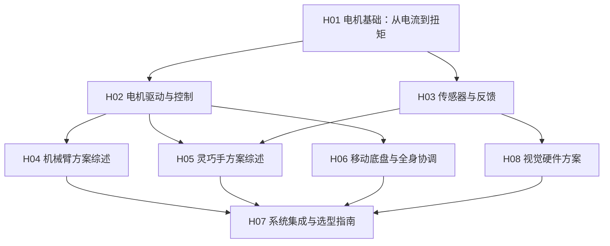

# 机器人硬件基础

> **本版块目标**：让算法出身的读者建立对机器人硬件的系统认知——从电机怎么转、力怎么传，到机械臂怎么选、灵巧手怎么设计。读完这个版块，你不一定能自己造机器人，但你能听懂硬件工程师在说什么、能对算法的"action"到底落地到什么物理设备上形成具体画面。

## 阅读路线

## 文章列表

| 编号 | 文章 | 层级 | 状态 |
|------|------|------|------|
| H01 | [电机基础：从电流到扭矩](/硬件基础/H01_电机基础_从电流到扭矩) | 执行器基础 | ✅ |
| H02 | [电机驱动与控制：位置/速度/力矩模式](/硬件基础/H02_电机驱动与控制) | 执行器基础 | 📝 |
| H03 | [传感器与反馈：编码器、力传感器、触觉](/硬件基础/H03_传感器与反馈) | 执行器基础 | 📝 |
| H04 | [机械臂方案综述](/硬件基础/H04_机械臂方案综述) | 机构与子系统 | 📝 |
| H05 | [灵巧手方案综述](/硬件基础/H05_灵巧手方案综述) | 机构与子系统 | 📝 |
| H06 | [移动底盘与全身协调](/硬件基础/H06_移动底盘与全身协调) | 机构与子系统 | 📝 |
| H07 | [系统集成与选型指南](/硬件基础/H07_系统集成与选型指南) | 系统集成 | 📝 |
| H08 | [视觉硬件方案：相机与点云](/硬件基础/H08_视觉硬件方案) | 机构与子系统 | 📝 |

---

## 版块定位

- **不依赖**本项目其他版块（前置知识、论文综述等），独立自成体系
- **内部链接完备**：硬件文章之间互相引用，形成完整的知识网络
- **面向算法读者**：侧重"为什么这样设计"和"对算法有什么影响"，而非机械制图细节
