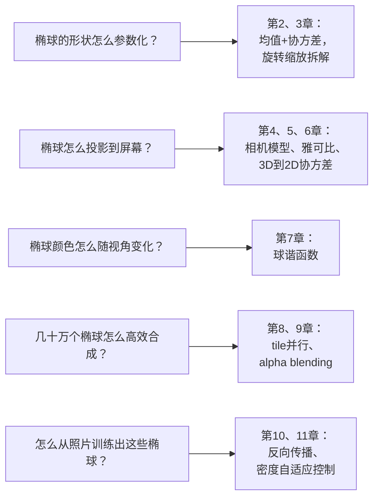

# 第 1 章：为什么需要 3D 场景表示

> 系列入口：[3D 高斯溅射从零精通](./index)

## 本章要解决的问题

你拿手机绕着桌上的一个杯子走一圈，拍了 60 张照片。现在你想要电脑"记住"这个杯子——不是把 60 张照片存起来，而是让它理解杯子的三维形状和外观，做到**从任何一个新的角度**（哪怕这 60 张照片里完全没拍到的角度）都能合成一张逼真的画面。这个任务在计算机视觉里叫**新视角合成**（Novel View Synthesis）。

本章要回答三个问题：这件事为什么不能用传统方法直接解决、上一代方法 NeRF 是怎么做又卡在哪里、3D Gaussian Splatting（3DGS，三维高斯溅射）换了什么思路。这一章是全系列的定位导览，后面每一章都会具体拆解 3DGS 这套思路里的一个环节。

## 相关阅读

本章大部分内容已经在 [3D Gaussian Splatting：用一堆椭球把真实场景搬进电脑](/前置知识/007a_前置知识_3D_Gaussian_Splatting三维场景重建) 的第一、二节讲过。如果你已经读过那篇，可以直接跳到本章末尾的"本章与系列后续章节的对应关系"。本章的作用是把那篇文章里"是什么"的结论，重新组织成整个系列的入口地图，并且补充一些 007a 里没有展开的历史脉络。

## 一、为什么"拍照片"不能直接变成"新视角"

### 1.1 一张照片丢失了什么信息

一张照片是三维世界在某个特定视角下的二维投影——相机快门按下的瞬间，三维空间里无数个点被压缩成图像平面上的一个个像素。这个压缩过程丢失了一个关键信息：**深度**。照片本身不会告诉你"杯子的把手比杯身凸出多少厘米"，它只留下一个二维的颜色分布。

如果只有一张照片，想知道"从侧面看这个杯子是什么样"是不可能的——侧面的信息根本没有被这张照片记录下来。这就是为什么新视角合成天然需要**多张照片**：只有从不同角度拍摄的多张照片放在一起，才能互相印证、拼出被压缩掉的深度信息。

### 1.2 传统方法：人工建模

在计算机图形学里，"让电脑知道一个物体的三维形状"的经典做法是人工建模——用 Blender、Maya 等软件，美工师一点一点搭出几何网格（mesh，由顶点和三角面片组成的表面），再手动贴纹理和材质。这个方法能做出非常精细的模型,但代价是时间：一个熟练的美工师建一个逼真的杯子模型可能要花几十分钟到几个小时,建一个复杂场景（比如整间客厅）可能要几天。

如果目标是"给我一段视频，几分钟内自动生成一个三维场景"，人工建模这条路直接被排除——人的介入本身就是瓶颈。这就引出了真正的问题：**能不能让算法自己从照片里"猜"出三维结构，不需要人工干预？**

### 1.3 新视角合成的输入输出定义清楚

在往下讲之前，先把问题的输入输出钉死，避免后面混淆：

| | 内容 |
|---|---|
| 输入 | 一组照片（几十到几百张），加上每张照片对应的**相机位姿**（这张照片是相机在什么位置、朝什么方向拍的） |
| 输出 | 一个"场景表示"——一个数据结构，喂给它任意一个新的相机位姿，它能吐出这个新视角下应该看到的画面 |
| 中间不要求的东西 | 不要求恢复出物理属性（材质的摩擦系数、物体是否中空）、不要求恢复出语义标签（这是杯子还是碗） |

相机位姿本身怎么来？实践中通常用**结构光恢复运动**（Structure-from-Motion, SfM，一种从多张 2D 图像的特征点匹配关系反推出相机轨迹和场景稀疏三维点的经典算法，COLMAP 是最常用的开源实现）预处理得到，本系列后续章节遇到时会说明它输出的具体数据格式，这里只需要知道它是"新视角合成流水线"最前面的一道预处理步骤，不是本系列要重点讲的算法。

## 二、上一代方案：NeRF 用一个神经网络"记住"整个场景

### 2.1 核心思路

2020 年提出的 [NeRF](https://arxiv.org/abs/2003.08934)（Neural Radiance Fields，神经辐射场）是新视角合成问题最早取得突破性效果的方法。它的思路是：训练一个神经网络，输入一个三维坐标点加一个观察方向，输出这个点的颜色和密度（"这里有没有实体、是什么颜色"）。整个场景的样子被"隐式"地编码进这个网络的权重里——想知道空间中任意一点长什么样，问一下网络就知道，不需要显式存储任何几何数据结构。

渲染一张新视角的图片时，NeRF 沿着每条穿过像素的光线密集采样几十到几百个三维点，对每个点都查询一次网络得到颜色和密度，再把这些采样点的贡献按密度加权累积成这条光线最终的颜色——这套"沿光线采样再积分"的思路叫**体积渲染**（Volume Rendering），3DGS 后面用的 alpha blending 公式和它是同一套物理直觉的离散化版本，这一点会在第 9 章具体对照。

> 这条流水线里最关键的一步是 C→D：每渲染一个像素，都要对沿途每个采样点重新跑一次神经网络前向传播。图片分辨率越高、采样点越密，这一步的计算量就越大——这正是下一节要讲的瓶颈来源。

### 2.2 NeRF 的致命瓶颈：渲染慢

上面的流水线暴露了一个工程问题：渲染一张 800×800 的图片，需要对 64 万条光线、每条光线上假设 192 个采样点，一共跑约 1.2 亿次网络前向传播。即使网络本身不大，这个总计算量也导致 NeRF 渲染一张图往往要几秒到几十秒——离"实时"（每秒 30 帧以上，也就是每张图预算约 33 毫秒）差了两到三个数量级。

这个瓶颈不是"优化一下代码就能解决"的量级差距，而是算法结构本身决定的：只要渲染一个像素要跑几百次网络前向传播，就不可能做到实时。而 3DGS 要解决的正是这个结构性问题——不是把 NeRF 优化得更快，而是换一套完全不需要"逐点查询网络"的渲染方式。

## 三、3DGS 的核心思路：不猜网络权重，直接摆看得见的椭球

### 3.1 换一种"存储场景"的方式

[3D Gaussian Splatting](https://arxiv.org/abs/2308.04079)（Kerbl et al., SIGGRAPH 2023）的思路是：不用神经网络隐式存储场景，而是用几十万个**显式的**三维高斯"椭球"直接摆出整个场景。每个椭球是一个独立、可以直接读写的数据结构——有明确的位置、形状、颜色、透明度这几个数——渲染时只需要把这些椭球投影到屏幕上做几何运算，完全不需要对任何神经网络做前向传播。

这个"显式 vs 隐式"的区分是理解 3DGS 和 NeRF 差异的关键：

| | NeRF | 3DGS |
|---|---|---|
| 场景存在哪 | 神经网络的权重里（隐式） | 几十万个椭球各自的参数里（显式） |
| 渲染一个像素要做什么 | 沿光线采样几百个点，每个点跑一次网络 | 找出投影覆盖这个像素的椭球，做加权合成 |
| 想知道"这一点是什么" | 问网络（一次前向传播） | 直接读椭球参数（数组索引） |
| 编辑场景（挪走一个物体） | 很难，网络权重耦合在一起 | 相对容易，椭球是独立的数据点 |

**回到杯子的例子**：3DGS 重建出的杯子，本质是几万个半透明的小椭球堆在三维空间里——杯身表面密集分布着扁平的椭球（贴着表面法线方向压缩得很薄），杯子内壁和背景处椭球更稀疏。每个椭球单独看没有意义，但几万个叠加在一起、从任意角度看过去，就"看起来"像一个真实的杯子。

### 3.2 为什么显式表示能解决 NeRF 的速度瓶颈

把"渲染一个像素"这件事换成显式椭球后，计算量的结构发生了本质变化：不再是"沿每条光线跑几百次网络"，而是"把有限个椭球投影到屏幕、按几何关系排序合成"——这一步是传统图形学几十年来优化得非常成熟的操作（GPU 硬件本身就是为大量并行的几何变换和光栅化设计的），不涉及神经网络前向传播这种本质上串行、计算密集的操作。这正是 3DGS 能做到实时渲染（100+ 帧/秒）、比 NeRF 快两个数量级的根本原因。

### 3.3 显式表示要解决的新问题

换成显式椭球不是没有代价的。神经网络的好处是"网络自己决定怎么分配参数去拟合场景细节"，而显式表示要求算法自己回答几个新问题，这些问题正是本系列接下来要逐章拆解的内容：

> 每一个问题背后都不是一句话能说清的实现细节，而是有明确数学结构的子问题——这也是为什么 3DGS 值得写一个 14 章的系列，而不是一篇文章带过。

## 四、椭球的完整参数清单（本系列的路线图）

一个 3DGS 椭球到底由哪些数字组成？[007a](/前置知识/007a_前置知识_3D_Gaussian_Splatting三维场景重建#二-单个-3d-高斯-椭球-是什么) 已经给出过这张清单，这里直接复用，并标出每一组参数对应本系列的哪一章：

| 参数 | 符号 | 维度 | 作用 | 对应章节 |
|------|------|------|------|----------|
| 位置 | $\boldsymbol{\mu}$ | 3 | 椭球中心在三维空间的坐标 | 第 2 章 |
| 形状与朝向 | $\boldsymbol{\Sigma}$（旋转+缩放参数化） | 3+4 | 椭球往哪个方向拉长、拉长多少 | 第 2、3、6 章 |
| 颜色 | 球谐系数 | 通常 48（16 个系数 × 3 通道） | 这个椭球是什么颜色，且随观察角度略微变化 | 第 7 章 |
| 不透明度 | $\alpha$ | 1 | 这个椭球有多"实" | 第 9 章 |

四组参数各自怎么参与渲染、怎么在训练中被更新，是第 2 章到第 11 章要逐一讲透的内容。第 12 章会把这些内容重新组装成一个真正能跑的 Python 渲染器，第 13 章讲清楚官方实现为什么必须用 CUDA 才能达到实时速度，第 14 章讲 3DGS 目前还解决不了什么、后续工作怎么改进。

## 五、3DGS 不是万能的：明确边界

在往下讲细节之前，有必要先说清楚 3DGS 解决的问题边界，避免后面产生"3DGS 什么都能做"的误解：

- **3DGS 只保证视觉上逼真**，因为训练目标就是让渲染图片和真实照片像素级接近。它默认不包含任何物理信息——椭球群本身不知道"这是可以打开的杯盖""桌子会因为重力压在地面上"。
- **3DGS 需要已知相机位姿才能训练**，这个前提通常由 SfM（第一节提到的结构光恢复运动）预处理提供，3DGS 本身不解决"从照片估计相机位姿"这个问题（尽管近年也有一些联合优化位姿的变体，这类扩展留给第 14 章)。
- **3DGS 的椭球数量是固定训练场景专用的**，不能像人工建模的 mesh 那样直接跨场景复用——换一个新场景要重新训练一遍（尽管训练本身只需要几分钟到几十分钟）。

## 本章与系列后续章节的对应关系

这一章建立的是全局地图，下面是一条从"直觉"到"工程实现"的阅读路径，供你判断接下来想先读哪一章：

- 想先搞懂"椭球到底是什么、协方差矩阵在干什么"→ 直接跳到第 2、3 章
- 想先搞懂"三维怎么变成屏幕上的像素"→ 跳到第 4、5、6 章
- 已经大致理解原理，想知道"训练时梯度怎么算"→ 直接跳到第 10 章
- 只想要一个能跑的实现，遇到不懂的地方再回来查原理 → 直接跳到第 12 章

多数读者建议按顺序阅读，因为第 6 章要用到第 4、5 章的相机模型和雅可比矩阵，第 9、10 章要用到第 2、3 章的协方差参数化——这些依赖关系会在每章开头的"前情提要"里重新说明。

## 下一章预告

第 2 章回到 3DGS 最基本的构件——**单个高斯**。我们会从最简单的一维高斯分布开始，一步步升到二维、三维，具体解释"均值"和"协方差"这两组参数分别控制椭球的什么方面，并配一个可以直接拖动尺度和旋转滑杆、实时看椭球和协方差矩阵如何对应的交互组件。

## 延伸阅读

- Mildenhall et al., *"NeRF: Representing Scenes as Neural Radiance Fields for View Synthesis"* (ECCV, 2020)
- Kerbl et al., *"3D Gaussian Splatting for Real-Time Radiance Field Rendering"* (SIGGRAPH, 2023)
- [3D Gaussian Splatting：用一堆椭球把真实场景搬进电脑](/前置知识/007a_前置知识_3D_Gaussian_Splatting三维场景重建) — 本章大量内容的原始出处，包含完整的训练循环和 real2sim 定位讨论
