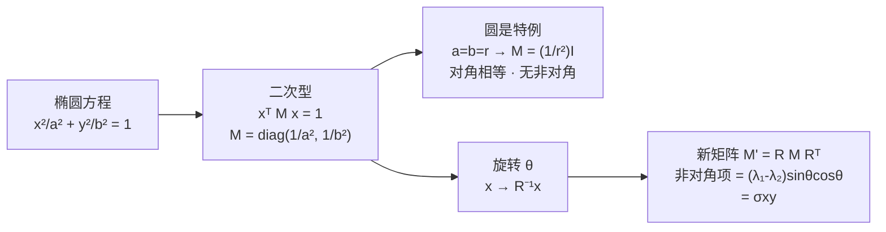

# 第 2 章：单个高斯是什么

> 系列入口：[3D 高斯溅射从零精通](./index)

## 前情提要

[第 1 章](./01_为什么需要3D场景表示) 说明了 3D Gaussian Splatting（3DGS，三维高斯溅射）用几十万个显式的三维"椭球"代替 NeRF 的隐式神经网络来存储场景。本章开始拆解这个椭球本身——它到底是什么、由哪些数字定义、这些数字各自控制什么。

## 本章要解决的问题

一个 3DGS 椭球最核心的两组参数是**均值** $\boldsymbol{\mu}$ 和**协方差** $\boldsymbol{\Sigma}$。均值很直观（就是椭球中心的位置），但"协方差矩阵怎么就变成了一个有大小、有朝向的椭球"，这一步需要从头建立直觉。本章从最简单的一维高斯讲起，一步步升到三维，让你在看到 $3\times3$ 矩阵之前，先搞清楚"宽度"和"朝向"这两个概念是怎么自然地需要一个矩阵来表达的。

这部分的核心数学推导，项目里已经有一篇讲得很透的前置知识——[3DGS 为什么使用协方差矩阵](/前置知识/009c_前置知识_3DGS为什么使用协方差矩阵)，从 1D 一路推到 3D。本章不重复那篇文章的推导，而是做四件事：(1) 提炼出理解协方差矩阵最关键的几步直觉，方便你判断要不要去读完整版；(2) 从一维开始配可拖动的交互组件，一维看清"方差就是宽度"，二维在只有三个自由度的最简情形下把"旋转如何在非对角项 $\sigma_{xy}$ 上留下痕迹"这条因果链拖出来给你看；(3) 再用三维交互组件把同一套直觉推广到 3DGS 真正用的维度，配合杯子这个具体例子练手；(4) 补充"高斯分布的概率论意义"和"3DGS 里的高斯权重"之间容易混淆的一个区别，这是 009c 里没有单独展开的一点。

## 一、一维：宽度只需要一个数

想象数轴上放一个"软斑点"，中心在 $\mu$，越靠近中心越"浓"，越往外越"淡"。这个斑点唯一需要回答的问题是**它有多宽**——用一个数 $\sigma^2$（方差）就能完全描述：$\sigma^2$ 小，斑点又高又窄；$\sigma^2$ 大，斑点又矮又胖。

$$
G(x) = \exp\!\left[-\frac{1}{2}\cdot\frac{(x-\mu)^2}{\sigma^2}\right]
$$

**这个公式在做什么**：给数轴上每一点打一个"浓度分数"——离中心越近分越高（中心恰好是 1），离得越远指数级衰减到 0。

::: details 📐 公式详解（点击展开）

| 子表达式 | 它是谁 | 它在干嘛 |
|---|---|---|
| $x-\mu$ | 到中心的位移 | 把绝对坐标换成"离中心多远" |
| $(x-\mu)^2/\sigma^2$ | 按宽度折算的距离平方 | 同样走 1 个单位，$\sigma^2$ 越大这个数越小——宽的斑点"觉得"这段距离不算远 |
| $\exp(-\tfrac12\cdot)$ | 平滑衰减器 | 把距离压成 0～1 的浓度，中心为 1，没有硬边界 |

**用人话读**：先用斑点自己的宽度当尺子量距离，再把这个距离平滑地变成一个越靠近越大的权重。

**为什么用 $\exp$ 而不是别的衰减函数**：因为要求处处可导（后面训练时要对椭球位置和形状求梯度），指数函数在整条数轴上都光滑，没有像"到了某个距离就突然截断为 0"这种硬边界，硬边界在边缘处导数不存在或不连续，会让梯度下降在那个位置卡住或跳变。
:::

这一节唯一要记住的直觉：**一维只有一个方向，所以"宽度"这个概念一个数就说完了。**

下面这个组件把这句话变成可以拖的：唯一的滑杆就是标准差 $\sigma$。拖动它，注意三件事同时发生——$\sigma$ 变小，曲线冲得更高、收得更窄，方差 $\sigma^2$ 跟着变小；$\sigma$ 变大，曲线摊得又矮又胖。阴影区是 $[-\sigma, \sigma]$，无论 $\sigma$ 怎么变它始终罩住约 68% 的面积，这就是"一个 $\sigma$ 有多宽"的直观含义。因为整条曲线下的总面积恒等于 1，所以被挤高就必然变窄——高和窄是同一件事的两面。

<ClientOnly>
  <GaussianCovariance1DPlayground />
</ClientOnly>

一维只有一个方向、一个宽度数，一个滑杆就玩到头了。升维无非是把"这个方向上宽不宽"这句话多问几遍。

## 二、二维：两个数不够，还要多一个"是否一起变"的数

把斑点放到一张纸上，它现在有横向和纵向两个方向，"多宽"这个问题要分别问两次：横向宽度 $\sigma_x^2$、纵向宽度 $\sigma_y^2$。如果这两个数不相等，斑点就从圆变成一个横平竖直的椭圆。

但现实中的椭圆经常是斜的——比如一堆点沿着"右上方向"分布，这种"横向变大时纵向也跟着变大"的联动，两个孤立的宽度数字表示不了。要表示这种联动需要再加一个数：**协方差** $\sigma_{xy}$，专门记录"两个方向是不是一起变"。完整的二维协方差矩阵是：

$$
\boldsymbol{\Sigma}=\begin{bmatrix}\sigma_x^2 & \sigma_{xy}\\ \sigma_{xy} & \sigma_y^2\end{bmatrix}
$$

**这个公式在做什么**：用两个方向各自的宽度加一个耦合强度，一共三个独立数字，完整描述一个可以任意伸缩、任意倾斜的二维椭圆。

::: details 📐 公式详解（点击展开）

| 子表达式 | 它是谁 | 它在干嘛 |
|---|---|---|
| $\sigma_x^2,\sigma_y^2$（对角） | 两个方向的宽度 | 各自控制椭圆沿 x、y 方向拉多长 |
| $\sigma_{xy}$（非对角，写两遍） | 方向耦合强度 | 非零时椭圆的主轴离开坐标轴、歪过去；对称是因为"x 对 y 的关系"和"y 对 x 的关系"是同一件事 |

**用人话读**：对角线管各方向多宽，非对角线管两个方向绑得多紧——绑得越紧，椭圆歪得越厉害。

**为什么"歪椭圆"必然对应一个非对角项**：一个歪椭圆，本质上就是把一个不歪的正椭圆整体转了一个角度。用矩阵语言写"转一个角度"这件事，展开后自动会在非对角位置产生一个非零数——这不是额外强加的规则，而是旋转在 x、y 坐标系下留下的必然痕迹。这句话的完整代数推导（从椭圆方程一路乘到 $RMR^T$）就在本节后面的"底层原理"小节里逐步展开，只需要先记住结论：**非对角项不是凭空加的旋转角，它就是旋转本身在坐标系里的记录**。
:::

### 二维交互：拖一拖，看 σxy 从 0 变非零

上面这段话的核心结论——"非对角项 $\sigma_{xy}$ 就是旋转的痕迹"——光看文字容易将信将疑：凭什么把椭圆转一下，矩阵里那个原本是 0 的角落就会自己冒出一个非零数？二维正好是能把这件事看透的最简情形：它只有**三个自由度**（两条主轴的宽度 $\sigma_x$、$\sigma_y$，加上唯一的一个旋转角 $\theta$），没有三维那 6 个自由度互相干扰，一个滑杆对应一个概念，因果链一目了然。

下面这个组件左侧实时画出高斯的浓度热力图（蓝色越深越浓）、$1\sigma$ 等值椭圆，以及椭圆的两条主轴（红=长轴、绿=短轴）；右侧是由这三个参数**当场合成**出来的 $2\times2$ 协方差矩阵。建议按这个顺序玩，每一步都盯着右侧矩阵的**右上角那个数（$\sigma_{xy}$）**看：

1. 先点"横平竖直椭圆"预设（$\theta=0$）——此时椭圆的长短轴严格沿着坐标轴，右上角的 $\sigma_{xy}$ 显示 $0.00$，说明"横向宽度"和"纵向宽度"各管各的、互不联动。
2. 慢慢拖动 $\theta$ 滑杆，让椭圆一点点转起来——你会看到右上角的 $\sigma_{xy}$ 从 $0$ 平滑地长出一个非零数，而且转得越多它的绝对值一度越大。矩阵里这个格子会被高亮标红，提示你"耦合出现了"。
3. 继续把 $\theta$ 拖到 $90°$——椭圆的长短轴又一次和坐标轴对齐（只是长短对调了），$\sigma_{xy}$ 再次回落到 $0$。这说明 $\sigma_{xy}\neq 0$ **精确对应**"椭圆主轴偏离坐标轴"，一一对应、没有例外。
4. 把 $\sigma_x$ 和 $\sigma_y$ 拖成相等（点"圆形"预设）——此时无论 $\theta$ 怎么转，$\sigma_{xy}$ 永远是 $0$。这是一个很有意思的边界情形：**一个圆转多少度都还是同一个圆**，所以"旋转"这个信息根本无处可记，非对角项自然为 0。这反过来印证了 $\sigma_{xy}$ 记录的确实是"朝向"，而圆没有朝向。

<ClientOnly>
  <GaussianCovariance2DPlayground />
</ClientOnly>

玩完这个二维版，"宽度"和"旋转"这两个概念应该已经和矩阵里的具体格子牢牢对上号了：**对角线管两个方向各自的宽度，右上/左下那个对称的格子专门记录椭圆歪了多少**。

### 底层原理：一个矩阵到底是怎么"精确表示"一个椭圆的

上面拖滑杆建立的是直觉，但你可能还是不服气：凭什么一个 $2\times2$ 矩阵就"等于"一个椭圆？这两个东西一个是方阵、一个是平面曲线，凭什么能划等号？这一节把这条等号从头到尾焊死——从初中就见过的椭圆方程出发，一步步逼出那个矩阵。

**第一步：椭圆本来就是一个二元二次方程。** 一个横平竖直、半轴为 $a$ 和 $b$、中心在原点的椭圆，它的方程是初中就写过的：

$$
\frac{x^2}{a^2} + \frac{y^2}{b^2} = 1
$$

**这个公式在做什么**：它是一个"资格审查"——平面上任意一点 $(x,y)$ 代进去，等于 1 的点恰好落在椭圆边界上，小于 1 的在里面，大于 1 的在外面。

::: details 📐 公式详解（点击展开）

| 子表达式 | 它是谁 | 它在干嘛 |
|---|---|---|
| $x^2/a^2$ | x 方向的"折算距离平方" | 把横坐标按半轴 $a$ 缩放后再平方——$a$ 越大，同样的 $x$ 折算出来越小，椭圆在这个方向就伸得越远 |
| $y^2/b^2$ | y 方向的"折算距离平方" | 同理，$b$ 控制纵向伸多远 |
| $=1$ | 边界线 | 两项加起来正好凑够 1 的点，就是椭圆轮廓 |

**用人话读**："把横纵坐标各自按自己方向的半轴缩一下，缩完之后到原点的距离正好是 1 的点，连起来就是这个椭圆。"

**为什么是除以 $a^2$ 而不是 $a$**：因为左边要凑成"距离平方"的形式（$x^2$、$y^2$ 都是平方），分母也必须是平方才能量纲一致；换个角度看，这一步等价于先把 x 轴压缩 $a$ 倍、y 轴压缩 $b$ 倍，让椭圆变回单位圆 $u^2+v^2=1$。
:::

**第二步：把这个二元二次方程改写成矩阵乘法。** 关键的观察是：左边 $\frac{x^2}{a^2}+\frac{y^2}{b^2}$ 是一个只含平方项、没有 $xy$ 交叉项的二次式，而任何这种二次式都能被"行向量 × 矩阵 × 列向量"这个三明治结构精确装下。把 $(x,y)$ 写成列向量 $\mathbf{x}$，上面的椭圆方程一字不差地等于：

$$
\mathbf{x}^T M \mathbf{x} = 1,\qquad M=\begin{bmatrix} 1/a^2 & 0 \\ 0 & 1/b^2 \end{bmatrix}
$$

**这个公式在做什么**：它就是第一步那个椭圆方程，只是换了身衣服——把两个平方项打包进一个对角矩阵 $M$，用矩阵乘法一次性算出来。

::: details 📐 公式详解（点击展开）

| 子表达式 | 它是谁 | 它在干嘛 |
|---|---|---|
| $\mathbf{x}=\begin{bmatrix}x\\y\end{bmatrix}$ | 查询点 | 平面上要审查的那个点 |
| $M$ 的对角元 $1/a^2,1/b^2$ | 两个方向的"缩放尺子" | 和第一步的分母完全一样，各管一个方向的半轴 |
| $\mathbf{x}^T M \mathbf{x}$ | 二次型 | 把三明治乘开，正好得到 $\frac{x^2}{a^2}+\frac{y^2}{b^2}$，一项不多一项不少 |

**用人话读**："把椭圆方程左边那一坨，用一个矩阵夹在两个坐标向量中间重新写一遍，算出来分毫不差。"

**验证乘开确实相等**：$\mathbf{x}^T M \mathbf{x}=\begin{bmatrix}x&y\end{bmatrix}\begin{bmatrix}1/a^2&0\\0&1/b^2\end{bmatrix}\begin{bmatrix}x\\y\end{bmatrix}=\frac{x^2}{a^2}+\frac{y^2}{b^2}$。对角矩阵夹出来的二次型只有平方项，没有 $xy$，这正对应"横平竖直、不歪"的椭圆——**对角矩阵 ⟺ 主轴沿坐标轴**这个对应关系，就是在这里第一次露出来的。
:::

**圆是这个式子最简单的特例。** 你问"如何用一个矩阵表示一个圆"——答案现在很清楚了：圆就是 $a=b=r$ 的椭圆，此时 $M=\begin{bmatrix}1/r^2 & 0\\ 0 & 1/r^2\end{bmatrix}=\frac{1}{r^2}I$，是一个单位矩阵的倍数。它的两个对角元相等、非对角为 0，几何上意味着"每个方向缩放都一样"——这正是圆各向同性的代数写照。**圆能被矩阵表示，靠的就是这个 $\frac1{r^2}I$**；它没有非对角项，因为圆没有"哪个方向更长"，更没有朝向。

**第三步：把椭圆转一个角度，非对角项会自己冒出来。** 现在做你最想看的那一步——不再手动往矩阵里塞一个 $\sigma_{xy}$，而是让它从"旋转"这个动作里自然长出来。设想我们把上面那个横平竖直的椭圆整体逆时针转 $\theta$ 角。转动的标准操作是：一个在**转之后**坐标系里的点 $\mathbf{x}$，对应到**转之前**那个正椭圆坐标系里的点是 $R^{-1}\mathbf{x}$（$R$ 是旋转矩阵）。因为点在正椭圆坐标系里必须满足 $(R^{-1}\mathbf{x})^T M (R^{-1}\mathbf{x})=1$，整理一下就得到转后椭圆的方程：

$$
\mathbf{x}^T \underbrace{(R M R^{T})}_{M'} \mathbf{x} = 1,\qquad R=\begin{bmatrix}\cos\theta & -\sin\theta\\ \sin\theta & \cos\theta\end{bmatrix}
$$

**这个公式在做什么**：它说"转过角度的椭圆"仍然是一个二次型 $\mathbf{x}^T M' \mathbf{x}=1$，只不过中间那个矩阵从 $M$ 变成了 $M'=RMR^T$——旋转的全部效果，都被吸收进了这个新矩阵里。

::: details 📐 公式详解（点击展开）

| 子表达式 | 它是谁 | 它在干嘛 |
|---|---|---|
| $R$ | 旋转矩阵 | 把坐标系逆时针转 $\theta$；它的逆 $R^{-1}=R^T$（旋转矩阵的转置就是逆） |
| $R^{-1}\mathbf{x}$ | 把点转回正椭圆坐标系 | 拿转后的点，倒推它在"没转时"是哪个点，好套用原始椭圆方程 |
| $R M R^T$ | 转后的新矩阵 $M'$ | 把 $R^{-1}\mathbf{x}$ 代进 $M$ 后整理出来的合并结果，一个矩阵装下"缩放+旋转" |

**用人话读**："要判断一个点在不在转过的椭圆上，就先把它转回没转的位置、用老椭圆方程审查——这套操作合并起来，等价于换了一个新矩阵 $RMR^T$。"

**为什么是 $R^{-1}\mathbf{x}$ 而不是 $R\mathbf{x}$**：椭圆转了 $+\theta$，那么"转后世界里的一个点"要退回"转前世界"，得转 $-\theta$，也就是乘 $R^{-1}$。这一步方向搞反是最常见的错误，记住"审查资格要回到规则制定时的坐标系"就不会错。
:::

**把 $RMR^T$ 硬乘出来，非对角项就是那个 $\sigma_{xy}$。** 这一步不玄乎，就是三个矩阵老老实实相乘。为了让结果干净，用协方差本身（而不是它的逆）来演示更直接——记 $\Sigma$ 的两个主轴方差为 $\lambda_1=\sigma_x^2$、$\lambda_2=\sigma_y^2$（正椭圆下 $\Sigma=\text{diag}(\lambda_1,\lambda_2)$），转 $\theta$ 后：

$$
\Sigma' = R\begin{bmatrix}\lambda_1 & 0\\ 0 & \lambda_2\end{bmatrix}R^T=\begin{bmatrix} \lambda_1\cos^2\theta+\lambda_2\sin^2\theta & (\lambda_1-\lambda_2)\sin\theta\cos\theta \\ (\lambda_1-\lambda_2)\sin\theta\cos\theta & \lambda_1\sin^2\theta+\lambda_2\cos^2\theta \end{bmatrix}
$$

**这个公式在做什么**：它把"转了 $\theta$ 角的椭圆"对应的协方差矩阵每一格都算成了具体表达式，让你亲眼看到非对角项 $\sigma_{xy}=(\lambda_1-\lambda_2)\sin\theta\cos\theta$ 是从哪个乘积里冒出来的。

::: details 📐 公式详解（点击展开）

| 子表达式 | 它是谁 | 它在干嘛 |
|---|---|---|
| $\lambda_1\cos^2\theta+\lambda_2\sin^2\theta$（左上 = $\sigma_x^2$） | 转后 x 方向的宽度 | 是两个原始半轴按 $\cos^2/\sin^2$ 加权的混合——转了之后 x 方向"看到"的宽度是长轴短轴的混合 |
| $(\lambda_1-\lambda_2)\sin\theta\cos\theta$（非对角 = $\sigma_{xy}$） | 耦合项 | **就是你一直想找的那个 $\sigma_{xy}$**，它 = 两半轴之差 × $\sin\theta\cos\theta$ |
| $\lambda_1\sin^2\theta+\lambda_2\cos^2\theta$（右下 = $\sigma_y^2$） | 转后 y 方向的宽度 | 同理，另一种加权混合 |

**用人话读**："把缩放矩阵夹在旋转矩阵中间乘开，非对角格子里自动出现一个 $(\lambda_1-\lambda_2)\sin\theta\cos\theta$——这就是旋转在矩阵里留下的指纹。"

**两个边界情形，正好解释交互组件里看到的现象**：
- $\theta=0$（没转）：$\sin\theta\cos\theta=0$，非对角项 $=0$——横平竖直椭圆没有耦合项，和交互里"θ=0 时 σxy=0"完全对上。
- $\lambda_1=\lambda_2$（圆）：两半轴之差 $=0$，于是不管 $\theta$ 是多少，非对角项恒 $=0$——**圆转任意角度非对角项都是 0**，这就是交互组件里"圆形预设怎么转 σxy 都是 0"背后的精确代数原因。
- 转到 $\theta=90°$：$\sin\theta\cos\theta$ 又回到 0，此时长短轴只是对调，非对角项再次归零，也和交互第 3 步吻合。
:::

这三步走完，"一个矩阵精确表示一个椭圆/圆"这件事就不再是口号了：**椭圆方程 = 一个二次型 $\mathbf{x}^TM\mathbf{x}=1$；对角矩阵表示横平竖直的椭圆，其中两对角元相等就退化成圆；一旦旋转，$RMR^T$ 展开后非对角位置必然出现 $(\lambda_1-\lambda_2)\sin\theta\cos\theta$，这就是 $\sigma_{xy}$ 的来历。** 下面的整个"缩放矩阵 → 旋转 → 合成矩阵"的对应关系，可以用一张图钉死：

> 从最左的初中椭圆方程出发：先打包成矩阵二次型（B），往下走 $a=b$ 就退化成圆（C），往右走加一个旋转就长出非对角项（E）。整条链没有任何一步是"硬塞"进去的，$\sigma_{xy}$ 是旋转的必然产物。

如果你想看这套推导配三张分步图（正椭圆 → 转 30° → 从图上读出非对角项）的图形版本，[009c 第三节](/前置知识/009c_前置知识_3DGS为什么使用协方差矩阵#三-二维的痛点-对角矩阵画不出-歪着的椭圆) 有完整的图解，可以对照着看。

带着这个已经彻底焊死的原理，再看下面的三维版本，就只是"同一套推导多加一维、多两个非对角项"而已。

## 三、三维：同样的套路再重复一遍

三维（3DGS 真正用的维度）没有新花样：三个方向各有多宽（$\sigma_x^2,\sigma_y^2,\sigma_z^2$），三对方向各自绑多紧（$\sigma_{xy},\sigma_{xz},\sigma_{yz}$），一共 6 个独立数字，排成一个对称的 $3\times3$ 矩阵：

$$
\boldsymbol{\Sigma}_{3D}=\begin{bmatrix}\sigma_x^2 & \sigma_{xy} & \sigma_{xz}\\ \sigma_{xy} & \sigma_y^2 & \sigma_{yz}\\ \sigma_{xz} & \sigma_{yz} & \sigma_z^2\end{bmatrix}
$$

**这个公式在做什么**：把三维空间里"三个方向多宽 + 三对方向多耦合"的全部信息，装进一个对称方阵，用来描述一个可以任意拉伸、任意朝向的三维椭球。

::: details 📐 公式详解（点击展开）

| 子表达式 | 它是谁 | 它在干嘛 |
|---|---|---|
| 对角三项 | 三个方向的宽度 | 决定椭球沿三条基准方向各拉多长 |
| 非对角三项 | 三对方向的联动 | 让椭球主轴可以指向世界坐标轴之外的任意方向 |

**用人话读**：三维椭球 = 三个方向的宽度 + 三对方向的歪斜，一共 6 个数，摆成一个对称方阵。这正是 [009c 第四节](/前置知识/009c_前置知识_3DGS为什么使用协方差矩阵#四-升到三维-同样的套路再加一维) 完整推导的对象，本章直接复用其结论。
:::

对空间中任意一点 $\mathbf{x}$，3DGS 用下面这个公式给它打一个"属于这个椭球有多浓"的分数：

$$
G(\mathbf{x}) = \exp\left(-\frac{1}{2}(\mathbf{x}-\boldsymbol{\mu})^T \boldsymbol{\Sigma}^{-1} (\mathbf{x}-\boldsymbol{\mu})\right)
$$

**这个公式在做什么**：一维、二维公式的三维版本——用协方差矩阵当"变形的尺子"量出查询点到中心的距离，再把距离压成一个 0 到 1 的浓度分数。

::: details 📐 公式详解（点击展开）

| 子表达式 | 它是谁 | 它在干嘛 |
|---|---|---|
| $\mathbf{x}-\boldsymbol{\mu}$ | 查询点到椭球中心的位移 | 把绝对坐标换成相对坐标 |
| $\boldsymbol{\Sigma}^{-1}$ | 按方向调整刻度的尺子 | 沿椭球拉长的方向惩罚小，沿收缩的方向惩罚大 |
| $(\cdot)^T\boldsymbol{\Sigma}^{-1}(\cdot)$ | 椭球坐标系下的距离平方 | 把三维位移压缩成一个标量，等值面是一个椭球 |
| $\exp(-\tfrac12\cdot)$ | 距离到浓度的转换器 | 中心处浓度最高（1），越往外指数衰减到 0 |

**用人话读**：先用椭球自己的形状去量查询点离中心有多远，再把这个距离平滑地变成一个浓度分数。

**为什么协方差矩阵必须取逆**：$\boldsymbol{\Sigma}$ 本身描述的是"沿各方向散得多开"，散得开（方差大）意味着这个方向上更远的点也该算"近"——所以要用 $\boldsymbol{\Sigma}^{-1}$ 而不是 $\boldsymbol{\Sigma}$ 本身来度量距离：方差大的方向，$\boldsymbol{\Sigma}^{-1}$ 对应的分量小，惩罚就轻。
:::

## 四、交互实验：拖一拖，看协方差矩阵怎么变成椭球

二维版已经把"宽度 + 一个旋转角 → 非对角项"这条因果链讲透了。三维只是把同一句话多问一遍：多出一条轴（$\sigma_z$），旋转也从"一个角"变成"绕三条轴各转一个角"，于是非对角项从一个（$\sigma_{xy}$）变成三个（$\sigma_{xy},\sigma_{xz},\sigma_{yz}$）。下面这个组件可以直接拖动三个尺度（沿三条局部轴的宽度）和三个旋转角，右侧会实时算出对应的 $3\times3$ 协方差矩阵。建议按下面这个顺序试：

1. 先点"球形"预设——注意此时矩阵是 $\sigma^2 I$（对角线相等，非对角全为 0），这对应第一节说的"各方向宽度相同"。
2. 再点"表面贴片"预设——观察最短的那条轴（法线方向）迅速变薄，同时旋转角非零，非对角项开始出现非零值。
3. 手动拖动"绕 Z"滑杆，观察椭球主轴转动、矩阵的非对角项跟着连续变化——这就是第二节"非对角项 = 旋转的痕迹"的实时验证。

<ClientOnly>
  <GaussianCovariancePlayground />
</ClientOnly>

**回到杯子的例子**：杯身表面某处对应的椭球，应该是"表面贴片"这种形状——沿杯壁切向的两条轴长（覆盖表面纹理），沿法线方向的轴很短（避免把颜色涂到杯子里外的空气中）。杯口边缘转折处的椭球，形状可能更接近球形（因为局部曲率变化快，扁平贴片反而不好贴合）。这种"不同位置用不同形状的椭球"正是协方差矩阵作为可训练参数的意义——训练过程会自动为每个位置找到合适的形状，不需要人工指定。

## 五、均值和协方差是两件独立的事

一个容易被忽略但很重要的点：均值 $\boldsymbol{\mu}$（位置）和协方差 $\boldsymbol{\Sigma}$（形状）是完全解耦的两组参数——移动椭球中心不会改变它的形状，改变形状也不会移动中心。上面第四节的交互组件里，所有滑杆都只调协方差、椭球中心始终固定在原点，这不是简化，而是如实反映了这两组参数在数学上互不影响的事实。

这个解耦性在训练时很重要：反向传播算出的梯度会分别独立地告诉每个椭球"往哪挪一点位置"和"往哪个方向调一点形状"，两者互不干扰——第 10 章讲反向传播时会具体看到这两条梯度链路是怎么分开算的。

## 六、协方差矩阵的两个视角：几何视角和概率论视角

到这里出现过两种说法都在描述协方差矩阵，容易混在一起：

- **几何视角**（本章一路在用的）：协方差矩阵是"椭球的形状说明书"，特征向量给出三条主轴方向，特征值（开平方后）给出每条主轴的长度。
- **概率论视角**：如果把高斯看成一个随机点云的生成规则——每次从中心附近"随机吐出"一个点——协方差矩阵记录的是"这些点偏离均值的程度，以及两个坐标是否一起偏离"。方差大意味着这个方向上点散得开，协方差为正意味着两个方向一起变大，点云因此呈现倾斜趋势。

这两种说法描述的是**同一个数学对象**，只是切入角度不同：几何视角回答"这个椭球长什么样"，概率论视角回答"如果按这个高斯分布采样会得到什么样的点云"。3DGS 里几乎全程使用几何视角——因为渐染器关心的是"椭球投影到屏幕后是什么形状"，不关心"如果从这个高斯采样会得到什么点云"。但理解这两个视角是同一件事，有助于你在读到"协方差"这个统计学术语时，不会觉得它和"椭球形状"是两个不同的概念在打架。[009c 第八节](/前置知识/009c_前置知识_3DGS为什么使用协方差矩阵#八-协方差-这个名字从哪里来) 对这一点有更完整的展开。

## 七、为什么不能只用一个半径，或者三个独立半径

这一点在 [009c 第十节](/前置知识/009c_前置知识_3DGS为什么使用协方差矩阵#十-为什么不能只用一个半径或三个独立半径) 有一张关键的对比图，直接展示"球、轴对齐椭圆、完整协方差椭圆"三种贴片去贴一段倾斜表面的效果差异：

> 球（各向同性）为了盖住表面被迫做大，颜色溢出到表面外的空气里；轴对齐椭圆（只有对角项）方向锁死在水平，遇到斜坡只能用一串小椭圆阶梯式拼接；完整协方差椭圆（含非对角项）能直接转到和表面平行的方向，寥寥几个就贴合。这正是为什么协方差矩阵需要完整的 6 个自由度，而不能只用 1 个或 3 个半径。

**回到杯子的例子**：杯身是一个弯曲的曲面，不同位置的切平面朝向都不一样。如果只允许用球形贴片，要覆盖整个杯身表面就需要非常多的小球（并且球形贴片会不可避免地把一部分"浓度"泄漏到杯子表面之外的空气中）；如果协方差矩阵能自由地旋转和拉伸，每个位置只需要一个贴合当地切平面朝向的椭球，用更少的椭球就能获得更贴合的表面覆盖——这也是为什么 3DGS 最终重建出的场景里，椭球数量通常是几万到几十万，而不是几百万。

## 总结

| 概念 | 一句话总结 |
|---|---|
| 均值 $\boldsymbol{\mu}$ | 椭球中心在三维空间的位置，和形状完全解耦 |
| 协方差 $\boldsymbol{\Sigma}$ | 一个 $3\times3$ 对称矩阵，对角线是三个方向的宽度，非对角线是方向间的耦合（旋转的痕迹） |
| 为什么用协方差而不是简单半径 | 只有完整的 6 自由度协方差矩阵才能让椭球任意伸缩、任意旋转，贴合复杂曲面时需要的椭球数量最少 |
| 高斯权重公式 | 用 $\boldsymbol{\Sigma}^{-1}$ 当变形的尺子量距离，再指数衰减成浓度分数，处处可导，适合梯度下降 |

## 下一章预告

本章讲的协方差矩阵是"最终要用来渲染和投影的对象"，但训练时并不会直接优化矩阵里的 9 个数——直接优化很容易在某一步梯度更新后破坏"矩阵必须对称正定"这个数学约束，导致数值出错。第 3 章会讲 3DGS 实际训练时怎么用**旋转 + 缩放**这两组更安全的参数来间接控制协方差矩阵，以及为什么这种参数化方式能保证不管训练怎么更新，合成出来的矩阵永远合法。

## 延伸阅读

- [3DGS 为什么使用协方差矩阵](/前置知识/009c_前置知识_3DGS为什么使用协方差矩阵) — 本章大部分推导的完整版本，包含协方差如何投影到屏幕（第 6 章会展开）
- [概率密度函数与高斯分布](/前置知识/002b_前置知识_概率密度函数与高斯分布) — 高斯分布的概率论基础
- [前置知识：主成分分析 PCA](/前置知识/002j_前置知识_主成分分析PCA) — 协方差矩阵特征分解的另一个经典应用场景，可以对照理解"特征向量=主轴方向"这一点
