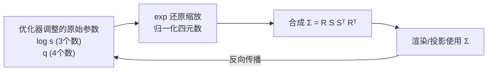

# 第 3 章：旋转缩放参数化与合法性

> 系列入口：[3D 高斯溅射从零精通](./index)

## 前情提要

[第 2 章](./02_单个高斯是什么) 讲了协方差矩阵 $\boldsymbol{\Sigma}$ 是椭球的"形状说明书"——对角线是三个方向的宽度，非对角线是方向间的耦合。本章要解决一个训练工程上的问题：**梯度下降更新参数时，怎么保证更新后的 $\boldsymbol{\Sigma}$ 始终是一个合法的协方差矩阵？**

## 本章要解决的问题

协方差矩阵不能任意取值——它必须满足**对称**（$\boldsymbol{\Sigma}=\boldsymbol{\Sigma}^T$）和**正定**（对任意非零向量 $\mathbf{v}$，$\mathbf{v}^T\boldsymbol{\Sigma}\mathbf{v}>0$）这两个条件，否则第 2 章的高斯权重公式里的 $\boldsymbol{\Sigma}^{-1}$ 没有意义，或者对应的"椭球"会变成一个无法解释的形状（比如某个方向的"宽度"变成负数）。

如果直接把协方差矩阵的 9 个元素当成 9 个可训练参数交给梯度下降自由调整，训练的每一步都可能把它调成一个不满足这两个约束的非法矩阵——这不是一个小概率的边缘情况，而是几乎必然发生：梯度下降不知道"对称正定"这个约束存在，它只会朝着降低 loss 的方向移动每个参数，没有任何机制阻止它把矩阵调歪。

本章要讲的是 3DGS 解决这个问题的具体方法：不直接优化 $\boldsymbol{\Sigma}$ 本身，而是优化两组新的参数——旋转和缩放——通过一个固定的合成公式，从这两组参数**必然**产出一个合法的协方差矩阵，不管训练怎么调这两组参数。

## 一、旧方案的问题：直接优化 9 个数会出什么错

假设真的直接把 $\boldsymbol{\Sigma}$ 的 9 个元素暴露给优化器，具体会踩到两个坑：

1. **对称性被破坏**：梯度下降对 $\Sigma_{12}$ 和 $\Sigma_{21}$ 是两个独立的参数分别求梯度、分别更新的，没有任何机制保证更新后它们仍然相等。一旦 $\Sigma_{12}\neq\Sigma_{21}$，这个矩阵就不再对应任何真实的椭球——数学上，非对称矩阵无法被正交对角化，谈不上"主轴方向"和"主轴长度"这些几何量。
2. **正定性被破坏**：即使强制矩阵保持对称，梯度下降依然可能把某个方向的"宽度"调成负数或者让矩阵变成半正定甚至不定——这时候第 2 章公式里的 $\boldsymbol{\Sigma}^{-1}$ 在数值上可能不存在（矩阵不可逆），或者算出来的"距离平方"$(\mathbf{x}-\boldsymbol{\mu})^T\boldsymbol{\Sigma}^{-1}(\mathbf{x}-\boldsymbol{\mu})$ 变成负数，导致高斯权重公式里 $\exp$ 的参数变成正数，浓度不再随距离衰减反而随距离增大——整个渲染直接崩掉。

一个自然但笨拙的补救方法是"训练每一步之后，把矩阵投影回最近的合法对称正定矩阵"（比如做一次特征分解，把负的或过小的特征值clip 到一个正的下限）。这个方法在数值上可行，但有两个代价：额外的计算开销（每一步都要做一次矩阵分解），以及投影操作本身不可导——梯度在投影这一步会被截断，训练信号打折扣。

## 二、新方案：用旋转和缩放"合成"协方差，而不是直接优化协方差

3DGS 的解法是换一套参数化方式：不优化 $\boldsymbol{\Sigma}$ 本身，而是优化一个旋转矩阵 $\mathbf{R}$（由四元数表示）和一个缩放矩阵 $\mathbf{S}$（对角矩阵，对角线是三个正数），再通过下面这个公式合成出协方差矩阵：

$$
\boldsymbol{\Sigma} = \mathbf{R} \mathbf{S} \mathbf{S}^T \mathbf{R}^T
$$

**这个公式在做什么**：把"椭球往三个局部轴方向各拉伸多少"（$\mathbf{S}$）和"这三条轴整体转到哪个朝向"（$\mathbf{R}$）拆成两步分别参数化，再拼起来——无论这两组参数训练时怎么变化，拼出来的 $\boldsymbol{\Sigma}$ 永远自动满足对称正定。

::: details 📐 公式详解（点击展开）

| 子表达式 | 它是谁 | 它在干嘛 |
|---|---|---|
| $\mathbf{S}$ | 局部坐标系下的缩放矩阵 | 一个对角矩阵，对角线上三个正数是椭球沿三条局部轴的标准差（"半径"） |
| $\mathbf{S}\mathbf{S}^T$ | 未旋转前的形状 | 因为 $\mathbf{S}$ 是对角矩阵，$\mathbf{S}\mathbf{S}^T$ 也是对角矩阵，天然对称且正定（对角线全是正数的平方） |
| $\mathbf{R}$ | 由四元数转换得到的旋转矩阵 | 决定椭球的三条局部轴分别指向世界坐标系中的哪个方向 |
| $\mathbf{R}(\cdot)\mathbf{R}^T$ | 相似变换 | 把"局部坐标系下的形状"转换成"世界坐标系下这个形状实际呈现的样子"，旋转矩阵夹在两侧保证变换后仍然对称正定 |

**用人话读**：先决定椭球在自己坐标系里往三个方向各拉伸多长，再决定这套坐标系整体要转到空间中哪个朝向——这两步拼起来，不管怎么调，结果永远是一个合法的椭球形状。

**为什么这样拼一定合法**：正定性的关键在 $\mathbf{S}\mathbf{S}^T$ 这一步——只要 $\mathbf{S}$ 对角线上的数都不为零，$\mathbf{S}\mathbf{S}^T$ 就自动正定（因为对任意非零向量 $\mathbf{v}$，$\mathbf{v}^T\mathbf{S}\mathbf{S}^T\mathbf{v}=\|\mathbf{S}^T\mathbf{v}\|^2\geq 0$，等号只在 $\mathbf{v}=0$ 时成立）。而正交矩阵 $\mathbf{R}$（旋转矩阵满足 $\mathbf{R}^T\mathbf{R}=\mathbf{I}$）做相似变换不会破坏正定性——这是线性代数里"合同变换保持正定性"的标准结论。所以只要保证 $\mathbf{S}$ 对角线恒为正、$\mathbf{R}$ 恒为合法旋转矩阵，合成出的 $\boldsymbol{\Sigma}$ 就恒定合法，不需要任何额外的投影或裁剪步骤。
:::

这个"用旋转+缩放合成协方差"的公式和第 2 章、[009c 第三节](/前置知识/009c_前置知识_3DGS为什么使用协方差矩阵#三-二维的痛点-对角矩阵画不出-歪着的椭圆) 讲的"正椭圆转一下变成歪椭圆"是同一个公式的三维版本——那里用它解释非对角项从哪来，这里用它解释训练时怎么保证合法性，是同一个数学对象的两个应用场景。

## 三、怎么保证 $\mathbf{S}$ 恒为正、$\mathbf{R}$ 恒为合法旋转

上一节的合法性论证依赖两个前提：$\mathbf{S}$ 对角线恒正，$\mathbf{R}$ 恒是合法的旋转矩阵。这两个前提各自需要一个具体的工程技巧来保证。

### 3.1 缩放恒正：优化对数尺度

如果直接把三个缩放值 $s_x,s_y,s_z$ 当作可训练参数，梯度下降完全可能把某个值更新成负数或零。3DGS 的解法是不直接存 $s_x,s_y,s_z$，而是存它们的**对数** $\log s_x,\log s_y,\log s_z$，实际使用时再取指数还原：

$$
s = \exp(\log s)
$$

**这个公式在做什么**：把"必须恒为正"的约束，转移成一个不需要约束的自由参数——对数尺度可以在整条实数轴上自由取值，指数函数会自动把它映回正数区间。

::: details 📐 公式详解（点击展开）

| 子表达式 | 它是谁 | 它在干嘛 |
|---|---|---|
| $\log s$ | 真正被优化器调整的参数 | 可以取任意实数（正、负、零），没有约束 |
| $\exp(\cdot)$ | 换算成实际缩放值的转换器 | 无论输入是什么实数，输出永远是正数，且是光滑可导的 |

**用人话读**：不直接调"半径"这个必须为正的数，而是调它的对数——对数可以随便调，换算回半径时自动就是正的。

**为什么不用其他保证恒正的技巧（比如直接对负值做 clip）**：clip（裁剪）在裁剪点处不可导，梯度会在那里被截断；而 $\exp$ 在整条实数轴上处处光滑可导，不会引入额外的梯度死区。这是"用一个天然满足约束的可逆变换代替约束检查"的典型设计模式，和第 2 章讲的"用旋转缩放代替直接优化协方差"是同一种思路的重复运用。
:::

### 3.2 旋转恒合法：优化四元数并归一化

旋转矩阵 $\mathbf{R}$ 必须满足 $\mathbf{R}^T\mathbf{R}=\mathbf{I}$（正交）且 $\det(\mathbf{R})=1$（没有镜像翻转），如果直接优化 3×3 矩阵的 9 个数，同样很难在训练过程中始终保持这两个约束。3DGS 的解法是用[四元数](/前置知识/006a_前置知识_三维旋转表示_旋转矩阵四元数与角速度)表示旋转——四元数是 4 个数 $(q_w,q_x,q_y,q_z)$，只要满足**单位范数**这一个约束（$q_w^2+q_x^2+q_y^2+q_z^2=1$），就唯一对应一个合法的旋转矩阵。

训练时优化器自由调整这 4 个数，但每次用它们计算旋转矩阵之前，先做一次归一化：

$$
\hat{\mathbf{q}} = \frac{\mathbf{q}}{\|\mathbf{q}\|}
$$

**这个公式在做什么**：把优化器调出来的、可能不满足单位范数的 4 个数，投影到"单位范数"这个约束面上，得到一个真正合法的旋转四元数。

::: details 📐 公式详解（点击展开）

| 子表达式 | 它是谁 | 它在干嘛 |
|---|---|---|
| $\mathbf{q}$ | 优化器直接调整的 4 个原始数 | 训练过程中范数可能漂离 1，本身不代表一个合法旋转 |
| $\|\mathbf{q}\|$ | 这 4 个数的欧几里得范数 | 衡量"离单位范数差多远" |
| $\hat{\mathbf{q}}=\mathbf{q}/\|\mathbf{q}\|$ | 归一化后的单位四元数 | 范数恒为 1，唯一对应一个合法的旋转矩阵 |

**用人话读**：优化器想调哪 4 个数都行，真正拿去算旋转矩阵之前，先把这 4 个数缩放到"长度为 1"这个球面上。

**为什么用四元数而不是直接优化旋转矩阵的 9 个数或者欧拉角**：直接优化旋转矩阵的 9 个数，同样存在第 3.1 节缩放遇到的问题——9 个自由参数很难同时维持"正交且行列式为 1"这两个非线性约束。用欧拉角（3 个角度）虽然自由度刚好是 3，但存在**万向锁**（Gimbal Lock，某些角度组合下会丢失一个旋转自由度）的数值问题，且插值不连续。四元数用 4 个数表示 3 个自由度的旋转，多出的 1 个自由度正好被"单位范数"这一个简单的约束吸收——归一化是一步廉价、处处可导（除了原点这个孤立奇点，训练中几乎不会碰到）的操作，不会引入类似欧拉角那样的方向性数值问题。
:::

## 四、交互验证：无论怎么拖，矩阵永远合法

回到第 2 章的交互组件——`GaussianCovariancePlayground` 内部的实现正是本章讲的这套流程：三个滑杆调的是缩放（内部存的是恒正的实际值，等价于第 3.1 节 $\exp$ 之后的结果），三个旋转滑杆调的是欧拉角（内部转换为旋转矩阵，等价于第 3.2 节归一化四元数之后的 $\mathbf{R}$），右侧实时显示的矩阵就是 $\mathbf{R}\mathbf{S}\mathbf{S}^T\mathbf{R}^T$ 合成的结果。

<ClientOnly>
  <GaussianCovariancePlayground />
</ClientOnly>

你可以把所有滑杆拖到任意极端值（比如尺度拖到最大、旋转角拖到 180 度），观察右侧矩阵始终保持对称（左上到右下的对角线两侧数值相等），且始终对应一个能画出来的实心椭球——不会出现"矩阵存在但画不出对应形状"的情况。这正是第二节公式承诺的性质：**参数空间里任意一点，合成出来的矩阵都合法**，不需要在拖动过程中做任何额外检查。

## 五、工程上实际存储的参数

把本章内容汇总，一个 3DGS 椭球的形状信息在代码里实际存储的不是 $3\times3$ 矩阵的 9 个数，而是 7 个数：

| 存储的参数 | 维度 | 说明 |
|---|---|---|
| $\log s_x,\log s_y,\log s_z$ | 3 | 对数尺度，取指数后得到恒正的实际缩放 |
| $q_w,q_x,q_y,q_z$ | 4 | 四元数，归一化后得到合法旋转矩阵 |

渲染或计算高斯权重时，才按第二节的公式现算出 $\boldsymbol{\Sigma}=\mathbf{R}\mathbf{S}\mathbf{S}^T\mathbf{R}^T$。这个"存储用安全参数、使用时现算"的模式贯穿 3DGS 的实现，第 12 章手写渲染器时会看到具体代码。

> 梯度从渲染结果一路回传到 $\boldsymbol{\Sigma}$，再通过链式法则继续回传到 $\mathbf{R}$、$\mathbf{S}$，最终落回真正被更新的 $\log s$ 和 $q$——这条完整的反向链路，第 10 章会逐项算出每一步的具体梯度公式。

## 总结

| 问题 | 3DGS 的解法 |
|---|---|
| 协方差矩阵必须对称正定，直接优化 9 个数无法保证 | 改为优化旋转 $\mathbf{R}$ 和缩放 $\mathbf{S}$，用 $\boldsymbol{\Sigma}=\mathbf{R}\mathbf{S}\mathbf{S}^T\mathbf{R}^T$ 合成，恒定合法 |
| 缩放必须恒为正 | 存储对数尺度 $\log s$，使用时取 $\exp$ 还原 |
| 旋转必须恒为合法正交矩阵 | 用四元数表示旋转，使用前归一化到单位范数 |
| 这样做的好处 | 不需要在训练循环里额外做投影或约束检查，梯度处处连续，训练更稳定 |

## 下一章预告

前三章讲的都是单个椭球在三维空间里的"内部结构"——它的位置和形状。但渲染需要把这个三维椭球变成屏幕上的一张 2D 画面，这中间要经过相机的一整套坐标变换。第 4 章开始讲相机模型：三维点从"世界坐标"到"相机坐标"再到"屏幕像素坐标"，具体要经过哪几步变换，针孔相机模型的几何原理是什么。这是第 5、6 章雅可比矩阵和协方差投影的基础。

## 延伸阅读

- [3DGS 为什么使用协方差矩阵](/前置知识/009c_前置知识_3DGS为什么使用协方差矩阵) — 本章 $\boldsymbol{\Sigma}=\mathbf{R}\mathbf{S}\mathbf{S}^T\mathbf{R}^T$ 公式的几何直觉来源
- [三维旋转表示：旋转矩阵、四元数与角速度](/前置知识/006a_前置知识_三维旋转表示_旋转矩阵四元数与角速度) — 四元数与旋转矩阵转换的完整推导，万向锁问题的详细说明
- [线性代数基础：向量、矩阵、自由度与正交性](/前置知识/008g_前置知识_线性代数基础_向量矩阵自由度与正交性) — 正交矩阵、正定矩阵等概念的基础回顾
