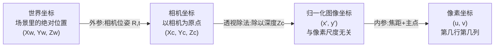
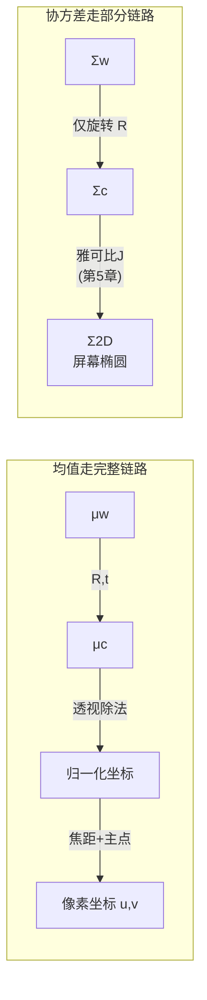

# 第 4 章：相机模型与坐标系全链路

> 系列入口：[3D 高斯溅射从零精通](./index)

## 前情提要

第 2、3 章讲完了单个高斯椭球在三维空间里的完整定义——位置 $\boldsymbol{\mu}$ 和协方差 $\boldsymbol{\Sigma}$（由旋转、缩放合成）。这些参数都定义在**世界坐标系**里，也就是场景本身固定不变的坐标系。但渲染要回答的问题是"从某个相机的角度看，画面应该是什么样"——这需要把世界坐标系里的点，转换成这台相机屏幕上的像素坐标。本章讲这个转换链路的每一步。

## 本章要解决的问题

一个三维点从"场景里的某个位置"变成"屏幕上第几行第几列的一个像素"，中间要经过几次坐标系切换。本章把这条链路拆成三段，每一段回答一个独立的问题：

1. **世界坐标 → 相机坐标**：换一个参考系去看待同一个点（相机转动或移动，点本身没有变）
2. **相机坐标 → 归一化图像坐标**：针孔相机的核心几何规则——近大远小
3. **归一化图像坐标 → 像素坐标**：把"占多大视角"换算成"落在第几个像素"

这三段各自是一个独立的坐标变换，合起来就是通常说的"相机投影"。第 5 章要讲的雅可比矩阵，本质上就是在给这整条链路求导数——理解清楚每一步具体在做什么变换，才能理解求导之后每一项分别对应哪一步。

## 一、为什么需要三段而不是一步到位

### 1.1 完整链路总览

> 三段变换各自独立、可以分开理解：第一段只和"相机在哪、朝哪"有关（外参），第二段是针孔相机不可绕开的几何规则（近大远小），第三段只和"这台相机的镜头和传感器参数"有关（内参）。把三段分开理解，比死记一个大公式更容易排查具体某一步出了什么问题。

### 1.2 为什么不能一步到位

如果把这三步压缩成一个公式直接从世界坐标算到像素坐标，公式本身不会有任何变化——数学上这就是三个矩阵/运算依次作用的结果。但拆开的价值在于：

- **外参（第一段）**和场景内容无关，只和相机的摆放方式有关——同一个场景换个相机机位重新拍一张照片，只需要换这一步的参数。
- **内参（第三段）**和相机的物理镜头、传感器有关，同一台相机不管怎么移动、拍什么场景，这部分参数都不变。
- 分开之后，如果发现渲染结果"整体偏移了"，可以直接怀疑外参；如果发现"近处物体投影大小不对"，可以直接怀疑内参——分段结构本身就是一种调试工具。

## 二、世界坐标到相机坐标：换一个参考系

### 2.1 相机位姿是什么

一台相机在场景里的**位姿**（pose）由两部分描述：位置（相机光心在世界坐标系里的坐标）和朝向（相机镜头指向哪个方向、相机的"上"是哪个方向）。这两部分合起来，通常写成一个旋转矩阵 $\mathbf{R}_{cw}$（world-to-camera，从世界系到相机系的旋转）和一个平移向量 $\mathbf{t}_{cw}$。

给定世界坐标系里的一个点 $\mathbf{X}_w=(X_w,Y_w,Z_w)$，它在相机坐标系里的坐标是：

$$
\mathbf{X}_c = \mathbf{R}_{cw}\mathbf{X}_w + \mathbf{t}_{cw}
$$

**这个公式在做什么**：把"场景统一使用的坐标"改写成"从这台相机自己的视角看，这个点在前方多远、左右多偏、上下多偏"。

::: details 📐 公式详解（点击展开）

| 子表达式 | 它是谁 | 它在干嘛 |
|---|---|---|
| $\mathbf{X}_w$ | 点在世界坐标系里的坐标 | 场景固定不变的参考系，3DGS 里每个高斯的 $\boldsymbol{\mu}$ 就存在这个坐标系下 |
| $\mathbf{R}_{cw}$ | 世界系到相机系的旋转矩阵 | 描述相机镜头相对世界坐标轴转了多少、朝哪个方向——它是相机位姿里"朝向"这部分信息的矩阵表示 |
| $\mathbf{t}_{cw}$ | 世界系到相机系的平移 | 相机光心在世界坐标系里的位置带来的偏移 |
| $\mathbf{X}_c$ | 点在相机坐标系里的坐标 | 相机坐标系的约定通常是：$X_c$ 向右，$Y_c$ 向下，$Z_c$ 指向相机前方（也就是"深度"） |

**用人话读**：先转个方向再挪个位置，把"场景里的绝对坐标"换算成"相机眼中的相对坐标"。

**为什么是先转后平移，不是先平移后转**：如果先平移、后旋转，平移量就要用世界坐标系的单位去衡量，而后面要做的所有几何运算都希望统一在相机坐标系下讨论；先旋转（这一步不改变点到相机光心的距离，只改变描述它用的坐标轴方向）再平移（把原点移到相机光心），得到的正好是"以相机为原点、以相机朝向为坐标轴"的描述——这是相机坐标系的定义方式决定的顺序，不是任意选择。
:::

### 2.2 平移不影响协方差，只影响均值

这里有一个第 2 章提过的性质在这里要再次强调：一个三维高斯的协方差矩阵 $\boldsymbol{\Sigma}$ 描述的是"相对椭球中心的散布方式"，把整个椭球平移到别处，散布方式（形状、朝向）不会变。所以坐标变换里的平移量 $\mathbf{t}_{cw}$ 只会影响均值 $\boldsymbol{\mu}$ 怎么变换，协方差矩阵的变换只需要用到旋转部分：

$$
\boldsymbol{\Sigma}_c = \mathbf{R}_{cw}\,\boldsymbol{\Sigma}_w\,\mathbf{R}_{cw}^T
$$

**这个公式在做什么**：把世界坐标系下的椭球形状，转换成相机坐标系下看到的同一个椭球的形状——因为坐标系整体转了一个角度，椭球的三条轴在新坐标系里指向了不同的方向，但椭球本身的大小和相对朝向没有变。

::: details 📐 公式详解（点击展开）

| 子表达式 | 它是谁 | 它在干嘛 |
|---|---|---|
| $\boldsymbol{\Sigma}_w$ | 世界坐标系下的协方差 | 第 2、3 章讨论的、椭球本身固有的形状信息 |
| $\mathbf{R}_{cw}(\cdot)\mathbf{R}_{cw}^T$ | 相似变换 | 把形状信息从一套坐标轴描述换算成另一套坐标轴描述，保持对称正定 |
| $\boldsymbol{\Sigma}_c$ | 相机坐标系下的协方差 | 后续投影计算（第 6 章）直接在这个坐标系下继续 |

**用人话读**：相机转过身之后，原来指向"世界的 x 方向"的椭球轴，现在要用"相机眼中的哪个方向"重新描述——这一步只需要旋转矩阵，不需要平移量。

**为什么公式里没有 $\mathbf{t}_{cw}$**：协方差矩阵的定义本身就是"相对均值的二阶矩"，任何平移操作对所有点施加同样的偏移，相对关系（也就是协方差衡量的对象）完全不受影响。这和第 2 章"均值和协方差是两件独立的事"是同一个性质在坐标变换场景下的体现。
:::

## 三、相机坐标到归一化图像坐标：针孔相机的核心几何

### 3.1 为什么会有"近大远小"

针孔相机模型假设所有光线都经过一个理想的针孔（没有实际大小的一个点），在针孔后方的成像平面上留下投影。下图展示这个几何关系的核心——两个相似三角形：

> 场景中的点、针孔、成像平面上的像点三者落在同一条光线上。物体本身的高度、它离针孔的距离，和它在成像平面上投影出的高度，三者构成两个相似三角形——这正是"近大远小"的几何来源：距离越大，同样高度的物体投影到成像平面上的高度就越小,按比例缩小。

### 3.2 归一化图像坐标公式

利用上面的相似三角形关系，相机坐标系里的一个点 $(X_c,Y_c,Z_c)$（$Z_c$ 是这个点到相机的深度）投影到成像平面上的位置是：

$$
x' = \frac{X_c}{Z_c}, \qquad y' = \frac{Y_c}{Z_c}
$$

**这个公式在做什么**：把点的横向、纵向偏移量按它离相机的距离缩小，得到一个只和"这个点相对相机的张角"有关、和距离单位无关的归一化坐标。

::: details 📐 公式详解（点击展开）

| 子表达式 | 它是谁 | 它在干嘛 |
|---|---|---|
| $X_c,Y_c$ | 点在相机坐标系里的横向、纵向偏移 | 单位是米（或场景使用的任何长度单位） |
| $Z_c$ | 点的深度 | 点到相机（沿光轴方向）的距离 |
| $X_c/Z_c,Y_c/Z_c$ | 归一化图像坐标 | 一个无单位的比值，只反映"这个点偏离光轴的张角有多大"，不反映"这个点具体多远" |

**用人话读**："偏了多少"除以"离多远"，得到的是一个和距离无关、只和方向有关的数——这个点在天空中占多大的"视角份额"。

**为什么叫"归一化"**：这一步算出来的 $x',y'$ 还不是最终的像素坐标（下一节才引入焦距和像素单位），它只依赖相机坐标系里的几何关系，和具体这台相机用的焦距、传感器像素大小完全无关——这正是"归一化"的含义：先把和相机硬件参数无关的几何关系单独算出来，再在下一步乘上硬件相关的参数。
:::

### 3.3 数值算例：同一高度的点，远的看起来矮

设一个点在相机坐标系里是 $(X_c,Y_c,Z_c)=(0,0.1,1)$ 米（比光轴高 10 厘米，深度 1 米），归一化坐标 $y' = 0.1/1 = 0.1$。如果把这个点沿深度方向推远一倍，变成 $(0,0.1,2)$ 米，归一化坐标变成 $y'=0.1/2=0.05$——高度没变,但因为距离翻倍,归一化坐标（进而屏幕上的投影高度）减半。这正是"远处物体看起来更小"这句话背后精确的数量关系。

## 四、归一化图像坐标到像素坐标：内参登场

### 4.1 焦距和主点

上一节的 $x',y'$ 是一个无单位的比值,要变成屏幕上"第几行第几列"的像素坐标，需要两个和相机硬件相关的参数：

- **焦距** $f_x,f_y$（单位：像素）：决定"归一化坐标每变化 1，屏幕坐标要变化多少像素",本质是镜头把张角放大成像素尺度的转换系数。
- **主点** $c_x,c_y$（单位：像素）：光轴与成像平面交点在像素坐标系里的位置，通常接近图像中心,但不一定完全居中（取决于镜头和传感器的实际安装）。

$$
u = f_x x' + c_x, \qquad v = f_y y' + c_y
$$

**这个公式在做什么**：把无单位的归一化坐标，通过焦距缩放、通过主点平移，换算成真正落在图像上第几行第几列的像素坐标。

::: details 📐 公式详解（点击展开）

| 子表达式 | 它是谁 | 它在干嘛 |
|---|---|---|
| $x',y'$ | 上一节算出的归一化坐标 | 只反映方向，不反映像素尺度 |
| $f_x,f_y$ | 横向、纵向焦距（像素单位） | 把"归一化坐标的变化量"放大成"像素的变化量" |
| $c_x,c_y$ | 主点坐标（像素单位） | 光轴对应的像素位置，把坐标原点从"光轴穿过的点"平移到图像左上角为原点的常规像素坐标系 |
| $u,v$ | 最终的像素坐标 | 图像上第 $u$ 列、第 $v$ 行 |

**用人话读**：先按焦距把"视角份额"放大成像素单位的偏移，再加上光轴本身在图像里的位置，就得到这个点最终落在哪个像素上。

**为什么焦距分 $f_x,f_y$ 两个而不是一个**：理想情况下相机传感器的像素是正方形、$f_x=f_y$，但实际传感器的像素可能不是正方形（横向和纵向的物理尺寸不同），分成两个参数可以适配这种非正方形像素的情况，是更通用的模型。
:::

把第三节和第四节合起来，从相机坐标到像素坐标的完整变换就是把归一化坐标 $x'=X_c/Z_c,\ y'=Y_c/Z_c$ 代入 $u=f_xx'+c_x,\ v=f_yy'+c_y$，即 $u=f_x X_c/Z_c+c_x$，$v=f_y Y_c/Z_c+c_y$。这正是 [009d 第三节](/前置知识/009d_前置知识_雅可比与透视投影局部放大镜#三-透视相机到底做了哪几步) 里出现过的投影公式（那里省略了主点 $c_x,c_y$，因为求导数时常数偏移不影响导数值）。本章把它拆成"归一化+像素化"两步，是为了让你清楚这个公式里哪部分是几何规律（近大远小，第三节），哪部分是硬件参数（焦距和主点，第四节）——第 5 章对这个公式求雅可比矩阵时，会看到主点 $c_x,c_y$ 作为常数项在求导后直接消失，只有 $f_x,f_y,X_c,Y_c,Z_c$ 参与导数计算。

### 4.2 数值算例：完整走一遍三段变换

设相机内参 $f_x=f_y=1000$ 像素，主点 $c_x=c_y=0$（简化，假设主点在坐标原点）。一个高斯中心在世界坐标系里是 $\boldsymbol{\mu}_w=(0.1,0.2,5)$，假设这台相机没有任何旋转、只是沿世界坐标系的 $z$ 轴负方向后退了一点，相机坐标系和世界坐标系的旋转部分是单位矩阵（$\mathbf{R}_{cw}=\mathbf{I}$），平移量为零（相机原点和世界原点重合），所以 $\mathbf{X}_c=\mathbf{X}_w=(0.1,0.2,5)$。

- 归一化坐标：$x'=0.1/5=0.02$，$y'=0.2/5=0.04$
- 像素坐标：$u=1000\times0.02=20$，$v=1000\times0.04=40$

如果换一台相机位姿，让这台相机绕自身竖直轴转 90 度再重新计算，$\mathbf{R}_{cw}$ 会变成一个非单位矩阵，$\mathbf{X}_c$ 的三个分量会重新分布——这一步的具体计算依赖旋转矩阵的构造，属于第二节讲的内容，这里不重复展开，只需要知道：**换一个相机机位，本质上就是换一套 $\mathbf{R}_{cw},\mathbf{t}_{cw}$，第三、四节的公式形式完全不变**。

## 五、这条链路和 3DGS 渲染的关系

### 5.1 均值走完整链路，协方差走部分链路

回顾整条链路，均值 $\boldsymbol{\mu}$（一个点）需要走完全部三段——世界系、相机系、归一化图像坐标、像素坐标；而协方差 $\boldsymbol{\Sigma}$（一个形状）在第二节已经说明只需要旋转部分（$\mathbf{R}_{cw}$），第三、四段的"透视除法+焦距缩放"对协方差的变换方式和对均值不同——因为透视除法是非线性的，不能直接把 $\boldsymbol{\Sigma}$ 套用均值的变换公式。这正是第 5 章要引入雅可比矩阵的原因：协方差是一个"局部形状"，局部形状在非线性变换下的传播规律需要用雅可比矩阵（局部线性近似）来处理，不能像均值一样直接代入非线性公式。

> 上半部分是均值的完整变换链路，四步都是直接代入公式；下半部分是协方差的变换链路，只有两步——第二步用的不是直接代入，而是雅可比矩阵做局部线性近似，这一步的具体原理是第 5 章的主题。

## 总结

| 变换阶段 | 输入 | 输出 | 用到的参数 | 对均值的作用 | 对协方差的作用 |
|---|---|---|---|---|---|
| 世界→相机 | $\mathbf{X}_w$ | $\mathbf{X}_c$ | 外参 $\mathbf{R}_{cw},\mathbf{t}_{cw}$ | 旋转+平移 | 只需旋转部分 |
| 相机→归一化图像 | $\mathbf{X}_c$ | $x',y'$ | 无（纯几何规律） | 透视除法（非线性） | 需要雅可比（第5章） |
| 归一化图像→像素 | $x',y'$ | $u,v$ | 内参 $f_x,f_y,c_x,c_y$ | 线性缩放+平移 | 需要雅可比（第5章） |

## 下一章预告

本章第三节提到"透视除法是非线性的，协方差不能直接代入"——但没有解释非线性变换下"局部形状怎么传播"这件事具体怎么算。第 5 章会从最基础的导数概念讲起，一步步建立雅可比矩阵的直觉，再把本章的投影公式代入，推导出这条链路完整的雅可比矩阵，为第 6 章"3D 协方差怎么变成 2D 协方差"打好数学基础。

## 延伸阅读

- [雅可比与透视投影：局部放大镜](/前置知识/009d_前置知识_雅可比与透视投影局部放大镜) — 第 5 章要深入展开的雅可比矩阵基础
- [硬件基础：鱼眼相机方案——大视场角与畸变模型](/硬件基础/H09_鱼眼相机方案) — 本章假设的是理想针孔相机（无畸变），真实镜头的畸变模型可以参考这篇
