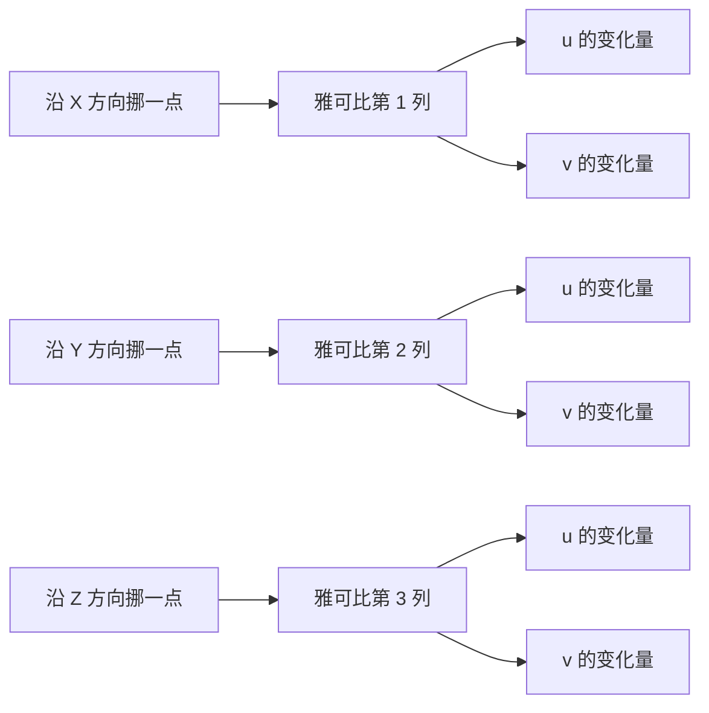

# 第 5 章：雅可比矩阵深度精讲

> 系列入口：[3D 高斯溅射从零精通](./index)

## 前情提要

第 4 章讲完了三维点从世界坐标到像素坐标的完整变换链路，并指出其中"相机坐标→归一化图像坐标"这一步是非线性的（透视除法），协方差矩阵不能直接代入这个非线性公式做变换。本章要讲清楚"局部形状在非线性变换下怎么传播"这件事——答案就是雅可比矩阵。

## 本章要解决的问题

项目里已经有一篇讲雅可比矩阵直觉和透视投影雅可比推导的前置知识——[雅可比与透视投影：局部放大镜](/前置知识/009d_前置知识_雅可比与透视投影局部放大镜)，写得很细。本章不重复那篇文章的推导过程，而是做三件事：(1) 用一个更慢、更详细的节奏重新建立"为什么非线性函数需要雅可比矩阵才能变换形状"这个核心直觉，补上 009d 里假设读者已经知道的一步；(2) 提供一个可以直接输入函数、输入点、看局部线性近似和真实曲线之间误差的交互组件；(3) 把雅可比矩阵和第 4 章的相机模型显式对接，为第 6 章协方差投影做好铺垫。

如果你已经很熟悉多元函数的偏导数和雅可比矩阵定义，可以直接跳到第四节看透视投影的具体雅可比矩阵怎么推出来。

## 一、为什么均值变换可以直接代入，协方差变换不行

### 1.1 均值只是一个点，代入公式就够了

均值 $\boldsymbol{\mu}$ 是三维空间里的一个具体点。不管变换函数 $f$ 是不是线性的，"这个点变换后落在哪"这个问题都可以直接把点的坐标代入 $f$ 算出来——这是函数定义本身就保证的：$f(\boldsymbol{\mu})$ 就是答案，不需要任何近似。第 4 章第三节算 $x'=X_c/Z_c$ 时就是这样直接代入的。

### 1.2 协方差描述的不是一个点，而是"周围一小片区域"

协方差矩阵 $\boldsymbol{\Sigma}$ 描述的不是一个点，而是"以均值为中心，周围的点大致分布成什么形状"——它是一个关于**邻域**的描述。要知道这片邻域经过变换 $f$ 之后变成什么形状，理论上应该把邻域里的每一个点都代入 $f$，再看这些变换后的点重新组成了什么形状。

问题是：如果 $f$ 是非线性的（比如透视除法），"一个椭球区域整体代入非线性函数"之后，得到的不再是一个椭球——它可能是一个形状扭曲的、边界弯曲的区域，没有一个简单的协方差矩阵能精确描述这个扭曲区域。3DGS 需要的是"投影后依然是一个椭圆"这个性质（这样才能用第 2 章的高斯权重公式继续算屏幕上的浓度分布），所以不能直接对整片区域套用非线性变换，需要退而求其次：**在均值附近很小的范围内，用一个线性近似代替真正的非线性变换**，因为线性变换作用在椭球上，结果保证仍然是一个椭球（或椭圆）。

这个"用局部线性近似代替非线性函数"的工具就是雅可比矩阵。

## 二、从一元函数的导数说起

### 2.1 导数是最简单的"局部放大倍数"

一元函数 $y=f(x)$ 在某一点 $x_0$ 附近，如果 $x$ 增加一个很小的量 $\Delta x$，$y$ 大约会变化多少？答案是导数 $f'(x_0)$ 乘上 $\Delta x$：

$$
\Delta y \approx f'(x_0)\,\Delta x
$$

**这个公式在做什么**：用 $x_0$ 处的斜率，估计"$x$ 挪一点点之后，$y$ 大约挪多少"——这是导数最原始的几何意义，也是雅可比矩阵这个概念在一维情形下的样子。

::: details 📐 公式详解（点击展开）

| 子表达式 | 它是谁 | 它在干嘛 |
|---|---|---|
| $x_0$ | 参考点 | 这个近似只在 $x_0$ 附近成立，离得越远越不准 |
| $f'(x_0)$ | $x_0$ 处的斜率（局部放大倍数） | 告诉你"$x$ 每挪 1 单位，$y$ 大约挪多少单位" |
| $\Delta x$ | 输入的小变化 | 真实的、可以任意大小的位移 |
| $\Delta y$ | 输出的小变化（近似值） | 用斜率乘位移估算出来的，不是精确值 |

**用人话读**：在 $x_0$ 这一点附近，$y$ 变化的速度基本不变（等于这一点的斜率），所以 $x$ 挪多少，$y$ 大致跟着挪"斜率倍"那么多。

**为什么只能是近似号 $\approx$**：只有当 $f$ 是一条直线时，"斜率乘以位移"才精确等于真实的 $y$ 变化量；对于弯曲的函数，斜率本身随位置变化，走得越远，起点处的斜率就越不能代表沿途所有点的真实斜率，误差随之累积。
:::

下图把"局部"这两个字画了出来：蓝色曲线是真实的（弯曲的）函数，橙色虚线是在红点处的切线，只在红点附近和蓝色曲线贴合得很好，离得越远，两条线分得越开。

> 绿色箭头是输入的小变化 $\Delta x$，紫色箭头是用斜率预测的输出变化 $\Delta y$。走得越远，蓝线和橙线之间的红色误差越大——这张图里"局部"两个字的意思，就是只信任红点周围那一小段。

### 2.2 三维椭球的每个高斯"很小"这件事很关键

上面这条近似只在"$\Delta x$ 很小"时才够准。3DGS 的椭球在场景尺度上通常确实很小（几毫米到几厘米量级），相比相机到物体的距离（通常几十厘米到几米）是一个小量——这正是雅可比近似在 3DGS 里能用得住的前提条件，不是一个随意的简化：**因为每个高斯本身很小，它所占的这一小片邻域里，非线性函数的局部放大倍数变化不大，用一个固定的雅可比矩阵代替整片区域的真实变换，误差可以接受**。

## 三、多元函数的雅可比矩阵：把多个方向的"斜率"排成一张表

### 3.1 输入多维、输出多维时，"斜率"变成一个矩阵

如果函数 $f$ 的输入是多维的（比如三维点 $(X,Y,Z)$），输出也是多维的（比如像素坐标 $(u,v)$），"局部放大倍数"就不再是一个数,而是要回答一整张问题表：**输入沿每一个方向各挪一点，输出的每一个分量各变化多少？** 这张表就是雅可比矩阵——每一行对应一个输出分量，每一列对应一个输入方向,表里第 $i$ 行第 $j$ 列的元素是"输出的第 $i$ 个分量对输入的第 $j$ 个分量的偏导数"。

> 每一列是一次"单独实验"：只让输入的一个分量挪一点，记录输出的两个分量各自怎么响应。三列实验的结果拼起来，就是完整的 $2\times3$ 雅可比矩阵——它同时记录了"横向挪动如何影响画面"和"深度方向挪动如何影响画面"这两类完全不同的效应。

写成公式：

$$
\Delta\mathbf{y} \approx \mathbf{J}(\mathbf{x}_0)\,\Delta\mathbf{x}, \qquad \mathbf{J}_{ij} = \frac{\partial y_i}{\partial x_j}
$$

**这个公式在做什么**：把一元情形的"斜率乘位移"推广到多维——用一张"每个输入方向对每个输出分量的影响程度"表，对输入的小位移做一次矩阵乘法，估算输出的小位移。

::: details 📐 公式详解（点击展开）

| 子表达式 | 它是谁 | 它在干嘛 |
|---|---|---|
| $\mathbf{x}_0$ | 参考点 | 雅可比矩阵 $\mathbf{J}$ 的具体数值依赖这个点，换一个点数值就不同 |
| $\Delta\mathbf{x}$ | 输入的小位移向量 | 比如三维点沿某个方向移动一点 |
| $\mathbf{J}_{ij}=\partial y_i/\partial x_j$ | 矩阵第 $i$ 行第 $j$ 列的元素 | 输出的第 $i$ 个分量对输入的第 $j$ 个分量的偏导数——"只让第 $j$ 个输入变，其余不变，第 $i$ 个输出变化多快" |
| $\mathbf{J}(\mathbf{x}_0)\Delta\mathbf{x}$ | 矩阵乘向量 | 把每个输入方向的贡献按对应的偏导数加权后累加，得到总的输出变化估计 |

**用人话读**：雅可比矩阵是一张"实验记录表"——每次只推一个输入方向，看所有输出分量各自的反应；矩阵乘法就是把这些单独实验的记录，按实际发生的位移比例组合起来，预测真实的（多方向同时变化的）输出变化。

**为什么矩阵乘法能同时处理多个方向的变化**：多元微积分里最基础的一个事实是——当各个方向的位移都很小时，多个方向同时变化产生的总效应，近似等于每个方向单独变化产生的效应之和（这是微分线性叠加的直接结果）。矩阵乘法 $\mathbf{J}\Delta\mathbf{x}$ 展开正好就是这个"各方向贡献相加"的过程：$\Delta y_i \approx \sum_j \mathbf{J}_{ij}\Delta x_j$。
:::

### 3.2 交互实验：拖动参考点，观察局部线性近似的准确程度

下面的例子直接对应上面 $y=f(x)$ 的一元情形，把它变成一个可以调整参考点、观察近似误差的小程序。代码里选用透视除法函数 $y=1/x$（这正是第 4 章"深度越大、归一化坐标越小"背后的函数形状）,你可以修改 `x0`（参考点）的值,重新运行观察：参考点离原点越远（$x$ 越大),函数本身越平缓,局部斜率的近似就越准；参考点离原点越近（$x$ 越小),函数弯曲得越剧烈,同样大小的 $\Delta x$ 产生的近似误差就越大。

<GaussianSplatPlayground preset="jacobian-linearization" title="局部线性化：参考点位置如何影响近似误差" />

**这个实验想说明的事**：3DGS 里深度 $Z_c$ 越小（物体离相机越近），透视除法 $1/Z_c$ 的局部曲率越大,雅可比近似的误差理论上也越大——这是为什么近距离的高斯投影出的椭圆形状精度不如远处高斯的一个理论原因（尽管实践中这个误差通常在可接受范围内，因为单个高斯的物理尺寸本身很小）。

## 四、把透视投影代入：推出相机的雅可比矩阵

### 4.1 直接复用 009d 的推导结论

[009d 第三节](/前置知识/009d_前置知识_雅可比与透视投影局部放大镜#三-透视相机到底做了哪几步) 已经完整推导过透视投影函数 $u=f_xX_c/Z_c,\ v=f_yY_c/Z_c$（对应第 4 章的公式，这里省略主点 $c_x,c_y$ 因为求导后常数项消失）在参考点 $(X_0,Y_0,Z_0)$ 处的雅可比矩阵，结论是：

$$
\mathbf{J}=\begin{bmatrix}
\dfrac{f_x}{Z_0} & 0 & -\dfrac{f_xX_0}{Z_0^2}\\[4pt]
0 & \dfrac{f_y}{Z_0} & -\dfrac{f_yY_0}{Z_0^2}
\end{bmatrix}
$$

**这个公式在做什么**：列出高斯中心 $(X_0,Y_0,Z_0)$ 附近，三维点沿 $X,Y,Z$ 三个方向各挪一点，屏幕像素坐标 $u,v$ 各会挪多少——它是相机在这个高斯中心处的"局部放大镜"。

::: details 📐 公式详解（点击展开）

| 子表达式 | 它是谁 | 它在干嘛 |
|---|---|---|
| $f_x/Z_0,\ f_y/Z_0$ | 横向、纵向的局部放大倍数 | 深度越大，同样的横向/纵向位移在屏幕上引起的变化越小——这是透视缩放规律在雅可比矩阵里的直接体现 |
| $-f_xX_0/Z_0^2,\ -f_yY_0/Z_0^2$ | 深度方向位移带来的耦合效应 | 点不在正对光轴的位置时（$X_0,Y_0\neq0$），沿深度方向移动也会让投影位置发生微小偏移，这一项就是这个耦合的大小 |
| 第一列、第二列全部来自 $\partial u/\partial X,\partial v/\partial Y$ 等直接对角项 | 横向/纵向移动的主效应 | 大部分情况下起主导作用的部分 |
| 第三列 | 对深度求导的结果 | 只有这一列同时出现在 $u$ 和 $v$ 的表达式里，因为深度 $Z_c$ 出现在两个分量共同的分母上 |

**用人话读**：这张表告诉渲染器，高斯中心附近的每个三维小方向，应该在屏幕上画成多宽、多斜——横向和纵向移动基本各自独立地影响对应的屏幕方向，但深度方向的移动会同时牵动两个屏幕方向（如果点偏离光轴的话）。

**为什么第三列不是简单的 $f_x/Z_0^2$ 这样的对称形式**：因为 $u=f_xX_c/Z_c$ 对 $Z_c$ 求偏导时,要用到除法的求导规则（商法则），$\partial u/\partial Z_c=-f_xX_c/Z_c^2$——负号和分母的平方，都是商法则本身决定的,不是额外加上去的效果。完整的逐步求导过程见 [009d 第三节](/前置知识/009d_前置知识_雅可比与透视投影局部放大镜#三-透视相机到底做了哪几步)，本章不重复推导过程，只强调这个结果在几何上的含义。
:::

### 4.2 数值算例：验证雅可比矩阵确实是"局部放大倍数"

延续第 4 章的算例，$f_x=f_y=1000$ 像素，高斯中心在相机坐标系 $(X_0,Y_0,Z_0)=(0.1,0.2,5)$。代入上面的公式：

- $\mathbf{J}_{11}=f_x/Z_0=1000/5=200$（横向局部放大倍数：像素/米）
- $\mathbf{J}_{22}=f_y/Z_0=1000/5=200$（纵向局部放大倍数）
- $\mathbf{J}_{13}=-f_xX_0/Z_0^2=-1000\times0.1/25=-4$
- $\mathbf{J}_{23}=-f_yY_0/Z_0^2=-1000\times0.2/25=-8$

验证一下：如果这个高斯的中心沿 $X$ 方向挪 1 厘米（$\Delta X=0.01$），按雅可比矩阵预测,像素坐标 $u$ 大约变化 $200\times0.01=2$ 像素。直接用第 4 章的公式重新计算一次验证：原来 $u=1000\times0.1/5=20$，挪动后 $X_c=0.11$，新的 $u=1000\times0.11/5=22$，确实变化了 2 像素——因为这一步（横向移动、深度不变）的投影关系本身是线性的，雅可比近似在这个方向上是精确值，没有误差。

如果换成沿 $Z$ 方向挪 0.5 米（$\Delta Z=0.5$，这个量相对深度 5 米不算"很小"，故意选一个较大的位移来展示近似误差），按雅可比矩阵预测 $\Delta u \approx \mathbf{J}_{13}\times\Delta Z=-4\times0.5=-2$ 像素，预测 $u\approx18$。直接计算真实值：新深度 $Z_c=5.5$，真实 $u=1000\times0.1/5.5\approx18.18$。两者相差约 0.18 像素——这就是"深度方向位移较大时,线性近似产生的误差"，和第二节图里"走得越远,橙色虚线和蓝色曲线越分开"是同一个现象的具体数值体现。

## 五、雅可比矩阵在整条相机链路里的位置

第 4 章的完整链路是"世界→相机（旋转+平移）→归一化图像（透视除法）→像素（焦距+主点）"。这条链路里哪些环节是线性的、哪些是非线性的，直接决定了协方差矩阵在哪一步需要雅可比矩阵：

| 变换环节 | 是否线性 | 协方差如何传播 |
|---|---|---|
| 世界→相机（旋转） | 线性 | 直接用旋转矩阵做相似变换（第 4 章第二节） |
| 相机→归一化图像（透视除法 $X_c/Z_c$） | **非线性** | 需要雅可比矩阵做局部线性近似（本章） |
| 归一化图像→像素（焦距缩放+主点平移） | 线性 | 直接用对角矩阵（焦距）做相似变换 |

也就是说，第 4 章第三、四节的两步——透视除法和焦距缩放——虽然分开讲是为了让读者理解"哪部分是几何规律、哪部分是硬件参数"，但在给协方差求雅可比矩阵的时候，通常会把这两步的效果合并写进同一个雅可比矩阵里（这正是第 4 章最终公式 $u=f_xX_c/Z_c+c_x$ 直接对 $X_c,Y_c,Z_c$ 求偏导、而不是分两次求导再复合的原因——焦距 $f_x,f_y$ 本来就是线性缩放，可以直接乘进非线性部分的导数里一步得到结果）。第 6 章会把这张雅可比矩阵和第 4 章第二节的旋转变换拼在一起，推出协方差矩阵完整的"3D 到 2D"变换公式。

## 总结

| 概念 | 一句话总结 |
|---|---|
| 为什么均值可以直接代入，协方差不行 | 均值是一个点，代入非线性函数依然有精确答案；协方差描述一片邻域，非线性变换会把椭球扭曲成非椭球形状 |
| 雅可比矩阵是什么 | 在参考点附近，把"每个输入方向的小位移"对应到"每个输出分量的小变化"的一张系数表 |
| 为什么在 3DGS 里能用 | 每个高斯本身很小，局部范围内非线性函数的曲率变化不大，线性近似的误差可以接受 |
| 相机投影的雅可比矩阵 | 深度越大，横向/纵向的局部放大倍数越小；点偏离光轴时，深度方向的位移也会牵动屏幕坐标 |

## 下一章预告

有了雅可比矩阵这个工具，第 6 章要把它和第 4 章的旋转变换拼起来，正式推导 3DGS 里最核心的一步——**EWA splatting**：一个三维协方差矩阵怎么变成屏幕上的一个二维椭圆，以及这个二维椭圆具体怎么参与"判断哪些像素受这个高斯影响"和"计算每个像素分到多大权重"这两件事。

## 延伸阅读

- [雅可比与透视投影：局部放大镜](/前置知识/009d_前置知识_雅可比与透视投影局部放大镜) — 本章依赖的核心推导，包含完整的透视投影雅可比矩阵逐步求导过程
- [雅可比矩阵与微分运动学](/前置知识/003b_前置知识_雅可比矩阵与微分运动学) — 雅可比矩阵在机器人运动学中的另一个经典应用，可以对照理解"雅可比是局部线性映射"这个共同主题
