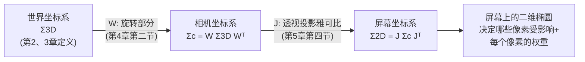

# 第 6 章：3D 协方差到 2D 协方差

> 系列入口：[3D 高斯溅射从零精通](./index)

## 前情提要

第 4 章讲清楚了相机把三维点变成像素坐标的完整链路，并指出协方差矩阵的变换不能像均值一样直接代入非线性的透视公式。第 5 章补上了工具——雅可比矩阵，用局部线性近似处理非线性变换。本章把这两章的结论拼在一起，推导 3DGS 渲染流水线里承上启下的一步：**一个三维高斯椭球，怎么变成屏幕上的一个二维椭圆**。

## 本章要解决的问题

到目前为止，一个高斯的协方差矩阵 $\boldsymbol{\Sigma}_{3D}$ 定义在三维世界坐标系里。但渲染要回答的是"屏幕上哪些像素受这个高斯影响、每个像素分到多大权重"——这是一个二维问题。本章要推导一个公式，把 $\boldsymbol{\Sigma}_{3D}$ 变换成屏幕空间的二维协方差 $\boldsymbol{\Sigma}_{2D}$，这个变换过程在 3DGS 论文里叫 **EWA splatting**（Elliptical Weighted Average，椭圆加权平均）。

这部分数学推导，项目里的 [009c 第十一节](/前置知识/009c_前置知识_3DGS为什么使用协方差矩阵#十一-协方差如何变成屏幕上的椭圆) 已经完整讲过，配有数值算例和图示。本章的任务不是重复那个推导，而是（1）明确指出这个公式的每一部分分别对应第 4、5 章讲的哪一步，让你能把公式和具体的坐标变换链路对上号；（2）补充"为什么 EWA splatting 不直接把椭球采样成很多个点分别投影"这个工程选择背后的权衡；（3）给一个交互组件，让你亲手拖高斯的深度和位置，实时看二维椭圆怎么变化。

## 一、把 EWA 公式拆回三步变换

### 1.1 完整公式

$$
\boldsymbol{\Sigma}_{2D}=\mathbf{J}\mathbf{W}\boldsymbol{\Sigma}_{3D}\mathbf{W}^T\mathbf{J}^T
$$

**这个公式在做什么**：把一个三维协方差矩阵，先转到相机坐标系下的样子（$\mathbf{W}$），再用相机在这个高斯中心处的局部放大镜（$\mathbf{J}$）压到屏幕上，得到一个二维椭圆的形状说明书。

::: details 📐 公式详解（点击展开）

| 子表达式 | 它是谁 | 它在干嘛 |
|---|---|---|
| $\boldsymbol{\Sigma}_{3D}$ | 世界坐标系下的三维协方差 | 第 2、3 章定义的椭球形状，训练时被优化器直接调整的对象（通过 $\mathbf{R},\mathbf{S}$） |
| $\mathbf{W}$ | 世界到相机的旋转矩阵 | 就是第 4 章第二节的 $\mathbf{R}_{cw}$，只取旋转部分（协方差不需要平移） |
| $\mathbf{W}\boldsymbol{\Sigma}_{3D}\mathbf{W}^T$ | 相机坐标系下的三维协方差 $\boldsymbol{\Sigma}_c$ | 第 4 章第二节公式的直接结果 |
| $\mathbf{J}$ | 透视投影在高斯中心处的雅可比矩阵 | 第 5 章第四节推出的 $2\times3$ 矩阵，包含焦距和深度的效应 |
| $\mathbf{J}(\cdot)\mathbf{J}^T$ | 用雅可比矩阵做局部线性近似的协方差传播 | 把相机坐标系下的三维形状，压缩成屏幕坐标系下的二维形状 |

**用人话读**：协方差矩阵的变换要"两边夹"——先用旋转矩阵夹一遍换到相机坐标系，再用雅可比矩阵夹一遍压到屏幕坐标系；两次都是"矩阵在左边乘一次，矩阵的转置在右边乘一次"的相似变换写法。

**为什么两次变换都要写成"两边夹"的形式**：协方差矩阵描述的是"两个方向一起变化的程度"。当坐标系整体做一次线性变换时，每一个方向都要用同一个变换规则重新描述，而协方差是两个方向的乘积期望——两个方向都要变换一次，所以变换矩阵要出现两次（一次作用在"行"上、一次作用在"列"上），写成矩阵乘法就是变换矩阵在左、其转置在右夹住原矩阵。这保证了变换后的结果仍然是对称矩阵（半正定性在 $\mathbf{J}$ 不是满秩的情况下会退化，但对称性总是保持的，这一点第五节还会具体讨论）。
:::

### 1.2 三步变换和第 4、5 章的对应关系

把公式从右往左读，正好是第 4 章"世界→相机→归一化图像→像素"链路里，协方差矩阵实际要走的两步（第三步"焦距缩放"已经被吸收进 $\mathbf{J}$ 里，第 5 章第五节解释过这一点）：

> 这张图和第 4 章末尾的"均值/协方差走不同链路"图是同一件事的延续：均值走完整的四步变换直接代入公式，协方差只走两步——旋转（线性,直接代入）和透视投影（非线性,用雅可比近似）,焦距缩放这一步因为本身也是线性的,已经被吸收进 $\mathbf{J}$ 的推导过程里。

## 二、数值算例：从三维椭球到屏幕像素宽度

延续第 4、5 章的相机参数（$f_x=f_y=1000$ 像素）,假设一个高斯在相机坐标系下的中心是 $(X_0,Y_0,Z_0)=(0,0,2)$ 米（正对光轴,简化雅可比矩阵的第三列为 0),协方差矩阵在相机坐标系下（假设已经乘过 $\mathbf{W}$）是一个简单的各向同性球：$\boldsymbol{\Sigma}_c = (0.01)^2 \mathbf{I}$（标准差 1 厘米的球形高斯）。

第 5 章算过,这个位置的雅可比矩阵是 $\mathbf{J}=\begin{bmatrix}500&0&0\\0&500&0\end{bmatrix}$（因为 $Z_0=2$,横向纵向局部放大倍数都是 $1000/2=500$，且正对光轴时第三列为零）。把 $\mathbf{J}$ 和 $\boldsymbol{\Sigma}_c=(0.01)^2\mathbf{I}$ 代入 $\mathbf{J}\boldsymbol{\Sigma}_c\mathbf{J}^T$（这里已经在相机坐标系下，不需要再乘 $\mathbf{W}$），矩阵乘法展开后对角线上的每一项都是 $500^2\times0.0001=25$，非对角线全部为 0，最终 $\boldsymbol{\Sigma}_{2D}=\begin{bmatrix}25&0\\0&25\end{bmatrix}$。

结果是一个各向同性的二维协方差，标准差 $\sqrt{25}=5$ 像素——也就是说，这个 1 厘米标准差的三维球形高斯，在深度 2 米处投影出的椭圆半径大约是 5 像素。如果把同一个高斯挪到深度 1 米处，$\mathbf{J}$ 的对角元素变成 $1000/1=1000$，重新计算会得到标准差 10 像素——距离减半，屏幕投影尺寸翻倍，这正是第 4、5 章反复强调的"近大远小"规律在协方差（而不只是均值）上的体现。

## 三、交互实验：拖动深度和旋转，实时看二维椭圆变化

下面的组件模拟一个三维高斯在不同深度、不同朝向下投影出的二维椭圆形状。拖动"深度"滑杆观察椭圆整体缩放（对应上面算例的规律）；拖动"朝向"滑杆观察椭圆在屏幕上的倾斜角度如何随三维朝向变化——这一步对应的是 $\mathbf{W}$（旋转部分）和 $\mathbf{J}$ 共同作用的结果，不是单独哪一个矩阵决定的。

<ClientOnly>
  <GaussianSplatPlayground preset="ewa-projection" title="EWA splatting：深度与朝向如何决定屏幕椭圆" />
</ClientOnly>

**观察要点**：当高斯的长轴恰好指向光轴方向（"看向"相机）时，即使三维形状本身是一个拉得很长的椭球，投影到屏幕上也可能显得比较圆——因为长轴方向的伸展主要体现在深度变化上，而深度变化经过 $\mathbf{J}$ 的第三列（第 5 章讲的深度耦合项）只有在偏离光轴时才会显著影响屏幕坐标。这是"三维形状"和"二维投影形状"可能出现直觉偏差的一个具体例子。

## 四、为什么不直接把椭球采样成很多点分别投影

一个看起来更"直接"的替代方案是：把三维椭球的边界采样成很多个点（比如在椭球表面均匀取 100 个点），把每个点单独用第 4 章的完整非线性公式投影到屏幕，再用这 100 个投影点重新拟合出一个二维椭圆（或者直接用这些点的凸包近似椭圆边界）。这个方法确实能避免雅可比近似带来的误差，但有三个代价：

1. **计算量**：每个高斯要做 100 次完整投影,而不是"变换一次协方差矩阵",这在有几十万个高斯、每帧都要重新投影的场景下,计算量差了两个数量级。
2. **不连续性**：采样点的数量和分布是离散的、人为设定的,训练时如果高斯的尺度稍微变化,拟合出的椭圆边界可能出现不连续的跳变（采样点的相对位置关系发生微小重排),这对需要计算连续梯度的训练过程不友好。
3. **仍然需要一个椭圆去做后续计算**：即使采样点投影再精确，light splatting 后续步骤（第 8、9 章要讲的 tile 分配和 alpha blending）都是基于"这是一个椭圆"这个假设设计的——采样点方法最终还是要拟合出一个椭圆，白白多做了一步。

EWA splatting 选择"直接变换协方差矩阵、接受局部线性近似的误差"，本质上是在用"每个高斯本身很小，误差可控"（第 5 章第二节论证过的前提）换取数量级的速度提升和处处可导的训练友好性。这是一个典型的工程权衡：**精确性换速度，而这里的精度损失在应用场景下是可以接受的**。

## 五、一个容易被忽略的细节：$\mathbf{J}$ 不是满秩的

$\mathbf{J}$ 是一个 $2\times3$ 矩阵——输入三维、输出二维，这意味着它**不是满秩的方阵**，$\mathbf{J}\boldsymbol{\Sigma}_c\mathbf{J}^T$ 这个 $2\times2$ 矩阵的秩最多是 2（如果 $\mathbf{J}$ 的两行线性独立，通常情况下是这样），但更本质的一点是：**三维空间里沿着"深度方向、且不影响屏幕坐标"这个特定方向的形状信息，在投影后被丢弃了**。这不是一个数值错误，而是投影这个操作本身固有的信息损失——三维变二维必然会丢失掉一个维度的信息，屏幕椭圆本身就不携带"这个高斯沿着视线方向到底有多厚"这个信息。

这个信息损失在实践中通常不是问题，因为渲染最终只需要知道"从这个视角看，每个像素该是什么颜色"，深度方向的厚度信息只在第 9 章讲的 alpha blending 深度排序时才会重新用到（那里用的是高斯中心的深度值，不是协方差沿深度方向的分量）。

## 总结

| 环节 | 对应第几章 | 变换性质 | 协方差怎么变 |
|---|---|---|---|
| 世界坐标→相机坐标 | 第 4 章第二节 | 线性（旋转） | 直接用 $\mathbf{W}$ 做相似变换 |
| 相机坐标→屏幕坐标 | 第 5 章第四节 | 非线性（透视投影），已含焦距缩放 | 用雅可比矩阵 $\mathbf{J}$ 做局部线性近似 |
| 合起来 | 本章 | — | $\boldsymbol{\Sigma}_{2D}=\mathbf{J}\mathbf{W}\boldsymbol{\Sigma}_{3D}\mathbf{W}^T\mathbf{J}^T$ |
| 工程权衡 | 本章第四节 | — | 用局部近似换取数量级的速度提升，代价是深度方向信息在投影中不可避免地丢失 |

## 下一章预告

到目前为止，高斯只有"形状"（协方差）和"位置"（均值）两组几何参数。第 7 章开始讲第三组参数——**颜色**，具体是为什么 3DGS 不直接给每个高斯存一个固定的 RGB（红绿蓝）颜色值，而是用球谐函数来表示一种"随观察角度变化"的颜色。这是目前系列里唯一一个现有前置知识完全没有展开过的话题。

## 延伸阅读

- [3DGS 为什么使用协方差矩阵](/前置知识/009c_前置知识_3DGS为什么使用协方差矩阵) — EWA splatting 公式的原始推导出处，包含更多图示
- [雅可比与透视投影：局部放大镜](/前置知识/009d_前置知识_雅可比与透视投影局部放大镜) — 本章 $\mathbf{J}$ 矩阵的来源
