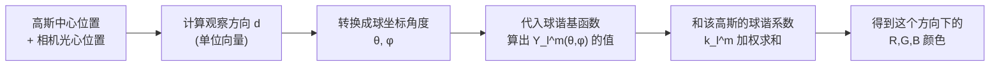

# 第 7 章：球谐函数与视角相关颜色

> 系列入口：[3D 高斯溅射从零精通](./index)

## 前情提要

第 2～6 章讲完了一个高斯的**位置**（均值）和**形状**（协方差），以及形状怎么投影到屏幕上变成二维椭圆。本章开始讲第三组参数——**颜色**。到目前为止，我们都简化地假设每个高斯有一个固定的 RGB（红绿蓝，Red-Green-Blue，最常用的三通道颜色表示）颜色。本章要说明这个简化在哪里不够用，以及 3DGS 实际用什么表示颜色。

## 本章要解决的问题

拿一个光滑的金属勺子对着窗户，从不同角度看，勺子表面同一个点反射出的光的颜色和亮度是不一样的——正对着窗户反光的地方是亮白色高光，斜着看同一个点可能是勺子本身的金属灰色。这种"同一个三维点，从不同方向看颜色不同"的现象在真实世界普遍存在（哪怕是杯子这种不算太反光的物体，表面也有微弱的视角相关高光）。如果每个高斯只存一个固定的 RGB，就只能表示"从任何角度看都一样"的纯漫反射颜色，重建出的场景会丢失这些高光细节。

本章要讲清楚三件事：这个"视角相关颜色"问题为什么需要一个新的数学工具（而不是简单地多存几个颜色值）、球谐函数（Spherical Harmonics, SH）具体是什么、3DGS 怎么用一小组球谐系数表示每个高斯在所有方向上的颜色变化。

## 一、为什么固定 RGB 不够用

### 1.1 问题的精确描述

把"颜色随观察方向变化"这件事写成数学语言：一个高斯的颜色不再是三个固定的数 $(R,G,B)$，而是三个**函数** $c_R(\mathbf{d}), c_G(\mathbf{d}), c_B(\mathbf{d})$，输入是观察方向 $\mathbf{d}$（一个指向观察者的单位向量），输出是这个方向上看到的颜色分量。固定 RGB 相当于假设这三个函数是常数函数（不随 $\mathbf{d}$ 变化）——这正是最基础的漫反射假设。

要表示一个"随方向变化的函数"，直接的想法是：把观察方向所在的球面切成很多小块，每个方向单独存一个颜色值。但这样做的参数量会随着切分精细度快速膨胀（球面切分成 $N\times N$ 块就需要存 $N^2$ 组颜色），而且大部分方向变化其实是平滑的（不会在相邻两个小块之间颜色突变），用离散网格存储既浪费参数，也没有利用"函数是平滑的"这个先验信息。

### 1.2 类比：一维周期函数用傅里叶级数表示

在深入球面上的方案之前，先看一个更熟悉的类比。一个定义在圆周上的平滑函数 $f(\theta)$（比如一天 24 小时的温度变化，可以看作一个周期函数），可以用**傅里叶级数**表示——用一组固定的基函数 $1,\cos\theta,\sin\theta,\cos2\theta,\sin2\theta,\ldots$ 的加权和去逼近它：

$$
f(\theta) \approx a_0 + a_1\cos\theta + b_1\sin\theta + a_2\cos2\theta + b_2\sin2\theta + \cdots
$$

**这个公式在做什么**：用一组固定形状的波形（不同频率的正弦、余弦）按不同权重叠加，逼近任意一个周期性变化的函数——只需要存权重系数，不需要存整条曲线的每一个采样点。

::: details 📐 公式详解（点击展开）

| 子表达式 | 它是谁 | 它在干嘛 |
|---|---|---|
| $1,\cos\theta,\sin\theta,\cos2\theta,\ldots$ | 固定的基函数 | 频率越来越高的标准波形，不需要训练，数学上提前定义好 |
| $a_0,a_1,b_1,a_2,b_2,\ldots$ | 需要求出的系数 | 决定每个基函数在最终叠加结果里占多大权重，这是唯一需要"存储"的信息 |
| 项数（阶数） | 截断精度 | 保留的项越多，逼近原函数越精确，但需要存的系数也越多 |

**用人话读**：任何一个周期性变化的曲线，都可以拆成"一个常数 + 一份基础频率的波动 + 更高频率的细节波动"，每一份占多少由对应系数决定。

**为什么这个思路能推广到球面**：这套"用固定基函数 + 少量系数逼近平滑函数"的思路本身不依赖"函数定义在圆周上"这个具体设定——只要能在球面上找到一组同样具备正交性和完备性的基函数，就能用同样的方式表示球面上的函数。球谐函数正是这样一组基，下一节具体展开。
:::

用的项数越多（阶数越高），逼近得越精确，但只需要存"系数" $a_0,a_1,b_1,a_2,b_2,\ldots$ 这几个数字，而不需要把整条曲线离散采样存下来。这正是"用一组固定的基函数 + 少量系数表示一个平滑函数"这个思路的雏形——球谐函数就是这个思路搬到**球面**上的版本，而不是圆周。

## 二、球谐函数是什么

### 2.1 定义：球面上的傅里叶基

球谐函数 $Y_l^m(\theta,\phi)$ 是一组定义在球面上的基函数，其中 $l$（阶数，degree，取非负整数 $0,1,2,\ldots$）和 $m$（阶数内的序号，取值范围是 $-l$ 到 $l$）共同决定具体是哪一个基函数。和一维傅里叶级数一样，球谐函数满足两个关键性质：

- **正交性**：任意两个不同的球谐基函数，在整个球面上积分的"内积"为零——这保证了可以像傅里叶系数一样，独立地算出每个基函数前面的系数，不会互相干扰。
- **完备性**：给定足够多阶的球谐函数，可以逼近球面上任意一个平滑函数,阶数越高、逼近精度越高。

阶数 $l$ 每增加 1，可用的 $m$ 就增加 2 个（$-l$ 到 $l$ 一共 $2l+1$ 个），所以到阶数 $l$（包含 0 阶到 $l$ 阶所有项）为止，一共有 $\sum_{k=0}^{l}(2k+1)=(l+1)^2$ 个基函数。

下图直接画出了 $l=0,1,2$ 阶几个代表性球谐基函数在球面上的形状（半径表示该方向上函数值的绝对大小，蓝色和橙色分别表示函数值的正负）：

> $l=0$ 阶（最左）是一个完美的球——函数值在所有方向上都相同，对应"没有任何方向性、纯漫反射"的颜色分量。$l=1$ 阶（中间）出现一个"哑铃"形状——一半方向为正（蓝色）、一半为负（橙色），能表示"这边偏亮、那边偏暗"这种最简单的方向性变化。$l=2$ 阶（右边）波瓣更多、形状更复杂，能表示更细致的方向性图案（比如"两个相对的高光点"这类更复杂的分布）。

### 2.2 用球谐系数表示一个方向函数

和傅里叶级数完全类似的写法，一个球面上的函数 $f(\theta,\phi)$（比如某个高斯在方向 $(\theta,\phi)$ 上的颜色）可以用有限阶球谐函数的加权和近似：

$$
f(\theta,\phi) \approx \sum_{l=0}^{L}\sum_{m=-l}^{l} k_l^m\, Y_l^m(\theta,\phi)
$$

**这个公式在做什么**：用一组固定形状的球面基函数（图里那些波瓣形状），按不同的权重叠加起来，逼近任意一个"颜色随方向变化"的函数——只需要存这些权重（系数 $k_l^m$），不需要存整个球面上每个方向的颜色值。

::: details 📐 公式详解（点击展开）

| 子表达式 | 它是谁 | 它在干嘛 |
|---|---|---|
| $Y_l^m(\theta,\phi)$ | 固定的基函数（第 2.1 节图里的波瓣形状） | 不需要训练，是数学上提前定义好的一组标准形状 |
| $k_l^m$ | 这个高斯真正被训练的参数（球谐系数） | 每个高斯自己的一组数字，决定基函数怎么叠加出这个高斯特有的方向性颜色 |
| $L$ | 截断阶数（3DGS 里通常取 3） | 决定用多少层波瓣去逼近，层数越多细节越丰富但参数也越多 |
| 求和 $\sum_l\sum_m$ | 加权叠加 | 把所有阶数、所有序号的基函数按各自的系数加起来，合成最终的方向函数 |

**用人话读**：颜色随方向的变化图案，可以拆成"一个基础颜色（0 阶）+ 一点点简单的方向性偏移（1 阶）+ 更细致的方向性图案（2 阶、3 阶）"，每一层的"多多少"由对应的系数决定。

**为什么用阶数截断在 $L$，而不是用更多阶数**：阶数越高，能表示的方向性细节越丰富，但需要的系数也呈平方增长（$(L+1)^2$）。3DGS 论文实践中发现 $L=3$（对应 $(3+1)^2=16$ 个系数）已经足够表示大部分场景里的视角相关效果（比如轻微的高光、菲涅尔反射），继续增加阶数带来的画质提升和参数量增长不成比例，所以 $L=3$ 是一个经验上的性价比选择,不是理论上的严格上限。
:::

### 2.3 数值直觉：阶数越高，逼近的方向性图案越精细

下图用一个更容易画出来的类比（圆周上的傅里叶级数，等价于球面球谐函数在二维情形下的简化版）展示"阶数越高，逼近效果越好"这件事——目标函数（灰色虚线）模拟一个带尖锐高光的方向性颜色分布，红色实线是不同阶数（对应不同系数个数）的逼近结果：

> 最左边只用 1 个系数（0 阶，等价于球谐里的 $l=0$），逼近结果是一个完全没有方向性的常数——丢失了所有高光信息。中间用 3 个系数（1 阶),开始能表现出"一侧偏亮、一侧偏暗"的粗糙方向性。最右边用 7 个系数（3 阶),已经能大致捕捉高光波瓣的位置和尖锐程度,尽管仍不是完全精确。这正是 3DGS 选择 3 阶球谐（对应真实球面上 16 个系数）作为默认设置的直觉来源。

## 三、3DGS 具体怎么用球谐系数表示颜色

### 3.1 每个高斯存的球谐系数数量

3DGS 默认用 3 阶球谐（$L=3$），每阶对应 $(3+1)^2=16$ 个基函数系数。因为颜色有 R、G、B 三个独立通道，每个通道各自需要一组独立的系数，所以一个高斯用于颜色的参数总数是 $16\times3=48$ 个数字——这解释了[第 1 章](./01_为什么需要3D场景表示#四-椭球的完整参数清单-本系列的路线图)表格里"颜色参数：通常 48 个"这一项的具体来源。

| 球谐阶数 $L$ | 每通道系数个数 $(L+1)^2$ | 三通道总参数量 | 能表示的效果 |
|---|---|---|---|
| 0 | 1 | 3 | 纯漫反射，无视角相关效果，等价于固定 RGB |
| 1 | 4 | 12 | 简单的方向性明暗变化 |
| 2 | 9 | 27 | 更细致的方向性图案 |
| 3（3DGS 默认） | 16 | 48 | 大部分场景所需的高光、菲涅尔反射等效果 |

### 3.2 渲染时怎么用：给定观察方向，求出颜色

渲染一个像素时，需要知道"从当前相机位置看向这个高斯，这个观察方向对应的颜色是多少"。具体做法是：

1. 计算观察方向 $\mathbf{d}$——从这个高斯的中心指向相机光心的单位向量（这个方向随相机位姿变化，同一个高斯从不同相机位姿看，$\mathbf{d}$ 不同）
2. 把 $\mathbf{d}$ 转换成球坐标角度 $(\theta,\phi)$，代入每个球谐基函数 $Y_l^m(\theta,\phi)$ 算出具体数值
3. 用第 2.2 节的公式，把这些基函数值和这个高斯自己存的系数 $k_l^m$ 加权求和，对 R、G、B 三个通道分别算一次，得到这个观察方向下的最终颜色

> 这条流水线里，只有第一步（观察方向）依赖当前渲染用的相机位姿；基函数本身（第四步的 $Y_l^m$ 具体形状）是固定不变的数学函数；真正训练时被更新的参数只有第五步的系数 $k_l^m$。换一个相机位置重新渲染，同一个高斯会因为观察方向变化，重新算出一个可能不同的颜色——这正是"视角相关颜色"这个效果在渲染流水线里的具体实现位置。

### 3.3 0 阶系数的特殊地位

0 阶球谐（$l=0$）对应的基函数是一个球面上的常数函数（第 2.1 节图里最左边那个完美的球），它的系数 $k_0^0$ 实际上就是"这个高斯不随方向变化的基础颜色"——0 阶系数单独拿出来，效果完全等价于第 1～6 章简化假设里"每个高斯有一个固定 RGB"。3DGS 训练时通常会先只训练 0 阶系数（相当于先学会基础颜色分布），过一定迭代次数后再逐步解锁更高阶的系数——这个训练策略在第 11 章讲训练循环时会具体展开,这里只需要知道：**0 阶球谐不是"其中一个特殊情况"，而是高阶球谐大厦的地基,固定 RGB 假设是球谐表示在阶数截断为 0 时的特殊情况**。

## 四、为什么不用更简单的方法表示视角相关颜色

在结束本章之前，有必要说明一下为什么不用其他更直观的方法，比如"存正面颜色和侧面颜色两组值，中间插值"：

- **插值方法需要人工定义"正面""侧面"是哪个方向**，而球谐函数是各方向"平等"处理的，任意方向的观察角度都能通过同一套公式算出对应颜色，不需要人为划分区域。
- **插值方法在区域边界处可能产生不连续或不平滑的过渡**，球谐函数由光滑的三角函数（本质上）构成，任意方向上的颜色变化都是连续可导的——这对训练时求梯度（第 10 章的主题）很重要。
- **球谐系数的正交性让训练更稳定**：因为不同阶数、不同 $m$ 的基函数互相"垂直"（内积为零），调整一个系数对其他系数的影响是解耦的，不会出现"调一个参数意外影响另一个完全不相关的方向"这种梯度纠缠问题。

## 总结

| 概念 | 一句话总结 |
|---|---|
| 为什么需要视角相关颜色 | 真实表面的反光在不同观察角度下颜色不同，固定 RGB 只能表示纯漫反射 |
| 球谐函数是什么 | 定义在球面上的一组正交基函数，类比"球面版的傅里叶级数" |
| 3DGS 怎么用 | 每个高斯每个颜色通道存一组球谐系数（默认 3 阶，16 个），渲染时代入观察方向算出实际颜色 |
| 0 阶球谐的地位 | 等价于"不随方向变化的基础颜色"，是固定 RGB 假设的特殊情况 |
| 参数量 | 3 阶球谐 × 3 通道 = 48 个数字，是第 1 章列出的颜色参数维度的具体来源 |

## 下一章预告

现在一个高斯的位置、形状、颜色都讲完了，只剩最后一组渲染相关的机制——几十万个投影出来的椭圆怎么高效地合成到屏幕上。第 8 章开始讲光栅化流水线：GPU 怎么把屏幕分成一个个 tile（小方格区域）、怎么快速判断哪些高斯的投影椭圆覆盖了哪些 tile、以及为什么这个分块策略是让 3DGS 达到实时渲染速度的关键工程设计之一。

## 延伸阅读

- [3D Gaussian Splatting：用一堆椭球把真实场景搬进电脑](/前置知识/007a_前置知识_3D_Gaussian_Splatting三维场景重建) — 提到球谐系数是颜色参数的一部分，本章是对那句话的完整展开
- [前置知识：主成分分析 PCA](/前置知识/002j_前置知识_主成分分析PCA) — 另一个"用一组基函数/基向量 + 少量系数表示复杂对象"的经典例子，可以对照理解"基 + 系数"这个通用思路
