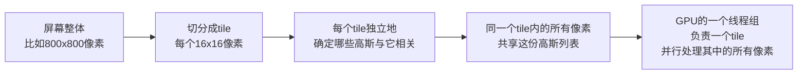
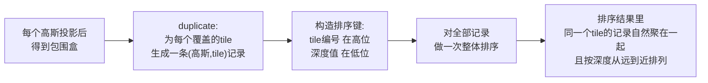

# 第 8 章：光栅化与 tile 并行

> 系列入口：[3D 高斯溅射从零精通](./index)

## 前情提要

第 6 章讲完了单个高斯怎么从三维椭球投影成屏幕上的一个二维椭圆，第 7 章讲完了这个高斯从当前观察方向看应该是什么颜色。现在假设有 30 万个高斯，每个都已经投影出了自己的二维椭圆和颜色——本章要解决的是下一步：**这 30 万个椭圆怎么高效地、并行地合成到一张几百万像素的图片上**。

## 本章要解决的问题

如果渲染的做法是"遍历每一个像素，对这个像素检查全部 30 万个高斯里哪些覆盖了它"，计算量是"像素数 × 高斯数"——一张 800×800 的图有 64 万像素，乘上 30 万个高斯，单帧就要做 1920 亿次覆盖检查，这是不可能在几十毫秒内完成的。

3DGS 实际使用的做法叫**tile-based 光栅化**（tile 在这里指屏幕被切分成的一个个小方格区域），核心思路是反过来：**先算清楚每个高斯覆盖了哪几个 tile，再让每个 tile 只检查落在自己范围内的那一小部分高斯**，把"每个像素对全部高斯"的暴力检查，变成"每个 tile 对少量相关高斯"的局部检查。本章要讲清楚这套机制的每一步，以及为什么这个设计对 GPU（Graphics Processing Unit，图形处理器，一种擅长大规模并行计算的硬件）并行特别友好。

## 一、为什么要分 tile：GPU 并行调度的需求

### 1.1 GPU 的并行方式

GPU 擅长的是"同一段代码，同时在成千上万个数据上并行执行"——比如同时给几十万个像素分别算一次颜色。但 GPU 的并行单元（线程）通常成组调度（比如一组 32 个或 64 个线程绑在一起同时执行同一条指令），如果同一组里的线程要处理的数据差异很大（比如这组里的 32 个像素分别要检查完全不同的高斯集合），硬件的并行效率会大幅下降——这是 GPU 编程里的一个基本约束：**相邻的计算任务如果访问的数据模式相似，硬件才能高效并行**。

### 1.2 tile 把"相邻像素"变成"相同的任务"

一张图切成一个个 tile（3DGS 论文里用 $16\times16$ 像素的方块），tile 内部的所有像素在空间上彼此相邻，它们受到的高斯覆盖情况高度重叠——一个足够大的高斯投影出的椭圆，很可能同时覆盖同一个 tile 里的几十甚至上百个像素。如果先按 tile 把"可能相关的高斯"筛选出来，同一个 tile 内的所有像素就可以共享这个筛选结果，用同一组高斯数据去计算——这正好匹配 GPU 线程组要求"处理相似任务"的约束。

> 关键的转变在 C→D：一旦确定了"这个 tile 受哪些高斯影响"，tile 内每个像素只需要在这个小得多的列表里做计算，不再需要面对全部 30 万个高斯。

## 二、第一步：判断哪些高斯覆盖哪些 tile

### 2.1 用椭圆的包围盒近似

第 6 章算出的二维协方差矩阵 $\boldsymbol{\Sigma}_{2D}$ 描述了一个屏幕椭圆的精确形状，但要快速判断"这个椭圆覆盖了哪几个 tile"，直接用椭圆的精确边界方程去和每个 tile 的矩形边界做几何相交测试，计算仍然偏重。3DGS 采用一个更快的近似：用椭圆的**轴对齐包围盒**（一个刚好包住整个椭圆、边平行于屏幕坐标轴的矩形）代替椭圆本身做初步筛选。

包围盒的半宽和半高，通常取协方差矩阵特征值（也就是椭圆主轴长度）的固定倍数——3DGS 论文取 3 个标准差（对应椭圆内部保留约 99.7% 的高斯"浓度"，超出这个范围的部分浓度已经趋近于 0，忽略它们对渲染结果几乎没有可见影响）：

$$
\text{半宽} = 3\sqrt{\lambda_{\max}}
$$

**这个公式在做什么**：用椭圆最长轴对应的标准差乘以 3，得到一个"保守但足够大"的矩形边界，确保椭圆的绝大部分"浓度"都落在这个矩形范围内。

::: details 📐 公式详解（点击展开）

| 子表达式 | 它是谁 | 它在干嘛 |
|---|---|---|
| $\lambda_{\max}$ | $\boldsymbol{\Sigma}_{2D}$ 的最大特征值 | 椭圆最长主轴方向对应的方差 |
| $\sqrt{\lambda_{\max}}$ | 最长主轴方向的标准差 | 椭圆在这个方向上的"典型尺度" |
| 乘以 3 | 覆盖到 3 个标准差范围 | 高斯分布在均值±3个标准差之外的浓度只剩不到 0.3%，裁掉这部分几乎不影响可见结果 |

**用人话读**：找到这个椭圆最长的那个方向有多"胖"，乘 3 倍当作一个正方形（或矩形）边界，这个边界框肯定能把椭圆绝大部分"看得见"的部分包住。

**为什么用包围盒近似而不是精确形状**：包围盒和 tile 网格的相交测试只需要比较数字大小（矩形左右边界和 tile 左右边界谁大谁小），是极便宜的整数比较操作；精确椭圆和矩形的相交测试需要解方程或者做更复杂的几何判断，对每一个"高斯-tile"候选对都做一次这种测试，在有几十万个高斯、几千个 tile 的场景下开销会大得多。包围盒可能会把一些实际上离椭圆还有一点距离的 tile 也标记为"可能相关"（假阳性),但这只会导致该 tile 多算一个几乎不产生视觉影响的高斯（因为真正超出 3 个标准差的浓度接近 0),不会引入错误的渲染结果,只是浪费了一点点计算量——这是一个"宁可稍微浪费,不要复杂判断"的工程取舍。
:::

### 2.2 复制高斯到每个相关 tile：duplicate 步骤

一个高斯的包围盒如果跨越了多个 tile（这在包围盒较大或高斯位于 tile 边界附近时很常见），需要把这个高斯"复制"给它覆盖到的每一个 tile——具体做法是给每个（高斯, tile）配对生成一条记录，记录里包含这个高斯的编号和它所在的 tile 编号。如果一个高斯覆盖了 6 个 tile，就会生成 6 条这样的记录。这个步骤在官方实现里叫 **duplicate**（复制），是 tile-based 光栅化流水线里第一个需要实际展开数据的步骤。

## 三、第二步：为什么必须按深度排序

### 3.1 alpha blending 需要"从远到近"的顺序

第 9 章会完整推导 alpha blending（透明度合成）公式，这里先说明为什么排序是必要的：一个像素同时被多个高斯的椭圆覆盖时，最终颜色是这些高斯按**从远到近**的顺序累积合成的结果——离相机更近的高斯有权"遮挡"住它后面的颜色。如果不排序、按任意顺序合成，公式里"前面已经挡住多少光"这个累积量就失去了意义，渲染结果会是错的（比如原本应该被前景完全遮挡的背景颜色，可能因为顺序错误而"透"到了前面）。

### 3.2 排序的对象是（高斯, tile）配对，不是高斯本身

因为第二节的 duplicate 步骤已经把每个高斯按它覆盖的 tile 展开成多条记录，排序实际上是对这些展开后的记录做的——**每条记录带有一个排序键，由"这条记录所属的 tile 编号"和"这个高斯的深度"组合而成**，先按 tile 编号分组，组内再按深度排序。这样排序一次之后，同一个 tile 内的所有高斯记录天然就是按深度从远到近排好的连续一段，不需要为每个 tile 单独排序。

> 这个设计的巧妙之处在于用"一次全局排序"代替"给每个 tile 分别排序"——如果 tile 编号在排序键的高位、深度在低位，排序算法会先按 tile 编号把记录分组（tile 编号相同的自然排在一起），组内再按深度从远到近排（因为深度是排序键的低位部分）。GPU 上有高度优化的并行排序算法（比如基数排序），能一次性处理几百万条记录，比对每个 tile 分别调用一次排序快得多。

### 3.3 第三步：range 定位，每个 tile 只读自己的一段

排序完成后，需要知道"这一段连续的记录，从哪里到哪里属于同一个 tile"——这一步叫 **range**（范围）定位：扫描排序后的记录列表，记录每个 tile 编号第一次出现和最后一次出现的位置，得到一张"tile 编号→起止索引"的对照表。渲染时，每个 tile 只需要查这张表，读取自己对应的那一段记录，不需要遍历整个排序结果。

## 四、交互演示：拖动高斯，观察 tile 覆盖范围变化

下面这个示例模拟一个简化的屏幕（划分成若干 tile 网格），随着一个高斯椭圆的位置和大小变化，展示它的包围盒覆盖了哪些 tile。运行后拖动代码里的 `center_x, center_y, radius` 观察包围盒和被标记的 tile 范围如何变化：

<GaussianSplatPlayground preset="tile-assignment" title="tile 分配：椭圆包围盒覆盖了哪些 tile" />

**观察要点**：椭圆越大或越靠近 tile 边界，被标记为"相关"的 tile 数量越多——这直接对应第二节说的 duplicate 步骤会为这个高斯生成更多条记录。如果场景里有很多这种"跨越多个 tile 的大高斯"，duplicate 后的记录总数可能远超高斯本身的数量，这是 tile-based 方法在高斯尺度差异很大的场景下需要权衡的一个实际开销。

## 五、每个 tile 内部具体怎么处理

拿到自己范围内已经排好序的高斯列表后，一个 tile 内的每个像素独立执行完全相同的逻辑：按顺序遍历列表（已经是从远到近），对每个高斯计算它在这个具体像素位置的高斯权重（用第 2 章的公式，代入这个像素相对椭圆中心的位置），乘上第 7 章算出的颜色和这个高斯的不透明度，累积进这个像素的颜色——这套累积逻辑正是第 9 章要完整推导的 alpha blending。

一个工程上的额外优化是：如果某个像素已经被前面的高斯"几乎完全遮挡"（累积的不透明度已经非常接近 1），后面排在更远处的高斯对这个像素的贡献理论上已经小到可以忽略，可以提前终止这个像素的遍历——这个提前终止的具体阈值和实现方式，属于第 9 章要讲的内容。

## 总结

| 步骤 | 名称 | 做什么 |
|---|---|---|
| 1 | 投影+包围盒 | 每个高斯的二维椭圆算出一个 3 个标准差的轴对齐矩形边界 |
| 2 | duplicate | 为每个高斯覆盖到的每个 tile 生成一条独立记录 |
| 3 | 排序 | 用"tile 编号(高位)+深度(低位)"做一次全局排序，让同 tile 记录聚在一起且按深度排好 |
| 4 | range 定位 | 记录每个 tile 对应的记录起止范围，供渲染时直接查表 |
| 5 | 逐 tile 并行渲染 | 每个 tile（对应一组 GPU 线程）只读自己范围内的记录，为组内每个像素做 alpha blending |

这套流水线把"渲染一张图"的计算量从"像素数 × 高斯总数"降到"像素数 × 每个 tile 平均相关的高斯数"——后者通常远小于前者,这是 3DGS 能做到实时渲染的关键工程设计之一，和第 1 章说的"避免逐点查询神经网络"是同一个"让计算量匹配硬件并行结构"的思路在光栅化环节的具体体现。

## 下一章预告

第 8 章讲清楚了"每个 tile 拿到一份排好序的高斯列表"，第 9 章要讲这份列表具体怎么被消费——一个像素被多个半透明高斯覆盖时，最终颜色怎么用 alpha blending 公式一步步累积出来，公式里每一项具体对应什么物理直觉，以及"提前终止遍历"这个优化背后的数学依据。

## 延伸阅读

- [3D Gaussian Splatting：用一堆椭球把真实场景搬进电脑](/前置知识/007a_前置知识_3D_Gaussian_Splatting三维场景重建#三-渲染-怎么把几十万个椭球变成一张-2d-图片) — 光栅化流程的第一次概览提及，本章是对这部分的完整工程展开
