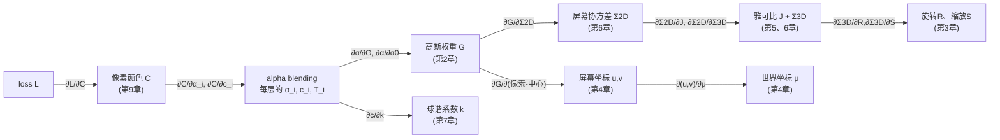

# 第 10 章：可微渲染与反向传播

> 系列入口：[3D 高斯溅射从零精通](./index)

## 前情提要

第 9 章推出了 alpha blending 的完整公式 $C=\sum_i c_i\alpha_i T_i$——已知每个高斯的参数，这样能算出渲染图片上每个像素的颜色。本章要把这个过程反过来：已知渲染图片和真实照片之间的差异，怎么算出这个差异该"归咎"到每个高斯的哪个参数、往哪个方向调整多少。

## 本章要解决的问题

3DGS 能被训练的前提是：从"高斯参数"到"渲染出的图片"这整条计算链路，每一步都是普通的、可以求导的数学运算——矩阵乘法、指数函数、加权求和,没有任何一步涉及"离散选择"或"不可导操作"。这意味着可以用**反向传播**（backpropagation，链式法则从输出到输入逐层算梯度的标准做法）把 loss 的梯度一路传回每一个高斯的每一个参数。

本章要讲清楚这条梯度链路具体长什么样：从最终的 loss，经过第 9 章的 alpha blending 公式，一路传回协方差矩阵、旋转、缩放、位置、球谐系数、不透明度——总共 6 组参数，每组都要单独交代梯度从哪一步开始进入、在哪一步结束。这是全系列现有前置知识完全没有覆盖过的内容，也是理解"3DGS 到底是怎么训练出来的"最关键的一环。

考虑到这条链路涉及的中间步骤很多，本章只讲清楚每一步梯度传递的**直觉和结构**——"梯度从哪里来，往哪里去，形状是什么，为什么这一步的梯度长这样"，完整的逐符号推导和数值算例放在配套的推导详解文章：[可微渲染与反向传播公式推导详解](./10a_可微渲染与反向传播公式推导详解)。建议先读完本章建立整体地图，再决定要不要去看完整推导。

## 一、反向传播要解决的问题：loss 对谁求导

### 1.1 训练的目标函数

训练时，对于一张已知相机位姿的训练图片，用当前所有高斯渲染出一张预测图片，和这张训练图片逐像素比较，得到一个标量 loss（数值越小说明渲染结果越接近真实照片）。这个 loss 的具体构成（L1 距离、结构相似性等）属于第 11 章要讲的内容，本章把它抽象成一个符号 $L$，只关心"$L$ 已经算出来了，接下来怎么办"。

### 1.2 要求梯度的对象

对每一个高斯，需要求出 loss 对它每一组参数的梯度：

| 参数 | 符号 | 梯度要回答的问题 |
|---|---|---|
| 位置 | $\boldsymbol{\mu}$ | 这个高斯往哪个方向挪一点，loss 会下降？ |
| 旋转 | $\mathbf{q}$（四元数） | 这个高斯往哪个方向转一点，loss 会下降？ |
| 缩放 | $\log s$（对数尺度） | 这个高斯往哪个方向拉伸/压缩，loss 会下降？ |
| 球谐系数 | $k_l^m$ | 这个高斯的颜色系数怎么调，loss 会下降？ |
| 不透明度 | $\alpha_0$ | 这个高斯变得更透明还是更不透明，loss 会下降？ |

反向传播要做的事，就是把 $\partial L/\partial(\text{渲染出的每个像素颜色})$ 这个已知量（loss 函数本身定义清楚之后，这一步是普通的初等函数求导），沿着第 1～9 章讲过的每一步正向计算，反着走一遍链式法则，最终落到上表五组参数各自的梯度上。

## 二、链式法则：反向传播的唯一工具

### 2.1 复合函数求导的基本规则

如果 $L$ 是通过一串中间变量 $y_1,y_2,\ldots,y_n$ 计算出来的（$L=f_n(y_{n-1}),\ y_{n-1}=f_{n-1}(y_{n-2}),\ldots$），链式法则告诉我们：想知道 $L$ 对最初输入 $x$ 的梯度，只需要把每一步的"局部梯度"依次乘起来：

$$
\frac{\partial L}{\partial x} = \frac{\partial L}{\partial y_{n-1}}\cdot\frac{\partial y_{n-1}}{\partial y_{n-2}}\cdots\frac{\partial y_1}{\partial x}
$$

**这个公式在做什么**：把一条长长的计算链路上"每一步输出对输入的敏感程度"依次相乘，得到最终输出对最初输入的敏感程度——不需要把整条链路合并成一个函数再直接求导,可以逐步、独立地算每一段的局部梯度。

::: details 📐 公式详解（点击展开）

| 子表达式 | 它是谁 | 它在干嘛 |
|---|---|---|
| $y_i$ | 计算链路上的中间变量 | 每一步正向计算的输出，也是下一步的输入 |
| $\partial y_i/\partial y_{i-1}$ | 第 $i$ 步的局部梯度 | 只依赖这一步的具体计算方式，和链路其他部分无关 |
| 连乘 | 把每一步的敏感度累积起来 | 如果某一步的局部梯度是 0（这一步的输出根本不受这个输入影响），乘积也会是 0——梯度传不过去 |

**用人话读**：一件事的最终结果对最初原因有多敏感，等于中间每一个环节各自的敏感度依次相乘——任何一环"不敏感"（局部梯度为 0），最初的原因就传不到最终结果上。

**为什么反向传播要"反着"算，而不是正向直接算**：3DGS 每个高斯的参数最终通过很长的计算链路（协方差合成→坐标变换→投影→高斯权重→alpha blending→loss）汇聚成一个标量 $L$，如果正向地对每个参数单独求一次完整的梯度,同样的中间步骤（比如某个雅可比矩阵）会在计算不同参数的梯度时被重复计算很多次。反向传播的技巧是：从 $L$ 开始往前算，每一步算出的"局部梯度"可以被后面所有更早的参数共享复用,只需要对整条链路正向走一次、反向走一次，就能算出所有参数的梯度——这是反向传播在计算效率上远优于对每个参数分别求导的根本原因。
:::

### 2.2 本章链路的具体形状

把第 1～9 章的正向计算过程倒过来看,就是本章反向传播要走的路径。下图把整条链路画出来,每个箭头旁边标注了对应第几章：

> 这张图是全系列 1～9 章内容的"反向地图"——每一个正向章节讲过的计算步骤，在这里都对应一条反向的箭头。梯度从最上面的 $L$ 出发，顺着箭头方向"倒着走"，最终分别落到 $\mu,\ \mathbf{q},\ \log s,\ k_l^m,\ \alpha_0$ 这五组真正被优化器更新的参数上（图里 $R,S$ 还要再往前一步才到 $\mathbf{q},\log s$，这一步是第 3 章反向的直接延伸）。下面几节分别走一遍每一段箭头的直觉。

## 三、从 loss 到单个像素颜色的梯度

如果 loss 是预测颜色和真实颜色的某种误差（比如平方误差 $L=(C-C_{gt})^2$），这一步的局部梯度就是普通的初等函数求导，比如平方误差对 $C$ 的梯度是 $2(C-C_{gt})$——这一步不涉及任何高斯的特殊结构，是最基础的一步,完整数值算例见推导详解文章。

## 四、从像素颜色到每一层的 $\alpha_i, c_i$：alpha blending 反向传播

第 9 章的公式 $C=\sum_i c_i\alpha_i T_i$ 里，每一层的贡献都是三个量的乘积。链式法则告诉我们，$C$ 对某一层的颜色 $c_i$ 求梯度，直接把这一项的其余两个因子（$\alpha_i T_i$）留下来就是答案；$C$ 对 $\alpha_i$ 求梯度则更复杂一些——因为 $\alpha_i$ 不仅出现在它自己那一项里，还通过 $T_{i+1}=T_i(1-\alpha_i)$ 这个递推关系，影响了**所有排在它更近的层**的透过率。

这是本章第一个容易被忽略但很关键的直觉：**调整某一层的不透明度，不只是改变这一层自己的贡献，还会连带改变它前面所有更靠近观察者的层能拿到多少透过率**。这个"一层的改变通过 $T$ 波及后面所有层"的效应，具体的数学形式和证明放在推导详解文章的对应小节，这里只需要建立这个直觉：$\alpha_i$ 的梯度是"自己这一项的直接贡献"加上"通过影响后续所有层的 $T$ 而产生的间接贡献"两部分加起来的。

## 五、从 $\alpha_i, c_i$ 到高斯权重与球谐系数

第 9 章第一节说过 $\alpha_i=\alpha_{0,i}\cdot G_i$——有效不透明度是"自身不透明度参数"乘"这个像素的高斯权重"。链式法则在这里的作用是把 $\partial L/\partial\alpha_i$ 这个已经算出来的梯度,拆成两条独立的路：一条流向 $\alpha_{0,i}$（不透明度参数,梯度公式很简单,是 $\partial L/\partial\alpha_i$ 乘上 $G_i$),另一条流向 $G_i$（高斯权重,梯度是 $\partial L/\partial\alpha_i$ 乘上 $\alpha_{0,i}$)——这是乘法求导规则最直接的应用,两个因子各自拿走"对方的值"作为自己那条路径的梯度系数。

球谐系数这条路更直接：第 7 章的颜色公式 $c=\sum_l\sum_m k_l^m Y_l^m(\theta,\phi)$ 是系数 $k_l^m$ 的线性函数,对每个系数求偏导,结果就是它自己对应的基函数值 $Y_l^m(\theta,\phi)$——这是全部六组参数里梯度公式最简单的一组,因为线性函数的导数就是它自己的系数。

## 六、从高斯权重到协方差、位置

第 2 章的高斯权重公式 $G=\exp(-\frac12 d^2)$，其中 $d^2=(\mathbf{x}-\boldsymbol{\mu})^T\boldsymbol{\Sigma}^{-1}(\mathbf{x}-\boldsymbol{\mu})$ 是"椭球距离平方"。$G$ 对 $d^2$ 的梯度是 $\exp$ 函数自己求导的标准结果（等于 $-\frac12 G$ 本身),这一步不难。真正需要仔细处理的是 $d^2$ 对 $\boldsymbol{\Sigma}^{-1}$、对 $\boldsymbol{\mu}$ 的梯度——这里出现了整个反向传播链路里唯一一处需要"矩阵求导"（而不是普通标量求导）的地方,因为 $\boldsymbol{\Sigma}^{-1}$ 是一个矩阵,不是一个标量。矩阵求导遵循和标量求导相同的链式法则精神,但记号和具体公式形式不同,完整推导放在推导详解文章。

这里给出两个直觉性的结论，帮助建立方向感：

- **位置 $\boldsymbol{\mu}$ 的梯度方向**：直觉上，如果这个像素预测颜色比真实颜色暗（这个高斯本该让这个像素更亮），loss 会推动这个高斯往"让 $\mathbf{x}-\boldsymbol{\mu}$ 更接近 0"（也就是让椭球中心更靠近这个像素对应的位置）的方向移动，从而提高这个像素的高斯权重 $G$，让这个高斯在这个像素上的贡献变大。
- **协方差 $\boldsymbol{\Sigma}$ 的梯度方向**：如果某个方向上"应该覆盖但没覆盖到"的误差持续存在，梯度会推动协方差沿这个方向扩张（增大对应方向的方差),反之如果某个方向"覆盖过度"（把不该有颜色的地方也涂上了颜色),梯度会推动协方差沿这个方向收缩。

这两条直觉正是"梯度下降怎么自动学会摆放和塑形每一个高斯"这件事在直觉层面的解释——具体的矩阵形式梯度公式，请见推导详解文章第二、三节。

## 七、从协方差到旋转、缩放：矩阵乘法求导链

第 3 章说过 $\boldsymbol{\Sigma}=\mathbf{R}\mathbf{S}\mathbf{S}^T\mathbf{R}^T$。$\partial L/\partial\boldsymbol{\Sigma}$ 算出来之后，还需要继续往前传，拆成 $\partial L/\partial\mathbf{R}$ 和 $\partial L/\partial\mathbf{S}$ 两条路径——这一步是纯粹的矩阵乘法链式法则,不涉及任何高斯分布特有的性质。拿到 $\partial L/\partial\mathbf{R}$ 之后，因为 $\mathbf{R}$ 本身是由四元数 $\mathbf{q}$ 归一化后计算出来的（第 3 章第 3.2 节），还需要再往前传一步，才能落到真正被优化器更新的 $\mathbf{q}$ 上；同理 $\partial L/\partial\mathbf{S}$ 也要再往前传一步，落到 $\log s$ 上（因为存储的是对数尺度，第 3 章第 3.1 节）。

这里的直觉是：整条"$\boldsymbol{\Sigma}\to\mathbf{R},\mathbf{S}\to\mathbf{q},\log s$"的反向传播，正好是第 3 章"用旋转缩放安全参数化协方差"这套设计在反向传播时的自然延伸——第 3 章保证了正向计算时不管怎么调 $\mathbf{q},\log s$ 都能得到合法的 $\boldsymbol{\Sigma}$，反向传播则保证了这个合法性约束不会妨碍梯度正常流动（$\exp$ 和归一化操作都是处处光滑可导的，这是第 3 章特意强调过的设计动机，在这里得到了呼应）。

## 八、汇总：一张完整的梯度流向表

| 参数 | 梯度从哪里传入 | 传入的量 | 备注 |
|---|---|---|---|
| $\alpha_0$（不透明度） | 从 $\alpha$ 的梯度 | 乘上 $G$ | 第五节 |
| $k_l^m$（球谐系数） | 从颜色 $c$ 的梯度 | 乘上基函数值 $Y_l^m$ | 第五节，线性关系，最简单 |
| $\boldsymbol{\mu}$（位置） | 从高斯权重 $G$ 的梯度，经过 $d^2$ | 涉及 $\boldsymbol{\Sigma}^{-1}$ 和屏幕坐标 $u,v$ 对 $\mu$ 的雅可比 | 第六节 + 第 4、5 章雅可比 |
| $\mathbf{q}$（旋转四元数） | 从协方差 $\Sigma$ 的梯度，经过 $\mathbf{R}$ | 矩阵乘法链式法则 + 四元数归一化求导 | 第七节 |
| $\log s$（对数缩放） | 从协方差 $\Sigma$ 的梯度，经过 $\mathbf{S}$ | 矩阵乘法链式法则 + $\exp$ 求导 | 第七节 |

## 九、数值梯度检验：验证反向传播算对了没有

工程上验证一套反向传播实现是否正确，标准做法是**数值梯度检验**（numerical gradient checking）：对某个参数加一个很小的扰动 $\epsilon$，重新跑一次前向计算，用 $(L(\theta+\epsilon)-L(\theta-\epsilon))/(2\epsilon)$ 这个有限差分近似梯度，和反向传播算出的解析梯度对比，如果两者数值接近（通常要求相对误差小于 $10^{-4}$ 量级），说明反向传播的公式推导和代码实现是正确的。这个方法不需要理解反向传播的任何数学细节，只需要能跑前向计算——第 12 章手写渲染器时会实际用这个方法验证代码的正确性。

## 总结

| 环节 | 梯度链路的方向 |
|---|---|
| loss → 像素颜色 | 普通标量函数求导 |
| 像素颜色 → 每层 $\alpha_i,c_i$ | 需要考虑 $\alpha_i$ 通过 $T$ 影响后续所有层的间接效应 |
| $\alpha_i,c_i$ → 高斯权重 $G$、球谐系数 $k$ | 乘法求导规则；球谐系数是线性关系，梯度最简单 |
| $G$ → 协方差 $\Sigma$、位置 $\mu$ | 唯一涉及矩阵求导的一步 |
| $\Sigma$ → 旋转 $\mathbf{q}$、缩放 $\log s$ | 矩阵乘法链式法则，延续第 3 章的安全参数化设计 |
| 验证方法 | 数值梯度检验：有限差分近似 vs 反向传播解析结果对比 |

## 下一章预告

有了每个高斯每个参数的梯度，第 11 章要讲这些梯度具体怎么被使用——完整的训练循环长什么样，loss 具体由哪几部分构成，以及训练过程中什么时候应该把一个高斯分裂成两个、克隆一份、或者直接删除——这套机制叫密度自适应控制，是 3DGS 训练流程里除了梯度下降之外另一个关键的工程设计。

## 延伸阅读

- [可微渲染与反向传播公式推导详解](./10a_可微渲染与反向传播公式推导详解) — 本章每一步梯度的完整逐符号推导和数值算例
- [3D Gaussian Splatting：用一堆椭球把真实场景搬进电脑](/前置知识/007a_前置知识_3D_Gaussian_Splatting三维场景重建#四-训练-怎么从照片-猜-出这几十万个椭球) — 训练流程的整体概览
