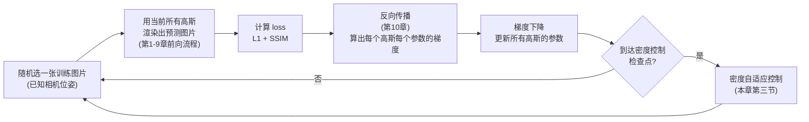
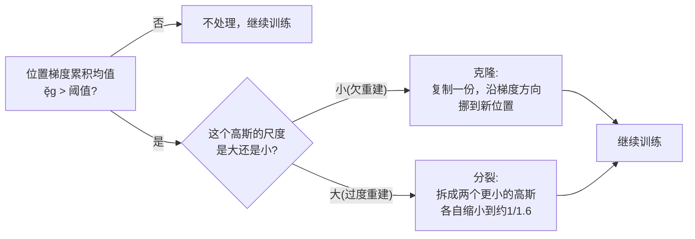

# 第 11 章：训练循环与密度自适应控制

> 系列入口：[3D 高斯溅射从零精通](./index)

## 前情提要

第 10 章讲完了梯度怎么从 loss 一路反向传播回每个高斯的位置、形状、颜色、不透明度。本章要把梯度的使用方式讲完整——一次训练迭代具体做哪几件事、loss 到底怎么构成、以及单靠梯度下降调整现有高斯的参数为什么不够，还需要一套额外的机制来增删高斯的数量。

## 本章要解决的问题

[007a 第四节](/前置知识/007a_前置知识_3D_Gaussian_Splatting三维场景重建#四-训练-怎么从照片-猜-出这几十万个椭球) 已经给出了训练循环的整体框架图和密度自适应控制的直觉解释（分裂/克隆增加密度、删除没用的高斯）。本章要把这个框架图里每一步具体展开成可执行的判断条件和数值：loss 具体由哪两部分构成、什么时候一个高斯会被判定为"该分裂"、什么时候会被判定为"该克隆"、什么时候会被直接删除，以及这些判断用到的具体阈值。

## 一、loss 的完整构成

### 1.1 为什么只用像素颜色误差不够

第 10 章为了让梯度公式简单，用了 $(C-C_{gt})^2$ 这种逐像素独立比较的误差。这种误差（L1 或 L2 距离）只关心"每个像素自己的颜色对不对"，不关心"整张图片的结构对不对"——比如把整张图片轻微地模糊一下，逐像素的颜色误差可能不大，但人眼会明显觉得"这张图和真实照片看起来不一样，缺少细节"。

3DGS 实际使用的 loss 是两部分的加权组合：

$$
L = (1-\lambda)L_1 + \lambda\, L_{\text{SSIM}}
$$

**这个公式在做什么**：把"逐像素颜色对不对"（$L_1$）和"整体结构像不像"（$L_{\text{SSIM}}$）两种不同的误差度量加权混合成一个最终的训练目标,官方实现里 $\lambda=0.2$。

::: details 📐 公式详解（点击展开）

| 子表达式 | 它是谁 | 它在干嘛 |
|---|---|---|
| $L_1=\vert C-C_{gt}\vert$ 对所有像素取平均 | 逐像素颜色误差 | 直接、简单地衡量每个像素的颜色偏差有多大，不管这个偏差在图片里造成的视觉效果 |
| $L_{\text{SSIM}}$ | 结构相似性（Structural Similarity Index, SSIM，一种衡量两张图片在局部窗口内的亮度、对比度、结构是否相似的指标，取值范围 $[-1,1]$，越接近 1 越相似） | 用局部窗口内的统计量（均值、方差、协方差）比较预测图和真实图,能捕捉到单纯颜色误差量化不出的结构性差异（比如边缘是否清晰、纹理是否保留） |
| $\lambda=0.2$ | 混合权重 | 决定两种误差各占多大比重，这是一个经验值，不是理论推导出来的最优值 |

**用人话读**：训练目标既要"每个像素颜色算对"，也要"整张图片看起来结构对"——单纯优化颜色误差会让模型倾向于产出"平均意义上颜色对但细节模糊"的结果，加入结构相似性这一项能促使模型保留更清晰的边缘和纹理。

**为什么权重给 SSIM 只有 0.2 而不是更高**：$L_1$ 提供的梯度信号更直接、更稠密（每个像素都有自己独立的误差信号，梯度方向明确），SSIM 提供的是局部窗口尺度的结构信号，梯度更"软"、更依赖周围像素的联合统计——用较小的权重让 SSIM 起"精细化调整"的辅助作用，避免它的软梯度信号主导整个训练、导致收敛变慢。这是一个在实践中调出来的平衡点。
:::

### 1.2 SSIM 本身不是本系列的重点

结构相似性指标是图像质量评估领域的一个独立概念，不是 3DGS 独创的——它的具体公式（涉及局部窗口内的均值、方差、协方差三项的组合）本身值得单独理解，但和 3DGS 特有的高斯渲染机制没有直接关系，属于"用到但不是本文重点"的外部工具。这里只需要知道它衡量的是"结构相似度"而不是"逐点颜色差"这个功能定位，具体公式推导超出本系列范围。

## 二、一次训练迭代的完整步骤

> 这张图是第 10 章末尾"梯度算出来之后怎么用"这个问题的完整答案：绝大多数迭代只走 A→B→C→D→E 这条主循环（普通的梯度下降），只有到达特定的检查点（通常每隔几百次迭代）才会额外触发密度控制这一步。

### 2.1 学习率调度：不同参数用不同的学习率

3DGS 的一个工程细节是：位置、缩放、旋转、颜色（球谐系数）、不透明度这几组参数**各自使用不同的学习率**，而不是统一用一个学习率——因为这几组参数的数值范围和对渲染结果的敏感程度差异很大（比如位置的单位是场景的物理尺度，不透明度是 $[0,1]$ 范围的比例，两者用同一个学习率没有意义）。此外，位置的学习率还会随训练进度**指数衰减**（从一个较大的初始值逐渐降低），这是因为训练早期需要位置能大幅移动来快速找到大致正确的位置，训练后期则需要小幅精细调整,避免已经调整到位的位置因为学习率过大而抖动。

### 2.2 球谐阶数的渐进解锁

第 7 章第 3.3 节提到过，训练不会一开始就优化全部 3 阶（48 个）球谐系数——而是先只训练 0 阶（3 个,等价于固定 RGB），训练到一定迭代数之后再解锁 1 阶，再往后解锁 2 阶、3 阶。这个渐进策略的直觉是：如果一开始就让所有阶数的球谐系数同时自由训练，高阶系数（负责视角相关的细微颜色变化）可能会在基础颜色分布还没学好之前就开始"乱调"，反而干扰基础颜色的收敛。先固定住只学 0 阶，相当于先让模型学会"这个高斯大致是什么颜色"这个更重要、更基础的问题,再逐步允许它学习更精细的视角相关效果。

## 三、密度自适应控制：为什么梯度下降不够

### 3.1 问题：初始高斯数量不足以覆盖所有细节

训练开始时，高斯的初始位置来自 SfM（结构光恢复运动）给出的稀疏点云——这个点云通常只有几千到几万个点，远少于最终需要的几十万个高斯。单靠梯度下降调整这些初始高斯的位置和形状，没办法"生出"新的高斯来填补细节不足的区域——梯度下降只能移动、拉伸、压缩已经存在的高斯，不能改变高斯的总数。因此需要一套独立于梯度下降的机制,专门负责"在需要更多细节的地方增加高斯,在没用的地方删除高斯"，这就是密度自适应控制（Adaptive Density Control）。

### 3.2 判断依据：位置梯度的累积大小

3DGS 用一个具体的信号判断"哪些高斯需要被处理"：**位置梯度的范数（长度）在多次迭代中的累积平均值**。直觉是：如果一个高斯的位置梯度持续较大，说明它"想移动但还没移动到位"——这通常意味着这个区域的场景细节还没被现有的高斯精确覆盖,模型正在持续尝试用现有的高斯去弥补这个不足,但可能已经存在的这一个高斯天生不够（形状或数量上）,需要引入新的高斯来分担。

$$
\bar{g} = \frac{1}{N}\sum_{t=1}^{N}\left\|\frac{\partial L_t}{\partial\boldsymbol{\mu}}\right\|
$$

**这个公式在做什么**：把最近 $N$ 次迭代里，这个高斯的位置梯度长度取平均——用一个累积统计量代替单次迭代的梯度（单次梯度可能因为某一张训练图片的偶然因素而偏大或偏小，累积平均更能反映"持续性"的信号）。

::: details 📐 公式详解（点击展开）

| 子表达式 | 它是谁 | 它在干嘛 |
|---|---|---|
| $\partial L_t/\partial\boldsymbol{\mu}$ | 第 $t$ 次迭代算出的位置梯度 | 第 10 章推导出的三维向量 |
| $\|\cdot\|$ | 梯度向量的长度（范数） | 只关心梯度有多大，不关心具体方向 |
| $\bar{g}$ | 多次迭代的累积平均 | 官方实现每隔 100 次迭代检查一次，用这期间的累积平均值做判断 |

**用人话读**：如果一个高斯在最近这一批迭代里，"想移动"的信号持续偏大且没有减弱的趋势，说明它所在的区域可能需要更多高斯来分担细节，而不是继续指望这一个高斯自己调整到位。

**为什么用累积平均而不是单次梯度**：单次迭代只用了一张随机抽取的训练图片,这一张图片可能因为特定角度或光照条件导致某个高斯的梯度偶然偏大,不代表持续性的问题。累积多次迭代的平均值能过滤掉这种偶然噪声,只保留"持续存在"的信号。
:::

### 3.3 分裂还是克隆：取决于高斯自身的尺度

当 $\bar{g}$ 超过一个阈值（官方实现取 0.0002，这个数值和场景的具体尺度归一化方式有关，不同实现可能需要重新标定），说明这个高斯所在的区域需要增加密度。具体增加的方式分两种，取决于这个高斯自己当前的尺度（协方差对应的大小）：

| 情形 | 判断依据 | 处理方式 | 直觉 |
|---|---|---|---|
| **克隆**（Clone） | 高斯的尺度小于场景尺度阈值 | 复制一份完全相同的高斯，新的一份沿梯度方向挪一点位置 | 这个高斯本身已经很小,说明是"欠重建"（under-reconstruction）——需要在梯度指向的方向补充更多细节,而不是让这一个高斯变得更大 |
| **分裂**（Split） | 高斯的尺度大于场景尺度阈值 | 把这一个大高斯拆成两个更小的高斯,各自的尺度是原来的一个固定比例(官方取 1.6 分之一)，位置在原高斯的范围内按其协方差分布重新采样 | 这个高斯已经很大，说明是"过度重建"（over-reconstruction）——一个大椭球在努力覆盖一片本该有更多细节层次的区域，把它拆成两个更小的高斯能让每个新高斯专注于更小的一块区域 |

> 这张图把第 3.2、3.3 节的判断逻辑串起来——两条分支的共同前提都是"位置梯度持续偏大",区别只在于用克隆还是分裂来响应,取决于当前高斯本身是太小（该补充）还是太大（该拆分）。

### 3.4 删除：不透明度太低的高斯没有存在价值

另一个独立的判断标准是不透明度：如果一个高斯的不透明度 $\alpha_0$ 训练后趋近于 0（官方实现的阈值是 0.005），说明这个高斯对最终渲染几乎没有可见贡献——不管它的位置和形状是什么,反正它几乎是"透明的",可以直接删除,不会对渲染结果产生可观察的影响。删除操作直接减少了后续训练和渲染需要处理的高斯总数,是控制计算量的重要手段（否则整个训练过程中高斯数量会因为不断的克隆和分裂持续增长,如果没有删除机制来平衡,存储和计算开销会失控）。

此外，官方实现还会周期性地把所有高斯的不透明度重置到一个较低的值（这个操作叫 opacity reset），强制让模型重新评估每个高斯是否真的有必要保持较高的不透明度——这个机制能帮助清除一些"占着位置但贡献有限"的高斯,给后续的克隆和分裂腾出空间。

## 四、把密度控制和反向传播联系起来

密度控制的判断条件（位置梯度的累积均值、不透明度的数值）本身都是第 10 章反向传播算出的结果的**统计量**，不是重新引入了一套独立的数学体系——这是理解这套机制的关键：**梯度不仅用来更新参数的数值，还被用作"这个高斯是否需要被增删"的诊断信号**。一个高斯的位置梯度持续很大，说明梯度下降"想改变它但改变得不够"，这正是"这个位置的细节不足"最直接的量化证据。

## 总结

| 机制 | 判断依据 | 处理动作 |
|---|---|---|
| loss 构成 | 逐像素 $L_1$ + 结构相似性 $L_{\text{SSIM}}$，加权 $\lambda=0.2$ | 反向传播的起点 |
| 学习率调度 | 不同参数组独立学习率，位置学习率指数衰减 | 训练早期粗调、后期精调 |
| 球谐阶数解锁 | 按训练进度逐步从 0 阶提升到 3 阶 | 避免高阶系数在基础颜色未稳定时干扰训练 |
| 克隆/分裂 | 位置梯度累积均值超过阈值，再看高斯尺度大小 | 小的克隆补充细节，大的分裂拆分成更小的单元 |
| 删除 | 不透明度低于阈值 | 直接移除，控制总数增长 |

## 下一章预告

前 11 章讲完了 3DGS 的全部数学原理——从单个高斯的定义，到相机投影，到渲染合成，到训练与密度控制。第 12 章要把这些公式变成真正能跑的代码：只用 numpy（不依赖任何深度学习框架的自动求导），从零手写一个完整的前向渲染器，把本系列每一章的公式对应到具体的代码行。

## 延伸阅读

- [3D Gaussian Splatting：用一堆椭球把真实场景搬进电脑](/前置知识/007a_前置知识_3D_Gaussian_Splatting三维场景重建#四-训练-怎么从照片-猜-出这几十万个椭球) — 训练循环的第一次概览，本章是对密度控制部分的完整数值展开
- [数值优化基础：梯度下降与牛顿法](/前置知识/003c_前置知识_数值优化基础_梯度下降与牛顿法) — 梯度下降本身的基础原理
