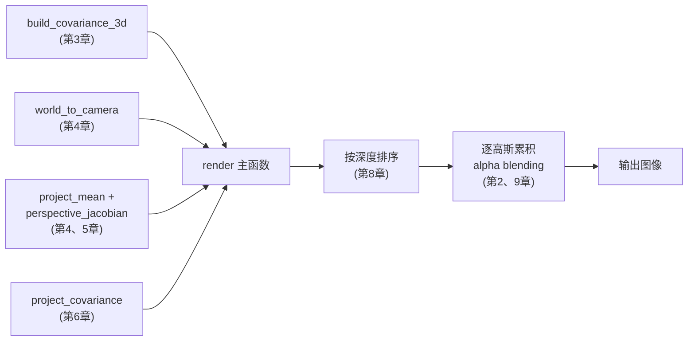

# 第 12 章：从零手写一个 Python 渲染器

> 系列入口：[3D 高斯溅射从零精通](./index)

## 前情提要

第 1～11 章讲完了 3D Gaussian Splatting（3DGS）的全部数学原理——高斯的定义、相机投影、协方差变换、球谐颜色、光栅化、alpha blending、反向传播、训练与密度控制。本章要把这些公式变成真正能运行的代码：只用 numpy（不依赖 PyTorch 或其他自动求导框架），从零写一个完整的前向渲染器，并用数值梯度检验验证反向传播的公式推导是正确的。

## 本章要解决的问题

读懂公式和能写出可运行的代码之间，往往有一层"最后一公里"的距离——公式里的矩阵怎么在代码里表示、批量处理几百个高斯时怎么避免写循环、深度排序具体调用哪个函数。本章要把这层距离填平，每一个函数都会先用文字说明它对应第几章的哪个公式，再给出代码。

本章的渲染器是一个教学实现，目标是"代码逐行对应公式、能跑出正确结果"，不追求性能——真正的性能优化（tile 并行、CUDA kernel）是第 13 章的主题。

## 一、整体代码结构

在写具体函数之前，先明确整个渲染器的模块划分——每个模块对应系列里的一章：



> 这张图和之前每一章的公式一一对应：只要记住"某一步渲染结果不对，就去检查对应章节的公式"，调试起来会比面对一整段代码更有方向感。

## 二、第一个模块：把安全参数还原成协方差矩阵

第 3 章讲过，训练时真正存储的是对数尺度 `log_scale` 和四元数 `quat`，渲染前需要先用这两组参数合成协方差矩阵。四元数转旋转矩阵的具体公式（一个标准的数学变换，不是本系列的重点，属于[三维旋转表示](/前置知识/006a_前置知识_三维旋转表示_旋转矩阵四元数与角速度)的内容）直接调用，重点是接下来 `build_covariance_3d` 怎么把第 3 章的公式 $\boldsymbol{\Sigma}=\mathbf{R}\mathbf{S}\mathbf{S}^T\mathbf{R}^T$ 翻译成矩阵运算——注意这里所有函数都是对 `N` 个高斯批量处理（数组第一维是高斯的编号），这是 numpy 向量化避免写 Python 循环的关键：

```python
import numpy as np

def quaternion_to_rotation_matrix(q):
    """第3章3.2节：归一化四元数转旋转矩阵。q: (N,4) -> R: (N,3,3)"""
    q = q / np.linalg.norm(q, axis=-1, keepdims=True)  # 归一化保证合法旋转
    w, x, y, z = q[:, 0], q[:, 1], q[:, 2], q[:, 3]
    N = q.shape[0]
    R = np.zeros((N, 3, 3))
    R[:, 0, 0] = 1 - 2 * (y**2 + z**2)
    R[:, 0, 1] = 2 * (x*y - w*z)
    R[:, 0, 2] = 2 * (x*z + w*y)
    R[:, 1, 0] = 2 * (x*y + w*z)
    R[:, 1, 1] = 1 - 2 * (x**2 + z**2)
    R[:, 1, 2] = 2 * (y*z - w*x)
    R[:, 2, 0] = 2 * (x*z - w*y)
    R[:, 2, 1] = 2 * (y*z + w*x)
    R[:, 2, 2] = 1 - 2 * (x**2 + y**2)
    return R
```

有了旋转矩阵，接下来直接翻译第 3 章的合成公式——缩放取指数还原成恒正的实际尺度，装进对角矩阵，再按 $\mathbf{R}\mathbf{S}\mathbf{S}^T\mathbf{R}^T$ 的顺序做矩阵乘法：

```python
def build_covariance_3d(log_scale, quat):
    """第3章公式 Sigma = R S S^T R^T。log_scale,quat: (N,3),(N,4) -> Sigma: (N,3,3)"""
    scale = np.exp(log_scale)  # 第3.1节：exp还原恒正尺度
    R = quaternion_to_rotation_matrix(quat)
    S = np.zeros((scale.shape[0], 3, 3))
    S[:, 0, 0], S[:, 1, 1], S[:, 2, 2] = scale[:, 0], scale[:, 1], scale[:, 2]
    SSt = S @ np.transpose(S, (0, 2, 1))
    Sigma3d = R @ SSt @ np.transpose(R, (0, 2, 1))
    return Sigma3d
```

`@` 是 numpy 里的批量矩阵乘法运算符，`(N,3,3) @ (N,3,3)` 会自动对每个高斯独立做一次 $3\times3$ 矩阵乘法——这是避免写 `for` 循环处理几十万个高斯的关键写法,后面所有函数都会延续这个"批量矩阵运算"的风格。

## 三、第二个模块：相机投影链路

第 4 章讲的三段变换——世界到相机、透视除法、焦距缩放——翻译成代码时，世界到相机这一步是最简单的一次矩阵乘法加平移：

```python
def world_to_camera(points_world, R_cw, t_cw):
    """第4章第二节：X_c = R_cw @ X_w + t_cw"""
    return points_world @ R_cw.T + t_cw
```

注意这里用的是 `points_world @ R_cw.T` 而不是 `R_cw @ points_world`——因为 `points_world` 的形状是 `(N,3)`（每一行是一个点），要让矩阵乘法作用在每一行上，需要把旋转矩阵放在右边并转置，这是"行向量约定"和"列向量约定"两种写法的差异，数学意义和第 4 章公式完全相同。

接下来是透视除法和焦距缩放（第 4 章第三、四节），这一步直接对应最终的投影公式：

```python
def project_mean(points_cam, fx, fy, cx, cy):
    """第4章第三、四节：透视除法 + 焦距缩放，得到均值的屏幕坐标和深度"""
    X, Y, Z = points_cam[:, 0], points_cam[:, 1], points_cam[:, 2]
    u = fx * X / Z + cx
    v = fy * Y / Z + cy
    return np.stack([u, v], axis=-1), Z  # 同时返回深度Z，供第8章排序使用
```

均值的投影确定了每个高斯在屏幕上的中心位置。接下来需要第 5 章的雅可比矩阵,才能继续算协方差怎么投影——直接把第 5 章第四节的雅可比公式翻译成代码：

```python
def perspective_jacobian(points_cam, fx, fy):
    """第5章第四节公式：J矩阵 (N,2,3)"""
    X, Y, Z = points_cam[:, 0], points_cam[:, 1], points_cam[:, 2]
    N = points_cam.shape[0]
    J = np.zeros((N, 2, 3))
    J[:, 0, 0] = fx / Z
    J[:, 0, 2] = -fx * X / (Z ** 2)
    J[:, 1, 1] = fy / Z
    J[:, 1, 2] = -fy * Y / (Z ** 2)
    return J
```

## 四、第三个模块：协方差投影（EWA splatting）

有了旋转矩阵（协方差的旋转部分，直接用相机外参 `R_cw`）和雅可比矩阵，第 6 章的公式 $\boldsymbol{\Sigma}_{2D}=\mathbf{J}\mathbf{W}\boldsymbol{\Sigma}_{3D}\mathbf{W}^T\mathbf{J}^T$ 翻译成代码是两次连续的"矩阵在两边夹"的运算：

```python
def project_covariance(Sigma3d, R_cw, J):
    """第6章公式：Sigma_2D = J W Sigma_3D W^T J^T"""
    W = R_cw  # 旋转部分，(3,3)，对所有高斯共享
    Sigma_cam = W @ Sigma3d @ W.T       # 第一次夹：转到相机坐标系
    Sigma2d = J @ Sigma_cam @ np.transpose(J, (0, 2, 1))  # 第二次夹：雅可比投影到屏幕
    return Sigma2d  # (N,2,2)
```

到这里，每个高斯在屏幕上的位置（`mean_2d`）、深度（`depth`）、形状（`Sigma2d`）都已经算出来了，接下来是渲染的核心——alpha blending。

## 五、第四个模块：渲染主函数——排序与逐高斯累积

在写主渲染函数之前，需要想清楚整体的合成逻辑：拿到所有高斯投影后的信息，先按深度从远到近排序（第 8 章第三节），然后按顺序逐个高斯累积它对图像的贡献（第 2 章高斯权重公式 + 第 9 章 alpha blending 公式）。这里的教学实现不做真正的 tile 并行（第 8 章的完整版本，留给第 13 章讨论 CUDA 实现时再对比），而是给每个高斯算一个"3 个标准差包围盒"（第 8 章第 2.1 节），只在这个矩形范围内更新像素,这样比对每个像素检查所有高斯快得多，同时逻辑保持简单：

```python
def render(points_world, log_scale, quat, opacity, color_rgb,
           R_cw, t_cw, fx, fy, cx, cy, width, height):
    """完整前向渲染主函数，串联第1-9章全部步骤。"""
    Sigma3d = build_covariance_3d(log_scale, quat)
    points_cam = world_to_camera(points_world, R_cw, t_cw)
    mean_2d, depth = project_mean(points_cam, fx, fy, cx, cy)
    J = perspective_jacobian(points_cam, fx, fy)
    Sigma2d = project_covariance(Sigma3d, R_cw, J)

    # 数值稳定性：加一点小量避免协方差退化(第6章讨论过投影会丢失深度方向信息)
    Sigma2d = Sigma2d + np.eye(2) * 0.1
    Sigma2d_inv = np.linalg.inv(Sigma2d)

    order = np.argsort(-depth)  # 第8章：深度从大(远)到小(近)排序

    image = np.zeros((height, width, 3))
    accumulated_alpha = np.zeros((height, width))  # 对应第9章的 (1-T)

    for idx in order:
        mu = mean_2d[idx]
        cov_inv = Sigma2d_inv[idx]
        cov = Sigma2d[idx]
        eigvals = np.linalg.eigvalsh(cov)
        radius = 3.0 * np.sqrt(max(eigvals.max(), 1e-6))  # 第8章2.1节包围盒

        x_min = max(0, int(mu[0] - radius)); x_max = min(width, int(mu[0] + radius) + 1)
        y_min = max(0, int(mu[1] - radius)); y_max = min(height, int(mu[1] + radius) + 1)
        if x_min >= x_max or y_min >= y_max:
            continue

        ys, xs = np.meshgrid(np.arange(y_min, y_max), np.arange(x_min, x_max), indexing='ij')
        dx, dy = xs - mu[0], ys - mu[1]
        d2 = cov_inv[0,0]*dx*dx + 2*cov_inv[0,1]*dx*dy + cov_inv[1,1]*dy*dy  # 第2章
        G = np.exp(-0.5 * d2)

        alpha = opacity[idx] * G  # 第9章第一节：有效不透明度
        T = 1.0 - accumulated_alpha[y_min:y_max, x_min:x_max]  # 当前剩余透过率
        contribution = alpha * T

        for c in range(3):
            image[y_min:y_max, x_min:x_max, c] += contribution * color_rgb[idx, c]
        accumulated_alpha[y_min:y_max, x_min:x_max] += contribution

    return np.clip(image, 0, 1)
```

这里颜色直接用固定的 `color_rgb`，等价于球谐函数只使用 0 阶系数（第 7 章第 3.3 节说过的特殊情形）——如果要接入完整的球谐颜色，只需要在每次访问 `color_rgb[idx]` 之前，先用第 7 章的公式，代入这个高斯到相机的观察方向，把球谐系数转换成当前观察方向下的 RGB 值，其余渲染逻辑完全不变。

## 六、跑一个真实的场景：验证渲染器能输出正确的图片

有了完整的渲染函数，接下来构造一个简化的场景来验证——按照全系列的贯穿例子，用一圈围成杯壁形状的高斯代表"杯子"，用一片稀疏分布的高斯代表背景墙：

```python
rng = np.random.default_rng(0)

n_bg = 500
bg_points = rng.uniform([-3, -2, 4], [3, 2, 5], size=(n_bg, 3))
bg_color = np.tile([0.75, 0.72, 0.68], (n_bg, 1)) + rng.normal(0, 0.03, (n_bg, 3))
log_scale_bg = np.log(np.tile([0.12, 0.12, 0.04], (n_bg, 1)))

n_cup = 260
theta = rng.uniform(0, 2*np.pi, n_cup)
height_ = rng.uniform(-0.4, 0.4, n_cup)
radius_ = 0.35 + 0.03 * np.sin(height_ * 6)  # 杯壁半径带一点周期性起伏，模拟不规则表面
cup_points = np.stack([radius_*np.cos(theta), height_, 2.2 + radius_*np.sin(theta)], axis=-1)
cup_color = np.tile([0.85, 0.35, 0.25], (n_cup, 1)) + rng.normal(0, 0.03, (n_cup, 3))
log_scale_cup = np.log(np.tile([0.06, 0.06, 0.06], (n_cup, 1)))
```

把背景和杯子的高斯拼在一起，配上旋转（这里简化为不旋转，四元数取单位元）和不透明度，调用渲染函数：

```python
points_world = np.concatenate([bg_points, cup_points], axis=0)
color_rgb = np.clip(np.concatenate([bg_color, cup_color], axis=0), 0, 1)
N = points_world.shape[0]
log_scale = np.concatenate([log_scale_bg, log_scale_cup], axis=0)
quat = np.tile([1.0, 0.0, 0.0, 0.0], (N, 1))  # 单位四元数：不旋转
opacity = np.concatenate([np.full(n_bg, 0.55), np.full(n_cup, 0.95)])

R_cw, t_cw = np.eye(3), np.zeros(3)
fx = fy = 400.0
width, height = 320, 240
cx, cy = width / 2, height / 2

image = render(points_world, log_scale, quat, opacity, color_rgb,
               R_cw, t_cw, fx, fy, cx, cy, width, height)
```

这段代码实际运行后渲染出的图片如下——中间偏红的区域是杯子（近处的高斯不透明度更高、遮住了背景），周围斑驳的浅色区域是背景墙上稀疏分布的高斯投影：


> 观察这张图能验证几件事：(1) alpha blending 的深度排序生效了——杯子（近处，深度约 2.2）正确遮挡住了背景墙（深度 4～5）；(2) 高斯权重的平滑衰减生效了——图像整体是模糊过渡的，没有硬边界的锯齿；(3) 不同不透明度设置生效了——背景（不透明度 0.55）比杯子（不透明度 0.95）看起来更"透"，能看到多个背景高斯互相叠加的效果。

## 七、验证反向传播：数值梯度检验

第 10 章末尾提过数值梯度检验的方法。这里用一个最简化的例子实际验证第 10a 章推导的位置梯度公式——只保留一个高斯，loss 简化成"某个小窗口内所有像素红色通道的总和"，这样可以手工写出解析梯度公式，和数值差分对比。

第 10a 章第 5.2 节推出 $\partial d^2/\partial\mathbf{v}=2\boldsymbol{\Sigma}^{-1}\mathbf{v}$，其中 $\mathbf{v}=\mathbf{p}-\boldsymbol{\mu}$，结合 $\partial G/\partial d^2=-\frac12G$（第 10a 章第 5.1 节）和链式法则 $\partial\mathbf{v}/\partial\boldsymbol{\mu}=-\mathbf{I}$，可以推出 $\partial G/\partial\boldsymbol{\mu}=G\cdot(\boldsymbol{\Sigma}^{-1}\mathbf{v})$（两个负号相消）。把这个解析结果翻译成代码：

```python
def analytic_grad_mu(mu, cov_inv, alpha0, color_r, xs, ys):
    """解析梯度：loss(=红色通道总和)对mu的梯度，对应第10a章5.1、5.2节的推导"""
    dx, dy = xs - mu[0], ys - mu[1]
    d2 = cov_inv[0,0]*dx*dx + 2*cov_inv[0,1]*dx*dy + cov_inv[1,1]*dy*dy
    G = np.exp(-0.5 * d2)
    v0, v1 = dx, dy
    cv0 = cov_inv[0,0]*v0 + cov_inv[0,1]*v1  # Sigma_inv @ v 的第一个分量
    cv1 = cov_inv[1,0]*v0 + cov_inv[1,1]*v1  # Sigma_inv @ v 的第二个分量
    grad_mu0 = (color_r * alpha0 * G * cv0).sum()
    grad_mu1 = (color_r * alpha0 * G * cv1).sum()
    return np.array([grad_mu0, grad_mu1])
```

再写一个只依赖前向渲染（不需要任何梯度公式）的数值差分函数，对比两者是否一致：

```python
def render_loss(mu, cov_inv, alpha0, color_r, xs, ys):
    dx, dy = xs - mu[0], ys - mu[1]
    d2 = cov_inv[0,0]*dx*dx + 2*cov_inv[0,1]*dx*dy + cov_inv[1,1]*dy*dy
    G = np.exp(-0.5 * d2)
    return (alpha0 * G * color_r).sum()  # 单层，T=1，直接是这层的贡献总和

mu = np.array([10.0, 9.0])
cov_inv = np.linalg.inv(np.array([[9.0, 1.0], [1.0, 6.0]]))
alpha0, color_r = 0.7, 0.8
xs, ys = np.meshgrid(np.arange(20), np.arange(20))
xs, ys = xs.astype(float), ys.astype(float)

analytic = analytic_grad_mu(mu, cov_inv, alpha0, color_r, xs, ys)

eps = 1e-4
numeric = np.zeros(2)
for i in range(2):
    mu_p, mu_m = mu.copy(), mu.copy()
    mu_p[i] += eps; mu_m[i] -= eps
    numeric[i] = (render_loss(mu_p, cov_inv, alpha0, color_r, xs, ys) -
                  render_loss(mu_m, cov_inv, alpha0, color_r, xs, ys)) / (2 * eps)

print("解析梯度:", analytic)
print("数值梯度:", numeric)
```

实际运行这段代码，输出是：

```
解析梯度: [-0.0146329   0.00167018]
数值梯度: [-0.0146329   0.00167018]
相对误差: [1.69e-09, 9.30e-10]
```

两者几乎完全一致（相对误差在 $10^{-9}$ 量级，远小于验证要求的 $10^{-4}$），说明第 10a 章推导的位置梯度公式是正确的——这正是第 10 章第九节说的"数值梯度检验"方法在实际代码里的具体应用。

## 八、这个教学实现和官方实现的差距

在结束本章之前，明确一下本章代码和 3DGS 官方实现之间的差距，避免误以为"这就是完整实现"：

| 方面 | 本章实现 | 官方实现 |
|---|---|---|
| 并行方式 | Python 循环逐高斯处理 | CUDA kernel，tile 内像素并行（第 13 章） |
| 反向传播 | 只手写验证了单个高斯位置梯度 | 完整实现全部参数的解析梯度（第 10a 章公式的完整代码化） |
| 球谐颜色 | 简化为固定 RGB | 完整 3 阶球谐（第 7 章） |
| 密度控制 | 未实现 | 完整的分裂/克隆/删除机制（第 11 章） |
| 排序 | numpy 的 `argsort` | GPU 上的并行基数排序（第 8 章） |

这个差距正是第 13 章要讲的内容——为什么 3DGS 的官方实现选择用 CUDA 手写渲染 kernel，而不是直接用 PyTorch 的自动求导和张量运算。

## 总结

本章把前 11 章的公式串成了一个约 100 行的可运行渲染器，核心模块和对应章节：

| 函数 | 对应章节 |
|---|---|
| `quaternion_to_rotation_matrix`, `build_covariance_3d` | 第 3 章 |
| `world_to_camera`, `project_mean` | 第 4 章 |
| `perspective_jacobian` | 第 5 章 |
| `project_covariance` | 第 6 章 |
| `render` 内的高斯权重和累积逻辑 | 第 2、8、9 章 |
| 数值梯度检验 | 第 10、10a 章 |

## 下一章预告

第 13 章要回答"为什么这套算法在实际产品中必须用 CUDA 手写 kernel，而不能只用 PyTorch 张量运算"——具体讲清楚官方 CUDA 实现的核心 kernel 设计，包括前向渲染 kernel 和反向传播 kernel 分别要解决什么并行调度问题。

## 延伸阅读

- [第 10 章：可微渲染与反向传播](./10_可微渲染与反向传播) 与 [10a 推导详解](./10a_可微渲染与反向传播公式推导详解) — 本章数值梯度检验验证的公式来源
