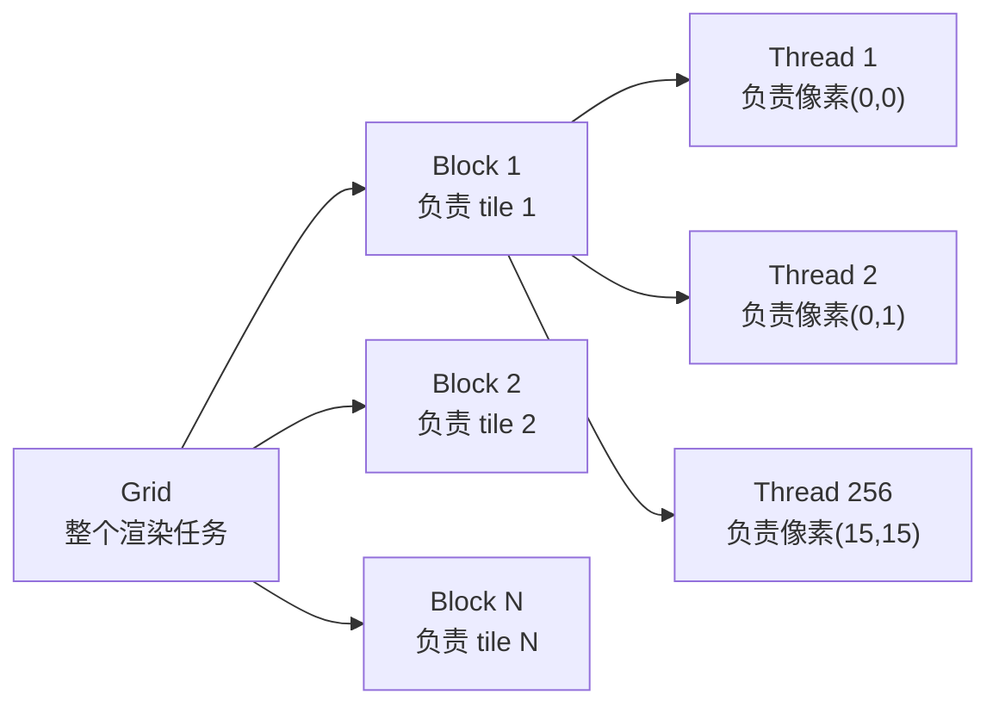
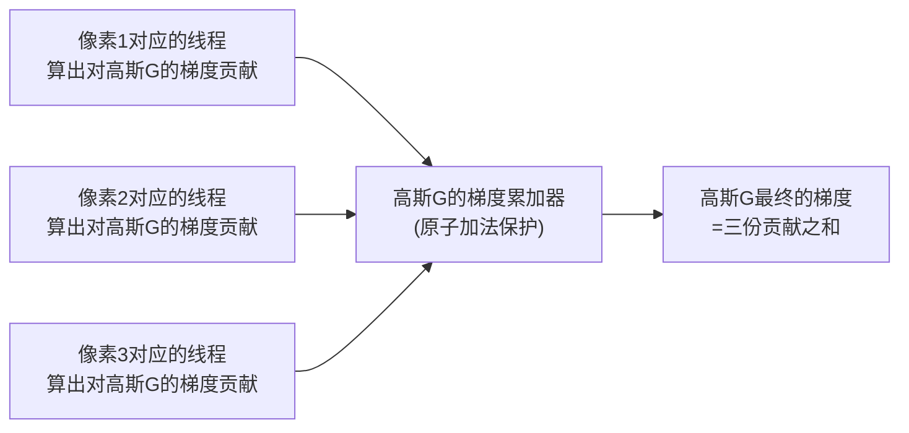

# 第 13 章：性能工程与 CUDA 实现思路

> 系列入口：[3D 高斯溅射从零精通](./index)

## 前情提要

第 12 章用纯 numpy 写了一个能跑的渲染器,但对每个高斯用 Python 循环处理,渲染几百个高斯的一张小图就要花明显可感知的时间——距离 3DGS 论文宣称的"每秒 100+ 帧"还差得很远。本章要讲清楚为什么达到这个速度必须手写 CUDA（Compute Unified Device Architecture，NVIDIA 提出的 GPU 通用计算编程框架）kernel（内核函数，GPU 上实际并行执行的最小代码单元），以及官方实现的核心 kernel 具体是怎么设计的。

## 本章要解决的问题

一个自然的疑问是：为什么不直接用 PyTorch 的张量运算和自动求导，把第 12 章的 numpy 代码翻译成 PyTorch 代码，用 GPU 加速不就行了？本章要说明这条路为什么走不通（或者说走不快），以及 CUDA 手写 kernel 具体在哪些地方做了 PyTorch 张量运算做不到的优化。

## 一、为什么 PyTorch 张量运算不够快

### 1.1 PyTorch 张量运算的假设：稠密、规整

PyTorch（以及类似的深度学习框架）的张量运算针对的场景是"规整的稠密数组"——比如一个 `(N, 3)` 的张量，每一行都要做完全相同的运算，GPU 上可以直接把整个张量铺开、每个线程处理一行,天然并行,没有任何"这一行该不该处理""这一行和另一行有没有关系"这类分支判断。

3DGS 的核心计算不满足这个假设:第 8 章讲过,渲染一个 tile 需要的高斯集合,是这个 tile 特有的、动态确定的一个子集——不同 tile 需要的高斯数量差异很大（有的 tile 可能只有几个高斯,有的可能有几百个）,而且这个"谁需要谁"的关系本身是运行时才能确定的（取决于当前相机位姿下每个高斯投影到哪里）。这是一种**稀疏、不规则**的计算模式,和 PyTorch 张量运算擅长的"规整稠密"模式正好相反。

### 1.2 如果强行用稠密张量表示会发生什么

如果坚持用 PyTorch 张量运算实现,一种直接的做法是:构造一个 `(像素数, 最大高斯数)` 的巨大稠密张量，把每个像素和它理论上可能相关的所有高斯的组合都存下来,再做批量运算。这样做的问题是:

- **内存爆炸**:大部分像素和大部分高斯根本不相关（一个高斯的投影椭圆通常只覆盖几十到几百个像素,不会覆盖全图),但稠密张量必须给"不相关"的组合也分配内存空间——这个张量的绝大部分位置存的都是无意义的 0,严重浪费显存。
- **计算浪费**:即使有办法省内存（比如用稀疏张量表示),对"不相关"的组合做任何计算都是纯粹的浪费——GPU 花了大量算力在处理"这两者根本不重叠"这种平凡结果上。
- **排序操作不是 PyTorch 的强项**:第 8 章讲的"按 tile 编号和深度联合排序"这类操作,虽然 PyTorch 也提供 `sort` 函数,但通用排序算子没有针对"tile-高斯"这种具体的数据结构和访问模式做专门优化，效率不如手写的定制实现。

### 1.3 精确的性能差距来源：稀疏对应关系 vs 稠密张量操作

把这个矛盾总结成一句话：**3DGS 的计算图里，"哪个高斯影响哪个像素"这个对应关系本身是稀疏且动态的，但 PyTorch 的张量运算模型假设计算是稠密且静态的**。CUDA 手写 kernel 的价值正在于：直接针对这种稀疏对应关系设计数据结构和并行调度策略（也就是第 8 章讲的 tile + 排序 + range 这一整套机制），而不是勉强把稀疏问题塞进稠密张量的框架里。

## 二、CUDA 的基本执行模型

### 2.1 Thread、Block、Grid 三层结构

CUDA 编程模型把并行计算组织成三层：

- **Thread**（线程）：最小的执行单元，每个线程执行同一段代码，但处理不同的数据。
- **Block**（线程块）：一组线程绑定在一起，同一个 block 内的线程可以共享一块叫 **shared memory**（共享内存，一种读写速度比全局显存快得多、但容量很小、只在同一个 block 内可见的存储区域）的高速缓存，可以互相同步。
- **Grid**（网格）：多个 block 组成的更大集合，block 之间几乎不能直接通信（除了通过全局显存这种慢速方式）。

> 3DGS 的 kernel 设计里，**一个 block 恰好对应第 8 章讲的一个 tile**，block 内的线程一一对应 tile 内的每个像素（比如 $16\times16$ 的 tile 正好用 256 个线程处理）。这个对应关系不是巧合——正是因为第 8 章的 tile 划分本身就是为了匹配 CUDA 这个"block 内线程共享数据、block 间独立"的执行模型而设计的。

### 2.2 Shared Memory：为什么 tile 内的高斯列表要缓存进去

第 8 章说过，一个 tile 对应一段已经排好序的高斯列表（通过 range 定位查到）。如果 tile 内每个像素（对应一个线程）都独立地从全局显存重新读取这份高斯列表，同一份数据会被重复读取几百次（tile 内有几百个像素）——全局显存的访问速度远慢于 shared memory，这种重复读取会造成显著的带宽浪费。

CUDA kernel 的设计是：block 启动后，先让 block 内的线程合作，把这个 tile 需要的高斯参数（位置、协方差、颜色、不透明度）**一次性**从全局显存搬进 shared memory，之后 block 内每个线程处理自己负责的像素时，都直接读 shared memory——这是把"一份数据被多次使用"的场景下,通过共享缓存避免重复慢速访问的经典优化模式，其它常见的并行计算场景（比如矩阵乘法的 CUDA 实现）也使用同样的技巧。

## 三、前向渲染 kernel 的设计

### 3.1 每个线程要做的事

延续第 12 章 `render` 函数的逻辑，前向 kernel 里每个线程（对应一个像素）要做的事情是：按顺序遍历这个 tile 对应的、已经按深度排好序的高斯列表，对每一个高斯计算它在自己这个像素位置的高斯权重（第 2 章公式），乘上颜色和不透明度累积进自己的输出颜色（第 9 章 alpha blending），直到遍历完列表或者累积透过率已经足够小（第 9 章第五节的提前终止）。

### 3.2 为什么第 12 章的 Python 循环版本慢，而这个 kernel 版本快

关键区别在于**并行的粒度**：第 12 章的 Python 版本是"外层循环遍历高斯，每个高斯更新它覆盖的所有像素"——这是逐高斯串行处理，即使 numpy 对单个高斯内部的像素范围做了向量化，高斯之间仍然是完全串行的。CUDA kernel 反过来："每个像素（线程）独立地遍历它需要处理的高斯列表"——像素之间是完全并行的，同一个 tile 里的几百个像素在物理上真正同时被 GPU 的不同核心处理。

这个"反转循环顺序"正是从教学实现到工程实现的关键转变：教学实现按照"对每个高斯，画它影响的像素"思考（这是自然的编程直觉，第 12 章为了代码简单采用了这个顺序），工程实现按照"对每个像素，读取它需要的高斯"思考（这是为了匹配 GPU 大规模并行像素处理的能力）。两种思路在数学上完全等价（最终 alpha blending 的结果相同），但对并行硬件的利用效率天差地别。

## 四、反向传播 kernel：为什么比前向更复杂

### 4.1 需要重新走一遍 alpha blending，但方向相反

第 10 章讲过，alpha blending 的反向传播（尤其是 $\alpha_i$ 的间接项，涉及"这一层的改变影响后面所有更近层的透过率"）需要知道每一层的累积透过率 $T_i$。前向渲染时，$T_i$ 是按"从远到近"的顺序逐步算出来的；反向传播时，梯度需要按**相反的顺序**（从近到远）重新走一遍这条链路,才能正确地把"这一层的梯度贡献"和"通过 $T$ 影响后面层"的间接效应都算出来。

这意味着反向 kernel 不能简单地"重放"前向 kernel 的逻辑，而是需要：先在前向阶段就保存好每一层的中间结果（每层的 $\alpha_i$、$T_i$、颜色贡献），反向阶段按相反顺序重新遍历，利用这些保存的中间结果计算梯度——这是标准反向传播实践里"前向要缓存中间激活值，反向复用"的具体体现,只是这里的"中间激活值"是第 9 章讲的透过率序列。

### 4.2 梯度累加需要原子操作

前向渲染时，每个像素（线程）独立计算自己的颜色，互不干扰。但反向传播时，情况变了：**一个高斯的梯度，需要从它影响的所有像素上分别累加过来**——同一个高斯可能同时被 tile 内几十甚至上百个像素引用，这些像素对应的线程会同时尝试往这个高斯的梯度累加器上写数据。

如果不做任何保护，多个线程同时写同一块内存会发生**竞态条件**（race condition，多个线程同时读写同一块共享数据、且没有正确同步机制时，最终结果依赖于线程执行的先后顺序，可能产生错误的结果）——比如两个线程都读到当前累加值是 5，各自加上自己的贡献 2 和 3，本该得到 5+2+3=10，但如果两次写入没有互斥保护，可能其中一次写入被另一次覆盖，最终结果错误地停留在 7 或 8。

CUDA 提供**原子操作**（atomic operation，保证一次读-改-写操作作为一个不可分割的整体执行，中途不会被其他线程打断）来解决这个问题——所有线程往同一个高斯的梯度累加器写入时，用原子加法代替普通加法，保证每一次累加都完整生效，不会互相覆盖。这个"多个线程往同一份共享数据累加梯度"的需求，是反向 kernel 比前向 kernel 多出来的一层复杂度，前向渲染里每个像素只写自己独占的输出位置，完全不需要考虑这个问题。

> 三个不同的像素（线程）可能同时都需要往同一个高斯的梯度上累加自己的贡献——这是反向传播特有的"多对一"写入模式，前向渲染里不存在对应的情形（前向渲染的写入是"一对一"，每个像素只写自己的输出颜色）。

## 五、为什么这套设计值得投入工程复杂度

回到第 1 章的主题：3DGS 相比 NeRF 的核心优势就是渲染速度。如果为了实现简单而牺牲了这个优势（比如用张量运算凑合实现），3DGS 相比 NeRF 就失去了大部分吸引力。CUDA 手写 kernel 的工程复杂度（本章讲的 tile-block 对应、shared memory 缓存、原子操作梯度累加）正是为了在保留"显式表示、可微渲染"这些数学优点的同时，把渲染和训练速度真正压到实时水平——这是 3DGS 论文能同时兼顾"质量不输 NeRF"和"速度快两个数量级"这两个目标背后，容易被忽视但同样重要的工程贡献。

## 总结

| 问题 | PyTorch 张量运算的局限 | CUDA kernel 的解法 |
|---|---|---|
| 高斯-像素对应关系稀疏且动态 | 稠密张量表示会浪费大量内存和计算 | tile + 排序 + range，只处理真正相关的组合 |
| 数据重复读取 | 每个像素独立读取，没有缓存机制 | shared memory 缓存整个 tile 需要的高斯数据 |
| 并行粒度选择 | 框架默认按张量维度并行，不贴合问题结构 | block 对应 tile，线程对应像素，直接匹配问题的空间结构 |
| 反向传播的多对一写入 | 自动求导框架内部处理，开发者不可见也难以定制 | 手写原子操作，精确控制梯度累加的正确性 |

## 下一章预告

至此，本系列已经从"单个高斯是什么"一路讲到"官方实现为什么要手写 CUDA"。最后一章要跳出 3DGS 本身，看看它有哪些局限、后续的研究工作分别针对哪个局限提出了改进——3DGS 不是这个方向的终点，而是一个被后续大量工作扩展的起点。

## 延伸阅读

- [3DGUT：任意畸变相机与次级光线的高斯光栅化](/论文综述/136_3DGUT_任意畸变相机的高斯光栅化) — 一个在渲染 kernel 层面对标准 3DGS 光栅化做出改进的工作，下一章会具体提到
