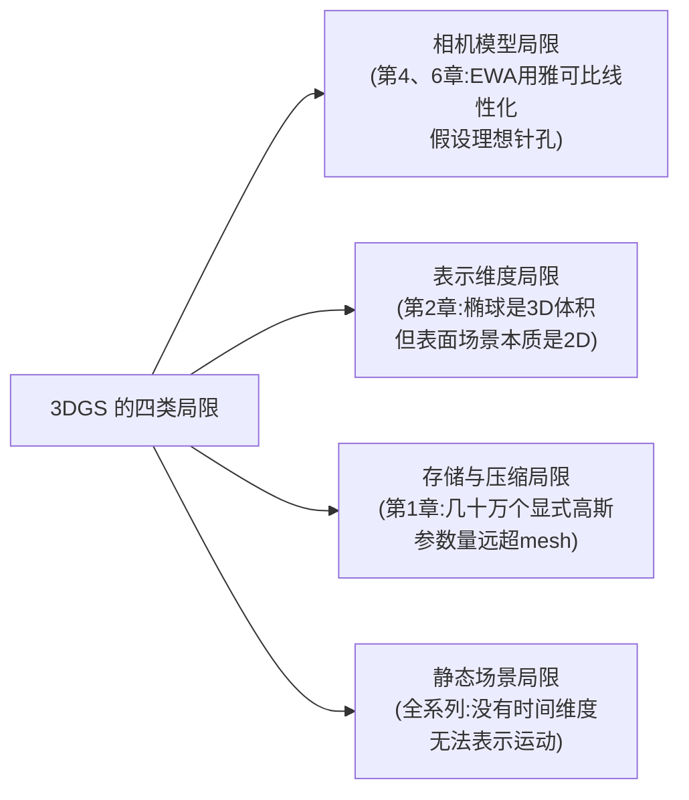

# 第 14 章：局限与前沿变体

> 系列入口：[3D 高斯溅射从零精通](./index)

## 前情提要

前 13 章讲完了 3D Gaussian Splatting（3DGS）的完整数学原理和工程实现——从单个高斯的定义到 CUDA kernel 的设计。本章是系列的收尾：3DGS 不是这个方向的终点，它有若干明确的局限，后续研究工作分别针对不同的局限提出了改进。本章按"3DGS 卡在哪里、后续工作怎么解决"这条逻辑组织，不是简单罗列几个变体的名字。

## 本章要解决的问题

3DGS 从 2023 年提出以来，衍生出了大量后续工作。如果不加分类地列出这些工作的名字，读者只会记住"有一堆变体"，没有建立起"它们分别解决了 3DGS 的哪个具体问题"这种结构性理解。本章先梳理 3DGS 存在哪几类明确的局限，再说明每一类局限对应哪些代表性的改进方向。

## 一、3DGS 的局限地图

把 3DGS 的局限归纳成四类，各自的成因都能追溯到本系列前面某一章讲过的具体设计选择：

> 这四类局限不是同一个维度上的问题——前两类是"数学表示本身不够精确"，第三类是"表示效率不够高"，第四类是"表示的场景范围不够广"。下面四节分别展开，并各自介绍一到两个代表性的改进方向。

## 二、相机模型局限：EWA 线性化在强畸变下失效

### 2.1 局限的来源

第 6 章讲的 EWA splatting，核心是用雅可比矩阵在高斯中心处做**局部线性近似**——第 5 章第二节论证过，这个近似的前提是"每个高斯本身很小，局部曲率变化不大"。这个前提在标准针孔相机、视场角不大的场景下通常成立，但在两种情况下会明显失效：

- **强畸变镜头**（比如鱼眼相机，视场角接近或超过 180 度）：投影函数本身的曲率在视场边缘急剧增大，固定的雅可比矩阵不能代表整个高斯覆盖范围内的真实变形。
- **滚动快门相机**：同一帧图像里不同的行是在不同时刻曝光的，相机在曝光期间如果有运动，图像顶部和底部对应的相机位姿实际上不同——这已经超出了"用一个固定相机位姿做一次投影"这个 3DGS 默认假设的范围。

### 2.2 代表性改进：3DGUT

[3DGUT：任意畸变相机与次级光线的高斯光栅化](/论文综述/136_3DGUT_任意畸变相机的高斯光栅化) 针对这个局限，把"用雅可比线性化相机投影"换成了"用无迹变换（Unscented Transform，一种不需要计算导数、通过一组精心选取的采样点估计非线性变换后分布形状的统计方法）的 7 个 Sigma 点真实地通过相机模型分别投影一次，再从这 7 个投影结果反推出屏幕上的近似形状"。这个替换保留了 3DGS 的 tile 光栅化速度（因为最终仍然只需要一个近似的二维形状用于渲染），但因为不再依赖"中心处求导"这一步，天然能处理任意复杂的相机畸变模型和滚动快门——只要能把一个三维点"喂给"相机模型算出对应的像素坐标，无迹变换就能工作，不要求这个相机模型本身是可以求导的解析函数。

## 三、表示维度局限：用三维椭球表示本质是二维的表面

### 3.1 局限的来源

第 2 章讲的高斯是一个真正的三维体积对象（三个方向都有独立的宽度）。但绝大多数真实场景的表面本质上是**二维**的——桌面、墙面、杯子表面都是薄薄的一层，理想情况下应该用一个二维的"面元"表示，而不是一个有厚度的三维椭球。3DGS 训练出的高斯通常会自动收敛成"某个方向特别薄"的扁平椭球（第 2 章讨论"表面贴片"形状时提到过），但协方差矩阵本身仍然保留着三个自由度，其中一个（法线方向的宽度）本质上是多余的、只是被训练push到接近于零。

这个"用三维参数表示本质二维的对象"会带来两个具体问题：法线方向的信息（对精确计算表面法线、做几何相关的下游任务如网格提取很重要）没有被显式建模，只能通过椭球最短轴间接近似；训练时这个多余的自由度也会带来一定的优化难度（协方差矩阵要同时兼顾"贴合表面"和"体积渲染的数值稳定性"两个有一定张力的目标）。

### 3.2 代表性改进方向：2DGS

2D Gaussian Splatting（2DGS）把每个基本单元从三维椭球直接改成二维椭圆盘（在三维空间中有明确的法线方向，但沿法线方向的厚度被定义为零，而不是训练出来的一个很小的数）。这个改动让每个基本单元天然携带一个精确的表面法线（就是椭圆盘所在平面的法线），更适合需要精确几何信息的下游任务（比如从重建结果提取三角网格）。代价是二维椭圆盘的光栅化和体积渲染公式需要相应调整，不能直接复用第 6 章讲的三维椭球投影公式。

## 四、存储与压缩局限：几十万个高斯的参数量

### 4.1 局限的来源

第 1 章列出过一个高斯的参数清单：位置（3）+ 协方差相关的旋转缩放（3+4）+ 球谐系数（默认 48）+ 不透明度（1），加起来约 59 个数字。一个中等复杂度的场景通常需要几十万个高斯,总参数量轻松超过 1 亿个数字,对应几百 MB 到几 GB 的存储空间——这远超传统 mesh 模型的存储开销,在需要传输、部署到移动端或者存储大量场景的应用场景下（比如第 1 章提到的 real2sim 工作流,需要批量存储大量场景资产）,这个存储开销是一个实际的工程瓶颈。

### 4.2 代表性改进方向：向量量化与结构化压缩

比较有代表性的思路是**向量量化**（把连续取值的参数聚类成有限个"码本"条目,每个高斯只需要存一个索引号,而不是完整的浮点数）应用在球谐系数（占参数量的大头）上,以及利用高斯之间的空间冗余(相邻高斯的参数往往很接近)做结构化压缩（比如 Scaffold-GS 一类工作,先训练一组稀疏的"锚点",每个锚点周围的高斯参数从锚点的特征解码出来,而不是每个高斯独立存储全部参数）。这类方法的目标是保留 3DGS 的渲染质量和速度优势,同时把存储开销压缩到能够实际部署的量级。

## 五、静态场景局限：无法表示随时间变化的场景

### 5.1 局限的来源

本系列全部内容都在讨论一个**静态**场景——3DGS 假设场景在训练用的所有照片拍摄期间没有发生任何变化。但真实世界的很多应用场景本质是动态的：一段包含人物运动的视频、一个机器人操作过程的记录，都涉及场景随时间变化。标准 3DGS 的椭球参数不包含任何"时间"维度,没有办法表示"这个高斯在第 5 秒和第 10 秒分别在哪里"这种信息。

### 5.2 代表性改进方向：4D 高斯与形变场

给 3DGS 增加时间维度的常见思路有两种：一种是显式地给每个高斯的位置、旋转等参数增加一个随时间变化的**形变场**（一个额外的小型网络,输入时间戳,输出这个高斯参数相对静止基准的偏移量）；另一种是直接把高斯从三维扩展到**四维**（额外加一个时间维度的协方差分量,让"高斯在时间上的扩散范围"也成为可学习和可渲染的一部分）。这两种思路各有取舍——形变场更容易和现有的静态 3DGS 训练流程兼容,四维高斯在表达复杂非刚性运动时可能更灵活,但训练和渲染的复杂度也相应更高。

## 六、总结：一张局限与改进方向的全景表

| 局限类别 | 根源（对应本系列章节） | 具体问题 | 代表性改进方向 |
|---|---|---|---|
| 相机模型 | 第 6 章 EWA 的雅可比线性化 | 强畸变镜头、滚动快门下投影不准 | 3DGUT（无迹变换替代线性化） |
| 表示维度 | 第 2 章椭球是三维体积 | 表面场景本质二维，法线信息不显式 | 2DGS（椭圆盘替代椭球） |
| 存储压缩 | 第 1 章参数清单，规模效应 | 几十万高斯参数量远超传统 mesh | 向量量化、Scaffold-GS 类结构化压缩 |
| 动态场景 | 全系列的静态假设 | 无法表示随时间变化的场景 | 形变场、4D 高斯 |

这张表不是 3DGS 生态的全部——这个方向的研究进展很快，几乎每个月都有新的变体提出。但四类局限的划分逻辑（相机模型精度、表示维度合理性、存储效率、时间维度）是相对稳定的分类框架，遇到新的 3DGS 变体时，可以先问"它主要在解决这四类里的哪一类问题"，比记住具体的方法名字更有助于建立长期有效的理解框架。

## 系列总结

回顾整个系列的路线：第 1 章讲清楚了为什么需要显式的三维表示；第 2、3 章讲透了单个高斯的定义和安全参数化；第 4、5、6 章讲清楚了三维怎么变成屏幕上的二维椭圆；第 7 章补上了视角相关的颜色表示；第 8、9 章讲清楚了怎么高效合成成一张图片；第 10、10a 章讲透了梯度怎么反向传播回每个参数；第 11 章讲清楚了训练循环和密度自适应控制的完整机制；第 12 章把所有公式变成了真正能跑的代码；第 13 章讲清楚了为什么工程实现必须用 CUDA；本章讲清楚了 3DGS 的局限和后续工作的改进方向。

如果读完整个系列后回头看第 1 章开头提出的那些问题——协方差矩阵为什么用 3×3、雅可比矩阵在算什么、梯度怎么传回每个参数、tile 和排序在解决什么问题、CUDA 为什么必要——现在应该都能给出具体、有数学依据的回答，而不只是记住了几个名词。这正是本系列希望达到的目标。

## 延伸阅读

- [3DGUT：任意畸变相机与次级光线的高斯光栅化](/论文综述/136_3DGUT_任意畸变相机的高斯光栅化) — 相机模型局限的代表性改进，完整推导见该文章
- [SimFoundry：一段视频自动重建可交互仿真场景](/论文综述/132_SimFoundry_单视频重建可交互仿真场景) — 3DGS 作为视觉重建环节，在更大的 real2sim 系统中的实际应用
- [NVIDIA Real2Sim2Real 工作流深度解析](/系列/nvidia_real2sim2real_deep_dive/index) — 3DGS 重建技术在真实工程系统中的完整应用场景
