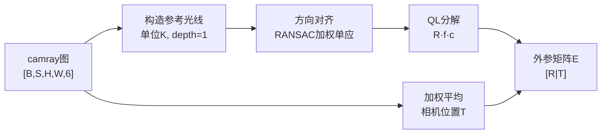

# 第二章：深度光线表示——统一单目与多视角

> 本章介绍 DA3 最核心的技术贡献：depth-ray representation（深度光线表示）。读完本章你将理解：为什么一个 6 维的每像素向量能同时表达深度和相机位姿，DualDPT 辅助头输出的 7 个数字分别是什么，以及 RANSAC 加 QL 分解如何把这张光线图还原成旋转矩阵、焦距和主点。

---

## 从像素到三维点：相机几何回顾

在进入 DA3 的表示设计之前，先把相机成像的数学确立清楚——后面所有推导都会用到这个基础。

一台针孔相机把三维空间的点投影到图像平面的过程由两组参数控制。

**内参**（intrinsics）描述像素坐标系与相机坐标系的关系，标准形式是

$$
K = \begin{bmatrix} f_x & 0 & c_x \\ 0 & f_y & c_y \\ 0 & 0 & 1 \end{bmatrix}
$$

其中 $f_x, f_y$ 是以像素为单位的焦距，$(c_x, c_y)$ 是主点（光轴与图像面的交点）。这四个数是可以标定测量的物理量，不是模型的输出——这里要把"用户可以调的物理参数 $f_x$"和"模型内部推算的归一化焦距"区分开，第五章介绍 CameraEnc 时这个区分会更重要。

**外参**（extrinsics）描述相机在世界坐标系中的位置和朝向，通常写成 $4\times4$ 的齐次矩阵

$$
\mathbf{E} = \begin{bmatrix} \mathbf{R} & \mathbf{t} \\ \mathbf{0}^\top & 1 \end{bmatrix}
$$

其中 $\mathbf{R} \in \text{SO}(3)$ 是旋转矩阵，$\mathbf{t} \in \mathbb{R}^3$ 是相机原点在世界坐标系中的位置（也称为 $c2w$ 的平移列）。

给定一个图像像素 $(u, v)$ 和该像素对应的深度 $d$，还原出世界坐标系中的三维点 $\mathbf{P}$ 需要两步：

$$
\mathbf{p}_c = d \cdot K^{-1} \begin{bmatrix} u \\ v \\ 1 \end{bmatrix}, \qquad \mathbf{P} = \mathbf{R}\,\mathbf{p}_c + \mathbf{t}
$$

第一步把像素坐标反投影成相机坐标系中的三维点；第二步把相机坐标系下的点转换到世界坐标系。

这个公式有一个关键的结构：$K^{-1}[u, v, 1]^\top$ 是一个单位方向向量（归一化后），乘以深度 $d$ 才得到有意义的三维坐标。换句话说，**深度 $d$ 只告诉你"沿这条光线走了多远"，光线的方向本身由内参和像素位置共同决定**。

---

## 深度预测为什么不够用

传统做法是让模型直接预测一张深度图 $D \in \mathbb{R}^{H \times W}$，再配合已知的内参和外参还原三维点。这个思路有两个根本缺陷。

**缺陷一：深度图依赖已知内参。** 如果内参未知或不准，即便深度值完全正确，还原出来的三维点也会整体畸变——所有点都沿错误的光线方向偏移。单目深度模型预测的是"相对深度"，需要额外一步配合内参才能变成三维坐标。

**缺陷二：多视角之间没有几何约束语言。** 当你把多张图的深度图放在一起，各图的深度值是在各自的相机坐标系下定义的，没有共同的参考系。要融合它们必须先知道各相机之间的位姿关系——而这正是你希望模型同时估计的。

这就出现了"鸡生蛋"的循环：没有位姿你无法统一多视角深度，没有统一的深度你又无法估计位姿。

DA3 的深度光线表示打破了这个循环，方法是让模型预测的东西**同时包含深度和方向信息**。

---

## 深度光线（camray）：6 维每像素向量

DA3 辅助头输出的预测目标叫做 **camray**，它是一个每像素 6 维向量：

$$
\mathbf{r}_{uv} = \underbrace{(\hat{d}_x,\; \hat{d}_y,\; \hat{d}_z)}_{\text{光线方向}} \;\|\; \underbrace{(t_x,\; t_y,\; t_z)}_{\text{相机位置}}
$$

前 3 维是该像素对应光线在某个公共参考系中的单位方向向量，后 3 维是该视角的相机原点在同一参考系中的坐标。

直觉上理解：如果你知道每个像素的光线从哪里出发（$\mathbf{t}$），朝哪里走（$\hat{\mathbf{d}}$），再乘以深度 $d$，就得到了世界空间中的三维点。公式完全对应上一节的 unprojection：

$$
\mathbf{P} = \mathbf{t} + d \cdot \hat{\mathbf{d}}
$$

**这个设计满足的不变量是：** 三维点 $\mathbf{P}$ 必须同时对所有视角的 camray 和深度自洽——即同一个三维点在不同视角的 camray 下投影到不同像素，但由两条光线推算出的三维坐标应该完全相同。这个多视角一致性约束不需要手工设计损失函数，直接蕴含在预测目标的结构里。

### 为什么是 6 维而不是 3 维？

只预测光线方向（3 维）无法确定相机在世界空间中的平移。光线方向携带的是相机的旋转信息：旋转不同的两台相机，朝同一个三维点看，它们的光线方向不同。但是两台相机如果只是平移了（朝向完全相同），光线方向就会一模一样——只凭方向无法区分这两种情况。

后 3 维的相机位置 $\mathbf{t}$ 就是为了填补这个空缺：它让模型同时约束旋转（体现在方向上）和平移（直接给出）。

### 归一化坐标系

代码里的 camray 使用了一个归一化的坐标系（`ixt_normalized=True`），把图像平面归一化为 $[-1, 1]^2$ 的正方形而不是实际像素坐标。这样做的好处是让不同分辨率的图片用同一套坐标表示，不需要担心像素数量变化导致的尺度差异。

具体地，归一化图像坐标 $(x_n, y_n)$ 对应像素坐标 $(u, v)$ 的关系是

$$
x_n = \frac{2u}{W} - 1, \qquad y_n = \frac{2v}{H} - 1
$$

后面的 QL 分解输出的焦距和主点也都在这个归一化坐标系下，需要乘以 $W/2$ 和 $H/2$ 才能转换成像素单位的内参。

---

## DualDPT 辅助头：7 维输出

camray 的预测由 DualDPT 解码头中的辅助分支完成。该分支的输出维度固定为 **7**：

$$
\text{aux output} = [\underbrace{r_1, r_2, r_3, r_4, r_5, r_6}_{\text{camray}(6)},\; \underbrace{c}_{\text{置信度}(1)}]
$$

前 6 维对应光线方向和相机位置，第 7 维是该像素预测的置信度分数。置信度的作用贯穿整个位姿恢复流程：

- 在 RANSAC 采样时，高置信度的像素优先被选为候选点
- 在计算相机位置 $\mathbf{t}$ 时，使用置信度加权平均：$\mathbf{t} = \sum_i c_i \mathbf{r}_i^{(3:6)} \big/ \sum_i c_i$

置信度的设计逻辑是：网络对纹理丰富、遮挡少的区域预测更可靠，这些区域的 camray 应该对位姿估计有更大权重。

主深度头的输出是 2 维（深度 1 维 + 深度置信度 1 维），辅助头输出是 7 维——两个头共享同一个 4 尺度特征金字塔，但有各自独立的融合块（DualDPT 里两套 refinenet 是完全分开的，不是共享的）。这个架构细节放到第四章再展开。

---

## 从 camray 到位姿：三步还原

给定一张预测的 camray 图（形状 `[B, S, H, W, 6]`），DA3 用以下三步还原出旋转矩阵 $\mathbf{R}$、焦距 $(f_x, f_y)$ 和主点 $(c_x, c_y)$。

### 步骤一：建立参考光线

代码先用一个"单位相机"（$K = I$，$c_x = c_y = 1$，$depth = 1$）把图像平面上的每个 patch 中心反投影成一组参考光线。这些参考光线对应"如果相机没有任何旋转、焦距归一化为 1 时，各像素应该看到的方向"。

这一步的目的是建立一个与预测 camray 比较的基准——只要能把预测 camray 的前 3 维和参考光线对齐起来，就能算出这台相机相对于单位相机的旋转 $\mathbf{R}$ 以及真实焦距。

### 步骤二：RANSAC 加权单应估计

把参考光线和预测 camray 前 3 维都除以 $z$ 分量，投影到"归一化像平面"：

$$
\tilde{\mathbf{p}} = (x/z,\; y/z) \in \mathbb{R}^2
$$

然后用 RANSAC 求一个 $3\times3$ 单应矩阵 $H$，使 $H \cdot \tilde{\mathbf{p}}_{\text{ref}} \approx \tilde{\mathbf{p}}_{\text{pred}}$（加权最小二乘，权重为置信度）。

RANSAC 的外点剔除发挥关键作用：天空像素、遮挡边缘、镜面反射区域的 camray 预测通常噪声很大，单应估计如果不剔除这些外点会被严重拉偏。实现上每轮从置信度最高的前 20% 像素中随机采 8 个点，共跑 100 轮，保留内点加权得分最高的 $H$。

### 步骤三：QL 分解还原旋转和内参

从单应矩阵 $H$ 中分解出旋转和内参用的是 QL 分解（QR 分解的变种，从右往左分解）。

设 $H = \mathbf{K}' \mathbf{R}$，其中 $\mathbf{K}'$ 是待求的内参矩阵（上三角），$\mathbf{R}$ 是旋转矩阵（正交）。这个分解等价于对 $H$ 做 QR 分解，然后翻转：

$$
\tilde{H} = P H P, \quad \tilde{H} = \tilde{Q} \tilde{L}
$$

其中 $P$ 是反对角置换矩阵（把矩阵左右翻转），$\tilde{L}$ 是上三角矩阵。翻转回来后，$Q = \tilde{Q} P$ 就是旋转矩阵，$L = P \tilde{L} P$ 的对角元素给出了 $f_x, f_y$ 和 $c_x, c_y$ 的信息：

$$
f_x = 1 / L_{00}, \qquad f_y = 1 / L_{11}, \qquad c_x = L_{02} + 1, \qquad c_y = L_{12} + 1
$$

（加 1 是因为归一化坐标系的原点在 $[-1,1]^2$ 的中心，而标准内参习惯以图像左上角为原点。）

最终，外参矩阵由旋转和位置拼成：

$$
\mathbf{E} = \begin{bmatrix} \mathbf{R} & \mathbf{t} \\ \mathbf{0}^\top & 1 \end{bmatrix}, \qquad \mathbf{t} = \frac{\sum_i c_i \mathbf{r}_i^{(3:6)}}{\sum_i c_i}
$$

代码中 `affine_inverse` 紧接着把 $w2c$ 转回 $c2w$，因为 camray 是在世界空间中定义的。

---

## 一个具体例子

假设只有一台正前方相机，图像分辨率 $518 \times 518$，焦距 $f = 500$ 像素，主点在图像中心。

图像左上角的像素 $(0, 0)$ 对应的归一化坐标是 $(-1, -1)$，反投影后的相机空间方向向量是

$$
\hat{\mathbf{d}}_{\text{cam}} \propto K^{-1} \begin{bmatrix} 0 \\ 0 \\ 1 \end{bmatrix} = \begin{bmatrix} (0 - 259) / 500 \\ (0 - 259) / 500 \\ 1 \end{bmatrix} = \begin{bmatrix} -0.518 \\ -0.518 \\ 1 \end{bmatrix}
$$

归一化得 $\hat{\mathbf{d}}_{\text{cam}} = (-0.427, -0.427, 0.824)$。

如果这台相机的外参是单位矩阵（即与世界坐标系对齐），那么 camray 的前 3 维就是 $(-0.427, -0.427, 0.824)$，后 3 维是 $(0, 0, 0)$（相机在世界坐标系原点）。

现在如果另一台相机绕 $z$ 轴旋转了 30°，其左上角像素的光线方向在世界空间中就变了——QL 分解正是从所有像素光线方向的整体分布中，把这个 30° 旋转解出来。

---

## 与单独预测深度+位姿的对比

理解了 camray 的结构，就能看出它和"分开预测深度图与旋转向量"的本质区别。

| 方案 | 深度 | 位姿 | 多视角几何约束 |
|------|------|------|----------------|
| 传统多头 | 独立深度头 | 独立旋转头 | 需要额外对齐损失 |
| camray | 主头 depth | 从辅助头 camray 导出 | 内嵌在表示里，无需额外损失 |

传统多头方案的问题在于：深度头对位姿一无所知，位姿头对深度一无所知，两者在几何上没有硬约束。在训练时需要仔细调多任务损失的权重，在推理时两者的预测可能相互矛盾（比如位姿对但深度不自洽，或者反过来）。

camray 把这个矛盾消除了：**如果光线方向预测正确，从光线反算出来的位姿就自动和深度在几何上一致**。两个任务变成了同一个预测目标的两个投影面，不可能矛盾。

这也是为什么 DA3 的辅助头是独立的完整融合链而不是主头的一个分支输出：辅助头需要能独立学好光线方向，而光线方向和深度在数值上的量纲、分布都很不一样（方向是单位向量，深度是正数），共享解码逻辑会互相干扰。

---

## 三相机场景中的 camray

回到贯穿全系列的三相机机器人场景：左、正前、右三台相机。

当 DA3 同时处理这三张图时，辅助头为每张图独立输出一张 camray 图，形状是 `[B, 3, H, W, 7]`。三张 camray 图的前 3 维（光线方向）都在同一个世界坐标系中，所以直接可以用来比较三台相机的相对朝向——左相机的光线方向整体偏右，右相机的整体偏左。

pose recovery 在 `[B, 3, H, W, 7]` 这个 batch 维度上批量运行，每台相机各自走一遍 RANSAC + QL 分解流程，输出各自的外参和内参。如果提前知道三相机的标定参数，这一步可以被跳过（直接把已知外参编码进 CameraEnc，第五章详细介绍）。

---

## 本章小结

depth-ray 表示的设计逻辑是：把"每个像素对应什么三维点"这件事分解成"沿哪条光线"（前 3 维方向 + 后 3 维位移）和"沿这条光线走多远"（主头深度），两部分分开预测但共享同一套几何坐标系。方向信息隐含了相机位姿，RANSAC + QL 分解负责把这个隐含信息提取成显式的 $\mathbf{R}$、$f_x$、$f_y$、$c_x$、$c_y$、$\mathbf{t}$。

整条流程中没有任何"先估位姿再估深度"或"先估深度再估位姿"的先后顺序——两者是同一次前向推断的不同输出，在几何上天然自洽。

下一章进入 backbone：同样的 ViT 如何在看到多张图的 token 时，自然而然地学会跨视角对应——不需要代价体，不需要专用匹配模块。

::: details 📎 知识链接

- [相机模型与坐标系全链路](/系列/3dgs_from_scratch/04_相机模型与坐标系全链路) — 内参 $K$、外参 $\mathbf{E}$、齐次坐标的完整推导
- [第一章：深度估计的困境与 DA3 的答案](./01_深度估计的困境与DA3的答案) — DA3 总体设计逻辑与本表示的动机
- [第三章：Backbone 带跨视角注意力的 DINOv2](./03_Backbone_带跨视角注意力的DINOv2) — camray 是由 backbone 之后的 DualDPT 辅助头产生的
- [第四章：DualDPT 解码头](./04_DualDPT解码头_深度主头与光线辅助头) — 辅助头的具体网络结构和 7 维输出细节

:::
