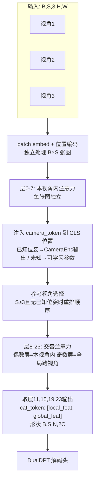

# 第三章：Backbone——带跨视角注意力的 DINOv2

> 本章回答一个问题：标准 DINOv2 每次只处理一张图，DA3 如何让它同时处理多张图并让它们相互"看到"彼此？答案是对注意力模式做一个最小改动，再加两个工程细节：camera token 和参考视角选择。读完本章你会知道这三件事各自解决什么问题、为什么这样设计而不是其他方案。

---

## 标准 ViT 的局限：每帧独立

Vision Transformer 的注意力是在一张图的所有 patch token 之间计算的。每张图独立处理，各图的 token 序列互不相见。这对单张图的语义理解已经足够，但对多视角几何任务来说是致命的——要估计两张图之间的几何关系，模型必须能同时"看到"两张图的内容。

传统解法是在 ViT 之外额外设计跨视角匹配模块：代价体（cost volume）、特征匹配层、跨视角 transformer 等。这些模块增加了大量专用参数，而且通常只能处理固定数量的视角（比如只支持双目，或只支持三视角）。

DA3 的解法更直接：**直接修改 ViT 内部的注意力计算方式**，让多张图的 token 在同一个注意力操作里互相可见。改动量极小，但效果是本质性的。

---

## 交替注意力（Alternating Attention）

DA3 在 ViT 的后半段引入了一种注意力交替模式，由参数 `alt_start` 控制：层编号小于 `alt_start` 的块做普通的单图注意力，从 `alt_start` 层开始，奇数层变成跨所有视角的全局注意力。

以 ViT-Large（24 层，`alt_start=8`）为例：

```
层 0–7：  本视角内注意力（local attention）
层 8：    ← alt_start，注入 camera token（见下节）
层 8（偶数）：本视角内注意力
层 9（奇数）：全局跨视角注意力 ← 首次跨视角
层 10（偶数）：本视角内注意力
层 11（奇数）：全局跨视角注意力
...（交替到第 23 层）
```

两种注意力的计算方式完全不同：

**本视角内注意力（local）**：把 `[B, S, N, C]` 的 token 张量沿批量和视角维度合并成 `[B×S, N, C]`，让每张图的 N 个 token 只在自身内部做注意力。这和标准 ViT 完全等价，相当于 S 张图并行独立地跑同一个注意力块。

**全局跨视角注意力（global）**：把 `[B, S, N, C]` 沿 token 维度合并成 `[B, S×N, C]`，让一个 batch 里所有视角的全部 token 都参与同一次注意力。一个 token 可以直接 attend 到另一张图上任意位置的 token。

这就是 `process_attention` 函数里两条 `rearrange` 路径的区别：

```python
# vision_transformer.py:335
if attn_type == "local":
    x = rearrange(x, "b s n c -> (b s) n c")   # 合并B和S
elif attn_type == "global":
    x = rearrange(x, "b s n c -> b (s n) c")    # 合并S和N
```

### 为什么是交替而不是全程全局？

全程用全局注意力在计算量上不现实：N 个 token 的注意力复杂度是 $O(N^2)$，S 张图全局注意力的复杂度是 $O((SN)^2) = O(S^2 N^2)$，三张图就是 9 倍。

更重要的是：前几层的局部注意力负责提取每张图自身的特征（边缘、纹理、语义），这些特征不需要跨视角信息就能学好；后半段的全局注意力负责把这些已经成熟的特征在跨视角空间里比对、关联。两个阶段的职责不同，混在一起反而互相干扰。

交替模式是一个折中：每隔一层做一次全局注意力，既保持跨视角信息流通，又不在每层都付出 $O(S^2 N^2)$ 的代价。

### 三相机场景里的 token 规模

DA3-Large 在 $518 \times 518$ 分辨率下，每张图产生 $37 \times 37 = 1369$ 个 patch token。三台相机合并后全局注意力的序列长度是 $3 \times 1369 = 4107$。注意力矩阵 $4107^2 \approx 1690$ 万个元素，这就是为什么 DA3 在多视角推理时内存占用显著高于单图模式。

---

## Camera Token：注入位姿先验

`alt_start` 层做的第一件事不是跨视角注意力，而是把 `camera_token` 写入每张图的 CLS 位置（序列第 0 个 token）：

```python
# vision_transformer.py:310
if self.alt_start != -1 and i == self.alt_start:
    if kwargs.get("cam_token", None) is not None:
        cam_token = kwargs.get("cam_token")  # 已知位姿：来自 CameraEnc
    else:
        ref_token = self.camera_token[:, :1].expand(B, -1, -1)   # 参考视角用 token 0
        src_token = self.camera_token[:, 1:].expand(B, S-1, -1)  # 其余视角用 token 1
        cam_token = torch.cat([ref_token, src_token], dim=1)
    x[:, :, 0] = cam_token
```

这里有两条路径：

**已知位姿路径**：如果调用时传入了外参和内参，CameraEnc（第五章）已经把位姿信息编码成 `cam_token`，形状 `[B, S, C]`。直接把这组 token 覆盖到各视角的 CLS 位置，backbone 就能在跨视角注意力时"读到"每台相机的方位。

**未知位姿路径**：如果没有位姿，用一对可学习参数 `self.camera_token`（形状 `(1, 2, C)`）来区分"参考视角"和"非参考视角"两种角色。参考视角用 `camera_token[0]`，其余所有视角用 `camera_token[1]`。

第二条路径看上去信息量很少——只有"我是参考视角"和"我不是参考视角"两种状态——但这已经足够让模型学会一件重要的事：在未知位姿时建立一个相对参考系。参考视角的坐标系成为隐式原点，其他视角的 camray 都相对于它定义。

### 为什么用 CLS 位置？

CLS token 在 ViT 里的作用是作为全局语义摘要——它在每层注意力中都能 attend 到所有 patch token，因此它的特征相当于整张图的压缩表示。用 CLS 来携带位姿信息，意味着在每次全局注意力时，一张图的位姿信息（CLS）会和另一张图的所有 patch token 进行交互。这让位姿信息的传播路径最短：不需要从某个角落的 patch token 慢慢传播到全局，而是直接从全局摘要位置广播出去。

---

## RoPE：位置编码的升级

从 `rope_start` 层（DA3-Large 也是第 8 层）开始，注意力里的 QK 乘积使用 2D 旋转位置编码（Rotary Position Embedding，RoPE）而不是绝对位置编码。

标准 ViT 在输入时把一个固定的绝对位置编码加到每个 patch token 上。这个做法在单图场景够用，但有两个问题：

- 对分辨率变化不友好：训练时学了 $37 \times 37$ 的位置，推理时如果换了分辨率，需要插值，位置编码的准确性会下降。
- 在全局注意力中，两张图的 token 混在同一个序列里，绝对位置编码只能告诉模型"这个 token 在自己图里的位置"，但不能编码"这个 token 来自哪张图"这一信息。

RoPE 的思路不同：不是把位置信息加到 token 上，而是直接在 Q 和 K 的点积里加入相对位置偏置——具体是通过把 Q 和 K 乘以一个依赖位置的复数旋转矩阵，让注意力分数自然体现两个 token 的相对空间距离。

在本视角内注意力时，RoPE 用实际的 2D 坐标（从 `position_getter` 获取）。在全局跨视角注意力时，RoPE 用全零坐标（`pos_nodiff`）——这意味着跨视角注意力不引入 2D 位置偏置，让模型自由地在所有视角 token 之间做无偏的全局匹配。

### qk_norm

从 `qknorm_start`（同样是第 8 层）开始，注意力的 Q 和 K 在点积之前会先做 LayerNorm。这是为了稳定从绝对位置编码切换到 RoPE 之后的训练。没有归一化时，RoPE 引入的旋转可能使 QK 点积的方差突然增大，导致注意力分布过于尖锐或过于平坦。qk_norm 把 Q 和 K 的范数固定在一个稳定的范围内。

---

## 参考视角选择

当 `S >= 3`（视角数量达到阈值 `THRESH_FOR_REF_SELECTION = 3`）且没有提供已知位姿时，backbone 在进入 `alt_start` 层之前会自动选出一个"参考视角"，把它换到序列的第 0 个位置。

这个选择逻辑在 `select_reference_view` 里实现。默认策略是 `saddle_balanced`：

1. 提取每张图的 CLS token 作为该视角的全局特征表示，归一化
2. 计算 $S \times S$ 的视角间相似度矩阵
3. 对每张图计算三个分数：与其他视角的平均相似度、特征范数、特征方差
4. 把三个分数都归一化到 $[0, 1]$，然后选距离中值（0.5）最近的那个视角

这个策略的逻辑是：选一个"居中"的视角——既不是跟所有其他视角都最相似的（视野重叠太多，缺乏信息补充），也不是跟其他视角都最不像的（太极端，可能导致参考坐标系不稳定）。选出来的视角是"最有代表性"的那个。


选好参考视角后，输出特征在返回时会用 `restore_original_order` 恢复回原来的顺序，所以调用方不需要感知这个内部重排。

在三相机机器人场景里，正前方相机通常会被选为参考视角——它的视野和左右相机都有重叠，特征相似度处于中间水平，符合 `saddle_balanced` 的选择标准。

---

## 输出：cat_token 双通道特征

DA3-Large 的最后 4 层（层 11、15、19、23，由 `out_layers` 控制）的特征会被输出给 DualDPT 解码头使用。每层输出的不是单一特征，而是把本视角内注意力特征和全局注意力特征沿通道维度拼接在一起（`cat_token=True`）：

```python
# vision_transformer.py:327
out_x = torch.cat([local_x, x], dim=-1) if self.cat_token else x
```

其中 `local_x` 保存的是该层做本视角内注意力之后的结果，`x` 是后续全局注意力之后的结果（奇数层）。拼接后每个 token 的特征维度是 $2C$（DA3-Large 是 $2 \times 1024 = 2048$），这也是为什么 DualDPT 的 `dim_in=2048`。

两组特征的语义不同：`local_x` 偏向单图的纹理/几何细节，`x` 偏向跨视角的对应关系。把两者都送给解码头，让它能同时利用局部细节和跨视角关系来估计深度。

---

## 整体数据流图



---

## 与专用跨视角模块的对比

| 方案 | 跨视角机制 | 额外参数 | 视角数量限制 |
|------|-----------|---------|------------|
| 代价体（MVSNet类） | 特征相关性体素 | 多，视角数固定 | 通常固定（如3或5） |
| 跨视角 Transformer（VGGT类） | 专用 cross-attn 块 | 中，但专门设计 | 训练时固定 |
| DA3 交替注意力 | ViT 内部注意力模式切换 | 极少（仅 camera_token 2×C） | 任意（S≥1均可） |

DA3 方案的核心优势是：**继承了 DINOv2 在 ImageNet-22k 上预训练的全部视觉表征能力**，跨视角匹配能力是在这个已经很强的基础上微调出来的，而不是从零训练的专用模块。DINOv2 已经学会了语义对应（不同图里同一类物体的 token 相似）——交替注意力只是给了它一个直接施展这种能力的机会。

---

## 本章小结

DA3 对标准 DINOv2 做了三处改动，每处改动解决一个具体问题：

交替注意力（`alt_start`）让多视角 token 在后半段能互相 attend，是跨视角几何理解的基础。Camera token 把位姿信息注入 CLS 位置，让已知位姿（来自 CameraEnc）或未知位姿（参考/非参考角色区分）都能被 backbone 感知。RoPE 在本视角内注意力时提供精确的 2D 空间关系编码，在跨视角注意力时退出以允许自由匹配。

这三处改动加在一起，没有改变 ViT 的基本架构，没有引入大量新参数，却让 ViT 从"只能看一张图"变成了"能同时处理任意多张图的几何推理器"。

下一章看 backbone 输出之后的事情：DualDPT 怎么把四个尺度的特征金字塔融合成最终的深度图和 camray 图。

::: details 📎 知识链接

- [Vision Transformer：图像怎么变成一串 Token](/前置知识/003g_前置知识_Vision_Transformer图像分块与位置编码) — patch embedding、CLS token、注意力机制基础
- [第二章：深度光线表示](./02_深度光线表示_统一单目与多视角) — camray 是 DualDPT 辅助头的输出，本章 backbone 输出的特征送给 DualDPT
- [第五章：相机编解码器](./05_相机编解码器_位姿怎么进出模型) — CameraEnc 产生的 cam_token 在本章 `alt_start` 层被注入

:::
